# 数据流图（dataflowgraph）运营态全景

> 生成时间: 2026-08-01T22:11:49
> 真源: `dataflow_graph_registry.yaml`（13 个真实 Job/Dataset）→ PostgreSQL `dataflow_*` 表（ARCH-051）
> 注: `dataflow_jobs` 另含 `entity_type='module_placeholder'` 占位记录（`sync_panorama_module.py` 从 depgraph 模块派生，用于四图对齐 ARCH-056，非数据流作业，本文档不展示）
> 数据库: depgraph (PostgreSQL)
> 生成器: `scripts/governance/d5_architecture/generators/generate_dataflow_diagram.py`（全文自动生成，禁止手工编辑）

> **[可缩放 HTML 版 / Zoomable HTML](http://localhost:8765/docs/02_enterprise_architecture/05_dataflow_architecture/_zoomable_html/dataflow_production.html)** — Ctrl+滚轮缩放 ｜ 双击重置 ｜ Ctrl+Shift+D 切换拖动/选择模式

## 概述

数据流图（dataflowgraph）是与依赖图（depgraph）正交的第三维度全景图。
- depgraph 表达"谁依赖谁"（模块依赖）
- dataflowgraph 表达"数据从哪流到哪"（数据流向）
- 通过 `Job.source_code_ref` 引用 depgraph 模块 path，建立跨图关联

## 域基本信息 / Overview

| 字段 | 值 | Field | Value |
|------|------|-------|-------|
| Dataset 数 | 14 | Datasets | 14 |
| Job 数 | 13 | Jobs | 13 |
| Edge 数 | 90 | Edges | 90 |
| 运营态 Dataset | 14 | Production Datasets | 14 |
| 设计态 Dataset | 0 | Design Datasets | 0 |
| 运营态 Job | 13 | Production Jobs | 13 |
| 设计态 Job | 0 | Design Jobs | 0 |

## 统计

| 类型 | 生产 (production) | 回测内部 (backtest_internal) | 合计 |
|------|-------------------|------------------------------|------|
| Dataset | 10 | 4 | 14 |
| Job | 8 | 5 | 13 |
| Edge | - | - | 90 |

### 设计态 / 运营态统计（design_maturity）

| 类型 | 运营态 (production) | 设计态 (design) | 合计 |
|------|---------------------|-----------------|------|
| Dataset | 14 | 0 | 14 |
| Job | 13 | 0 | 13 |

> **设计态 vs 运营态 / Design vs Production**：`design_maturity` 字段区分——`design`=蓝图规划（代码未写），`production`=实际代码已实现稳定运行。对标 depgraph 的设计态/运营态机制（decision_index.md）。

## 数据流图

> **图例说明 / Legend**：
>
> - 🟦 **蓝色 = 运营态节点**（production，已上线运行）
> - 🟧 **橙色虚线 = 设计态节点**（design，蓝图阶段，代码未写）
> - 🟦更浅蓝 = 跨域外部 Dataset（external_prod/external_design）
> - **实线箭头 ``-->`` = 运营态数据流**（两端均 production）
> - **虚线箭头 ``-.->`` = 非运营态数据流**（含 design、混合）
> - 矩形 = Dataset（数据集）/ 圆角矩形 = Job（作业）
> - ``JOB -->|produces / 产出| DS`` = Job 产出 Dataset
> - ``DS -->|consumed by / 被消费于| JOB`` = Job 消费 Dataset

### 全景图（全部模块，颜色区分运营态/设计态）

> 展示全部 27 个节点（Dataset 14 + Job 13），含 28 条边。颜色区分运营态（蓝）/设计态（橙虚线）。

### 运营态的图（仅 design_maturity=production）

> 仅展示已实现稳定运行的节点（运营态：14 datasets / 数据集, 13 jobs / 作业, 28 edges / 边）。

```mermaid
%%{init: {'theme': 'base', 'themeVariables': {'primaryColor': '#eaeaea', 'primaryTextColor': '#333333', 'primaryBorderColor': '#666666', 'lineColor': '#666666', 'secondaryColor': '#eaeaea', 'tertiaryColor': '#eaeaea', 'clusterBkg': 'transparent', 'clusterBorder': 'transparent', 'fontSize': '14px'}}}%%
flowchart TD
    DS16835["(生产态 / production) backtest.fills /<br/>回测.模拟成交<br/>回测模拟成交（symbol/quantity/price/commission<br/>/slippage），撮合引擎产出<br/>契约: - · 域: 回测"]
    DS16836["(生产态 / production) backtest.nav_series /<br/>回测.净值序列<br/>回测净值序列（timestamp/nav/cash<br/>/positions），组合更新产出<br/>契约: - · 域: 回测"]
    DS16834["(生产态 / production) backtest.target_weights /<br/>回测.目标权重<br/>回测目标权重（symbol/target_weight<br/>/timestamp），策略根据tick事件生成<br/>契约: - · 域: 回测"]
    DS16833["(生产态 / production) backtest.tick_event /<br/>回测.Tick事件<br/>回测Tick事件（历史tick重放，含timestamp/symbol<br/>/price/volume），回测内部类型<br/>契约: - · 域: 回测"]
    DS16832["(生产态 / production) backtest.result /<br/>回测.结果<br/>回测结果（nav_series/sharpe/max_drawdown<br/>/trades），CTR-P1-016 BacktestResult<br/>契约: CTR-P1-016 · 域: 回测"]
    DS16826["(生产态 / production) factor.momentum_20d /<br/>因子.20日动量<br/>20日动量因子信号（factor_id/symbol/as_of_date<br/>/raw_value/rank_pct），CTR-002 FactorSignal<br/>契约: CTR-002 · 域: 因子"]
    DS16825["(生产态 / production) factor.value_factor /<br/>因子.价值因子<br/>价值因子信号（factor_id/symbol/as_of_date/raw_<br/>value/normalized_value），CTR-002 FactorSignal<br/>契约: CTR-002 · 域: 因子"]
    DS16830["(生产态 / production) fill.executed /<br/>成交.已成交<br/>成交回报（symbol/quantity/price/commission<br/>/timestamp），CTR-005 Fill<br/>契约: CTR-005 · 域: 执行核心"]
    DS16824["(生产态 / production) market_data.ohlc_bar /<br/>市场数据.OHLC K线<br/>聚合OHLC K线（1m/5m/日线，由tick聚合），CTR-001<br/>derived<br/>契约: CTR-001 · 域: 行情数据"]
    DS16823["(生产态 / production) market_data.tick /<br/>市场数据.Tick行情<br/>标准化Tick行情（symbol/timestamp/OHLCV/quality_<br/>score），CTR-001 NormalizedMarketData<br/>契约: CTR-001 · 域: 行情数据"]
    DS16829["(生产态 / production) order.target /<br/>订单.目标订单<br/>目标订单（symbol/side/quantity/price/order_<br/>type），CTR-004 Order<br/>契约: CTR-004 · 域: 组合核心"]
    DS16831["(生产态 / production) position.snapshot /<br/>持仓.快照<br/>持仓快照（symbol/quantity/avg_cost/market_value<br/>/timestamp），CTR-006 PositionSnapshot<br/>契约: CTR-006 · 域: 执行核心"]
    DS16828["(生产态 / production) risk.limits / 风险.限额<br/>风险限额（max_position/max_drawdown/exposure_<br/>limits），CTR-003 RiskLimits<br/>契约: CTR-003 · 域: 风控"]
    DS16827["(生产态 / production) signal.composite /<br/>信号.合成信号<br/>合成交易信号（多因子加权/截面排名<br/>/置信度），CTR-P1-015 SynthesizedSignal<br/>契约: CTR-P1-015 · 域: 信号遗留设计态"]
    JOB859267("(生产态 / production) backtest.calc_metrics /<br/>回测.计算指标<br/>回测指标计算（Sharpe/MaxDrawdown<br/>/胜率等，含DSR修正+PIT校验），产出DS-010<br/>backtest.result<br/>文件: backtest/metrics.py")
    JOB859265("(生产态 / production) backtest.match_fills /<br/>回测.撮合成交<br/>回测撮合引擎（根据目标权重模拟成交，含滑点<br/>/手续费），产出DS-013 backtest.fills<br/>文件: backtest/matching_logic.py")
    JOB859263("(生产态 / production) backtest.replay_ticks /<br/>回测.Tick重放<br/>历史Tick重放<br/>（从DS-001读取历史tick，按时间顺序重放），产出DS<br/>-011 backtest.tick_event<br/>文件: backtest/tick_replay.py")
    JOB859264("(生产态 / production) backtest.run_event_driven<br/>/ 回测.事件驱动运行<br/>事件驱动回测引擎<br/>（消费tick事件，运行策略生成目标权重），产出DS-0<br/>12 backtest.target_weights<br/>文件: backtest/event_engine.py")
    JOB859266("(生产态 / production) backtest.update_portfolio<br/>/ 回测.更新组合<br/>回测组合更新（根据成交更新持仓/现金<br/>/净值），产出DS-014 backtest.nav_series<br/>文件: backtest/portfolio.py")
    JOB859256("(生产态 / production) aggregate.ohlc_bar /<br/>聚合.OHLC K线<br/>将Tick数据聚合为OHLC K线（1m/5m<br/>/日线），产出DS-002 market_data.ohlc_bar<br/>文件: data/aggregator.py")
    JOB859260("(生产态 / production) check.risk_limits /<br/>检查.风险限额<br/>风险限额检查（持仓/回撤/暴露度），产出DS-006<br/>risk.limits<br/>文件: risk/risk_checker.py")
    JOB859258("(生产态 / production) compute.momentum_20d /<br/>计算.20日动量<br/>计算20日动量因子（收益率/相对强度），产出DS-004<br/>factor.momentum_20d<br/>文件: factor/momentum.py")
    JOB859257("(生产态 / production) compute.value_factor /<br/>计算.价值因子<br/>计算价值因子（PE/PB/股息率等），产出DS-003<br/>factor.value_factor<br/>文件: factor/value_factor.py")
    JOB859262("(生产态 / production) execute.order / 执行.订单<br/>执行订单（实盘/模拟），产出DS-008 fill.executed<br/>+ DS-009 position.snapshot<br/>文件: ex_core/executor.py")
    JOB859261("(生产态 / production) generate.order / 生成.订单<br/>根据信号+风险限额生成目标订单，产出DS-007<br/>order.target<br/>文件: pf_core/order_generator.py")
    JOB859255("(生产态 / production) ingest.ifind_kline /<br/>采集.iFind行情<br/>从同花顺iFind THS_RQ接口采集K线<br/>/Tick行情数据，写入DS-001 market_data.tick<br/>文件: data/ingest_ifind.py")
    JOB859259("(生产态 / production) synthesize.signal /<br/>合成.信号<br/>合成多因子信号（加权/截面排名<br/>/置信度），产出DS-005 signal.composite<br/>文件: signal_ashare/synthesizer.py")
    JOB859255 -->|produces / 产出| DS16823
    JOB859256 -->|produces / 产出| DS16824
    JOB859257 -->|produces / 产出| DS16825
    JOB859258 -->|produces / 产出| DS16826
    JOB859259 -->|produces / 产出| DS16827
    JOB859260 -->|produces / 产出| DS16828
    JOB859261 -->|produces / 产出| DS16829
    JOB859262 -->|produces / 产出| DS16830
    JOB859262 -->|produces / 产出| DS16831
    JOB859267 -->|produces / 产出| DS16832
    JOB859263 -->|produces / 产出| DS16833
    JOB859264 -->|produces / 产出| DS16834
    JOB859265 -->|produces / 产出| DS16835
    JOB859266 -->|produces / 产出| DS16836
    DS16823 -->|consumed by / 被消费于| JOB859256
    DS16823 -->|consumed by / 被消费于| JOB859263
    DS16824 -->|consumed by / 被消费于| JOB859257
    DS16824 -->|consumed by / 被消费于| JOB859258
    DS16825 -->|consumed by / 被消费于| JOB859259
    DS16826 -->|consumed by / 被消费于| JOB859259
    DS16827 -->|consumed by / 被消费于| JOB859260
    DS16827 -->|consumed by / 被消费于| JOB859261
    DS16828 -->|consumed by / 被消费于| JOB859261
    DS16829 -->|consumed by / 被消费于| JOB859262
    DS16833 -->|consumed by / 被消费于| JOB859264
    DS16834 -->|consumed by / 被消费于| JOB859265
    DS16835 -->|consumed by / 被消费于| JOB859266
    DS16836 -->|consumed by / 被消费于| JOB859267
    JOB859256 ~~~ JOB859263
    DS16824 ~~~ DS16833
    JOB859257 ~~~ JOB859258
    JOB859258 ~~~ JOB859264
    DS16825 ~~~ DS16826
    DS16826 ~~~ DS16834
    JOB859259 ~~~ JOB859265
    DS16827 ~~~ DS16835
    JOB859260 ~~~ JOB859266
    DS16828 ~~~ DS16836
    JOB859261 ~~~ JOB859267
    DS16829 ~~~ DS16832
    DS16830 ~~~ DS16831
    classDef production fill:#e1f5fe,stroke:#01579b,stroke-width:2px,color:#000
    classDef design fill:#fff3e0,stroke:#e65100,stroke-width:2px,color:#000,stroke-dasharray: 5 5
    classDef external_prod fill:#e8f4fd,stroke:#0277bd,stroke-width:1px,color:#000
    classDef external_design fill:#fff8e7,stroke:#ef6c00,stroke-width:1px,color:#000,stroke-dasharray: 5 5
    class DS16835,DS16836,DS16834,DS16833,DS16832,DS16826,DS16825,DS16830,DS16824,DS16823,DS16829,DS16831,DS16828,DS16827,JOB859267,JOB859265,JOB859263,JOB859264,JOB859266,JOB859256,JOB859260,JOB859258,JOB859257,JOB859262,JOB859261,JOB859255,JOB859259 production
```

### 设计态的图（仅 design_maturity=design）

> （无模块 / No modules）

### 生产数据流图（scope=production，附加视图）

> 节点数: 10 datasets / 数据集, 8 jobs / 作业, 18 edges / 边

```mermaid
%%{init: {'theme': 'base', 'themeVariables': {'primaryColor': '#eaeaea', 'primaryTextColor': '#333333', 'primaryBorderColor': '#666666', 'lineColor': '#666666', 'secondaryColor': '#eaeaea', 'tertiaryColor': '#eaeaea', 'clusterBkg': 'transparent', 'clusterBorder': 'transparent', 'fontSize': '14px'}}}%%
flowchart TD
    DS16832["(生产态 / production) backtest.result /<br/>回测.结果<br/>回测结果（nav_series/sharpe/max_drawdown<br/>/trades），CTR-P1-016 BacktestResult<br/>契约: CTR-P1-016 · 域: 回测"]
    DS16826["(生产态 / production) factor.momentum_20d /<br/>因子.20日动量<br/>20日动量因子信号（factor_id/symbol/as_of_date<br/>/raw_value/rank_pct），CTR-002 FactorSignal<br/>契约: CTR-002 · 域: 因子"]
    DS16825["(生产态 / production) factor.value_factor /<br/>因子.价值因子<br/>价值因子信号（factor_id/symbol/as_of_date/raw_<br/>value/normalized_value），CTR-002 FactorSignal<br/>契约: CTR-002 · 域: 因子"]
    DS16830["(生产态 / production) fill.executed /<br/>成交.已成交<br/>成交回报（symbol/quantity/price/commission<br/>/timestamp），CTR-005 Fill<br/>契约: CTR-005 · 域: 执行核心"]
    DS16824["(生产态 / production) market_data.ohlc_bar /<br/>市场数据.OHLC K线<br/>聚合OHLC K线（1m/5m/日线，由tick聚合），CTR-001<br/>derived<br/>契约: CTR-001 · 域: 行情数据"]
    DS16823["(生产态 / production) market_data.tick /<br/>市场数据.Tick行情<br/>标准化Tick行情（symbol/timestamp/OHLCV/quality_<br/>score），CTR-001 NormalizedMarketData<br/>契约: CTR-001 · 域: 行情数据"]
    DS16829["(生产态 / production) order.target /<br/>订单.目标订单<br/>目标订单（symbol/side/quantity/price/order_<br/>type），CTR-004 Order<br/>契约: CTR-004 · 域: 组合核心"]
    DS16831["(生产态 / production) position.snapshot /<br/>持仓.快照<br/>持仓快照（symbol/quantity/avg_cost/market_value<br/>/timestamp），CTR-006 PositionSnapshot<br/>契约: CTR-006 · 域: 执行核心"]
    DS16828["(生产态 / production) risk.limits / 风险.限额<br/>风险限额（max_position/max_drawdown/exposure_<br/>limits），CTR-003 RiskLimits<br/>契约: CTR-003 · 域: 风控"]
    DS16827["(生产态 / production) signal.composite /<br/>信号.合成信号<br/>合成交易信号（多因子加权/截面排名<br/>/置信度），CTR-P1-015 SynthesizedSignal<br/>契约: CTR-P1-015 · 域: 信号遗留设计态"]
    JOB859256("(生产态 / production) aggregate.ohlc_bar /<br/>聚合.OHLC K线<br/>将Tick数据聚合为OHLC K线（1m/5m<br/>/日线），产出DS-002 market_data.ohlc_bar<br/>文件: data/aggregator.py")
    JOB859260("(生产态 / production) check.risk_limits /<br/>检查.风险限额<br/>风险限额检查（持仓/回撤/暴露度），产出DS-006<br/>risk.limits<br/>文件: risk/risk_checker.py")
    JOB859258("(生产态 / production) compute.momentum_20d /<br/>计算.20日动量<br/>计算20日动量因子（收益率/相对强度），产出DS-004<br/>factor.momentum_20d<br/>文件: factor/momentum.py")
    JOB859257("(生产态 / production) compute.value_factor /<br/>计算.价值因子<br/>计算价值因子（PE/PB/股息率等），产出DS-003<br/>factor.value_factor<br/>文件: factor/value_factor.py")
    JOB859262("(生产态 / production) execute.order / 执行.订单<br/>执行订单（实盘/模拟），产出DS-008 fill.executed<br/>+ DS-009 position.snapshot<br/>文件: ex_core/executor.py")
    JOB859261("(生产态 / production) generate.order / 生成.订单<br/>根据信号+风险限额生成目标订单，产出DS-007<br/>order.target<br/>文件: pf_core/order_generator.py")
    JOB859255("(生产态 / production) ingest.ifind_kline /<br/>采集.iFind行情<br/>从同花顺iFind THS_RQ接口采集K线<br/>/Tick行情数据，写入DS-001 market_data.tick<br/>文件: data/ingest_ifind.py")
    JOB859259("(生产态 / production) synthesize.signal /<br/>合成.信号<br/>合成多因子信号（加权/截面排名<br/>/置信度），产出DS-005 signal.composite<br/>文件: signal_ashare/synthesizer.py")
    JOB859255 -->|produces / 产出| DS16823
    JOB859256 -->|produces / 产出| DS16824
    JOB859257 -->|produces / 产出| DS16825
    JOB859258 -->|produces / 产出| DS16826
    JOB859259 -->|produces / 产出| DS16827
    JOB859260 -->|produces / 产出| DS16828
    JOB859261 -->|produces / 产出| DS16829
    JOB859262 -->|produces / 产出| DS16830
    JOB859262 -->|produces / 产出| DS16831
    DS16823 -->|consumed by / 被消费于| JOB859256
    DS16824 -->|consumed by / 被消费于| JOB859257
    DS16824 -->|consumed by / 被消费于| JOB859258
    DS16825 -->|consumed by / 被消费于| JOB859259
    DS16826 -->|consumed by / 被消费于| JOB859259
    DS16827 -->|consumed by / 被消费于| JOB859260
    DS16827 -->|consumed by / 被消费于| JOB859261
    DS16828 -->|consumed by / 被消费于| JOB859261
    DS16829 -->|consumed by / 被消费于| JOB859262
    JOB859255 ~~~ DS16832
    JOB859257 ~~~ JOB859258
    DS16825 ~~~ DS16826
    DS16830 ~~~ DS16831
    classDef production fill:#e1f5fe,stroke:#01579b,stroke-width:2px,color:#000
    classDef design fill:#fff3e0,stroke:#e65100,stroke-width:2px,color:#000,stroke-dasharray: 5 5
    classDef external_prod fill:#e8f4fd,stroke:#0277bd,stroke-width:1px,color:#000
    classDef external_design fill:#fff8e7,stroke:#ef6c00,stroke-width:1px,color:#000,stroke-dasharray: 5 5
    class DS16832,DS16826,DS16825,DS16830,DS16824,DS16823,DS16829,DS16831,DS16828,DS16827,JOB859256,JOB859260,JOB859258,JOB859257,JOB859262,JOB859261,JOB859255,JOB859259 production
```

### 回测内部数据流图（scope=backtest_internal，附加视图）

> 节点数: 4 datasets / 数据集, 5 jobs / 作业, 8 edges / 边

```mermaid
%%{init: {'theme': 'base', 'themeVariables': {'primaryColor': '#eaeaea', 'primaryTextColor': '#333333', 'primaryBorderColor': '#666666', 'lineColor': '#666666', 'secondaryColor': '#eaeaea', 'tertiaryColor': '#eaeaea', 'clusterBkg': 'transparent', 'clusterBorder': 'transparent', 'fontSize': '14px'}}}%%
flowchart TD
    DS16835["(生产态 / production) backtest.fills /<br/>回测.模拟成交<br/>回测模拟成交（symbol/quantity/price/commission<br/>/slippage），撮合引擎产出<br/>契约: - · 域: 回测"]
    DS16836["(生产态 / production) backtest.nav_series /<br/>回测.净值序列<br/>回测净值序列（timestamp/nav/cash<br/>/positions），组合更新产出<br/>契约: - · 域: 回测"]
    DS16834["(生产态 / production) backtest.target_weights /<br/>回测.目标权重<br/>回测目标权重（symbol/target_weight<br/>/timestamp），策略根据tick事件生成<br/>契约: - · 域: 回测"]
    DS16833["(生产态 / production) backtest.tick_event /<br/>回测.Tick事件<br/>回测Tick事件（历史tick重放，含timestamp/symbol<br/>/price/volume），回测内部类型<br/>契约: - · 域: 回测"]
    JOB859267("(生产态 / production) backtest.calc_metrics /<br/>回测.计算指标<br/>回测指标计算（Sharpe/MaxDrawdown<br/>/胜率等，含DSR修正+PIT校验），产出DS-010<br/>backtest.result<br/>文件: backtest/metrics.py")
    JOB859265("(生产态 / production) backtest.match_fills /<br/>回测.撮合成交<br/>回测撮合引擎（根据目标权重模拟成交，含滑点<br/>/手续费），产出DS-013 backtest.fills<br/>文件: backtest/matching_logic.py")
    JOB859263("(生产态 / production) backtest.replay_ticks /<br/>回测.Tick重放<br/>历史Tick重放<br/>（从DS-001读取历史tick，按时间顺序重放），产出DS<br/>-011 backtest.tick_event<br/>文件: backtest/tick_replay.py")
    JOB859264("(生产态 / production) backtest.run_event_driven<br/>/ 回测.事件驱动运行<br/>事件驱动回测引擎<br/>（消费tick事件，运行策略生成目标权重），产出DS-0<br/>12 backtest.target_weights<br/>文件: backtest/event_engine.py")
    JOB859266("(生产态 / production) backtest.update_portfolio<br/>/ 回测.更新组合<br/>回测组合更新（根据成交更新持仓/现金<br/>/净值），产出DS-014 backtest.nav_series<br/>文件: backtest/portfolio.py")
    JOB859263 -->|produces / 产出| DS16833
    JOB859264 -->|produces / 产出| DS16834
    JOB859265 -->|produces / 产出| DS16835
    JOB859266 -->|produces / 产出| DS16836
    DS16833 -->|consumed by / 被消费于| JOB859264
    DS16834 -->|consumed by / 被消费于| JOB859265
    DS16835 -->|consumed by / 被消费于| JOB859266
    DS16836 -->|consumed by / 被消费于| JOB859267
    classDef production fill:#e1f5fe,stroke:#01579b,stroke-width:2px,color:#000
    classDef design fill:#fff3e0,stroke:#e65100,stroke-width:2px,color:#000,stroke-dasharray: 5 5
    classDef external_prod fill:#e8f4fd,stroke:#0277bd,stroke-width:1px,color:#000
    classDef external_design fill:#fff8e7,stroke:#ef6c00,stroke-width:1px,color:#000,stroke-dasharray: 5 5
    class DS16835,DS16836,DS16834,DS16833,JOB859267,JOB859265,JOB859263,JOB859264,JOB859266 production
```

## Dataset 清单

| ID | entity_name / 实体名 | scope / 范围 | contract_ref / 契约引用 | domain / 域 | pit_policy / PIT策略 | module_id / 蓝图 | design_maturity / 设计成熟度 | build_status / 构建状态 | 功能简述 |
|----|----------------------|--------------|---------------------------|------------|------------------|------------------|---------------------------|--------------------|----------|
| DS-16835 | backtest.fills / 回测.模拟成交 | backtest_internal / 回测内部 | - | D_BACKTEST / 回测 | strict / 严格 | MOD-BT-001 | production / 生产 | generated / 已生成 | 回测模拟成交（symbol/quantity/price/commission/slippage），撮合引擎产出 |
| DS-16836 | backtest.nav_series / 回测.净值序列 | backtest_internal / 回测内部 | - | D_BACKTEST / 回测 | strict / 严格 | MOD-BT-001 | production / 生产 | generated / 已生成 | 回测净值序列（timestamp/nav/cash/positions），组合更新产出 |
| DS-16834 | backtest.target_weights / 回测.目标权重 | backtest_internal / 回测内部 | - | D_BACKTEST / 回测 | strict / 严格 | MOD-BT-001 | production / 生产 | generated / 已生成 | 回测目标权重（symbol/target_weight/timestamp），策略根据tick事件生成 |
| DS-16833 | backtest.tick_event / 回测.Tick事件 | backtest_internal / 回测内部 | - | D_BACKTEST / 回测 | strict / 严格 | MOD-BT-001 | production / 生产 | generated / 已生成 | 回测Tick事件（历史tick重放，含timestamp/symbol/price/volume），回测内部类型 |
| DS-16832 | backtest.result / 回测.结果 | production / 生产 | CTR-P1-016 | D_BACKTEST / 回测 | strict / 严格 | MOD-BT-001 | production / 生产 | generated / 已生成 | 回测结果（nav_series/sharpe/max_drawdown/trades），CTR-P1-016 BacktestResult |
| DS-16826 | factor.momentum_20d / 因子.20日动量 | production / 生产 | CTR-002 | D_FACTOR / 因子 | strict / 严格 | MOD-L02-001 | production / 生产 | generated / 已生成 | 20日动量因子信号（factor_id/symbol/as_of_date/raw_value/rank_pct），CTR-002 FactorSignal |
| DS-16825 | factor.value_factor / 因子.价值因子 | production / 生产 | CTR-002 | D_FACTOR / 因子 | strict / 严格 | MOD-L02-001 | production / 生产 | generated / 已生成 | 价值因子信号（factor_id/symbol/as_of_date/raw_value/normalized_value），CTR-002 FactorSignal |
| DS-16830 | fill.executed / 成交.已成交 | production / 生产 | CTR-005 | D_EX_CORE / 执行核心 | strict / 严格 | MOD-L06-001 | production / 生产 | generated / 已生成 | 成交回报（symbol/quantity/price/commission/timestamp），CTR-005 Fill |
| DS-16824 | market_data.ohlc_bar / 市场数据.OHLC K线 | production / 生产 | CTR-001 | D_MKT_DATA / 行情数据 | strict / 严格 | MOD-MKT_DATA | production / 生产 | generated / 已生成 | 聚合OHLC K线（1m/5m/日线，由tick聚合），CTR-001 derived |
| DS-16823 | market_data.tick / 市场数据.Tick行情 | production / 生产 | CTR-001 | D_MKT_DATA / 行情数据 | strict / 严格 | MOD-MKT_DATA | production / 生产 | generated / 已生成 | 标准化Tick行情（symbol/timestamp/OHLCV/quality_score），CTR-001 NormalizedMarketData |
| DS-16829 | order.target / 订单.目标订单 | production / 生产 | CTR-004 | D_PF_CORE / 组合核心 | strict / 严格 | MOD-L05-001 | production / 生产 | generated / 已生成 | 目标订单（symbol/side/quantity/price/order_type），CTR-004 Order |
| DS-16831 | position.snapshot / 持仓.快照 | production / 生产 | CTR-006 | D_EX_CORE / 执行核心 | strict / 严格 | MOD-L06-001 | production / 生产 | generated / 已生成 | 持仓快照（symbol/quantity/avg_cost/market_value/timestamp），CTR-006 PositionSnapshot |
| DS-16828 | risk.limits / 风险.限额 | production / 生产 | CTR-003 | D_RISK / 风控 | strict / 严格 | MOD-L04-001 | production / 生产 | generated / 已生成 | 风险限额（max_position/max_drawdown/exposure_limits），CTR-003 RiskLimits |
| DS-16827 | signal.composite / 信号.合成信号 | production / 生产 | CTR-P1-015 | D_SIGLEGACY / 信号遗留设计态 | strict / 严格 | - | production / 生产 | generated / 已生成 | 合成交易信号（多因子加权/截面排名/置信度），CTR-P1-015 SynthesizedSignal |

## Job 清单

| ID | job_name / 作业名 | scope / 范围 | source_code_ref / 源码引用 | trigger_type / 触发类型 | run_context / 运行上下文 | module_id / 蓝图 | design_maturity / 设计成熟度 | build_status / 构建状态 | 功能简述 |
|----|-------------------|--------------|------------------------------|----------------------------|------------------------------|------------------|---------------------------|--------------------|----------|
| JOB-859267 | backtest.calc_metrics / 回测.计算指标 | backtest_internal / 回测内部 | src/zephyr/backtest/metrics.py | manual / 手动 | backtest_tick | MOD-BT-001 | production / 生产 | generated / 已生成 | 回测指标计算（Sharpe/MaxDrawdown/胜率等，含DSR修正+PIT校验），产出DS-010 backtest.result |
| JOB-859265 | backtest.match_fills / 回测.撮合成交 | backtest_internal / 回测内部 | src/zephyr/backtest/matching_logic.py | event_driven / 事件驱动 | backtest_tick | MOD-BT-001 | production / 生产 | generated / 已生成 | 回测撮合引擎（根据目标权重模拟成交，含滑点/手续费），产出DS-013 backtest.fills |
| JOB-859263 | backtest.replay_ticks / 回测.Tick重放 | backtest_internal / 回测内部 | src/zephyr/backtest/tick_replay.py | manual / 手动 | backtest_tick | MOD-BT-001 | production / 生产 | generated / 已生成 | 历史Tick重放（从DS-001读取历史tick，按时间顺序重放），产出DS-011 backtest.tick_event |
| JOB-859264 | backtest.run_event_driven / 回测.事件驱动运行 | backtest_internal / 回测内部 | src/zephyr/backtest/event_engine.py | event_driven / 事件驱动 | backtest_tick | MOD-BT-001 | production / 生产 | generated / 已生成 | 事件驱动回测引擎（消费tick事件，运行策略生成目标权重），产出DS-012 backtest.target_weights |
| JOB-859266 | backtest.update_portfolio / 回测.更新组合 | backtest_internal / 回测内部 | src/zephyr/backtest/portfolio.py | event_driven / 事件驱动 | backtest_tick | MOD-BT-001 | production / 生产 | generated / 已生成 | 回测组合更新（根据成交更新持仓/现金/净值），产出DS-014 backtest.nav_series |
| JOB-859256 | aggregate.ohlc_bar / 聚合.OHLC K线 | production / 生产 | src/zephyr/data/aggregator.py | event_driven / 事件驱动 | production / 生产 | MOD-MKT_DATA | production / 生产 | generated / 已生成 | 将Tick数据聚合为OHLC K线（1m/5m/日线），产出DS-002 market_data.ohlc_bar |
| JOB-859260 | check.risk_limits / 检查.风险限额 | production / 生产 | src/zephyr/risk/risk_checker.py | event_driven / 事件驱动 | production / 生产 | MOD-L04-001 | production / 生产 | generated / 已生成 | 风险限额检查（持仓/回撤/暴露度），产出DS-006 risk.limits |
| JOB-859258 | compute.momentum_20d / 计算.20日动量 | production / 生产 | src/zephyr/factor/momentum.py | event_driven / 事件驱动 | production / 生产 | MOD-L02-001 | production / 生产 | generated / 已生成 | 计算20日动量因子（收益率/相对强度），产出DS-004 factor.momentum_20d |
| JOB-859257 | compute.value_factor / 计算.价值因子 | production / 生产 | src/zephyr/factor/value_factor.py | event_driven / 事件驱动 | production / 生产 | MOD-L02-001 | production / 生产 | generated / 已生成 | 计算价值因子（PE/PB/股息率等），产出DS-003 factor.value_factor |
| JOB-859262 | execute.order / 执行.订单 | production / 生产 | src/zephyr/ex_core/executor.py | event_driven / 事件驱动 | production / 生产 | MOD-L06-001 | production / 生产 | generated / 已生成 | 执行订单（实盘/模拟），产出DS-008 fill.executed + DS-009 position.snapshot |
| JOB-859261 | generate.order / 生成.订单 | production / 生产 | src/zephyr/pf_core/order_generator.py | event_driven / 事件驱动 | production / 生产 | MOD-L05-001 | production / 生产 | generated / 已生成 | 根据信号+风险限额生成目标订单，产出DS-007 order.target |
| JOB-859255 | ingest.ifind_kline / 采集.iFind行情 | production / 生产 | src/zephyr/data/ingest_ifind.py | scheduled / 定时 | production / 生产 | MOD-MKT_DATA | production / 生产 | generated / 已生成 | 从同花顺iFind THS_RQ接口采集K线/Tick行情数据，写入DS-001 market_data.tick |
| JOB-859259 | synthesize.signal / 合成.信号 | production / 生产 | src/zephyr/signal_ashare/synthesizer.py | event_driven / 事件驱动 | production / 生产 | - | production / 生产 | generated / 已生成 | 合成多因子信号（加权/截面排名/置信度），产出DS-005 signal.composite |
