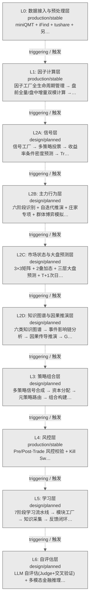

# 决策流图 · 模型驱动轨（Model-Driven Track）

> 生成时间: 2026-07-30T21:17:12
> 真源: `architecture_model/domain/decision_graph_model.yaml` → PostgreSQL `decision_*` 表（TRAE-061）
> 数据库: depgraph (PostgreSQL)
> 导航: [返回主索引 decision_index.md](decision_index.md) | Track 1

**track_id**: `model_driven` | **优先级**: 1 | **激活条件**: 正常运行时

传统 AI 信号链：L0数据→L1因子→L2-A信号→L2-B主力行为→L2-C大盘预测→L2-D因果推演→ L3策略组合→L4风控→L5学习→L6自评估

## 统计

| Layer 数 | 决策节点数 | 域内边数 | 跨轨边数 |
|----------|-----------|----------|----------|
| 10 | 213 | 211 | 0 |

## Layer 骨架图

> 仅展示 Layer 节点与层间流向；决策节点详情见下方「功能域文件」链接。

## 功能域文件（L2A/L3 拆分）

| 序号 | 层 | 功能域 | Node 数 | 文档 |
|------|------|--------|---------|------|
| 06 | L2A | data | 3 | [📄 06_decision_l2a_data.md](06_decision_l2a_data.md) |
| 07 | L2A | factor | 2 | [📄 07_decision_l2a_factor.md](07_decision_l2a_factor.md) |
| 08 | L2A | frontend | 6 | [📄 08_decision_l2a_frontend.md](08_decision_l2a_frontend.md) |
| 09 | L2A | research | 6 | [📄 09_decision_l2a_research.md](09_decision_l2a_research.md) |
| 10 | L2A | sell | 19 | [📄 10_decision_l2a_sell.md](10_decision_l2a_sell.md) |
| 11 | L2A | signal | 13 | [📄 11_decision_l2a_signal.md](11_decision_l2a_signal.md) |
| 12 | L2A | simulation | 15 | [📄 12_decision_l2a_simulation.md](12_decision_l2a_simulation.md) |
| 13 | L3 | aut_core | 11 | [📄 13_decision_l3_aut_core.md](13_decision_l3_aut_core.md) |
| 14 | L3 | ex_core | 9 | [📄 14_decision_l3_ex_core.md](14_decision_l3_ex_core.md) |
| 15 | L3 | ex_sor | 5 | [📄 15_decision_l3_ex_sor.md](15_decision_l3_ex_sor.md) |
| 16 | L3 | pf_alloc | 6 | [📄 16_decision_l3_pf_alloc.md](16_decision_l3_pf_alloc.md) |
| 17 | L3 | pf_core | 12 | [📄 17_decision_l3_pf_core.md](17_decision_l3_pf_core.md) |
| 18 | L3 | position | 19 | [📄 18_decision_l3_position.md](18_decision_l3_position.md) |
| 19 | L3 | trading | 11 | [📄 19_decision_l3_trading.md](19_decision_l3_trading.md) |

## Layer 清单

| layer_id / 层ID | 名称 / name | 英文名 / name_en | 所属轨 / track | 蓝图(module_id) | 蓝图名 / bp | 代码引用 / ref | 功能简述 / desc | 决策频率 / freq | maturity / 成熟度 | build_status / 构建状态 |
|----------|------|--------|--------|-----------------|--------------|----------|----------|----------|--------|--------------|
| L0 | 数据接入与预处理层 | Data Ingestion & Preprocessing | model_driven | MOD-MKT_DATA | - | - | miniQMT + iFind + tushare + 另类数据源 → 事件总线 → 分层时序存储 产出：tick_data / ohlc_bar / factor_input_data | tick | production / 生产 | stable / 稳定 |
| L1 | 因子计算层 | Factor Calculation | model_driven | MOD-L02-001 | - | - | 因子工厂全生命周期管理 → 盘前全量/盘中增量双模计算 → 因子池 产出：factor_value（带 PIT 合规标记） | daily | production / 生产 | stable / 稳定 |
| L2A | 信号层 | Signal Generation | model_driven | - | - | - | 信号工厂 → 多策略投票 → 收益率条件密度预测 → Transformer/Mamba时序增强 → 共形预测 产出：signal（Insight: direction/confidence/horizon） | daily | design / 设计 | planned / 已规划 |
| L2B | 主力行为层 | Main Force Behavior Analysis | model_driven | - | - | - | 六阶段识别 + 自迭代推演 + 庄家专项 + 群体博弈模拟 产出：main_force_signal（主力行为画像） | daily | design / 设计 | planned / 已规划 |
| L2C | 市场状态与大盘预测层 | Market State & Index Prediction | model_driven | - | - | - | 3×3矩阵 + 2叠加态 + 三层大盘预测 + T+1次日8态走势预测 + 体制转换检测(HMM/变点) 产出：market_state_prediction（大盘方向/波动率/体制判断） | daily | design / 设计 | planned / 已规划 |
| L2D | 知识图谱与因果推演层 | Knowledge Graph & Causal Inference | model_driven | MOD-KB-001 | - | - | 六类知识图谱 → 事件影响链分析 → 因果传导推演 → GNN股票关系建模 → Causal ML 产出：causal_inference_result（因果推断结果） | daily | design / 设计 | planned / 已规划 |
| L3 | 策略组合层 | Strategy & Portfolio Combination | model_driven | MOD-L05-001 | - | - | 多策略信号合成 → 资本分配 → 元策略路由 → 组合构建 产出：portfolio_target（PortfolioTarget: 目标仓位） | daily | design / 设计 | planned / 已规划 |
| L4 | 风控层 | Risk Control | model_driven | MOD-L04-001 | - | - | Pre/Post-Trade 风控校验 + Kill Switch 熔断 + 止损评估 产出：risk_check（RiskDecision: approve/veto/adjust） | realtime | production / 生产 | stable / 稳定 |
| L5 | 学习层 | Learning & Optimization | model_driven | - | - | - | 7阶段学习流水线 → 模块工厂 → 知识采集 → 反馈闭环 产出：learning_feedback（策略优化建议） | weekly | design / 设计 | planned / 已规划 |
| L6 | 自评估层 | Self Evaluation | model_driven | - | - | - | LLM 自评估(Judge+交叉验证) + 多模态金融推理 + VeNRA零幻觉锚定 产出：self_evaluation（决策质量评估） | weekly | design / 设计 | planned / 已规划 |

## 跨轨边

> （无跨轨边）

