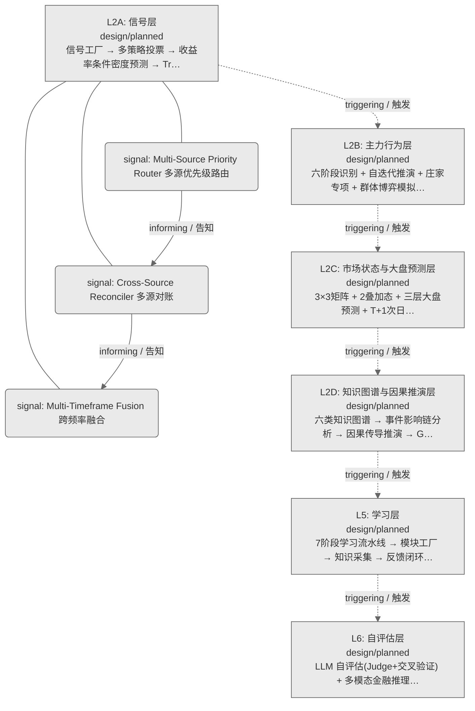
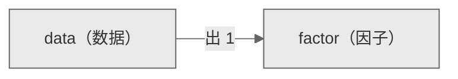

# Decision Flow · L2A Functional Domain data（数据）

> 生成时间: 2026-07-30T22:18:45
> 真源: `architecture_model/domain/decision_graph_model.yaml` → PostgreSQL `decision_*` 表（TRAE-061）
> 数据库: depgraph (PostgreSQL)
> 导航: [返回主索引 decision_index.md](decision_index.md) | 模型驱动轨 → L2A → data

**所属轨**: 模型驱动轨（`model_driven`） | **所属层**: L2A | **功能域**: `data`（数据）

> **域职责 / Responsibility**: 多源行情/基本面数据接入、优先级路由、跨源对账与跨频率融合

## 统计

- 设计态节点数: 3
- 域内边数: 2
- 跨域出边: 1（1 个外部域）
- 跨域入边: 0（0 个外部域）

## 设计态全景图

> 共 6 层，2 边。

## Node 清单

| node_id / 节点ID | layer / 层 | type / 类型 | name / 名称 | path / 路径 | module_id / 模块 | 代码引用 / ref | maturity / 成熟度 | build_status / 构建状态 |
|---------|-------|------|------|------|-----------|----------|--------|--------------|
| 192 | L2A | signal / 信号节点 | Multi-Source Priority Router 多源优先级路由 | decision/data/dt_01 | - | - | design / 设计 | planned / 已规划 |
| 193 | L2A | signal / 信号节点 | Cross-Source Reconciler 多源对账 | decision/data/dt_02 | - | - | design / 设计 | planned / 已规划 |
| 194 | L2A | signal / 信号节点 | Multi-Timeframe Fusion 跨频率融合 | decision/data/dt_03 | - | - | design / 设计 | planned / 已规划 |

## Edge 清单（域内）

| edge_id / 边ID | from / 起点 | to / 终点 | type / 类型 | condition / 条件 | track / 轨 |
|---------|-------|-----|------|-----------|-------|
| 1 | 192 | 193 | informing / 告知 | L2A层内顺序流 | - |
| 2 | 193 | 194 | informing / 告知 | L2A层内顺序流 | - |

## 跨域出边（Depends On）

| # | 本域节点 / from | → | 外部域-目标节点 / to | type / 类型 |
|:--:|---------|:--:|---------|---------|
| 1 | decision/data/dt_03 | → | decision/factor/fc_01 | informing / 告知 |

## 跨域入边（Depended By）

> （无跨域入边）

## 跨域依赖图（Cross-Domain Dependency Graph）

> 本域与 1 个外部域直接连接 / This domain directly connects to 1 external domain(s).

