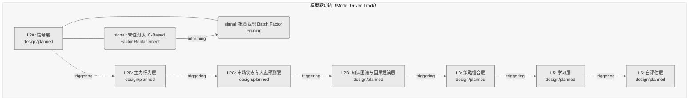
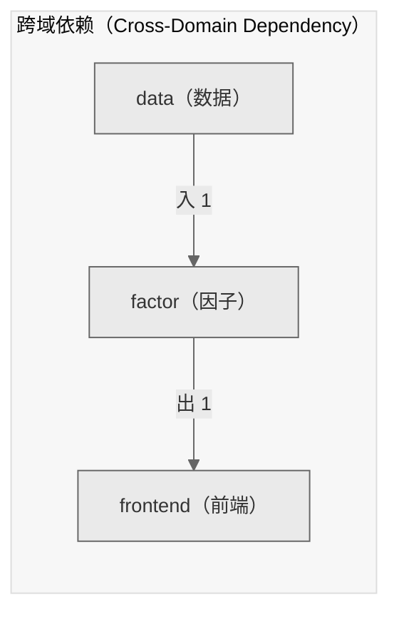

# Decision Flow · L2A Functional Domain factor（因子）

> 生成时间: 2026-07-30T19:38:34
> 真源: `architecture_model/domain/decision_graph_model.yaml` → PostgreSQL `decision_*` 表（TRAE-061）
> 数据库: depgraph (PostgreSQL)
> 导航: [返回主索引 decision_index.md](decision_index.md) | 模型驱动轨 → L2A → factor

**所属轨**: 模型驱动轨（`model_driven`） | **所属层**: L2A | **功能域**: `factor`（因子）

## 统计

- 设计态节点数: 2
- 域内边数: 1
- 跨域出边: 1（1 个外部域）
- 跨域入边: 1（1 个外部域）

## 设计态全景图

> 共 7 层，1 边。

## Node 清单

| node_id | layer | type | name | path | module_id | 代码引用 | 成熟度 | build_status |
|---------|-------|------|------|------|-----------|----------|--------|--------------|
| 190 | L2A | signal | 末位淘汰 IC-Based Factor Replacement | decision/factor/fc_01 | - | - | design | planned |
| 191 | L2A | signal | 批量裁剪 Batch Factor Pruning | decision/factor/fc_02 | - | - | design | planned |

## Edge 清单（域内）

| edge_id | from | to | type | condition | track |
|---------|-------|-----|------|-----------|-------|
| 4 | 190 | 191 | informing | L2A层内顺序流 | - |

## 跨域出边（Depends On）

| # | 本域节点 | → | 外部域-目标节点 | type |
|:--:|---------|:--:|---------|---------|
| 1 | decision/factor/fc_02 | → | decision/frontend/fe_09 | informing |

## 跨域入边（Depended By）

| # | 外部域-源节点 | → | 本域节点 | type |
|:--:|---------|:--:|---------|---------|
| 1 | decision/data/dt_03 | → | decision/factor/fc_01 | informing |

## 跨域依赖图（Cross-Domain Dependency Graph）

> 本域与 2 个外部域直接连接 / This domain directly connects to 2 external domain(s).

