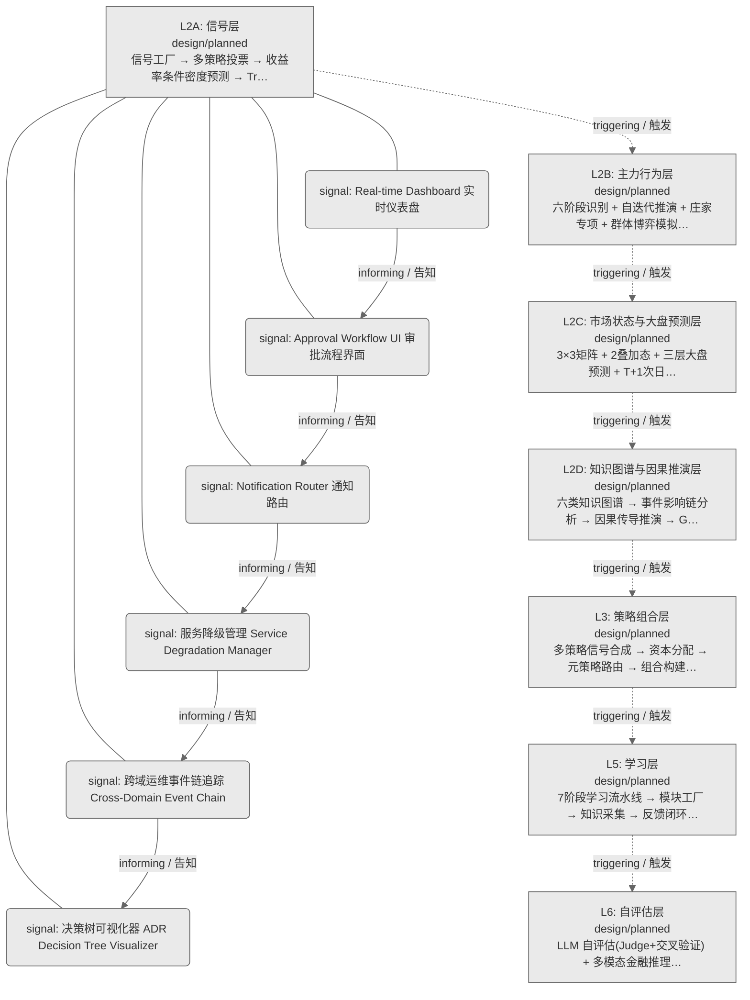
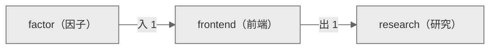

# Decision Flow · L2A Functional Domain frontend（前端）

> 生成时间: 2026-07-30T21:17:12
> 真源: `architecture_model/domain/decision_graph_model.yaml` → PostgreSQL `decision_*` 表（TRAE-061）
> 数据库: depgraph (PostgreSQL)
> 导航: [返回主索引 decision_index.md](decision_index.md) | 模型驱动轨 → L2A → frontend

**所属轨**: 模型驱动轨（`model_driven`） | **所属层**: L2A | **功能域**: `frontend`（前端）

> **域职责 / Responsibility**: 决策结果可视化、审批流程界面、通知路由与跨域运维事件追踪

## 统计

- 设计态节点数: 6
- 域内边数: 5
- 跨域出边: 1（1 个外部域）
- 跨域入边: 1（1 个外部域）

## 设计态全景图

> 共 7 层，5 边。

## Node 清单

| node_id / 节点ID | layer / 层 | type / 类型 | name / 名称 | path / 路径 | module_id / 模块 | 代码引用 / ref | maturity / 成熟度 | build_status / 构建状态 |
|---------|-------|------|------|------|-----------|----------|--------|--------------|
| 200 | L2A | signal / 信号节点 | Approval Workflow UI 审批流程界面 | decision/frontend/fe_12 | - | - | design / 设计 | planned / 已规划 |
| 201 | L2A | signal / 信号节点 | Notification Router 通知路由 | decision/frontend/fe_13 | - | - | design / 设计 | planned / 已规划 |
| 202 | L2A | signal / 信号节点 | Real-time Dashboard 实时仪表盘 | decision/frontend/fe_09 | - | - | design / 设计 | planned / 已规划 |
| 203 | L2A | signal / 信号节点 | 决策树可视化器 ADR Decision Tree Visualizer | decision/frontend/fe_m76 | - | - | design / 设计 | planned / 已规划 |
| 209 | L2A | signal / 信号节点 | 服务降级管理 Service Degradation Manager | decision/frontend/fe_14 | - | - | design / 设计 | planned / 已规划 |
| 210 | L2A | signal / 信号节点 | 跨域运维事件链追踪 Cross-Domain Event Chain | decision/frontend/fe_15 | - | - | design / 设计 | planned / 已规划 |

## Edge 清单（域内）

| edge_id / 边ID | from / 起点 | to / 终点 | type / 类型 | condition / 条件 | track / 轨 |
|---------|-------|-----|------|-----------|-------|
| 6 | 202 | 200 | informing / 告知 | L2A层内顺序流 | - |
| 7 | 200 | 201 | informing / 告知 | L2A层内顺序流 | - |
| 8 | 201 | 209 | informing / 告知 | L2A层内顺序流 | - |
| 9 | 209 | 210 | informing / 告知 | L2A层内顺序流 | - |
| 10 | 210 | 203 | informing / 告知 | L2A层内顺序流 | - |

## 跨域出边（Depends On）

| # | 本域节点 / from | → | 外部域-目标节点 / to | type / 类型 |
|:--:|---------|:--:|---------|---------|
| 1 | decision/frontend/fe_m76 | → | decision/research/rs_01 | informing / 告知 |

## 跨域入边（Depended By）

| # | 外部域-源节点 / from | → | 本域节点 / to | type / 类型 |
|:--:|---------|:--:|---------|---------|
| 1 | decision/factor/fc_02 | → | decision/frontend/fe_09 | informing / 告知 |

## 跨域依赖图（Cross-Domain Dependency Graph）

> 本域与 2 个外部域直接连接 / This domain directly connects to 2 external domain(s).

