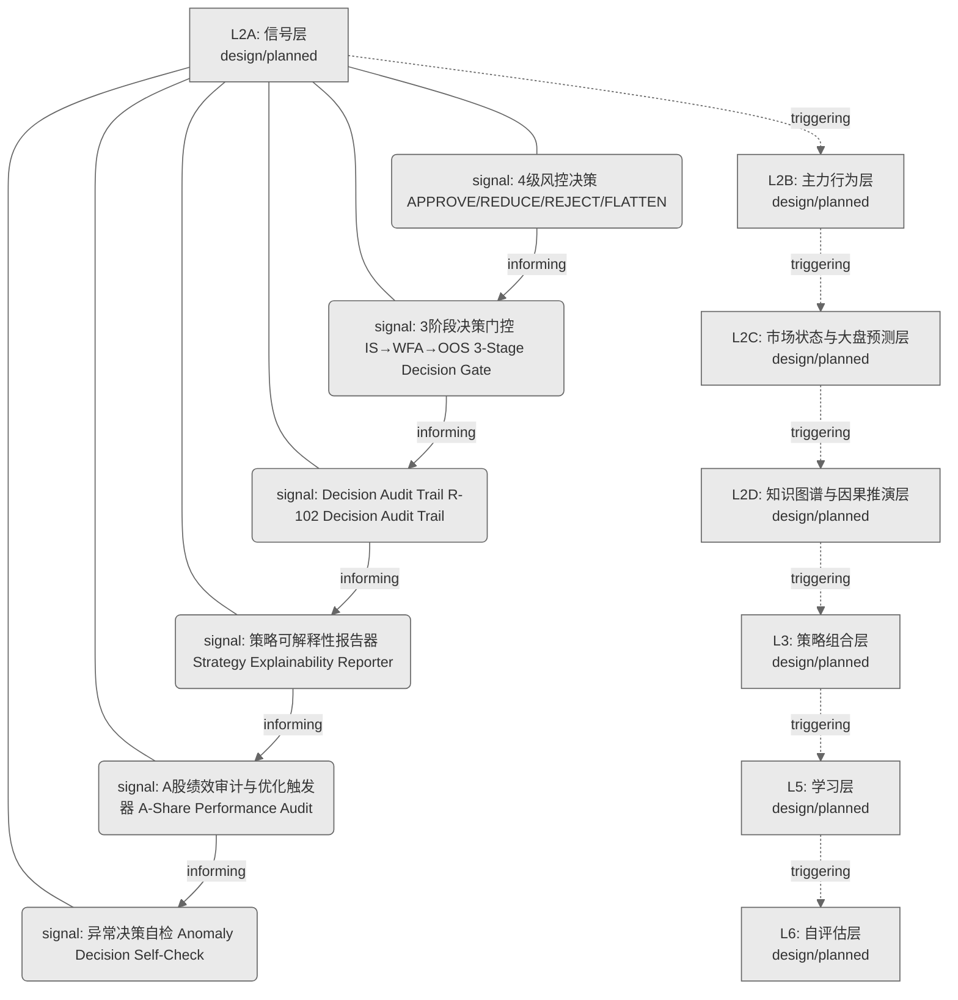
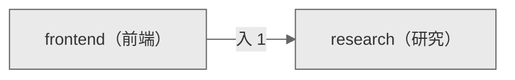

# Decision Flow · L2A Functional Domain research（研究）

> 生成时间: 2026-07-30T19:59:19
> 真源: `architecture_model/domain/decision_graph_model.yaml` → PostgreSQL `decision_*` 表（TRAE-061）
> 数据库: depgraph (PostgreSQL)
> 导航: [返回主索引 decision_index.md](decision_index.md) | 模型驱动轨 → L2A → research

**所属轨**: 模型驱动轨（`model_driven`） | **所属层**: L2A | **功能域**: `research`（研究）

## 统计

- 设计态节点数: 6
- 域内边数: 5
- 跨域出边: 0（0 个外部域）
- 跨域入边: 1（1 个外部域）

## 设计态全景图

> 共 7 层，5 边。

## Node 清单

| node_id | layer | type | name | path | module_id | 代码引用 | 成熟度 | build_status |
|---------|-------|------|------|------|-----------|----------|--------|--------------|
| 204 | L2A | signal | 4级风控决策 APPROVE/REDUCE/REJECT/FLATTEN | decision/research/rs_01 | - | - | design | planned |
| 205 | L2A | signal | 3阶段决策门控 IS→WFA→OOS 3-Stage Decision Gate | decision/research/rs_02 | - | - | design | planned |
| 206 | L2A | signal | Decision Audit Trail R-102 Decision Audit Trail | decision/research/rs_03 | - | - | design | planned |
| 211 | L2A | signal | 策略可解释性报告器 Strategy Explainability Reporter | decision/research/rs_04 | - | - | design | planned |
| 212 | L2A | signal | A股绩效审计与优化触发器 A-Share Performance Audit | decision/research/rs_05 | - | - | design | planned |
| 213 | L2A | signal | 异常决策自检 Anomaly Decision Self-Check | decision/research/rs_06 | - | - | design | planned |

## Edge 清单（域内）

| edge_id | from | to | type | condition | track |
|---------|-------|-----|------|-----------|-------|
| 12 | 204 | 205 | informing | L2A层内顺序流 | - |
| 13 | 205 | 206 | informing | L2A层内顺序流 | - |
| 14 | 206 | 211 | informing | L2A层内顺序流 | - |
| 15 | 211 | 212 | informing | L2A层内顺序流 | - |
| 16 | 212 | 213 | informing | L2A层内顺序流 | - |

## 跨域出边（Depends On）

> （无跨域出边）

## 跨域入边（Depended By）

| # | 外部域-源节点 | → | 本域节点 | type |
|:--:|---------|:--:|---------|---------|
| 1 | decision/frontend/fe_m76 | → | decision/research/rs_01 | informing |

## 跨域依赖图（Cross-Domain Dependency Graph）

> 本域与 1 个外部域直接连接 / This domain directly connects to 1 external domain(s).

