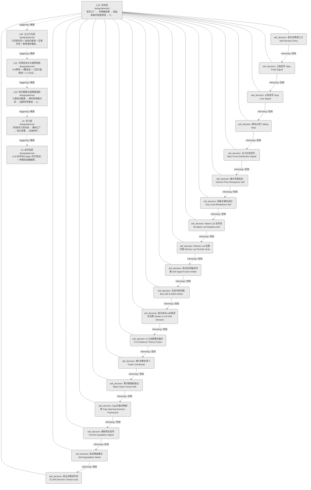
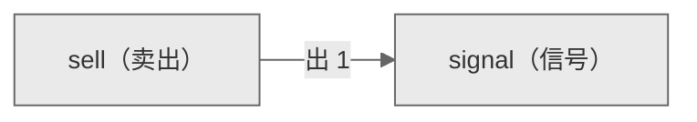

# Decision Flow · L2A Functional Domain sell（卖出）

> 生成时间: 2026-07-30T22:18:45
> 真源: `architecture_model/domain/decision_graph_model.yaml` → PostgreSQL `decision_*` 表（TRAE-061）
> 数据库: depgraph (PostgreSQL)
> 导航: [返回主索引 decision_index.md](decision_index.md) | 模型驱动轨 → L2A → sell

**所属轨**: 模型驱动轨（`model_driven`） | **所属层**: L2A | **功能域**: `sell`（卖出）

> **域职责 / Responsibility**: 卖出信号生成（止盈/止损/移动止损/主力出货/量价背离/突破关键位）

## 统计

- 设计态节点数: 19
- 域内边数: 18
- 跨域出边: 1（1 个外部域）
- 跨域入边: 0（0 个外部域）

## 设计态全景图

> 共 6 层，18 边。

## Node 清单

| node_id / 节点ID | layer / 层 | type / 类型 | name / 名称 | path / 路径 | module_id / 模块 | 代码引用 / ref | maturity / 成熟度 | build_status / 构建状态 |
|---------|-------|------|------|------|-----------|----------|--------|--------------|
| 1 | L2A | sell_decision / 卖出决策节点 | 卖出决策域入口 Sell Decision Entry | decision/sell/sell_00 | - | - | design / 设计 | planned / 已规划 |
| 2 | L2A | sell_decision / 卖出决策节点 | 止盈信号 Take-Profit Signal | decision/sell/sell_01 | - | - | design / 设计 | planned / 已规划 |
| 3 | L2A | sell_decision / 卖出决策节点 | 止损信号 Stop-Loss Signal | decision/sell/sell_02 | - | - | design / 设计 | planned / 已规划 |
| 4 | L2A | sell_decision / 卖出决策节点 | 移动止损 Trailing Stop | decision/sell/sell_03 | - | - | design / 设计 | planned / 已规划 |
| 5 | L2A | sell_decision / 卖出决策节点 | 主力出货信号 Main Force Distribution Signal | decision/sell/sell_04 | - | - | design / 设计 | planned / 已规划 |
| 6 | L2A | sell_decision / 卖出决策节点 | 量价背离卖出 Volume-Price Divergence Sell | decision/sell/sell_05 | - | - | design / 设计 | planned / 已规划 |
| 7 | L2A | sell_decision / 卖出决策节点 | 突破关键位卖出 Key-Level Breakdown Sell | decision/sell/sell_06 | - | - | design / 设计 | planned / 已规划 |
| 8 | L2A | sell_decision / 卖出决策节点 | Watch List 实时卖出 Watch List Realtime Sell | decision/sell/sell_07 | - | - | design / 设计 | planned / 已规划 |
| 9 | L2A | sell_decision / 卖出决策节点 | Monitor List 定期扫描 Monitor List Periodic Scan | decision/sell/sell_08 | - | - | design / 设计 | planned / 已规划 |
| 10 | L2A | sell_decision / 卖出决策节点 | 卖出信号融合仲裁 Sell Signal Fusion Arbiter | decision/sell/sell_09 | - | - | design / 设计 | planned / 已规划 |
| 11 | L2A | sell_decision / 卖出决策节点 | 买卖冲突仲裁 Buy-Sell Conflict Arbiter | decision/sell/sell_10 | - | - | design / 设计 | planned / 已规划 |
| 12 | L2A | sell_decision / 卖出决策节点 | 部分卖出vs全部清仓决策 Partial vs Full Sell Decision | decision/sell/sell_11 | - | - | design / 设计 | planned / 已规划 |
| 13 | L2A | sell_decision / 卖出决策节点 | D-S证据理论融合 D-S Evidence Theory Fusion | decision/sell/sell_12 | - | - | design / 设计 | planned / 已规划 |
| 14 | L2A | sell_decision / 卖出决策节点 | 做T决策协调 T-Trade Coordinator | decision/sell/sell_13 | - | - | design / 设计 | planned / 已规划 |
| 15 | L2A | sell_decision / 卖出决策节点 | 黑天鹅强制卖出 Black Swan Forced Sell | decision/sell/sell_14 | - | - | design / 设计 | planned / 已规划 |
| 16 | L2A | sell_decision / 卖出决策节点 | Gap开盘决策框架 Gap Opening Decision Framework | decision/sell/sell_15 | - | - | design / 设计 | planned / 已规划 |
| 17 | L2A | sell_decision / 卖出决策节点 | 强制清仓信号 Forced Liquidation Signal | decision/sell/sell_16 | - | - | design / 设计 | planned / 已规划 |
| 18 | L2A | sell_decision / 卖出决策节点 | 卖出降级模式 Sell Degradation Mode | decision/sell/sell_17 | - | - | design / 设计 | planned / 已规划 |
| 19 | L2A | sell_decision / 卖出决策节点 | 卖出决策闭环优化 Sell Decision Closed-Loop | decision/sell/sell_18 | - | - | design / 设计 | planned / 已规划 |

## Edge 清单（域内）

| edge_id / 边ID | from / 起点 | to / 终点 | type / 类型 | condition / 条件 | track / 轨 |
|---------|-------|-----|------|-----------|-------|
| 19 | 1 | 2 | informing / 告知 | L2A层内顺序流 | - |
| 20 | 2 | 3 | informing / 告知 | L2A层内顺序流 | - |
| 21 | 3 | 4 | informing / 告知 | L2A层内顺序流 | - |
| 22 | 4 | 5 | informing / 告知 | L2A层内顺序流 | - |
| 23 | 5 | 6 | informing / 告知 | L2A层内顺序流 | - |
| 24 | 6 | 7 | informing / 告知 | L2A层内顺序流 | - |
| 25 | 7 | 8 | informing / 告知 | L2A层内顺序流 | - |
| 26 | 8 | 9 | informing / 告知 | L2A层内顺序流 | - |
| 27 | 9 | 10 | informing / 告知 | L2A层内顺序流 | - |
| 28 | 10 | 11 | informing / 告知 | L2A层内顺序流 | - |
| 29 | 11 | 12 | informing / 告知 | L2A层内顺序流 | - |
| 30 | 12 | 13 | informing / 告知 | L2A层内顺序流 | - |
| 31 | 13 | 14 | informing / 告知 | L2A层内顺序流 | - |
| 32 | 14 | 15 | informing / 告知 | L2A层内顺序流 | - |
| 33 | 15 | 16 | informing / 告知 | L2A层内顺序流 | - |
| 34 | 16 | 17 | informing / 告知 | L2A层内顺序流 | - |
| 35 | 17 | 18 | informing / 告知 | L2A层内顺序流 | - |
| 36 | 18 | 19 | informing / 告知 | L2A层内顺序流 | - |

## 跨域出边（Depends On）

| # | 本域节点 / from | → | 外部域-目标节点 / to | type / 类型 |
|:--:|---------|:--:|---------|---------|
| 1 | decision/sell/sell_18 | → | decision/signal/sg_01 | informing / 告知 |

## 跨域入边（Depended By）

> （无跨域入边）

## 跨域依赖图（Cross-Domain Dependency Graph）

> 本域与 1 个外部域直接连接 / This domain directly connects to 1 external domain(s).

