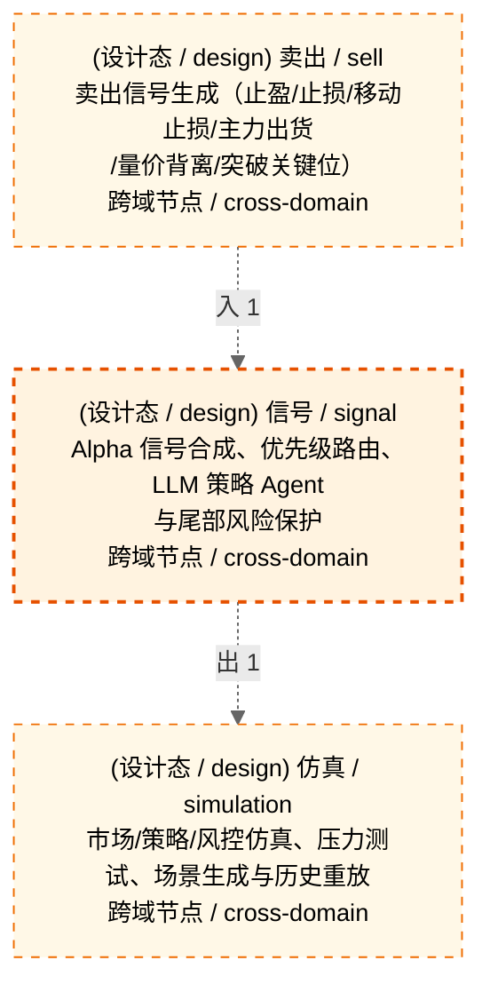

# Decision Flow · L2A Functional Domain signal（信号）

> 生成时间: 2026-08-03T19:13:48
> 真源: `architecture_model/domain/decision_graph_model.yaml` → PostgreSQL `decision_*` 表（TRAE-061）
> 数据库: depgraph (PostgreSQL)
> 导航: [返回主索引 decision_index.md](decision_index.md) | 模型驱动轨 → L2A → signal

> **[可缩放 HTML 版 / Zoomable HTML](http://localhost:8765/docs/02_enterprise_architecture/06_decision_architecture/_zoomable_html/11_decision_l2a_signal.html)** — Ctrl+滚轮缩放 ｜ 双击重置 ｜ Ctrl+Shift+D 切换拖动/选择模式

**所属轨**: 模型驱动轨（`model_driven`） | **所属层**: L2A | **功能域**: `signal`（信号）

> **域职责 / Responsibility**: Alpha 信号合成、优先级路由、LLM 策略 Agent 与尾部风险保护

## 统计

- 决策节点数（全部）: 13
- 运营态节点数（production）: 0
- 设计态节点数（design）: 13
- 域内边数: 12
- 跨域出边: 1（1 个外部域）
- 跨域入边: 1（1 个外部域）

## 域内依赖图 / Internal Dependency Diagram

> **图例说明 / Legend**：
> - 🟦 **蓝色 = 运营态模块**（production，已上线运行）
> - 🟧 **橙色虚线 = 设计态模块**（design，蓝图阶段，代码未写）
> - **实线箭头 `-->` = 运营态依赖**（两端都 production）
> - **虚线箭头 `-.->` = 非运营态依赖**（含 design / 混合）

### 全景图（全部模块，颜色区分运营态/设计态）

> 展示全部 13 个决策节点（运营态 0 + 设计态 13），含跨域依赖外部节点。

> 共 10 层，12 边。

```mermaid
%%{init: {'theme': 'base', 'themeVariables': {'primaryColor': '#eaeaea', 'primaryTextColor': '#333333', 'primaryBorderColor': '#666666', 'lineColor': '#666666', 'secondaryColor': '#eaeaea', 'tertiaryColor': '#eaeaea', 'clusterBkg': 'transparent', 'clusterBorder': 'transparent', 'fontSize': '14px'}}}%%
flowchart TD
    LL0["(生产态 / production) L0 数据接入与预处理层 /<br/>Data Ingestion & Preprocessing<br/>miniQMT + iFind + tushare + 另类数据源 →<br/>事件总线 → 分层时序存储 产出：tick_data / ohlc_<br/>bar / factor_input_data<br/>文件: MOD-MKT_DATA"]
    LL1["(生产态 / production) L1 因子计算层 / Factor<br/>Calculation<br/>因子工厂全生命周期管理 → 盘前全量<br/>/盘中增量双模计算 → 因子池 产出：factor_value<br/>（带 PIT 合规标记）<br/>文件: MOD-L02-001"]
    LL2A["(设计态 / design) L2A 信号层 / Signal Generation<br/>信号工厂 → 多策略投票 → 收益率条件密度预测 →<br/>Transformer/Mamba时序增强 → 共形预测<br/>产出：signal（Insight: direction/confidence<br/>/horizon）<br/>文件: （设计态，暂无代码引用）"]
    N177["(设计态 / design) Synthesizer 信号合成+权重分配<br/>将多源因子信号按权重合成为最终买卖信号，解决多信<br/>号无法直接交易的聚合问题<br/>文件: decision/signal/sg_01"]
    LL2A --- N177
    N178["(设计态 / design) Signal Priority Router<br/>信号优先级路由<br/>按信号来源优先级路由到不同处理通道，确保高优先级<br/>信号不被低优先级阻塞<br/>文件: decision/signal/sg_02"]
    LL2A --- N178
    N179["(设计态 / design) LLM Strategy Agent<br/>LLM策略Agent<br/>用大语言模型解读市场文本信息生成策略信号，补充量<br/>化因子无法捕捉的语义信息<br/>文件: decision/signal/sg_03"]
    LL2A --- N179
    N180["(设计态 / design) Signal Tail Risk Protector<br/>信号尾部风险保护<br/>检测信号分布的尾部极端值并降权保护，防止单次极端<br/>信号造成过大敞口<br/>文件: decision/signal/sg_04"]
    LL2A --- N180
    N181["(设计态 / design) A-Share Plan Conformity<br/>Evaluator A股计划吻合度评估<br/>评估信号与当日交易计划的吻合度，防止计划外冲动交<br/>易<br/>文件: decision/signal/sg_05"]
    LL2A --- N181
    N182["(设计态 / design) A-Share Emergency Opportunity<br/>Evaluator A股应急机会评估<br/>突发机会出现时快速评估是否值得追入，抓住计划外的<br/>应急盈利机会<br/>文件: decision/signal/sg_06"]
    LL2A --- N182
    N183["(设计态 / design) A-Share Capital-Force<br/>Conflict Arbiter 主力游资冲突仲裁<br/>主力与游资信号方向相反时仲裁取舍，避免被两类资金<br/>夹击<br/>文件: decision/signal/sg_07"]
    LL2A --- N183
    N184["(设计态 / design) Regime Special Override<br/>Priority Manager Regime特殊覆盖优先级<br/>特殊市场状态下提升特定信号优先级覆盖常规策略，适<br/>配非常规行情<br/>文件: decision/signal/sg_08"]
    LL2A --- N184
    N185["(设计态 / design) Risk-Signal Interaction<br/>Sequencer 风控-信号交互时序<br/>协调风控检查与信号生成的时序关系，防止风控滞后导<br/>致信号已发出<br/>文件: decision/signal/sg_09"]
    LL2A --- N185
    N186["(设计态 / design) 36环节决策框架实现器 /<br/>36-Step Decision Framework<br/>将36步决策框架落地为可执行逻辑，确保决策链路完整<br/>无遗漏环节<br/>文件: decision/signal/sg_10"]
    LL2A --- N186
    N187["(设计态 / design) 策略替换与淘汰决策器 /<br/>Strategy Replacement Decision<br/>按绩效指标决定策略去留更替，保持策略池持续优胜劣<br/>汰<br/>文件: decision/signal/sg_11"]
    LL2A --- N187
    N188["(设计态 / design) 信号冲突解决 / Signal<br/>Conflict Resolution<br/>多个信号方向矛盾时按规则消解冲突，输出唯一可执行<br/>信号<br/>文件: decision/signal/sg_12"]
    LL2A --- N188
    N189["(设计态 / design) 信号融合模块 / Signal Fusion<br/>Module<br/>把异构信号映射到统一空间后融合，提升信号整体信噪<br/>比<br/>文件: decision/signal/sg_13"]
    LL2A --- N189
    LL2B["(设计态 / design) L2B 主力行为层 / Main Force<br/>Behavior Analysis<br/>六阶段识别 + 自迭代推演 + 庄家专项 +<br/>群体博弈模拟 产出：main_force_signal<br/>（主力行为画像）<br/>文件: （设计态，暂无代码引用）"]
    LL2C["(设计态 / design) L2C 市场状态与大盘预测层 /<br/>Market State & Index Prediction<br/>3×3矩阵 + 2叠加态 + 三层大盘预测 +<br/>T+1次日8态走势预测 + 体制转换检测(HMM/变点)<br/>产出：market_state_prediction（大盘方向/波动率<br/>/体制判断）<br/>文件: （设计态，暂无代码引用）"]
    LL2D["(设计态 / design) L2D 知识图谱与因果推演层 /<br/>Knowledge Graph & Causal Inference<br/>六类知识图谱 → 事件影响链分析 → 因果传导推演 →<br/>GNN股票关系建模 → Causal ML 产出：causal_<br/>inference_result（因果推断结果）<br/>文件: （设计态，暂无代码引用）"]
    LL3["(生产态 / production) L3 策略组合层 / Strategy<br/>& Portfolio Combination<br/>多策略信号合成 → 资本分配 → 元策略路由 →<br/>组合构建 产出：portfolio_target<br/>（PortfolioTarget: 目标仓位）<br/>文件: MOD-L05-001"]
    LL4["(生产态 / production) L4 风控层 / Risk Control<br/>Pre/Post-Trade 风控校验 + Kill Switch 熔断 +<br/>止损评估 产出：risk_check（RiskDecision:<br/>approve/veto/adjust）<br/>文件: MOD-L04-001"]
    LL5["(设计态 / design) L5 学习层 / Learning &<br/>Optimization<br/>7阶段学习流水线 → 模块工厂 → 知识采集 →<br/>反馈闭环 产出：learning_feedback（策略优化建议）<br/>文件: （设计态，暂无代码引用）"]
    LL6["(设计态 / design) L6 自评估层 / Self Evaluation<br/>LLM 自评估(Judge+交叉验证) + 多模态金融推理 +<br/>VeNRA零幻觉锚定 产出：self_evaluation<br/>（决策质量评估）<br/>文件: （设计态，暂无代码引用）"]
    LL0 -->|triggering / 触发| LL1
    LL1 -.->|triggering / 触发| LL2A
    LL2A -.->|triggering / 触发| LL2B
    LL2B -.->|triggering / 触发| LL2C
    LL2C -.->|triggering / 触发| LL2D
    LL2D -.->|triggering / 触发| LL3
    LL3 -->|triggering / 触发| LL4
    LL4 -.->|triggering / 触发| LL5
    LL5 -.->|triggering / 触发| LL6
    N177 -.->|informing / 告知| N178
    N178 -.->|informing / 告知| N179
    N179 -.->|informing / 告知| N180
    N180 -.->|informing / 告知| N181
    N181 -.->|informing / 告知| N182
    N182 -.->|informing / 告知| N183
    N183 -.->|informing / 告知| N184
    N184 -.->|informing / 告知| N185
    N185 -.->|informing / 告知| N186
    N186 -.->|informing / 告知| N187
    N187 -.->|informing / 告知| N188
    N188 -.->|informing / 告知| N189
    classDef production fill:#e1f5fe,stroke:#01579b,stroke-width:2px,color:#000
    classDef design fill:#fff3e0,stroke:#e65100,stroke-width:2px,color:#000,stroke-dasharray: 5 5
    classDef external_prod fill:#e8f4fd,stroke:#0277bd,stroke-width:1px,color:#000
    classDef external_design fill:#fff8e7,stroke:#ef6c00,stroke-width:1px,color:#000,stroke-dasharray: 5 5
    class LL0,LL1,LL3,LL4 production
    class LL2A,N177,N178,N179,N180,N181,N182,N183,N184,N185,N186,N187,N188,N189,LL2B,LL2C,LL2D,LL5,LL6 design
```

### 运营态的图（仅 design_maturity=production 的模块和域内依赖）

> 仅展示已上线运行的决策节点（共 0 个），不含跨域外部节点。跨域依赖见下方跨域依赖章节。

> （无模块 / No modules）

### 设计态的图（仅 design_maturity=design 的模块和域内依赖）

> 仅展示蓝图阶段、代码未写的设计态决策节点（共 13 个），不含跨域外部节点。

> 共 6 层，12 边。

```mermaid
%%{init: {'theme': 'base', 'themeVariables': {'primaryColor': '#eaeaea', 'primaryTextColor': '#333333', 'primaryBorderColor': '#666666', 'lineColor': '#666666', 'secondaryColor': '#eaeaea', 'tertiaryColor': '#eaeaea', 'clusterBkg': 'transparent', 'clusterBorder': 'transparent', 'fontSize': '14px'}}}%%
flowchart TD
    LL2A["(设计态 / design) L2A 信号层 / Signal Generation<br/>信号工厂 → 多策略投票 → 收益率条件密度预测 →<br/>Transformer/Mamba时序增强 → 共形预测<br/>产出：signal（Insight: direction/confidence<br/>/horizon）<br/>文件: （设计态，暂无代码引用）"]
    N177["(设计态 / design) Synthesizer 信号合成+权重分配<br/>将多源因子信号按权重合成为最终买卖信号，解决多信<br/>号无法直接交易的聚合问题<br/>文件: decision/signal/sg_01"]
    LL2A --- N177
    N178["(设计态 / design) Signal Priority Router<br/>信号优先级路由<br/>按信号来源优先级路由到不同处理通道，确保高优先级<br/>信号不被低优先级阻塞<br/>文件: decision/signal/sg_02"]
    LL2A --- N178
    N179["(设计态 / design) LLM Strategy Agent<br/>LLM策略Agent<br/>用大语言模型解读市场文本信息生成策略信号，补充量<br/>化因子无法捕捉的语义信息<br/>文件: decision/signal/sg_03"]
    LL2A --- N179
    N180["(设计态 / design) Signal Tail Risk Protector<br/>信号尾部风险保护<br/>检测信号分布的尾部极端值并降权保护，防止单次极端<br/>信号造成过大敞口<br/>文件: decision/signal/sg_04"]
    LL2A --- N180
    N181["(设计态 / design) A-Share Plan Conformity<br/>Evaluator A股计划吻合度评估<br/>评估信号与当日交易计划的吻合度，防止计划外冲动交<br/>易<br/>文件: decision/signal/sg_05"]
    LL2A --- N181
    N182["(设计态 / design) A-Share Emergency Opportunity<br/>Evaluator A股应急机会评估<br/>突发机会出现时快速评估是否值得追入，抓住计划外的<br/>应急盈利机会<br/>文件: decision/signal/sg_06"]
    LL2A --- N182
    N183["(设计态 / design) A-Share Capital-Force<br/>Conflict Arbiter 主力游资冲突仲裁<br/>主力与游资信号方向相反时仲裁取舍，避免被两类资金<br/>夹击<br/>文件: decision/signal/sg_07"]
    LL2A --- N183
    N184["(设计态 / design) Regime Special Override<br/>Priority Manager Regime特殊覆盖优先级<br/>特殊市场状态下提升特定信号优先级覆盖常规策略，适<br/>配非常规行情<br/>文件: decision/signal/sg_08"]
    LL2A --- N184
    N185["(设计态 / design) Risk-Signal Interaction<br/>Sequencer 风控-信号交互时序<br/>协调风控检查与信号生成的时序关系，防止风控滞后导<br/>致信号已发出<br/>文件: decision/signal/sg_09"]
    LL2A --- N185
    N186["(设计态 / design) 36环节决策框架实现器 /<br/>36-Step Decision Framework<br/>将36步决策框架落地为可执行逻辑，确保决策链路完整<br/>无遗漏环节<br/>文件: decision/signal/sg_10"]
    LL2A --- N186
    N187["(设计态 / design) 策略替换与淘汰决策器 /<br/>Strategy Replacement Decision<br/>按绩效指标决定策略去留更替，保持策略池持续优胜劣<br/>汰<br/>文件: decision/signal/sg_11"]
    LL2A --- N187
    N188["(设计态 / design) 信号冲突解决 / Signal<br/>Conflict Resolution<br/>多个信号方向矛盾时按规则消解冲突，输出唯一可执行<br/>信号<br/>文件: decision/signal/sg_12"]
    LL2A --- N188
    N189["(设计态 / design) 信号融合模块 / Signal Fusion<br/>Module<br/>把异构信号映射到统一空间后融合，提升信号整体信噪<br/>比<br/>文件: decision/signal/sg_13"]
    LL2A --- N189
    LL2B["(设计态 / design) L2B 主力行为层 / Main Force<br/>Behavior Analysis<br/>六阶段识别 + 自迭代推演 + 庄家专项 +<br/>群体博弈模拟 产出：main_force_signal<br/>（主力行为画像）<br/>文件: （设计态，暂无代码引用）"]
    LL2C["(设计态 / design) L2C 市场状态与大盘预测层 /<br/>Market State & Index Prediction<br/>3×3矩阵 + 2叠加态 + 三层大盘预测 +<br/>T+1次日8态走势预测 + 体制转换检测(HMM/变点)<br/>产出：market_state_prediction（大盘方向/波动率<br/>/体制判断）<br/>文件: （设计态，暂无代码引用）"]
    LL2D["(设计态 / design) L2D 知识图谱与因果推演层 /<br/>Knowledge Graph & Causal Inference<br/>六类知识图谱 → 事件影响链分析 → 因果传导推演 →<br/>GNN股票关系建模 → Causal ML 产出：causal_<br/>inference_result（因果推断结果）<br/>文件: （设计态，暂无代码引用）"]
    LL5["(设计态 / design) L5 学习层 / Learning &<br/>Optimization<br/>7阶段学习流水线 → 模块工厂 → 知识采集 →<br/>反馈闭环 产出：learning_feedback（策略优化建议）<br/>文件: （设计态，暂无代码引用）"]
    LL6["(设计态 / design) L6 自评估层 / Self Evaluation<br/>LLM 自评估(Judge+交叉验证) + 多模态金融推理 +<br/>VeNRA零幻觉锚定 产出：self_evaluation<br/>（决策质量评估）<br/>文件: （设计态，暂无代码引用）"]
    LL2A -.->|triggering / 触发| LL2B
    LL2B -.->|triggering / 触发| LL2C
    LL2C -.->|triggering / 触发| LL2D
    LL2D -.->|triggering / 触发| LL5
    LL5 -.->|triggering / 触发| LL6
    N177 -.->|informing / 告知| N178
    N178 -.->|informing / 告知| N179
    N179 -.->|informing / 告知| N180
    N180 -.->|informing / 告知| N181
    N181 -.->|informing / 告知| N182
    N182 -.->|informing / 告知| N183
    N183 -.->|informing / 告知| N184
    N184 -.->|informing / 告知| N185
    N185 -.->|informing / 告知| N186
    N186 -.->|informing / 告知| N187
    N187 -.->|informing / 告知| N188
    N188 -.->|informing / 告知| N189
    classDef production fill:#e1f5fe,stroke:#01579b,stroke-width:2px,color:#000
    classDef design fill:#fff3e0,stroke:#e65100,stroke-width:2px,color:#000,stroke-dasharray: 5 5
    classDef external_prod fill:#e8f4fd,stroke:#0277bd,stroke-width:1px,color:#000
    classDef external_design fill:#fff8e7,stroke:#ef6c00,stroke-width:1px,color:#000,stroke-dasharray: 5 5
    class LL2A,N177,N178,N179,N180,N181,N182,N183,N184,N185,N186,N187,N188,N189,LL2B,LL2C,LL2D,LL5,LL6 design
```

## Node 清单

| node_id / 节点ID | layer / 层 | type / 类型 | name / 名称 | path / 路径 | module_id / 模块 | 代码引用 / ref | maturity / 成熟度 | build_status / 构建状态 |
|---------|-------|------|------|------|-----------|----------|--------|--------------|
| 177 | L2A | signal / 信号节点 | Synthesizer 信号合成+权重分配 | decision/signal/sg_01 | - | - | design / 设计 | planned / 已规划 |
| 178 | L2A | signal / 信号节点 | Signal Priority Router 信号优先级路由 | decision/signal/sg_02 | - | - | design / 设计 | planned / 已规划 |
| 179 | L2A | signal / 信号节点 | LLM Strategy Agent LLM策略Agent | decision/signal/sg_03 | - | - | design / 设计 | planned / 已规划 |
| 180 | L2A | signal / 信号节点 | Signal Tail Risk Protector 信号尾部风险保护 | decision/signal/sg_04 | - | - | design / 设计 | planned / 已规划 |
| 181 | L2A | signal / 信号节点 | A-Share Plan Conformity Evaluator A股计划吻合度评估 | decision/signal/sg_05 | - | - | design / 设计 | planned / 已规划 |
| 182 | L2A | signal / 信号节点 | A-Share Emergency Opportunity Evaluator A股应急机会评估 | decision/signal/sg_06 | - | - | design / 设计 | planned / 已规划 |
| 183 | L2A | signal / 信号节点 | A-Share Capital-Force Conflict Arbiter 主力游资冲突仲裁 | decision/signal/sg_07 | - | - | design / 设计 | planned / 已规划 |
| 184 | L2A | signal / 信号节点 | Regime Special Override Priority Manager Regime特殊覆盖优先级 | decision/signal/sg_08 | - | - | design / 设计 | planned / 已规划 |
| 185 | L2A | signal / 信号节点 | Risk-Signal Interaction Sequencer 风控-信号交互时序 | decision/signal/sg_09 | - | - | design / 设计 | planned / 已规划 |
| 186 | L2A | signal / 信号节点 | 36环节决策框架实现器 36-Step Decision Framework | decision/signal/sg_10 | - | - | design / 设计 | planned / 已规划 |
| 187 | L2A | signal / 信号节点 | 策略替换与淘汰决策器 Strategy Replacement Decision | decision/signal/sg_11 | - | - | design / 设计 | planned / 已规划 |
| 188 | L2A | signal / 信号节点 | 信号冲突解决 Signal Conflict Resolution | decision/signal/sg_12 | - | - | design / 设计 | planned / 已规划 |
| 189 | L2A | signal / 信号节点 | 信号融合模块 Signal Fusion Module | decision/signal/sg_13 | - | - | design / 设计 | planned / 已规划 |

## Edge 清单（域内）

| edge_id / 边ID | from / 起点 | to / 终点 | type / 类型 | condition / 条件 | track / 轨 |
|---------|-------|-----|------|-----------|-------|
| 38 | 177 | 178 | informing / 告知 | L2A层内顺序流 | - |
| 39 | 178 | 179 | informing / 告知 | L2A层内顺序流 | - |
| 40 | 179 | 180 | informing / 告知 | L2A层内顺序流 | - |
| 41 | 180 | 181 | informing / 告知 | L2A层内顺序流 | - |
| 42 | 181 | 182 | informing / 告知 | L2A层内顺序流 | - |
| 43 | 182 | 183 | informing / 告知 | L2A层内顺序流 | - |
| 44 | 183 | 184 | informing / 告知 | L2A层内顺序流 | - |
| 45 | 184 | 185 | informing / 告知 | L2A层内顺序流 | - |
| 46 | 185 | 186 | informing / 告知 | L2A层内顺序流 | - |
| 47 | 186 | 187 | informing / 告知 | L2A层内顺序流 | - |
| 48 | 187 | 188 | informing / 告知 | L2A层内顺序流 | - |
| 49 | 188 | 189 | informing / 告知 | L2A层内顺序流 | - |

## 跨域出边（Depends On）

| # | 本域节点 / from | → | 外部域-目标节点 / to | type / 类型 |
|:--:|---------|:--:|---------|---------|
| 1 | decision/signal/sg_13 | → | decision/simulation/sim_01 | informing / 告知 |

## 跨域入边（Depended By）

| # | 外部域-源节点 / from | → | 本域节点 / to | type / 类型 |
|:--:|---------|:--:|---------|---------|
| 1 | decision/sell/sell_18 | → | decision/signal/sg_01 | informing / 告知 |

## 跨域依赖图（Cross-Domain Dependency Graph）

> 本域与 2 个外部域直接连接 / This domain directly connects to 2 external domain(s).

