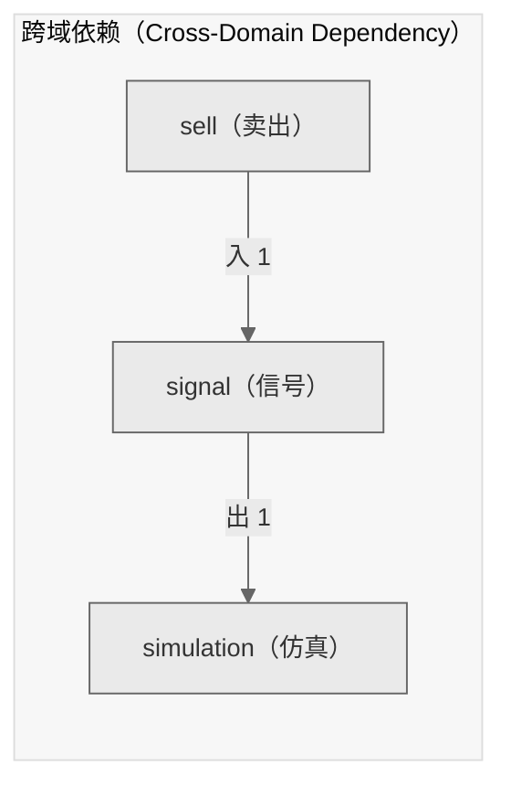

# Decision Flow · L2A Functional Domain signal（信号）

> 生成时间: 2026-07-30T19:38:34
> 真源: `architecture_model/domain/decision_graph_model.yaml` → PostgreSQL `decision_*` 表（TRAE-061）
> 数据库: depgraph (PostgreSQL)
> 导航: [返回主索引 decision_index.md](decision_index.md) | 模型驱动轨 → L2A → signal

**所属轨**: 模型驱动轨（`model_driven`） | **所属层**: L2A | **功能域**: `signal`（信号）

## 统计

- 设计态节点数: 13
- 域内边数: 12
- 跨域出边: 1（1 个外部域）
- 跨域入边: 1（1 个外部域）

## 设计态全景图

> 共 7 层，12 边。

```mermaid
%%{init: {'theme': 'base', 'themeVariables': {'primaryColor': '#eaeaea', 'primaryTextColor': '#333333', 'primaryBorderColor': '#666666', 'lineColor': '#666666', 'fontSize': '14px'}}}%%
flowchart TD
    subgraph track_model_driven["模型驱动轨（Model-Driven Track）"]
        LL2A["L2A: 信号层<br/>design/planned"]
        N177("signal: Synthesizer 信号合成+权重分配")
        LL2A --- N177
        N178("signal: Signal Priority Router 信号优先级路由")
        LL2A --- N178
        N179("signal: LLM Strategy Agent LLM策略Agent")
        LL2A --- N179
        N180("signal: Signal Tail Risk Protector 信号尾部风险保护")
        LL2A --- N180
        N181("signal: A-Share Plan Conformity Evaluator A股计划吻合度评估")
        LL2A --- N181
        N182("signal: A-Share Emergency Opportunity Evaluator A股应急机会评估")
        LL2A --- N182
        N183("signal: A-Share Capital-Force Conflict Arbiter 主力游资冲突仲裁")
        LL2A --- N183
        N184("signal: Regime Special Override Priority Manager Regime特殊覆盖优先级")
        LL2A --- N184
        N185("signal: Risk-Signal Interaction Sequencer 风控-信号交互时序")
        LL2A --- N185
        N186("signal: 36环节决策框架实现器 36-Step Decision Framework")
        LL2A --- N186
        N187("signal: 策略替换与淘汰决策器 Strategy Replacement Decision")
        LL2A --- N187
        N188("signal: 信号冲突解决 Signal Conflict Resolution")
        LL2A --- N188
        N189("signal: 信号融合模块 Signal Fusion Module")
        LL2A --- N189
        LL2B["L2B: 主力行为层<br/>design/planned"]
        LL2C["L2C: 市场状态与大盘预测层<br/>design/planned"]
        LL2D["L2D: 知识图谱与因果推演层<br/>design/planned"]
        LL3["L3: 策略组合层<br/>design/planned"]
        LL5["L5: 学习层<br/>design/planned"]
        LL6["L6: 自评估层<br/>design/planned"]
    end
    LL2A -.->|triggering| LL2B
    LL2B -.->|triggering| LL2C
    LL2C -.->|triggering| LL2D
    LL2D -.->|triggering| LL3
    LL3 -.->|triggering| LL5
    LL5 -.->|triggering| LL6
    N177 -->|informing| N178
    N178 -->|informing| N179
    N179 -->|informing| N180
    N180 -->|informing| N181
    N181 -->|informing| N182
    N182 -->|informing| N183
    N183 -->|informing| N184
    N184 -->|informing| N185
    N185 -->|informing| N186
    N186 -->|informing| N187
    N187 -->|informing| N188
    N188 -->|informing| N189
```

## Node 清单

| node_id | layer | type | name | path | module_id | 代码引用 | 成熟度 | build_status |
|---------|-------|------|------|------|-----------|----------|--------|--------------|
| 177 | L2A | signal | Synthesizer 信号合成+权重分配 | decision/signal/sg_01 | - | - | design | planned |
| 178 | L2A | signal | Signal Priority Router 信号优先级路由 | decision/signal/sg_02 | - | - | design | planned |
| 179 | L2A | signal | LLM Strategy Agent LLM策略Agent | decision/signal/sg_03 | - | - | design | planned |
| 180 | L2A | signal | Signal Tail Risk Protector 信号尾部风险保护 | decision/signal/sg_04 | - | - | design | planned |
| 181 | L2A | signal | A-Share Plan Conformity Evaluator A股计划吻合度评估 | decision/signal/sg_05 | - | - | design | planned |
| 182 | L2A | signal | A-Share Emergency Opportunity Evaluator A股应急机会评估 | decision/signal/sg_06 | - | - | design | planned |
| 183 | L2A | signal | A-Share Capital-Force Conflict Arbiter 主力游资冲突仲裁 | decision/signal/sg_07 | - | - | design | planned |
| 184 | L2A | signal | Regime Special Override Priority Manager Regime特殊覆盖优先级 | decision/signal/sg_08 | - | - | design | planned |
| 185 | L2A | signal | Risk-Signal Interaction Sequencer 风控-信号交互时序 | decision/signal/sg_09 | - | - | design | planned |
| 186 | L2A | signal | 36环节决策框架实现器 36-Step Decision Framework | decision/signal/sg_10 | - | - | design | planned |
| 187 | L2A | signal | 策略替换与淘汰决策器 Strategy Replacement Decision | decision/signal/sg_11 | - | - | design | planned |
| 188 | L2A | signal | 信号冲突解决 Signal Conflict Resolution | decision/signal/sg_12 | - | - | design | planned |
| 189 | L2A | signal | 信号融合模块 Signal Fusion Module | decision/signal/sg_13 | - | - | design | planned |

## Edge 清单（域内）

| edge_id | from | to | type | condition | track |
|---------|-------|-----|------|-----------|-------|
| 38 | 177 | 178 | informing | L2A层内顺序流 | - |
| 39 | 178 | 179 | informing | L2A层内顺序流 | - |
| 40 | 179 | 180 | informing | L2A层内顺序流 | - |
| 41 | 180 | 181 | informing | L2A层内顺序流 | - |
| 42 | 181 | 182 | informing | L2A层内顺序流 | - |
| 43 | 182 | 183 | informing | L2A层内顺序流 | - |
| 44 | 183 | 184 | informing | L2A层内顺序流 | - |
| 45 | 184 | 185 | informing | L2A层内顺序流 | - |
| 46 | 185 | 186 | informing | L2A层内顺序流 | - |
| 47 | 186 | 187 | informing | L2A层内顺序流 | - |
| 48 | 187 | 188 | informing | L2A层内顺序流 | - |
| 49 | 188 | 189 | informing | L2A层内顺序流 | - |

## 跨域出边（Depends On）

| # | 本域节点 | → | 外部域-目标节点 | type |
|:--:|---------|:--:|---------|---------|
| 1 | decision/signal/sg_13 | → | decision/simulation/sim_01 | informing |

## 跨域入边（Depended By）

| # | 外部域-源节点 | → | 本域节点 | type |
|:--:|---------|:--:|---------|---------|
| 1 | decision/sell/sell_18 | → | decision/signal/sg_01 | informing |

## 跨域依赖图（Cross-Domain Dependency Graph）

> 本域与 2 个外部域直接连接 / This domain directly connects to 2 external domain(s).

