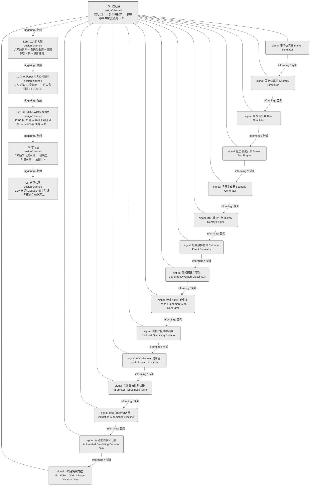
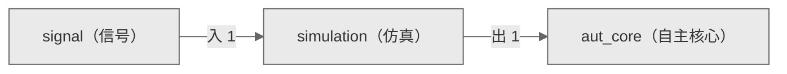

# Decision Flow · L2A Functional Domain simulation（仿真）

> 生成时间: 2026-07-30T22:18:45
> 真源: `architecture_model/domain/decision_graph_model.yaml` → PostgreSQL `decision_*` 表（TRAE-061）
> 数据库: depgraph (PostgreSQL)
> 导航: [返回主索引 decision_index.md](decision_index.md) | 模型驱动轨 → L2A → simulation

**所属轨**: 模型驱动轨（`model_driven`） | **所属层**: L2A | **功能域**: `simulation`（仿真）

> **域职责 / Responsibility**: 市场/策略/风控仿真、压力测试、场景生成与历史重放

## 统计

- 设计态节点数: 15
- 域内边数: 14
- 跨域出边: 1（1 个外部域）
- 跨域入边: 1（1 个外部域）

## 设计态全景图

> 共 6 层，14 边。

## Node 清单

| node_id / 节点ID | layer / 层 | type / 类型 | name / 名称 | path / 路径 | module_id / 模块 | 代码引用 / ref | maturity / 成熟度 | build_status / 构建状态 |
|---------|-------|------|------|------|-----------|----------|--------|--------------|
| 141 | L2A | signal / 信号节点 | 市场仿真器 Market Simulator | decision/simulation/sim_01 | - | - | design / 设计 | planned / 已规划 |
| 142 | L2A | signal / 信号节点 | 策略仿真器 Strategy Simulator | decision/simulation/sim_02 | - | - | design / 设计 | planned / 已规划 |
| 143 | L2A | signal / 信号节点 | 风控仿真器 Risk Simulator | decision/simulation/sim_03 | - | - | design / 设计 | planned / 已规划 |
| 144 | L2A | signal / 信号节点 | 压力测试引擎 Stress Test Engine | decision/simulation/sim_04 | - | - | design / 设计 | planned / 已规划 |
| 145 | L2A | signal / 信号节点 | 场景生成器 Scenario Generator | decision/simulation/sim_05 | - | - | design / 设计 | planned / 已规划 |
| 146 | L2A | signal / 信号节点 | 历史重放引擎 History Replay Engine | decision/simulation/sim_07 | - | - | design / 设计 | planned / 已规划 |
| 147 | L2A | signal / 信号节点 | 极端事件仿真 Extreme Event Simulator | decision/simulation/sim_10 | - | - | design / 设计 | planned / 已规划 |
| 148 | L2A | signal / 信号节点 | 依赖图数字孪生 Dependency Graph Digital Twin | decision/simulation/sim_13 | - | - | design / 设计 | planned / 已规划 |
| 149 | L2A | signal / 信号节点 | 混沌实验自动生成 Chaos Experiment Auto-Generator | decision/simulation/sim_15 | - | - | design / 设计 | planned / 已规划 |
| 150 | L2A | signal / 信号节点 | 回测过拟合检测器 Backtest Overfitting Detector | decision/simulation/sim_18 | - | - | design / 设计 | planned / 已规划 |
| 151 | L2A | signal / 信号节点 | Walk-Forward分析器 Walk-Forward Analyzer | decision/simulation/sim_19 | - | - | design / 设计 | planned / 已规划 |
| 152 | L2A | signal / 信号节点 | 参数鲁棒性测试器 Parameter Robustness Tester | decision/simulation/sim_21 | - | - | design / 设计 | planned / 已规划 |
| 153 | L2A | signal / 信号节点 | 验证自动化流水线 Validation Automation Pipeline | decision/simulation/sim_33 | - | - | design / 设计 | planned / 已规划 |
| 154 | L2A | signal / 信号节点 | 自动化过拟合门禁 Automated Overfitting Detector Gate | decision/simulation/sim_56 | - | - | design / 设计 | planned / 已规划 |
| 155 | L2A | signal / 信号节点 | 3阶段决策门控 IS→WFA→OOS 3-Stage Decision Gate | decision/simulation/sim_g1 | - | - | design / 设计 | planned / 已规划 |

## Edge 清单（域内）

| edge_id / 边ID | from / 起点 | to / 终点 | type / 类型 | condition / 条件 | track / 轨 |
|---------|-------|-----|------|-----------|-------|
| 51 | 141 | 142 | informing / 告知 | L2A层内顺序流 | - |
| 52 | 142 | 143 | informing / 告知 | L2A层内顺序流 | - |
| 53 | 143 | 144 | informing / 告知 | L2A层内顺序流 | - |
| 54 | 144 | 145 | informing / 告知 | L2A层内顺序流 | - |
| 55 | 145 | 146 | informing / 告知 | L2A层内顺序流 | - |
| 56 | 146 | 147 | informing / 告知 | L2A层内顺序流 | - |
| 57 | 147 | 148 | informing / 告知 | L2A层内顺序流 | - |
| 58 | 148 | 149 | informing / 告知 | L2A层内顺序流 | - |
| 59 | 149 | 150 | informing / 告知 | L2A层内顺序流 | - |
| 60 | 150 | 151 | informing / 告知 | L2A层内顺序流 | - |
| 61 | 151 | 152 | informing / 告知 | L2A层内顺序流 | - |
| 62 | 152 | 153 | informing / 告知 | L2A层内顺序流 | - |
| 63 | 153 | 154 | informing / 告知 | L2A层内顺序流 | - |
| 64 | 154 | 155 | informing / 告知 | L2A层内顺序流 | - |

## 跨域出边（Depends On）

| # | 本域节点 / from | → | 外部域-目标节点 / to | type / 类型 |
|:--:|---------|:--:|---------|---------|
| 1 | decision/simulation/sim_g1 | → | decision/aut_core/ac_01 | informing / 告知 |

## 跨域入边（Depended By）

| # | 外部域-源节点 / from | → | 本域节点 / to | type / 类型 |
|:--:|---------|:--:|---------|---------|
| 1 | decision/signal/sg_13 | → | decision/simulation/sim_01 | informing / 告知 |

## 跨域依赖图（Cross-Domain Dependency Graph）

> 本域与 2 个外部域直接连接 / This domain directly connects to 2 external domain(s).

