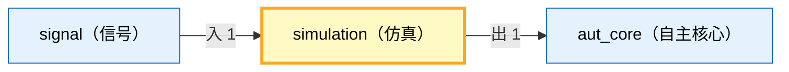

# Decision Flow · L2A Functional Domain simulation（仿真）

> 生成时间: 2026-07-30T01:41:53
> 真源: `architecture_model/domain/decision_graph_model.yaml` → PostgreSQL `decision_*` 表（TRAE-061）
> 数据库: depgraph (PostgreSQL)
> 导航: [返回主索引 decision_index.md](decision_index.md) | 模型驱动轨 → L2A → simulation

**所属轨**: 模型驱动轨（`model_driven`） | **所属层**: L2A | **功能域**: `simulation`（仿真）

## 统计

- 设计态节点数: 15
- 域内边数: 14
- 跨域出边: 1（1 个外部域）
- 跨域入边: 1（1 个外部域）

## 设计态全景图

> 共 7 层，14 边。

```mermaid
flowchart TD
    subgraph track_model_driven["模型驱动轨（Model-Driven Track）"]
        LL2A["[design]L2A: 信号层<br/>功能: 信号工厂 → 多策略投票 → 收益率条…<br/>freq: daily<br/>build: planned"]:::bsPlanned
        N141("[design]signal: 市场仿真器 Market Simulator<br/>path: decision/simulation/sim_01"):::bsPlanned
        LL2A --- N141
        N142("[design]signal: 策略仿真器 Strategy Simulator<br/>path: decision/simulation/sim_02"):::bsPlanned
        LL2A --- N142
        N143("[design]signal: 风控仿真器 Risk Simulator<br/>path: decision/simulation/sim_03"):::bsPlanned
        LL2A --- N143
        N144("[design]signal: 压力测试引擎 Stress Test Engine<br/>path: decision/simulation/sim_04"):::bsPlanned
        LL2A --- N144
        N145("[design]signal: 场景生成器 Scenario Generator<br/>path: decision/simulation/sim_05"):::bsPlanned
        LL2A --- N145
        N146("[design]signal: 历史重放引擎 History Replay Engine<br/>path: decision/simulation/sim_07"):::bsPlanned
        LL2A --- N146
        N147("[design]signal: 极端事件仿真 Extreme Event Simulator<br/>path: decision/simulation/sim_10"):::bsPlanned
        LL2A --- N147
        N148("[design]signal: 依赖图数字孪生 Dependency Graph Digital Twin<br/>path: decision/simulation/sim_13"):::bsPlanned
        LL2A --- N148
        N149("[design]signal: 混沌实验自动生成 Chaos Experiment Auto-Generator<br/>path: decision/simulation/sim_15"):::bsPlanned
        LL2A --- N149
        N150("[design]signal: 回测过拟合检测器 Backtest Overfitting Detector<br/>path: decision/simulation/sim_18"):::bsPlanned
        LL2A --- N150
        N151("[design]signal: Walk-Forward分析器 Walk-Forward Analyzer<br/>path: decision/simulation/sim_19"):::bsPlanned
        LL2A --- N151
        N152("[design]signal: 参数鲁棒性测试器 Parameter Robustness Tester<br/>path: decision/simulation/sim_21"):::bsPlanned
        LL2A --- N152
        N153("[design]signal: 验证自动化流水线 Validation Automation Pipeline<br/>path: decision/simulation/sim_33"):::bsPlanned
        LL2A --- N153
        N154("[design]signal: 自动化过拟合门禁 Automated Overfitting Detector Gate<br/>path: decision/simulation/sim_56"):::bsPlanned
        LL2A --- N154
        N155("[design]signal: 3阶段决策门控 IS→WFA→OOS 3-Stage Decision Gate<br/>path: decision/simulation/sim_g1"):::bsPlanned
        LL2A --- N155
        LL2B["[design]L2B: 主力行为层<br/>功能: 六阶段识别 + 自迭代推演 + 庄家专…<br/>freq: daily<br/>build: planned"]:::bsPlanned
        LL2C["[design]L2C: 市场状态与大盘预测层<br/>功能: 3×3矩阵 + 2叠加态 + 三层大盘…<br/>freq: daily<br/>build: planned"]:::bsPlanned
        LL2D["[design]L2D: 知识图谱与因果推演层<br/>功能: 六类知识图谱 → 事件影响链分析 → …<br/>freq: daily<br/>build: planned"]:::bsPlanned
        LL3["[design]L3: 策略组合层<br/>功能: 多策略信号合成 → 资本分配 → 元策…<br/>freq: daily<br/>build: planned"]:::bsPlanned
        LL5["[design]L5: 学习层<br/>功能: 7阶段学习流水线 → 模块工厂 → 知…<br/>freq: weekly<br/>build: planned"]:::bsPlanned
        LL6["[design]L6: 自评估层<br/>功能: LLM 自评估(Judge+交叉验证)…<br/>freq: weekly<br/>build: planned"]:::bsPlanned
    end
    LL2A -.->|triggering| LL2B
    LL2B -.->|triggering| LL2C
    LL2C -.->|triggering| LL2D
    LL2D -.->|triggering| LL3
    LL3 -.->|triggering| LL5
    LL5 -.->|triggering| LL6
    N141 -->|informing| N142
    N142 -->|informing| N143
    N143 -->|informing| N144
    N144 -->|informing| N145
    N145 -->|informing| N146
    N146 -->|informing| N147
    N147 -->|informing| N148
    N148 -->|informing| N149
    N149 -->|informing| N150
    N150 -->|informing| N151
    N151 -->|informing| N152
    N152 -->|informing| N153
    N153 -->|informing| N154
    N154 -->|informing| N155

    classDef bsStable fill:#c8e6c9,stroke:#2e7d32,stroke-width:2px,color:#000
    classDef bsGenerated fill:#fff9c4,stroke:#f9a825,stroke-width:2px,color:#000
    classDef bsTesting fill:#ffe0b2,stroke:#ef6c00,stroke-width:2px,color:#000
    classDef bsPlanned fill:#e1f5fe,stroke:#0277bd,stroke-width:2px,color:#000,stroke-dasharray: 5 5
    classDef bsDeprecated fill:#ffcdd2,stroke:#c62828,stroke-width:2px,color:#000,stroke-dasharray: 5 5
```

## Node 清单

| node_id | layer | type | name | path | module_id | 代码引用 | 成熟度 | build_status |
|---------|-------|------|------|------|-----------|----------|--------|--------------|
| 141 | L2A | signal | 市场仿真器 Market Simulator | decision/simulation/sim_01 | - | - | design | planned |
| 142 | L2A | signal | 策略仿真器 Strategy Simulator | decision/simulation/sim_02 | - | - | design | planned |
| 143 | L2A | signal | 风控仿真器 Risk Simulator | decision/simulation/sim_03 | - | - | design | planned |
| 144 | L2A | signal | 压力测试引擎 Stress Test Engine | decision/simulation/sim_04 | - | - | design | planned |
| 145 | L2A | signal | 场景生成器 Scenario Generator | decision/simulation/sim_05 | - | - | design | planned |
| 146 | L2A | signal | 历史重放引擎 History Replay Engine | decision/simulation/sim_07 | - | - | design | planned |
| 147 | L2A | signal | 极端事件仿真 Extreme Event Simulator | decision/simulation/sim_10 | - | - | design | planned |
| 148 | L2A | signal | 依赖图数字孪生 Dependency Graph Digital Twin | decision/simulation/sim_13 | - | - | design | planned |
| 149 | L2A | signal | 混沌实验自动生成 Chaos Experiment Auto-Generator | decision/simulation/sim_15 | - | - | design | planned |
| 150 | L2A | signal | 回测过拟合检测器 Backtest Overfitting Detector | decision/simulation/sim_18 | - | - | design | planned |
| 151 | L2A | signal | Walk-Forward分析器 Walk-Forward Analyzer | decision/simulation/sim_19 | - | - | design | planned |
| 152 | L2A | signal | 参数鲁棒性测试器 Parameter Robustness Tester | decision/simulation/sim_21 | - | - | design | planned |
| 153 | L2A | signal | 验证自动化流水线 Validation Automation Pipeline | decision/simulation/sim_33 | - | - | design | planned |
| 154 | L2A | signal | 自动化过拟合门禁 Automated Overfitting Detector Gate | decision/simulation/sim_56 | - | - | design | planned |
| 155 | L2A | signal | 3阶段决策门控 IS→WFA→OOS 3-Stage Decision Gate | decision/simulation/sim_g1 | - | - | design | planned |

## Edge 清单（域内）

| edge_id | from | to | type | condition | track |
|---------|-------|-----|------|-----------|-------|
| 51 | 141 | 142 | informing | L2A层内顺序流 | - |
| 52 | 142 | 143 | informing | L2A层内顺序流 | - |
| 53 | 143 | 144 | informing | L2A层内顺序流 | - |
| 54 | 144 | 145 | informing | L2A层内顺序流 | - |
| 55 | 145 | 146 | informing | L2A层内顺序流 | - |
| 56 | 146 | 147 | informing | L2A层内顺序流 | - |
| 57 | 147 | 148 | informing | L2A层内顺序流 | - |
| 58 | 148 | 149 | informing | L2A层内顺序流 | - |
| 59 | 149 | 150 | informing | L2A层内顺序流 | - |
| 60 | 150 | 151 | informing | L2A层内顺序流 | - |
| 61 | 151 | 152 | informing | L2A层内顺序流 | - |
| 62 | 152 | 153 | informing | L2A层内顺序流 | - |
| 63 | 153 | 154 | informing | L2A层内顺序流 | - |
| 64 | 154 | 155 | informing | L2A层内顺序流 | - |

## 跨域出边（Depends On）

| # | 本域节点 | → | 外部域-目标节点 | type |
|:--:|---------|:--:|---------|---------|
| 1 | decision/simulation/sim_g1 | → | decision/aut_core/ac_01 | informing |

## 跨域入边（Depended By）

| # | 外部域-源节点 | → | 本域节点 | type |
|:--:|---------|:--:|---------|---------|
| 1 | decision/signal/sg_13 | → | decision/simulation/sim_01 | informing |

## 跨域依赖图（Cross-Domain Dependency Graph）

> 本域与 2 个外部域直接连接 / This domain directly connects to 2 external domain(s).

