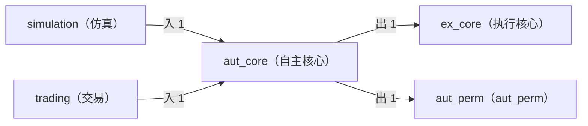

# Decision Flow · L3 Functional Domain aut_core（自主核心）

> 生成时间: 2026-07-30T17:35:01
> 真源: `architecture_model/domain/decision_graph_model.yaml` → PostgreSQL `decision_*` 表（TRAE-061）
> 数据库: depgraph (PostgreSQL)
> 导航: [返回主索引 decision_index.md](decision_index.md) | 模型驱动轨 → L3 → aut_core

**所属轨**: 模型驱动轨（`model_driven`） | **所属层**: L3 | **功能域**: `aut_core`（自主核心）

## 统计

- 设计态节点数: 11
- 域内边数: 10
- 跨域出边: 2（2 个外部域）
- 跨域入边: 2（2 个外部域）

## 设计态全景图

> 共 7 层，10 边。

```mermaid
flowchart TD
    subgraph track_model_driven["模型驱动轨（Model-Driven Track）"]
        LL2A["[design]L2A: 信号层<br/>功能: 信号工厂 → 多策略投票 → 收益率条…<br/>freq: daily<br/>build: planned"]
        LL2B["[design]L2B: 主力行为层<br/>功能: 六阶段识别 + 自迭代推演 + 庄家专…<br/>freq: daily<br/>build: planned"]
        LL2C["[design]L2C: 市场状态与大盘预测层<br/>功能: 3×3矩阵 + 2叠加态 + 三层大盘…<br/>freq: daily<br/>build: planned"]
        LL2D["[design]L2D: 知识图谱与因果推演层<br/>功能: 六类知识图谱 → 事件影响链分析 → …<br/>freq: daily<br/>build: planned"]
        LL3["[design]L3: 策略组合层<br/>功能: 多策略信号合成 → 资本分配 → 元策…<br/>freq: daily<br/>build: planned"]
        N113("[design]portfolio_target: Permission Guard 七层纵深防御<br/>path: decision/aut_core/ac_01")
        LL3 --- N113
        N115("[design]portfolio_target: Self-Healing Git-native自愈<br/>path: decision/aut_core/ac_03")
        LL3 --- N115
        N116("[design]portfolio_target: Budget Enforcer 七级预算<br/>path: decision/aut_core/ac_04")
        LL3 --- N116
        N117("[design]portfolio_target: Health Monitor 9子系统监控<br/>path: decision/aut_core/ac_05")
        LL3 --- N117
        N118("[design]portfolio_target: Escalation Engine 升级引擎<br/>path: decision/aut_core/ac_06")
        LL3 --- N118
        N119("[design]portfolio_target: Rollback Engine Git-native回滚<br/>path: decision/aut_core/ac_07")
        LL3 --- N119
        N120("[design]portfolio_target: Drift Detector 39检测器<br/>path: decision/aut_core/ac_08")
        LL3 --- N120
        N121("[design]portfolio_target: Auto-Fix Engine 16修复器<br/>path: decision/aut_core/ac_09")
        LL3 --- N121
        N133("[design]portfolio_target: 编排Agent Orchestrator<br/>path: decision/aut_core/ac_21")
        LL3 --- N133
        N135("[design]portfolio_target: 做TAgent T0Trader<br/>path: decision/aut_core/ac_23")
        LL3 --- N135
        N136("[design]portfolio_target: 路由Agent Router<br/>path: decision/aut_core/ac_24")
        LL3 --- N136
        LL5["[design]L5: 学习层<br/>功能: 7阶段学习流水线 → 模块工厂 → 知…<br/>freq: weekly<br/>build: planned"]
        LL6["[design]L6: 自评估层<br/>功能: LLM 自评估(Judge+交叉验证)…<br/>freq: weekly<br/>build: planned"]
    end
    LL2A -.->|triggering| LL2B
    LL2B -.->|triggering| LL2C
    LL2C -.->|triggering| LL2D
    LL2D -.->|triggering| LL3
    LL3 -.->|triggering| LL5
    LL5 -.->|triggering| LL6
    N113 -->|informing| N115
    N115 -->|informing| N116
    N116 -->|informing| N117
    N117 -->|informing| N118
    N118 -->|informing| N119
    N119 -->|informing| N120
    N120 -->|informing| N121
    N121 -->|informing| N133
    N133 -->|informing| N135
    N135 -->|informing| N136
```

## Node 清单

| node_id | layer | type | name | path | module_id | 代码引用 | 成熟度 | build_status |
|---------|-------|------|------|------|-----------|----------|--------|--------------|
| 113 | L3 | portfolio_target | Permission Guard 七层纵深防御 | decision/aut_core/ac_01 | MOD-L05-001 | - | design | planned |
| 115 | L3 | portfolio_target | Self-Healing Git-native自愈 | decision/aut_core/ac_03 | MOD-L05-001 | - | design | planned |
| 116 | L3 | portfolio_target | Budget Enforcer 七级预算 | decision/aut_core/ac_04 | MOD-L05-001 | - | design | planned |
| 117 | L3 | portfolio_target | Health Monitor 9子系统监控 | decision/aut_core/ac_05 | MOD-L05-001 | - | design | planned |
| 118 | L3 | portfolio_target | Escalation Engine 升级引擎 | decision/aut_core/ac_06 | MOD-L05-001 | - | design | planned |
| 119 | L3 | portfolio_target | Rollback Engine Git-native回滚 | decision/aut_core/ac_07 | MOD-L05-001 | - | design | planned |
| 120 | L3 | portfolio_target | Drift Detector 39检测器 | decision/aut_core/ac_08 | MOD-L05-001 | - | design | planned |
| 121 | L3 | portfolio_target | Auto-Fix Engine 16修复器 | decision/aut_core/ac_09 | MOD-L05-001 | - | design | planned |
| 133 | L3 | portfolio_target | 编排Agent Orchestrator | decision/aut_core/ac_21 | MOD-L05-001 | - | design | planned |
| 135 | L3 | portfolio_target | 做TAgent T0Trader | decision/aut_core/ac_23 | MOD-L05-001 | - | design | planned |
| 136 | L3 | portfolio_target | 路由Agent Router | decision/aut_core/ac_24 | MOD-L05-001 | - | design | planned |

## Edge 清单（域内）

| edge_id | from | to | type | condition | track |
|---------|-------|-----|------|-----------|-------|
| 65 | 113 | 115 | informing | L3层内顺序流 | - |
| 66 | 115 | 116 | informing | L3层内顺序流 | - |
| 67 | 116 | 117 | informing | L3层内顺序流 | - |
| 68 | 117 | 118 | informing | L3层内顺序流 | - |
| 69 | 118 | 119 | informing | L3层内顺序流 | - |
| 70 | 119 | 120 | informing | L3层内顺序流 | - |
| 71 | 120 | 121 | informing | L3层内顺序流 | - |
| 72 | 121 | 133 | informing | L3层内顺序流 | - |
| 73 | 133 | 135 | informing | L3层内顺序流 | - |
| 74 | 135 | 136 | informing | L3层内顺序流 | - |

## 跨域出边（Depends On）

| # | 本域节点 | → | 外部域-目标节点 | type |
|:--:|---------|:--:|---------|---------|
| 1 | decision/aut_core/ac_24 | → | decision/ex_core/ex_03 | informing |
| 2 | decision/aut_core/ac_22 | → | decision/aut_perm/ap_11 | informing |

## 跨域入边（Depended By）

| # | 外部域-源节点 | → | 本域节点 | type |
|:--:|---------|:--:|---------|---------|
| 1 | decision/simulation/sim_g1 | → | decision/aut_core/ac_01 | informing |
| 2 | decision/trading/trd_11 | → | decision/aut_core/ac_02 | informing |

## 跨域依赖图（Cross-Domain Dependency Graph）

> 本域与 4 个外部域直接连接 / This domain directly connects to 4 external domain(s).

