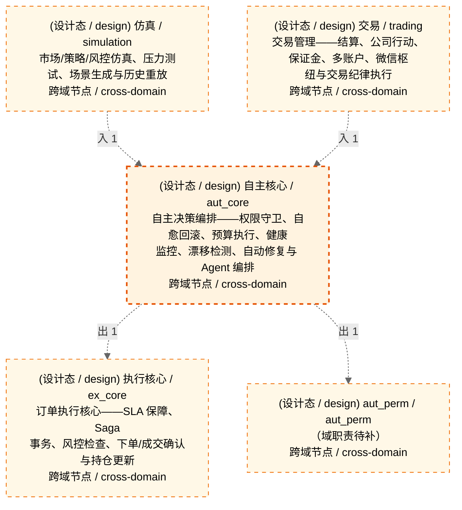

# Decision Flow · L3 Functional Domain aut_core（自主核心）

> 生成时间: 2026-08-02T22:07:21
> 真源: `architecture_model/domain/decision_graph_model.yaml` → PostgreSQL `decision_*` 表（TRAE-061）
> 数据库: depgraph (PostgreSQL)
> 导航: [返回主索引 decision_index.md](decision_index.md) | 模型驱动轨 → L3 → aut_core

> **[可缩放 HTML 版 / Zoomable HTML](http://localhost:8765/docs/02_enterprise_architecture/06_decision_architecture/_zoomable_html/13_decision_l3_aut_core.html)** — Ctrl+滚轮缩放 ｜ 双击重置 ｜ Ctrl+Shift+D 切换拖动/选择模式

**所属轨**: 模型驱动轨（`model_driven`） | **所属层**: L3 | **功能域**: `aut_core`（自主核心）

> **域职责 / Responsibility**: 自主决策编排——权限守卫、自愈回滚、预算执行、健康监控、漂移检测、自动修复与 Agent 编排

## 统计

- 决策节点数（全部）: 11
- 运营态节点数（production）: 0
- 设计态节点数（design）: 11
- 域内边数: 10
- 跨域出边: 2（2 个外部域）
- 跨域入边: 2（2 个外部域）

## 域内依赖图 / Internal Dependency Diagram

> **图例说明 / Legend**：
> - 🟦 **蓝色 = 运营态模块**（production，已上线运行）
> - 🟧 **橙色虚线 = 设计态模块**（design，蓝图阶段，代码未写）
> - **实线箭头 `-->` = 运营态依赖**（两端都 production）
> - **虚线箭头 `-.->` = 非运营态依赖**（含 design / 混合）

### 全景图（全部模块，颜色区分运营态/设计态）

> 展示全部 11 个决策节点（运营态 0 + 设计态 11），含跨域依赖外部节点。

> 共 10 层，12 边。

```mermaid
%%{init: {'theme': 'base', 'themeVariables': {'primaryColor': '#eaeaea', 'primaryTextColor': '#333333', 'primaryBorderColor': '#666666', 'lineColor': '#666666', 'secondaryColor': '#eaeaea', 'tertiaryColor': '#eaeaea', 'clusterBkg': 'transparent', 'clusterBorder': 'transparent', 'fontSize': '14px'}}}%%
flowchart TD
    LL0["(生产态 / production) L0 数据接入与预处理层 /<br/>Data Ingestion & Preprocessing<br/>miniQMT + iFind + tushare + 另类数据源 →<br/>事件总线 → 分层时序存储 产出：tick_data / ohlc_<br/>bar / factor_input_data<br/>文件: MOD-MKT_DATA"]
    LL1["(生产态 / production) L1 因子计算层 / Factor<br/>Calculation<br/>因子工厂全生命周期管理 → 盘前全量<br/>/盘中增量双模计算 → 因子池 产出：factor_value<br/>（带 PIT 合规标记）<br/>文件: MOD-L02-001"]
    LL2A["(设计态 / design) L2A 信号层 / Signal Generation<br/>信号工厂 → 多策略投票 → 收益率条件密度预测 →<br/>Transformer/Mamba时序增强 → 共形预测<br/>产出：signal（Insight: direction/confidence<br/>/horizon）<br/>文件: （设计态，暂无代码引用）"]
    LL2B["(设计态 / design) L2B 主力行为层 / Main Force<br/>Behavior Analysis<br/>六阶段识别 + 自迭代推演 + 庄家专项 +<br/>群体博弈模拟 产出：main_force_signal<br/>（主力行为画像）<br/>文件: （设计态，暂无代码引用）"]
    LL2C["(设计态 / design) L2C 市场状态与大盘预测层 /<br/>Market State & Index Prediction<br/>3×3矩阵 + 2叠加态 + 三层大盘预测 +<br/>T+1次日8态走势预测 + 体制转换检测(HMM/变点)<br/>产出：market_state_prediction（大盘方向/波动率<br/>/体制判断）<br/>文件: （设计态，暂无代码引用）"]
    LL2D["(设计态 / design) L2D 知识图谱与因果推演层 /<br/>Knowledge Graph & Causal Inference<br/>六类知识图谱 → 事件影响链分析 → 因果传导推演 →<br/>GNN股票关系建模 → Causal ML 产出：causal_<br/>inference_result（因果推断结果）<br/>文件: （设计态，暂无代码引用）"]
    LL3["(生产态 / production) L3 策略组合层 / Strategy<br/>& Portfolio Combination<br/>多策略信号合成 → 资本分配 → 元策略路由 →<br/>组合构建 产出：portfolio_target<br/>（PortfolioTarget: 目标仓位）<br/>文件: MOD-L05-001"]
    N113["(设计态 / design) Permission Guard 七层纵深防御<br/>七层权限校验的纵深防御体系，层层拦截越权操作<br/>文件: decision/aut_core/ac_01"]
    LL3 --- N113
    N115["(设计态 / design) Self-Healing Git-native自愈<br/>基于 Git 的自愈机制自动修复故障，缩短故障恢复时<br/>间<br/>文件: decision/aut_core/ac_03"]
    LL3 --- N115
    N116["(设计态 / design) Budget Enforcer 七级预算<br/>七级预算控制资源消耗上限，防止资源失控耗尽<br/>文件: decision/aut_core/ac_04"]
    LL3 --- N116
    N117["(设计态 / design) Health Monitor 9子系统监控<br/>监控九个子系统的健康状态，全面掌握系统运行状况<br/>文件: decision/aut_core/ac_05"]
    LL3 --- N117
    N118["(设计态 / design) Escalation Engine 升级引擎<br/>故障按严重程度升级处理的引擎，确保问题被合适层级<br/>处理<br/>文件: decision/aut_core/ac_06"]
    LL3 --- N118
    N119["(设计态 / design) Rollback Engine Git-native回滚<br/>基于 Git 的快速回滚引擎，出问题时秒级回退到上个<br/>正常版本<br/>文件: decision/aut_core/ac_07"]
    LL3 --- N119
    N120["(设计态 / design) Drift Detector 39检测器<br/>多个漂移检测器监控系统各维度漂移，及早发现架构腐<br/>化<br/>文件: decision/aut_core/ac_08"]
    LL3 --- N120
    N121["(设计态 / design) Auto-Fix Engine 16修复器<br/>多个自动修复器对应常见故障自动修复，减少人工介入<br/>文件: decision/aut_core/ac_09"]
    LL3 --- N121
    N133["(设计态 / design) 编排Agent Orchestrator<br/>编排多个 Agent 协同完成复杂任务，统一调度 Agent<br/>工作流<br/>文件: decision/aut_core/ac_21"]
    LL3 --- N133
    N135["(设计态 / design) 做TAgent T0Trader<br/>执行日内做T高抛低吸的 Agent，自动化日内交易<br/>文件: decision/aut_core/ac_23"]
    LL3 --- N135
    N136["(设计态 / design) 路由Agent Router<br/>按任务类型路由到合适的 Agent 处理，提升 Agent<br/>调度效率<br/>文件: decision/aut_core/ac_24"]
    LL3 --- N136
    LL4["(生产态 / production) L4 风控层 / Risk Control<br/>Pre/Post-Trade 风控校验 + Kill Switch 熔断 +<br/>止损评估 产出：risk_check（RiskDecision:<br/>approve/veto/adjust）<br/>文件: MOD-L04-001"]
    N114["(设计态 / design) Audit Trail Merkle哈希链<br/>用哈希链记录审计轨迹，保证审计记录不可篡改<br/>文件: decision/aut_core/ac_02"]
    LL4 --- N114
    N122["(设计态 / design) Decision Audit Trail 决策审计<br/>完整记录每个决策的审计轨迹，支持事后追溯每个决策<br/>的来龙去脉<br/>文件: decision/aut_core/ac_10"]
    LL4 --- N122
    N134["(设计态 / design) 风控Agent RiskManager<br/>作为风控管理者的 Agent，自动化执行风控管理职责<br/>文件: decision/aut_core/ac_22"]
    LL4 --- N134
    LL5["(设计态 / design) L5 学习层 / Learning &<br/>Optimization<br/>7阶段学习流水线 → 模块工厂 → 知识采集 →<br/>反馈闭环 产出：learning_feedback（策略优化建议）<br/>文件: （设计态，暂无代码引用）"]
    LL6["(设计态 / design) L6 自评估层 / Self Evaluation<br/>LLM 自评估(Judge+交叉验证) + 多模态金融推理 +<br/>VeNRA零幻觉锚定 产出：self_evaluation<br/>（决策质量评估）<br/>文件: （设计态，暂无代码引用）"]
    LL0 -->|triggering / 触发| LL1
    LL1 -.->|triggering / 触发| LL2A
    LL2A -.->|triggering / 触发| LL2B
    LL2B -.->|triggering / 触发| LL2C
    LL2C -.->|triggering / 触发| LL2D
    LL2D -.->|triggering / 触发| LL3
    LL3 -->|triggering / 触发| LL4
    LL4 -.->|triggering / 触发| LL5
    LL5 -.->|triggering / 触发| LL6
    N113 -.->|informing / 告知| N115
    N115 -.->|informing / 告知| N116
    N116 -.->|informing / 告知| N117
    N117 -.->|informing / 告知| N118
    N118 -.->|informing / 告知| N119
    N119 -.->|informing / 告知| N120
    N120 -.->|informing / 告知| N121
    N121 -.->|informing / 告知| N133
    N133 -.->|informing / 告知| N135
    N135 -.->|informing / 告知| N136
    N114 -.->|informing / 告知| N122
    N122 -.->|informing / 告知| N134
    classDef production fill:#e1f5fe,stroke:#01579b,stroke-width:2px,color:#000
    classDef design fill:#fff3e0,stroke:#e65100,stroke-width:2px,color:#000,stroke-dasharray: 5 5
    classDef external_prod fill:#e8f4fd,stroke:#0277bd,stroke-width:1px,color:#000
    classDef external_design fill:#fff8e7,stroke:#ef6c00,stroke-width:1px,color:#000,stroke-dasharray: 5 5
    class LL0,LL1,LL3,LL4 production
    class LL2A,LL2B,LL2C,LL2D,N113,N115,N116,N117,N118,N119,N120,N121,N133,N135,N136,N114,N122,N134,LL5,LL6 design
```

### 运营态的图（仅 design_maturity=production 的模块和域内依赖）

> 仅展示已上线运行的决策节点（共 0 个），不含跨域外部节点。跨域依赖见下方跨域依赖章节。

> （无模块 / No modules）

### 设计态的图（仅 design_maturity=design 的模块和域内依赖）

> 仅展示蓝图阶段、代码未写的设计态决策节点（共 11 个），不含跨域外部节点。

> 共 6 层，0 边。

```mermaid
%%{init: {'theme': 'base', 'themeVariables': {'primaryColor': '#eaeaea', 'primaryTextColor': '#333333', 'primaryBorderColor': '#666666', 'lineColor': '#666666', 'secondaryColor': '#eaeaea', 'tertiaryColor': '#eaeaea', 'clusterBkg': 'transparent', 'clusterBorder': 'transparent', 'fontSize': '14px'}}}%%
flowchart TD
    LL2A["(设计态 / design) L2A 信号层 / Signal Generation<br/>信号工厂 → 多策略投票 → 收益率条件密度预测 →<br/>Transformer/Mamba时序增强 → 共形预测<br/>产出：signal（Insight: direction/confidence<br/>/horizon）<br/>文件: （设计态，暂无代码引用）"]
    LL2B["(设计态 / design) L2B 主力行为层 / Main Force<br/>Behavior Analysis<br/>六阶段识别 + 自迭代推演 + 庄家专项 +<br/>群体博弈模拟 产出：main_force_signal<br/>（主力行为画像）<br/>文件: （设计态，暂无代码引用）"]
    LL2C["(设计态 / design) L2C 市场状态与大盘预测层 /<br/>Market State & Index Prediction<br/>3×3矩阵 + 2叠加态 + 三层大盘预测 +<br/>T+1次日8态走势预测 + 体制转换检测(HMM/变点)<br/>产出：market_state_prediction（大盘方向/波动率<br/>/体制判断）<br/>文件: （设计态，暂无代码引用）"]
    LL2D["(设计态 / design) L2D 知识图谱与因果推演层 /<br/>Knowledge Graph & Causal Inference<br/>六类知识图谱 → 事件影响链分析 → 因果传导推演 →<br/>GNN股票关系建模 → Causal ML 产出：causal_<br/>inference_result（因果推断结果）<br/>文件: （设计态，暂无代码引用）"]
    LL5["(设计态 / design) L5 学习层 / Learning &<br/>Optimization<br/>7阶段学习流水线 → 模块工厂 → 知识采集 →<br/>反馈闭环 产出：learning_feedback（策略优化建议）<br/>文件: （设计态，暂无代码引用）"]
    LL6["(设计态 / design) L6 自评估层 / Self Evaluation<br/>LLM 自评估(Judge+交叉验证) + 多模态金融推理 +<br/>VeNRA零幻觉锚定 产出：self_evaluation<br/>（决策质量评估）<br/>文件: （设计态，暂无代码引用）"]
    LL2A -.->|triggering / 触发| LL2B
    LL2B -.->|triggering / 触发| LL2C
    LL2C -.->|triggering / 触发| LL2D
    LL2D -.->|triggering / 触发| LL5
    LL5 -.->|triggering / 触发| LL6
    classDef production fill:#e1f5fe,stroke:#01579b,stroke-width:2px,color:#000
    classDef design fill:#fff3e0,stroke:#e65100,stroke-width:2px,color:#000,stroke-dasharray: 5 5
    classDef external_prod fill:#e8f4fd,stroke:#0277bd,stroke-width:1px,color:#000
    classDef external_design fill:#fff8e7,stroke:#ef6c00,stroke-width:1px,color:#000,stroke-dasharray: 5 5
    class LL2A,LL2B,LL2C,LL2D,LL5,LL6 design
```

## Node 清单

| node_id / 节点ID | layer / 层 | type / 类型 | name / 名称 | path / 路径 | module_id / 模块 | 代码引用 / ref | maturity / 成熟度 | build_status / 构建状态 |
|---------|-------|------|------|------|-----------|----------|--------|--------------|
| 113 | L3 | portfolio_target / 组合目标节点 | Permission Guard 七层纵深防御 | decision/aut_core/ac_01 | MOD-L05-001 | - | design / 设计 | planned / 已规划 |
| 115 | L3 | portfolio_target / 组合目标节点 | Self-Healing Git-native自愈 | decision/aut_core/ac_03 | MOD-L05-001 | - | design / 设计 | planned / 已规划 |
| 116 | L3 | portfolio_target / 组合目标节点 | Budget Enforcer 七级预算 | decision/aut_core/ac_04 | MOD-L05-001 | - | design / 设计 | planned / 已规划 |
| 117 | L3 | portfolio_target / 组合目标节点 | Health Monitor 9子系统监控 | decision/aut_core/ac_05 | MOD-L05-001 | - | design / 设计 | planned / 已规划 |
| 118 | L3 | portfolio_target / 组合目标节点 | Escalation Engine 升级引擎 | decision/aut_core/ac_06 | MOD-L05-001 | - | design / 设计 | planned / 已规划 |
| 119 | L3 | portfolio_target / 组合目标节点 | Rollback Engine Git-native回滚 | decision/aut_core/ac_07 | MOD-L05-001 | - | design / 设计 | planned / 已规划 |
| 120 | L3 | portfolio_target / 组合目标节点 | Drift Detector 39检测器 | decision/aut_core/ac_08 | MOD-L05-001 | - | design / 设计 | planned / 已规划 |
| 121 | L3 | portfolio_target / 组合目标节点 | Auto-Fix Engine 16修复器 | decision/aut_core/ac_09 | MOD-L05-001 | - | design / 设计 | planned / 已规划 |
| 133 | L3 | portfolio_target / 组合目标节点 | 编排Agent Orchestrator | decision/aut_core/ac_21 | MOD-L05-001 | - | design / 设计 | planned / 已规划 |
| 135 | L3 | portfolio_target / 组合目标节点 | 做TAgent T0Trader | decision/aut_core/ac_23 | MOD-L05-001 | - | design / 设计 | planned / 已规划 |
| 136 | L3 | portfolio_target / 组合目标节点 | 路由Agent Router | decision/aut_core/ac_24 | MOD-L05-001 | - | design / 设计 | planned / 已规划 |

## Edge 清单（域内）

| edge_id / 边ID | from / 起点 | to / 终点 | type / 类型 | condition / 条件 | track / 轨 |
|---------|-------|-----|------|-----------|-------|
| 65 | 113 | 115 | informing / 告知 | L3层内顺序流 | - |
| 66 | 115 | 116 | informing / 告知 | L3层内顺序流 | - |
| 67 | 116 | 117 | informing / 告知 | L3层内顺序流 | - |
| 68 | 117 | 118 | informing / 告知 | L3层内顺序流 | - |
| 69 | 118 | 119 | informing / 告知 | L3层内顺序流 | - |
| 70 | 119 | 120 | informing / 告知 | L3层内顺序流 | - |
| 71 | 120 | 121 | informing / 告知 | L3层内顺序流 | - |
| 72 | 121 | 133 | informing / 告知 | L3层内顺序流 | - |
| 73 | 133 | 135 | informing / 告知 | L3层内顺序流 | - |
| 74 | 135 | 136 | informing / 告知 | L3层内顺序流 | - |

## 跨域出边（Depends On）

| # | 本域节点 / from | → | 外部域-目标节点 / to | type / 类型 |
|:--:|---------|:--:|---------|---------|
| 1 | decision/aut_core/ac_24 | → | decision/ex_core/ex_03 | informing / 告知 |
| 2 | decision/aut_core/ac_22 | → | decision/aut_perm/ap_11 | informing / 告知 |

## 跨域入边（Depended By）

| # | 外部域-源节点 / from | → | 本域节点 / to | type / 类型 |
|:--:|---------|:--:|---------|---------|
| 1 | decision/simulation/sim_g1 | → | decision/aut_core/ac_01 | informing / 告知 |
| 2 | decision/trading/trd_11 | → | decision/aut_core/ac_02 | informing / 告知 |

## 跨域依赖图（Cross-Domain Dependency Graph）

> 本域与 4 个外部域直接连接 / This domain directly connects to 4 external domain(s).

