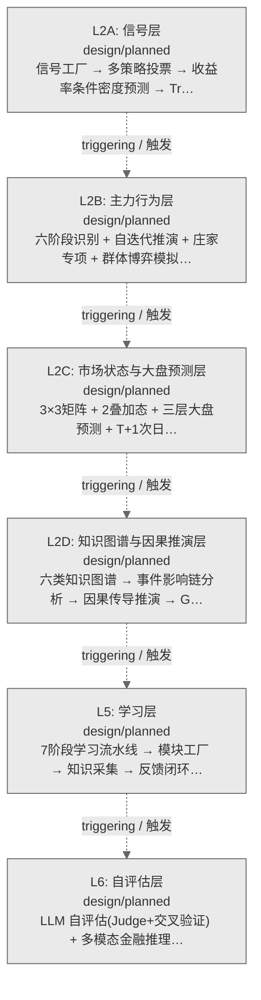
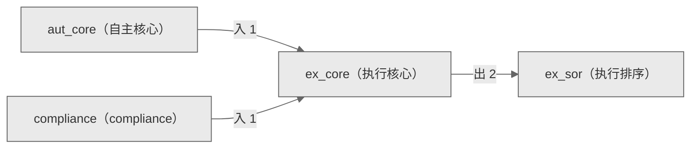

# Decision Flow · L3 Functional Domain ex_core（执行核心）

> 生成时间: 2026-07-30T22:18:45
> 真源: `architecture_model/domain/decision_graph_model.yaml` → PostgreSQL `decision_*` 表（TRAE-061）
> 数据库: depgraph (PostgreSQL)
> 导航: [返回主索引 decision_index.md](decision_index.md) | 模型驱动轨 → L3 → ex_core

**所属轨**: 模型驱动轨（`model_driven`） | **所属层**: L3 | **功能域**: `ex_core`（执行核心）

> **域职责 / Responsibility**: 订单执行核心——SLA 保障、Saga 事务、风控检查、下单/成交确认与持仓更新

## 统计

- 设计态节点数: 9
- 域内边数: 8
- 跨域出边: 2（1 个外部域）
- 跨域入边: 2（2 个外部域）

## 设计态全景图

> 共 6 层，0 边。

## Node 清单

| node_id / 节点ID | layer / 层 | type / 类型 | name / 名称 | path / 路径 | module_id / 模块 | 代码引用 / ref | maturity / 成熟度 | build_status / 构建状态 |
|---------|-------|------|------|------|-----------|----------|--------|--------------|
| 59 | L3 | order / 订单节点 | 50ms SLA Fail-Closed 50ms SLA Fail-Closed | decision/ex_core/ex_03 | MOD-L05-001 | - | design / 设计 | planned / 已规划 |
| 60 | L3 | order / 订单节点 | Saga编排式事务 Saga Orchestrated Transaction | decision/ex_core/ex_04 | MOD-L05-001 | - | design / 设计 | planned / 已规划 |
| 61 | L3 | order / 订单节点 | 风控检查 Risk Check | decision/ex_core/ex_05 | MOD-L05-001 | - | design / 设计 | planned / 已规划 |
| 62 | L3 | order / 订单节点 | 信号确认 Signal Confirmation | decision/ex_core/ex_06 | MOD-L05-001 | - | design / 设计 | planned / 已规划 |
| 63 | L3 | order / 订单节点 | 下单提交 Order Submit | decision/ex_core/ex_07 | MOD-L05-001 | - | design / 设计 | planned / 已规划 |
| 64 | L3 | order / 订单节点 | 成交确认 Fill Confirmation | decision/ex_core/ex_08 | MOD-L05-001 | - | design / 设计 | planned / 已规划 |
| 65 | L3 | order / 订单节点 | 持仓更新 Position Update | decision/ex_core/ex_09 | MOD-L05-001 | - | design / 设计 | planned / 已规划 |
| 66 | L3 | order / 订单节点 | 报告生成 Report Generation | decision/ex_core/ex_10 | MOD-L05-001 | - | design / 设计 | planned / 已规划 |
| 71 | L3 | order / 订单节点 | 流动性螺旋3阶段 Liquidity Spiral 3-Phase | decision/ex_core/ex_15 | MOD-L05-001 | - | design / 设计 | planned / 已规划 |

## Edge 清单（域内）

| edge_id / 边ID | from / 起点 | to / 终点 | type / 类型 | condition / 条件 | track / 轨 |
|---------|-------|-----|------|-----------|-------|
| 76 | 59 | 60 | informing / 告知 | L3层内顺序流 | - |
| 77 | 60 | 61 | informing / 告知 | L3层内顺序流 | - |
| 78 | 61 | 62 | informing / 告知 | L3层内顺序流 | - |
| 79 | 62 | 63 | informing / 告知 | L3层内顺序流 | - |
| 80 | 63 | 64 | informing / 告知 | L3层内顺序流 | - |
| 81 | 64 | 65 | informing / 告知 | L3层内顺序流 | - |
| 82 | 65 | 66 | informing / 告知 | L3层内顺序流 | - |
| 83 | 66 | 71 | informing / 告知 | L3层内顺序流 | - |

## 跨域出边（Depends On）

| # | 本域节点 / from | → | 外部域-目标节点 / to | type / 类型 |
|:--:|---------|:--:|---------|---------|
| 1 | decision/ex_core/ex_15 | → | decision/ex_sor/ex_16 | informing / 告知 |
| 2 | decision/ex_core/ex_14 | → | decision/ex_sor/ex_18 | informing / 告知 |

## 跨域入边（Depended By）

| # | 外部域-源节点 / from | → | 本域节点 / to | type / 类型 |
|:--:|---------|:--:|---------|---------|
| 1 | decision/aut_core/ac_24 | → | decision/ex_core/ex_03 | informing / 告知 |
| 2 | decision/compliance/cmp_11 | → | decision/ex_core/ex_01 | informing / 告知 |

## 跨域依赖图（Cross-Domain Dependency Graph）

> 本域与 3 个外部域直接连接 / This domain directly connects to 3 external domain(s).

