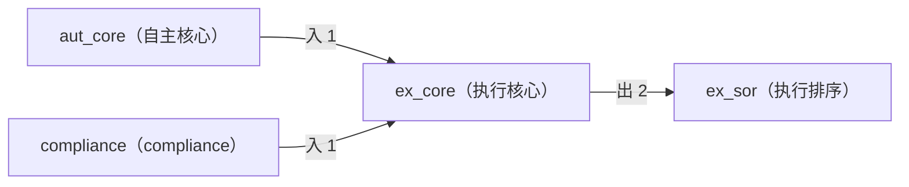

# Decision Flow · L3 Functional Domain ex_core（执行核心）

> 生成时间: 2026-07-30T17:35:01
> 真源: `architecture_model/domain/decision_graph_model.yaml` → PostgreSQL `decision_*` 表（TRAE-061）
> 数据库: depgraph (PostgreSQL)
> 导航: [返回主索引 decision_index.md](decision_index.md) | 模型驱动轨 → L3 → ex_core

**所属轨**: 模型驱动轨（`model_driven`） | **所属层**: L3 | **功能域**: `ex_core`（执行核心）

## 统计

- 设计态节点数: 9
- 域内边数: 8
- 跨域出边: 2（1 个外部域）
- 跨域入边: 2（2 个外部域）

## 设计态全景图

> 共 7 层，8 边。

```mermaid
flowchart TD
    subgraph track_model_driven["模型驱动轨（Model-Driven Track）"]
        LL2A["[design]L2A: 信号层<br/>功能: 信号工厂 → 多策略投票 → 收益率条…<br/>freq: daily<br/>build: planned"]
        LL2B["[design]L2B: 主力行为层<br/>功能: 六阶段识别 + 自迭代推演 + 庄家专…<br/>freq: daily<br/>build: planned"]
        LL2C["[design]L2C: 市场状态与大盘预测层<br/>功能: 3×3矩阵 + 2叠加态 + 三层大盘…<br/>freq: daily<br/>build: planned"]
        LL2D["[design]L2D: 知识图谱与因果推演层<br/>功能: 六类知识图谱 → 事件影响链分析 → …<br/>freq: daily<br/>build: planned"]
        LL3["[design]L3: 策略组合层<br/>功能: 多策略信号合成 → 资本分配 → 元策…<br/>freq: daily<br/>build: planned"]
        N59("[design]order: 50ms SLA Fail-Closed 50ms SLA Fail-Closed<br/>path: decision/ex_core/ex_03")
        LL3 --- N59
        N60("[design]order: Saga编排式事务 Saga Orchestrated Transaction<br/>path: decision/ex_core/ex_04")
        LL3 --- N60
        N61("[design]order: 风控检查 Risk Check<br/>path: decision/ex_core/ex_05")
        LL3 --- N61
        N62("[design]order: 信号确认 Signal Confirmation<br/>path: decision/ex_core/ex_06")
        LL3 --- N62
        N63("[design]order: 下单提交 Order Submit<br/>path: decision/ex_core/ex_07")
        LL3 --- N63
        N64("[design]order: 成交确认 Fill Confirmation<br/>path: decision/ex_core/ex_08")
        LL3 --- N64
        N65("[design]order: 持仓更新 Position Update<br/>path: decision/ex_core/ex_09")
        LL3 --- N65
        N66("[design]order: 报告生成 Report Generation<br/>path: decision/ex_core/ex_10")
        LL3 --- N66
        N71("[design]order: 流动性螺旋3阶段 Liquidity Spiral 3-Phase<br/>path: decision/ex_core/ex_15")
        LL3 --- N71
        LL5["[design]L5: 学习层<br/>功能: 7阶段学习流水线 → 模块工厂 → 知…<br/>freq: weekly<br/>build: planned"]
        LL6["[design]L6: 自评估层<br/>功能: LLM 自评估(Judge+交叉验证)…<br/>freq: weekly<br/>build: planned"]
    end
    LL2A -.->|triggering| LL2B
    LL2B -.->|triggering| LL2C
    LL2C -.->|triggering| LL2D
    LL2D -.->|triggering| LL3
    LL3 -.->|triggering| LL5
    LL5 -.->|triggering| LL6
    N59 -->|informing| N60
    N60 -->|informing| N61
    N61 -->|informing| N62
    N62 -->|informing| N63
    N63 -->|informing| N64
    N64 -->|informing| N65
    N65 -->|informing| N66
    N66 -->|informing| N71
```

## Node 清单

| node_id | layer | type | name | path | module_id | 代码引用 | 成熟度 | build_status |
|---------|-------|------|------|------|-----------|----------|--------|--------------|
| 59 | L3 | order | 50ms SLA Fail-Closed 50ms SLA Fail-Closed | decision/ex_core/ex_03 | MOD-L05-001 | - | design | planned |
| 60 | L3 | order | Saga编排式事务 Saga Orchestrated Transaction | decision/ex_core/ex_04 | MOD-L05-001 | - | design | planned |
| 61 | L3 | order | 风控检查 Risk Check | decision/ex_core/ex_05 | MOD-L05-001 | - | design | planned |
| 62 | L3 | order | 信号确认 Signal Confirmation | decision/ex_core/ex_06 | MOD-L05-001 | - | design | planned |
| 63 | L3 | order | 下单提交 Order Submit | decision/ex_core/ex_07 | MOD-L05-001 | - | design | planned |
| 64 | L3 | order | 成交确认 Fill Confirmation | decision/ex_core/ex_08 | MOD-L05-001 | - | design | planned |
| 65 | L3 | order | 持仓更新 Position Update | decision/ex_core/ex_09 | MOD-L05-001 | - | design | planned |
| 66 | L3 | order | 报告生成 Report Generation | decision/ex_core/ex_10 | MOD-L05-001 | - | design | planned |
| 71 | L3 | order | 流动性螺旋3阶段 Liquidity Spiral 3-Phase | decision/ex_core/ex_15 | MOD-L05-001 | - | design | planned |

## Edge 清单（域内）

| edge_id | from | to | type | condition | track |
|---------|-------|-----|------|-----------|-------|
| 76 | 59 | 60 | informing | L3层内顺序流 | - |
| 77 | 60 | 61 | informing | L3层内顺序流 | - |
| 78 | 61 | 62 | informing | L3层内顺序流 | - |
| 79 | 62 | 63 | informing | L3层内顺序流 | - |
| 80 | 63 | 64 | informing | L3层内顺序流 | - |
| 81 | 64 | 65 | informing | L3层内顺序流 | - |
| 82 | 65 | 66 | informing | L3层内顺序流 | - |
| 83 | 66 | 71 | informing | L3层内顺序流 | - |

## 跨域出边（Depends On）

| # | 本域节点 | → | 外部域-目标节点 | type |
|:--:|---------|:--:|---------|---------|
| 1 | decision/ex_core/ex_15 | → | decision/ex_sor/ex_16 | informing |
| 2 | decision/ex_core/ex_14 | → | decision/ex_sor/ex_18 | informing |

## 跨域入边（Depended By）

| # | 外部域-源节点 | → | 本域节点 | type |
|:--:|---------|:--:|---------|---------|
| 1 | decision/aut_core/ac_24 | → | decision/ex_core/ex_03 | informing |
| 2 | decision/compliance/cmp_11 | → | decision/ex_core/ex_01 | informing |

## 跨域依赖图（Cross-Domain Dependency Graph）

> 本域与 3 个外部域直接连接 / This domain directly connects to 3 external domain(s).

