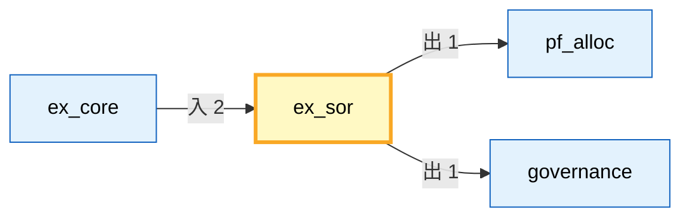

# 决策流图 · L3 功能域 ex_sor

> 生成时间: 2026-07-19T06:21:57
> 真源: `architecture_model/domain/decision_graph_model.yaml` → PostgreSQL `decision_*` 表（TRAE-061）
> 数据库: depgraph (PostgreSQL)
> 导航: [返回主索引 decision_index.md](decision_index.md) | 模型驱动轨 → L3 → ex_sor

**所属轨**: 模型驱动轨（`model_driven`） | **所属层**: L3 | **功能域**: `ex_sor`

## 统计

- 设计态节点数: 5
- 域内边数: 4
- 跨域出边: 2（2 个外部域）
- 跨域入边: 2（1 个外部域）

## 设计态全景图

> 共 7 层，4 边。

```mermaid
flowchart TD
    subgraph track_model_driven["模型驱动轨（Model-Driven Track）"]
        LL2A["[design]L2A: 信号层<br/>功能: 信号工厂 → 多策略投票 → 收益率条…<br/>freq: daily<br/>build: planned"]:::bsPlanned
        LL2B["[design]L2B: 主力行为层<br/>功能: 六阶段识别 + 自迭代推演 + 庄家专…<br/>freq: daily<br/>build: planned"]:::bsPlanned
        LL2C["[design]L2C: 市场状态与大盘预测层<br/>功能: 3×3矩阵 + 2叠加态 + 三层大盘…<br/>freq: daily<br/>build: planned"]:::bsPlanned
        LL2D["[design]L2D: 知识图谱与因果推演层<br/>功能: 六类知识图谱 → 事件影响链分析 → …<br/>freq: daily<br/>build: planned"]:::bsPlanned
        LL3["[design]L3: 策略组合层<br/>功能: 多策略信号合成 → 资本分配 → 元策…<br/>freq: daily<br/>build: planned"]:::bsPlanned
        N72("[design]order: 订单路由决策 Order Routing Decision<br/>path: decision/ex_sor/ex_16"):::bsPlanned
        LL3 --- N72
        N73("[design]order: SOR路由决策延迟 SOR Routing Latency<br/>path: decision/ex_sor/ex_17"):::bsPlanned
        LL3 --- N73
        N75("[design]order: 交易通道熔断人工恢复 Trading Channel Manual Recovery<br/>path: decision/ex_sor/ex_19"):::bsPlanned
        LL3 --- N75
        N77("[design]order: Kill-Switch四级阶梯 Kill-Switch 4-Level Cascade<br/>path: decision/ex_sor/ex_21"):::bsPlanned
        LL3 --- N77
        N78("[design]order: 熔断器矩阵 Circuit Breaker Matrix<br/>path: decision/ex_sor/ex_22"):::bsPlanned
        LL3 --- N78
        LL5["[design]L5: 学习层<br/>功能: 7阶段学习流水线 → 模块工厂 → 知…<br/>freq: weekly<br/>build: planned"]:::bsPlanned
        LL6["[design]L6: 自评估层<br/>功能: LLM 自评估(Judge+交叉验证)…<br/>freq: weekly<br/>build: planned"]:::bsPlanned
    end
    LL2A -.->|triggering| LL2B
    LL2B -.->|triggering| LL2C
    LL2C -.->|triggering| LL2D
    LL2D -.->|triggering| LL3
    LL3 -.->|triggering| LL5
    LL5 -.->|triggering| LL6
    N72 -->|informing| N73
    N73 -->|informing| N75
    N75 -->|informing| N77
    N77 -->|informing| N78

    classDef bsStable fill:#c8e6c9,stroke:#2e7d32,stroke-width:2px,color:#000
    classDef bsGenerated fill:#fff9c4,stroke:#f9a825,stroke-width:2px,color:#000
    classDef bsTesting fill:#ffe0b2,stroke:#ef6c00,stroke-width:2px,color:#000
    classDef bsPlanned fill:#e1f5fe,stroke:#0277bd,stroke-width:2px,color:#000,stroke-dasharray: 5 5
    classDef bsDeprecated fill:#ffcdd2,stroke:#c62828,stroke-width:2px,color:#000,stroke-dasharray: 5 5
```

## Node 清单

| node_id | layer | type | name | path | module_id | 代码引用 | 成熟度 | build_status |
|---------|-------|------|------|------|-----------|----------|--------|--------------|
| 72 | L3 | order | 订单路由决策 Order Routing Decision | decision/ex_sor/ex_16 | MOD-L05-001 | - | design | planned |
| 73 | L3 | order | SOR路由决策延迟 SOR Routing Latency | decision/ex_sor/ex_17 | MOD-L05-001 | - | design | planned |
| 75 | L3 | order | 交易通道熔断人工恢复 Trading Channel Manual Recovery | decision/ex_sor/ex_19 | MOD-L05-001 | - | design | planned |
| 77 | L3 | order | Kill-Switch四级阶梯 Kill-Switch 4-Level Cascade | decision/ex_sor/ex_21 | MOD-L05-001 | - | design | planned |
| 78 | L3 | order | 熔断器矩阵 Circuit Breaker Matrix | decision/ex_sor/ex_22 | MOD-L05-001 | - | design | planned |

## Edge 清单（域内）

| edge_id | from | to | type | condition | track |
|---------|-------|-----|------|-----------|-------|
| 85 | 72 | 73 | informing | L3层内顺序流 | - |
| 86 | 73 | 75 | informing | L3层内顺序流 | - |
| 87 | 75 | 77 | informing | L3层内顺序流 | - |
| 88 | 77 | 78 | informing | L3层内顺序流 | - |

## 跨域出边（Depends On）

| # | 本域节点 | → | 外部域-目标节点 | type |
|:--:|---------|:--:|---------|---------|
| 1 | decision/ex_sor/ex_22 | → | decision/pf_alloc/pa_01 | informing |
| 2 | decision/ex_sor/ex_23 | → | decision/governance/gov_001 | informing |

## 跨域入边（Depended By）

| # | 外部域-源节点 | → | 本域节点 | type |
|:--:|---------|:--:|---------|---------|
| 1 | decision/ex_core/ex_15 | → | decision/ex_sor/ex_16 | informing |
| 2 | decision/ex_core/ex_14 | → | decision/ex_sor/ex_18 | informing |

## 跨域依赖图

> 本域与 3 个外部域直接连接。

