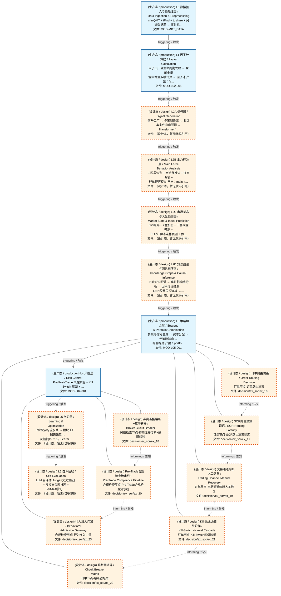
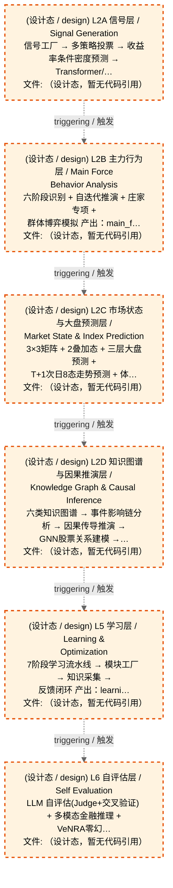
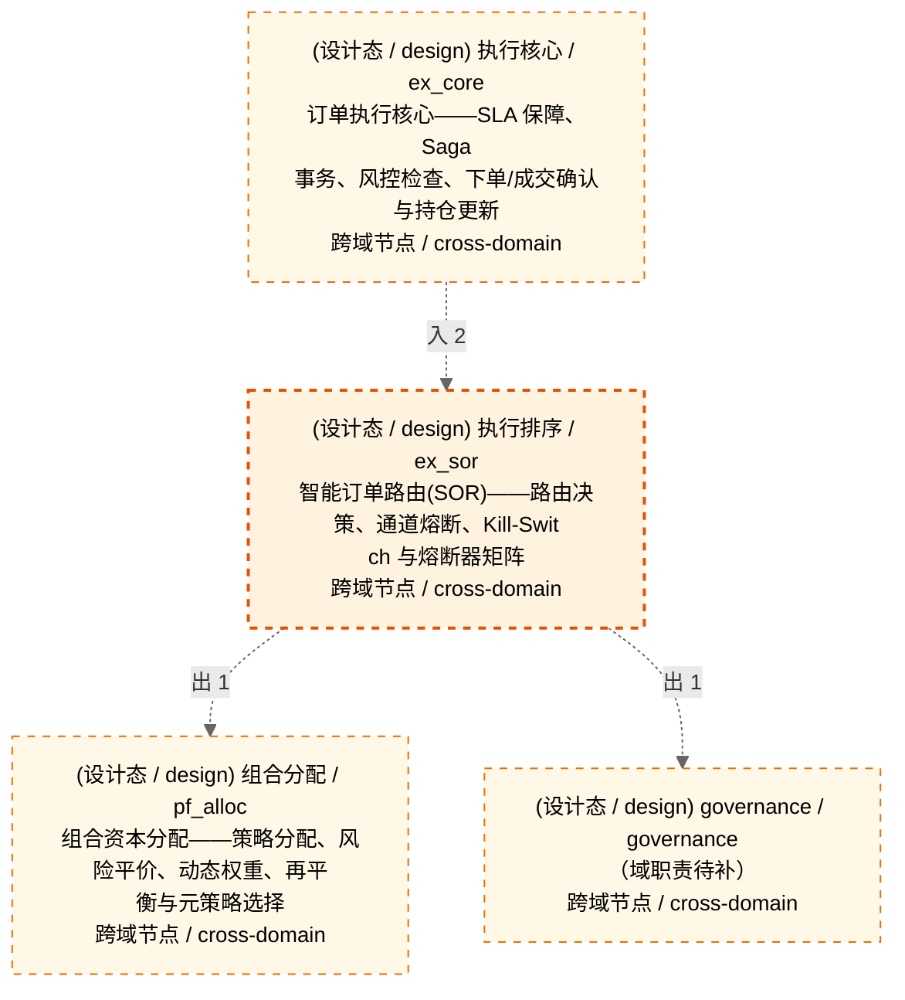

# Decision Flow · L3 Functional Domain ex_sor（执行排序）

> 生成时间: 2026-07-31T17:21:51
> 真源: `architecture_model/domain/decision_graph_model.yaml` → PostgreSQL `decision_*` 表（TRAE-061）
> 数据库: depgraph (PostgreSQL)
> 导航: [返回主索引 decision_index.md](decision_index.md) | 模型驱动轨 → L3 → ex_sor

> **[可缩放 HTML 版 / Zoomable HTML](http://localhost:8765/docs/02_enterprise_architecture/06_decision_architecture/_zoomable_html/15_decision_l3_ex_sor.html)** — Ctrl+滚轮缩放 ｜ 双击重置 ｜ Ctrl+Shift+D 切换拖动/选择模式

**所属轨**: 模型驱动轨（`model_driven`） | **所属层**: L3 | **功能域**: `ex_sor`（执行排序）

> **域职责 / Responsibility**: 智能订单路由(SOR)——路由决策、通道熔断、Kill-Switch 与熔断器矩阵

## 统计

- 决策节点数（全部）: 5
- 运营态节点数（production）: 0
- 设计态节点数（design）: 5
- 域内边数: 4
- 跨域出边: 2（2 个外部域）
- 跨域入边: 2（1 个外部域）

## 域内依赖图 / Internal Dependency Diagram

> **图例说明 / Legend**：
> - 🟦 **蓝色 = 运营态模块**（production，已上线运行）
> - 🟧 **橙色虚线 = 设计态模块**（design，蓝图阶段，代码未写）
> - **实线箭头 `-->` = 运营态依赖**（两端都 production）
> - **虚线箭头 `-.->` = 非运营态依赖**（含 design / 混合）

### 全景图（全部模块，颜色区分运营态/设计态）

> 展示全部 5 个决策节点（运营态 0 + 设计态 5），含跨域依赖外部节点。

> 共 10 层，6 边。

### 运营态的图（仅 design_maturity=production 的模块和域内依赖）

> 仅展示已上线运行的决策节点（共 0 个），不含跨域外部节点。跨域依赖见下方跨域依赖章节。

> （无模块 / No modules）

### 设计态的图（仅 design_maturity=design 的模块和域内依赖）

> 仅展示蓝图阶段、代码未写的设计态决策节点（共 5 个），不含跨域外部节点。

> 共 6 层，0 边。

## Node 清单

| node_id / 节点ID | layer / 层 | type / 类型 | name / 名称 | path / 路径 | module_id / 模块 | 代码引用 / ref | maturity / 成熟度 | build_status / 构建状态 |
|---------|-------|------|------|------|-----------|----------|--------|--------------|
| 72 | L3 | order / 订单节点 | 订单路由决策 Order Routing Decision | decision/ex_sor/ex_16 | MOD-L05-001 | - | design / 设计 | planned / 已规划 |
| 73 | L3 | order / 订单节点 | SOR路由决策延迟 SOR Routing Latency | decision/ex_sor/ex_17 | MOD-L05-001 | - | design / 设计 | planned / 已规划 |
| 75 | L3 | order / 订单节点 | 交易通道熔断人工恢复 Trading Channel Manual Recovery | decision/ex_sor/ex_19 | MOD-L05-001 | - | design / 设计 | planned / 已规划 |
| 77 | L3 | order / 订单节点 | Kill-Switch四级阶梯 Kill-Switch 4-Level Cascade | decision/ex_sor/ex_21 | MOD-L05-001 | - | design / 设计 | planned / 已规划 |
| 78 | L3 | order / 订单节点 | 熔断器矩阵 Circuit Breaker Matrix | decision/ex_sor/ex_22 | MOD-L05-001 | - | design / 设计 | planned / 已规划 |

## Edge 清单（域内）

| edge_id / 边ID | from / 起点 | to / 终点 | type / 类型 | condition / 条件 | track / 轨 |
|---------|-------|-----|------|-----------|-------|
| 85 | 72 | 73 | informing / 告知 | L3层内顺序流 | - |
| 86 | 73 | 75 | informing / 告知 | L3层内顺序流 | - |
| 87 | 75 | 77 | informing / 告知 | L3层内顺序流 | - |
| 88 | 77 | 78 | informing / 告知 | L3层内顺序流 | - |

## 跨域出边（Depends On）

| # | 本域节点 / from | → | 外部域-目标节点 / to | type / 类型 |
|:--:|---------|:--:|---------|---------|
| 1 | decision/ex_sor/ex_22 | → | decision/pf_alloc/pa_01 | informing / 告知 |
| 2 | decision/ex_sor/ex_23 | → | decision/governance/gov_001 | informing / 告知 |

## 跨域入边（Depended By）

| # | 外部域-源节点 / from | → | 本域节点 / to | type / 类型 |
|:--:|---------|:--:|---------|---------|
| 1 | decision/ex_core/ex_15 | → | decision/ex_sor/ex_16 | informing / 告知 |
| 2 | decision/ex_core/ex_14 | → | decision/ex_sor/ex_18 | informing / 告知 |

## 跨域依赖图（Cross-Domain Dependency Graph）

> 本域与 3 个外部域直接连接 / This domain directly connects to 3 external domain(s).

