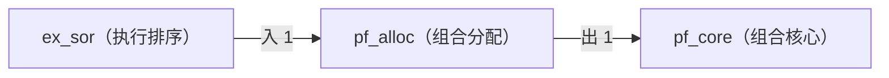

# Decision Flow · L3 Functional Domain pf_alloc（组合分配）

> 生成时间: 2026-07-30T17:35:01
> 真源: `architecture_model/domain/decision_graph_model.yaml` → PostgreSQL `decision_*` 表（TRAE-061）
> 数据库: depgraph (PostgreSQL)
> 导航: [返回主索引 decision_index.md](decision_index.md) | 模型驱动轨 → L3 → pf_alloc

**所属轨**: 模型驱动轨（`model_driven`） | **所属层**: L3 | **功能域**: `pf_alloc`（组合分配）

## 统计

- 设计态节点数: 6
- 域内边数: 5
- 跨域出边: 1（1 个外部域）
- 跨域入边: 1（1 个外部域）

## 设计态全景图

> 共 7 层，5 边。

```mermaid
flowchart TD
    subgraph track_model_driven["模型驱动轨（Model-Driven Track）"]
        LL2A["[design]L2A: 信号层<br/>功能: 信号工厂 → 多策略投票 → 收益率条…<br/>freq: daily<br/>build: planned"]
        LL2B["[design]L2B: 主力行为层<br/>功能: 六阶段识别 + 自迭代推演 + 庄家专…<br/>freq: daily<br/>build: planned"]
        LL2C["[design]L2C: 市场状态与大盘预测层<br/>功能: 3×3矩阵 + 2叠加态 + 三层大盘…<br/>freq: daily<br/>build: planned"]
        LL2D["[design]L2D: 知识图谱与因果推演层<br/>功能: 六类知识图谱 → 事件影响链分析 → …<br/>freq: daily<br/>build: planned"]
        LL3["[design]L3: 策略组合层<br/>功能: 多策略信号合成 → 资本分配 → 元策…<br/>freq: daily<br/>build: planned"]
        N32("[design]portfolio_target: 策略分配 Strategy Allocation<br/>path: decision/pf_alloc/pa_01")
        LL3 --- N32
        N33("[design]portfolio_target: 风险平价 Risk Parity<br/>path: decision/pf_alloc/pa_02")
        LL3 --- N33
        N34("[design]portfolio_target: 动态权重 Dynamic Weighting<br/>path: decision/pf_alloc/pa_03")
        LL3 --- N34
        N35("[design]portfolio_target: 策略权重再平衡 Strategy Weight Rebalance<br/>path: decision/pf_alloc/pa_04")
        LL3 --- N35
        N36("[design]portfolio_target: 多策略共识 Multi-Strategy Consensus<br/>path: decision/pf_alloc/pa_05")
        LL3 --- N36
        N37("[design]portfolio_target: 元策略选择 Meta-Strategy Selection<br/>path: decision/pf_alloc/pa_06")
        LL3 --- N37
        LL5["[design]L5: 学习层<br/>功能: 7阶段学习流水线 → 模块工厂 → 知…<br/>freq: weekly<br/>build: planned"]
        LL6["[design]L6: 自评估层<br/>功能: LLM 自评估(Judge+交叉验证)…<br/>freq: weekly<br/>build: planned"]
    end
    LL2A -.->|triggering| LL2B
    LL2B -.->|triggering| LL2C
    LL2C -.->|triggering| LL2D
    LL2D -.->|triggering| LL3
    LL3 -.->|triggering| LL5
    LL5 -.->|triggering| LL6
    N32 -->|informing| N33
    N33 -->|informing| N34
    N34 -->|informing| N35
    N35 -->|informing| N36
    N36 -->|informing| N37
```

## Node 清单

| node_id | layer | type | name | path | module_id | 代码引用 | 成熟度 | build_status |
|---------|-------|------|------|------|-----------|----------|--------|--------------|
| 32 | L3 | portfolio_target | 策略分配 Strategy Allocation | decision/pf_alloc/pa_01 | MOD-L05-001 | - | design | planned |
| 33 | L3 | portfolio_target | 风险平价 Risk Parity | decision/pf_alloc/pa_02 | MOD-L05-001 | - | design | planned |
| 34 | L3 | portfolio_target | 动态权重 Dynamic Weighting | decision/pf_alloc/pa_03 | MOD-L05-001 | - | design | planned |
| 35 | L3 | portfolio_target | 策略权重再平衡 Strategy Weight Rebalance | decision/pf_alloc/pa_04 | MOD-L05-001 | - | design | planned |
| 36 | L3 | portfolio_target | 多策略共识 Multi-Strategy Consensus | decision/pf_alloc/pa_05 | MOD-L05-001 | - | design | planned |
| 37 | L3 | portfolio_target | 元策略选择 Meta-Strategy Selection | decision/pf_alloc/pa_06 | MOD-L05-001 | - | design | planned |

## Edge 清单（域内）

| edge_id | from | to | type | condition | track |
|---------|-------|-----|------|-----------|-------|
| 90 | 32 | 33 | informing | L3层内顺序流 | - |
| 91 | 33 | 34 | informing | L3层内顺序流 | - |
| 92 | 34 | 35 | informing | L3层内顺序流 | - |
| 93 | 35 | 36 | informing | L3层内顺序流 | - |
| 94 | 36 | 37 | informing | L3层内顺序流 | - |

## 跨域出边（Depends On）

| # | 本域节点 | → | 外部域-目标节点 | type |
|:--:|---------|:--:|---------|---------|
| 1 | decision/pf_alloc/pa_06 | → | decision/pf_core/pc_01 | informing |

## 跨域入边（Depended By）

| # | 外部域-源节点 | → | 本域节点 | type |
|:--:|---------|:--:|---------|---------|
| 1 | decision/ex_sor/ex_22 | → | decision/pf_alloc/pa_01 | informing |

## 跨域依赖图（Cross-Domain Dependency Graph）

> 本域与 2 个外部域直接连接 / This domain directly connects to 2 external domain(s).

