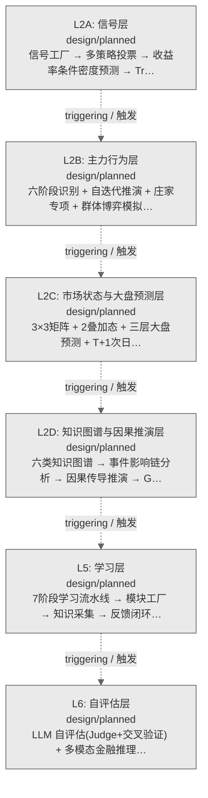
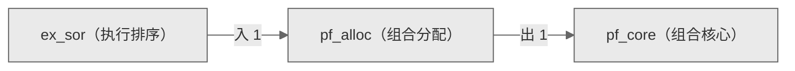

# Decision Flow · L3 Functional Domain pf_alloc（组合分配）

> 生成时间: 2026-07-30T22:18:45
> 真源: `architecture_model/domain/decision_graph_model.yaml` → PostgreSQL `decision_*` 表（TRAE-061）
> 数据库: depgraph (PostgreSQL)
> 导航: [返回主索引 decision_index.md](decision_index.md) | 模型驱动轨 → L3 → pf_alloc

**所属轨**: 模型驱动轨（`model_driven`） | **所属层**: L3 | **功能域**: `pf_alloc`（组合分配）

> **域职责 / Responsibility**: 组合资本分配——策略分配、风险平价、动态权重、再平衡与元策略选择

## 统计

- 设计态节点数: 6
- 域内边数: 5
- 跨域出边: 1（1 个外部域）
- 跨域入边: 1（1 个外部域）

## 设计态全景图

> 共 6 层，0 边。

## Node 清单

| node_id / 节点ID | layer / 层 | type / 类型 | name / 名称 | path / 路径 | module_id / 模块 | 代码引用 / ref | maturity / 成熟度 | build_status / 构建状态 |
|---------|-------|------|------|------|-----------|----------|--------|--------------|
| 32 | L3 | portfolio_target / 组合目标节点 | 策略分配 Strategy Allocation | decision/pf_alloc/pa_01 | MOD-L05-001 | - | design / 设计 | planned / 已规划 |
| 33 | L3 | portfolio_target / 组合目标节点 | 风险平价 Risk Parity | decision/pf_alloc/pa_02 | MOD-L05-001 | - | design / 设计 | planned / 已规划 |
| 34 | L3 | portfolio_target / 组合目标节点 | 动态权重 Dynamic Weighting | decision/pf_alloc/pa_03 | MOD-L05-001 | - | design / 设计 | planned / 已规划 |
| 35 | L3 | portfolio_target / 组合目标节点 | 策略权重再平衡 Strategy Weight Rebalance | decision/pf_alloc/pa_04 | MOD-L05-001 | - | design / 设计 | planned / 已规划 |
| 36 | L3 | portfolio_target / 组合目标节点 | 多策略共识 Multi-Strategy Consensus | decision/pf_alloc/pa_05 | MOD-L05-001 | - | design / 设计 | planned / 已规划 |
| 37 | L3 | portfolio_target / 组合目标节点 | 元策略选择 Meta-Strategy Selection | decision/pf_alloc/pa_06 | MOD-L05-001 | - | design / 设计 | planned / 已规划 |

## Edge 清单（域内）

| edge_id / 边ID | from / 起点 | to / 终点 | type / 类型 | condition / 条件 | track / 轨 |
|---------|-------|-----|------|-----------|-------|
| 90 | 32 | 33 | informing / 告知 | L3层内顺序流 | - |
| 91 | 33 | 34 | informing / 告知 | L3层内顺序流 | - |
| 92 | 34 | 35 | informing / 告知 | L3层内顺序流 | - |
| 93 | 35 | 36 | informing / 告知 | L3层内顺序流 | - |
| 94 | 36 | 37 | informing / 告知 | L3层内顺序流 | - |

## 跨域出边（Depends On）

| # | 本域节点 / from | → | 外部域-目标节点 / to | type / 类型 |
|:--:|---------|:--:|---------|---------|
| 1 | decision/pf_alloc/pa_06 | → | decision/pf_core/pc_01 | informing / 告知 |

## 跨域入边（Depended By）

| # | 外部域-源节点 / from | → | 本域节点 / to | type / 类型 |
|:--:|---------|:--:|---------|---------|
| 1 | decision/ex_sor/ex_22 | → | decision/pf_alloc/pa_01 | informing / 告知 |

## 跨域依赖图（Cross-Domain Dependency Graph）

> 本域与 2 个外部域直接连接 / This domain directly connects to 2 external domain(s).

