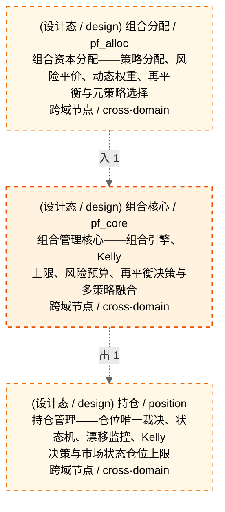

# Decision Flow · L3 Functional Domain pf_core（组合核心）

> 生成时间: 2026-08-03T19:13:48
> 真源: `architecture_model/domain/decision_graph_model.yaml` → PostgreSQL `decision_*` 表（TRAE-061）
> 数据库: depgraph (PostgreSQL)
> 导航: [返回主索引 decision_index.md](decision_index.md) | 模型驱动轨 → L3 → pf_core

> **[可缩放 HTML 版 / Zoomable HTML](http://localhost:8765/docs/02_enterprise_architecture/06_decision_architecture/_zoomable_html/17_decision_l3_pf_core.html)** — Ctrl+滚轮缩放 ｜ 双击重置 ｜ Ctrl+Shift+D 切换拖动/选择模式

**所属轨**: 模型驱动轨（`model_driven`） | **所属层**: L3 | **功能域**: `pf_core`（组合核心）

> **域职责 / Responsibility**: 组合管理核心——组合引擎、Kelly 上限、风险预算、再平衡决策与多策略融合

## 统计

- 决策节点数（全部）: 12
- 运营态节点数（production）: 0
- 设计态节点数（design）: 12
- 域内边数: 11
- 跨域出边: 1（1 个外部域）
- 跨域入边: 1（1 个外部域）

## 域内依赖图 / Internal Dependency Diagram

> **图例说明 / Legend**：
> - 🟦 **蓝色 = 运营态模块**（production，已上线运行）
> - 🟧 **橙色虚线 = 设计态模块**（design，蓝图阶段，代码未写）
> - **实线箭头 `-->` = 运营态依赖**（两端都 production）
> - **虚线箭头 `-.->` = 非运营态依赖**（含 design / 混合）

### 全景图（全部模块，颜色区分运营态/设计态）

> 展示全部 12 个决策节点（运营态 0 + 设计态 12），含跨域依赖外部节点。

> 共 10 层，11 边。

```mermaid
%%{init: {'theme': 'base', 'themeVariables': {'primaryColor': '#eaeaea', 'primaryTextColor': '#333333', 'primaryBorderColor': '#666666', 'lineColor': '#666666', 'secondaryColor': '#eaeaea', 'tertiaryColor': '#eaeaea', 'clusterBkg': 'transparent', 'clusterBorder': 'transparent', 'fontSize': '14px'}}}%%
flowchart TD
    LL0["(生产态 / production) L0 数据接入与预处理层 /<br/>Data Ingestion & Preprocessing<br/>miniQMT + iFind + tushare + 另类数据源 →<br/>事件总线 → 分层时序存储 产出：tick_data / ohlc_<br/>bar / factor_input_data<br/>文件: MOD-MKT_DATA"]
    LL1["(生产态 / production) L1 因子计算层 / Factor<br/>Calculation<br/>因子工厂全生命周期管理 → 盘前全量<br/>/盘中增量双模计算 → 因子池 产出：factor_value<br/>（带 PIT 合规标记）<br/>文件: MOD-L02-001"]
    LL2A["(设计态 / design) L2A 信号层 / Signal Generation<br/>信号工厂 → 多策略投票 → 收益率条件密度预测 →<br/>Transformer/Mamba时序增强 → 共形预测<br/>产出：signal（Insight: direction/confidence<br/>/horizon）<br/>文件: （设计态，暂无代码引用）"]
    LL2B["(设计态 / design) L2B 主力行为层 / Main Force<br/>Behavior Analysis<br/>六阶段识别 + 自迭代推演 + 庄家专项 +<br/>群体博弈模拟 产出：main_force_signal<br/>（主力行为画像）<br/>文件: （设计态，暂无代码引用）"]
    LL2C["(设计态 / design) L2C 市场状态与大盘预测层 /<br/>Market State & Index Prediction<br/>3×3矩阵 + 2叠加态 + 三层大盘预测 +<br/>T+1次日8态走势预测 + 体制转换检测(HMM/变点)<br/>产出：market_state_prediction（大盘方向/波动率<br/>/体制判断）<br/>文件: （设计态，暂无代码引用）"]
    LL2D["(设计态 / design) L2D 知识图谱与因果推演层 /<br/>Knowledge Graph & Causal Inference<br/>六类知识图谱 → 事件影响链分析 → 因果传导推演 →<br/>GNN股票关系建模 → Causal ML 产出：causal_<br/>inference_result（因果推断结果）<br/>文件: （设计态，暂无代码引用）"]
    LL3["(生产态 / production) L3 策略组合层 / Strategy<br/>& Portfolio Combination<br/>多策略信号合成 → 资本分配 → 元策略路由 →<br/>组合构建 产出：portfolio_target<br/>（PortfolioTarget: 目标仓位）<br/>文件: MOD-L05-001"]
    N20["(设计态 / design) 组合核心引擎 / Portfolio Core<br/>Engine<br/>组合管理的核心调度引擎，协调仓位分配和策略执行的<br/>统一入口<br/>文件: decision/pf_core/pc_01"]
    LL3 --- N20
    N21["(设计态 / design) 半Kelly硬上限 / Half-Kelly<br/>Hard Cap<br/>按凯利公式一半设置仓位硬上限，在收益与破产风险间<br/>取平衡<br/>文件: decision/pf_core/pc_02"]
    LL3 --- N21
    N22["(设计态 / design) 风险预算 / Risk Budget<br/>按风险贡献分配各资产仓位预算，控制整体组合风险敞<br/>口<br/>文件: decision/pf_core/pc_03"]
    LL3 --- N22
    N23["(设计态 / design) 再平衡决策 / Rebalance<br/>Decision<br/>组合偏离目标权重时决定是否及如何再平衡，控制漂移<br/>风险<br/>文件: decision/pf_core/pc_04"]
    LL3 --- N23
    N24["(设计态 / design) 仲裁优先级体系 / Arbitration<br/>Priority<br/>多策略冲突时按优先级仲裁决定最终仓位，解决多策略<br/>抢仓冲突<br/>文件: decision/pf_core/pc_05"]
    LL3 --- N24
    N25["(设计态 / design) 多策略共振融合 / Strategy<br/>Convergence Fusion<br/>多个策略同向时增强信号强度，提升共振机会的把握度<br/>文件: decision/pf_core/pc_06"]
    LL3 --- N25
    N26["(设计态 / design) 因子直通裁决 / Factor Bypass<br/>Arbitration<br/>强因子信号绕过策略层直达仓位决策，抓住确定性高的<br/>快速机会<br/>文件: decision/pf_core/pc_07"]
    LL3 --- N26
    N27["(设计态 / design) 元策略路由 / Meta-Strategy<br/>Router<br/>按市场状态路由到合适的元策略，适配不同市场环境<br/>文件: decision/pf_core/pc_08"]
    LL3 --- N27
    N28["(设计态 / design) 组合优化 / Portfolio<br/>Optimization<br/>在约束条件下数学优化组合权重，追求风险调整后收益<br/>最优<br/>文件: decision/pf_core/pc_09"]
    LL3 --- N28
    N29["(设计态 / design) 资本分配 / Capital Allocation<br/>在策略间分配可用资本额度，控制单策略最大资金占用<br/>文件: decision/pf_core/pc_10"]
    LL3 --- N29
    N30["(设计态 / design) 决策编排器 / Decision<br/>Orchestrator<br/>编排组合层各决策步骤的执行顺序，保证决策链路有序<br/>不混乱<br/>文件: decision/pf_core/pc_11"]
    LL3 --- N30
    N31["(设计态 / design) 四轨融合器 / Multi-Track<br/>Fusion<br/>融合模型/数据/人工<br/>/应急四轨决策为统一输出，处理多轨并存场景<br/>文件: decision/pf_core/pc_12"]
    LL3 --- N31
    LL4["(生产态 / production) L4 风控层 / Risk Control<br/>Pre/Post-Trade 风控校验 + Kill Switch 熔断 +<br/>止损评估 产出：risk_check（RiskDecision:<br/>approve/veto/adjust）<br/>文件: MOD-L04-001"]
    LL5["(设计态 / design) L5 学习层 / Learning &<br/>Optimization<br/>7阶段学习流水线 → 模块工厂 → 知识采集 →<br/>反馈闭环 产出：learning_feedback（策略优化建议）<br/>文件: （设计态，暂无代码引用）"]
    LL6["(设计态 / design) L6 自评估层 / Self Evaluation<br/>LLM 自评估(Judge+交叉验证) + 多模态金融推理 +<br/>VeNRA零幻觉锚定 产出：self_evaluation<br/>（决策质量评估）<br/>文件: （设计态，暂无代码引用）"]
    LL0 -->|triggering / 触发| LL1
    LL1 -.->|triggering / 触发| LL2A
    LL2A -.->|triggering / 触发| LL2B
    LL2B -.->|triggering / 触发| LL2C
    LL2C -.->|triggering / 触发| LL2D
    LL2D -.->|triggering / 触发| LL3
    LL3 -->|triggering / 触发| LL4
    LL4 -.->|triggering / 触发| LL5
    LL5 -.->|triggering / 触发| LL6
    N20 -.->|informing / 告知| N21
    N21 -.->|informing / 告知| N22
    N22 -.->|informing / 告知| N23
    N23 -.->|informing / 告知| N24
    N24 -.->|informing / 告知| N25
    N25 -.->|informing / 告知| N26
    N26 -.->|informing / 告知| N27
    N27 -.->|informing / 告知| N28
    N28 -.->|informing / 告知| N29
    N29 -.->|informing / 告知| N30
    N30 -.->|informing / 告知| N31
    classDef production fill:#e1f5fe,stroke:#01579b,stroke-width:2px,color:#000
    classDef design fill:#fff3e0,stroke:#e65100,stroke-width:2px,color:#000,stroke-dasharray: 5 5
    classDef external_prod fill:#e8f4fd,stroke:#0277bd,stroke-width:1px,color:#000
    classDef external_design fill:#fff8e7,stroke:#ef6c00,stroke-width:1px,color:#000,stroke-dasharray: 5 5
    class LL0,LL1,LL3,LL4 production
    class LL2A,LL2B,LL2C,LL2D,N20,N21,N22,N23,N24,N25,N26,N27,N28,N29,N30,N31,LL5,LL6 design
```

### 运营态的图（仅 design_maturity=production 的模块和域内依赖）

> 仅展示已上线运行的决策节点（共 0 个），不含跨域外部节点。跨域依赖见下方跨域依赖章节。

> （无模块 / No modules）

### 设计态的图（仅 design_maturity=design 的模块和域内依赖）

> 仅展示蓝图阶段、代码未写的设计态决策节点（共 12 个），不含跨域外部节点。

> 共 6 层，0 边。

```mermaid
%%{init: {'theme': 'base', 'themeVariables': {'primaryColor': '#eaeaea', 'primaryTextColor': '#333333', 'primaryBorderColor': '#666666', 'lineColor': '#666666', 'secondaryColor': '#eaeaea', 'tertiaryColor': '#eaeaea', 'clusterBkg': 'transparent', 'clusterBorder': 'transparent', 'fontSize': '14px'}}}%%
flowchart TD
    LL2A["(设计态 / design) L2A 信号层 / Signal Generation<br/>信号工厂 → 多策略投票 → 收益率条件密度预测 →<br/>Transformer/Mamba时序增强 → 共形预测<br/>产出：signal（Insight: direction/confidence<br/>/horizon）<br/>文件: （设计态，暂无代码引用）"]
    LL2B["(设计态 / design) L2B 主力行为层 / Main Force<br/>Behavior Analysis<br/>六阶段识别 + 自迭代推演 + 庄家专项 +<br/>群体博弈模拟 产出：main_force_signal<br/>（主力行为画像）<br/>文件: （设计态，暂无代码引用）"]
    LL2C["(设计态 / design) L2C 市场状态与大盘预测层 /<br/>Market State & Index Prediction<br/>3×3矩阵 + 2叠加态 + 三层大盘预测 +<br/>T+1次日8态走势预测 + 体制转换检测(HMM/变点)<br/>产出：market_state_prediction（大盘方向/波动率<br/>/体制判断）<br/>文件: （设计态，暂无代码引用）"]
    LL2D["(设计态 / design) L2D 知识图谱与因果推演层 /<br/>Knowledge Graph & Causal Inference<br/>六类知识图谱 → 事件影响链分析 → 因果传导推演 →<br/>GNN股票关系建模 → Causal ML 产出：causal_<br/>inference_result（因果推断结果）<br/>文件: （设计态，暂无代码引用）"]
    LL5["(设计态 / design) L5 学习层 / Learning &<br/>Optimization<br/>7阶段学习流水线 → 模块工厂 → 知识采集 →<br/>反馈闭环 产出：learning_feedback（策略优化建议）<br/>文件: （设计态，暂无代码引用）"]
    LL6["(设计态 / design) L6 自评估层 / Self Evaluation<br/>LLM 自评估(Judge+交叉验证) + 多模态金融推理 +<br/>VeNRA零幻觉锚定 产出：self_evaluation<br/>（决策质量评估）<br/>文件: （设计态，暂无代码引用）"]
    LL2A -.->|triggering / 触发| LL2B
    LL2B -.->|triggering / 触发| LL2C
    LL2C -.->|triggering / 触发| LL2D
    LL2D -.->|triggering / 触发| LL5
    LL5 -.->|triggering / 触发| LL6
    classDef production fill:#e1f5fe,stroke:#01579b,stroke-width:2px,color:#000
    classDef design fill:#fff3e0,stroke:#e65100,stroke-width:2px,color:#000,stroke-dasharray: 5 5
    classDef external_prod fill:#e8f4fd,stroke:#0277bd,stroke-width:1px,color:#000
    classDef external_design fill:#fff8e7,stroke:#ef6c00,stroke-width:1px,color:#000,stroke-dasharray: 5 5
    class LL2A,LL2B,LL2C,LL2D,LL5,LL6 design
```

## Node 清单

| node_id / 节点ID | layer / 层 | type / 类型 | name / 名称 | path / 路径 | module_id / 模块 | 代码引用 / ref | maturity / 成熟度 | build_status / 构建状态 |
|---------|-------|------|------|------|-----------|----------|--------|--------------|
| 20 | L3 | portfolio_target / 组合目标节点 | 组合核心引擎 Portfolio Core Engine | decision/pf_core/pc_01 | MOD-L05-001 | - | design / 设计 | planned / 已规划 |
| 21 | L3 | portfolio_target / 组合目标节点 | 半Kelly硬上限 Half-Kelly Hard Cap | decision/pf_core/pc_02 | MOD-L05-001 | - | design / 设计 | planned / 已规划 |
| 22 | L3 | portfolio_target / 组合目标节点 | 风险预算 Risk Budget | decision/pf_core/pc_03 | MOD-L05-001 | - | design / 设计 | planned / 已规划 |
| 23 | L3 | portfolio_target / 组合目标节点 | 再平衡决策 Rebalance Decision | decision/pf_core/pc_04 | MOD-L05-001 | - | design / 设计 | planned / 已规划 |
| 24 | L3 | portfolio_target / 组合目标节点 | 仲裁优先级体系 Arbitration Priority | decision/pf_core/pc_05 | MOD-L05-001 | - | design / 设计 | planned / 已规划 |
| 25 | L3 | portfolio_target / 组合目标节点 | 多策略共振融合 Strategy Convergence Fusion | decision/pf_core/pc_06 | MOD-L05-001 | - | design / 设计 | planned / 已规划 |
| 26 | L3 | portfolio_target / 组合目标节点 | 因子直通裁决 Factor Bypass Arbitration | decision/pf_core/pc_07 | MOD-L05-001 | - | design / 设计 | planned / 已规划 |
| 27 | L3 | portfolio_target / 组合目标节点 | 元策略路由 Meta-Strategy Router | decision/pf_core/pc_08 | MOD-L05-001 | - | design / 设计 | planned / 已规划 |
| 28 | L3 | portfolio_target / 组合目标节点 | 组合优化 Portfolio Optimization | decision/pf_core/pc_09 | MOD-L05-001 | - | design / 设计 | planned / 已规划 |
| 29 | L3 | portfolio_target / 组合目标节点 | 资本分配 Capital Allocation | decision/pf_core/pc_10 | MOD-L05-001 | - | design / 设计 | planned / 已规划 |
| 30 | L3 | portfolio_target / 组合目标节点 | 决策编排器 Decision Orchestrator | decision/pf_core/pc_11 | MOD-L05-001 | - | design / 设计 | planned / 已规划 |
| 31 | L3 | portfolio_target / 组合目标节点 | 四轨融合器 Multi-Track Fusion | decision/pf_core/pc_12 | MOD-L05-001 | - | design / 设计 | planned / 已规划 |

## Edge 清单（域内）

| edge_id / 边ID | from / 起点 | to / 终点 | type / 类型 | condition / 条件 | track / 轨 |
|---------|-------|-----|------|-----------|-------|
| 96 | 20 | 21 | informing / 告知 | L3层内顺序流 | - |
| 97 | 21 | 22 | informing / 告知 | L3层内顺序流 | - |
| 98 | 22 | 23 | informing / 告知 | L3层内顺序流 | - |
| 99 | 23 | 24 | informing / 告知 | L3层内顺序流 | - |
| 100 | 24 | 25 | informing / 告知 | L3层内顺序流 | - |
| 101 | 25 | 26 | informing / 告知 | L3层内顺序流 | - |
| 102 | 26 | 27 | informing / 告知 | L3层内顺序流 | - |
| 103 | 27 | 28 | informing / 告知 | L3层内顺序流 | - |
| 104 | 28 | 29 | informing / 告知 | L3层内顺序流 | - |
| 105 | 29 | 30 | informing / 告知 | L3层内顺序流 | - |
| 106 | 30 | 31 | informing / 告知 | L3层内顺序流 | - |

## 跨域出边（Depends On）

| # | 本域节点 / from | → | 外部域-目标节点 / to | type / 类型 |
|:--:|---------|:--:|---------|---------|
| 1 | decision/pf_core/pc_12 | → | decision/position/pos_01 | informing / 告知 |

## 跨域入边（Depended By）

| # | 外部域-源节点 / from | → | 本域节点 / to | type / 类型 |
|:--:|---------|:--:|---------|---------|
| 1 | decision/pf_alloc/pa_06 | → | decision/pf_core/pc_01 | informing / 告知 |

## 跨域依赖图（Cross-Domain Dependency Graph）

> 本域与 2 个外部域直接连接 / This domain directly connects to 2 external domain(s).

