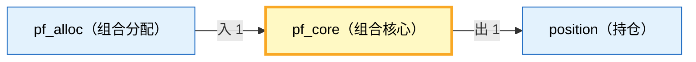

# Decision Flow · L3 Functional Domain pf_core（组合核心）

> 生成时间: 2026-07-30T01:41:53
> 真源: `architecture_model/domain/decision_graph_model.yaml` → PostgreSQL `decision_*` 表（TRAE-061）
> 数据库: depgraph (PostgreSQL)
> 导航: [返回主索引 decision_index.md](decision_index.md) | 模型驱动轨 → L3 → pf_core

**所属轨**: 模型驱动轨（`model_driven`） | **所属层**: L3 | **功能域**: `pf_core`（组合核心）

## 统计

- 设计态节点数: 12
- 域内边数: 11
- 跨域出边: 1（1 个外部域）
- 跨域入边: 1（1 个外部域）

## 设计态全景图

> 共 7 层，11 边。

```mermaid
flowchart TD
    subgraph track_model_driven["模型驱动轨（Model-Driven Track）"]
        LL2A["[design]L2A: 信号层<br/>功能: 信号工厂 → 多策略投票 → 收益率条…<br/>freq: daily<br/>build: planned"]:::bsPlanned
        LL2B["[design]L2B: 主力行为层<br/>功能: 六阶段识别 + 自迭代推演 + 庄家专…<br/>freq: daily<br/>build: planned"]:::bsPlanned
        LL2C["[design]L2C: 市场状态与大盘预测层<br/>功能: 3×3矩阵 + 2叠加态 + 三层大盘…<br/>freq: daily<br/>build: planned"]:::bsPlanned
        LL2D["[design]L2D: 知识图谱与因果推演层<br/>功能: 六类知识图谱 → 事件影响链分析 → …<br/>freq: daily<br/>build: planned"]:::bsPlanned
        LL3["[design]L3: 策略组合层<br/>功能: 多策略信号合成 → 资本分配 → 元策…<br/>freq: daily<br/>build: planned"]:::bsPlanned
        N20("[design]portfolio_target: 组合核心引擎 Portfolio Core Engine<br/>path: decision/pf_core/pc_01"):::bsPlanned
        LL3 --- N20
        N21("[design]portfolio_target: 半Kelly硬上限 Half-Kelly Hard Cap<br/>path: decision/pf_core/pc_02"):::bsPlanned
        LL3 --- N21
        N22("[design]portfolio_target: 风险预算 Risk Budget<br/>path: decision/pf_core/pc_03"):::bsPlanned
        LL3 --- N22
        N23("[design]portfolio_target: 再平衡决策 Rebalance Decision<br/>path: decision/pf_core/pc_04"):::bsPlanned
        LL3 --- N23
        N24("[design]portfolio_target: 仲裁优先级体系 Arbitration Priority<br/>path: decision/pf_core/pc_05"):::bsPlanned
        LL3 --- N24
        N25("[design]portfolio_target: 多策略共振融合 Strategy Convergence Fusion<br/>path: decision/pf_core/pc_06"):::bsPlanned
        LL3 --- N25
        N26("[design]portfolio_target: 因子直通裁决 Factor Bypass Arbitration<br/>path: decision/pf_core/pc_07"):::bsPlanned
        LL3 --- N26
        N27("[design]portfolio_target: 元策略路由 Meta-Strategy Router<br/>path: decision/pf_core/pc_08"):::bsPlanned
        LL3 --- N27
        N28("[design]portfolio_target: 组合优化 Portfolio Optimization<br/>path: decision/pf_core/pc_09"):::bsPlanned
        LL3 --- N28
        N29("[design]portfolio_target: 资本分配 Capital Allocation<br/>path: decision/pf_core/pc_10"):::bsPlanned
        LL3 --- N29
        N30("[design]portfolio_target: 决策编排器 Decision Orchestrator<br/>path: decision/pf_core/pc_11"):::bsPlanned
        LL3 --- N30
        N31("[design]portfolio_target: 四轨融合器 Multi-Track Fusion<br/>path: decision/pf_core/pc_12"):::bsPlanned
        LL3 --- N31
        LL5["[design]L5: 学习层<br/>功能: 7阶段学习流水线 → 模块工厂 → 知…<br/>freq: weekly<br/>build: planned"]:::bsPlanned
        LL6["[design]L6: 自评估层<br/>功能: LLM 自评估(Judge+交叉验证)…<br/>freq: weekly<br/>build: planned"]:::bsPlanned
    end
    LL2A -.->|triggering| LL2B
    LL2B -.->|triggering| LL2C
    LL2C -.->|triggering| LL2D
    LL2D -.->|triggering| LL3
    LL3 -.->|triggering| LL5
    LL5 -.->|triggering| LL6
    N20 -->|informing| N21
    N21 -->|informing| N22
    N22 -->|informing| N23
    N23 -->|informing| N24
    N24 -->|informing| N25
    N25 -->|informing| N26
    N26 -->|informing| N27
    N27 -->|informing| N28
    N28 -->|informing| N29
    N29 -->|informing| N30
    N30 -->|informing| N31

    classDef bsStable fill:#c8e6c9,stroke:#2e7d32,stroke-width:2px,color:#000
    classDef bsGenerated fill:#fff9c4,stroke:#f9a825,stroke-width:2px,color:#000
    classDef bsTesting fill:#ffe0b2,stroke:#ef6c00,stroke-width:2px,color:#000
    classDef bsPlanned fill:#e1f5fe,stroke:#0277bd,stroke-width:2px,color:#000,stroke-dasharray: 5 5
    classDef bsDeprecated fill:#ffcdd2,stroke:#c62828,stroke-width:2px,color:#000,stroke-dasharray: 5 5
```

## Node 清单

| node_id | layer | type | name | path | module_id | 代码引用 | 成熟度 | build_status |
|---------|-------|------|------|------|-----------|----------|--------|--------------|
| 20 | L3 | portfolio_target | 组合核心引擎 Portfolio Core Engine | decision/pf_core/pc_01 | MOD-L05-001 | - | design | planned |
| 21 | L3 | portfolio_target | 半Kelly硬上限 Half-Kelly Hard Cap | decision/pf_core/pc_02 | MOD-L05-001 | - | design | planned |
| 22 | L3 | portfolio_target | 风险预算 Risk Budget | decision/pf_core/pc_03 | MOD-L05-001 | - | design | planned |
| 23 | L3 | portfolio_target | 再平衡决策 Rebalance Decision | decision/pf_core/pc_04 | MOD-L05-001 | - | design | planned |
| 24 | L3 | portfolio_target | 仲裁优先级体系 Arbitration Priority | decision/pf_core/pc_05 | MOD-L05-001 | - | design | planned |
| 25 | L3 | portfolio_target | 多策略共振融合 Strategy Convergence Fusion | decision/pf_core/pc_06 | MOD-L05-001 | - | design | planned |
| 26 | L3 | portfolio_target | 因子直通裁决 Factor Bypass Arbitration | decision/pf_core/pc_07 | MOD-L05-001 | - | design | planned |
| 27 | L3 | portfolio_target | 元策略路由 Meta-Strategy Router | decision/pf_core/pc_08 | MOD-L05-001 | - | design | planned |
| 28 | L3 | portfolio_target | 组合优化 Portfolio Optimization | decision/pf_core/pc_09 | MOD-L05-001 | - | design | planned |
| 29 | L3 | portfolio_target | 资本分配 Capital Allocation | decision/pf_core/pc_10 | MOD-L05-001 | - | design | planned |
| 30 | L3 | portfolio_target | 决策编排器 Decision Orchestrator | decision/pf_core/pc_11 | MOD-L05-001 | - | design | planned |
| 31 | L3 | portfolio_target | 四轨融合器 Multi-Track Fusion | decision/pf_core/pc_12 | MOD-L05-001 | - | design | planned |

## Edge 清单（域内）

| edge_id | from | to | type | condition | track |
|---------|-------|-----|------|-----------|-------|
| 96 | 20 | 21 | informing | L3层内顺序流 | - |
| 97 | 21 | 22 | informing | L3层内顺序流 | - |
| 98 | 22 | 23 | informing | L3层内顺序流 | - |
| 99 | 23 | 24 | informing | L3层内顺序流 | - |
| 100 | 24 | 25 | informing | L3层内顺序流 | - |
| 101 | 25 | 26 | informing | L3层内顺序流 | - |
| 102 | 26 | 27 | informing | L3层内顺序流 | - |
| 103 | 27 | 28 | informing | L3层内顺序流 | - |
| 104 | 28 | 29 | informing | L3层内顺序流 | - |
| 105 | 29 | 30 | informing | L3层内顺序流 | - |
| 106 | 30 | 31 | informing | L3层内顺序流 | - |

## 跨域出边（Depends On）

| # | 本域节点 | → | 外部域-目标节点 | type |
|:--:|---------|:--:|---------|---------|
| 1 | decision/pf_core/pc_12 | → | decision/position/pos_01 | informing |

## 跨域入边（Depended By）

| # | 外部域-源节点 | → | 本域节点 | type |
|:--:|---------|:--:|---------|---------|
| 1 | decision/pf_alloc/pa_06 | → | decision/pf_core/pc_01 | informing |

## 跨域依赖图（Cross-Domain Dependency Graph）

> 本域与 2 个外部域直接连接 / This domain directly connects to 2 external domain(s).

