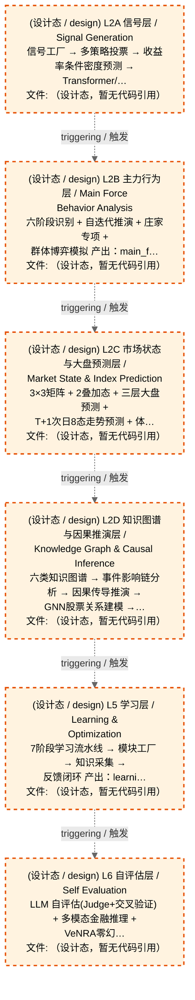
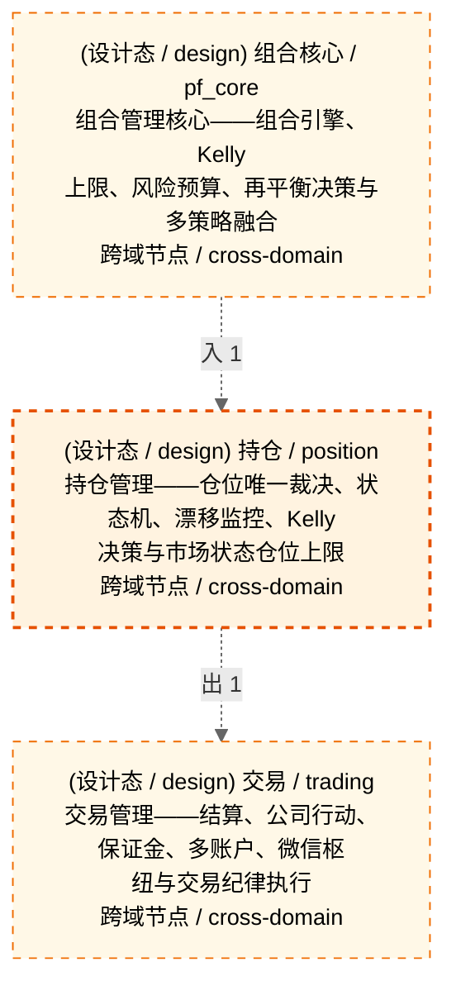

# Decision Flow · L3 Functional Domain position（持仓）

> 生成时间: 2026-07-31T17:21:51
> 真源: `architecture_model/domain/decision_graph_model.yaml` → PostgreSQL `decision_*` 表（TRAE-061）
> 数据库: depgraph (PostgreSQL)
> 导航: [返回主索引 decision_index.md](decision_index.md) | 模型驱动轨 → L3 → position

> **[可缩放 HTML 版 / Zoomable HTML](http://localhost:8765/docs/02_enterprise_architecture/06_decision_architecture/_zoomable_html/18_decision_l3_position.html)** — Ctrl+滚轮缩放 ｜ 双击重置 ｜ Ctrl+Shift+D 切换拖动/选择模式

**所属轨**: 模型驱动轨（`model_driven`） | **所属层**: L3 | **功能域**: `position`（持仓）

> **域职责 / Responsibility**: 持仓管理——仓位唯一裁决、状态机、漂移监控、Kelly 决策与市场状态仓位上限

## 统计

- 决策节点数（全部）: 19
- 运营态节点数（production）: 0
- 设计态节点数（design）: 19
- 域内边数: 18
- 跨域出边: 1（1 个外部域）
- 跨域入边: 1（1 个外部域）

## 域内依赖图 / Internal Dependency Diagram

> **图例说明 / Legend**：
> - 🟦 **蓝色 = 运营态模块**（production，已上线运行）
> - 🟧 **橙色虚线 = 设计态模块**（design，蓝图阶段，代码未写）
> - **实线箭头 `-->` = 运营态依赖**（两端都 production）
> - **虚线箭头 `-.->` = 非运营态依赖**（含 design / 混合）

### 全景图（全部模块，颜色区分运营态/设计态）

> 展示全部 19 个决策节点（运营态 0 + 设计态 19），含跨域依赖外部节点。

> 共 10 层，18 边。

```mermaid
%%{init: {'theme': 'base', 'themeVariables': {'primaryColor': '#eaeaea', 'primaryTextColor': '#333333', 'primaryBorderColor': '#666666', 'lineColor': '#666666', 'secondaryColor': '#eaeaea', 'tertiaryColor': '#eaeaea', 'clusterBkg': 'transparent', 'clusterBorder': 'transparent', 'fontSize': '14px'}}}%%
flowchart TD
    LL0["(生产态 / production) L0 数据接入与预处理层 /<br/>Data Ingestion & Preprocessing<br/>miniQMT + iFind + tushare + 另类数据源 → 事件总…<br/>文件: MOD-MKT_DATA"]
    LL1["(生产态 / production) L1 因子计算层 / Factor<br/>Calculation<br/>因子工厂全生命周期管理 → 盘前全量<br/>/盘中增量双模计算 → 因子池 产出：fa…<br/>文件: MOD-L02-001"]
    LL2A["(设计态 / design) L2A 信号层 / Signal Generation<br/>信号工厂 → 多策略投票 → 收益率条件密度预测 →<br/>Transformer/…<br/>文件: （设计态，暂无代码引用）"]
    LL2B["(设计态 / design) L2B 主力行为层 / Main Force<br/>Behavior Analysis<br/>六阶段识别 + 自迭代推演 + 庄家专项 +<br/>群体博弈模拟 产出：main_f…<br/>文件: （设计态，暂无代码引用）"]
    LL2C["(设计态 / design) L2C 市场状态与大盘预测层 /<br/>Market State & Index Prediction<br/>3×3矩阵 + 2叠加态 + 三层大盘预测 +<br/>T+1次日8态走势预测 + 体…<br/>文件: （设计态，暂无代码引用）"]
    LL2D["(设计态 / design) L2D 知识图谱与因果推演层 /<br/>Knowledge Graph & Causal Inference<br/>六类知识图谱 → 事件影响链分析 → 因果传导推演 →<br/>GNN股票关系建模 →…<br/>文件: （设计态，暂无代码引用）"]
    LL3["(生产态 / production) L3 策略组合层 / Strategy<br/>& Portfolio Combination<br/>多策略信号合成 → 资本分配 → 元策略路由 →<br/>组合构建 产出：portfo…<br/>文件: MOD-L05-001"]
    N38["(设计态 / design) 仓位唯一裁决中心 / C-047<br/>Position Sole Arbiter<br/>组合目标节点·仓位唯一裁决中心<br/>文件: decision/position/pos_01"]
    LL3 --- N38
    N39["(设计态 / design) 持仓状态机 / Position State<br/>Machine<br/>组合目标节点·持仓状态机<br/>文件: decision/position/pos_02"]
    LL3 --- N39
    N40["(设计态 / design) 仓位漂移监控 / Position Drift<br/>Monitor<br/>组合目标节点·仓位漂移监控<br/>文件: decision/position/pos_03"]
    LL3 --- N40
    N41["(设计态 / design) Kelly仓位决策 / Kelly<br/>Position Decision<br/>组合目标节点·Kelly仓位决策<br/>文件: decision/position/pos_04"]
    LL3 --- N41
    N42["(设计态 / design) 风险配额 / Risk Quota<br/>组合目标节点·风险配额<br/>文件: decision/position/pos_05"]
    LL3 --- N42
    N43["(设计态 / design) 11种市场状态→仓位上限 /<br/>Market State Position Cap<br/>组合目标节点·11种市场状态→仓位上限<br/>文件: decision/position/pos_06"]
    LL3 --- N43
    N44["(设计态 / design) 组合层决策 / Portfolio Layer<br/>Decision<br/>组合目标节点·组合层决策<br/>文件: decision/position/pos_07"]
    LL3 --- N44
    N45["(设计态 / design) 策略层决策 / Strategy Layer<br/>Decision<br/>组合目标节点·策略层决策<br/>文件: decision/position/pos_08"]
    LL3 --- N45
    N46["(设计态 / design) 标层决策 / Instrument Layer<br/>Decision<br/>组合目标节点·标层决策<br/>文件: decision/position/pos_09"]
    LL3 --- N46
    N47["(设计态 / design) 动态层决策 / Dynamic Layer<br/>Decision<br/>组合目标节点·动态层决策<br/>文件: decision/position/pos_10"]
    LL3 --- N47
    N48["(设计态 / design) 再平衡触发 / Rebalance Trigger<br/>组合目标节点·再平衡触发<br/>文件: decision/position/pos_11"]
    LL3 --- N48
    N49["(设计态 / design) 仓位上限硬约束 / Position Cap<br/>Hard Constraint<br/>组合目标节点·仓位上限硬约束<br/>文件: decision/position/pos_12"]
    LL3 --- N49
    N50["(设计态 / design) REDUCING→EXITING状态转换 /<br/>REDUCING to EXITING<br/>组合目标节点·REDUCING→EXITING状态转换<br/>文件: decision/position/pos_13"]
    LL3 --- N50
    N51["(设计态 / design) 风险预算→Kelly决策 / Risk<br/>Budget to Kelly<br/>组合目标节点·风险预算→Kelly决策<br/>文件: decision/position/pos_14"]
    LL3 --- N51
    N52["(设计态 / design) 半Kelly硬上限 / Half-Kelly<br/>Hard Cap<br/>组合目标节点·半Kelly硬上限<br/>文件: decision/position/pos_15"]
    LL3 --- N52
    N53["(设计态 / design) 仓位降级 / Position<br/>Degradation<br/>组合目标节点·仓位降级<br/>文件: decision/position/pos_16"]
    LL3 --- N53
    N54["(设计态 / design) 持仓状态→卖出阈值 / Position<br/>State to Sell Threshold<br/>组合目标节点·持仓状态→卖出阈值<br/>文件: decision/position/pos_17"]
    LL3 --- N54
    N55["(设计态 / design) 仓位四轨决策 / Position<br/>Four-Track Decision<br/>组合目标节点·仓位四轨决策<br/>文件: decision/position/pos_18"]
    LL3 --- N55
    N56["(设计态 / design) 仓位裁决→执行 / Position<br/>Arbitration to Execution<br/>组合目标节点·仓位裁决→执行<br/>文件: decision/position/pos_19"]
    LL3 --- N56
    LL4["(生产态 / production) L4 风控层 / Risk Control<br/>Pre/Post-Trade 风控校验 + Kill Switch 熔断 + …<br/>文件: MOD-L04-001"]
    LL5["(设计态 / design) L5 学习层 / Learning &<br/>Optimization<br/>7阶段学习流水线 → 模块工厂 → 知识采集 →<br/>反馈闭环 产出：learni…<br/>文件: （设计态，暂无代码引用）"]
    LL6["(设计态 / design) L6 自评估层 / Self Evaluation<br/>LLM 自评估(Judge+交叉验证) + 多模态金融推理 +<br/>VeNRA零幻…<br/>文件: （设计态，暂无代码引用）"]
    LL0 -->|triggering / 触发| LL1
    LL1 -.->|triggering / 触发| LL2A
    LL2A -.->|triggering / 触发| LL2B
    LL2B -.->|triggering / 触发| LL2C
    LL2C -.->|triggering / 触发| LL2D
    LL2D -.->|triggering / 触发| LL3
    LL3 -->|triggering / 触发| LL4
    LL4 -.->|triggering / 触发| LL5
    LL5 -.->|triggering / 触发| LL6
    N38 -.->|informing / 告知| N39
    N39 -.->|informing / 告知| N40
    N40 -.->|informing / 告知| N41
    N41 -.->|informing / 告知| N42
    N42 -.->|informing / 告知| N43
    N43 -.->|informing / 告知| N44
    N44 -.->|informing / 告知| N45
    N45 -.->|informing / 告知| N46
    N46 -.->|informing / 告知| N47
    N47 -.->|informing / 告知| N48
    N48 -.->|informing / 告知| N49
    N49 -.->|informing / 告知| N50
    N50 -.->|informing / 告知| N51
    N51 -.->|informing / 告知| N52
    N52 -.->|informing / 告知| N53
    N53 -.->|informing / 告知| N54
    N54 -.->|informing / 告知| N55
    N55 -.->|informing / 告知| N56
    classDef production fill:#e1f5fe,stroke:#01579b,stroke-width:2px,color:#000
    classDef design fill:#fff3e0,stroke:#e65100,stroke-width:2px,color:#000,stroke-dasharray: 5 5
    classDef external_prod fill:#e8f4fd,stroke:#0277bd,stroke-width:1px,color:#000
    classDef external_design fill:#fff8e7,stroke:#ef6c00,stroke-width:1px,color:#000,stroke-dasharray: 5 5
    class LL0,LL1,LL3,LL4 production
    class LL2A,LL2B,LL2C,LL2D,N38,N39,N40,N41,N42,N43,N44,N45,N46,N47,N48,N49,N50,N51,N52,N53,N54,N55,N56,LL5,LL6 design
```

### 运营态的图（仅 design_maturity=production 的模块和域内依赖）

> 仅展示已上线运行的决策节点（共 0 个），不含跨域外部节点。跨域依赖见下方跨域依赖章节。

> （无模块 / No modules）

### 设计态的图（仅 design_maturity=design 的模块和域内依赖）

> 仅展示蓝图阶段、代码未写的设计态决策节点（共 19 个），不含跨域外部节点。

> 共 6 层，0 边。

## Node 清单

| node_id / 节点ID | layer / 层 | type / 类型 | name / 名称 | path / 路径 | module_id / 模块 | 代码引用 / ref | maturity / 成熟度 | build_status / 构建状态 |
|---------|-------|------|------|------|-----------|----------|--------|--------------|
| 38 | L3 | portfolio_target / 组合目标节点 | 仓位唯一裁决中心 C-047 Position Sole Arbiter | decision/position/pos_01 | MOD-L05-001 | - | design / 设计 | planned / 已规划 |
| 39 | L3 | portfolio_target / 组合目标节点 | 持仓状态机 Position State Machine | decision/position/pos_02 | MOD-L05-001 | - | design / 设计 | planned / 已规划 |
| 40 | L3 | portfolio_target / 组合目标节点 | 仓位漂移监控 Position Drift Monitor | decision/position/pos_03 | MOD-L05-001 | - | design / 设计 | planned / 已规划 |
| 41 | L3 | portfolio_target / 组合目标节点 | Kelly仓位决策 Kelly Position Decision | decision/position/pos_04 | MOD-L05-001 | - | design / 设计 | planned / 已规划 |
| 42 | L3 | portfolio_target / 组合目标节点 | 风险配额 Risk Quota | decision/position/pos_05 | MOD-L05-001 | - | design / 设计 | planned / 已规划 |
| 43 | L3 | portfolio_target / 组合目标节点 | 11种市场状态→仓位上限 Market State Position Cap | decision/position/pos_06 | MOD-L05-001 | - | design / 设计 | planned / 已规划 |
| 44 | L3 | portfolio_target / 组合目标节点 | 组合层决策 Portfolio Layer Decision | decision/position/pos_07 | MOD-L05-001 | - | design / 设计 | planned / 已规划 |
| 45 | L3 | portfolio_target / 组合目标节点 | 策略层决策 Strategy Layer Decision | decision/position/pos_08 | MOD-L05-001 | - | design / 设计 | planned / 已规划 |
| 46 | L3 | portfolio_target / 组合目标节点 | 标层决策 Instrument Layer Decision | decision/position/pos_09 | MOD-L05-001 | - | design / 设计 | planned / 已规划 |
| 47 | L3 | portfolio_target / 组合目标节点 | 动态层决策 Dynamic Layer Decision | decision/position/pos_10 | MOD-L05-001 | - | design / 设计 | planned / 已规划 |
| 48 | L3 | portfolio_target / 组合目标节点 | 再平衡触发 Rebalance Trigger | decision/position/pos_11 | MOD-L05-001 | - | design / 设计 | planned / 已规划 |
| 49 | L3 | portfolio_target / 组合目标节点 | 仓位上限硬约束 Position Cap Hard Constraint | decision/position/pos_12 | MOD-L05-001 | - | design / 设计 | planned / 已规划 |
| 50 | L3 | portfolio_target / 组合目标节点 | REDUCING→EXITING状态转换 REDUCING to EXITING | decision/position/pos_13 | MOD-L05-001 | - | design / 设计 | planned / 已规划 |
| 51 | L3 | portfolio_target / 组合目标节点 | 风险预算→Kelly决策 Risk Budget to Kelly | decision/position/pos_14 | MOD-L05-001 | - | design / 设计 | planned / 已规划 |
| 52 | L3 | portfolio_target / 组合目标节点 | 半Kelly硬上限 Half-Kelly Hard Cap | decision/position/pos_15 | MOD-L05-001 | - | design / 设计 | planned / 已规划 |
| 53 | L3 | portfolio_target / 组合目标节点 | 仓位降级 Position Degradation | decision/position/pos_16 | MOD-L05-001 | - | design / 设计 | planned / 已规划 |
| 54 | L3 | portfolio_target / 组合目标节点 | 持仓状态→卖出阈值 Position State to Sell Threshold | decision/position/pos_17 | MOD-L05-001 | - | design / 设计 | planned / 已规划 |
| 55 | L3 | portfolio_target / 组合目标节点 | 仓位四轨决策 Position Four-Track Decision | decision/position/pos_18 | MOD-L05-001 | - | design / 设计 | planned / 已规划 |
| 56 | L3 | portfolio_target / 组合目标节点 | 仓位裁决→执行 Position Arbitration to Execution | decision/position/pos_19 | MOD-L05-001 | - | design / 设计 | planned / 已规划 |

## Edge 清单（域内）

| edge_id / 边ID | from / 起点 | to / 终点 | type / 类型 | condition / 条件 | track / 轨 |
|---------|-------|-----|------|-----------|-------|
| 108 | 38 | 39 | informing / 告知 | L3层内顺序流 | - |
| 109 | 39 | 40 | informing / 告知 | L3层内顺序流 | - |
| 110 | 40 | 41 | informing / 告知 | L3层内顺序流 | - |
| 111 | 41 | 42 | informing / 告知 | L3层内顺序流 | - |
| 112 | 42 | 43 | informing / 告知 | L3层内顺序流 | - |
| 113 | 43 | 44 | informing / 告知 | L3层内顺序流 | - |
| 114 | 44 | 45 | informing / 告知 | L3层内顺序流 | - |
| 115 | 45 | 46 | informing / 告知 | L3层内顺序流 | - |
| 116 | 46 | 47 | informing / 告知 | L3层内顺序流 | - |
| 117 | 47 | 48 | informing / 告知 | L3层内顺序流 | - |
| 118 | 48 | 49 | informing / 告知 | L3层内顺序流 | - |
| 119 | 49 | 50 | informing / 告知 | L3层内顺序流 | - |
| 120 | 50 | 51 | informing / 告知 | L3层内顺序流 | - |
| 121 | 51 | 52 | informing / 告知 | L3层内顺序流 | - |
| 122 | 52 | 53 | informing / 告知 | L3层内顺序流 | - |
| 123 | 53 | 54 | informing / 告知 | L3层内顺序流 | - |
| 124 | 54 | 55 | informing / 告知 | L3层内顺序流 | - |
| 125 | 55 | 56 | informing / 告知 | L3层内顺序流 | - |

## 跨域出边（Depends On）

| # | 本域节点 / from | → | 外部域-目标节点 / to | type / 类型 |
|:--:|---------|:--:|---------|---------|
| 1 | decision/position/pos_19 | → | decision/trading/trd_01 | informing / 告知 |

## 跨域入边（Depended By）

| # | 外部域-源节点 / from | → | 本域节点 / to | type / 类型 |
|:--:|---------|:--:|---------|---------|
| 1 | decision/pf_core/pc_12 | → | decision/position/pos_01 | informing / 告知 |

## 跨域依赖图（Cross-Domain Dependency Graph）

> 本域与 2 个外部域直接连接 / This domain directly connects to 2 external domain(s).

