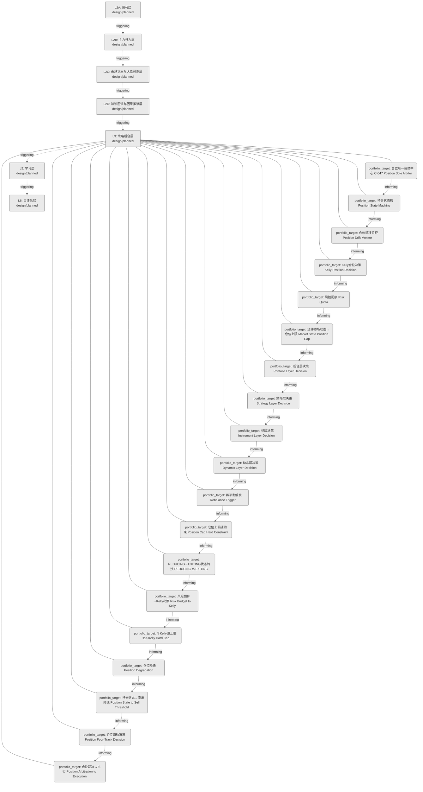
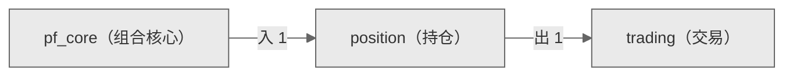

# Decision Flow · L3 Functional Domain position（持仓）

> 生成时间: 2026-07-30T19:59:19
> 真源: `architecture_model/domain/decision_graph_model.yaml` → PostgreSQL `decision_*` 表（TRAE-061）
> 数据库: depgraph (PostgreSQL)
> 导航: [返回主索引 decision_index.md](decision_index.md) | 模型驱动轨 → L3 → position

**所属轨**: 模型驱动轨（`model_driven`） | **所属层**: L3 | **功能域**: `position`（持仓）

## 统计

- 设计态节点数: 19
- 域内边数: 18
- 跨域出边: 1（1 个外部域）
- 跨域入边: 1（1 个外部域）

## 设计态全景图

> 共 7 层，18 边。

## Node 清单

| node_id | layer | type | name | path | module_id | 代码引用 | 成熟度 | build_status |
|---------|-------|------|------|------|-----------|----------|--------|--------------|
| 38 | L3 | portfolio_target | 仓位唯一裁决中心 C-047 Position Sole Arbiter | decision/position/pos_01 | MOD-L05-001 | - | design | planned |
| 39 | L3 | portfolio_target | 持仓状态机 Position State Machine | decision/position/pos_02 | MOD-L05-001 | - | design | planned |
| 40 | L3 | portfolio_target | 仓位漂移监控 Position Drift Monitor | decision/position/pos_03 | MOD-L05-001 | - | design | planned |
| 41 | L3 | portfolio_target | Kelly仓位决策 Kelly Position Decision | decision/position/pos_04 | MOD-L05-001 | - | design | planned |
| 42 | L3 | portfolio_target | 风险配额 Risk Quota | decision/position/pos_05 | MOD-L05-001 | - | design | planned |
| 43 | L3 | portfolio_target | 11种市场状态→仓位上限 Market State Position Cap | decision/position/pos_06 | MOD-L05-001 | - | design | planned |
| 44 | L3 | portfolio_target | 组合层决策 Portfolio Layer Decision | decision/position/pos_07 | MOD-L05-001 | - | design | planned |
| 45 | L3 | portfolio_target | 策略层决策 Strategy Layer Decision | decision/position/pos_08 | MOD-L05-001 | - | design | planned |
| 46 | L3 | portfolio_target | 标层决策 Instrument Layer Decision | decision/position/pos_09 | MOD-L05-001 | - | design | planned |
| 47 | L3 | portfolio_target | 动态层决策 Dynamic Layer Decision | decision/position/pos_10 | MOD-L05-001 | - | design | planned |
| 48 | L3 | portfolio_target | 再平衡触发 Rebalance Trigger | decision/position/pos_11 | MOD-L05-001 | - | design | planned |
| 49 | L3 | portfolio_target | 仓位上限硬约束 Position Cap Hard Constraint | decision/position/pos_12 | MOD-L05-001 | - | design | planned |
| 50 | L3 | portfolio_target | REDUCING→EXITING状态转换 REDUCING to EXITING | decision/position/pos_13 | MOD-L05-001 | - | design | planned |
| 51 | L3 | portfolio_target | 风险预算→Kelly决策 Risk Budget to Kelly | decision/position/pos_14 | MOD-L05-001 | - | design | planned |
| 52 | L3 | portfolio_target | 半Kelly硬上限 Half-Kelly Hard Cap | decision/position/pos_15 | MOD-L05-001 | - | design | planned |
| 53 | L3 | portfolio_target | 仓位降级 Position Degradation | decision/position/pos_16 | MOD-L05-001 | - | design | planned |
| 54 | L3 | portfolio_target | 持仓状态→卖出阈值 Position State to Sell Threshold | decision/position/pos_17 | MOD-L05-001 | - | design | planned |
| 55 | L3 | portfolio_target | 仓位四轨决策 Position Four-Track Decision | decision/position/pos_18 | MOD-L05-001 | - | design | planned |
| 56 | L3 | portfolio_target | 仓位裁决→执行 Position Arbitration to Execution | decision/position/pos_19 | MOD-L05-001 | - | design | planned |

## Edge 清单（域内）

| edge_id | from | to | type | condition | track |
|---------|-------|-----|------|-----------|-------|
| 108 | 38 | 39 | informing | L3层内顺序流 | - |
| 109 | 39 | 40 | informing | L3层内顺序流 | - |
| 110 | 40 | 41 | informing | L3层内顺序流 | - |
| 111 | 41 | 42 | informing | L3层内顺序流 | - |
| 112 | 42 | 43 | informing | L3层内顺序流 | - |
| 113 | 43 | 44 | informing | L3层内顺序流 | - |
| 114 | 44 | 45 | informing | L3层内顺序流 | - |
| 115 | 45 | 46 | informing | L3层内顺序流 | - |
| 116 | 46 | 47 | informing | L3层内顺序流 | - |
| 117 | 47 | 48 | informing | L3层内顺序流 | - |
| 118 | 48 | 49 | informing | L3层内顺序流 | - |
| 119 | 49 | 50 | informing | L3层内顺序流 | - |
| 120 | 50 | 51 | informing | L3层内顺序流 | - |
| 121 | 51 | 52 | informing | L3层内顺序流 | - |
| 122 | 52 | 53 | informing | L3层内顺序流 | - |
| 123 | 53 | 54 | informing | L3层内顺序流 | - |
| 124 | 54 | 55 | informing | L3层内顺序流 | - |
| 125 | 55 | 56 | informing | L3层内顺序流 | - |

## 跨域出边（Depends On）

| # | 本域节点 | → | 外部域-目标节点 | type |
|:--:|---------|:--:|---------|---------|
| 1 | decision/position/pos_19 | → | decision/trading/trd_01 | informing |

## 跨域入边（Depended By）

| # | 外部域-源节点 | → | 本域节点 | type |
|:--:|---------|:--:|---------|---------|
| 1 | decision/pf_core/pc_12 | → | decision/position/pos_01 | informing |

## 跨域依赖图（Cross-Domain Dependency Graph）

> 本域与 2 个外部域直接连接 / This domain directly connects to 2 external domain(s).

