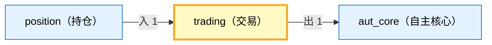

# Decision Flow · L3 Functional Domain trading（交易）

> 生成时间: 2026-07-30T02:46:13
> 真源: `architecture_model/domain/decision_graph_model.yaml` → PostgreSQL `decision_*` 表（TRAE-061）
> 数据库: depgraph (PostgreSQL)
> 导航: [返回主索引 decision_index.md](decision_index.md) | 模型驱动轨 → L3 → trading

**所属轨**: 模型驱动轨（`model_driven`） | **所属层**: L3 | **功能域**: `trading`（交易）

## 统计

- 设计态节点数: 11
- 域内边数: 10
- 跨域出边: 1（1 个外部域）
- 跨域入边: 1（1 个外部域）

## 设计态全景图

> 共 7 层，10 边。

```mermaid
flowchart TD
    subgraph track_model_driven["模型驱动轨（Model-Driven Track）"]
        LL2A["[design]L2A: 信号层<br/>功能: 信号工厂 → 多策略投票 → 收益率条…<br/>freq: daily<br/>build: planned"]:::bsPlanned
        LL2B["[design]L2B: 主力行为层<br/>功能: 六阶段识别 + 自迭代推演 + 庄家专…<br/>freq: daily<br/>build: planned"]:::bsPlanned
        LL2C["[design]L2C: 市场状态与大盘预测层<br/>功能: 3×3矩阵 + 2叠加态 + 三层大盘…<br/>freq: daily<br/>build: planned"]:::bsPlanned
        LL2D["[design]L2D: 知识图谱与因果推演层<br/>功能: 六类知识图谱 → 事件影响链分析 → …<br/>freq: daily<br/>build: planned"]:::bsPlanned
        LL3["[design]L3: 策略组合层<br/>功能: 多策略信号合成 → 资本分配 → 元策…<br/>freq: daily<br/>build: planned"]:::bsPlanned
        N102("[design]order: 外部订单观察者 External Order Watcher<br/>path: decision/trading/trd_01"):::bsPlanned
        LL3 --- N102
        N103("[design]order: 结算引擎 Settlement Engine<br/>path: decision/trading/trd_02"):::bsPlanned
        LL3 --- N103
        N104("[design]order: 公司行动 Corporate Action<br/>path: decision/trading/trd_03"):::bsPlanned
        LL3 --- N104
        N105("[design]order: 保证金管理 Margin Manager<br/>path: decision/trading/trd_04"):::bsPlanned
        LL3 --- N105
        N106("[design]order: 多账户 Multi-Account<br/>path: decision/trading/trd_05"):::bsPlanned
        LL3 --- N106
        N107("[design]order: 微信枢纽 WeChat Hub<br/>path: decision/trading/trd_06"):::bsPlanned
        LL3 --- N107
        N108("[design]order: C-013 4级优先级 C-013 4-Level Priority<br/>path: decision/trading/trd_07"):::bsPlanned
        LL3 --- N108
        N109("[design]order: A股交易纪律四项必做 A-Share Trading 4-Do<br/>path: decision/trading/trd_08"):::bsPlanned
        LL3 --- N109
        N110("[design]order: A股交易纪律四项严禁 A-Share Trading 4-Forbidden<br/>path: decision/trading/trd_09"):::bsPlanned
        LL3 --- N110
        N111("[design]order: 监管报送 Regulatory Reporting<br/>path: decision/trading/trd_10"):::bsPlanned
        LL3 --- N111
        N112("[design]order: 盘中即时反应决策引擎 Intraday Instant Reaction Decision Engine<br/>path: decision/trading/trd_11"):::bsPlanned
        LL3 --- N112
        LL5["[design]L5: 学习层<br/>功能: 7阶段学习流水线 → 模块工厂 → 知…<br/>freq: weekly<br/>build: planned"]:::bsPlanned
        LL6["[design]L6: 自评估层<br/>功能: LLM 自评估(Judge+交叉验证)…<br/>freq: weekly<br/>build: planned"]:::bsPlanned
    end
    LL2A -.->|triggering| LL2B
    LL2B -.->|triggering| LL2C
    LL2C -.->|triggering| LL2D
    LL2D -.->|triggering| LL3
    LL3 -.->|triggering| LL5
    LL5 -.->|triggering| LL6
    N102 -->|informing| N103
    N103 -->|informing| N104
    N104 -->|informing| N105
    N105 -->|informing| N106
    N106 -->|informing| N107
    N107 -->|informing| N108
    N108 -->|informing| N109
    N109 -->|informing| N110
    N110 -->|informing| N111
    N111 -->|informing| N112

    classDef bsStable fill:#c8e6c9,stroke:#2e7d32,stroke-width:2px,color:#000
    classDef bsGenerated fill:#fff9c4,stroke:#f9a825,stroke-width:2px,color:#000
    classDef bsTesting fill:#ffe0b2,stroke:#ef6c00,stroke-width:2px,color:#000
    classDef bsPlanned fill:#e1f5fe,stroke:#0277bd,stroke-width:2px,color:#000,stroke-dasharray: 5 5
    classDef bsDeprecated fill:#ffcdd2,stroke:#c62828,stroke-width:2px,color:#000,stroke-dasharray: 5 5
```

## Node 清单

| node_id | layer | type | name | path | module_id | 代码引用 | 成熟度 | build_status |
|---------|-------|------|------|------|-----------|----------|--------|--------------|
| 102 | L3 | order | 外部订单观察者 External Order Watcher | decision/trading/trd_01 | MOD-L05-001 | - | design | planned |
| 103 | L3 | order | 结算引擎 Settlement Engine | decision/trading/trd_02 | MOD-L05-001 | - | design | planned |
| 104 | L3 | order | 公司行动 Corporate Action | decision/trading/trd_03 | MOD-L05-001 | - | design | planned |
| 105 | L3 | order | 保证金管理 Margin Manager | decision/trading/trd_04 | MOD-L05-001 | - | design | planned |
| 106 | L3 | order | 多账户 Multi-Account | decision/trading/trd_05 | MOD-L05-001 | - | design | planned |
| 107 | L3 | order | 微信枢纽 WeChat Hub | decision/trading/trd_06 | MOD-L05-001 | - | design | planned |
| 108 | L3 | order | C-013 4级优先级 C-013 4-Level Priority | decision/trading/trd_07 | MOD-L05-001 | - | design | planned |
| 109 | L3 | order | A股交易纪律四项必做 A-Share Trading 4-Do | decision/trading/trd_08 | MOD-L05-001 | - | design | planned |
| 110 | L3 | order | A股交易纪律四项严禁 A-Share Trading 4-Forbidden | decision/trading/trd_09 | MOD-L05-001 | - | design | planned |
| 111 | L3 | order | 监管报送 Regulatory Reporting | decision/trading/trd_10 | MOD-L05-001 | - | design | planned |
| 112 | L3 | order | 盘中即时反应决策引擎 Intraday Instant Reaction Decision Engine | decision/trading/trd_11 | MOD-L05-001 | - | design | planned |

## Edge 清单（域内）

| edge_id | from | to | type | condition | track |
|---------|-------|-----|------|-----------|-------|
| 127 | 102 | 103 | informing | L3层内顺序流 | - |
| 128 | 103 | 104 | informing | L3层内顺序流 | - |
| 129 | 104 | 105 | informing | L3层内顺序流 | - |
| 130 | 105 | 106 | informing | L3层内顺序流 | - |
| 131 | 106 | 107 | informing | L3层内顺序流 | - |
| 132 | 107 | 108 | informing | L3层内顺序流 | - |
| 133 | 108 | 109 | informing | L3层内顺序流 | - |
| 134 | 109 | 110 | informing | L3层内顺序流 | - |
| 135 | 110 | 111 | informing | L3层内顺序流 | - |
| 136 | 111 | 112 | informing | L3层内顺序流 | - |

## 跨域出边（Depends On）

| # | 本域节点 | → | 外部域-目标节点 | type |
|:--:|---------|:--:|---------|---------|
| 1 | decision/trading/trd_11 | → | decision/aut_core/ac_02 | informing |

## 跨域入边（Depended By）

| # | 外部域-源节点 | → | 本域节点 | type |
|:--:|---------|:--:|---------|---------|
| 1 | decision/position/pos_19 | → | decision/trading/trd_01 | informing |

## 跨域依赖图（Cross-Domain Dependency Graph）

> 本域与 2 个外部域直接连接 / This domain directly connects to 2 external domain(s).

