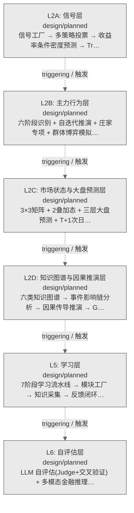
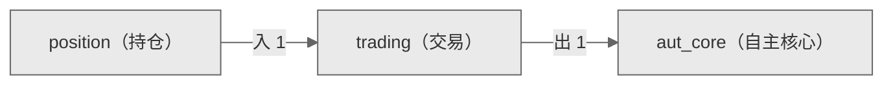

# Decision Flow · L3 Functional Domain trading（交易）

> 生成时间: 2026-07-30T22:18:45
> 真源: `architecture_model/domain/decision_graph_model.yaml` → PostgreSQL `decision_*` 表（TRAE-061）
> 数据库: depgraph (PostgreSQL)
> 导航: [返回主索引 decision_index.md](decision_index.md) | 模型驱动轨 → L3 → trading

**所属轨**: 模型驱动轨（`model_driven`） | **所属层**: L3 | **功能域**: `trading`（交易）

> **域职责 / Responsibility**: 交易管理——结算、公司行动、保证金、多账户、微信枢纽与交易纪律执行

## 统计

- 设计态节点数: 11
- 域内边数: 10
- 跨域出边: 1（1 个外部域）
- 跨域入边: 1（1 个外部域）

## 设计态全景图

> 共 6 层，0 边。

## Node 清单

| node_id / 节点ID | layer / 层 | type / 类型 | name / 名称 | path / 路径 | module_id / 模块 | 代码引用 / ref | maturity / 成熟度 | build_status / 构建状态 |
|---------|-------|------|------|------|-----------|----------|--------|--------------|
| 102 | L3 | order / 订单节点 | 外部订单观察者 External Order Watcher | decision/trading/trd_01 | MOD-L05-001 | - | design / 设计 | planned / 已规划 |
| 103 | L3 | order / 订单节点 | 结算引擎 Settlement Engine | decision/trading/trd_02 | MOD-L05-001 | - | design / 设计 | planned / 已规划 |
| 104 | L3 | order / 订单节点 | 公司行动 Corporate Action | decision/trading/trd_03 | MOD-L05-001 | - | design / 设计 | planned / 已规划 |
| 105 | L3 | order / 订单节点 | 保证金管理 Margin Manager | decision/trading/trd_04 | MOD-L05-001 | - | design / 设计 | planned / 已规划 |
| 106 | L3 | order / 订单节点 | 多账户 Multi-Account | decision/trading/trd_05 | MOD-L05-001 | - | design / 设计 | planned / 已规划 |
| 107 | L3 | order / 订单节点 | 微信枢纽 WeChat Hub | decision/trading/trd_06 | MOD-L05-001 | - | design / 设计 | planned / 已规划 |
| 108 | L3 | order / 订单节点 | C-013 4级优先级 C-013 4-Level Priority | decision/trading/trd_07 | MOD-L05-001 | - | design / 设计 | planned / 已规划 |
| 109 | L3 | order / 订单节点 | A股交易纪律四项必做 A-Share Trading 4-Do | decision/trading/trd_08 | MOD-L05-001 | - | design / 设计 | planned / 已规划 |
| 110 | L3 | order / 订单节点 | A股交易纪律四项严禁 A-Share Trading 4-Forbidden | decision/trading/trd_09 | MOD-L05-001 | - | design / 设计 | planned / 已规划 |
| 111 | L3 | order / 订单节点 | 监管报送 Regulatory Reporting | decision/trading/trd_10 | MOD-L05-001 | - | design / 设计 | planned / 已规划 |
| 112 | L3 | order / 订单节点 | 盘中即时反应决策引擎 Intraday Instant Reaction Decision Engine | decision/trading/trd_11 | MOD-L05-001 | - | design / 设计 | planned / 已规划 |

## Edge 清单（域内）

| edge_id / 边ID | from / 起点 | to / 终点 | type / 类型 | condition / 条件 | track / 轨 |
|---------|-------|-----|------|-----------|-------|
| 127 | 102 | 103 | informing / 告知 | L3层内顺序流 | - |
| 128 | 103 | 104 | informing / 告知 | L3层内顺序流 | - |
| 129 | 104 | 105 | informing / 告知 | L3层内顺序流 | - |
| 130 | 105 | 106 | informing / 告知 | L3层内顺序流 | - |
| 131 | 106 | 107 | informing / 告知 | L3层内顺序流 | - |
| 132 | 107 | 108 | informing / 告知 | L3层内顺序流 | - |
| 133 | 108 | 109 | informing / 告知 | L3层内顺序流 | - |
| 134 | 109 | 110 | informing / 告知 | L3层内顺序流 | - |
| 135 | 110 | 111 | informing / 告知 | L3层内顺序流 | - |
| 136 | 111 | 112 | informing / 告知 | L3层内顺序流 | - |

## 跨域出边（Depends On）

| # | 本域节点 / from | → | 外部域-目标节点 / to | type / 类型 |
|:--:|---------|:--:|---------|---------|
| 1 | decision/trading/trd_11 | → | decision/aut_core/ac_02 | informing / 告知 |

## 跨域入边（Depended By）

| # | 外部域-源节点 / from | → | 本域节点 / to | type / 类型 |
|:--:|---------|:--:|---------|---------|
| 1 | decision/position/pos_19 | → | decision/trading/trd_01 | informing / 告知 |

## 跨域依赖图（Cross-Domain Dependency Graph）

> 本域与 2 个外部域直接连接 / This domain directly connects to 2 external domain(s).

