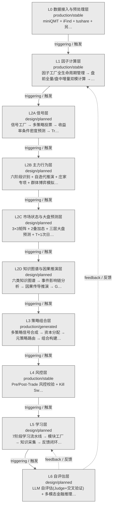

# 决策流图 · 层级详情图

> 生成时间: 2026-07-30T22:18:45
> 真源: `architecture_model/domain/decision_graph_model.yaml` → PostgreSQL `decision_*` 表（TRAE-061）
> 数据库: depgraph (PostgreSQL)
> 导航: [返回主索引 decision_index.md](decision_index.md) | 辅助图

L0-L6 层级卡片 + 频率/成熟度/状态 + 流向箭头 + 学习闭环反馈边。

