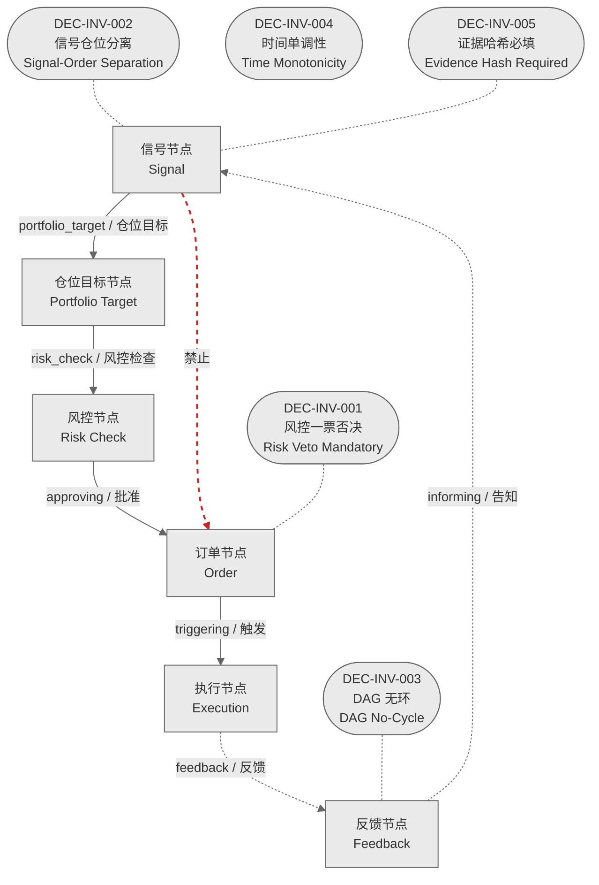

# 决策流图 · 不变量图

> 生成时间: 2026-07-30T20:58:07
> 真源: `architecture_model/domain/decision_graph_model.yaml` → PostgreSQL `decision_*` 表（TRAE-061）
> 数据库: depgraph (PostgreSQL)
> 导航: [返回主索引 decision_index.md](decision_index.md) | 辅助图

6 节点类型 + 5 承重墙不变量 + 合法/非法连接标注。

