# 决策流图 · 占位轨（Placeholder Track）

> 生成时间: 2026-07-19T06:21:57
> 真源: `architecture_model/domain/decision_graph_model.yaml` → PostgreSQL `decision_*` 表（TRAE-061）
> 数据库: depgraph (PostgreSQL)
> 导航: [返回主索引 decision_index.md](decision_index.md) | Track 99

**track_id**: `placeholder` | **优先级**: 99 | **激活条件**: -

模块全景同步占位记录（ARCH-056），模块尚未分配到真实决策轨

## 统计

| 视图 | Layer 数 | Edge 数 |
|------|----------|---------|
| 合并 | 616 | 0 |
| 设计态 | 48 | 0 |
| 运营态 | 15 | 0 |

## 合并全景图（设计态 + 运营态，标签标注 [design]/[production]）

```mermaid
flowchart TD
    subgraph track_placeholder["占位轨（Placeholder Track）"]
        LCFG_rule_enforcement_registry["[production]CFG-rule-enforcement-registry: CFG-rule-enforcement-registry<br/>蓝图: 门禁规则集 / Gate Rule Set — ARCH-052 聚合节点 production<br/>build: stable"]:::bsStable
        LCFG_rule_registry_collection["[production]CFG-rule-registry-collection: CFG-rule-registry-collection<br/>蓝图: 规则注册表集 / Rule Registry Collection — ARCH-052 聚合节点 production<br/>build: stable"]:::bsStable
        LCFG_scripts_registry["[production]CFG-scripts-registry: CFG-scripts-registry<br/>蓝图: 脚本集 / Script Collection — ARCH-052 聚合节点 production<br/>build: stable"]:::bsStable
        LCFG_test_suite_registry["[production]CFG-test-suite-registry: CFG-test-suite-registry<br/>蓝图: 测试集 / Test Suite — ARCH-052 聚合节点 production<br/>build: stable"]:::bsStable
        LINFRA_DB_001["[production]INFRA-DB-001: INFRA-DB-001<br/>蓝图: zephyr-sqlite-task-db — database 节点 (ARCH-053)<br/>build: stable"]:::bsStable
        LINFRA_DB_002["[production]INFRA-DB-002: INFRA-DB-002<br/>蓝图: zephyr-chroma-vector-db — database 节点 (ARCH-053)<br/>build: stable"]:::bsStable
        LINFRA_DB_003["[production]INFRA-DB-003: INFRA-DB-003<br/>蓝图: zephyr-depgraph-db — database 节点 (ARCH-053)<br/>build: stable"]:::bsStable
        LINFRA_DB_006["[production]INFRA-DB-006: INFRA-DB-006<br/>蓝图: zephyr-clickhouse-c1-market — database 节点 (ARCH-053)<br/>build: stable"]:::bsStable
        LMOD_ALT_DATA["[prototype]MOD-ALT_DATA: MOD-ALT_DATA<br/>蓝图: MOD-ALT_DATA<br/>build: generated"]:::bsGenerated
        LMOD_ARCH_BIZDB["[design]MOD-ARCH-BIZDB: MOD-ARCH-BIZDB<br/>build: planned"]:::bsPlanned
        LMOD_AUTONOMY_CORE["[production]MOD-AUTONOMY_CORE: MOD-AUTONOMY_CORE<br/>蓝图: MOD-AUTONOMY_CORE<br/>build: stable"]:::bsStable
        LMOD_BT_001["[design]MOD-BT-001: MOD-BT-001<br/>build: stable"]:::bsStable
        LMOD_C1_MARKETCH["[design]MOD-C1-MARKETCH: MOD-C1-MARKETCH<br/>build: planned"]:::bsPlanned
        LMOD_CONTEXT_ENGINE["[design]MOD-CONTEXT_ENGINE: MOD-CONTEXT_ENGINE<br/>build: planned"]:::bsPlanned
        LMOD_CROSS_ASSET["[design]MOD-CROSS_ASSET: MOD-CROSS_ASSET<br/>build: planned"]:::bsPlanned
        LMOD_D5_ARCH_TOOLS["[prototype]MOD-D5-ARCH-TOOLS: MOD-D5-ARCH-TOOLS<br/>蓝图: MOD-D5-ARCH-TOOLS<br/>build: generated"]:::bsGenerated
        LMOD_DATABASE["[prototype]MOD-DATABASE: MOD-DATABASE<br/>蓝图: MOD-DATABASE<br/>build: generated"]:::bsGenerated
        LMOD_DATA_ENG["[prototype]MOD-DATA_ENG: MOD-DATA_ENG<br/>蓝图: MOD-DATA_ENG<br/>build: generated"]:::bsGenerated
        LMOD_DATA_GOV["[prototype]MOD-DATA_GOV: MOD-DATA_GOV<br/>蓝图: MOD-DATA_GOV<br/>build: generated"]:::bsGenerated
        LMOD_DATA_SEC["[prototype]MOD-DATA_SEC: MOD-DATA_SEC<br/>蓝图: MOD-DATA_SEC<br/>build: generated"]:::bsGenerated
        LMOD_DIGITAL_TWIN["[design]MOD-DIGITAL_TWIN: MOD-DIGITAL_TWIN<br/>build: planned"]:::bsPlanned
        LMOD_EXEC_SIM["[prototype]MOD-EXEC_SIM: MOD-EXEC_SIM<br/>蓝图: MOD-EXEC_SIM<br/>build: generated"]:::bsGenerated
        LMOD_EX_SOR["[prototype]MOD-EX_SOR: MOD-EX_SOR<br/>蓝图: MOD-EX_SOR<br/>build: generated"]:::bsGenerated
        LMOD_FEEDBACK_LOOP["[design]MOD-FEEDBACK_LOOP: MOD-FEEDBACK_LOOP<br/>build: planned"]:::bsPlanned
        LMOD_GATE_ENGINE["[design]MOD-GATE_ENGINE: MOD-GATE_ENGINE<br/>build: planned"]:::bsPlanned
        LMOD_GOV_019["[prototype]MOD-GOV-019: MOD-GOV-019<br/>蓝图: MOD-GOV-019<br/>build: stable"]:::bsStable
        LMOD_GOV_029["[prototype]MOD-GOV-029: MOD-GOV-029<br/>蓝图: MOD-GOV-029<br/>build: generated"]:::bsGenerated
        LMOD_GOV_041["[prototype]MOD-GOV-041: MOD-GOV-041<br/>蓝图: MOD-GOV-041<br/>build: generated"]:::bsGenerated
        LMOD_GOV_ALIGN_PANORAMAS["[design]MOD-GOV-ALIGN-PANORAMAS: MOD-GOV-ALIGN-PANORAMAS<br/>build: stable"]:::bsStable
        LMOD_GOV_DOCS["[production]MOD-GOV-DOCS: MOD-GOV-DOCS<br/>蓝图: MOD-GOV-DOCS<br/>build: generated"]:::bsGenerated
        LMOD_GOV_REPAIR["[prototype]MOD-GOV-REPAIR: MOD-GOV-REPAIR<br/>蓝图: MOD-GOV-REPAIR<br/>build: generated"]:::bsGenerated
        LMOD_GOV_SCRIPTS["[prototype]MOD-GOV-SCRIPTS: MOD-GOV-SCRIPTS<br/>蓝图: MOD-GOV-SCRIPTS<br/>build: generated"]:::bsGenerated
        LMOD_GOV_SCRIPTS_ARCH["[prototype]MOD-GOV-SCRIPTS-ARCH: MOD-GOV-SCRIPTS-ARCH<br/>蓝图: MOD-GOV-SCRIPTS-ARCH<br/>build: stable"]:::bsStable
        LMOD_GOV_SYNC_PANORAMA["[prototype]MOD-GOV-SYNC-PANORAMA: MOD-GOV-SYNC-PANORAMA<br/>蓝图: MOD-GOV-SYNC-PANORAMA<br/>build: generated"]:::bsGenerated
        LMOD_GOV_arch_reference_gate["[prototype]MOD-GOV-arch_reference_gate: MOD-GOV-arch_reference_gate<br/>蓝图: MOD-GOV-arch_reference_gate<br/>build: generated"]:::bsGenerated
        LMOD_GOV_bare_getenv_gate["[prototype]MOD-GOV-bare_getenv_gate: MOD-GOV-bare_getenv_gate<br/>蓝图: MOD-GOV-bare_getenv_gate<br/>build: generated"]:::bsGenerated
        LMOD_GOV_bare_sql_gate["[prototype]MOD-GOV-bare_sql_gate: MOD-GOV-bare_sql_gate<br/>蓝图: MOD-GOV-bare_sql_gate<br/>build: generated"]:::bsGenerated
        LMOD_GOV_batched_auto_committer["[prototype]MOD-GOV-batched_auto_committer: MOD-GOV-batched_auto_committer<br/>蓝图: MOD-GOV-batched_auto_committer<br/>build: generated"]:::bsGenerated
        LMOD_GOV_blueprint_amodule_consistency_gate["[prototype]MOD-GOV-blueprint_amodule_consistency_gate: MOD-GOV-blueprint_amodule_consistency_gate<br/>蓝图: MOD-GOV-blueprint_amodule_consistency_gate<br/>build: generated"]:::bsGenerated
        LMOD_GOV_capability_overlap_gate["[prototype]MOD-GOV-capability_overlap_gate: MOD-GOV-capability_overlap_gate<br/>蓝图: MOD-GOV-capability_overlap_gate<br/>build: generated"]:::bsGenerated
        LMOD_GOV_check_vocab_hardcode["[prototype]MOD-GOV-check_vocab_hardcode: MOD-GOV-check_vocab_hardcode<br/>蓝图: MOD-GOV-check_vocab_hardcode<br/>build: generated"]:::bsGenerated
        LMOD_GOV_claim_required_gate["[prototype]MOD-GOV-claim_required_gate: MOD-GOV-claim_required_gate<br/>蓝图: MOD-GOV-claim_required_gate<br/>build: generated"]:::bsGenerated
        LMOD_GOV_commit_gate_registry["[prototype]MOD-GOV-commit_gate_registry: MOD-GOV-commit_gate_registry<br/>蓝图: MOD-GOV-commit_gate_registry<br/>build: generated"]:::bsGenerated
        LMOD_GOV_commit_gates["[prototype]MOD-GOV-commit_gates: MOD-GOV-commit_gates<br/>蓝图: MOD-GOV-commit_gates<br/>build: stable"]:::bsStable
        LMOD_GOV_create_guard["[prototype]MOD-GOV-create_guard: MOD-GOV-create_guard<br/>蓝图: MOD-GOV-create_guard<br/>build: generated"]:::bsGenerated
        LMOD_GOV_dangling_reference_gate["[prototype]MOD-GOV-dangling_reference_gate: MOD-GOV-dangling_reference_gate<br/>蓝图: MOD-GOV-dangling_reference_gate<br/>build: generated"]:::bsGenerated
        LMOD_GOV_diff_helpers["[prototype]MOD-GOV-diff_helpers: MOD-GOV-diff_helpers<br/>蓝图: MOD-GOV-diff_helpers<br/>build: generated"]:::bsGenerated
        LMOD_GOV_doc_ref_broken_gate["[prototype]MOD-GOV-doc_ref_broken_gate: MOD-GOV-doc_ref_broken_gate<br/>蓝图: MOD-GOV-doc_ref_broken_gate<br/>build: generated"]:::bsGenerated
        LMOD_GOV_domain_fk_gate["[prototype]MOD-GOV-domain_fk_gate: MOD-GOV-domain_fk_gate<br/>蓝图: MOD-GOV-domain_fk_gate<br/>build: generated"]:::bsGenerated
        LMOD_GOV_empty_handler_gate["[prototype]MOD-GOV-empty_handler_gate: MOD-GOV-empty_handler_gate<br/>蓝图: MOD-GOV-empty_handler_gate<br/>build: generated"]:::bsGenerated
        LMOD_GOV_exempt_zone_frontmatter_gate["[prototype]MOD-GOV-exempt_zone_frontmatter_gate: MOD-GOV-exempt_zone_frontmatter_gate<br/>蓝图: MOD-GOV-exempt_zone_frontmatter_gate<br/>build: generated"]:::bsGenerated
        LMOD_GOV_file_copy_gate["[prototype]MOD-GOV-file_copy_gate: MOD-GOV-file_copy_gate<br/>蓝图: MOD-GOV-file_copy_gate<br/>build: generated"]:::bsGenerated
        LMOD_GOV_function_dup_gate["[prototype]MOD-GOV-function_dup_gate: MOD-GOV-function_dup_gate<br/>蓝图: MOD-GOV-function_dup_gate<br/>build: generated"]:::bsGenerated
        LMOD_GOV_god_class_gate["[prototype]MOD-GOV-god_class_gate: MOD-GOV-god_class_gate<br/>蓝图: MOD-GOV-god_class_gate<br/>build: generated"]:::bsGenerated
        LMOD_GOV_hardcoded_url_gate["[prototype]MOD-GOV-hardcoded_url_gate: MOD-GOV-hardcoded_url_gate<br/>蓝图: MOD-GOV-hardcoded_url_gate<br/>build: generated"]:::bsGenerated
        LMOD_GOV_held_overlap_gate["[prototype]MOD-GOV-held_overlap_gate: MOD-GOV-held_overlap_gate<br/>蓝图: MOD-GOV-held_overlap_gate<br/>build: generated"]:::bsGenerated
        LMOD_GOV_high_complexity_gate["[prototype]MOD-GOV-high_complexity_gate: MOD-GOV-high_complexity_gate<br/>蓝图: MOD-GOV-high_complexity_gate<br/>build: generated"]:::bsGenerated
        LMOD_GOV_id_uniqueness_gate["[prototype]MOD-GOV-id_uniqueness_gate: MOD-GOV-id_uniqueness_gate<br/>蓝图: MOD-GOV-id_uniqueness_gate<br/>build: generated"]:::bsGenerated
        LMOD_GOV_import_direction_gate["[prototype]MOD-GOV-import_direction_gate: MOD-GOV-import_direction_gate<br/>蓝图: MOD-GOV-import_direction_gate<br/>build: generated"]:::bsGenerated
        LMOD_GOV_long_param_list_gate["[prototype]MOD-GOV-long_param_list_gate: MOD-GOV-long_param_list_gate<br/>蓝图: MOD-GOV-long_param_list_gate<br/>build: generated"]:::bsGenerated
        LMOD_GOV_migrate_metadata["[prototype]MOD-GOV-migrate_metadata: MOD-GOV-migrate_metadata<br/>蓝图: MOD-GOV-migrate_metadata<br/>build: generated"]:::bsGenerated
        LMOD_GOV_module_id_consistency_gate["[prototype]MOD-GOV-module_id_consistency_gate: MOD-GOV-module_id_consistency_gate<br/>蓝图: MOD-GOV-module_id_consistency_gate<br/>build: generated"]:::bsGenerated
        LMOD_GOV_no_import_side_effect_gate["[prototype]MOD-GOV-no_import_side_effect_gate: MOD-GOV-no_import_side_effect_gate<br/>蓝图: MOD-GOV-no_import_side_effect_gate<br/>build: generated"]:::bsGenerated
        LMOD_GOV_orphan_module_gate["[prototype]MOD-GOV-orphan_module_gate: MOD-GOV-orphan_module_gate<br/>蓝图: MOD-GOV-orphan_module_gate<br/>build: generated"]:::bsGenerated
        LMOD_GOV_panorama_alignment_gate["[prototype]MOD-GOV-panorama_alignment_gate: MOD-GOV-panorama_alignment_gate<br/>蓝图: MOD-GOV-panorama_alignment_gate<br/>build: generated"]:::bsGenerated
        LMOD_GOV_perm_trigger_gate["[prototype]MOD-GOV-perm_trigger_gate: MOD-GOV-perm_trigger_gate<br/>蓝图: MOD-GOV-perm_trigger_gate<br/>build: generated"]:::bsGenerated
        LMOD_GOV_pre_write_gate["[prototype]MOD-GOV-pre_write_gate: MOD-GOV-pre_write_gate<br/>蓝图: MOD-GOV-pre_write_gate<br/>build: generated"]:::bsGenerated
        LMOD_GOV_r5_digit_suffix_gate["[prototype]MOD-GOV-r5_digit_suffix_gate: MOD-GOV-r5_digit_suffix_gate<br/>蓝图: MOD-GOV-r5_digit_suffix_gate<br/>build: generated"]:::bsGenerated
        LMOD_GOV_reconciliation_registry["[prototype]MOD-GOV-reconciliation_registry: MOD-GOV-reconciliation_registry<br/>蓝图: MOD-GOV-reconciliation_registry<br/>build: stable"]:::bsStable
        LMOD_GOV_rename_depgraph_sync_gate["[prototype]MOD-GOV-rename_depgraph_sync_gate: MOD-GOV-rename_depgraph_sync_gate<br/>蓝图: MOD-GOV-rename_depgraph_sync_gate<br/>build: generated"]:::bsGenerated
        LMOD_GOV_rule_four_way_alignment_gate["[prototype]MOD-GOV-rule_four_way_alignment_gate: MOD-GOV-rule_four_way_alignment_gate<br/>蓝图: MOD-GOV-rule_four_way_alignment_gate<br/>build: generated"]:::bsGenerated
        LMOD_GOV_rule_patterns["[prototype]MOD-GOV-rule_patterns: MOD-GOV-rule_patterns<br/>蓝图: MOD-GOV-rule_patterns<br/>build: stable"]:::bsStable
        LMOD_GOV_ruling_reference_gate["[prototype]MOD-GOV-ruling_reference_gate: MOD-GOV-ruling_reference_gate<br/>蓝图: MOD-GOV-ruling_reference_gate<br/>build: generated"]:::bsGenerated
        LMOD_GOV_session_claim["[prototype]MOD-GOV-session_claim: MOD-GOV-session_claim<br/>蓝图: MOD-GOV-session_claim<br/>build: generated"]:::bsGenerated
        LMOD_GOV_session_required_gate["[prototype]MOD-GOV-session_required_gate: MOD-GOV-session_required_gate<br/>蓝图: MOD-GOV-session_required_gate<br/>build: generated"]:::bsGenerated
        LMOD_GOV_session_worktree["[prototype]MOD-GOV-session_worktree: MOD-GOV-session_worktree<br/>蓝图: MOD-GOV-session_worktree<br/>build: stable"]:::bsStable
        LMOD_GOV_ssot_redefinition_gate["[prototype]MOD-GOV-ssot_redefinition_gate: MOD-GOV-ssot_redefinition_gate<br/>蓝图: MOD-GOV-ssot_redefinition_gate<br/>build: generated"]:::bsGenerated
        LMOD_GOV_test_source_consistency_gate["[prototype]MOD-GOV-test_source_consistency_gate: MOD-GOV-test_source_consistency_gate<br/>蓝图: MOD-GOV-test_source_consistency_gate<br/>build: generated"]:::bsGenerated
        LMOD_GOV_vocab_hardcode_gate["[prototype]MOD-GOV-vocab_hardcode_gate: MOD-GOV-vocab_hardcode_gate<br/>蓝图: MOD-GOV-vocab_hardcode_gate<br/>build: generated"]:::bsGenerated
        LMOD_GOV_worktree_manager["[production]MOD-GOV-worktree_manager: MOD-GOV-worktree_manager<br/>蓝图: MOD-GOV-worktree_manager<br/>build: stable"]:::bsStable
        LMOD_GOVERNANCE["[design]MOD-GOVERNANCE: MOD-GOVERNANCE<br/>build: generated"]:::bsGenerated
        LMOD_GOV_COMMON["[prototype]MOD-GOV_COMMON: MOD-GOV_COMMON<br/>蓝图: MOD-GOV_COMMON<br/>build: generated"]:::bsGenerated
        LMOD_GOV_DATAFLOW_DIAGRAM["[prototype]MOD-GOV_DATAFLOW_DIAGRAM: MOD-GOV_DATAFLOW_DIAGRAM<br/>蓝图: MOD-GOV_DATAFLOW_DIAGRAM<br/>build: generated"]:::bsGenerated
        LMOD_GOV_DQ["[prototype]MOD-GOV_DQ: MOD-GOV_DQ<br/>蓝图: MOD-GOV_DQ<br/>build: generated"]:::bsGenerated
        LMOD_GOV_ENFORCEMENT["[prototype]MOD-GOV_ENFORCEMENT: MOD-GOV_ENFORCEMENT<br/>蓝图: MOD-GOV_ENFORCEMENT<br/>build: generated"]:::bsGenerated
        LMOD_GOV_ENFORCEMENT_worktree_pool["[design]MOD-GOV_ENFORCEMENT_worktree_pool: MOD-GOV_ENFORCEMENT_worktree_pool<br/>build: planned"]:::bsPlanned
        LMOD_GOV_GATE_CACHE["[prototype]MOD-GOV_GATE_CACHE: MOD-GOV_GATE_CACHE<br/>蓝图: MOD-GOV_GATE_CACHE<br/>build: generated"]:::bsGenerated
        LMOD_GOV_HEALTH_SMOKE["[prototype]MOD-GOV_HEALTH_SMOKE: MOD-GOV_HEALTH_SMOKE<br/>蓝图: MOD-GOV_HEALTH_SMOKE<br/>build: generated"]:::bsGenerated
        LMOD_GOV_behavioral_admission["[prototype]MOD-GOV_behavioral_admission: MOD-GOV_behavioral_admission<br/>蓝图: MOD-GOV_behavioral_admission<br/>build: generated"]:::bsGenerated
        LMOD_GOV_code_quality_domain["[prototype]MOD-GOV_code_quality_domain: MOD-GOV_code_quality_domain<br/>蓝图: MOD-GOV_code_quality_domain<br/>build: generated"]:::bsGenerated
        LMOD_GOV_commit_gates["[production]MOD-GOV_commit_gates: MOD-GOV_commit_gates<br/>蓝图: MOD-GOV_commit_gates<br/>build: stable"]:::bsStable
        LMOD_GOV_resilience_governance["[prototype]MOD-GOV_resilience_governance: MOD-GOV_resilience_governance<br/>蓝图: MOD-GOV_resilience_governance<br/>build: generated"]:::bsGenerated
        LMOD_GOV_rule_domain["[prototype]MOD-GOV_rule_domain: MOD-GOV_rule_domain<br/>蓝图: MOD-GOV_rule_domain<br/>build: generated"]:::bsGenerated
        LMOD_GOV_security_governance["[prototype]MOD-GOV_security_governance: MOD-GOV_security_governance<br/>蓝图: MOD-GOV_security_governance<br/>build: generated"]:::bsGenerated
        LMOD_INF_001["[prototype]MOD-INF-001: MOD-INF-001<br/>蓝图: MOD-INF-001<br/>build: generated"]:::bsGenerated
        LMOD_INF_002["[prototype]MOD-INF-002: MOD-INF-002<br/>蓝图: MOD-INF-002<br/>build: generated"]:::bsGenerated
        LMOD_INF_003["[prototype]MOD-INF-003: MOD-INF-003<br/>蓝图: MOD-INF-003<br/>build: generated"]:::bsGenerated
        LMOD_INF_005["[design]MOD-INF-005: MOD-INF-005<br/>build: planned"]:::bsPlanned
        LMOD_INF_009["[design]MOD-INF-009: MOD-INF-009<br/>build: planned"]:::bsPlanned
        LMOD_INF_011["[design]MOD-INF-011: MOD-INF-011<br/>build: planned"]:::bsPlanned
        LMOD_INF_013["[prototype]MOD-INF-013: MOD-INF-013<br/>蓝图: MOD-INF-013<br/>build: generated"]:::bsGenerated
        LMOD_INF_014["[production]MOD-INF-014: MOD-INF-014<br/>蓝图: MOD-INF-014<br/>build: stable"]:::bsStable
        LMOD_INF_015["[prototype]MOD-INF-015: MOD-INF-015<br/>蓝图: MOD-INF-015<br/>build: stable"]:::bsStable
        LMOD_INF_016["[design]MOD-INF-016: MOD-INF-016<br/>build: planned"]:::bsPlanned
        LMOD_INF_017["[design]MOD-INF-017: MOD-INF-017<br/>build: planned"]:::bsPlanned
        LMOD_INF_018["[prototype]MOD-INF-018: MOD-INF-018<br/>蓝图: MOD-INF-018<br/>build: generated"]:::bsGenerated
        LMOD_INF_019["[design]MOD-INF-019: MOD-INF-019<br/>build: planned"]:::bsPlanned
        LMOD_INF_020["[design]MOD-INF-020: MOD-INF-020<br/>build: planned"]:::bsPlanned
        LMOD_INF_021["[design]MOD-INF-021: MOD-INF-021<br/>build: planned"]:::bsPlanned
        LMOD_INF_022["[design]MOD-INF-022: MOD-INF-022<br/>build: planned"]:::bsPlanned
        LMOD_INF_023["[design]MOD-INF-023: MOD-INF-023<br/>build: planned"]:::bsPlanned
        LMOD_INF_024["[design]MOD-INF-024: MOD-INF-024<br/>build: generated"]:::bsGenerated
        LMOD_INF_025["[prototype]MOD-INF-025: MOD-INF-025<br/>蓝图: MOD-INF-025<br/>build: generated"]:::bsGenerated
        LMOD_INF_026["[prototype]MOD-INF-026: MOD-INF-026<br/>蓝图: MOD-INF-026<br/>build: stable"]:::bsStable
        LMOD_INF_027["[design]MOD-INF-027: MOD-INF-027<br/>build: planned"]:::bsPlanned
        LMOD_INF_028["[design]MOD-INF-028: MOD-INF-028<br/>build: planned"]:::bsPlanned
        LMOD_INF_029["[design]MOD-INF-029: MOD-INF-029<br/>build: planned"]:::bsPlanned
        LMOD_INF_030["[design]MOD-INF-030: MOD-INF-030<br/>build: planned"]:::bsPlanned
        LMOD_INF_031["[design]MOD-INF-031: MOD-INF-031<br/>build: planned"]:::bsPlanned
        LMOD_INF_033["[design]MOD-INF-033: MOD-INF-033<br/>build: planned"]:::bsPlanned
        LMOD_INF_034["[design]MOD-INF-034: MOD-INF-034<br/>build: planned"]:::bsPlanned
        LMOD_INF_035["[prototype]MOD-INF-035: MOD-INF-035<br/>蓝图: MOD-INF-035<br/>build: generated"]:::bsGenerated
        LMOD_INF_036["[design]MOD-INF-036: MOD-INF-036<br/>build: planned"]:::bsPlanned
        LMOD_INF_037["[design]MOD-INF-037: MOD-INF-037<br/>build: generated"]:::bsGenerated
        LMOD_INF_038["[prototype]MOD-INF-038: MOD-INF-038<br/>蓝图: MOD-INF-038<br/>build: generated"]:::bsGenerated
        LMOD_INF_039["[design]MOD-INF-039: MOD-INF-039<br/>build: planned"]:::bsPlanned
        LMOD_INF_040["[prototype]MOD-INF-040: MOD-INF-040<br/>蓝图: MOD-INF-040<br/>build: generated"]:::bsGenerated
        LMOD_INF_042["[prototype]MOD-INF-042: MOD-INF-042<br/>蓝图: MOD-INF-042<br/>build: generated"]:::bsGenerated
        LMOD_INF_043["[prototype]MOD-INF-043: MOD-INF-043<br/>蓝图: MOD-INF-043<br/>build: generated"]:::bsGenerated
        LMOD_INF_GOV["[prototype]MOD-INF-GOV: MOD-INF-GOV<br/>蓝图: MOD-INF-GOV<br/>build: generated"]:::bsGenerated
        LMOD_INFRA_OPS["[design]MOD-INFRA_OPS: MOD-INFRA_OPS<br/>build: planned"]:::bsPlanned
        LMOD_INFRA_RUNTIME["[prototype]MOD-INFRA_RUNTIME: MOD-INFRA_RUNTIME<br/>蓝图: MOD-INFRA_RUNTIME<br/>build: generated"]:::bsGenerated
        LMOD_INTEGRATION["[prototype]MOD-INTEGRATION: MOD-INTEGRATION<br/>蓝图: MOD-INTEGRATION<br/>build: generated"]:::bsGenerated
        LMOD_KB_001["[production]MOD-KB-001: MOD-KB-001<br/>蓝图: MOD-KB-001<br/>build: stable"]:::bsStable
        LMOD_L00_001["[design]MOD-L00-001: MOD-L00-001<br/>build: generated"]:::bsGenerated
        LMOD_L00_002["[design]MOD-L00-002: MOD-L00-002<br/>build: stable"]:::bsStable
        LMOD_L00_003["[design]MOD-L00-003: MOD-L00-003<br/>build: stable"]:::bsStable
        LMOD_L00_004["[prototype]MOD-L00-004: MOD-L00-004<br/>蓝图: MOD-L00-004<br/>build: generated"]:::bsGenerated
        LMOD_L02_001["[prototype]MOD-L02-001: MOD-L02-001<br/>蓝图: MOD-L02-001<br/>build: stable"]:::bsStable
        LMOD_L03_001["[prototype]MOD-L03-001: MOD-L03-001<br/>蓝图: MOD-L03-001<br/>build: generated"]:::bsGenerated
        LMOD_L04_001["[prototype]MOD-L04-001: MOD-L04-001<br/>蓝图: MOD-L04-001<br/>build: generated"]:::bsGenerated
        LMOD_L05_001["[prototype]MOD-L05-001: MOD-L05-001<br/>蓝图: MOD-L05-001<br/>build: stable"]:::bsStable
        LMOD_L06_001["[design]MOD-L06-001: MOD-L06-001<br/>build: stable"]:::bsStable
        LMOD_L07_001["[prototype]MOD-L07-001: MOD-L07-001<br/>蓝图: MOD-L07-001<br/>build: generated"]:::bsGenerated
        LMOD_L08_001["[design]MOD-L08-001: MOD-L08-001<br/>build: generated"]:::bsGenerated
        LMOD_L09_001["[prototype]MOD-L09-001: MOD-L09-001<br/>蓝图: MOD-L09-001<br/>build: generated"]:::bsGenerated
        LMOD_L10_001["[prototype]MOD-L10-001: MOD-L10-001<br/>蓝图: MOD-L10-001<br/>build: generated"]:::bsGenerated
        LMOD_L11_001["[prototype]MOD-L11-001: MOD-L11-001<br/>蓝图: MOD-L11-001<br/>build: generated"]:::bsGenerated
        LMOD_L13_001["[prototype]MOD-L13-001: MOD-L13-001<br/>蓝图: MOD-L13-001<br/>build: generated"]:::bsGenerated
        LMOD_LLM_SECURITY["[prototype]MOD-LLM_SECURITY: MOD-LLM_SECURITY<br/>蓝图: MOD-LLM_SECURITY<br/>build: stable"]:::bsStable
        LMOD_MASTER_001["[design]MOD-MASTER-001: MOD-MASTER-001<br/>build: stable"]:::bsStable
        LMOD_MASTER_002["[design]MOD-MASTER-002: MOD-MASTER-002<br/>build: stable"]:::bsStable
        LMOD_MASTER_003["[design]MOD-MASTER-003: MOD-MASTER-003<br/>build: planned"]:::bsPlanned
        LMOD_MASTER_BLUEPRINT["[design]MOD-MASTER_BLUEPRINT: MOD-MASTER_BLUEPRINT<br/>build: deprecated"]:::bsDeprecated
        LMOD_MKT_DATA["[prototype]MOD-MKT_DATA: MOD-MKT_DATA<br/>蓝图: MOD-MKT_DATA<br/>build: generated"]:::bsGenerated
        LMOD_ML_SERVE["[prototype]MOD-ML_SERVE: MOD-ML_SERVE<br/>蓝图: MOD-ML_SERVE<br/>build: generated"]:::bsGenerated
        LMOD_PF_ALLOC["[design]MOD-PF_ALLOC: MOD-PF_ALLOC<br/>build: planned"]:::bsPlanned
        LMOD_REMEDIATION_PROGRESS["[prototype]MOD-REMEDIATION_PROGRESS: MOD-REMEDIATION_PROGRESS<br/>蓝图: MOD-REMEDIATION_PROGRESS<br/>build: generated"]:::bsGenerated
        LMOD_REMEDIATION_PROGRESS_SMOKE["[prototype]MOD-REMEDIATION_PROGRESS_SMOKE: MOD-REMEDIATION_PROGRESS_SMOKE<br/>蓝图: MOD-REMEDIATION_PROGRESS_SMOKE<br/>build: generated"]:::bsGenerated
        LMOD_RESOURCE_OPTIMIZATION_ENGINE["[design]MOD-RESOURCE_OPTIMIZATION_ENGINE: MOD-RESOURCE_OPTIMIZATION_ENGINE<br/>build: planned"]:::bsPlanned
        LMOD_RULE_ENGINE["[prototype]MOD-RULE_ENGINE: MOD-RULE_ENGINE<br/>蓝图: MOD-RULE_ENGINE<br/>build: generated"]:::bsGenerated
        LMOD_SEC_030["[prototype]MOD-SEC-030: MOD-SEC-030<br/>蓝图: MOD-SEC-030<br/>build: generated"]:::bsGenerated
        LMOD_SEC_immutable_core["[production]MOD-SEC-immutable_core: MOD-SEC-immutable_core<br/>蓝图: MOD-SEC-immutable_core<br/>build: generated"]:::bsGenerated
        LMOD_SELL_DECISION["[prototype]MOD-SELL_DECISION: MOD-SELL_DECISION<br/>蓝图: MOD-SELL_DECISION<br/>build: generated"]:::bsGenerated
        LMOD_SHARED_001["[prototype]MOD-SHARED-001: MOD-SHARED-001<br/>蓝图: MOD-SHARED-001<br/>build: generated"]:::bsGenerated
        LMOD_SHARED_002["[prototype]MOD-SHARED-002: MOD-SHARED-002<br/>蓝图: MOD-SHARED-002<br/>build: generated"]:::bsGenerated
        LMOD_SHR_io_yaml["[prototype]MOD-SHR-io-yaml: MOD-SHR-io-yaml<br/>蓝图: MOD-SHR-io-yaml<br/>build: generated"]:::bsGenerated
        LMOD_SIGNAL_ASHARE["[prototype]MOD-SIGNAL_ASHARE: MOD-SIGNAL_ASHARE<br/>蓝图: MOD-SIGNAL_ASHARE<br/>build: generated"]:::bsGenerated
        LMOD_SIGQC_001["[prototype]MOD-SIGQC-001: MOD-SIGQC-001<br/>蓝图: MOD-SIGQC-001<br/>build: generated"]:::bsGenerated
        LMOD_SIMULATION["[design]MOD-SIMULATION: MOD-SIMULATION<br/>build: planned"]:::bsPlanned
        LMOD_TASK_SYSTEM["[prototype]MOD-TASK_SYSTEM: MOD-TASK_SYSTEM<br/>蓝图: MOD-TASK_SYSTEM<br/>build: generated"]:::bsGenerated
        LMOD_TEST_202["[prototype]MOD-TEST-202: MOD-TEST-202<br/>蓝图: MOD-TEST-202<br/>build: generated"]:::bsGenerated
        LMOD_TEST_203["[prototype]MOD-TEST-203: MOD-TEST-203<br/>蓝图: MOD-TEST-203<br/>build: generated"]:::bsGenerated
        LMOD_TEST_204["[prototype]MOD-TEST-204: MOD-TEST-204<br/>蓝图: MOD-TEST-204<br/>build: generated"]:::bsGenerated
        LMOD_TEST_205["[prototype]MOD-TEST-205: MOD-TEST-205<br/>蓝图: MOD-TEST-205<br/>build: generated"]:::bsGenerated
        LMOD_TEST_206["[prototype]MOD-TEST-206: MOD-TEST-206<br/>蓝图: MOD-TEST-206<br/>build: generated"]:::bsGenerated
        LMOD_TEST_210["[prototype]MOD-TEST-210: MOD-TEST-210<br/>蓝图: MOD-TEST-210<br/>build: generated"]:::bsGenerated
        LMOD_TEST_211["[prototype]MOD-TEST-211: MOD-TEST-211<br/>蓝图: MOD-TEST-211<br/>build: generated"]:::bsGenerated
        LMOD_TEST_212["[prototype]MOD-TEST-212: MOD-TEST-212<br/>蓝图: MOD-TEST-212<br/>build: generated"]:::bsGenerated
        LMOD_TEST_213["[prototype]MOD-TEST-213: MOD-TEST-213<br/>蓝图: MOD-TEST-213<br/>build: generated"]:::bsGenerated
        LMOD_TEST_215["[prototype]MOD-TEST-215: MOD-TEST-215<br/>蓝图: MOD-TEST-215<br/>build: generated"]:::bsGenerated
        LMOD_TEST_216["[prototype]MOD-TEST-216: MOD-TEST-216<br/>蓝图: MOD-TEST-216<br/>build: generated"]:::bsGenerated
        LMOD_TEST_217["[prototype]MOD-TEST-217: MOD-TEST-217<br/>蓝图: MOD-TEST-217<br/>build: generated"]:::bsGenerated
        LMOD_TEST_218["[prototype]MOD-TEST-218: MOD-TEST-218<br/>蓝图: MOD-TEST-218<br/>build: generated"]:::bsGenerated
        LMOD_TEST_219["[prototype]MOD-TEST-219: MOD-TEST-219<br/>蓝图: MOD-TEST-219<br/>build: generated"]:::bsGenerated
        LMOD_TEST_220["[prototype]MOD-TEST-220: MOD-TEST-220<br/>蓝图: MOD-TEST-220<br/>build: generated"]:::bsGenerated
        LMOD_TEST_221["[prototype]MOD-TEST-221: MOD-TEST-221<br/>蓝图: MOD-TEST-221<br/>build: generated"]:::bsGenerated
        LMOD_TEST_222["[prototype]MOD-TEST-222: MOD-TEST-222<br/>蓝图: MOD-TEST-222<br/>build: generated"]:::bsGenerated
        LMOD_TEST_223["[prototype]MOD-TEST-223: MOD-TEST-223<br/>蓝图: MOD-TEST-223<br/>build: generated"]:::bsGenerated
        LMOD_TEST_224["[prototype]MOD-TEST-224: MOD-TEST-224<br/>蓝图: MOD-TEST-224<br/>build: generated"]:::bsGenerated
        LMOD_TEST_225["[prototype]MOD-TEST-225: MOD-TEST-225<br/>蓝图: MOD-TEST-225<br/>build: generated"]:::bsGenerated
        LMOD_TEST_226["[prototype]MOD-TEST-226: MOD-TEST-226<br/>蓝图: MOD-TEST-226<br/>build: generated"]:::bsGenerated
        LMOD_TEST_227["[prototype]MOD-TEST-227: MOD-TEST-227<br/>蓝图: MOD-TEST-227<br/>build: generated"]:::bsGenerated
        LMOD_TEST_228["[prototype]MOD-TEST-228: MOD-TEST-228<br/>蓝图: MOD-TEST-228<br/>build: generated"]:::bsGenerated
        LMOD_TEST_229["[prototype]MOD-TEST-229: MOD-TEST-229<br/>蓝图: MOD-TEST-229<br/>build: generated"]:::bsGenerated
        LMOD_TEST_230["[prototype]MOD-TEST-230: MOD-TEST-230<br/>蓝图: MOD-TEST-230<br/>build: generated"]:::bsGenerated
        LMOD_TEST_231["[prototype]MOD-TEST-231: MOD-TEST-231<br/>蓝图: MOD-TEST-231<br/>build: generated"]:::bsGenerated
        LMOD_TEST_232["[prototype]MOD-TEST-232: MOD-TEST-232<br/>蓝图: MOD-TEST-232<br/>build: generated"]:::bsGenerated
        LMOD_TEST_233["[prototype]MOD-TEST-233: MOD-TEST-233<br/>蓝图: MOD-TEST-233<br/>build: generated"]:::bsGenerated
        LMOD_TEST_234["[prototype]MOD-TEST-234: MOD-TEST-234<br/>蓝图: MOD-TEST-234<br/>build: generated"]:::bsGenerated
        LMOD_TEST_235["[prototype]MOD-TEST-235: MOD-TEST-235<br/>蓝图: MOD-TEST-235<br/>build: generated"]:::bsGenerated
        LMOD_TEST_236["[prototype]MOD-TEST-236: MOD-TEST-236<br/>蓝图: MOD-TEST-236<br/>build: generated"]:::bsGenerated
        LMOD_TEST_237["[prototype]MOD-TEST-237: MOD-TEST-237<br/>蓝图: MOD-TEST-237<br/>build: generated"]:::bsGenerated
        LMOD_TEST_238["[prototype]MOD-TEST-238: MOD-TEST-238<br/>蓝图: MOD-TEST-238<br/>build: generated"]:::bsGenerated
        LMOD_TEST_239["[prototype]MOD-TEST-239: MOD-TEST-239<br/>蓝图: MOD-TEST-239<br/>build: generated"]:::bsGenerated
        LMOD_TEST_240["[prototype]MOD-TEST-240: MOD-TEST-240<br/>蓝图: MOD-TEST-240<br/>build: generated"]:::bsGenerated
        LMOD_TEST_241["[prototype]MOD-TEST-241: MOD-TEST-241<br/>蓝图: MOD-TEST-241<br/>build: generated"]:::bsGenerated
        LMOD_TEST_242["[prototype]MOD-TEST-242: MOD-TEST-242<br/>蓝图: MOD-TEST-242<br/>build: generated"]:::bsGenerated
        LMOD_TEST_246["[prototype]MOD-TEST-246: MOD-TEST-246<br/>蓝图: MOD-TEST-246<br/>build: generated"]:::bsGenerated
        LMOD_TEST_247["[prototype]MOD-TEST-247: MOD-TEST-247<br/>蓝图: MOD-TEST-247<br/>build: generated"]:::bsGenerated
        LMOD_TEST_248["[prototype]MOD-TEST-248: MOD-TEST-248<br/>蓝图: MOD-TEST-248<br/>build: generated"]:::bsGenerated
        LMOD_TEST_250["[prototype]MOD-TEST-250: MOD-TEST-250<br/>蓝图: MOD-TEST-250<br/>build: generated"]:::bsGenerated
        LMOD_TEST_251["[prototype]MOD-TEST-251: MOD-TEST-251<br/>蓝图: MOD-TEST-251<br/>build: generated"]:::bsGenerated
        LMOD_TEST_252["[prototype]MOD-TEST-252: MOD-TEST-252<br/>蓝图: MOD-TEST-252<br/>build: generated"]:::bsGenerated
        LMOD_TEST_253["[prototype]MOD-TEST-253: MOD-TEST-253<br/>蓝图: MOD-TEST-253<br/>build: generated"]:::bsGenerated
        LMOD_TEST_254["[prototype]MOD-TEST-254: MOD-TEST-254<br/>蓝图: MOD-TEST-254<br/>build: generated"]:::bsGenerated
        LMOD_TEST_255["[prototype]MOD-TEST-255: MOD-TEST-255<br/>蓝图: MOD-TEST-255<br/>build: generated"]:::bsGenerated
        LMOD_TEST_256["[prototype]MOD-TEST-256: MOD-TEST-256<br/>蓝图: MOD-TEST-256<br/>build: generated"]:::bsGenerated
        LMOD_TEST_257["[prototype]MOD-TEST-257: MOD-TEST-257<br/>蓝图: MOD-TEST-257<br/>build: generated"]:::bsGenerated
        LMOD_TEST_258["[prototype]MOD-TEST-258: MOD-TEST-258<br/>蓝图: MOD-TEST-258<br/>build: generated"]:::bsGenerated
        LMOD_TEST_259["[prototype]MOD-TEST-259: MOD-TEST-259<br/>蓝图: MOD-TEST-259<br/>build: generated"]:::bsGenerated
        LMOD_TEST_260["[prototype]MOD-TEST-260: MOD-TEST-260<br/>蓝图: MOD-TEST-260<br/>build: generated"]:::bsGenerated
        LMOD_TEST_261["[prototype]MOD-TEST-261: MOD-TEST-261<br/>蓝图: MOD-TEST-261<br/>build: generated"]:::bsGenerated
        LMOD_TEST_262["[prototype]MOD-TEST-262: MOD-TEST-262<br/>蓝图: MOD-TEST-262<br/>build: generated"]:::bsGenerated
        LMOD_TEST_263["[prototype]MOD-TEST-263: MOD-TEST-263<br/>蓝图: MOD-TEST-263<br/>build: generated"]:::bsGenerated
        LMOD_TEST_264["[prototype]MOD-TEST-264: MOD-TEST-264<br/>蓝图: MOD-TEST-264<br/>build: generated"]:::bsGenerated
        LMOD_TEST_265["[prototype]MOD-TEST-265: MOD-TEST-265<br/>蓝图: MOD-TEST-265<br/>build: generated"]:::bsGenerated
        LMOD_TEST_266["[prototype]MOD-TEST-266: MOD-TEST-266<br/>蓝图: MOD-TEST-266<br/>build: generated"]:::bsGenerated
        LMOD_TEST_267["[prototype]MOD-TEST-267: MOD-TEST-267<br/>蓝图: MOD-TEST-267<br/>build: generated"]:::bsGenerated
        LMOD_TEST_268["[prototype]MOD-TEST-268: MOD-TEST-268<br/>蓝图: MOD-TEST-268<br/>build: generated"]:::bsGenerated
        LMOD_TEST_272["[prototype]MOD-TEST-272: MOD-TEST-272<br/>蓝图: MOD-TEST-272<br/>build: generated"]:::bsGenerated
        LMOD_TEST_273["[prototype]MOD-TEST-273: MOD-TEST-273<br/>蓝图: MOD-TEST-273<br/>build: generated"]:::bsGenerated
        LMOD_TEST_274["[prototype]MOD-TEST-274: MOD-TEST-274<br/>蓝图: MOD-TEST-274<br/>build: generated"]:::bsGenerated
        LMOD_TEST_275["[prototype]MOD-TEST-275: MOD-TEST-275<br/>蓝图: MOD-TEST-275<br/>build: generated"]:::bsGenerated
        LMOD_TEST_276["[prototype]MOD-TEST-276: MOD-TEST-276<br/>蓝图: MOD-TEST-276<br/>build: generated"]:::bsGenerated
        LMOD_TEST_277["[prototype]MOD-TEST-277: MOD-TEST-277<br/>蓝图: MOD-TEST-277<br/>build: generated"]:::bsGenerated
        LMOD_TEST_278["[prototype]MOD-TEST-278: MOD-TEST-278<br/>蓝图: MOD-TEST-278<br/>build: generated"]:::bsGenerated
        LMOD_TEST_279["[prototype]MOD-TEST-279: MOD-TEST-279<br/>蓝图: MOD-TEST-279<br/>build: generated"]:::bsGenerated
        LMOD_TEST_280["[prototype]MOD-TEST-280: MOD-TEST-280<br/>蓝图: MOD-TEST-280<br/>build: generated"]:::bsGenerated
        LMOD_TEST_281["[prototype]MOD-TEST-281: MOD-TEST-281<br/>蓝图: MOD-TEST-281<br/>build: generated"]:::bsGenerated
        LMOD_TEST_282["[prototype]MOD-TEST-282: MOD-TEST-282<br/>蓝图: MOD-TEST-282<br/>build: generated"]:::bsGenerated
        LMOD_TEST_283["[prototype]MOD-TEST-283: MOD-TEST-283<br/>蓝图: MOD-TEST-283<br/>build: generated"]:::bsGenerated
        LMOD_TEST_284["[prototype]MOD-TEST-284: MOD-TEST-284<br/>蓝图: MOD-TEST-284<br/>build: generated"]:::bsGenerated
        LMOD_TEST_285["[prototype]MOD-TEST-285: MOD-TEST-285<br/>蓝图: MOD-TEST-285<br/>build: generated"]:::bsGenerated
        LMOD_TEST_286["[prototype]MOD-TEST-286: MOD-TEST-286<br/>蓝图: MOD-TEST-286<br/>build: generated"]:::bsGenerated
        LMOD_TEST_287["[prototype]MOD-TEST-287: MOD-TEST-287<br/>蓝图: MOD-TEST-287<br/>build: generated"]:::bsGenerated
        LMOD_TEST_288["[prototype]MOD-TEST-288: MOD-TEST-288<br/>蓝图: MOD-TEST-288<br/>build: generated"]:::bsGenerated
        LMOD_TEST_289["[prototype]MOD-TEST-289: MOD-TEST-289<br/>蓝图: MOD-TEST-289<br/>build: generated"]:::bsGenerated
        LMOD_TEST_290["[prototype]MOD-TEST-290: MOD-TEST-290<br/>蓝图: MOD-TEST-290<br/>build: generated"]:::bsGenerated
        LMOD_TEST_291["[prototype]MOD-TEST-291: MOD-TEST-291<br/>蓝图: MOD-TEST-291<br/>build: generated"]:::bsGenerated
        LMOD_TEST_292["[prototype]MOD-TEST-292: MOD-TEST-292<br/>蓝图: MOD-TEST-292<br/>build: generated"]:::bsGenerated
        LMOD_TEST_293["[prototype]MOD-TEST-293: MOD-TEST-293<br/>蓝图: MOD-TEST-293<br/>build: generated"]:::bsGenerated
        LMOD_TEST_294["[prototype]MOD-TEST-294: MOD-TEST-294<br/>蓝图: MOD-TEST-294<br/>build: generated"]:::bsGenerated
        LMOD_TEST_295["[prototype]MOD-TEST-295: MOD-TEST-295<br/>蓝图: MOD-TEST-295<br/>build: generated"]:::bsGenerated
        LMOD_TEST_296["[prototype]MOD-TEST-296: MOD-TEST-296<br/>蓝图: MOD-TEST-296<br/>build: generated"]:::bsGenerated
        LMOD_TEST_297["[prototype]MOD-TEST-297: MOD-TEST-297<br/>蓝图: MOD-TEST-297<br/>build: generated"]:::bsGenerated
        LMOD_TEST_298["[prototype]MOD-TEST-298: MOD-TEST-298<br/>蓝图: MOD-TEST-298<br/>build: generated"]:::bsGenerated
        LMOD_TEST_299["[prototype]MOD-TEST-299: MOD-TEST-299<br/>蓝图: MOD-TEST-299<br/>build: generated"]:::bsGenerated
        LMOD_TEST_300["[prototype]MOD-TEST-300: MOD-TEST-300<br/>蓝图: MOD-TEST-300<br/>build: generated"]:::bsGenerated
        LMOD_TEST_301["[prototype]MOD-TEST-301: MOD-TEST-301<br/>蓝图: MOD-TEST-301<br/>build: generated"]:::bsGenerated
        LMOD_TEST_302["[prototype]MOD-TEST-302: MOD-TEST-302<br/>蓝图: MOD-TEST-302<br/>build: generated"]:::bsGenerated
        LMOD_TEST_303["[prototype]MOD-TEST-303: MOD-TEST-303<br/>蓝图: MOD-TEST-303<br/>build: generated"]:::bsGenerated
        LMOD_TEST_304["[prototype]MOD-TEST-304: MOD-TEST-304<br/>蓝图: MOD-TEST-304<br/>build: generated"]:::bsGenerated
        LMOD_TEST_305["[prototype]MOD-TEST-305: MOD-TEST-305<br/>蓝图: MOD-TEST-305<br/>build: generated"]:::bsGenerated
        LMOD_TEST_306["[prototype]MOD-TEST-306: MOD-TEST-306<br/>蓝图: MOD-TEST-306<br/>build: generated"]:::bsGenerated
        LMOD_TEST_307["[prototype]MOD-TEST-307: MOD-TEST-307<br/>蓝图: MOD-TEST-307<br/>build: generated"]:::bsGenerated
        LMOD_TEST_308["[prototype]MOD-TEST-308: MOD-TEST-308<br/>蓝图: MOD-TEST-308<br/>build: generated"]:::bsGenerated
        LMOD_TEST_309["[prototype]MOD-TEST-309: MOD-TEST-309<br/>蓝图: MOD-TEST-309<br/>build: generated"]:::bsGenerated
        LMOD_TEST_310["[prototype]MOD-TEST-310: MOD-TEST-310<br/>蓝图: MOD-TEST-310<br/>build: generated"]:::bsGenerated
        LMOD_TEST_311["[prototype]MOD-TEST-311: MOD-TEST-311<br/>蓝图: MOD-TEST-311<br/>build: generated"]:::bsGenerated
        LMOD_TEST_312["[prototype]MOD-TEST-312: MOD-TEST-312<br/>蓝图: MOD-TEST-312<br/>build: generated"]:::bsGenerated
        LMOD_TEST_313["[prototype]MOD-TEST-313: MOD-TEST-313<br/>蓝图: MOD-TEST-313<br/>build: generated"]:::bsGenerated
        LMOD_TEST_314["[prototype]MOD-TEST-314: MOD-TEST-314<br/>蓝图: MOD-TEST-314<br/>build: generated"]:::bsGenerated
        LMOD_TEST_315["[prototype]MOD-TEST-315: MOD-TEST-315<br/>蓝图: MOD-TEST-315<br/>build: generated"]:::bsGenerated
        LMOD_TEST_316["[prototype]MOD-TEST-316: MOD-TEST-316<br/>蓝图: MOD-TEST-316<br/>build: generated"]:::bsGenerated
        LMOD_TEST_319["[prototype]MOD-TEST-319: MOD-TEST-319<br/>蓝图: MOD-TEST-319<br/>build: generated"]:::bsGenerated
        LMOD_TEST_320["[prototype]MOD-TEST-320: MOD-TEST-320<br/>蓝图: MOD-TEST-320<br/>build: generated"]:::bsGenerated
        LMOD_TEST_322["[prototype]MOD-TEST-322: MOD-TEST-322<br/>蓝图: MOD-TEST-322<br/>build: generated"]:::bsGenerated
        LMOD_TEST_323["[prototype]MOD-TEST-323: MOD-TEST-323<br/>蓝图: MOD-TEST-323<br/>build: generated"]:::bsGenerated
        LMOD_TEST_324["[prototype]MOD-TEST-324: MOD-TEST-324<br/>蓝图: MOD-TEST-324<br/>build: generated"]:::bsGenerated
        LMOD_TEST_325["[prototype]MOD-TEST-325: MOD-TEST-325<br/>蓝图: MOD-TEST-325<br/>build: generated"]:::bsGenerated
        LMOD_TEST_326["[prototype]MOD-TEST-326: MOD-TEST-326<br/>蓝图: MOD-TEST-326<br/>build: generated"]:::bsGenerated
        LMOD_TEST_328["[prototype]MOD-TEST-328: MOD-TEST-328<br/>蓝图: MOD-TEST-328<br/>build: generated"]:::bsGenerated
        LMOD_TEST_329["[prototype]MOD-TEST-329: MOD-TEST-329<br/>蓝图: MOD-TEST-329<br/>build: generated"]:::bsGenerated
        LMOD_TEST_330["[prototype]MOD-TEST-330: MOD-TEST-330<br/>蓝图: MOD-TEST-330<br/>build: generated"]:::bsGenerated
        LMOD_TEST_331["[prototype]MOD-TEST-331: MOD-TEST-331<br/>蓝图: MOD-TEST-331<br/>build: generated"]:::bsGenerated
        LMOD_TEST_332["[prototype]MOD-TEST-332: MOD-TEST-332<br/>蓝图: MOD-TEST-332<br/>build: generated"]:::bsGenerated
        LMOD_TEST_333["[prototype]MOD-TEST-333: MOD-TEST-333<br/>蓝图: MOD-TEST-333<br/>build: generated"]:::bsGenerated
        LMOD_TEST_334["[prototype]MOD-TEST-334: MOD-TEST-334<br/>蓝图: MOD-TEST-334<br/>build: generated"]:::bsGenerated
        LMOD_TEST_335["[prototype]MOD-TEST-335: MOD-TEST-335<br/>蓝图: MOD-TEST-335<br/>build: generated"]:::bsGenerated
        LMOD_TEST_336["[prototype]MOD-TEST-336: MOD-TEST-336<br/>蓝图: MOD-TEST-336<br/>build: generated"]:::bsGenerated
        LMOD_TEST_337["[prototype]MOD-TEST-337: MOD-TEST-337<br/>蓝图: MOD-TEST-337<br/>build: generated"]:::bsGenerated
        LMOD_TEST_338["[prototype]MOD-TEST-338: MOD-TEST-338<br/>蓝图: MOD-TEST-338<br/>build: generated"]:::bsGenerated
        LMOD_TEST_339["[prototype]MOD-TEST-339: MOD-TEST-339<br/>蓝图: MOD-TEST-339<br/>build: generated"]:::bsGenerated
        LMOD_TEST_340["[prototype]MOD-TEST-340: MOD-TEST-340<br/>蓝图: MOD-TEST-340<br/>build: generated"]:::bsGenerated
        LMOD_TEST_342["[prototype]MOD-TEST-342: MOD-TEST-342<br/>蓝图: MOD-TEST-342<br/>build: generated"]:::bsGenerated
        LMOD_TEST_343["[prototype]MOD-TEST-343: MOD-TEST-343<br/>蓝图: MOD-TEST-343<br/>build: generated"]:::bsGenerated
        LMOD_TEST_344["[prototype]MOD-TEST-344: MOD-TEST-344<br/>蓝图: MOD-TEST-344<br/>build: generated"]:::bsGenerated
        LMOD_TEST_345["[prototype]MOD-TEST-345: MOD-TEST-345<br/>蓝图: MOD-TEST-345<br/>build: generated"]:::bsGenerated
        LMOD_TEST_346["[prototype]MOD-TEST-346: MOD-TEST-346<br/>蓝图: MOD-TEST-346<br/>build: generated"]:::bsGenerated
        LMOD_TEST_347["[prototype]MOD-TEST-347: MOD-TEST-347<br/>蓝图: MOD-TEST-347<br/>build: generated"]:::bsGenerated
        LMOD_TEST_348["[prototype]MOD-TEST-348: MOD-TEST-348<br/>蓝图: MOD-TEST-348<br/>build: generated"]:::bsGenerated
        LMOD_TEST_349["[prototype]MOD-TEST-349: MOD-TEST-349<br/>蓝图: MOD-TEST-349<br/>build: generated"]:::bsGenerated
        LMOD_TEST_350["[prototype]MOD-TEST-350: MOD-TEST-350<br/>蓝图: MOD-TEST-350<br/>build: generated"]:::bsGenerated
        LMOD_TEST_351["[prototype]MOD-TEST-351: MOD-TEST-351<br/>蓝图: MOD-TEST-351<br/>build: generated"]:::bsGenerated
        LMOD_TEST_354["[prototype]MOD-TEST-354: MOD-TEST-354<br/>蓝图: MOD-TEST-354<br/>build: generated"]:::bsGenerated
        LMOD_TEST_355["[prototype]MOD-TEST-355: MOD-TEST-355<br/>蓝图: MOD-TEST-355<br/>build: generated"]:::bsGenerated
        LMOD_TEST_356["[prototype]MOD-TEST-356: MOD-TEST-356<br/>蓝图: MOD-TEST-356<br/>build: generated"]:::bsGenerated
        LMOD_TEST_357["[prototype]MOD-TEST-357: MOD-TEST-357<br/>蓝图: MOD-TEST-357<br/>build: generated"]:::bsGenerated
        LMOD_TEST_358["[prototype]MOD-TEST-358: MOD-TEST-358<br/>蓝图: MOD-TEST-358<br/>build: generated"]:::bsGenerated
        LMOD_TEST_359["[prototype]MOD-TEST-359: MOD-TEST-359<br/>蓝图: MOD-TEST-359<br/>build: generated"]:::bsGenerated
        LMOD_TEST_360["[prototype]MOD-TEST-360: MOD-TEST-360<br/>蓝图: MOD-TEST-360<br/>build: generated"]:::bsGenerated
        LMOD_TEST_361["[prototype]MOD-TEST-361: MOD-TEST-361<br/>蓝图: MOD-TEST-361<br/>build: generated"]:::bsGenerated
        LMOD_TEST_362["[prototype]MOD-TEST-362: MOD-TEST-362<br/>蓝图: MOD-TEST-362<br/>build: generated"]:::bsGenerated
        LMOD_TEST_363["[prototype]MOD-TEST-363: MOD-TEST-363<br/>蓝图: MOD-TEST-363<br/>build: generated"]:::bsGenerated
        LMOD_TEST_364["[prototype]MOD-TEST-364: MOD-TEST-364<br/>蓝图: MOD-TEST-364<br/>build: generated"]:::bsGenerated
        LMOD_TEST_365["[prototype]MOD-TEST-365: MOD-TEST-365<br/>蓝图: MOD-TEST-365<br/>build: generated"]:::bsGenerated
        LMOD_TEST_366["[prototype]MOD-TEST-366: MOD-TEST-366<br/>蓝图: MOD-TEST-366<br/>build: generated"]:::bsGenerated
        LMOD_TEST_367["[prototype]MOD-TEST-367: MOD-TEST-367<br/>蓝图: MOD-TEST-367<br/>build: generated"]:::bsGenerated
        LMOD_TEST_368["[prototype]MOD-TEST-368: MOD-TEST-368<br/>蓝图: MOD-TEST-368<br/>build: generated"]:::bsGenerated
        LMOD_TEST_369["[prototype]MOD-TEST-369: MOD-TEST-369<br/>蓝图: MOD-TEST-369<br/>build: generated"]:::bsGenerated
        LMOD_TEST_370["[prototype]MOD-TEST-370: MOD-TEST-370<br/>蓝图: MOD-TEST-370<br/>build: generated"]:::bsGenerated
        LMOD_TEST_371["[prototype]MOD-TEST-371: MOD-TEST-371<br/>蓝图: MOD-TEST-371<br/>build: generated"]:::bsGenerated
        LMOD_TEST_372["[prototype]MOD-TEST-372: MOD-TEST-372<br/>蓝图: MOD-TEST-372<br/>build: generated"]:::bsGenerated
        LMOD_TEST_373["[prototype]MOD-TEST-373: MOD-TEST-373<br/>蓝图: MOD-TEST-373<br/>build: generated"]:::bsGenerated
        LMOD_TEST_374["[prototype]MOD-TEST-374: MOD-TEST-374<br/>蓝图: MOD-TEST-374<br/>build: generated"]:::bsGenerated
        LMOD_TEST_375["[prototype]MOD-TEST-375: MOD-TEST-375<br/>蓝图: MOD-TEST-375<br/>build: generated"]:::bsGenerated
        LMOD_TEST_376["[prototype]MOD-TEST-376: MOD-TEST-376<br/>蓝图: MOD-TEST-376<br/>build: generated"]:::bsGenerated
        LMOD_TEST_377["[prototype]MOD-TEST-377: MOD-TEST-377<br/>蓝图: MOD-TEST-377<br/>build: generated"]:::bsGenerated
        LMOD_TEST_378["[prototype]MOD-TEST-378: MOD-TEST-378<br/>蓝图: MOD-TEST-378<br/>build: generated"]:::bsGenerated
        LMOD_TEST_379["[prototype]MOD-TEST-379: MOD-TEST-379<br/>蓝图: MOD-TEST-379<br/>build: generated"]:::bsGenerated
        LMOD_TEST_380["[prototype]MOD-TEST-380: MOD-TEST-380<br/>蓝图: MOD-TEST-380<br/>build: generated"]:::bsGenerated
        LMOD_TEST_381["[prototype]MOD-TEST-381: MOD-TEST-381<br/>蓝图: MOD-TEST-381<br/>build: generated"]:::bsGenerated
        LMOD_TEST_382["[prototype]MOD-TEST-382: MOD-TEST-382<br/>蓝图: MOD-TEST-382<br/>build: generated"]:::bsGenerated
        LMOD_TEST_383["[prototype]MOD-TEST-383: MOD-TEST-383<br/>蓝图: MOD-TEST-383<br/>build: generated"]:::bsGenerated
        LMOD_TEST_384["[prototype]MOD-TEST-384: MOD-TEST-384<br/>蓝图: MOD-TEST-384<br/>build: generated"]:::bsGenerated
        LMOD_TEST_385["[prototype]MOD-TEST-385: MOD-TEST-385<br/>蓝图: MOD-TEST-385<br/>build: generated"]:::bsGenerated
        LMOD_TEST_386["[prototype]MOD-TEST-386: MOD-TEST-386<br/>蓝图: MOD-TEST-386<br/>build: generated"]:::bsGenerated
        LMOD_TEST_387["[prototype]MOD-TEST-387: MOD-TEST-387<br/>蓝图: MOD-TEST-387<br/>build: generated"]:::bsGenerated
        LMOD_TEST_388["[prototype]MOD-TEST-388: MOD-TEST-388<br/>蓝图: MOD-TEST-388<br/>build: generated"]:::bsGenerated
        LMOD_TEST_389["[prototype]MOD-TEST-389: MOD-TEST-389<br/>蓝图: MOD-TEST-389<br/>build: generated"]:::bsGenerated
        LMOD_TEST_390["[prototype]MOD-TEST-390: MOD-TEST-390<br/>蓝图: MOD-TEST-390<br/>build: generated"]:::bsGenerated
        LMOD_TEST_391["[prototype]MOD-TEST-391: MOD-TEST-391<br/>蓝图: MOD-TEST-391<br/>build: generated"]:::bsGenerated
        LMOD_TEST_392["[prototype]MOD-TEST-392: MOD-TEST-392<br/>蓝图: MOD-TEST-392<br/>build: generated"]:::bsGenerated
        LMOD_TEST_393["[prototype]MOD-TEST-393: MOD-TEST-393<br/>蓝图: MOD-TEST-393<br/>build: generated"]:::bsGenerated
        LMOD_TEST_394["[prototype]MOD-TEST-394: MOD-TEST-394<br/>蓝图: MOD-TEST-394<br/>build: generated"]:::bsGenerated
        LMOD_TEST_395["[prototype]MOD-TEST-395: MOD-TEST-395<br/>蓝图: MOD-TEST-395<br/>build: generated"]:::bsGenerated
        LMOD_TEST_396["[prototype]MOD-TEST-396: MOD-TEST-396<br/>蓝图: MOD-TEST-396<br/>build: generated"]:::bsGenerated
        LMOD_TEST_397["[prototype]MOD-TEST-397: MOD-TEST-397<br/>蓝图: MOD-TEST-397<br/>build: generated"]:::bsGenerated
        LMOD_TEST_402["[prototype]MOD-TEST-402: MOD-TEST-402<br/>蓝图: MOD-TEST-402<br/>build: generated"]:::bsGenerated
        LMOD_TEST_403["[prototype]MOD-TEST-403: MOD-TEST-403<br/>蓝图: MOD-TEST-403<br/>build: generated"]:::bsGenerated
        LMOD_TEST_404["[prototype]MOD-TEST-404: MOD-TEST-404<br/>蓝图: MOD-TEST-404<br/>build: generated"]:::bsGenerated
        LMOD_TEST_406["[prototype]MOD-TEST-406: MOD-TEST-406<br/>蓝图: MOD-TEST-406<br/>build: generated"]:::bsGenerated
        LMOD_TEST_407["[prototype]MOD-TEST-407: MOD-TEST-407<br/>蓝图: MOD-TEST-407<br/>build: generated"]:::bsGenerated
        LMOD_TEST_408["[prototype]MOD-TEST-408: MOD-TEST-408<br/>蓝图: MOD-TEST-408<br/>build: generated"]:::bsGenerated
        LMOD_TEST_409["[prototype]MOD-TEST-409: MOD-TEST-409<br/>蓝图: MOD-TEST-409<br/>build: generated"]:::bsGenerated
        LMOD_TEST_410["[prototype]MOD-TEST-410: MOD-TEST-410<br/>蓝图: MOD-TEST-410<br/>build: generated"]:::bsGenerated
        LMOD_TEST_411["[prototype]MOD-TEST-411: MOD-TEST-411<br/>蓝图: MOD-TEST-411<br/>build: generated"]:::bsGenerated
        LMOD_TEST_412["[prototype]MOD-TEST-412: MOD-TEST-412<br/>蓝图: MOD-TEST-412<br/>build: generated"]:::bsGenerated
        LMOD_TEST_413["[prototype]MOD-TEST-413: MOD-TEST-413<br/>蓝图: MOD-TEST-413<br/>build: generated"]:::bsGenerated
        LMOD_TEST_414["[prototype]MOD-TEST-414: MOD-TEST-414<br/>蓝图: MOD-TEST-414<br/>build: generated"]:::bsGenerated
        LMOD_TEST_415["[prototype]MOD-TEST-415: MOD-TEST-415<br/>蓝图: MOD-TEST-415<br/>build: generated"]:::bsGenerated
        LMOD_TEST_416["[prototype]MOD-TEST-416: MOD-TEST-416<br/>蓝图: MOD-TEST-416<br/>build: generated"]:::bsGenerated
        LMOD_TEST_417["[prototype]MOD-TEST-417: MOD-TEST-417<br/>蓝图: MOD-TEST-417<br/>build: generated"]:::bsGenerated
        LMOD_TEST_418["[prototype]MOD-TEST-418: MOD-TEST-418<br/>蓝图: MOD-TEST-418<br/>build: generated"]:::bsGenerated
        LMOD_TEST_419["[prototype]MOD-TEST-419: MOD-TEST-419<br/>蓝图: MOD-TEST-419<br/>build: generated"]:::bsGenerated
        LMOD_TEST_420["[prototype]MOD-TEST-420: MOD-TEST-420<br/>蓝图: MOD-TEST-420<br/>build: generated"]:::bsGenerated
        LMOD_TEST_421["[prototype]MOD-TEST-421: MOD-TEST-421<br/>蓝图: MOD-TEST-421<br/>build: generated"]:::bsGenerated
        LMOD_TEST_422["[prototype]MOD-TEST-422: MOD-TEST-422<br/>蓝图: MOD-TEST-422<br/>build: generated"]:::bsGenerated
        LMOD_TEST_423["[prototype]MOD-TEST-423: MOD-TEST-423<br/>蓝图: MOD-TEST-423<br/>build: generated"]:::bsGenerated
        LMOD_TEST_424["[prototype]MOD-TEST-424: MOD-TEST-424<br/>蓝图: MOD-TEST-424<br/>build: generated"]:::bsGenerated
        LMOD_TEST_425["[prototype]MOD-TEST-425: MOD-TEST-425<br/>蓝图: MOD-TEST-425<br/>build: generated"]:::bsGenerated
        LMOD_TEST_426["[prototype]MOD-TEST-426: MOD-TEST-426<br/>蓝图: MOD-TEST-426<br/>build: generated"]:::bsGenerated
        LMOD_TEST_427["[prototype]MOD-TEST-427: MOD-TEST-427<br/>蓝图: MOD-TEST-427<br/>build: generated"]:::bsGenerated
        LMOD_TEST_428["[prototype]MOD-TEST-428: MOD-TEST-428<br/>蓝图: MOD-TEST-428<br/>build: generated"]:::bsGenerated
        LMOD_TEST_429["[prototype]MOD-TEST-429: MOD-TEST-429<br/>蓝图: MOD-TEST-429<br/>build: generated"]:::bsGenerated
        LMOD_TEST_430["[prototype]MOD-TEST-430: MOD-TEST-430<br/>蓝图: MOD-TEST-430<br/>build: generated"]:::bsGenerated
        LMOD_TEST_431["[prototype]MOD-TEST-431: MOD-TEST-431<br/>蓝图: MOD-TEST-431<br/>build: generated"]:::bsGenerated
        LMOD_TEST_432["[prototype]MOD-TEST-432: MOD-TEST-432<br/>蓝图: MOD-TEST-432<br/>build: generated"]:::bsGenerated
        LMOD_TEST_433["[prototype]MOD-TEST-433: MOD-TEST-433<br/>蓝图: MOD-TEST-433<br/>build: generated"]:::bsGenerated
        LMOD_TEST_434["[prototype]MOD-TEST-434: MOD-TEST-434<br/>蓝图: MOD-TEST-434<br/>build: generated"]:::bsGenerated
        LMOD_TEST_435["[prototype]MOD-TEST-435: MOD-TEST-435<br/>蓝图: MOD-TEST-435<br/>build: generated"]:::bsGenerated
        LMOD_TEST_436["[prototype]MOD-TEST-436: MOD-TEST-436<br/>蓝图: MOD-TEST-436<br/>build: generated"]:::bsGenerated
        LMOD_TEST_437["[prototype]MOD-TEST-437: MOD-TEST-437<br/>蓝图: MOD-TEST-437<br/>build: generated"]:::bsGenerated
        LMOD_TEST_438["[prototype]MOD-TEST-438: MOD-TEST-438<br/>蓝图: MOD-TEST-438<br/>build: generated"]:::bsGenerated
        LMOD_TEST_439["[prototype]MOD-TEST-439: MOD-TEST-439<br/>蓝图: MOD-TEST-439<br/>build: generated"]:::bsGenerated
        LMOD_TEST_440["[prototype]MOD-TEST-440: MOD-TEST-440<br/>蓝图: MOD-TEST-440<br/>build: generated"]:::bsGenerated
        LMOD_TEST_441["[prototype]MOD-TEST-441: MOD-TEST-441<br/>蓝图: MOD-TEST-441<br/>build: generated"]:::bsGenerated
        LMOD_TEST_444["[prototype]MOD-TEST-444: MOD-TEST-444<br/>蓝图: MOD-TEST-444<br/>build: generated"]:::bsGenerated
        LMOD_TEST_447["[prototype]MOD-TEST-447: MOD-TEST-447<br/>蓝图: MOD-TEST-447<br/>build: generated"]:::bsGenerated
        LMOD_TEST_449["[prototype]MOD-TEST-449: MOD-TEST-449<br/>蓝图: MOD-TEST-449<br/>build: generated"]:::bsGenerated
        LMOD_TEST_450["[prototype]MOD-TEST-450: MOD-TEST-450<br/>蓝图: MOD-TEST-450<br/>build: generated"]:::bsGenerated
        LMOD_TEST_452["[prototype]MOD-TEST-452: MOD-TEST-452<br/>蓝图: MOD-TEST-452<br/>build: generated"]:::bsGenerated
        LMOD_TEST_454["[prototype]MOD-TEST-454: MOD-TEST-454<br/>蓝图: MOD-TEST-454<br/>build: generated"]:::bsGenerated
        LMOD_TEST_455["[prototype]MOD-TEST-455: MOD-TEST-455<br/>蓝图: MOD-TEST-455<br/>build: generated"]:::bsGenerated
        LMOD_TEST_456["[prototype]MOD-TEST-456: MOD-TEST-456<br/>蓝图: MOD-TEST-456<br/>build: generated"]:::bsGenerated
        LMOD_TEST_457["[prototype]MOD-TEST-457: MOD-TEST-457<br/>蓝图: MOD-TEST-457<br/>build: generated"]:::bsGenerated
        LMOD_TEST_459["[prototype]MOD-TEST-459: MOD-TEST-459<br/>蓝图: MOD-TEST-459<br/>build: generated"]:::bsGenerated
        LMOD_TEST_460["[prototype]MOD-TEST-460: MOD-TEST-460<br/>蓝图: MOD-TEST-460<br/>build: generated"]:::bsGenerated
        LMOD_TEST_461["[prototype]MOD-TEST-461: MOD-TEST-461<br/>蓝图: MOD-TEST-461<br/>build: generated"]:::bsGenerated
        LMOD_TEST_462["[prototype]MOD-TEST-462: MOD-TEST-462<br/>蓝图: MOD-TEST-462<br/>build: generated"]:::bsGenerated
        LMOD_TEST_463["[prototype]MOD-TEST-463: MOD-TEST-463<br/>蓝图: MOD-TEST-463<br/>build: generated"]:::bsGenerated
        LMOD_TEST_464["[prototype]MOD-TEST-464: MOD-TEST-464<br/>蓝图: MOD-TEST-464<br/>build: generated"]:::bsGenerated
        LMOD_TEST_466["[prototype]MOD-TEST-466: MOD-TEST-466<br/>蓝图: MOD-TEST-466<br/>build: generated"]:::bsGenerated
        LMOD_TEST_467["[prototype]MOD-TEST-467: MOD-TEST-467<br/>蓝图: MOD-TEST-467<br/>build: generated"]:::bsGenerated
        LMOD_TEST_468["[prototype]MOD-TEST-468: MOD-TEST-468<br/>蓝图: MOD-TEST-468<br/>build: generated"]:::bsGenerated
        LMOD_TEST_469["[prototype]MOD-TEST-469: MOD-TEST-469<br/>蓝图: MOD-TEST-469<br/>build: generated"]:::bsGenerated
        LMOD_TEST_470["[prototype]MOD-TEST-470: MOD-TEST-470<br/>蓝图: MOD-TEST-470<br/>build: generated"]:::bsGenerated
        LMOD_TEST_471["[prototype]MOD-TEST-471: MOD-TEST-471<br/>蓝图: MOD-TEST-471<br/>build: generated"]:::bsGenerated
        LMOD_TEST_472["[prototype]MOD-TEST-472: MOD-TEST-472<br/>蓝图: MOD-TEST-472<br/>build: generated"]:::bsGenerated
        LMOD_TEST_473["[prototype]MOD-TEST-473: MOD-TEST-473<br/>蓝图: MOD-TEST-473<br/>build: generated"]:::bsGenerated
        LMOD_TEST_475["[prototype]MOD-TEST-475: MOD-TEST-475<br/>蓝图: MOD-TEST-475<br/>build: generated"]:::bsGenerated
        LMOD_TEST_476["[prototype]MOD-TEST-476: MOD-TEST-476<br/>蓝图: MOD-TEST-476<br/>build: generated"]:::bsGenerated
        LMOD_TEST_477["[prototype]MOD-TEST-477: MOD-TEST-477<br/>蓝图: MOD-TEST-477<br/>build: generated"]:::bsGenerated
        LMOD_TEST_479["[prototype]MOD-TEST-479: MOD-TEST-479<br/>蓝图: MOD-TEST-479<br/>build: generated"]:::bsGenerated
        LMOD_TEST_481["[prototype]MOD-TEST-481: MOD-TEST-481<br/>蓝图: MOD-TEST-481<br/>build: generated"]:::bsGenerated
        LMOD_TEST_482["[prototype]MOD-TEST-482: MOD-TEST-482<br/>蓝图: MOD-TEST-482<br/>build: generated"]:::bsGenerated
        LMOD_TEST_484["[prototype]MOD-TEST-484: MOD-TEST-484<br/>蓝图: MOD-TEST-484<br/>build: generated"]:::bsGenerated
        LMOD_TEST_485["[prototype]MOD-TEST-485: MOD-TEST-485<br/>蓝图: MOD-TEST-485<br/>build: generated"]:::bsGenerated
        LMOD_TEST_487["[prototype]MOD-TEST-487: MOD-TEST-487<br/>蓝图: MOD-TEST-487<br/>build: generated"]:::bsGenerated
        LMOD_TEST_488["[prototype]MOD-TEST-488: MOD-TEST-488<br/>蓝图: MOD-TEST-488<br/>build: generated"]:::bsGenerated
        LMOD_TEST_489["[prototype]MOD-TEST-489: MOD-TEST-489<br/>蓝图: MOD-TEST-489<br/>build: generated"]:::bsGenerated
        LMOD_TEST_490["[prototype]MOD-TEST-490: MOD-TEST-490<br/>蓝图: MOD-TEST-490<br/>build: generated"]:::bsGenerated
        LMOD_TEST_491["[prototype]MOD-TEST-491: MOD-TEST-491<br/>蓝图: MOD-TEST-491<br/>build: generated"]:::bsGenerated
        LMOD_TEST_492["[prototype]MOD-TEST-492: MOD-TEST-492<br/>蓝图: MOD-TEST-492<br/>build: generated"]:::bsGenerated
        LMOD_TEST_494["[prototype]MOD-TEST-494: MOD-TEST-494<br/>蓝图: MOD-TEST-494<br/>build: generated"]:::bsGenerated
        LMOD_TEST_495["[prototype]MOD-TEST-495: MOD-TEST-495<br/>蓝图: MOD-TEST-495<br/>build: generated"]:::bsGenerated
        LMOD_TEST_496["[prototype]MOD-TEST-496: MOD-TEST-496<br/>蓝图: MOD-TEST-496<br/>build: generated"]:::bsGenerated
        LMOD_TEST_497["[prototype]MOD-TEST-497: MOD-TEST-497<br/>蓝图: MOD-TEST-497<br/>build: generated"]:::bsGenerated
        LMOD_TEST_498["[prototype]MOD-TEST-498: MOD-TEST-498<br/>蓝图: MOD-TEST-498<br/>build: generated"]:::bsGenerated
        LMOD_TEST_499["[prototype]MOD-TEST-499: MOD-TEST-499<br/>蓝图: MOD-TEST-499<br/>build: generated"]:::bsGenerated
        LMOD_TEST_501["[prototype]MOD-TEST-501: MOD-TEST-501<br/>蓝图: MOD-TEST-501<br/>build: generated"]:::bsGenerated
        LMOD_TEST_502["[prototype]MOD-TEST-502: MOD-TEST-502<br/>蓝图: MOD-TEST-502<br/>build: generated"]:::bsGenerated
        LMOD_TEST_504["[prototype]MOD-TEST-504: MOD-TEST-504<br/>蓝图: MOD-TEST-504<br/>build: generated"]:::bsGenerated
        LMOD_TEST_505["[prototype]MOD-TEST-505: MOD-TEST-505<br/>蓝图: MOD-TEST-505<br/>build: generated"]:::bsGenerated
        LMOD_TEST_506["[prototype]MOD-TEST-506: MOD-TEST-506<br/>蓝图: MOD-TEST-506<br/>build: generated"]:::bsGenerated
        LMOD_TEST_508["[prototype]MOD-TEST-508: MOD-TEST-508<br/>蓝图: MOD-TEST-508<br/>build: generated"]:::bsGenerated
        LMOD_TEST_509["[prototype]MOD-TEST-509: MOD-TEST-509<br/>蓝图: MOD-TEST-509<br/>build: generated"]:::bsGenerated
        LMOD_TEST_510["[prototype]MOD-TEST-510: MOD-TEST-510<br/>蓝图: MOD-TEST-510<br/>build: generated"]:::bsGenerated
        LMOD_TEST_511["[prototype]MOD-TEST-511: MOD-TEST-511<br/>蓝图: MOD-TEST-511<br/>build: generated"]:::bsGenerated
        LMOD_TEST_512["[prototype]MOD-TEST-512: MOD-TEST-512<br/>蓝图: MOD-TEST-512<br/>build: generated"]:::bsGenerated
        LMOD_TEST_513["[prototype]MOD-TEST-513: MOD-TEST-513<br/>蓝图: MOD-TEST-513<br/>build: generated"]:::bsGenerated
        LMOD_TEST_514["[prototype]MOD-TEST-514: MOD-TEST-514<br/>蓝图: MOD-TEST-514<br/>build: generated"]:::bsGenerated
        LMOD_TEST_528["[prototype]MOD-TEST-528: MOD-TEST-528<br/>蓝图: MOD-TEST-528<br/>build: generated"]:::bsGenerated
        LMOD_TEST_529["[prototype]MOD-TEST-529: MOD-TEST-529<br/>蓝图: MOD-TEST-529<br/>build: generated"]:::bsGenerated
        LMOD_TEST_530["[prototype]MOD-TEST-530: MOD-TEST-530<br/>蓝图: MOD-TEST-530<br/>build: generated"]:::bsGenerated
        LMOD_TEST_532["[prototype]MOD-TEST-532: MOD-TEST-532<br/>蓝图: MOD-TEST-532<br/>build: generated"]:::bsGenerated
        LMOD_TEST_533["[prototype]MOD-TEST-533: MOD-TEST-533<br/>蓝图: MOD-TEST-533<br/>build: generated"]:::bsGenerated
        LMOD_TEST_534["[prototype]MOD-TEST-534: MOD-TEST-534<br/>蓝图: MOD-TEST-534<br/>build: generated"]:::bsGenerated
        LMOD_TEST_535["[prototype]MOD-TEST-535: MOD-TEST-535<br/>蓝图: MOD-TEST-535<br/>build: generated"]:::bsGenerated
        LMOD_TEST_536["[prototype]MOD-TEST-536: MOD-TEST-536<br/>蓝图: MOD-TEST-536<br/>build: generated"]:::bsGenerated
        LMOD_TEST_537["[prototype]MOD-TEST-537: MOD-TEST-537<br/>蓝图: MOD-TEST-537<br/>build: generated"]:::bsGenerated
        LMOD_TEST_538["[prototype]MOD-TEST-538: MOD-TEST-538<br/>蓝图: MOD-TEST-538<br/>build: generated"]:::bsGenerated
        LMOD_TEST_539["[prototype]MOD-TEST-539: MOD-TEST-539<br/>蓝图: MOD-TEST-539<br/>build: generated"]:::bsGenerated
        LMOD_TEST_540["[prototype]MOD-TEST-540: MOD-TEST-540<br/>蓝图: MOD-TEST-540<br/>build: generated"]:::bsGenerated
        LMOD_TEST_541["[prototype]MOD-TEST-541: MOD-TEST-541<br/>蓝图: MOD-TEST-541<br/>build: generated"]:::bsGenerated
        LMOD_TEST_543["[prototype]MOD-TEST-543: MOD-TEST-543<br/>蓝图: MOD-TEST-543<br/>build: generated"]:::bsGenerated
        LMOD_TEST_544["[prototype]MOD-TEST-544: MOD-TEST-544<br/>蓝图: MOD-TEST-544<br/>build: generated"]:::bsGenerated
        LMOD_TEST_545["[prototype]MOD-TEST-545: MOD-TEST-545<br/>蓝图: MOD-TEST-545<br/>build: generated"]:::bsGenerated
        LMOD_TEST_547["[prototype]MOD-TEST-547: MOD-TEST-547<br/>蓝图: MOD-TEST-547<br/>build: generated"]:::bsGenerated
        LMOD_TEST_548["[prototype]MOD-TEST-548: MOD-TEST-548<br/>蓝图: MOD-TEST-548<br/>build: generated"]:::bsGenerated
        LMOD_TEST_549["[prototype]MOD-TEST-549: MOD-TEST-549<br/>蓝图: MOD-TEST-549<br/>build: generated"]:::bsGenerated
        LMOD_TEST_550["[prototype]MOD-TEST-550: MOD-TEST-550<br/>蓝图: MOD-TEST-550<br/>build: generated"]:::bsGenerated
        LMOD_TEST_551["[prototype]MOD-TEST-551: MOD-TEST-551<br/>蓝图: MOD-TEST-551<br/>build: generated"]:::bsGenerated
        LMOD_TEST_552["[prototype]MOD-TEST-552: MOD-TEST-552<br/>蓝图: MOD-TEST-552<br/>build: generated"]:::bsGenerated
        LMOD_TEST_553["[prototype]MOD-TEST-553: MOD-TEST-553<br/>蓝图: MOD-TEST-553<br/>build: generated"]:::bsGenerated
        LMOD_TEST_554["[prototype]MOD-TEST-554: MOD-TEST-554<br/>蓝图: MOD-TEST-554<br/>build: generated"]:::bsGenerated
        LMOD_TEST_555["[prototype]MOD-TEST-555: MOD-TEST-555<br/>蓝图: MOD-TEST-555<br/>build: generated"]:::bsGenerated
        LMOD_TEST_557["[prototype]MOD-TEST-557: MOD-TEST-557<br/>蓝图: MOD-TEST-557<br/>build: generated"]:::bsGenerated
        LMOD_TEST_558["[prototype]MOD-TEST-558: MOD-TEST-558<br/>蓝图: MOD-TEST-558<br/>build: generated"]:::bsGenerated
        LMOD_TEST_559["[prototype]MOD-TEST-559: MOD-TEST-559<br/>蓝图: MOD-TEST-559<br/>build: generated"]:::bsGenerated
        LMOD_TEST_560["[prototype]MOD-TEST-560: MOD-TEST-560<br/>蓝图: MOD-TEST-560<br/>build: generated"]:::bsGenerated
        LMOD_TEST_561["[prototype]MOD-TEST-561: MOD-TEST-561<br/>蓝图: MOD-TEST-561<br/>build: generated"]:::bsGenerated
        LMOD_TEST_562["[prototype]MOD-TEST-562: MOD-TEST-562<br/>蓝图: MOD-TEST-562<br/>build: generated"]:::bsGenerated
        LMOD_TEST_563["[prototype]MOD-TEST-563: MOD-TEST-563<br/>蓝图: MOD-TEST-563<br/>build: generated"]:::bsGenerated
        LMOD_TEST_564["[prototype]MOD-TEST-564: MOD-TEST-564<br/>蓝图: MOD-TEST-564<br/>build: generated"]:::bsGenerated
        LMOD_TEST_565["[prototype]MOD-TEST-565: MOD-TEST-565<br/>蓝图: MOD-TEST-565<br/>build: generated"]:::bsGenerated
        LMOD_TEST_566["[prototype]MOD-TEST-566: MOD-TEST-566<br/>蓝图: MOD-TEST-566<br/>build: generated"]:::bsGenerated
        LMOD_TEST_567["[prototype]MOD-TEST-567: MOD-TEST-567<br/>蓝图: MOD-TEST-567<br/>build: generated"]:::bsGenerated
        LMOD_TEST_568["[prototype]MOD-TEST-568: MOD-TEST-568<br/>蓝图: MOD-TEST-568<br/>build: generated"]:::bsGenerated
        LMOD_TEST_569["[prototype]MOD-TEST-569: MOD-TEST-569<br/>蓝图: MOD-TEST-569<br/>build: generated"]:::bsGenerated
        LMOD_TEST_570["[prototype]MOD-TEST-570: MOD-TEST-570<br/>蓝图: MOD-TEST-570<br/>build: generated"]:::bsGenerated
        LMOD_TEST_571["[prototype]MOD-TEST-571: MOD-TEST-571<br/>蓝图: MOD-TEST-571<br/>build: generated"]:::bsGenerated
        LMOD_TEST_572["[prototype]MOD-TEST-572: MOD-TEST-572<br/>蓝图: MOD-TEST-572<br/>build: generated"]:::bsGenerated
        LMOD_TEST_573["[prototype]MOD-TEST-573: MOD-TEST-573<br/>蓝图: MOD-TEST-573<br/>build: generated"]:::bsGenerated
        LMOD_TEST_574["[prototype]MOD-TEST-574: MOD-TEST-574<br/>蓝图: MOD-TEST-574<br/>build: generated"]:::bsGenerated
        LMOD_TEST_575["[prototype]MOD-TEST-575: MOD-TEST-575<br/>蓝图: MOD-TEST-575<br/>build: generated"]:::bsGenerated
        LMOD_TEST_576["[prototype]MOD-TEST-576: MOD-TEST-576<br/>蓝图: MOD-TEST-576<br/>build: generated"]:::bsGenerated
        LMOD_TEST_577["[prototype]MOD-TEST-577: MOD-TEST-577<br/>蓝图: MOD-TEST-577<br/>build: generated"]:::bsGenerated
        LMOD_TEST_579["[prototype]MOD-TEST-579: MOD-TEST-579<br/>蓝图: MOD-TEST-579<br/>build: generated"]:::bsGenerated
        LMOD_TEST_580["[prototype]MOD-TEST-580: MOD-TEST-580<br/>蓝图: MOD-TEST-580<br/>build: generated"]:::bsGenerated
        LMOD_TEST_582["[prototype]MOD-TEST-582: MOD-TEST-582<br/>蓝图: MOD-TEST-582<br/>build: generated"]:::bsGenerated
        LMOD_TEST_583["[prototype]MOD-TEST-583: MOD-TEST-583<br/>蓝图: MOD-TEST-583<br/>build: generated"]:::bsGenerated
        LMOD_TEST_584["[prototype]MOD-TEST-584: MOD-TEST-584<br/>蓝图: MOD-TEST-584<br/>build: generated"]:::bsGenerated
        LMOD_TEST_585["[prototype]MOD-TEST-585: MOD-TEST-585<br/>蓝图: MOD-TEST-585<br/>build: generated"]:::bsGenerated
        LMOD_TEST_586["[prototype]MOD-TEST-586: MOD-TEST-586<br/>蓝图: MOD-TEST-586<br/>build: generated"]:::bsGenerated
        LMOD_TEST_587["[prototype]MOD-TEST-587: MOD-TEST-587<br/>蓝图: MOD-TEST-587<br/>build: generated"]:::bsGenerated
        LMOD_TEST_588["[prototype]MOD-TEST-588: MOD-TEST-588<br/>蓝图: MOD-TEST-588<br/>build: generated"]:::bsGenerated
        LMOD_TEST_590["[prototype]MOD-TEST-590: MOD-TEST-590<br/>蓝图: MOD-TEST-590<br/>build: generated"]:::bsGenerated
        LMOD_TEST_591["[prototype]MOD-TEST-591: MOD-TEST-591<br/>蓝图: MOD-TEST-591<br/>build: generated"]:::bsGenerated
        LMOD_TEST_592["[prototype]MOD-TEST-592: MOD-TEST-592<br/>蓝图: MOD-TEST-592<br/>build: generated"]:::bsGenerated
        LMOD_TEST_593["[prototype]MOD-TEST-593: MOD-TEST-593<br/>蓝图: MOD-TEST-593<br/>build: generated"]:::bsGenerated
        LMOD_TEST_594["[prototype]MOD-TEST-594: MOD-TEST-594<br/>蓝图: MOD-TEST-594<br/>build: generated"]:::bsGenerated
        LMOD_TEST_595["[prototype]MOD-TEST-595: MOD-TEST-595<br/>蓝图: MOD-TEST-595<br/>build: generated"]:::bsGenerated
        LMOD_TEST_597["[prototype]MOD-TEST-597: MOD-TEST-597<br/>蓝图: MOD-TEST-597<br/>build: generated"]:::bsGenerated
        LMOD_TEST_598["[prototype]MOD-TEST-598: MOD-TEST-598<br/>蓝图: MOD-TEST-598<br/>build: generated"]:::bsGenerated
        LMOD_TEST_599["[prototype]MOD-TEST-599: MOD-TEST-599<br/>蓝图: MOD-TEST-599<br/>build: generated"]:::bsGenerated
        LMOD_TEST_600["[prototype]MOD-TEST-600: MOD-TEST-600<br/>蓝图: MOD-TEST-600<br/>build: generated"]:::bsGenerated
        LMOD_TEST_601["[prototype]MOD-TEST-601: MOD-TEST-601<br/>蓝图: MOD-TEST-601<br/>build: generated"]:::bsGenerated
        LMOD_TEST_602["[prototype]MOD-TEST-602: MOD-TEST-602<br/>蓝图: MOD-TEST-602<br/>build: generated"]:::bsGenerated
        LMOD_TEST_603["[prototype]MOD-TEST-603: MOD-TEST-603<br/>蓝图: MOD-TEST-603<br/>build: generated"]:::bsGenerated
        LMOD_TEST_604["[prototype]MOD-TEST-604: MOD-TEST-604<br/>蓝图: MOD-TEST-604<br/>build: generated"]:::bsGenerated
        LMOD_TEST_605["[prototype]MOD-TEST-605: MOD-TEST-605<br/>蓝图: MOD-TEST-605<br/>build: generated"]:::bsGenerated
        LMOD_TEST_606["[prototype]MOD-TEST-606: MOD-TEST-606<br/>蓝图: MOD-TEST-606<br/>build: generated"]:::bsGenerated
        LMOD_TEST_607["[prototype]MOD-TEST-607: MOD-TEST-607<br/>蓝图: MOD-TEST-607<br/>build: generated"]:::bsGenerated
        LMOD_TEST_608["[prototype]MOD-TEST-608: MOD-TEST-608<br/>蓝图: MOD-TEST-608<br/>build: generated"]:::bsGenerated
        LMOD_TEST_609["[prototype]MOD-TEST-609: MOD-TEST-609<br/>蓝图: MOD-TEST-609<br/>build: generated"]:::bsGenerated
        LMOD_TEST_610["[prototype]MOD-TEST-610: MOD-TEST-610<br/>蓝图: MOD-TEST-610<br/>build: generated"]:::bsGenerated
        LMOD_TEST_611["[prototype]MOD-TEST-611: MOD-TEST-611<br/>蓝图: MOD-TEST-611<br/>build: generated"]:::bsGenerated
        LMOD_TEST_612["[prototype]MOD-TEST-612: MOD-TEST-612<br/>蓝图: MOD-TEST-612<br/>build: generated"]:::bsGenerated
        LMOD_TEST_613["[prototype]MOD-TEST-613: MOD-TEST-613<br/>蓝图: MOD-TEST-613<br/>build: generated"]:::bsGenerated
        LMOD_TEST_614["[prototype]MOD-TEST-614: MOD-TEST-614<br/>蓝图: MOD-TEST-614<br/>build: generated"]:::bsGenerated
        LMOD_TEST_616["[prototype]MOD-TEST-616: MOD-TEST-616<br/>蓝图: MOD-TEST-616<br/>build: generated"]:::bsGenerated
        LMOD_TEST_617["[prototype]MOD-TEST-617: MOD-TEST-617<br/>蓝图: MOD-TEST-617<br/>build: generated"]:::bsGenerated
        LMOD_TEST_618["[prototype]MOD-TEST-618: MOD-TEST-618<br/>蓝图: MOD-TEST-618<br/>build: generated"]:::bsGenerated
        LMOD_TEST_619["[prototype]MOD-TEST-619: MOD-TEST-619<br/>蓝图: MOD-TEST-619<br/>build: generated"]:::bsGenerated
        LMOD_TEST_620["[prototype]MOD-TEST-620: MOD-TEST-620<br/>蓝图: MOD-TEST-620<br/>build: generated"]:::bsGenerated
        LMOD_TEST_621["[prototype]MOD-TEST-621: MOD-TEST-621<br/>蓝图: MOD-TEST-621<br/>build: generated"]:::bsGenerated
        LMOD_TEST_622["[prototype]MOD-TEST-622: MOD-TEST-622<br/>蓝图: MOD-TEST-622<br/>build: generated"]:::bsGenerated
        LMOD_TEST_623["[prototype]MOD-TEST-623: MOD-TEST-623<br/>蓝图: MOD-TEST-623<br/>build: generated"]:::bsGenerated
        LMOD_TEST_624["[prototype]MOD-TEST-624: MOD-TEST-624<br/>蓝图: MOD-TEST-624<br/>build: generated"]:::bsGenerated
        LMOD_TEST_625["[prototype]MOD-TEST-625: MOD-TEST-625<br/>蓝图: MOD-TEST-625<br/>build: generated"]:::bsGenerated
        LMOD_TEST_626["[prototype]MOD-TEST-626: MOD-TEST-626<br/>蓝图: MOD-TEST-626<br/>build: generated"]:::bsGenerated
        LMOD_TEST_627["[prototype]MOD-TEST-627: MOD-TEST-627<br/>蓝图: MOD-TEST-627<br/>build: generated"]:::bsGenerated
        LMOD_TEST_628["[prototype]MOD-TEST-628: MOD-TEST-628<br/>蓝图: MOD-TEST-628<br/>build: generated"]:::bsGenerated
        LMOD_TEST_629["[prototype]MOD-TEST-629: MOD-TEST-629<br/>蓝图: MOD-TEST-629<br/>build: generated"]:::bsGenerated
        LMOD_TEST_630["[prototype]MOD-TEST-630: MOD-TEST-630<br/>蓝图: MOD-TEST-630<br/>build: generated"]:::bsGenerated
        LMOD_TEST_631["[prototype]MOD-TEST-631: MOD-TEST-631<br/>蓝图: MOD-TEST-631<br/>build: generated"]:::bsGenerated
        LMOD_TEST_633["[prototype]MOD-TEST-633: MOD-TEST-633<br/>蓝图: MOD-TEST-633<br/>build: generated"]:::bsGenerated
        LMOD_TEST_634["[prototype]MOD-TEST-634: MOD-TEST-634<br/>蓝图: MOD-TEST-634<br/>build: generated"]:::bsGenerated
        LMOD_TEST_635["[prototype]MOD-TEST-635: MOD-TEST-635<br/>蓝图: MOD-TEST-635<br/>build: generated"]:::bsGenerated
        LMOD_TEST_636["[prototype]MOD-TEST-636: MOD-TEST-636<br/>蓝图: MOD-TEST-636<br/>build: generated"]:::bsGenerated
        LMOD_TEST_637["[prototype]MOD-TEST-637: MOD-TEST-637<br/>蓝图: MOD-TEST-637<br/>build: generated"]:::bsGenerated
        LMOD_TEST_639["[prototype]MOD-TEST-639: MOD-TEST-639<br/>蓝图: MOD-TEST-639<br/>build: generated"]:::bsGenerated
        LMOD_TEST_640["[prototype]MOD-TEST-640: MOD-TEST-640<br/>蓝图: MOD-TEST-640<br/>build: generated"]:::bsGenerated
        LMOD_TEST_641["[prototype]MOD-TEST-641: MOD-TEST-641<br/>蓝图: MOD-TEST-641<br/>build: generated"]:::bsGenerated
        LMOD_TEST_642["[prototype]MOD-TEST-642: MOD-TEST-642<br/>蓝图: MOD-TEST-642<br/>build: generated"]:::bsGenerated
        LMOD_TEST_643["[prototype]MOD-TEST-643: MOD-TEST-643<br/>蓝图: MOD-TEST-643<br/>build: generated"]:::bsGenerated
        LMOD_TEST_644["[prototype]MOD-TEST-644: MOD-TEST-644<br/>蓝图: MOD-TEST-644<br/>build: generated"]:::bsGenerated
        LMOD_TEST_646["[prototype]MOD-TEST-646: MOD-TEST-646<br/>蓝图: MOD-TEST-646<br/>build: generated"]:::bsGenerated
        LMOD_TEST_647["[prototype]MOD-TEST-647: MOD-TEST-647<br/>蓝图: MOD-TEST-647<br/>build: generated"]:::bsGenerated
        LMOD_TEST_648["[prototype]MOD-TEST-648: MOD-TEST-648<br/>蓝图: MOD-TEST-648<br/>build: generated"]:::bsGenerated
        LMOD_TEST_649["[prototype]MOD-TEST-649: MOD-TEST-649<br/>蓝图: MOD-TEST-649<br/>build: generated"]:::bsGenerated
        LMOD_TEST_651["[prototype]MOD-TEST-651: MOD-TEST-651<br/>蓝图: MOD-TEST-651<br/>build: generated"]:::bsGenerated
        LMOD_TEST_652["[prototype]MOD-TEST-652: MOD-TEST-652<br/>蓝图: MOD-TEST-652<br/>build: generated"]:::bsGenerated
        LMOD_TEST_653["[prototype]MOD-TEST-653: MOD-TEST-653<br/>蓝图: MOD-TEST-653<br/>build: generated"]:::bsGenerated
        LMOD_TEST_654["[prototype]MOD-TEST-654: MOD-TEST-654<br/>蓝图: MOD-TEST-654<br/>build: generated"]:::bsGenerated
        LMOD_TEST_655["[prototype]MOD-TEST-655: MOD-TEST-655<br/>蓝图: MOD-TEST-655<br/>build: generated"]:::bsGenerated
        LMOD_TEST_660["[prototype]MOD-TEST-660: MOD-TEST-660<br/>蓝图: MOD-TEST-660<br/>build: generated"]:::bsGenerated
        LMOD_TEST_661["[prototype]MOD-TEST-661: MOD-TEST-661<br/>蓝图: MOD-TEST-661<br/>build: generated"]:::bsGenerated
        LMOD_TEST_662["[prototype]MOD-TEST-662: MOD-TEST-662<br/>蓝图: MOD-TEST-662<br/>build: generated"]:::bsGenerated
        LMOD_TEST_663["[prototype]MOD-TEST-663: MOD-TEST-663<br/>蓝图: MOD-TEST-663<br/>build: generated"]:::bsGenerated
        LMOD_TEST_664["[prototype]MOD-TEST-664: MOD-TEST-664<br/>蓝图: MOD-TEST-664<br/>build: generated"]:::bsGenerated
        LMOD_TEST_665["[prototype]MOD-TEST-665: MOD-TEST-665<br/>蓝图: MOD-TEST-665<br/>build: generated"]:::bsGenerated
        LMOD_TEST_668["[prototype]MOD-TEST-668: MOD-TEST-668<br/>蓝图: MOD-TEST-668<br/>build: generated"]:::bsGenerated
        LMOD_TEST_669["[prototype]MOD-TEST-669: MOD-TEST-669<br/>蓝图: MOD-TEST-669<br/>build: generated"]:::bsGenerated
        LMOD_TEST_670["[prototype]MOD-TEST-670: MOD-TEST-670<br/>蓝图: MOD-TEST-670<br/>build: generated"]:::bsGenerated
        LMOD_TEST_671["[prototype]MOD-TEST-671: MOD-TEST-671<br/>蓝图: MOD-TEST-671<br/>build: generated"]:::bsGenerated
        LMOD_TEST_672["[prototype]MOD-TEST-672: MOD-TEST-672<br/>蓝图: MOD-TEST-672<br/>build: generated"]:::bsGenerated
        LMOD_TEST_673["[prototype]MOD-TEST-673: MOD-TEST-673<br/>蓝图: MOD-TEST-673<br/>build: generated"]:::bsGenerated
        LMOD_TEST_674["[prototype]MOD-TEST-674: MOD-TEST-674<br/>蓝图: MOD-TEST-674<br/>build: generated"]:::bsGenerated
        LMOD_TEST_675["[prototype]MOD-TEST-675: MOD-TEST-675<br/>蓝图: MOD-TEST-675<br/>build: generated"]:::bsGenerated
        LMOD_TEST_676["[prototype]MOD-TEST-676: MOD-TEST-676<br/>蓝图: MOD-TEST-676<br/>build: generated"]:::bsGenerated
        LMOD_TEST_677["[prototype]MOD-TEST-677: MOD-TEST-677<br/>蓝图: MOD-TEST-677<br/>build: generated"]:::bsGenerated
        LMOD_TEST_678["[prototype]MOD-TEST-678: MOD-TEST-678<br/>蓝图: MOD-TEST-678<br/>build: generated"]:::bsGenerated
        LMOD_TEST_679["[prototype]MOD-TEST-679: MOD-TEST-679<br/>蓝图: MOD-TEST-679<br/>build: generated"]:::bsGenerated
        LMOD_TEST_680["[prototype]MOD-TEST-680: MOD-TEST-680<br/>蓝图: MOD-TEST-680<br/>build: generated"]:::bsGenerated
        LMOD_TEST_681["[prototype]MOD-TEST-681: MOD-TEST-681<br/>蓝图: MOD-TEST-681<br/>build: generated"]:::bsGenerated
        LMOD_TEST_682["[prototype]MOD-TEST-682: MOD-TEST-682<br/>蓝图: MOD-TEST-682<br/>build: generated"]:::bsGenerated
        LMOD_TEST_683["[prototype]MOD-TEST-683: MOD-TEST-683<br/>蓝图: MOD-TEST-683<br/>build: generated"]:::bsGenerated
        LMOD_TEST_684["[prototype]MOD-TEST-684: MOD-TEST-684<br/>蓝图: MOD-TEST-684<br/>build: generated"]:::bsGenerated
        LMOD_TEST_685["[prototype]MOD-TEST-685: MOD-TEST-685<br/>蓝图: MOD-TEST-685<br/>build: generated"]:::bsGenerated
        LMOD_TEST_686["[prototype]MOD-TEST-686: MOD-TEST-686<br/>蓝图: MOD-TEST-686<br/>build: generated"]:::bsGenerated
        LMOD_TEST_687["[prototype]MOD-TEST-687: MOD-TEST-687<br/>蓝图: MOD-TEST-687<br/>build: generated"]:::bsGenerated
        LMOD_TEST_688["[prototype]MOD-TEST-688: MOD-TEST-688<br/>蓝图: MOD-TEST-688<br/>build: generated"]:::bsGenerated
        LMOD_TEST_689["[prototype]MOD-TEST-689: MOD-TEST-689<br/>蓝图: MOD-TEST-689<br/>build: generated"]:::bsGenerated
        LMOD_TEST_690["[prototype]MOD-TEST-690: MOD-TEST-690<br/>蓝图: MOD-TEST-690<br/>build: generated"]:::bsGenerated
        LMOD_TEST_691["[prototype]MOD-TEST-691: MOD-TEST-691<br/>蓝图: MOD-TEST-691<br/>build: generated"]:::bsGenerated
        LMOD_TEST_692["[prototype]MOD-TEST-692: MOD-TEST-692<br/>蓝图: MOD-TEST-692<br/>build: generated"]:::bsGenerated
        LMOD_TEST_693["[prototype]MOD-TEST-693: MOD-TEST-693<br/>蓝图: MOD-TEST-693<br/>build: generated"]:::bsGenerated
        LMOD_TEST_694["[prototype]MOD-TEST-694: MOD-TEST-694<br/>蓝图: MOD-TEST-694<br/>build: generated"]:::bsGenerated
        LMOD_TEST_695["[prototype]MOD-TEST-695: MOD-TEST-695<br/>蓝图: MOD-TEST-695<br/>build: generated"]:::bsGenerated
        LMOD_TEST_696["[prototype]MOD-TEST-696: MOD-TEST-696<br/>蓝图: MOD-TEST-696<br/>build: generated"]:::bsGenerated
        LMOD_TEST_697["[prototype]MOD-TEST-697: MOD-TEST-697<br/>蓝图: MOD-TEST-697<br/>build: generated"]:::bsGenerated
        LMOD_TEST_698["[prototype]MOD-TEST-698: MOD-TEST-698<br/>蓝图: MOD-TEST-698<br/>build: generated"]:::bsGenerated
        LMOD_TEST_699["[prototype]MOD-TEST-699: MOD-TEST-699<br/>蓝图: MOD-TEST-699<br/>build: generated"]:::bsGenerated
        LMOD_TEST_700["[prototype]MOD-TEST-700: MOD-TEST-700<br/>蓝图: MOD-TEST-700<br/>build: generated"]:::bsGenerated
        LMOD_TEST_701["[prototype]MOD-TEST-701: MOD-TEST-701<br/>蓝图: MOD-TEST-701<br/>build: generated"]:::bsGenerated
        LMOD_TEST_702["[prototype]MOD-TEST-702: MOD-TEST-702<br/>蓝图: MOD-TEST-702<br/>build: generated"]:::bsGenerated
        LMOD_TEST_703["[prototype]MOD-TEST-703: MOD-TEST-703<br/>蓝图: MOD-TEST-703<br/>build: generated"]:::bsGenerated
        LMOD_TEST_704["[prototype]MOD-TEST-704: MOD-TEST-704<br/>蓝图: MOD-TEST-704<br/>build: generated"]:::bsGenerated
        LMOD_TEST_705["[prototype]MOD-TEST-705: MOD-TEST-705<br/>蓝图: MOD-TEST-705<br/>build: generated"]:::bsGenerated
        LMOD_TEST_706["[prototype]MOD-TEST-706: MOD-TEST-706<br/>蓝图: MOD-TEST-706<br/>build: generated"]:::bsGenerated
        LMOD_TEST_708["[prototype]MOD-TEST-708: MOD-TEST-708<br/>蓝图: MOD-TEST-708<br/>build: generated"]:::bsGenerated
        LMOD_TEST_710["[prototype]MOD-TEST-710: MOD-TEST-710<br/>蓝图: MOD-TEST-710<br/>build: generated"]:::bsGenerated
        LMOD_TRADING_001["[prototype]MOD-TRADING-001: MOD-TRADING-001<br/>蓝图: MOD-TRADING-001<br/>build: generated"]:::bsGenerated
        LMOD_XLR_003["[prototype]MOD-XLR-003: MOD-XLR-003<br/>蓝图: MOD-XLR-003<br/>build: generated"]:::bsGenerated
        LMOD_migrate_sqlite_to_pg["[prototype]MOD-migrate_sqlite_to_pg: MOD-migrate_sqlite_to_pg<br/>蓝图: MOD-migrate_sqlite_to_pg<br/>build: generated"]:::bsGenerated
        LMOD_readme_version_sync["[prototype]MOD-readme_version_sync: MOD-readme_version_sync<br/>蓝图: MOD-readme_version_sync<br/>build: generated"]:::bsGenerated
        LPLACEHOLDER_MOD_GOV_SYNC_PANORAMA["[design]PLACEHOLDER-MOD-GOV-SYNC-PANORAMA: PLACEHOLDER-MOD-GOV-SYNC-PANORAMA<br/>build: planned"]:::bsPlanned
        LSH_DB_001["[design]SH-DB-001: SH-DB-001<br/>build: planned"]:::bsPlanned
        LSH_DB_002["[prototype]SH-DB-002: SH-DB-002<br/>蓝图: SH-DB-002<br/>build: stable"]:::bsStable
        LSH_GOV_003["[prototype]SH-GOV-003: SH-GOV-003<br/>蓝图: SH-GOV-003<br/>build: generated"]:::bsGenerated
        LSH_GOV_004["[prototype]SH-GOV-004: SH-GOV-004<br/>蓝图: SH-GOV-004<br/>build: generated"]:::bsGenerated
        LSH_MAIN_001["[prototype]SH-MAIN-001: SH-MAIN-001<br/>蓝图: SH-MAIN-001<br/>build: generated"]:::bsGenerated
        LSYS_MASTER_001["[design]SYS-MASTER-001: SYS-MASTER-001<br/>build: stable"]:::bsStable
    end
    LCFG_rule_enforcement_registry -.->|triggering| LCFG_rule_registry_collection
    LCFG_rule_registry_collection -.->|triggering| LCFG_scripts_registry
    LCFG_scripts_registry -.->|triggering| LCFG_test_suite_registry
    LCFG_test_suite_registry -.->|triggering| LINFRA_DB_001
    LINFRA_DB_001 -.->|triggering| LINFRA_DB_002
    LINFRA_DB_002 -.->|triggering| LINFRA_DB_003
    LINFRA_DB_003 -.->|triggering| LINFRA_DB_006
    LINFRA_DB_006 -.->|triggering| LMOD_ALT_DATA
    LMOD_ALT_DATA -.->|triggering| LMOD_ARCH_BIZDB
    LMOD_ARCH_BIZDB -.->|triggering| LMOD_AUTONOMY_CORE
    LMOD_AUTONOMY_CORE -.->|triggering| LMOD_BT_001
    LMOD_BT_001 -.->|triggering| LMOD_C1_MARKETCH
    LMOD_C1_MARKETCH -.->|triggering| LMOD_CONTEXT_ENGINE
    LMOD_CONTEXT_ENGINE -.->|triggering| LMOD_CROSS_ASSET
    LMOD_CROSS_ASSET -.->|triggering| LMOD_D5_ARCH_TOOLS
    LMOD_D5_ARCH_TOOLS -.->|triggering| LMOD_DATABASE
    LMOD_DATABASE -.->|triggering| LMOD_DATA_ENG
    LMOD_DATA_ENG -.->|triggering| LMOD_DATA_GOV
    LMOD_DATA_GOV -.->|triggering| LMOD_DATA_SEC
    LMOD_DATA_SEC -.->|triggering| LMOD_DIGITAL_TWIN
    LMOD_DIGITAL_TWIN -.->|triggering| LMOD_EXEC_SIM
    LMOD_EXEC_SIM -.->|triggering| LMOD_EX_SOR
    LMOD_EX_SOR -.->|triggering| LMOD_FEEDBACK_LOOP
    LMOD_FEEDBACK_LOOP -.->|triggering| LMOD_GATE_ENGINE
    LMOD_GATE_ENGINE -.->|triggering| LMOD_GOV_019
    LMOD_GOV_019 -.->|triggering| LMOD_GOV_029
    LMOD_GOV_029 -.->|triggering| LMOD_GOV_041
    LMOD_GOV_041 -.->|triggering| LMOD_GOV_ALIGN_PANORAMAS
    LMOD_GOV_ALIGN_PANORAMAS -.->|triggering| LMOD_GOV_DOCS
    LMOD_GOV_DOCS -.->|triggering| LMOD_GOV_REPAIR
    LMOD_GOV_REPAIR -.->|triggering| LMOD_GOV_SCRIPTS
    LMOD_GOV_SCRIPTS -.->|triggering| LMOD_GOV_SCRIPTS_ARCH
    LMOD_GOV_SCRIPTS_ARCH -.->|triggering| LMOD_GOV_SYNC_PANORAMA
    LMOD_GOV_SYNC_PANORAMA -.->|triggering| LMOD_GOV_arch_reference_gate
    LMOD_GOV_arch_reference_gate -.->|triggering| LMOD_GOV_bare_getenv_gate
    LMOD_GOV_bare_getenv_gate -.->|triggering| LMOD_GOV_bare_sql_gate
    LMOD_GOV_bare_sql_gate -.->|triggering| LMOD_GOV_batched_auto_committer
    LMOD_GOV_batched_auto_committer -.->|triggering| LMOD_GOV_blueprint_amodule_consistency_gate
    LMOD_GOV_blueprint_amodule_consistency_gate -.->|triggering| LMOD_GOV_capability_overlap_gate
    LMOD_GOV_capability_overlap_gate -.->|triggering| LMOD_GOV_check_vocab_hardcode
    LMOD_GOV_check_vocab_hardcode -.->|triggering| LMOD_GOV_claim_required_gate
    LMOD_GOV_claim_required_gate -.->|triggering| LMOD_GOV_commit_gate_registry
    LMOD_GOV_commit_gate_registry -.->|triggering| LMOD_GOV_commit_gates
    LMOD_GOV_commit_gates -.->|triggering| LMOD_GOV_create_guard
    LMOD_GOV_create_guard -.->|triggering| LMOD_GOV_dangling_reference_gate
    LMOD_GOV_dangling_reference_gate -.->|triggering| LMOD_GOV_diff_helpers
    LMOD_GOV_diff_helpers -.->|triggering| LMOD_GOV_doc_ref_broken_gate
    LMOD_GOV_doc_ref_broken_gate -.->|triggering| LMOD_GOV_domain_fk_gate
    LMOD_GOV_domain_fk_gate -.->|triggering| LMOD_GOV_empty_handler_gate
    LMOD_GOV_empty_handler_gate -.->|triggering| LMOD_GOV_exempt_zone_frontmatter_gate
    LMOD_GOV_exempt_zone_frontmatter_gate -.->|triggering| LMOD_GOV_file_copy_gate
    LMOD_GOV_file_copy_gate -.->|triggering| LMOD_GOV_function_dup_gate
    LMOD_GOV_function_dup_gate -.->|triggering| LMOD_GOV_god_class_gate
    LMOD_GOV_god_class_gate -.->|triggering| LMOD_GOV_hardcoded_url_gate
    LMOD_GOV_hardcoded_url_gate -.->|triggering| LMOD_GOV_held_overlap_gate
    LMOD_GOV_held_overlap_gate -.->|triggering| LMOD_GOV_high_complexity_gate
    LMOD_GOV_high_complexity_gate -.->|triggering| LMOD_GOV_id_uniqueness_gate
    LMOD_GOV_id_uniqueness_gate -.->|triggering| LMOD_GOV_import_direction_gate
    LMOD_GOV_import_direction_gate -.->|triggering| LMOD_GOV_long_param_list_gate
    LMOD_GOV_long_param_list_gate -.->|triggering| LMOD_GOV_migrate_metadata
    LMOD_GOV_migrate_metadata -.->|triggering| LMOD_GOV_module_id_consistency_gate
    LMOD_GOV_module_id_consistency_gate -.->|triggering| LMOD_GOV_no_import_side_effect_gate
    LMOD_GOV_no_import_side_effect_gate -.->|triggering| LMOD_GOV_orphan_module_gate
    LMOD_GOV_orphan_module_gate -.->|triggering| LMOD_GOV_panorama_alignment_gate
    LMOD_GOV_panorama_alignment_gate -.->|triggering| LMOD_GOV_perm_trigger_gate
    LMOD_GOV_perm_trigger_gate -.->|triggering| LMOD_GOV_pre_write_gate
    LMOD_GOV_pre_write_gate -.->|triggering| LMOD_GOV_r5_digit_suffix_gate
    LMOD_GOV_r5_digit_suffix_gate -.->|triggering| LMOD_GOV_reconciliation_registry
    LMOD_GOV_reconciliation_registry -.->|triggering| LMOD_GOV_rename_depgraph_sync_gate
    LMOD_GOV_rename_depgraph_sync_gate -.->|triggering| LMOD_GOV_rule_four_way_alignment_gate
    LMOD_GOV_rule_four_way_alignment_gate -.->|triggering| LMOD_GOV_rule_patterns
    LMOD_GOV_rule_patterns -.->|triggering| LMOD_GOV_ruling_reference_gate
    LMOD_GOV_ruling_reference_gate -.->|triggering| LMOD_GOV_session_claim
    LMOD_GOV_session_claim -.->|triggering| LMOD_GOV_session_required_gate
    LMOD_GOV_session_required_gate -.->|triggering| LMOD_GOV_session_worktree
    LMOD_GOV_session_worktree -.->|triggering| LMOD_GOV_ssot_redefinition_gate
    LMOD_GOV_ssot_redefinition_gate -.->|triggering| LMOD_GOV_test_source_consistency_gate
    LMOD_GOV_test_source_consistency_gate -.->|triggering| LMOD_GOV_vocab_hardcode_gate
    LMOD_GOV_vocab_hardcode_gate -.->|triggering| LMOD_GOV_worktree_manager
    LMOD_GOV_worktree_manager -.->|triggering| LMOD_GOVERNANCE
    LMOD_GOVERNANCE -.->|triggering| LMOD_GOV_COMMON
    LMOD_GOV_COMMON -.->|triggering| LMOD_GOV_DATAFLOW_DIAGRAM
    LMOD_GOV_DATAFLOW_DIAGRAM -.->|triggering| LMOD_GOV_DQ
    LMOD_GOV_DQ -.->|triggering| LMOD_GOV_ENFORCEMENT
    LMOD_GOV_ENFORCEMENT -.->|triggering| LMOD_GOV_ENFORCEMENT_worktree_pool
    LMOD_GOV_ENFORCEMENT_worktree_pool -.->|triggering| LMOD_GOV_GATE_CACHE
    LMOD_GOV_GATE_CACHE -.->|triggering| LMOD_GOV_HEALTH_SMOKE
    LMOD_GOV_HEALTH_SMOKE -.->|triggering| LMOD_GOV_behavioral_admission
    LMOD_GOV_behavioral_admission -.->|triggering| LMOD_GOV_code_quality_domain
    LMOD_GOV_code_quality_domain -.->|triggering| LMOD_GOV_commit_gates
    LMOD_GOV_commit_gates -.->|triggering| LMOD_GOV_resilience_governance
    LMOD_GOV_resilience_governance -.->|triggering| LMOD_GOV_rule_domain
    LMOD_GOV_rule_domain -.->|triggering| LMOD_GOV_security_governance
    LMOD_GOV_security_governance -.->|triggering| LMOD_INF_001
    LMOD_INF_001 -.->|triggering| LMOD_INF_002
    LMOD_INF_002 -.->|triggering| LMOD_INF_003
    LMOD_INF_003 -.->|triggering| LMOD_INF_005
    LMOD_INF_005 -.->|triggering| LMOD_INF_009
    LMOD_INF_009 -.->|triggering| LMOD_INF_011
    LMOD_INF_011 -.->|triggering| LMOD_INF_013
    LMOD_INF_013 -.->|triggering| LMOD_INF_014
    LMOD_INF_014 -.->|triggering| LMOD_INF_015
    LMOD_INF_015 -.->|triggering| LMOD_INF_016
    LMOD_INF_016 -.->|triggering| LMOD_INF_017
    LMOD_INF_017 -.->|triggering| LMOD_INF_018
    LMOD_INF_018 -.->|triggering| LMOD_INF_019
    LMOD_INF_019 -.->|triggering| LMOD_INF_020
    LMOD_INF_020 -.->|triggering| LMOD_INF_021
    LMOD_INF_021 -.->|triggering| LMOD_INF_022
    LMOD_INF_022 -.->|triggering| LMOD_INF_023
    LMOD_INF_023 -.->|triggering| LMOD_INF_024
    LMOD_INF_024 -.->|triggering| LMOD_INF_025
    LMOD_INF_025 -.->|triggering| LMOD_INF_026
    LMOD_INF_026 -.->|triggering| LMOD_INF_027
    LMOD_INF_027 -.->|triggering| LMOD_INF_028
    LMOD_INF_028 -.->|triggering| LMOD_INF_029
    LMOD_INF_029 -.->|triggering| LMOD_INF_030
    LMOD_INF_030 -.->|triggering| LMOD_INF_031
    LMOD_INF_031 -.->|triggering| LMOD_INF_033
    LMOD_INF_033 -.->|triggering| LMOD_INF_034
    LMOD_INF_034 -.->|triggering| LMOD_INF_035
    LMOD_INF_035 -.->|triggering| LMOD_INF_036
    LMOD_INF_036 -.->|triggering| LMOD_INF_037
    LMOD_INF_037 -.->|triggering| LMOD_INF_038
    LMOD_INF_038 -.->|triggering| LMOD_INF_039
    LMOD_INF_039 -.->|triggering| LMOD_INF_040
    LMOD_INF_040 -.->|triggering| LMOD_INF_042
    LMOD_INF_042 -.->|triggering| LMOD_INF_043
    LMOD_INF_043 -.->|triggering| LMOD_INF_GOV
    LMOD_INF_GOV -.->|triggering| LMOD_INFRA_OPS
    LMOD_INFRA_OPS -.->|triggering| LMOD_INFRA_RUNTIME
    LMOD_INFRA_RUNTIME -.->|triggering| LMOD_INTEGRATION
    LMOD_INTEGRATION -.->|triggering| LMOD_KB_001
    LMOD_KB_001 -.->|triggering| LMOD_L00_001
    LMOD_L00_001 -.->|triggering| LMOD_L00_002
    LMOD_L00_002 -.->|triggering| LMOD_L00_003
    LMOD_L00_003 -.->|triggering| LMOD_L00_004
    LMOD_L00_004 -.->|triggering| LMOD_L02_001
    LMOD_L02_001 -.->|triggering| LMOD_L03_001
    LMOD_L03_001 -.->|triggering| LMOD_L04_001
    LMOD_L04_001 -.->|triggering| LMOD_L05_001
    LMOD_L05_001 -.->|triggering| LMOD_L06_001
    LMOD_L06_001 -.->|triggering| LMOD_L07_001
    LMOD_L07_001 -.->|triggering| LMOD_L08_001
    LMOD_L08_001 -.->|triggering| LMOD_L09_001
    LMOD_L09_001 -.->|triggering| LMOD_L10_001
    LMOD_L10_001 -.->|triggering| LMOD_L11_001
    LMOD_L11_001 -.->|triggering| LMOD_L13_001
    LMOD_L13_001 -.->|triggering| LMOD_LLM_SECURITY
    LMOD_LLM_SECURITY -.->|triggering| LMOD_MASTER_001
    LMOD_MASTER_001 -.->|triggering| LMOD_MASTER_002
    LMOD_MASTER_002 -.->|triggering| LMOD_MASTER_003
    LMOD_MASTER_003 -.->|triggering| LMOD_MASTER_BLUEPRINT
    LMOD_MASTER_BLUEPRINT -.->|triggering| LMOD_MKT_DATA
    LMOD_MKT_DATA -.->|triggering| LMOD_ML_SERVE
    LMOD_ML_SERVE -.->|triggering| LMOD_PF_ALLOC
    LMOD_PF_ALLOC -.->|triggering| LMOD_REMEDIATION_PROGRESS
    LMOD_REMEDIATION_PROGRESS -.->|triggering| LMOD_REMEDIATION_PROGRESS_SMOKE
    LMOD_REMEDIATION_PROGRESS_SMOKE -.->|triggering| LMOD_RESOURCE_OPTIMIZATION_ENGINE
    LMOD_RESOURCE_OPTIMIZATION_ENGINE -.->|triggering| LMOD_RULE_ENGINE
    LMOD_RULE_ENGINE -.->|triggering| LMOD_SEC_030
    LMOD_SEC_030 -.->|triggering| LMOD_SEC_immutable_core
    LMOD_SEC_immutable_core -.->|triggering| LMOD_SELL_DECISION
    LMOD_SELL_DECISION -.->|triggering| LMOD_SHARED_001
    LMOD_SHARED_001 -.->|triggering| LMOD_SHARED_002
    LMOD_SHARED_002 -.->|triggering| LMOD_SHR_io_yaml
    LMOD_SHR_io_yaml -.->|triggering| LMOD_SIGNAL_ASHARE
    LMOD_SIGNAL_ASHARE -.->|triggering| LMOD_SIGQC_001
    LMOD_SIGQC_001 -.->|triggering| LMOD_SIMULATION
    LMOD_SIMULATION -.->|triggering| LMOD_TASK_SYSTEM
    LMOD_TASK_SYSTEM -.->|triggering| LMOD_TEST_202
    LMOD_TEST_202 -.->|triggering| LMOD_TEST_203
    LMOD_TEST_203 -.->|triggering| LMOD_TEST_204
    LMOD_TEST_204 -.->|triggering| LMOD_TEST_205
    LMOD_TEST_205 -.->|triggering| LMOD_TEST_206
    LMOD_TEST_206 -.->|triggering| LMOD_TEST_210
    LMOD_TEST_210 -.->|triggering| LMOD_TEST_211
    LMOD_TEST_211 -.->|triggering| LMOD_TEST_212
    LMOD_TEST_212 -.->|triggering| LMOD_TEST_213
    LMOD_TEST_213 -.->|triggering| LMOD_TEST_215
    LMOD_TEST_215 -.->|triggering| LMOD_TEST_216
    LMOD_TEST_216 -.->|triggering| LMOD_TEST_217
    LMOD_TEST_217 -.->|triggering| LMOD_TEST_218
    LMOD_TEST_218 -.->|triggering| LMOD_TEST_219
    LMOD_TEST_219 -.->|triggering| LMOD_TEST_220
    LMOD_TEST_220 -.->|triggering| LMOD_TEST_221
    LMOD_TEST_221 -.->|triggering| LMOD_TEST_222
    LMOD_TEST_222 -.->|triggering| LMOD_TEST_223
    LMOD_TEST_223 -.->|triggering| LMOD_TEST_224
    LMOD_TEST_224 -.->|triggering| LMOD_TEST_225
    LMOD_TEST_225 -.->|triggering| LMOD_TEST_226
    LMOD_TEST_226 -.->|triggering| LMOD_TEST_227
    LMOD_TEST_227 -.->|triggering| LMOD_TEST_228
    LMOD_TEST_228 -.->|triggering| LMOD_TEST_229
    LMOD_TEST_229 -.->|triggering| LMOD_TEST_230
    LMOD_TEST_230 -.->|triggering| LMOD_TEST_231
    LMOD_TEST_231 -.->|triggering| LMOD_TEST_232
    LMOD_TEST_232 -.->|triggering| LMOD_TEST_233
    LMOD_TEST_233 -.->|triggering| LMOD_TEST_234
    LMOD_TEST_234 -.->|triggering| LMOD_TEST_235
    LMOD_TEST_235 -.->|triggering| LMOD_TEST_236
    LMOD_TEST_236 -.->|triggering| LMOD_TEST_237
    LMOD_TEST_237 -.->|triggering| LMOD_TEST_238
    LMOD_TEST_238 -.->|triggering| LMOD_TEST_239
    LMOD_TEST_239 -.->|triggering| LMOD_TEST_240
    LMOD_TEST_240 -.->|triggering| LMOD_TEST_241
    LMOD_TEST_241 -.->|triggering| LMOD_TEST_242
    LMOD_TEST_242 -.->|triggering| LMOD_TEST_246
    LMOD_TEST_246 -.->|triggering| LMOD_TEST_247
    LMOD_TEST_247 -.->|triggering| LMOD_TEST_248
    LMOD_TEST_248 -.->|triggering| LMOD_TEST_250
    LMOD_TEST_250 -.->|triggering| LMOD_TEST_251
    LMOD_TEST_251 -.->|triggering| LMOD_TEST_252
    LMOD_TEST_252 -.->|triggering| LMOD_TEST_253
    LMOD_TEST_253 -.->|triggering| LMOD_TEST_254
    LMOD_TEST_254 -.->|triggering| LMOD_TEST_255
    LMOD_TEST_255 -.->|triggering| LMOD_TEST_256
    LMOD_TEST_256 -.->|triggering| LMOD_TEST_257
    LMOD_TEST_257 -.->|triggering| LMOD_TEST_258
    LMOD_TEST_258 -.->|triggering| LMOD_TEST_259
    LMOD_TEST_259 -.->|triggering| LMOD_TEST_260
    LMOD_TEST_260 -.->|triggering| LMOD_TEST_261
    LMOD_TEST_261 -.->|triggering| LMOD_TEST_262
    LMOD_TEST_262 -.->|triggering| LMOD_TEST_263
    LMOD_TEST_263 -.->|triggering| LMOD_TEST_264
    LMOD_TEST_264 -.->|triggering| LMOD_TEST_265
    LMOD_TEST_265 -.->|triggering| LMOD_TEST_266
    LMOD_TEST_266 -.->|triggering| LMOD_TEST_267
    LMOD_TEST_267 -.->|triggering| LMOD_TEST_268
    LMOD_TEST_268 -.->|triggering| LMOD_TEST_272
    LMOD_TEST_272 -.->|triggering| LMOD_TEST_273
    LMOD_TEST_273 -.->|triggering| LMOD_TEST_274
    LMOD_TEST_274 -.->|triggering| LMOD_TEST_275
    LMOD_TEST_275 -.->|triggering| LMOD_TEST_276
    LMOD_TEST_276 -.->|triggering| LMOD_TEST_277
    LMOD_TEST_277 -.->|triggering| LMOD_TEST_278
    LMOD_TEST_278 -.->|triggering| LMOD_TEST_279
    LMOD_TEST_279 -.->|triggering| LMOD_TEST_280
    LMOD_TEST_280 -.->|triggering| LMOD_TEST_281
    LMOD_TEST_281 -.->|triggering| LMOD_TEST_282
    LMOD_TEST_282 -.->|triggering| LMOD_TEST_283
    LMOD_TEST_283 -.->|triggering| LMOD_TEST_284
    LMOD_TEST_284 -.->|triggering| LMOD_TEST_285
    LMOD_TEST_285 -.->|triggering| LMOD_TEST_286
    LMOD_TEST_286 -.->|triggering| LMOD_TEST_287
    LMOD_TEST_287 -.->|triggering| LMOD_TEST_288
    LMOD_TEST_288 -.->|triggering| LMOD_TEST_289
    LMOD_TEST_289 -.->|triggering| LMOD_TEST_290
    LMOD_TEST_290 -.->|triggering| LMOD_TEST_291
    LMOD_TEST_291 -.->|triggering| LMOD_TEST_292
    LMOD_TEST_292 -.->|triggering| LMOD_TEST_293
    LMOD_TEST_293 -.->|triggering| LMOD_TEST_294
    LMOD_TEST_294 -.->|triggering| LMOD_TEST_295
    LMOD_TEST_295 -.->|triggering| LMOD_TEST_296
    LMOD_TEST_296 -.->|triggering| LMOD_TEST_297
    LMOD_TEST_297 -.->|triggering| LMOD_TEST_298
    LMOD_TEST_298 -.->|triggering| LMOD_TEST_299
    LMOD_TEST_299 -.->|triggering| LMOD_TEST_300
    LMOD_TEST_300 -.->|triggering| LMOD_TEST_301
    LMOD_TEST_301 -.->|triggering| LMOD_TEST_302
    LMOD_TEST_302 -.->|triggering| LMOD_TEST_303
    LMOD_TEST_303 -.->|triggering| LMOD_TEST_304
    LMOD_TEST_304 -.->|triggering| LMOD_TEST_305
    LMOD_TEST_305 -.->|triggering| LMOD_TEST_306
    LMOD_TEST_306 -.->|triggering| LMOD_TEST_307
    LMOD_TEST_307 -.->|triggering| LMOD_TEST_308
    LMOD_TEST_308 -.->|triggering| LMOD_TEST_309
    LMOD_TEST_309 -.->|triggering| LMOD_TEST_310
    LMOD_TEST_310 -.->|triggering| LMOD_TEST_311
    LMOD_TEST_311 -.->|triggering| LMOD_TEST_312
    LMOD_TEST_312 -.->|triggering| LMOD_TEST_313
    LMOD_TEST_313 -.->|triggering| LMOD_TEST_314
    LMOD_TEST_314 -.->|triggering| LMOD_TEST_315
    LMOD_TEST_315 -.->|triggering| LMOD_TEST_316
    LMOD_TEST_316 -.->|triggering| LMOD_TEST_319
    LMOD_TEST_319 -.->|triggering| LMOD_TEST_320
    LMOD_TEST_320 -.->|triggering| LMOD_TEST_322
    LMOD_TEST_322 -.->|triggering| LMOD_TEST_323
    LMOD_TEST_323 -.->|triggering| LMOD_TEST_324
    LMOD_TEST_324 -.->|triggering| LMOD_TEST_325
    LMOD_TEST_325 -.->|triggering| LMOD_TEST_326
    LMOD_TEST_326 -.->|triggering| LMOD_TEST_328
    LMOD_TEST_328 -.->|triggering| LMOD_TEST_329
    LMOD_TEST_329 -.->|triggering| LMOD_TEST_330
    LMOD_TEST_330 -.->|triggering| LMOD_TEST_331
    LMOD_TEST_331 -.->|triggering| LMOD_TEST_332
    LMOD_TEST_332 -.->|triggering| LMOD_TEST_333
    LMOD_TEST_333 -.->|triggering| LMOD_TEST_334
    LMOD_TEST_334 -.->|triggering| LMOD_TEST_335
    LMOD_TEST_335 -.->|triggering| LMOD_TEST_336
    LMOD_TEST_336 -.->|triggering| LMOD_TEST_337
    LMOD_TEST_337 -.->|triggering| LMOD_TEST_338
    LMOD_TEST_338 -.->|triggering| LMOD_TEST_339
    LMOD_TEST_339 -.->|triggering| LMOD_TEST_340
    LMOD_TEST_340 -.->|triggering| LMOD_TEST_342
    LMOD_TEST_342 -.->|triggering| LMOD_TEST_343
    LMOD_TEST_343 -.->|triggering| LMOD_TEST_344
    LMOD_TEST_344 -.->|triggering| LMOD_TEST_345
    LMOD_TEST_345 -.->|triggering| LMOD_TEST_346
    LMOD_TEST_346 -.->|triggering| LMOD_TEST_347
    LMOD_TEST_347 -.->|triggering| LMOD_TEST_348
    LMOD_TEST_348 -.->|triggering| LMOD_TEST_349
    LMOD_TEST_349 -.->|triggering| LMOD_TEST_350
    LMOD_TEST_350 -.->|triggering| LMOD_TEST_351
    LMOD_TEST_351 -.->|triggering| LMOD_TEST_354
    LMOD_TEST_354 -.->|triggering| LMOD_TEST_355
    LMOD_TEST_355 -.->|triggering| LMOD_TEST_356
    LMOD_TEST_356 -.->|triggering| LMOD_TEST_357
    LMOD_TEST_357 -.->|triggering| LMOD_TEST_358
    LMOD_TEST_358 -.->|triggering| LMOD_TEST_359
    LMOD_TEST_359 -.->|triggering| LMOD_TEST_360
    LMOD_TEST_360 -.->|triggering| LMOD_TEST_361
    LMOD_TEST_361 -.->|triggering| LMOD_TEST_362
    LMOD_TEST_362 -.->|triggering| LMOD_TEST_363
    LMOD_TEST_363 -.->|triggering| LMOD_TEST_364
    LMOD_TEST_364 -.->|triggering| LMOD_TEST_365
    LMOD_TEST_365 -.->|triggering| LMOD_TEST_366
    LMOD_TEST_366 -.->|triggering| LMOD_TEST_367
    LMOD_TEST_367 -.->|triggering| LMOD_TEST_368
    LMOD_TEST_368 -.->|triggering| LMOD_TEST_369
    LMOD_TEST_369 -.->|triggering| LMOD_TEST_370
    LMOD_TEST_370 -.->|triggering| LMOD_TEST_371
    LMOD_TEST_371 -.->|triggering| LMOD_TEST_372
    LMOD_TEST_372 -.->|triggering| LMOD_TEST_373
    LMOD_TEST_373 -.->|triggering| LMOD_TEST_374
    LMOD_TEST_374 -.->|triggering| LMOD_TEST_375
    LMOD_TEST_375 -.->|triggering| LMOD_TEST_376
    LMOD_TEST_376 -.->|triggering| LMOD_TEST_377
    LMOD_TEST_377 -.->|triggering| LMOD_TEST_378
    LMOD_TEST_378 -.->|triggering| LMOD_TEST_379
    LMOD_TEST_379 -.->|triggering| LMOD_TEST_380
    LMOD_TEST_380 -.->|triggering| LMOD_TEST_381
    LMOD_TEST_381 -.->|triggering| LMOD_TEST_382
    LMOD_TEST_382 -.->|triggering| LMOD_TEST_383
    LMOD_TEST_383 -.->|triggering| LMOD_TEST_384
    LMOD_TEST_384 -.->|triggering| LMOD_TEST_385
    LMOD_TEST_385 -.->|triggering| LMOD_TEST_386
    LMOD_TEST_386 -.->|triggering| LMOD_TEST_387
    LMOD_TEST_387 -.->|triggering| LMOD_TEST_388
    LMOD_TEST_388 -.->|triggering| LMOD_TEST_389
    LMOD_TEST_389 -.->|triggering| LMOD_TEST_390
    LMOD_TEST_390 -.->|triggering| LMOD_TEST_391
    LMOD_TEST_391 -.->|triggering| LMOD_TEST_392
    LMOD_TEST_392 -.->|triggering| LMOD_TEST_393
    LMOD_TEST_393 -.->|triggering| LMOD_TEST_394
    LMOD_TEST_394 -.->|triggering| LMOD_TEST_395
    LMOD_TEST_395 -.->|triggering| LMOD_TEST_396
    LMOD_TEST_396 -.->|triggering| LMOD_TEST_397
    LMOD_TEST_397 -.->|triggering| LMOD_TEST_402
    LMOD_TEST_402 -.->|triggering| LMOD_TEST_403
    LMOD_TEST_403 -.->|triggering| LMOD_TEST_404
    LMOD_TEST_404 -.->|triggering| LMOD_TEST_406
    LMOD_TEST_406 -.->|triggering| LMOD_TEST_407
    LMOD_TEST_407 -.->|triggering| LMOD_TEST_408
    LMOD_TEST_408 -.->|triggering| LMOD_TEST_409
    LMOD_TEST_409 -.->|triggering| LMOD_TEST_410
    LMOD_TEST_410 -.->|triggering| LMOD_TEST_411
    LMOD_TEST_411 -.->|triggering| LMOD_TEST_412
    LMOD_TEST_412 -.->|triggering| LMOD_TEST_413
    LMOD_TEST_413 -.->|triggering| LMOD_TEST_414
    LMOD_TEST_414 -.->|triggering| LMOD_TEST_415
    LMOD_TEST_415 -.->|triggering| LMOD_TEST_416
    LMOD_TEST_416 -.->|triggering| LMOD_TEST_417
    LMOD_TEST_417 -.->|triggering| LMOD_TEST_418
    LMOD_TEST_418 -.->|triggering| LMOD_TEST_419
    LMOD_TEST_419 -.->|triggering| LMOD_TEST_420
    LMOD_TEST_420 -.->|triggering| LMOD_TEST_421
    LMOD_TEST_421 -.->|triggering| LMOD_TEST_422
    LMOD_TEST_422 -.->|triggering| LMOD_TEST_423
    LMOD_TEST_423 -.->|triggering| LMOD_TEST_424
    LMOD_TEST_424 -.->|triggering| LMOD_TEST_425
    LMOD_TEST_425 -.->|triggering| LMOD_TEST_426
    LMOD_TEST_426 -.->|triggering| LMOD_TEST_427
    LMOD_TEST_427 -.->|triggering| LMOD_TEST_428
    LMOD_TEST_428 -.->|triggering| LMOD_TEST_429
    LMOD_TEST_429 -.->|triggering| LMOD_TEST_430
    LMOD_TEST_430 -.->|triggering| LMOD_TEST_431
    LMOD_TEST_431 -.->|triggering| LMOD_TEST_432
    LMOD_TEST_432 -.->|triggering| LMOD_TEST_433
    LMOD_TEST_433 -.->|triggering| LMOD_TEST_434
    LMOD_TEST_434 -.->|triggering| LMOD_TEST_435
    LMOD_TEST_435 -.->|triggering| LMOD_TEST_436
    LMOD_TEST_436 -.->|triggering| LMOD_TEST_437
    LMOD_TEST_437 -.->|triggering| LMOD_TEST_438
    LMOD_TEST_438 -.->|triggering| LMOD_TEST_439
    LMOD_TEST_439 -.->|triggering| LMOD_TEST_440
    LMOD_TEST_440 -.->|triggering| LMOD_TEST_441
    LMOD_TEST_441 -.->|triggering| LMOD_TEST_444
    LMOD_TEST_444 -.->|triggering| LMOD_TEST_447
    LMOD_TEST_447 -.->|triggering| LMOD_TEST_449
    LMOD_TEST_449 -.->|triggering| LMOD_TEST_450
    LMOD_TEST_450 -.->|triggering| LMOD_TEST_452
    LMOD_TEST_452 -.->|triggering| LMOD_TEST_454
    LMOD_TEST_454 -.->|triggering| LMOD_TEST_455
    LMOD_TEST_455 -.->|triggering| LMOD_TEST_456
    LMOD_TEST_456 -.->|triggering| LMOD_TEST_457
    LMOD_TEST_457 -.->|triggering| LMOD_TEST_459
    LMOD_TEST_459 -.->|triggering| LMOD_TEST_460
    LMOD_TEST_460 -.->|triggering| LMOD_TEST_461
    LMOD_TEST_461 -.->|triggering| LMOD_TEST_462
    LMOD_TEST_462 -.->|triggering| LMOD_TEST_463
    LMOD_TEST_463 -.->|triggering| LMOD_TEST_464
    LMOD_TEST_464 -.->|triggering| LMOD_TEST_466
    LMOD_TEST_466 -.->|triggering| LMOD_TEST_467
    LMOD_TEST_467 -.->|triggering| LMOD_TEST_468
    LMOD_TEST_468 -.->|triggering| LMOD_TEST_469
    LMOD_TEST_469 -.->|triggering| LMOD_TEST_470
    LMOD_TEST_470 -.->|triggering| LMOD_TEST_471
    LMOD_TEST_471 -.->|triggering| LMOD_TEST_472
    LMOD_TEST_472 -.->|triggering| LMOD_TEST_473
    LMOD_TEST_473 -.->|triggering| LMOD_TEST_475
    LMOD_TEST_475 -.->|triggering| LMOD_TEST_476
    LMOD_TEST_476 -.->|triggering| LMOD_TEST_477
    LMOD_TEST_477 -.->|triggering| LMOD_TEST_479
    LMOD_TEST_479 -.->|triggering| LMOD_TEST_481
    LMOD_TEST_481 -.->|triggering| LMOD_TEST_482
    LMOD_TEST_482 -.->|triggering| LMOD_TEST_484
    LMOD_TEST_484 -.->|triggering| LMOD_TEST_485
    LMOD_TEST_485 -.->|triggering| LMOD_TEST_487
    LMOD_TEST_487 -.->|triggering| LMOD_TEST_488
    LMOD_TEST_488 -.->|triggering| LMOD_TEST_489
    LMOD_TEST_489 -.->|triggering| LMOD_TEST_490
    LMOD_TEST_490 -.->|triggering| LMOD_TEST_491
    LMOD_TEST_491 -.->|triggering| LMOD_TEST_492
    LMOD_TEST_492 -.->|triggering| LMOD_TEST_494
    LMOD_TEST_494 -.->|triggering| LMOD_TEST_495
    LMOD_TEST_495 -.->|triggering| LMOD_TEST_496
    LMOD_TEST_496 -.->|triggering| LMOD_TEST_497
    LMOD_TEST_497 -.->|triggering| LMOD_TEST_498
    LMOD_TEST_498 -.->|triggering| LMOD_TEST_499
    LMOD_TEST_499 -.->|triggering| LMOD_TEST_501
    LMOD_TEST_501 -.->|triggering| LMOD_TEST_502
    LMOD_TEST_502 -.->|triggering| LMOD_TEST_504
    LMOD_TEST_504 -.->|triggering| LMOD_TEST_505
    LMOD_TEST_505 -.->|triggering| LMOD_TEST_506
    LMOD_TEST_506 -.->|triggering| LMOD_TEST_508
    LMOD_TEST_508 -.->|triggering| LMOD_TEST_509
    LMOD_TEST_509 -.->|triggering| LMOD_TEST_510
    LMOD_TEST_510 -.->|triggering| LMOD_TEST_511
    LMOD_TEST_511 -.->|triggering| LMOD_TEST_512
    LMOD_TEST_512 -.->|triggering| LMOD_TEST_513
    LMOD_TEST_513 -.->|triggering| LMOD_TEST_514
    LMOD_TEST_514 -.->|triggering| LMOD_TEST_528
    LMOD_TEST_528 -.->|triggering| LMOD_TEST_529
    LMOD_TEST_529 -.->|triggering| LMOD_TEST_530
    LMOD_TEST_530 -.->|triggering| LMOD_TEST_532
    LMOD_TEST_532 -.->|triggering| LMOD_TEST_533
    LMOD_TEST_533 -.->|triggering| LMOD_TEST_534
    LMOD_TEST_534 -.->|triggering| LMOD_TEST_535
    LMOD_TEST_535 -.->|triggering| LMOD_TEST_536
    LMOD_TEST_536 -.->|triggering| LMOD_TEST_537
    LMOD_TEST_537 -.->|triggering| LMOD_TEST_538
    LMOD_TEST_538 -.->|triggering| LMOD_TEST_539
    LMOD_TEST_539 -.->|triggering| LMOD_TEST_540
    LMOD_TEST_540 -.->|triggering| LMOD_TEST_541
    LMOD_TEST_541 -.->|triggering| LMOD_TEST_543
    LMOD_TEST_543 -.->|triggering| LMOD_TEST_544
    LMOD_TEST_544 -.->|triggering| LMOD_TEST_545
    LMOD_TEST_545 -.->|triggering| LMOD_TEST_547
    LMOD_TEST_547 -.->|triggering| LMOD_TEST_548
    LMOD_TEST_548 -.->|triggering| LMOD_TEST_549
    LMOD_TEST_549 -.->|triggering| LMOD_TEST_550
    LMOD_TEST_550 -.->|triggering| LMOD_TEST_551
    LMOD_TEST_551 -.->|triggering| LMOD_TEST_552
    LMOD_TEST_552 -.->|triggering| LMOD_TEST_553
    LMOD_TEST_553 -.->|triggering| LMOD_TEST_554
    LMOD_TEST_554 -.->|triggering| LMOD_TEST_555
    LMOD_TEST_555 -.->|triggering| LMOD_TEST_557
    LMOD_TEST_557 -.->|triggering| LMOD_TEST_558
    LMOD_TEST_558 -.->|triggering| LMOD_TEST_559
    LMOD_TEST_559 -.->|triggering| LMOD_TEST_560
    LMOD_TEST_560 -.->|triggering| LMOD_TEST_561
    LMOD_TEST_561 -.->|triggering| LMOD_TEST_562
    LMOD_TEST_562 -.->|triggering| LMOD_TEST_563
    LMOD_TEST_563 -.->|triggering| LMOD_TEST_564
    LMOD_TEST_564 -.->|triggering| LMOD_TEST_565
    LMOD_TEST_565 -.->|triggering| LMOD_TEST_566
    LMOD_TEST_566 -.->|triggering| LMOD_TEST_567
    LMOD_TEST_567 -.->|triggering| LMOD_TEST_568
    LMOD_TEST_568 -.->|triggering| LMOD_TEST_569
    LMOD_TEST_569 -.->|triggering| LMOD_TEST_570
    LMOD_TEST_570 -.->|triggering| LMOD_TEST_571
    LMOD_TEST_571 -.->|triggering| LMOD_TEST_572
    LMOD_TEST_572 -.->|triggering| LMOD_TEST_573
    LMOD_TEST_573 -.->|triggering| LMOD_TEST_574
    LMOD_TEST_574 -.->|triggering| LMOD_TEST_575
    LMOD_TEST_575 -.->|triggering| LMOD_TEST_576
    LMOD_TEST_576 -.->|triggering| LMOD_TEST_577
    LMOD_TEST_577 -.->|triggering| LMOD_TEST_579
    LMOD_TEST_579 -.->|triggering| LMOD_TEST_580
    LMOD_TEST_580 -.->|triggering| LMOD_TEST_582
    LMOD_TEST_582 -.->|triggering| LMOD_TEST_583
    LMOD_TEST_583 -.->|triggering| LMOD_TEST_584
    LMOD_TEST_584 -.->|triggering| LMOD_TEST_585
    LMOD_TEST_585 -.->|triggering| LMOD_TEST_586
    LMOD_TEST_586 -.->|triggering| LMOD_TEST_587
    LMOD_TEST_587 -.->|triggering| LMOD_TEST_588
    LMOD_TEST_588 -.->|triggering| LMOD_TEST_590
    LMOD_TEST_590 -.->|triggering| LMOD_TEST_591
    LMOD_TEST_591 -.->|triggering| LMOD_TEST_592
    LMOD_TEST_592 -.->|triggering| LMOD_TEST_593
    LMOD_TEST_593 -.->|triggering| LMOD_TEST_594
    LMOD_TEST_594 -.->|triggering| LMOD_TEST_595
    LMOD_TEST_595 -.->|triggering| LMOD_TEST_597
    LMOD_TEST_597 -.->|triggering| LMOD_TEST_598
    LMOD_TEST_598 -.->|triggering| LMOD_TEST_599
    LMOD_TEST_599 -.->|triggering| LMOD_TEST_600
    LMOD_TEST_600 -.->|triggering| LMOD_TEST_601
    LMOD_TEST_601 -.->|triggering| LMOD_TEST_602
    LMOD_TEST_602 -.->|triggering| LMOD_TEST_603
    LMOD_TEST_603 -.->|triggering| LMOD_TEST_604
    LMOD_TEST_604 -.->|triggering| LMOD_TEST_605
    LMOD_TEST_605 -.->|triggering| LMOD_TEST_606
    LMOD_TEST_606 -.->|triggering| LMOD_TEST_607
    LMOD_TEST_607 -.->|triggering| LMOD_TEST_608
    LMOD_TEST_608 -.->|triggering| LMOD_TEST_609
    LMOD_TEST_609 -.->|triggering| LMOD_TEST_610
    LMOD_TEST_610 -.->|triggering| LMOD_TEST_611
    LMOD_TEST_611 -.->|triggering| LMOD_TEST_612
    LMOD_TEST_612 -.->|triggering| LMOD_TEST_613
    LMOD_TEST_613 -.->|triggering| LMOD_TEST_614
    LMOD_TEST_614 -.->|triggering| LMOD_TEST_616
    LMOD_TEST_616 -.->|triggering| LMOD_TEST_617
    LMOD_TEST_617 -.->|triggering| LMOD_TEST_618
    LMOD_TEST_618 -.->|triggering| LMOD_TEST_619
    LMOD_TEST_619 -.->|triggering| LMOD_TEST_620
    LMOD_TEST_620 -.->|triggering| LMOD_TEST_621
    LMOD_TEST_621 -.->|triggering| LMOD_TEST_622
    LMOD_TEST_622 -.->|triggering| LMOD_TEST_623
    LMOD_TEST_623 -.->|triggering| LMOD_TEST_624
    LMOD_TEST_624 -.->|triggering| LMOD_TEST_625
    LMOD_TEST_625 -.->|triggering| LMOD_TEST_626
    LMOD_TEST_626 -.->|triggering| LMOD_TEST_627
    LMOD_TEST_627 -.->|triggering| LMOD_TEST_628
    LMOD_TEST_628 -.->|triggering| LMOD_TEST_629
    LMOD_TEST_629 -.->|triggering| LMOD_TEST_630
    LMOD_TEST_630 -.->|triggering| LMOD_TEST_631
    LMOD_TEST_631 -.->|triggering| LMOD_TEST_633
    LMOD_TEST_633 -.->|triggering| LMOD_TEST_634
    LMOD_TEST_634 -.->|triggering| LMOD_TEST_635
    LMOD_TEST_635 -.->|triggering| LMOD_TEST_636
    LMOD_TEST_636 -.->|triggering| LMOD_TEST_637
    LMOD_TEST_637 -.->|triggering| LMOD_TEST_639
    LMOD_TEST_639 -.->|triggering| LMOD_TEST_640
    LMOD_TEST_640 -.->|triggering| LMOD_TEST_641
    LMOD_TEST_641 -.->|triggering| LMOD_TEST_642
    LMOD_TEST_642 -.->|triggering| LMOD_TEST_643
    LMOD_TEST_643 -.->|triggering| LMOD_TEST_644
    LMOD_TEST_644 -.->|triggering| LMOD_TEST_646
    LMOD_TEST_646 -.->|triggering| LMOD_TEST_647
    LMOD_TEST_647 -.->|triggering| LMOD_TEST_648
    LMOD_TEST_648 -.->|triggering| LMOD_TEST_649
    LMOD_TEST_649 -.->|triggering| LMOD_TEST_651
    LMOD_TEST_651 -.->|triggering| LMOD_TEST_652
    LMOD_TEST_652 -.->|triggering| LMOD_TEST_653
    LMOD_TEST_653 -.->|triggering| LMOD_TEST_654
    LMOD_TEST_654 -.->|triggering| LMOD_TEST_655
    LMOD_TEST_655 -.->|triggering| LMOD_TEST_660
    LMOD_TEST_660 -.->|triggering| LMOD_TEST_661
    LMOD_TEST_661 -.->|triggering| LMOD_TEST_662
    LMOD_TEST_662 -.->|triggering| LMOD_TEST_663
    LMOD_TEST_663 -.->|triggering| LMOD_TEST_664
    LMOD_TEST_664 -.->|triggering| LMOD_TEST_665
    LMOD_TEST_665 -.->|triggering| LMOD_TEST_668
    LMOD_TEST_668 -.->|triggering| LMOD_TEST_669
    LMOD_TEST_669 -.->|triggering| LMOD_TEST_670
    LMOD_TEST_670 -.->|triggering| LMOD_TEST_671
    LMOD_TEST_671 -.->|triggering| LMOD_TEST_672
    LMOD_TEST_672 -.->|triggering| LMOD_TEST_673
    LMOD_TEST_673 -.->|triggering| LMOD_TEST_674
    LMOD_TEST_674 -.->|triggering| LMOD_TEST_675
    LMOD_TEST_675 -.->|triggering| LMOD_TEST_676
    LMOD_TEST_676 -.->|triggering| LMOD_TEST_677
    LMOD_TEST_677 -.->|triggering| LMOD_TEST_678
    LMOD_TEST_678 -.->|triggering| LMOD_TEST_679
    LMOD_TEST_679 -.->|triggering| LMOD_TEST_680
    LMOD_TEST_680 -.->|triggering| LMOD_TEST_681
    LMOD_TEST_681 -.->|triggering| LMOD_TEST_682
    LMOD_TEST_682 -.->|triggering| LMOD_TEST_683
    LMOD_TEST_683 -.->|triggering| LMOD_TEST_684
    LMOD_TEST_684 -.->|triggering| LMOD_TEST_685
    LMOD_TEST_685 -.->|triggering| LMOD_TEST_686
    LMOD_TEST_686 -.->|triggering| LMOD_TEST_687
    LMOD_TEST_687 -.->|triggering| LMOD_TEST_688
    LMOD_TEST_688 -.->|triggering| LMOD_TEST_689
    LMOD_TEST_689 -.->|triggering| LMOD_TEST_690
    LMOD_TEST_690 -.->|triggering| LMOD_TEST_691
    LMOD_TEST_691 -.->|triggering| LMOD_TEST_692
    LMOD_TEST_692 -.->|triggering| LMOD_TEST_693
    LMOD_TEST_693 -.->|triggering| LMOD_TEST_694
    LMOD_TEST_694 -.->|triggering| LMOD_TEST_695
    LMOD_TEST_695 -.->|triggering| LMOD_TEST_696
    LMOD_TEST_696 -.->|triggering| LMOD_TEST_697
    LMOD_TEST_697 -.->|triggering| LMOD_TEST_698
    LMOD_TEST_698 -.->|triggering| LMOD_TEST_699
    LMOD_TEST_699 -.->|triggering| LMOD_TEST_700
    LMOD_TEST_700 -.->|triggering| LMOD_TEST_701
    LMOD_TEST_701 -.->|triggering| LMOD_TEST_702
    LMOD_TEST_702 -.->|triggering| LMOD_TEST_703
    LMOD_TEST_703 -.->|triggering| LMOD_TEST_704
    LMOD_TEST_704 -.->|triggering| LMOD_TEST_705
    LMOD_TEST_705 -.->|triggering| LMOD_TEST_706
    LMOD_TEST_706 -.->|triggering| LMOD_TEST_708
    LMOD_TEST_708 -.->|triggering| LMOD_TEST_710
    LMOD_TEST_710 -.->|triggering| LMOD_TRADING_001
    LMOD_TRADING_001 -.->|triggering| LMOD_XLR_003
    LMOD_XLR_003 -.->|triggering| LMOD_migrate_sqlite_to_pg
    LMOD_migrate_sqlite_to_pg -.->|triggering| LMOD_readme_version_sync
    LMOD_readme_version_sync -.->|triggering| LPLACEHOLDER_MOD_GOV_SYNC_PANORAMA
    LPLACEHOLDER_MOD_GOV_SYNC_PANORAMA -.->|triggering| LSH_DB_001
    LSH_DB_001 -.->|triggering| LSH_DB_002
    LSH_DB_002 -.->|triggering| LSH_GOV_003
    LSH_GOV_003 -.->|triggering| LSH_GOV_004
    LSH_GOV_004 -.->|triggering| LSH_MAIN_001
    LSH_MAIN_001 -.->|triggering| LSYS_MASTER_001

    classDef bsStable fill:#c8e6c9,stroke:#2e7d32,stroke-width:2px,color:#000
    classDef bsGenerated fill:#fff9c4,stroke:#f9a825,stroke-width:2px,color:#000
    classDef bsTesting fill:#ffe0b2,stroke:#ef6c00,stroke-width:2px,color:#000
    classDef bsPlanned fill:#e1f5fe,stroke:#0277bd,stroke-width:2px,color:#000,stroke-dasharray: 5 5
    classDef bsDeprecated fill:#ffcdd2,stroke:#c62828,stroke-width:2px,color:#000,stroke-dasharray: 5 5
```

## 设计态全景图（仅 design_maturity=design）

> 共 48 层，0 边。


## 运营态全景图（仅 design_maturity=production）

> 共 15 层，0 边。

```mermaid
flowchart TD
    subgraph track_placeholder["占位轨（Placeholder Track）"]
        LCFG_rule_enforcement_registry["[production]CFG-rule-enforcement-registry: CFG-rule-enforcement-registry<br/>蓝图: 门禁规则集 / Gate Rule Set — ARCH-052 聚合节点 production<br/>build: stable"]:::bsStable
        LCFG_rule_registry_collection["[production]CFG-rule-registry-collection: CFG-rule-registry-collection<br/>蓝图: 规则注册表集 / Rule Registry Collection — ARCH-052 聚合节点 production<br/>build: stable"]:::bsStable
        LCFG_scripts_registry["[production]CFG-scripts-registry: CFG-scripts-registry<br/>蓝图: 脚本集 / Script Collection — ARCH-052 聚合节点 production<br/>build: stable"]:::bsStable
        LCFG_test_suite_registry["[production]CFG-test-suite-registry: CFG-test-suite-registry<br/>蓝图: 测试集 / Test Suite — ARCH-052 聚合节点 production<br/>build: stable"]:::bsStable
        LINFRA_DB_001["[production]INFRA-DB-001: INFRA-DB-001<br/>蓝图: zephyr-sqlite-task-db — database 节点 (ARCH-053)<br/>build: stable"]:::bsStable
        LINFRA_DB_002["[production]INFRA-DB-002: INFRA-DB-002<br/>蓝图: zephyr-chroma-vector-db — database 节点 (ARCH-053)<br/>build: stable"]:::bsStable
        LINFRA_DB_003["[production]INFRA-DB-003: INFRA-DB-003<br/>蓝图: zephyr-depgraph-db — database 节点 (ARCH-053)<br/>build: stable"]:::bsStable
        LINFRA_DB_006["[production]INFRA-DB-006: INFRA-DB-006<br/>蓝图: zephyr-clickhouse-c1-market — database 节点 (ARCH-053)<br/>build: stable"]:::bsStable
        LMOD_AUTONOMY_CORE["[production]MOD-AUTONOMY_CORE: MOD-AUTONOMY_CORE<br/>蓝图: MOD-AUTONOMY_CORE<br/>build: stable"]:::bsStable
        LMOD_GOV_DOCS["[production]MOD-GOV-DOCS: MOD-GOV-DOCS<br/>蓝图: MOD-GOV-DOCS<br/>build: generated"]:::bsGenerated
        LMOD_GOV_worktree_manager["[production]MOD-GOV-worktree_manager: MOD-GOV-worktree_manager<br/>蓝图: MOD-GOV-worktree_manager<br/>build: stable"]:::bsStable
        LMOD_GOV_commit_gates["[production]MOD-GOV_commit_gates: MOD-GOV_commit_gates<br/>蓝图: MOD-GOV_commit_gates<br/>build: stable"]:::bsStable
        LMOD_INF_014["[production]MOD-INF-014: MOD-INF-014<br/>蓝图: MOD-INF-014<br/>build: stable"]:::bsStable
        LMOD_KB_001["[production]MOD-KB-001: MOD-KB-001<br/>蓝图: MOD-KB-001<br/>build: stable"]:::bsStable
        LMOD_SEC_immutable_core["[production]MOD-SEC-immutable_core: MOD-SEC-immutable_core<br/>蓝图: MOD-SEC-immutable_core<br/>build: generated"]:::bsGenerated
    end
    LCFG_rule_enforcement_registry -.->|triggering| LCFG_rule_registry_collection
    LCFG_rule_registry_collection -.->|triggering| LCFG_scripts_registry
    LCFG_scripts_registry -.->|triggering| LCFG_test_suite_registry
    LCFG_test_suite_registry -.->|triggering| LINFRA_DB_001
    LINFRA_DB_001 -.->|triggering| LINFRA_DB_002
    LINFRA_DB_002 -.->|triggering| LINFRA_DB_003
    LINFRA_DB_003 -.->|triggering| LINFRA_DB_006
    LINFRA_DB_006 -.->|triggering| LMOD_AUTONOMY_CORE
    LMOD_AUTONOMY_CORE -.->|triggering| LMOD_GOV_DOCS
    LMOD_GOV_DOCS -.->|triggering| LMOD_GOV_worktree_manager
    LMOD_GOV_worktree_manager -.->|triggering| LMOD_GOV_commit_gates
    LMOD_GOV_commit_gates -.->|triggering| LMOD_INF_014
    LMOD_INF_014 -.->|triggering| LMOD_KB_001
    LMOD_KB_001 -.->|triggering| LMOD_SEC_immutable_core

    classDef bsStable fill:#c8e6c9,stroke:#2e7d32,stroke-width:2px,color:#000
    classDef bsGenerated fill:#fff9c4,stroke:#f9a825,stroke-width:2px,color:#000
    classDef bsTesting fill:#ffe0b2,stroke:#ef6c00,stroke-width:2px,color:#000
    classDef bsPlanned fill:#e1f5fe,stroke:#0277bd,stroke-width:2px,color:#000,stroke-dasharray: 5 5
    classDef bsDeprecated fill:#ffcdd2,stroke:#c62828,stroke-width:2px,color:#000,stroke-dasharray: 5 5
```



## Layer 清单

| layer_id | 名称 | 英文名 | 所属轨 | 蓝图(module_id) | 蓝图名(派生) | 代码引用 | 功能简述 | 决策频率 | 成熟度 | build_status |
|----------|------|--------|--------|-----------------|--------------|----------|----------|----------|--------|--------------|
| CFG-rule-enforcement-registry | CFG-rule-enforcement-registry | CFG-rule-enforcement-registry | placeholder | CFG-rule-enforcement-registry | 门禁规则集 / Gate Rule Set — ARCH-052 聚合节点 production | - | - | - | production | stable |
| CFG-rule-registry-collection | CFG-rule-registry-collection | CFG-rule-registry-collection | placeholder | CFG-rule-registry-collection | 规则注册表集 / Rule Registry Collection — ARCH-052 聚合节点 production | - | - | - | production | stable |
| CFG-scripts-registry | CFG-scripts-registry | CFG-scripts-registry | placeholder | CFG-scripts-registry | 脚本集 / Script Collection — ARCH-052 聚合节点 production | - | - | - | production | stable |
| CFG-test-suite-registry | CFG-test-suite-registry | CFG-test-suite-registry | placeholder | CFG-test-suite-registry | 测试集 / Test Suite — ARCH-052 聚合节点 production | - | - | - | production | stable |
| INFRA-DB-001 | INFRA-DB-001 | INFRA-DB-001 | placeholder | INFRA-DB-001 | zephyr-sqlite-task-db — database 节点 (ARCH-053) | - | - | - | production | stable |
| INFRA-DB-002 | INFRA-DB-002 | INFRA-DB-002 | placeholder | INFRA-DB-002 | zephyr-chroma-vector-db — database 节点 (ARCH-053) | - | - | - | production | stable |
| INFRA-DB-003 | INFRA-DB-003 | INFRA-DB-003 | placeholder | INFRA-DB-003 | zephyr-depgraph-db — database 节点 (ARCH-053) | - | - | - | production | stable |
| INFRA-DB-006 | INFRA-DB-006 | INFRA-DB-006 | placeholder | INFRA-DB-006 | zephyr-clickhouse-c1-market — database 节点 (ARCH-053) | - | - | - | production | stable |
| MOD-ALT_DATA | MOD-ALT_DATA | MOD-ALT_DATA | placeholder | MOD-ALT_DATA | - | - | - | - | prototype | generated |
| MOD-ARCH-BIZDB | MOD-ARCH-BIZDB | MOD-ARCH-BIZDB | placeholder | MOD-ARCH-BIZDB | - | - | - | - | design | planned |
| MOD-AUTONOMY_CORE | MOD-AUTONOMY_CORE | MOD-AUTONOMY_CORE | placeholder | MOD-AUTONOMY_CORE | - | - | - | - | production | stable |
| MOD-BT-001 | MOD-BT-001 | MOD-BT-001 | placeholder | MOD-BT-001 | - | - | - | - | design | stable |
| MOD-C1-MARKETCH | MOD-C1-MARKETCH | MOD-C1-MARKETCH | placeholder | MOD-C1-MARKETCH | - | - | - | - | design | planned |
| MOD-CONTEXT_ENGINE | MOD-CONTEXT_ENGINE | MOD-CONTEXT_ENGINE | placeholder | MOD-CONTEXT_ENGINE | docs__03_modules___cross_layer__context_engine__blueprint_md | - | - | - | design | planned |
| MOD-CROSS_ASSET | MOD-CROSS_ASSET | MOD-CROSS_ASSET | placeholder | MOD-CROSS_ASSET | 跨资产域 | - | - | - | design | planned |
| MOD-D5-ARCH-TOOLS | MOD-D5-ARCH-TOOLS | MOD-D5-ARCH-TOOLS | placeholder | MOD-D5-ARCH-TOOLS | - | - | - | - | prototype | generated |
| MOD-DATABASE | MOD-DATABASE | MOD-DATABASE | placeholder | MOD-DATABASE | - | - | - | - | prototype | generated |
| MOD-DATA_ENG | MOD-DATA_ENG | MOD-DATA_ENG | placeholder | MOD-DATA_ENG | - | - | - | - | prototype | generated |
| MOD-DATA_GOV | MOD-DATA_GOV | MOD-DATA_GOV | placeholder | MOD-DATA_GOV | - | - | - | - | prototype | generated |
| MOD-DATA_SEC | MOD-DATA_SEC | MOD-DATA_SEC | placeholder | MOD-DATA_SEC | - | - | - | - | prototype | generated |
| MOD-DIGITAL_TWIN | MOD-DIGITAL_TWIN | MOD-DIGITAL_TWIN | placeholder | MOD-DIGITAL_TWIN | 数字孪生域 | - | - | - | design | planned |
| MOD-EXEC_SIM | MOD-EXEC_SIM | MOD-EXEC_SIM | placeholder | MOD-EXEC_SIM | - | - | - | - | prototype | generated |
| MOD-EX_SOR | MOD-EX_SOR | MOD-EX_SOR | placeholder | MOD-EX_SOR | - | - | - | - | prototype | generated |
| MOD-FEEDBACK_LOOP | MOD-FEEDBACK_LOOP | MOD-FEEDBACK_LOOP | placeholder | MOD-FEEDBACK_LOOP | docs__03_modules___cross_layer__feedback_loop__blueprint_md | - | - | - | design | planned |
| MOD-GATE_ENGINE | MOD-GATE_ENGINE | MOD-GATE_ENGINE | placeholder | MOD-GATE_ENGINE | docs__03_modules___cross_layer__gate_engine__blueprint_md | - | - | - | design | planned |
| MOD-GOV-019 | MOD-GOV-019 | MOD-GOV-019 | placeholder | MOD-GOV-019 | - | - | - | - | prototype | stable |
| MOD-GOV-029 | MOD-GOV-029 | MOD-GOV-029 | placeholder | MOD-GOV-029 | - | - | - | - | prototype | generated |
| MOD-GOV-041 | MOD-GOV-041 | MOD-GOV-041 | placeholder | MOD-GOV-041 | - | - | - | - | prototype | generated |
| MOD-GOV-ALIGN-PANORAMAS | MOD-GOV-ALIGN-PANORAMAS | MOD-GOV-ALIGN-PANORAMAS | placeholder | MOD-GOV-ALIGN-PANORAMAS | - | - | - | - | design | stable |
| MOD-GOV-DOCS | MOD-GOV-DOCS | MOD-GOV-DOCS | placeholder | MOD-GOV-DOCS | - | - | - | - | production | generated |
| MOD-GOV-REPAIR | MOD-GOV-REPAIR | MOD-GOV-REPAIR | placeholder | MOD-GOV-REPAIR | - | - | - | - | prototype | generated |
| MOD-GOV-SCRIPTS | MOD-GOV-SCRIPTS | MOD-GOV-SCRIPTS | placeholder | MOD-GOV-SCRIPTS | - | - | - | - | prototype | generated |
| MOD-GOV-SCRIPTS-ARCH | MOD-GOV-SCRIPTS-ARCH | MOD-GOV-SCRIPTS-ARCH | placeholder | MOD-GOV-SCRIPTS-ARCH | - | - | - | - | prototype | stable |
| MOD-GOV-SYNC-PANORAMA | MOD-GOV-SYNC-PANORAMA | MOD-GOV-SYNC-PANORAMA | placeholder | MOD-GOV-SYNC-PANORAMA | - | - | - | - | prototype | generated |
| MOD-GOV-arch_reference_gate | MOD-GOV-arch_reference_gate | MOD-GOV-arch_reference_gate | placeholder | MOD-GOV-arch_reference_gate | - | - | - | - | prototype | generated |
| MOD-GOV-bare_getenv_gate | MOD-GOV-bare_getenv_gate | MOD-GOV-bare_getenv_gate | placeholder | MOD-GOV-bare_getenv_gate | - | - | - | - | prototype | generated |
| MOD-GOV-bare_sql_gate | MOD-GOV-bare_sql_gate | MOD-GOV-bare_sql_gate | placeholder | MOD-GOV-bare_sql_gate | - | - | - | - | prototype | generated |
| MOD-GOV-batched_auto_committer | MOD-GOV-batched_auto_committer | MOD-GOV-batched_auto_committer | placeholder | MOD-GOV-batched_auto_committer | - | - | - | - | prototype | generated |
| MOD-GOV-blueprint_amodule_consistency_gate | MOD-GOV-blueprint_amodule_consistency_gate | MOD-GOV-blueprint_amodule_consistency_gate | placeholder | MOD-GOV-blueprint_amodule_consistency_gate | - | - | - | - | prototype | generated |
| MOD-GOV-capability_overlap_gate | MOD-GOV-capability_overlap_gate | MOD-GOV-capability_overlap_gate | placeholder | MOD-GOV-capability_overlap_gate | - | - | - | - | prototype | generated |
| MOD-GOV-check_vocab_hardcode | MOD-GOV-check_vocab_hardcode | MOD-GOV-check_vocab_hardcode | placeholder | MOD-GOV-check_vocab_hardcode | - | - | - | - | prototype | generated |
| MOD-GOV-claim_required_gate | MOD-GOV-claim_required_gate | MOD-GOV-claim_required_gate | placeholder | MOD-GOV-claim_required_gate | - | - | - | - | prototype | generated |
| MOD-GOV-commit_gate_registry | MOD-GOV-commit_gate_registry | MOD-GOV-commit_gate_registry | placeholder | MOD-GOV-commit_gate_registry | - | - | - | - | prototype | generated |
| MOD-GOV-commit_gates | MOD-GOV-commit_gates | MOD-GOV-commit_gates | placeholder | MOD-GOV-commit_gates | - | - | - | - | prototype | stable |
| MOD-GOV-create_guard | MOD-GOV-create_guard | MOD-GOV-create_guard | placeholder | MOD-GOV-create_guard | - | - | - | - | prototype | generated |
| MOD-GOV-dangling_reference_gate | MOD-GOV-dangling_reference_gate | MOD-GOV-dangling_reference_gate | placeholder | MOD-GOV-dangling_reference_gate | - | - | - | - | prototype | generated |
| MOD-GOV-diff_helpers | MOD-GOV-diff_helpers | MOD-GOV-diff_helpers | placeholder | MOD-GOV-diff_helpers | - | - | - | - | prototype | generated |
| MOD-GOV-doc_ref_broken_gate | MOD-GOV-doc_ref_broken_gate | MOD-GOV-doc_ref_broken_gate | placeholder | MOD-GOV-doc_ref_broken_gate | - | - | - | - | prototype | generated |
| MOD-GOV-domain_fk_gate | MOD-GOV-domain_fk_gate | MOD-GOV-domain_fk_gate | placeholder | MOD-GOV-domain_fk_gate | - | - | - | - | prototype | generated |
| MOD-GOV-empty_handler_gate | MOD-GOV-empty_handler_gate | MOD-GOV-empty_handler_gate | placeholder | MOD-GOV-empty_handler_gate | - | - | - | - | prototype | generated |
| MOD-GOV-exempt_zone_frontmatter_gate | MOD-GOV-exempt_zone_frontmatter_gate | MOD-GOV-exempt_zone_frontmatter_gate | placeholder | MOD-GOV-exempt_zone_frontmatter_gate | - | - | - | - | prototype | generated |
| MOD-GOV-file_copy_gate | MOD-GOV-file_copy_gate | MOD-GOV-file_copy_gate | placeholder | MOD-GOV-file_copy_gate | - | - | - | - | prototype | generated |
| MOD-GOV-function_dup_gate | MOD-GOV-function_dup_gate | MOD-GOV-function_dup_gate | placeholder | MOD-GOV-function_dup_gate | - | - | - | - | prototype | generated |
| MOD-GOV-god_class_gate | MOD-GOV-god_class_gate | MOD-GOV-god_class_gate | placeholder | MOD-GOV-god_class_gate | - | - | - | - | prototype | generated |
| MOD-GOV-hardcoded_url_gate | MOD-GOV-hardcoded_url_gate | MOD-GOV-hardcoded_url_gate | placeholder | MOD-GOV-hardcoded_url_gate | - | - | - | - | prototype | generated |
| MOD-GOV-held_overlap_gate | MOD-GOV-held_overlap_gate | MOD-GOV-held_overlap_gate | placeholder | MOD-GOV-held_overlap_gate | - | - | - | - | prototype | generated |
| MOD-GOV-high_complexity_gate | MOD-GOV-high_complexity_gate | MOD-GOV-high_complexity_gate | placeholder | MOD-GOV-high_complexity_gate | - | - | - | - | prototype | generated |
| MOD-GOV-id_uniqueness_gate | MOD-GOV-id_uniqueness_gate | MOD-GOV-id_uniqueness_gate | placeholder | MOD-GOV-id_uniqueness_gate | - | - | - | - | prototype | generated |
| MOD-GOV-import_direction_gate | MOD-GOV-import_direction_gate | MOD-GOV-import_direction_gate | placeholder | MOD-GOV-import_direction_gate | - | - | - | - | prototype | generated |
| MOD-GOV-long_param_list_gate | MOD-GOV-long_param_list_gate | MOD-GOV-long_param_list_gate | placeholder | MOD-GOV-long_param_list_gate | - | - | - | - | prototype | generated |
| MOD-GOV-migrate_metadata | MOD-GOV-migrate_metadata | MOD-GOV-migrate_metadata | placeholder | MOD-GOV-migrate_metadata | - | - | - | - | prototype | generated |
| MOD-GOV-module_id_consistency_gate | MOD-GOV-module_id_consistency_gate | MOD-GOV-module_id_consistency_gate | placeholder | MOD-GOV-module_id_consistency_gate | - | - | - | - | prototype | generated |
| MOD-GOV-no_import_side_effect_gate | MOD-GOV-no_import_side_effect_gate | MOD-GOV-no_import_side_effect_gate | placeholder | MOD-GOV-no_import_side_effect_gate | - | - | - | - | prototype | generated |
| MOD-GOV-orphan_module_gate | MOD-GOV-orphan_module_gate | MOD-GOV-orphan_module_gate | placeholder | MOD-GOV-orphan_module_gate | - | - | - | - | prototype | generated |
| MOD-GOV-panorama_alignment_gate | MOD-GOV-panorama_alignment_gate | MOD-GOV-panorama_alignment_gate | placeholder | MOD-GOV-panorama_alignment_gate | - | - | - | - | prototype | generated |
| MOD-GOV-perm_trigger_gate | MOD-GOV-perm_trigger_gate | MOD-GOV-perm_trigger_gate | placeholder | MOD-GOV-perm_trigger_gate | - | - | - | - | prototype | generated |
| MOD-GOV-pre_write_gate | MOD-GOV-pre_write_gate | MOD-GOV-pre_write_gate | placeholder | MOD-GOV-pre_write_gate | - | - | - | - | prototype | generated |
| MOD-GOV-r5_digit_suffix_gate | MOD-GOV-r5_digit_suffix_gate | MOD-GOV-r5_digit_suffix_gate | placeholder | MOD-GOV-r5_digit_suffix_gate | - | - | - | - | prototype | generated |
| MOD-GOV-reconciliation_registry | MOD-GOV-reconciliation_registry | MOD-GOV-reconciliation_registry | placeholder | MOD-GOV-reconciliation_registry | - | - | - | - | prototype | stable |
| MOD-GOV-rename_depgraph_sync_gate | MOD-GOV-rename_depgraph_sync_gate | MOD-GOV-rename_depgraph_sync_gate | placeholder | MOD-GOV-rename_depgraph_sync_gate | - | - | - | - | prototype | generated |
| MOD-GOV-rule_four_way_alignment_gate | MOD-GOV-rule_four_way_alignment_gate | MOD-GOV-rule_four_way_alignment_gate | placeholder | MOD-GOV-rule_four_way_alignment_gate | - | - | - | - | prototype | generated |
| MOD-GOV-rule_patterns | MOD-GOV-rule_patterns | MOD-GOV-rule_patterns | placeholder | MOD-GOV-rule_patterns | - | - | - | - | prototype | stable |
| MOD-GOV-ruling_reference_gate | MOD-GOV-ruling_reference_gate | MOD-GOV-ruling_reference_gate | placeholder | MOD-GOV-ruling_reference_gate | - | - | - | - | prototype | generated |
| MOD-GOV-session_claim | MOD-GOV-session_claim | MOD-GOV-session_claim | placeholder | MOD-GOV-session_claim | - | - | - | - | prototype | generated |
| MOD-GOV-session_required_gate | MOD-GOV-session_required_gate | MOD-GOV-session_required_gate | placeholder | MOD-GOV-session_required_gate | - | - | - | - | prototype | generated |
| MOD-GOV-session_worktree | MOD-GOV-session_worktree | MOD-GOV-session_worktree | placeholder | MOD-GOV-session_worktree | - | - | - | - | prototype | stable |
| MOD-GOV-ssot_redefinition_gate | MOD-GOV-ssot_redefinition_gate | MOD-GOV-ssot_redefinition_gate | placeholder | MOD-GOV-ssot_redefinition_gate | - | - | - | - | prototype | generated |
| MOD-GOV-test_source_consistency_gate | MOD-GOV-test_source_consistency_gate | MOD-GOV-test_source_consistency_gate | placeholder | MOD-GOV-test_source_consistency_gate | - | - | - | - | prototype | generated |
| MOD-GOV-vocab_hardcode_gate | MOD-GOV-vocab_hardcode_gate | MOD-GOV-vocab_hardcode_gate | placeholder | MOD-GOV-vocab_hardcode_gate | - | - | - | - | prototype | generated |
| MOD-GOV-worktree_manager | MOD-GOV-worktree_manager | MOD-GOV-worktree_manager | placeholder | MOD-GOV-worktree_manager | - | - | - | - | production | stable |
| MOD-GOVERNANCE | MOD-GOVERNANCE | MOD-GOVERNANCE | placeholder | MOD-GOVERNANCE | docs__03_modules___domain_governance__blueprint_md | - | - | - | design | generated |
| MOD-GOV_COMMON | MOD-GOV_COMMON | MOD-GOV_COMMON | placeholder | MOD-GOV_COMMON | - | - | - | - | prototype | generated |
| MOD-GOV_DATAFLOW_DIAGRAM | MOD-GOV_DATAFLOW_DIAGRAM | MOD-GOV_DATAFLOW_DIAGRAM | placeholder | MOD-GOV_DATAFLOW_DIAGRAM | - | - | - | - | prototype | generated |
| MOD-GOV_DQ | MOD-GOV_DQ | MOD-GOV_DQ | placeholder | MOD-GOV_DQ | - | - | - | - | prototype | generated |
| MOD-GOV_ENFORCEMENT | MOD-GOV_ENFORCEMENT | MOD-GOV_ENFORCEMENT | placeholder | MOD-GOV_ENFORCEMENT | - | - | - | - | prototype | generated |
| MOD-GOV_ENFORCEMENT_worktree_pool | MOD-GOV_ENFORCEMENT_worktree_pool | MOD-GOV_ENFORCEMENT_worktree_pool | placeholder | MOD-GOV_ENFORCEMENT_worktree_pool | - | - | - | - | design | planned |
| MOD-GOV_GATE_CACHE | MOD-GOV_GATE_CACHE | MOD-GOV_GATE_CACHE | placeholder | MOD-GOV_GATE_CACHE | - | - | - | - | prototype | generated |
| MOD-GOV_HEALTH_SMOKE | MOD-GOV_HEALTH_SMOKE | MOD-GOV_HEALTH_SMOKE | placeholder | MOD-GOV_HEALTH_SMOKE | - | - | - | - | prototype | generated |
| MOD-GOV_behavioral_admission | MOD-GOV_behavioral_admission | MOD-GOV_behavioral_admission | placeholder | MOD-GOV_behavioral_admission | - | - | - | - | prototype | generated |
| MOD-GOV_code_quality_domain | MOD-GOV_code_quality_domain | MOD-GOV_code_quality_domain | placeholder | MOD-GOV_code_quality_domain | - | - | - | - | prototype | generated |
| MOD-GOV_commit_gates | MOD-GOV_commit_gates | MOD-GOV_commit_gates | placeholder | MOD-GOV_commit_gates | - | - | - | - | production | stable |
| MOD-GOV_resilience_governance | MOD-GOV_resilience_governance | MOD-GOV_resilience_governance | placeholder | MOD-GOV_resilience_governance | - | - | - | - | prototype | generated |
| MOD-GOV_rule_domain | MOD-GOV_rule_domain | MOD-GOV_rule_domain | placeholder | MOD-GOV_rule_domain | - | - | - | - | prototype | generated |
| MOD-GOV_security_governance | MOD-GOV_security_governance | MOD-GOV_security_governance | placeholder | MOD-GOV_security_governance | - | - | - | - | prototype | generated |
| MOD-INF-001 | MOD-INF-001 | MOD-INF-001 | placeholder | MOD-INF-001 | - | - | - | - | prototype | generated |
| MOD-INF-002 | MOD-INF-002 | MOD-INF-002 | placeholder | MOD-INF-002 | - | - | - | - | prototype | generated |
| MOD-INF-003 | MOD-INF-003 | MOD-INF-003 | placeholder | MOD-INF-003 | - | - | - | - | prototype | generated |
| MOD-INF-005 | MOD-INF-005 | MOD-INF-005 | placeholder | MOD-INF-005 | docs__03_modules___domain_governance__governance_automation__blueprint_md | - | - | - | design | planned |
| MOD-INF-009 | MOD-INF-009 | MOD-INF-009 | placeholder | MOD-INF-009 | docs__03_modules___cross_layer__pipeline__blueprint_md | - | - | - | design | planned |
| MOD-INF-011 | MOD-INF-011 | MOD-INF-011 | placeholder | MOD-INF-011 | docs__03_modules___domain_knowledge__vector_memory__blueprint_md | - | - | - | design | planned |
| MOD-INF-013 | MOD-INF-013 | MOD-INF-013 | placeholder | MOD-INF-013 | - | - | - | - | prototype | generated |
| MOD-INF-014 | MOD-INF-014 | MOD-INF-014 | placeholder | MOD-INF-014 | - | - | - | - | production | stable |
| MOD-INF-015 | MOD-INF-015 | MOD-INF-015 | placeholder | MOD-INF-015 | - | - | - | - | prototype | stable |
| MOD-INF-016 | MOD-INF-016 | MOD-INF-016 | placeholder | MOD-INF-016 | docs__03_modules___cross_layer__shared_core__blueprint_md | - | - | - | design | planned |
| MOD-INF-017 | MOD-INF-017 | MOD-INF-017 | placeholder | MOD-INF-017 | docs__03_modules___domain_governance__code_dedup_engine__blueprint_md | - | - | - | design | planned |
| MOD-INF-018 | MOD-INF-018 | MOD-INF-018 | placeholder | MOD-INF-018 | - | - | - | - | prototype | generated |
| MOD-INF-019 | MOD-INF-019 | MOD-INF-019 | placeholder | MOD-INF-019 | docs__03_modules___domain_autonomy_core__agent_spec__blueprint_md | - | - | - | design | planned |
| MOD-INF-020 | MOD-INF-020 | MOD-INF-020 | placeholder | MOD-INF-020 | docs__03_modules___domain_governance__audit_trail__blueprint_md | - | - | - | design | planned |
| MOD-INF-021 | MOD-INF-021 | MOD-INF-021 | placeholder | MOD-INF-021 | docs__03_modules___domain_autonomy_core__rollback_system__blueprint_md | - | - | - | design | planned |
| MOD-INF-022 | MOD-INF-022 | MOD-INF-022 | placeholder | MOD-INF-022 | docs__03_modules___domain_autonomy_perm__escalation_protocol__blueprint_md | - | - | - | design | planned |
| MOD-INF-023 | MOD-INF-023 | MOD-INF-023 | placeholder | MOD-INF-023 | docs__03_modules___domain_governance__drift_detector__blueprint_md | - | - | - | design | planned |
| MOD-INF-024 | MOD-INF-024 | MOD-INF-024 | placeholder | MOD-INF-024 | docs__03_modules___domain_autonomy_perm__budget_enforcer__blueprint_md | - | - | - | design | generated |
| MOD-INF-025 | MOD-INF-025 | MOD-INF-025 | placeholder | MOD-INF-025 | - | - | - | - | prototype | generated |
| MOD-INF-026 | MOD-INF-026 | MOD-INF-026 | placeholder | MOD-INF-026 | - | - | - | - | prototype | stable |
| MOD-INF-027 | MOD-INF-027 | MOD-INF-027 | placeholder | MOD-INF-027 | docs__03_modules___cross_layer__audit_orchestrator__blueprint_md | - | - | - | design | planned |
| MOD-INF-028 | MOD-INF-028 | MOD-INF-028 | placeholder | MOD-INF-028 | docs__03_modules___cross_layer__semantic_auditor__blueprint_md | - | - | - | design | planned |
| MOD-INF-029 | MOD-INF-029 | MOD-INF-029 | placeholder | MOD-INF-029 | docs__03_modules___cross_layer__orphan_judge__blueprint_md | - | - | - | design | planned |
| MOD-INF-030 | MOD-INF-030 | MOD-INF-030 | placeholder | MOD-INF-030 | docs__03_modules___cross_layer__red_blue_validator__blueprint_md | - | - | - | design | planned |
| MOD-INF-031 | MOD-INF-031 | MOD-INF-031 | placeholder | MOD-INF-031 | docs__03_modules___cross_layer__auto_fix_engine__blueprint_md | - | - | - | design | planned |
| MOD-INF-033 | MOD-INF-033 | MOD-INF-033 | placeholder | MOD-INF-033 | docs__03_modules___cross_layer__behavioral_auditor__blueprint_md | - | - | - | design | planned |
| MOD-INF-034 | MOD-INF-034 | MOD-INF-034 | placeholder | MOD-INF-034 | docs__03_modules___cross_layer__model_profiler__blueprint_md | - | - | - | design | planned |
| MOD-INF-035 | MOD-INF-035 | MOD-INF-035 | placeholder | MOD-INF-035 | - | - | - | - | prototype | generated |
| MOD-INF-036 | MOD-INF-036 | MOD-INF-036 | placeholder | MOD-INF-036 | docs__03_modules___cross_layer__model_capability_exam__blueprint_md | - | - | - | design | planned |
| MOD-INF-037 | MOD-INF-037 | MOD-INF-037 | placeholder | MOD-INF-037 | docs__03_modules___domain_governance__registry_governance__blueprint_md | - | - | - | design | generated |
| MOD-INF-038 | MOD-INF-038 | MOD-INF-038 | placeholder | MOD-INF-038 | - | - | - | - | prototype | generated |
| MOD-INF-039 | MOD-INF-039 | MOD-INF-039 | placeholder | MOD-INF-039 | docs__03_modules___cross_layer__agent_orchestrator__blueprint_md | - | - | - | design | planned |
| MOD-INF-040 | MOD-INF-040 | MOD-INF-040 | placeholder | MOD-INF-040 | - | - | - | - | prototype | generated |
| MOD-INF-042 | MOD-INF-042 | MOD-INF-042 | placeholder | MOD-INF-042 | - | - | - | - | prototype | generated |
| MOD-INF-043 | MOD-INF-043 | MOD-INF-043 | placeholder | MOD-INF-043 | - | - | - | - | prototype | generated |
| MOD-INF-GOV | MOD-INF-GOV | MOD-INF-GOV | placeholder | MOD-INF-GOV | - | - | - | - | prototype | generated |
| MOD-INFRA_OPS | MOD-INFRA_OPS | MOD-INFRA_OPS | placeholder | MOD-INFRA_OPS | 基础设施运维域 | - | - | - | design | planned |
| MOD-INFRA_RUNTIME | MOD-INFRA_RUNTIME | MOD-INFRA_RUNTIME | placeholder | MOD-INFRA_RUNTIME | - | - | - | - | prototype | generated |
| MOD-INTEGRATION | MOD-INTEGRATION | MOD-INTEGRATION | placeholder | MOD-INTEGRATION | - | - | - | - | prototype | generated |
| MOD-KB-001 | MOD-KB-001 | MOD-KB-001 | placeholder | MOD-KB-001 | - | - | - | - | production | stable |
| MOD-L00-001 | MOD-L00-001 | MOD-L00-001 | placeholder | MOD-L00-001 | - | - | - | - | design | generated |
| MOD-L00-002 | MOD-L00-002 | MOD-L00-002 | placeholder | MOD-L00-002 | - | - | - | - | design | stable |
| MOD-L00-003 | MOD-L00-003 | MOD-L00-003 | placeholder | MOD-L00-003 | - | - | - | - | design | stable |
| MOD-L00-004 | MOD-L00-004 | MOD-L00-004 | placeholder | MOD-L00-004 | - | - | - | - | prototype | generated |
| MOD-L02-001 | MOD-L02-001 | MOD-L02-001 | placeholder | MOD-L02-001 | - | - | - | - | prototype | stable |
| MOD-L03-001 | MOD-L03-001 | MOD-L03-001 | placeholder | MOD-L03-001 | - | - | - | - | prototype | generated |
| MOD-L04-001 | MOD-L04-001 | MOD-L04-001 | placeholder | MOD-L04-001 | - | - | - | - | prototype | generated |
| MOD-L05-001 | MOD-L05-001 | MOD-L05-001 | placeholder | MOD-L05-001 | - | - | - | - | prototype | stable |
| MOD-L06-001 | MOD-L06-001 | MOD-L06-001 | placeholder | MOD-L06-001 | - | - | - | - | design | stable |
| MOD-L07-001 | MOD-L07-001 | MOD-L07-001 | placeholder | MOD-L07-001 | - | - | - | - | prototype | generated |
| MOD-L08-001 | MOD-L08-001 | MOD-L08-001 | placeholder | MOD-L08-001 | - | - | - | - | design | generated |
| MOD-L09-001 | MOD-L09-001 | MOD-L09-001 | placeholder | MOD-L09-001 | - | - | - | - | prototype | generated |
| MOD-L10-001 | MOD-L10-001 | MOD-L10-001 | placeholder | MOD-L10-001 | - | - | - | - | prototype | generated |
| MOD-L11-001 | MOD-L11-001 | MOD-L11-001 | placeholder | MOD-L11-001 | - | - | - | - | prototype | generated |
| MOD-L13-001 | MOD-L13-001 | MOD-L13-001 | placeholder | MOD-L13-001 | - | - | - | - | prototype | generated |
| MOD-LLM_SECURITY | MOD-LLM_SECURITY | MOD-LLM_SECURITY | placeholder | MOD-LLM_SECURITY | - | - | - | - | prototype | stable |
| MOD-MASTER-001 | MOD-MASTER-001 | MOD-MASTER-001 | placeholder | MOD-MASTER-001 | - | - | - | - | design | stable |
| MOD-MASTER-002 | MOD-MASTER-002 | MOD-MASTER-002 | placeholder | MOD-MASTER-002 | - | - | - | - | design | stable |
| MOD-MASTER-003 | MOD-MASTER-003 | MOD-MASTER-003 | placeholder | MOD-MASTER-003 | - | - | - | - | design | planned |
| MOD-MASTER_BLUEPRINT | MOD-MASTER_BLUEPRINT | MOD-MASTER_BLUEPRINT | placeholder | MOD-MASTER_BLUEPRINT | docs__03_modules___master_blueprint__blueprint_md | - | - | - | design | deprecated |
| MOD-MKT_DATA | MOD-MKT_DATA | MOD-MKT_DATA | placeholder | MOD-MKT_DATA | - | - | - | - | prototype | generated |
| MOD-ML_SERVE | MOD-ML_SERVE | MOD-ML_SERVE | placeholder | MOD-ML_SERVE | - | - | - | - | prototype | generated |
| MOD-PF_ALLOC | MOD-PF_ALLOC | MOD-PF_ALLOC | placeholder | MOD-PF_ALLOC | 组合分配域 | - | - | - | design | planned |
| MOD-REMEDIATION_PROGRESS | MOD-REMEDIATION_PROGRESS | MOD-REMEDIATION_PROGRESS | placeholder | MOD-REMEDIATION_PROGRESS | - | - | - | - | prototype | generated |
| MOD-REMEDIATION_PROGRESS_SMOKE | MOD-REMEDIATION_PROGRESS_SMOKE | MOD-REMEDIATION_PROGRESS_SMOKE | placeholder | MOD-REMEDIATION_PROGRESS_SMOKE | - | - | - | - | prototype | generated |
| MOD-RESOURCE_OPTIMIZATION_ENGINE | MOD-RESOURCE_OPTIMIZATION_ENGINE | MOD-RESOURCE_OPTIMIZATION_ENGINE | placeholder | MOD-RESOURCE_OPTIMIZATION_ENGINE | docs__03_modules___cross_layer__resource_optimization_engine__blueprint_md | - | - | - | design | planned |
| MOD-RULE_ENGINE | MOD-RULE_ENGINE | MOD-RULE_ENGINE | placeholder | MOD-RULE_ENGINE | - | - | - | - | prototype | generated |
| MOD-SEC-030 | MOD-SEC-030 | MOD-SEC-030 | placeholder | MOD-SEC-030 | - | - | - | - | prototype | generated |
| MOD-SEC-immutable_core | MOD-SEC-immutable_core | MOD-SEC-immutable_core | placeholder | MOD-SEC-immutable_core | - | - | - | - | production | generated |
| MOD-SELL_DECISION | MOD-SELL_DECISION | MOD-SELL_DECISION | placeholder | MOD-SELL_DECISION | - | - | - | - | prototype | generated |
| MOD-SHARED-001 | MOD-SHARED-001 | MOD-SHARED-001 | placeholder | MOD-SHARED-001 | - | - | - | - | prototype | generated |
| MOD-SHARED-002 | MOD-SHARED-002 | MOD-SHARED-002 | placeholder | MOD-SHARED-002 | - | - | - | - | prototype | generated |
| MOD-SHR-io-yaml | MOD-SHR-io-yaml | MOD-SHR-io-yaml | placeholder | MOD-SHR-io-yaml | - | - | - | - | prototype | generated |
| MOD-SIGNAL_ASHARE | MOD-SIGNAL_ASHARE | MOD-SIGNAL_ASHARE | placeholder | MOD-SIGNAL_ASHARE | - | - | - | - | prototype | generated |
| MOD-SIGQC-001 | MOD-SIGQC-001 | MOD-SIGQC-001 | placeholder | MOD-SIGQC-001 | - | - | - | - | prototype | generated |
| MOD-SIMULATION | MOD-SIMULATION | MOD-SIMULATION | placeholder | MOD-SIMULATION | 仿真核心域 | - | - | - | design | planned |
| MOD-TASK_SYSTEM | MOD-TASK_SYSTEM | MOD-TASK_SYSTEM | placeholder | MOD-TASK_SYSTEM | - | - | - | - | prototype | generated |
| MOD-TEST-202 | MOD-TEST-202 | MOD-TEST-202 | placeholder | MOD-TEST-202 | - | - | - | - | prototype | generated |
| MOD-TEST-203 | MOD-TEST-203 | MOD-TEST-203 | placeholder | MOD-TEST-203 | - | - | - | - | prototype | generated |
| MOD-TEST-204 | MOD-TEST-204 | MOD-TEST-204 | placeholder | MOD-TEST-204 | - | - | - | - | prototype | generated |
| MOD-TEST-205 | MOD-TEST-205 | MOD-TEST-205 | placeholder | MOD-TEST-205 | - | - | - | - | prototype | generated |
| MOD-TEST-206 | MOD-TEST-206 | MOD-TEST-206 | placeholder | MOD-TEST-206 | - | - | - | - | prototype | generated |
| MOD-TEST-210 | MOD-TEST-210 | MOD-TEST-210 | placeholder | MOD-TEST-210 | - | - | - | - | prototype | generated |
| MOD-TEST-211 | MOD-TEST-211 | MOD-TEST-211 | placeholder | MOD-TEST-211 | - | - | - | - | prototype | generated |
| MOD-TEST-212 | MOD-TEST-212 | MOD-TEST-212 | placeholder | MOD-TEST-212 | - | - | - | - | prototype | generated |
| MOD-TEST-213 | MOD-TEST-213 | MOD-TEST-213 | placeholder | MOD-TEST-213 | - | - | - | - | prototype | generated |
| MOD-TEST-215 | MOD-TEST-215 | MOD-TEST-215 | placeholder | MOD-TEST-215 | - | - | - | - | prototype | generated |
| MOD-TEST-216 | MOD-TEST-216 | MOD-TEST-216 | placeholder | MOD-TEST-216 | - | - | - | - | prototype | generated |
| MOD-TEST-217 | MOD-TEST-217 | MOD-TEST-217 | placeholder | MOD-TEST-217 | - | - | - | - | prototype | generated |
| MOD-TEST-218 | MOD-TEST-218 | MOD-TEST-218 | placeholder | MOD-TEST-218 | - | - | - | - | prototype | generated |
| MOD-TEST-219 | MOD-TEST-219 | MOD-TEST-219 | placeholder | MOD-TEST-219 | - | - | - | - | prototype | generated |
| MOD-TEST-220 | MOD-TEST-220 | MOD-TEST-220 | placeholder | MOD-TEST-220 | - | - | - | - | prototype | generated |
| MOD-TEST-221 | MOD-TEST-221 | MOD-TEST-221 | placeholder | MOD-TEST-221 | - | - | - | - | prototype | generated |
| MOD-TEST-222 | MOD-TEST-222 | MOD-TEST-222 | placeholder | MOD-TEST-222 | - | - | - | - | prototype | generated |
| MOD-TEST-223 | MOD-TEST-223 | MOD-TEST-223 | placeholder | MOD-TEST-223 | - | - | - | - | prototype | generated |
| MOD-TEST-224 | MOD-TEST-224 | MOD-TEST-224 | placeholder | MOD-TEST-224 | - | - | - | - | prototype | generated |
| MOD-TEST-225 | MOD-TEST-225 | MOD-TEST-225 | placeholder | MOD-TEST-225 | - | - | - | - | prototype | generated |
| MOD-TEST-226 | MOD-TEST-226 | MOD-TEST-226 | placeholder | MOD-TEST-226 | - | - | - | - | prototype | generated |
| MOD-TEST-227 | MOD-TEST-227 | MOD-TEST-227 | placeholder | MOD-TEST-227 | - | - | - | - | prototype | generated |
| MOD-TEST-228 | MOD-TEST-228 | MOD-TEST-228 | placeholder | MOD-TEST-228 | - | - | - | - | prototype | generated |
| MOD-TEST-229 | MOD-TEST-229 | MOD-TEST-229 | placeholder | MOD-TEST-229 | - | - | - | - | prototype | generated |
| MOD-TEST-230 | MOD-TEST-230 | MOD-TEST-230 | placeholder | MOD-TEST-230 | - | - | - | - | prototype | generated |
| MOD-TEST-231 | MOD-TEST-231 | MOD-TEST-231 | placeholder | MOD-TEST-231 | - | - | - | - | prototype | generated |
| MOD-TEST-232 | MOD-TEST-232 | MOD-TEST-232 | placeholder | MOD-TEST-232 | - | - | - | - | prototype | generated |
| MOD-TEST-233 | MOD-TEST-233 | MOD-TEST-233 | placeholder | MOD-TEST-233 | - | - | - | - | prototype | generated |
| MOD-TEST-234 | MOD-TEST-234 | MOD-TEST-234 | placeholder | MOD-TEST-234 | - | - | - | - | prototype | generated |
| MOD-TEST-235 | MOD-TEST-235 | MOD-TEST-235 | placeholder | MOD-TEST-235 | - | - | - | - | prototype | generated |
| MOD-TEST-236 | MOD-TEST-236 | MOD-TEST-236 | placeholder | MOD-TEST-236 | - | - | - | - | prototype | generated |
| MOD-TEST-237 | MOD-TEST-237 | MOD-TEST-237 | placeholder | MOD-TEST-237 | - | - | - | - | prototype | generated |
| MOD-TEST-238 | MOD-TEST-238 | MOD-TEST-238 | placeholder | MOD-TEST-238 | - | - | - | - | prototype | generated |
| MOD-TEST-239 | MOD-TEST-239 | MOD-TEST-239 | placeholder | MOD-TEST-239 | - | - | - | - | prototype | generated |
| MOD-TEST-240 | MOD-TEST-240 | MOD-TEST-240 | placeholder | MOD-TEST-240 | - | - | - | - | prototype | generated |
| MOD-TEST-241 | MOD-TEST-241 | MOD-TEST-241 | placeholder | MOD-TEST-241 | - | - | - | - | prototype | generated |
| MOD-TEST-242 | MOD-TEST-242 | MOD-TEST-242 | placeholder | MOD-TEST-242 | - | - | - | - | prototype | generated |
| MOD-TEST-246 | MOD-TEST-246 | MOD-TEST-246 | placeholder | MOD-TEST-246 | - | - | - | - | prototype | generated |
| MOD-TEST-247 | MOD-TEST-247 | MOD-TEST-247 | placeholder | MOD-TEST-247 | - | - | - | - | prototype | generated |
| MOD-TEST-248 | MOD-TEST-248 | MOD-TEST-248 | placeholder | MOD-TEST-248 | - | - | - | - | prototype | generated |
| MOD-TEST-250 | MOD-TEST-250 | MOD-TEST-250 | placeholder | MOD-TEST-250 | - | - | - | - | prototype | generated |
| MOD-TEST-251 | MOD-TEST-251 | MOD-TEST-251 | placeholder | MOD-TEST-251 | - | - | - | - | prototype | generated |
| MOD-TEST-252 | MOD-TEST-252 | MOD-TEST-252 | placeholder | MOD-TEST-252 | - | - | - | - | prototype | generated |
| MOD-TEST-253 | MOD-TEST-253 | MOD-TEST-253 | placeholder | MOD-TEST-253 | - | - | - | - | prototype | generated |
| MOD-TEST-254 | MOD-TEST-254 | MOD-TEST-254 | placeholder | MOD-TEST-254 | - | - | - | - | prototype | generated |
| MOD-TEST-255 | MOD-TEST-255 | MOD-TEST-255 | placeholder | MOD-TEST-255 | - | - | - | - | prototype | generated |
| MOD-TEST-256 | MOD-TEST-256 | MOD-TEST-256 | placeholder | MOD-TEST-256 | - | - | - | - | prototype | generated |
| MOD-TEST-257 | MOD-TEST-257 | MOD-TEST-257 | placeholder | MOD-TEST-257 | - | - | - | - | prototype | generated |
| MOD-TEST-258 | MOD-TEST-258 | MOD-TEST-258 | placeholder | MOD-TEST-258 | - | - | - | - | prototype | generated |
| MOD-TEST-259 | MOD-TEST-259 | MOD-TEST-259 | placeholder | MOD-TEST-259 | - | - | - | - | prototype | generated |
| MOD-TEST-260 | MOD-TEST-260 | MOD-TEST-260 | placeholder | MOD-TEST-260 | - | - | - | - | prototype | generated |
| MOD-TEST-261 | MOD-TEST-261 | MOD-TEST-261 | placeholder | MOD-TEST-261 | - | - | - | - | prototype | generated |
| MOD-TEST-262 | MOD-TEST-262 | MOD-TEST-262 | placeholder | MOD-TEST-262 | - | - | - | - | prototype | generated |
| MOD-TEST-263 | MOD-TEST-263 | MOD-TEST-263 | placeholder | MOD-TEST-263 | - | - | - | - | prototype | generated |
| MOD-TEST-264 | MOD-TEST-264 | MOD-TEST-264 | placeholder | MOD-TEST-264 | - | - | - | - | prototype | generated |
| MOD-TEST-265 | MOD-TEST-265 | MOD-TEST-265 | placeholder | MOD-TEST-265 | - | - | - | - | prototype | generated |
| MOD-TEST-266 | MOD-TEST-266 | MOD-TEST-266 | placeholder | MOD-TEST-266 | - | - | - | - | prototype | generated |
| MOD-TEST-267 | MOD-TEST-267 | MOD-TEST-267 | placeholder | MOD-TEST-267 | - | - | - | - | prototype | generated |
| MOD-TEST-268 | MOD-TEST-268 | MOD-TEST-268 | placeholder | MOD-TEST-268 | - | - | - | - | prototype | generated |
| MOD-TEST-272 | MOD-TEST-272 | MOD-TEST-272 | placeholder | MOD-TEST-272 | - | - | - | - | prototype | generated |
| MOD-TEST-273 | MOD-TEST-273 | MOD-TEST-273 | placeholder | MOD-TEST-273 | - | - | - | - | prototype | generated |
| MOD-TEST-274 | MOD-TEST-274 | MOD-TEST-274 | placeholder | MOD-TEST-274 | - | - | - | - | prototype | generated |
| MOD-TEST-275 | MOD-TEST-275 | MOD-TEST-275 | placeholder | MOD-TEST-275 | - | - | - | - | prototype | generated |
| MOD-TEST-276 | MOD-TEST-276 | MOD-TEST-276 | placeholder | MOD-TEST-276 | - | - | - | - | prototype | generated |
| MOD-TEST-277 | MOD-TEST-277 | MOD-TEST-277 | placeholder | MOD-TEST-277 | - | - | - | - | prototype | generated |
| MOD-TEST-278 | MOD-TEST-278 | MOD-TEST-278 | placeholder | MOD-TEST-278 | - | - | - | - | prototype | generated |
| MOD-TEST-279 | MOD-TEST-279 | MOD-TEST-279 | placeholder | MOD-TEST-279 | - | - | - | - | prototype | generated |
| MOD-TEST-280 | MOD-TEST-280 | MOD-TEST-280 | placeholder | MOD-TEST-280 | - | - | - | - | prototype | generated |
| MOD-TEST-281 | MOD-TEST-281 | MOD-TEST-281 | placeholder | MOD-TEST-281 | - | - | - | - | prototype | generated |
| MOD-TEST-282 | MOD-TEST-282 | MOD-TEST-282 | placeholder | MOD-TEST-282 | - | - | - | - | prototype | generated |
| MOD-TEST-283 | MOD-TEST-283 | MOD-TEST-283 | placeholder | MOD-TEST-283 | - | - | - | - | prototype | generated |
| MOD-TEST-284 | MOD-TEST-284 | MOD-TEST-284 | placeholder | MOD-TEST-284 | - | - | - | - | prototype | generated |
| MOD-TEST-285 | MOD-TEST-285 | MOD-TEST-285 | placeholder | MOD-TEST-285 | - | - | - | - | prototype | generated |
| MOD-TEST-286 | MOD-TEST-286 | MOD-TEST-286 | placeholder | MOD-TEST-286 | - | - | - | - | prototype | generated |
| MOD-TEST-287 | MOD-TEST-287 | MOD-TEST-287 | placeholder | MOD-TEST-287 | - | - | - | - | prototype | generated |
| MOD-TEST-288 | MOD-TEST-288 | MOD-TEST-288 | placeholder | MOD-TEST-288 | - | - | - | - | prototype | generated |
| MOD-TEST-289 | MOD-TEST-289 | MOD-TEST-289 | placeholder | MOD-TEST-289 | - | - | - | - | prototype | generated |
| MOD-TEST-290 | MOD-TEST-290 | MOD-TEST-290 | placeholder | MOD-TEST-290 | - | - | - | - | prototype | generated |
| MOD-TEST-291 | MOD-TEST-291 | MOD-TEST-291 | placeholder | MOD-TEST-291 | - | - | - | - | prototype | generated |
| MOD-TEST-292 | MOD-TEST-292 | MOD-TEST-292 | placeholder | MOD-TEST-292 | - | - | - | - | prototype | generated |
| MOD-TEST-293 | MOD-TEST-293 | MOD-TEST-293 | placeholder | MOD-TEST-293 | - | - | - | - | prototype | generated |
| MOD-TEST-294 | MOD-TEST-294 | MOD-TEST-294 | placeholder | MOD-TEST-294 | - | - | - | - | prototype | generated |
| MOD-TEST-295 | MOD-TEST-295 | MOD-TEST-295 | placeholder | MOD-TEST-295 | - | - | - | - | prototype | generated |
| MOD-TEST-296 | MOD-TEST-296 | MOD-TEST-296 | placeholder | MOD-TEST-296 | - | - | - | - | prototype | generated |
| MOD-TEST-297 | MOD-TEST-297 | MOD-TEST-297 | placeholder | MOD-TEST-297 | - | - | - | - | prototype | generated |
| MOD-TEST-298 | MOD-TEST-298 | MOD-TEST-298 | placeholder | MOD-TEST-298 | - | - | - | - | prototype | generated |
| MOD-TEST-299 | MOD-TEST-299 | MOD-TEST-299 | placeholder | MOD-TEST-299 | - | - | - | - | prototype | generated |
| MOD-TEST-300 | MOD-TEST-300 | MOD-TEST-300 | placeholder | MOD-TEST-300 | - | - | - | - | prototype | generated |
| MOD-TEST-301 | MOD-TEST-301 | MOD-TEST-301 | placeholder | MOD-TEST-301 | - | - | - | - | prototype | generated |
| MOD-TEST-302 | MOD-TEST-302 | MOD-TEST-302 | placeholder | MOD-TEST-302 | - | - | - | - | prototype | generated |
| MOD-TEST-303 | MOD-TEST-303 | MOD-TEST-303 | placeholder | MOD-TEST-303 | - | - | - | - | prototype | generated |
| MOD-TEST-304 | MOD-TEST-304 | MOD-TEST-304 | placeholder | MOD-TEST-304 | - | - | - | - | prototype | generated |
| MOD-TEST-305 | MOD-TEST-305 | MOD-TEST-305 | placeholder | MOD-TEST-305 | - | - | - | - | prototype | generated |
| MOD-TEST-306 | MOD-TEST-306 | MOD-TEST-306 | placeholder | MOD-TEST-306 | - | - | - | - | prototype | generated |
| MOD-TEST-307 | MOD-TEST-307 | MOD-TEST-307 | placeholder | MOD-TEST-307 | - | - | - | - | prototype | generated |
| MOD-TEST-308 | MOD-TEST-308 | MOD-TEST-308 | placeholder | MOD-TEST-308 | - | - | - | - | prototype | generated |
| MOD-TEST-309 | MOD-TEST-309 | MOD-TEST-309 | placeholder | MOD-TEST-309 | - | - | - | - | prototype | generated |
| MOD-TEST-310 | MOD-TEST-310 | MOD-TEST-310 | placeholder | MOD-TEST-310 | - | - | - | - | prototype | generated |
| MOD-TEST-311 | MOD-TEST-311 | MOD-TEST-311 | placeholder | MOD-TEST-311 | - | - | - | - | prototype | generated |
| MOD-TEST-312 | MOD-TEST-312 | MOD-TEST-312 | placeholder | MOD-TEST-312 | - | - | - | - | prototype | generated |
| MOD-TEST-313 | MOD-TEST-313 | MOD-TEST-313 | placeholder | MOD-TEST-313 | - | - | - | - | prototype | generated |
| MOD-TEST-314 | MOD-TEST-314 | MOD-TEST-314 | placeholder | MOD-TEST-314 | - | - | - | - | prototype | generated |
| MOD-TEST-315 | MOD-TEST-315 | MOD-TEST-315 | placeholder | MOD-TEST-315 | - | - | - | - | prototype | generated |
| MOD-TEST-316 | MOD-TEST-316 | MOD-TEST-316 | placeholder | MOD-TEST-316 | - | - | - | - | prototype | generated |
| MOD-TEST-319 | MOD-TEST-319 | MOD-TEST-319 | placeholder | MOD-TEST-319 | - | - | - | - | prototype | generated |
| MOD-TEST-320 | MOD-TEST-320 | MOD-TEST-320 | placeholder | MOD-TEST-320 | - | - | - | - | prototype | generated |
| MOD-TEST-322 | MOD-TEST-322 | MOD-TEST-322 | placeholder | MOD-TEST-322 | - | - | - | - | prototype | generated |
| MOD-TEST-323 | MOD-TEST-323 | MOD-TEST-323 | placeholder | MOD-TEST-323 | - | - | - | - | prototype | generated |
| MOD-TEST-324 | MOD-TEST-324 | MOD-TEST-324 | placeholder | MOD-TEST-324 | - | - | - | - | prototype | generated |
| MOD-TEST-325 | MOD-TEST-325 | MOD-TEST-325 | placeholder | MOD-TEST-325 | - | - | - | - | prototype | generated |
| MOD-TEST-326 | MOD-TEST-326 | MOD-TEST-326 | placeholder | MOD-TEST-326 | - | - | - | - | prototype | generated |
| MOD-TEST-328 | MOD-TEST-328 | MOD-TEST-328 | placeholder | MOD-TEST-328 | - | - | - | - | prototype | generated |
| MOD-TEST-329 | MOD-TEST-329 | MOD-TEST-329 | placeholder | MOD-TEST-329 | - | - | - | - | prototype | generated |
| MOD-TEST-330 | MOD-TEST-330 | MOD-TEST-330 | placeholder | MOD-TEST-330 | - | - | - | - | prototype | generated |
| MOD-TEST-331 | MOD-TEST-331 | MOD-TEST-331 | placeholder | MOD-TEST-331 | - | - | - | - | prototype | generated |
| MOD-TEST-332 | MOD-TEST-332 | MOD-TEST-332 | placeholder | MOD-TEST-332 | - | - | - | - | prototype | generated |
| MOD-TEST-333 | MOD-TEST-333 | MOD-TEST-333 | placeholder | MOD-TEST-333 | - | - | - | - | prototype | generated |
| MOD-TEST-334 | MOD-TEST-334 | MOD-TEST-334 | placeholder | MOD-TEST-334 | - | - | - | - | prototype | generated |
| MOD-TEST-335 | MOD-TEST-335 | MOD-TEST-335 | placeholder | MOD-TEST-335 | - | - | - | - | prototype | generated |
| MOD-TEST-336 | MOD-TEST-336 | MOD-TEST-336 | placeholder | MOD-TEST-336 | - | - | - | - | prototype | generated |
| MOD-TEST-337 | MOD-TEST-337 | MOD-TEST-337 | placeholder | MOD-TEST-337 | - | - | - | - | prototype | generated |
| MOD-TEST-338 | MOD-TEST-338 | MOD-TEST-338 | placeholder | MOD-TEST-338 | - | - | - | - | prototype | generated |
| MOD-TEST-339 | MOD-TEST-339 | MOD-TEST-339 | placeholder | MOD-TEST-339 | - | - | - | - | prototype | generated |
| MOD-TEST-340 | MOD-TEST-340 | MOD-TEST-340 | placeholder | MOD-TEST-340 | - | - | - | - | prototype | generated |
| MOD-TEST-342 | MOD-TEST-342 | MOD-TEST-342 | placeholder | MOD-TEST-342 | - | - | - | - | prototype | generated |
| MOD-TEST-343 | MOD-TEST-343 | MOD-TEST-343 | placeholder | MOD-TEST-343 | - | - | - | - | prototype | generated |
| MOD-TEST-344 | MOD-TEST-344 | MOD-TEST-344 | placeholder | MOD-TEST-344 | - | - | - | - | prototype | generated |
| MOD-TEST-345 | MOD-TEST-345 | MOD-TEST-345 | placeholder | MOD-TEST-345 | - | - | - | - | prototype | generated |
| MOD-TEST-346 | MOD-TEST-346 | MOD-TEST-346 | placeholder | MOD-TEST-346 | - | - | - | - | prototype | generated |
| MOD-TEST-347 | MOD-TEST-347 | MOD-TEST-347 | placeholder | MOD-TEST-347 | - | - | - | - | prototype | generated |
| MOD-TEST-348 | MOD-TEST-348 | MOD-TEST-348 | placeholder | MOD-TEST-348 | - | - | - | - | prototype | generated |
| MOD-TEST-349 | MOD-TEST-349 | MOD-TEST-349 | placeholder | MOD-TEST-349 | - | - | - | - | prototype | generated |
| MOD-TEST-350 | MOD-TEST-350 | MOD-TEST-350 | placeholder | MOD-TEST-350 | - | - | - | - | prototype | generated |
| MOD-TEST-351 | MOD-TEST-351 | MOD-TEST-351 | placeholder | MOD-TEST-351 | - | - | - | - | prototype | generated |
| MOD-TEST-354 | MOD-TEST-354 | MOD-TEST-354 | placeholder | MOD-TEST-354 | - | - | - | - | prototype | generated |
| MOD-TEST-355 | MOD-TEST-355 | MOD-TEST-355 | placeholder | MOD-TEST-355 | - | - | - | - | prototype | generated |
| MOD-TEST-356 | MOD-TEST-356 | MOD-TEST-356 | placeholder | MOD-TEST-356 | - | - | - | - | prototype | generated |
| MOD-TEST-357 | MOD-TEST-357 | MOD-TEST-357 | placeholder | MOD-TEST-357 | - | - | - | - | prototype | generated |
| MOD-TEST-358 | MOD-TEST-358 | MOD-TEST-358 | placeholder | MOD-TEST-358 | - | - | - | - | prototype | generated |
| MOD-TEST-359 | MOD-TEST-359 | MOD-TEST-359 | placeholder | MOD-TEST-359 | - | - | - | - | prototype | generated |
| MOD-TEST-360 | MOD-TEST-360 | MOD-TEST-360 | placeholder | MOD-TEST-360 | - | - | - | - | prototype | generated |
| MOD-TEST-361 | MOD-TEST-361 | MOD-TEST-361 | placeholder | MOD-TEST-361 | - | - | - | - | prototype | generated |
| MOD-TEST-362 | MOD-TEST-362 | MOD-TEST-362 | placeholder | MOD-TEST-362 | - | - | - | - | prototype | generated |
| MOD-TEST-363 | MOD-TEST-363 | MOD-TEST-363 | placeholder | MOD-TEST-363 | - | - | - | - | prototype | generated |
| MOD-TEST-364 | MOD-TEST-364 | MOD-TEST-364 | placeholder | MOD-TEST-364 | - | - | - | - | prototype | generated |
| MOD-TEST-365 | MOD-TEST-365 | MOD-TEST-365 | placeholder | MOD-TEST-365 | - | - | - | - | prototype | generated |
| MOD-TEST-366 | MOD-TEST-366 | MOD-TEST-366 | placeholder | MOD-TEST-366 | - | - | - | - | prototype | generated |
| MOD-TEST-367 | MOD-TEST-367 | MOD-TEST-367 | placeholder | MOD-TEST-367 | - | - | - | - | prototype | generated |
| MOD-TEST-368 | MOD-TEST-368 | MOD-TEST-368 | placeholder | MOD-TEST-368 | - | - | - | - | prototype | generated |
| MOD-TEST-369 | MOD-TEST-369 | MOD-TEST-369 | placeholder | MOD-TEST-369 | - | - | - | - | prototype | generated |
| MOD-TEST-370 | MOD-TEST-370 | MOD-TEST-370 | placeholder | MOD-TEST-370 | - | - | - | - | prototype | generated |
| MOD-TEST-371 | MOD-TEST-371 | MOD-TEST-371 | placeholder | MOD-TEST-371 | - | - | - | - | prototype | generated |
| MOD-TEST-372 | MOD-TEST-372 | MOD-TEST-372 | placeholder | MOD-TEST-372 | - | - | - | - | prototype | generated |
| MOD-TEST-373 | MOD-TEST-373 | MOD-TEST-373 | placeholder | MOD-TEST-373 | - | - | - | - | prototype | generated |
| MOD-TEST-374 | MOD-TEST-374 | MOD-TEST-374 | placeholder | MOD-TEST-374 | - | - | - | - | prototype | generated |
| MOD-TEST-375 | MOD-TEST-375 | MOD-TEST-375 | placeholder | MOD-TEST-375 | - | - | - | - | prototype | generated |
| MOD-TEST-376 | MOD-TEST-376 | MOD-TEST-376 | placeholder | MOD-TEST-376 | - | - | - | - | prototype | generated |
| MOD-TEST-377 | MOD-TEST-377 | MOD-TEST-377 | placeholder | MOD-TEST-377 | - | - | - | - | prototype | generated |
| MOD-TEST-378 | MOD-TEST-378 | MOD-TEST-378 | placeholder | MOD-TEST-378 | - | - | - | - | prototype | generated |
| MOD-TEST-379 | MOD-TEST-379 | MOD-TEST-379 | placeholder | MOD-TEST-379 | - | - | - | - | prototype | generated |
| MOD-TEST-380 | MOD-TEST-380 | MOD-TEST-380 | placeholder | MOD-TEST-380 | - | - | - | - | prototype | generated |
| MOD-TEST-381 | MOD-TEST-381 | MOD-TEST-381 | placeholder | MOD-TEST-381 | - | - | - | - | prototype | generated |
| MOD-TEST-382 | MOD-TEST-382 | MOD-TEST-382 | placeholder | MOD-TEST-382 | - | - | - | - | prototype | generated |
| MOD-TEST-383 | MOD-TEST-383 | MOD-TEST-383 | placeholder | MOD-TEST-383 | - | - | - | - | prototype | generated |
| MOD-TEST-384 | MOD-TEST-384 | MOD-TEST-384 | placeholder | MOD-TEST-384 | - | - | - | - | prototype | generated |
| MOD-TEST-385 | MOD-TEST-385 | MOD-TEST-385 | placeholder | MOD-TEST-385 | - | - | - | - | prototype | generated |
| MOD-TEST-386 | MOD-TEST-386 | MOD-TEST-386 | placeholder | MOD-TEST-386 | - | - | - | - | prototype | generated |
| MOD-TEST-387 | MOD-TEST-387 | MOD-TEST-387 | placeholder | MOD-TEST-387 | - | - | - | - | prototype | generated |
| MOD-TEST-388 | MOD-TEST-388 | MOD-TEST-388 | placeholder | MOD-TEST-388 | - | - | - | - | prototype | generated |
| MOD-TEST-389 | MOD-TEST-389 | MOD-TEST-389 | placeholder | MOD-TEST-389 | - | - | - | - | prototype | generated |
| MOD-TEST-390 | MOD-TEST-390 | MOD-TEST-390 | placeholder | MOD-TEST-390 | - | - | - | - | prototype | generated |
| MOD-TEST-391 | MOD-TEST-391 | MOD-TEST-391 | placeholder | MOD-TEST-391 | - | - | - | - | prototype | generated |
| MOD-TEST-392 | MOD-TEST-392 | MOD-TEST-392 | placeholder | MOD-TEST-392 | - | - | - | - | prototype | generated |
| MOD-TEST-393 | MOD-TEST-393 | MOD-TEST-393 | placeholder | MOD-TEST-393 | - | - | - | - | prototype | generated |
| MOD-TEST-394 | MOD-TEST-394 | MOD-TEST-394 | placeholder | MOD-TEST-394 | - | - | - | - | prototype | generated |
| MOD-TEST-395 | MOD-TEST-395 | MOD-TEST-395 | placeholder | MOD-TEST-395 | - | - | - | - | prototype | generated |
| MOD-TEST-396 | MOD-TEST-396 | MOD-TEST-396 | placeholder | MOD-TEST-396 | - | - | - | - | prototype | generated |
| MOD-TEST-397 | MOD-TEST-397 | MOD-TEST-397 | placeholder | MOD-TEST-397 | - | - | - | - | prototype | generated |
| MOD-TEST-402 | MOD-TEST-402 | MOD-TEST-402 | placeholder | MOD-TEST-402 | - | - | - | - | prototype | generated |
| MOD-TEST-403 | MOD-TEST-403 | MOD-TEST-403 | placeholder | MOD-TEST-403 | - | - | - | - | prototype | generated |
| MOD-TEST-404 | MOD-TEST-404 | MOD-TEST-404 | placeholder | MOD-TEST-404 | - | - | - | - | prototype | generated |
| MOD-TEST-406 | MOD-TEST-406 | MOD-TEST-406 | placeholder | MOD-TEST-406 | - | - | - | - | prototype | generated |
| MOD-TEST-407 | MOD-TEST-407 | MOD-TEST-407 | placeholder | MOD-TEST-407 | - | - | - | - | prototype | generated |
| MOD-TEST-408 | MOD-TEST-408 | MOD-TEST-408 | placeholder | MOD-TEST-408 | - | - | - | - | prototype | generated |
| MOD-TEST-409 | MOD-TEST-409 | MOD-TEST-409 | placeholder | MOD-TEST-409 | - | - | - | - | prototype | generated |
| MOD-TEST-410 | MOD-TEST-410 | MOD-TEST-410 | placeholder | MOD-TEST-410 | - | - | - | - | prototype | generated |
| MOD-TEST-411 | MOD-TEST-411 | MOD-TEST-411 | placeholder | MOD-TEST-411 | - | - | - | - | prototype | generated |
| MOD-TEST-412 | MOD-TEST-412 | MOD-TEST-412 | placeholder | MOD-TEST-412 | - | - | - | - | prototype | generated |
| MOD-TEST-413 | MOD-TEST-413 | MOD-TEST-413 | placeholder | MOD-TEST-413 | - | - | - | - | prototype | generated |
| MOD-TEST-414 | MOD-TEST-414 | MOD-TEST-414 | placeholder | MOD-TEST-414 | - | - | - | - | prototype | generated |
| MOD-TEST-415 | MOD-TEST-415 | MOD-TEST-415 | placeholder | MOD-TEST-415 | - | - | - | - | prototype | generated |
| MOD-TEST-416 | MOD-TEST-416 | MOD-TEST-416 | placeholder | MOD-TEST-416 | - | - | - | - | prototype | generated |
| MOD-TEST-417 | MOD-TEST-417 | MOD-TEST-417 | placeholder | MOD-TEST-417 | - | - | - | - | prototype | generated |
| MOD-TEST-418 | MOD-TEST-418 | MOD-TEST-418 | placeholder | MOD-TEST-418 | - | - | - | - | prototype | generated |
| MOD-TEST-419 | MOD-TEST-419 | MOD-TEST-419 | placeholder | MOD-TEST-419 | - | - | - | - | prototype | generated |
| MOD-TEST-420 | MOD-TEST-420 | MOD-TEST-420 | placeholder | MOD-TEST-420 | - | - | - | - | prototype | generated |
| MOD-TEST-421 | MOD-TEST-421 | MOD-TEST-421 | placeholder | MOD-TEST-421 | - | - | - | - | prototype | generated |
| MOD-TEST-422 | MOD-TEST-422 | MOD-TEST-422 | placeholder | MOD-TEST-422 | - | - | - | - | prototype | generated |
| MOD-TEST-423 | MOD-TEST-423 | MOD-TEST-423 | placeholder | MOD-TEST-423 | - | - | - | - | prototype | generated |
| MOD-TEST-424 | MOD-TEST-424 | MOD-TEST-424 | placeholder | MOD-TEST-424 | - | - | - | - | prototype | generated |
| MOD-TEST-425 | MOD-TEST-425 | MOD-TEST-425 | placeholder | MOD-TEST-425 | - | - | - | - | prototype | generated |
| MOD-TEST-426 | MOD-TEST-426 | MOD-TEST-426 | placeholder | MOD-TEST-426 | - | - | - | - | prototype | generated |
| MOD-TEST-427 | MOD-TEST-427 | MOD-TEST-427 | placeholder | MOD-TEST-427 | - | - | - | - | prototype | generated |
| MOD-TEST-428 | MOD-TEST-428 | MOD-TEST-428 | placeholder | MOD-TEST-428 | - | - | - | - | prototype | generated |
| MOD-TEST-429 | MOD-TEST-429 | MOD-TEST-429 | placeholder | MOD-TEST-429 | - | - | - | - | prototype | generated |
| MOD-TEST-430 | MOD-TEST-430 | MOD-TEST-430 | placeholder | MOD-TEST-430 | - | - | - | - | prototype | generated |
| MOD-TEST-431 | MOD-TEST-431 | MOD-TEST-431 | placeholder | MOD-TEST-431 | - | - | - | - | prototype | generated |
| MOD-TEST-432 | MOD-TEST-432 | MOD-TEST-432 | placeholder | MOD-TEST-432 | - | - | - | - | prototype | generated |
| MOD-TEST-433 | MOD-TEST-433 | MOD-TEST-433 | placeholder | MOD-TEST-433 | - | - | - | - | prototype | generated |
| MOD-TEST-434 | MOD-TEST-434 | MOD-TEST-434 | placeholder | MOD-TEST-434 | - | - | - | - | prototype | generated |
| MOD-TEST-435 | MOD-TEST-435 | MOD-TEST-435 | placeholder | MOD-TEST-435 | - | - | - | - | prototype | generated |
| MOD-TEST-436 | MOD-TEST-436 | MOD-TEST-436 | placeholder | MOD-TEST-436 | - | - | - | - | prototype | generated |
| MOD-TEST-437 | MOD-TEST-437 | MOD-TEST-437 | placeholder | MOD-TEST-437 | - | - | - | - | prototype | generated |
| MOD-TEST-438 | MOD-TEST-438 | MOD-TEST-438 | placeholder | MOD-TEST-438 | - | - | - | - | prototype | generated |
| MOD-TEST-439 | MOD-TEST-439 | MOD-TEST-439 | placeholder | MOD-TEST-439 | - | - | - | - | prototype | generated |
| MOD-TEST-440 | MOD-TEST-440 | MOD-TEST-440 | placeholder | MOD-TEST-440 | - | - | - | - | prototype | generated |
| MOD-TEST-441 | MOD-TEST-441 | MOD-TEST-441 | placeholder | MOD-TEST-441 | - | - | - | - | prototype | generated |
| MOD-TEST-444 | MOD-TEST-444 | MOD-TEST-444 | placeholder | MOD-TEST-444 | - | - | - | - | prototype | generated |
| MOD-TEST-447 | MOD-TEST-447 | MOD-TEST-447 | placeholder | MOD-TEST-447 | - | - | - | - | prototype | generated |
| MOD-TEST-449 | MOD-TEST-449 | MOD-TEST-449 | placeholder | MOD-TEST-449 | - | - | - | - | prototype | generated |
| MOD-TEST-450 | MOD-TEST-450 | MOD-TEST-450 | placeholder | MOD-TEST-450 | - | - | - | - | prototype | generated |
| MOD-TEST-452 | MOD-TEST-452 | MOD-TEST-452 | placeholder | MOD-TEST-452 | - | - | - | - | prototype | generated |
| MOD-TEST-454 | MOD-TEST-454 | MOD-TEST-454 | placeholder | MOD-TEST-454 | - | - | - | - | prototype | generated |
| MOD-TEST-455 | MOD-TEST-455 | MOD-TEST-455 | placeholder | MOD-TEST-455 | - | - | - | - | prototype | generated |
| MOD-TEST-456 | MOD-TEST-456 | MOD-TEST-456 | placeholder | MOD-TEST-456 | - | - | - | - | prototype | generated |
| MOD-TEST-457 | MOD-TEST-457 | MOD-TEST-457 | placeholder | MOD-TEST-457 | - | - | - | - | prototype | generated |
| MOD-TEST-459 | MOD-TEST-459 | MOD-TEST-459 | placeholder | MOD-TEST-459 | - | - | - | - | prototype | generated |
| MOD-TEST-460 | MOD-TEST-460 | MOD-TEST-460 | placeholder | MOD-TEST-460 | - | - | - | - | prototype | generated |
| MOD-TEST-461 | MOD-TEST-461 | MOD-TEST-461 | placeholder | MOD-TEST-461 | - | - | - | - | prototype | generated |
| MOD-TEST-462 | MOD-TEST-462 | MOD-TEST-462 | placeholder | MOD-TEST-462 | - | - | - | - | prototype | generated |
| MOD-TEST-463 | MOD-TEST-463 | MOD-TEST-463 | placeholder | MOD-TEST-463 | - | - | - | - | prototype | generated |
| MOD-TEST-464 | MOD-TEST-464 | MOD-TEST-464 | placeholder | MOD-TEST-464 | - | - | - | - | prototype | generated |
| MOD-TEST-466 | MOD-TEST-466 | MOD-TEST-466 | placeholder | MOD-TEST-466 | - | - | - | - | prototype | generated |
| MOD-TEST-467 | MOD-TEST-467 | MOD-TEST-467 | placeholder | MOD-TEST-467 | - | - | - | - | prototype | generated |
| MOD-TEST-468 | MOD-TEST-468 | MOD-TEST-468 | placeholder | MOD-TEST-468 | - | - | - | - | prototype | generated |
| MOD-TEST-469 | MOD-TEST-469 | MOD-TEST-469 | placeholder | MOD-TEST-469 | - | - | - | - | prototype | generated |
| MOD-TEST-470 | MOD-TEST-470 | MOD-TEST-470 | placeholder | MOD-TEST-470 | - | - | - | - | prototype | generated |
| MOD-TEST-471 | MOD-TEST-471 | MOD-TEST-471 | placeholder | MOD-TEST-471 | - | - | - | - | prototype | generated |
| MOD-TEST-472 | MOD-TEST-472 | MOD-TEST-472 | placeholder | MOD-TEST-472 | - | - | - | - | prototype | generated |
| MOD-TEST-473 | MOD-TEST-473 | MOD-TEST-473 | placeholder | MOD-TEST-473 | - | - | - | - | prototype | generated |
| MOD-TEST-475 | MOD-TEST-475 | MOD-TEST-475 | placeholder | MOD-TEST-475 | - | - | - | - | prototype | generated |
| MOD-TEST-476 | MOD-TEST-476 | MOD-TEST-476 | placeholder | MOD-TEST-476 | - | - | - | - | prototype | generated |
| MOD-TEST-477 | MOD-TEST-477 | MOD-TEST-477 | placeholder | MOD-TEST-477 | - | - | - | - | prototype | generated |
| MOD-TEST-479 | MOD-TEST-479 | MOD-TEST-479 | placeholder | MOD-TEST-479 | - | - | - | - | prototype | generated |
| MOD-TEST-481 | MOD-TEST-481 | MOD-TEST-481 | placeholder | MOD-TEST-481 | - | - | - | - | prototype | generated |
| MOD-TEST-482 | MOD-TEST-482 | MOD-TEST-482 | placeholder | MOD-TEST-482 | - | - | - | - | prototype | generated |
| MOD-TEST-484 | MOD-TEST-484 | MOD-TEST-484 | placeholder | MOD-TEST-484 | - | - | - | - | prototype | generated |
| MOD-TEST-485 | MOD-TEST-485 | MOD-TEST-485 | placeholder | MOD-TEST-485 | - | - | - | - | prototype | generated |
| MOD-TEST-487 | MOD-TEST-487 | MOD-TEST-487 | placeholder | MOD-TEST-487 | - | - | - | - | prototype | generated |
| MOD-TEST-488 | MOD-TEST-488 | MOD-TEST-488 | placeholder | MOD-TEST-488 | - | - | - | - | prototype | generated |
| MOD-TEST-489 | MOD-TEST-489 | MOD-TEST-489 | placeholder | MOD-TEST-489 | - | - | - | - | prototype | generated |
| MOD-TEST-490 | MOD-TEST-490 | MOD-TEST-490 | placeholder | MOD-TEST-490 | - | - | - | - | prototype | generated |
| MOD-TEST-491 | MOD-TEST-491 | MOD-TEST-491 | placeholder | MOD-TEST-491 | - | - | - | - | prototype | generated |
| MOD-TEST-492 | MOD-TEST-492 | MOD-TEST-492 | placeholder | MOD-TEST-492 | - | - | - | - | prototype | generated |
| MOD-TEST-494 | MOD-TEST-494 | MOD-TEST-494 | placeholder | MOD-TEST-494 | - | - | - | - | prototype | generated |
| MOD-TEST-495 | MOD-TEST-495 | MOD-TEST-495 | placeholder | MOD-TEST-495 | - | - | - | - | prototype | generated |
| MOD-TEST-496 | MOD-TEST-496 | MOD-TEST-496 | placeholder | MOD-TEST-496 | - | - | - | - | prototype | generated |
| MOD-TEST-497 | MOD-TEST-497 | MOD-TEST-497 | placeholder | MOD-TEST-497 | - | - | - | - | prototype | generated |
| MOD-TEST-498 | MOD-TEST-498 | MOD-TEST-498 | placeholder | MOD-TEST-498 | - | - | - | - | prototype | generated |
| MOD-TEST-499 | MOD-TEST-499 | MOD-TEST-499 | placeholder | MOD-TEST-499 | - | - | - | - | prototype | generated |
| MOD-TEST-501 | MOD-TEST-501 | MOD-TEST-501 | placeholder | MOD-TEST-501 | - | - | - | - | prototype | generated |
| MOD-TEST-502 | MOD-TEST-502 | MOD-TEST-502 | placeholder | MOD-TEST-502 | - | - | - | - | prototype | generated |
| MOD-TEST-504 | MOD-TEST-504 | MOD-TEST-504 | placeholder | MOD-TEST-504 | - | - | - | - | prototype | generated |
| MOD-TEST-505 | MOD-TEST-505 | MOD-TEST-505 | placeholder | MOD-TEST-505 | - | - | - | - | prototype | generated |
| MOD-TEST-506 | MOD-TEST-506 | MOD-TEST-506 | placeholder | MOD-TEST-506 | - | - | - | - | prototype | generated |
| MOD-TEST-508 | MOD-TEST-508 | MOD-TEST-508 | placeholder | MOD-TEST-508 | - | - | - | - | prototype | generated |
| MOD-TEST-509 | MOD-TEST-509 | MOD-TEST-509 | placeholder | MOD-TEST-509 | - | - | - | - | prototype | generated |
| MOD-TEST-510 | MOD-TEST-510 | MOD-TEST-510 | placeholder | MOD-TEST-510 | - | - | - | - | prototype | generated |
| MOD-TEST-511 | MOD-TEST-511 | MOD-TEST-511 | placeholder | MOD-TEST-511 | - | - | - | - | prototype | generated |
| MOD-TEST-512 | MOD-TEST-512 | MOD-TEST-512 | placeholder | MOD-TEST-512 | - | - | - | - | prototype | generated |
| MOD-TEST-513 | MOD-TEST-513 | MOD-TEST-513 | placeholder | MOD-TEST-513 | - | - | - | - | prototype | generated |
| MOD-TEST-514 | MOD-TEST-514 | MOD-TEST-514 | placeholder | MOD-TEST-514 | - | - | - | - | prototype | generated |
| MOD-TEST-528 | MOD-TEST-528 | MOD-TEST-528 | placeholder | MOD-TEST-528 | - | - | - | - | prototype | generated |
| MOD-TEST-529 | MOD-TEST-529 | MOD-TEST-529 | placeholder | MOD-TEST-529 | - | - | - | - | prototype | generated |
| MOD-TEST-530 | MOD-TEST-530 | MOD-TEST-530 | placeholder | MOD-TEST-530 | - | - | - | - | prototype | generated |
| MOD-TEST-532 | MOD-TEST-532 | MOD-TEST-532 | placeholder | MOD-TEST-532 | - | - | - | - | prototype | generated |
| MOD-TEST-533 | MOD-TEST-533 | MOD-TEST-533 | placeholder | MOD-TEST-533 | - | - | - | - | prototype | generated |
| MOD-TEST-534 | MOD-TEST-534 | MOD-TEST-534 | placeholder | MOD-TEST-534 | - | - | - | - | prototype | generated |
| MOD-TEST-535 | MOD-TEST-535 | MOD-TEST-535 | placeholder | MOD-TEST-535 | - | - | - | - | prototype | generated |
| MOD-TEST-536 | MOD-TEST-536 | MOD-TEST-536 | placeholder | MOD-TEST-536 | - | - | - | - | prototype | generated |
| MOD-TEST-537 | MOD-TEST-537 | MOD-TEST-537 | placeholder | MOD-TEST-537 | - | - | - | - | prototype | generated |
| MOD-TEST-538 | MOD-TEST-538 | MOD-TEST-538 | placeholder | MOD-TEST-538 | - | - | - | - | prototype | generated |
| MOD-TEST-539 | MOD-TEST-539 | MOD-TEST-539 | placeholder | MOD-TEST-539 | - | - | - | - | prototype | generated |
| MOD-TEST-540 | MOD-TEST-540 | MOD-TEST-540 | placeholder | MOD-TEST-540 | - | - | - | - | prototype | generated |
| MOD-TEST-541 | MOD-TEST-541 | MOD-TEST-541 | placeholder | MOD-TEST-541 | - | - | - | - | prototype | generated |
| MOD-TEST-543 | MOD-TEST-543 | MOD-TEST-543 | placeholder | MOD-TEST-543 | - | - | - | - | prototype | generated |
| MOD-TEST-544 | MOD-TEST-544 | MOD-TEST-544 | placeholder | MOD-TEST-544 | - | - | - | - | prototype | generated |
| MOD-TEST-545 | MOD-TEST-545 | MOD-TEST-545 | placeholder | MOD-TEST-545 | - | - | - | - | prototype | generated |
| MOD-TEST-547 | MOD-TEST-547 | MOD-TEST-547 | placeholder | MOD-TEST-547 | - | - | - | - | prototype | generated |
| MOD-TEST-548 | MOD-TEST-548 | MOD-TEST-548 | placeholder | MOD-TEST-548 | - | - | - | - | prototype | generated |
| MOD-TEST-549 | MOD-TEST-549 | MOD-TEST-549 | placeholder | MOD-TEST-549 | - | - | - | - | prototype | generated |
| MOD-TEST-550 | MOD-TEST-550 | MOD-TEST-550 | placeholder | MOD-TEST-550 | - | - | - | - | prototype | generated |
| MOD-TEST-551 | MOD-TEST-551 | MOD-TEST-551 | placeholder | MOD-TEST-551 | - | - | - | - | prototype | generated |
| MOD-TEST-552 | MOD-TEST-552 | MOD-TEST-552 | placeholder | MOD-TEST-552 | - | - | - | - | prototype | generated |
| MOD-TEST-553 | MOD-TEST-553 | MOD-TEST-553 | placeholder | MOD-TEST-553 | - | - | - | - | prototype | generated |
| MOD-TEST-554 | MOD-TEST-554 | MOD-TEST-554 | placeholder | MOD-TEST-554 | - | - | - | - | prototype | generated |
| MOD-TEST-555 | MOD-TEST-555 | MOD-TEST-555 | placeholder | MOD-TEST-555 | - | - | - | - | prototype | generated |
| MOD-TEST-557 | MOD-TEST-557 | MOD-TEST-557 | placeholder | MOD-TEST-557 | - | - | - | - | prototype | generated |
| MOD-TEST-558 | MOD-TEST-558 | MOD-TEST-558 | placeholder | MOD-TEST-558 | - | - | - | - | prototype | generated |
| MOD-TEST-559 | MOD-TEST-559 | MOD-TEST-559 | placeholder | MOD-TEST-559 | - | - | - | - | prototype | generated |
| MOD-TEST-560 | MOD-TEST-560 | MOD-TEST-560 | placeholder | MOD-TEST-560 | - | - | - | - | prototype | generated |
| MOD-TEST-561 | MOD-TEST-561 | MOD-TEST-561 | placeholder | MOD-TEST-561 | - | - | - | - | prototype | generated |
| MOD-TEST-562 | MOD-TEST-562 | MOD-TEST-562 | placeholder | MOD-TEST-562 | - | - | - | - | prototype | generated |
| MOD-TEST-563 | MOD-TEST-563 | MOD-TEST-563 | placeholder | MOD-TEST-563 | - | - | - | - | prototype | generated |
| MOD-TEST-564 | MOD-TEST-564 | MOD-TEST-564 | placeholder | MOD-TEST-564 | - | - | - | - | prototype | generated |
| MOD-TEST-565 | MOD-TEST-565 | MOD-TEST-565 | placeholder | MOD-TEST-565 | - | - | - | - | prototype | generated |
| MOD-TEST-566 | MOD-TEST-566 | MOD-TEST-566 | placeholder | MOD-TEST-566 | - | - | - | - | prototype | generated |
| MOD-TEST-567 | MOD-TEST-567 | MOD-TEST-567 | placeholder | MOD-TEST-567 | - | - | - | - | prototype | generated |
| MOD-TEST-568 | MOD-TEST-568 | MOD-TEST-568 | placeholder | MOD-TEST-568 | - | - | - | - | prototype | generated |
| MOD-TEST-569 | MOD-TEST-569 | MOD-TEST-569 | placeholder | MOD-TEST-569 | - | - | - | - | prototype | generated |
| MOD-TEST-570 | MOD-TEST-570 | MOD-TEST-570 | placeholder | MOD-TEST-570 | - | - | - | - | prototype | generated |
| MOD-TEST-571 | MOD-TEST-571 | MOD-TEST-571 | placeholder | MOD-TEST-571 | - | - | - | - | prototype | generated |
| MOD-TEST-572 | MOD-TEST-572 | MOD-TEST-572 | placeholder | MOD-TEST-572 | - | - | - | - | prototype | generated |
| MOD-TEST-573 | MOD-TEST-573 | MOD-TEST-573 | placeholder | MOD-TEST-573 | - | - | - | - | prototype | generated |
| MOD-TEST-574 | MOD-TEST-574 | MOD-TEST-574 | placeholder | MOD-TEST-574 | - | - | - | - | prototype | generated |
| MOD-TEST-575 | MOD-TEST-575 | MOD-TEST-575 | placeholder | MOD-TEST-575 | - | - | - | - | prototype | generated |
| MOD-TEST-576 | MOD-TEST-576 | MOD-TEST-576 | placeholder | MOD-TEST-576 | - | - | - | - | prototype | generated |
| MOD-TEST-577 | MOD-TEST-577 | MOD-TEST-577 | placeholder | MOD-TEST-577 | - | - | - | - | prototype | generated |
| MOD-TEST-579 | MOD-TEST-579 | MOD-TEST-579 | placeholder | MOD-TEST-579 | - | - | - | - | prototype | generated |
| MOD-TEST-580 | MOD-TEST-580 | MOD-TEST-580 | placeholder | MOD-TEST-580 | - | - | - | - | prototype | generated |
| MOD-TEST-582 | MOD-TEST-582 | MOD-TEST-582 | placeholder | MOD-TEST-582 | - | - | - | - | prototype | generated |
| MOD-TEST-583 | MOD-TEST-583 | MOD-TEST-583 | placeholder | MOD-TEST-583 | - | - | - | - | prototype | generated |
| MOD-TEST-584 | MOD-TEST-584 | MOD-TEST-584 | placeholder | MOD-TEST-584 | - | - | - | - | prototype | generated |
| MOD-TEST-585 | MOD-TEST-585 | MOD-TEST-585 | placeholder | MOD-TEST-585 | - | - | - | - | prototype | generated |
| MOD-TEST-586 | MOD-TEST-586 | MOD-TEST-586 | placeholder | MOD-TEST-586 | - | - | - | - | prototype | generated |
| MOD-TEST-587 | MOD-TEST-587 | MOD-TEST-587 | placeholder | MOD-TEST-587 | - | - | - | - | prototype | generated |
| MOD-TEST-588 | MOD-TEST-588 | MOD-TEST-588 | placeholder | MOD-TEST-588 | - | - | - | - | prototype | generated |
| MOD-TEST-590 | MOD-TEST-590 | MOD-TEST-590 | placeholder | MOD-TEST-590 | - | - | - | - | prototype | generated |
| MOD-TEST-591 | MOD-TEST-591 | MOD-TEST-591 | placeholder | MOD-TEST-591 | - | - | - | - | prototype | generated |
| MOD-TEST-592 | MOD-TEST-592 | MOD-TEST-592 | placeholder | MOD-TEST-592 | - | - | - | - | prototype | generated |
| MOD-TEST-593 | MOD-TEST-593 | MOD-TEST-593 | placeholder | MOD-TEST-593 | - | - | - | - | prototype | generated |
| MOD-TEST-594 | MOD-TEST-594 | MOD-TEST-594 | placeholder | MOD-TEST-594 | - | - | - | - | prototype | generated |
| MOD-TEST-595 | MOD-TEST-595 | MOD-TEST-595 | placeholder | MOD-TEST-595 | - | - | - | - | prototype | generated |
| MOD-TEST-597 | MOD-TEST-597 | MOD-TEST-597 | placeholder | MOD-TEST-597 | - | - | - | - | prototype | generated |
| MOD-TEST-598 | MOD-TEST-598 | MOD-TEST-598 | placeholder | MOD-TEST-598 | - | - | - | - | prototype | generated |
| MOD-TEST-599 | MOD-TEST-599 | MOD-TEST-599 | placeholder | MOD-TEST-599 | - | - | - | - | prototype | generated |
| MOD-TEST-600 | MOD-TEST-600 | MOD-TEST-600 | placeholder | MOD-TEST-600 | - | - | - | - | prototype | generated |
| MOD-TEST-601 | MOD-TEST-601 | MOD-TEST-601 | placeholder | MOD-TEST-601 | - | - | - | - | prototype | generated |
| MOD-TEST-602 | MOD-TEST-602 | MOD-TEST-602 | placeholder | MOD-TEST-602 | - | - | - | - | prototype | generated |
| MOD-TEST-603 | MOD-TEST-603 | MOD-TEST-603 | placeholder | MOD-TEST-603 | - | - | - | - | prototype | generated |
| MOD-TEST-604 | MOD-TEST-604 | MOD-TEST-604 | placeholder | MOD-TEST-604 | - | - | - | - | prototype | generated |
| MOD-TEST-605 | MOD-TEST-605 | MOD-TEST-605 | placeholder | MOD-TEST-605 | - | - | - | - | prototype | generated |
| MOD-TEST-606 | MOD-TEST-606 | MOD-TEST-606 | placeholder | MOD-TEST-606 | - | - | - | - | prototype | generated |
| MOD-TEST-607 | MOD-TEST-607 | MOD-TEST-607 | placeholder | MOD-TEST-607 | - | - | - | - | prototype | generated |
| MOD-TEST-608 | MOD-TEST-608 | MOD-TEST-608 | placeholder | MOD-TEST-608 | - | - | - | - | prototype | generated |
| MOD-TEST-609 | MOD-TEST-609 | MOD-TEST-609 | placeholder | MOD-TEST-609 | - | - | - | - | prototype | generated |
| MOD-TEST-610 | MOD-TEST-610 | MOD-TEST-610 | placeholder | MOD-TEST-610 | - | - | - | - | prototype | generated |
| MOD-TEST-611 | MOD-TEST-611 | MOD-TEST-611 | placeholder | MOD-TEST-611 | - | - | - | - | prototype | generated |
| MOD-TEST-612 | MOD-TEST-612 | MOD-TEST-612 | placeholder | MOD-TEST-612 | - | - | - | - | prototype | generated |
| MOD-TEST-613 | MOD-TEST-613 | MOD-TEST-613 | placeholder | MOD-TEST-613 | - | - | - | - | prototype | generated |
| MOD-TEST-614 | MOD-TEST-614 | MOD-TEST-614 | placeholder | MOD-TEST-614 | - | - | - | - | prototype | generated |
| MOD-TEST-616 | MOD-TEST-616 | MOD-TEST-616 | placeholder | MOD-TEST-616 | - | - | - | - | prototype | generated |
| MOD-TEST-617 | MOD-TEST-617 | MOD-TEST-617 | placeholder | MOD-TEST-617 | - | - | - | - | prototype | generated |
| MOD-TEST-618 | MOD-TEST-618 | MOD-TEST-618 | placeholder | MOD-TEST-618 | - | - | - | - | prototype | generated |
| MOD-TEST-619 | MOD-TEST-619 | MOD-TEST-619 | placeholder | MOD-TEST-619 | - | - | - | - | prototype | generated |
| MOD-TEST-620 | MOD-TEST-620 | MOD-TEST-620 | placeholder | MOD-TEST-620 | - | - | - | - | prototype | generated |
| MOD-TEST-621 | MOD-TEST-621 | MOD-TEST-621 | placeholder | MOD-TEST-621 | - | - | - | - | prototype | generated |
| MOD-TEST-622 | MOD-TEST-622 | MOD-TEST-622 | placeholder | MOD-TEST-622 | - | - | - | - | prototype | generated |
| MOD-TEST-623 | MOD-TEST-623 | MOD-TEST-623 | placeholder | MOD-TEST-623 | - | - | - | - | prototype | generated |
| MOD-TEST-624 | MOD-TEST-624 | MOD-TEST-624 | placeholder | MOD-TEST-624 | - | - | - | - | prototype | generated |
| MOD-TEST-625 | MOD-TEST-625 | MOD-TEST-625 | placeholder | MOD-TEST-625 | - | - | - | - | prototype | generated |
| MOD-TEST-626 | MOD-TEST-626 | MOD-TEST-626 | placeholder | MOD-TEST-626 | - | - | - | - | prototype | generated |
| MOD-TEST-627 | MOD-TEST-627 | MOD-TEST-627 | placeholder | MOD-TEST-627 | - | - | - | - | prototype | generated |
| MOD-TEST-628 | MOD-TEST-628 | MOD-TEST-628 | placeholder | MOD-TEST-628 | - | - | - | - | prototype | generated |
| MOD-TEST-629 | MOD-TEST-629 | MOD-TEST-629 | placeholder | MOD-TEST-629 | - | - | - | - | prototype | generated |
| MOD-TEST-630 | MOD-TEST-630 | MOD-TEST-630 | placeholder | MOD-TEST-630 | - | - | - | - | prototype | generated |
| MOD-TEST-631 | MOD-TEST-631 | MOD-TEST-631 | placeholder | MOD-TEST-631 | - | - | - | - | prototype | generated |
| MOD-TEST-633 | MOD-TEST-633 | MOD-TEST-633 | placeholder | MOD-TEST-633 | - | - | - | - | prototype | generated |
| MOD-TEST-634 | MOD-TEST-634 | MOD-TEST-634 | placeholder | MOD-TEST-634 | - | - | - | - | prototype | generated |
| MOD-TEST-635 | MOD-TEST-635 | MOD-TEST-635 | placeholder | MOD-TEST-635 | - | - | - | - | prototype | generated |
| MOD-TEST-636 | MOD-TEST-636 | MOD-TEST-636 | placeholder | MOD-TEST-636 | - | - | - | - | prototype | generated |
| MOD-TEST-637 | MOD-TEST-637 | MOD-TEST-637 | placeholder | MOD-TEST-637 | - | - | - | - | prototype | generated |
| MOD-TEST-639 | MOD-TEST-639 | MOD-TEST-639 | placeholder | MOD-TEST-639 | - | - | - | - | prototype | generated |
| MOD-TEST-640 | MOD-TEST-640 | MOD-TEST-640 | placeholder | MOD-TEST-640 | - | - | - | - | prototype | generated |
| MOD-TEST-641 | MOD-TEST-641 | MOD-TEST-641 | placeholder | MOD-TEST-641 | - | - | - | - | prototype | generated |
| MOD-TEST-642 | MOD-TEST-642 | MOD-TEST-642 | placeholder | MOD-TEST-642 | - | - | - | - | prototype | generated |
| MOD-TEST-643 | MOD-TEST-643 | MOD-TEST-643 | placeholder | MOD-TEST-643 | - | - | - | - | prototype | generated |
| MOD-TEST-644 | MOD-TEST-644 | MOD-TEST-644 | placeholder | MOD-TEST-644 | - | - | - | - | prototype | generated |
| MOD-TEST-646 | MOD-TEST-646 | MOD-TEST-646 | placeholder | MOD-TEST-646 | - | - | - | - | prototype | generated |
| MOD-TEST-647 | MOD-TEST-647 | MOD-TEST-647 | placeholder | MOD-TEST-647 | - | - | - | - | prototype | generated |
| MOD-TEST-648 | MOD-TEST-648 | MOD-TEST-648 | placeholder | MOD-TEST-648 | - | - | - | - | prototype | generated |
| MOD-TEST-649 | MOD-TEST-649 | MOD-TEST-649 | placeholder | MOD-TEST-649 | - | - | - | - | prototype | generated |
| MOD-TEST-651 | MOD-TEST-651 | MOD-TEST-651 | placeholder | MOD-TEST-651 | - | - | - | - | prototype | generated |
| MOD-TEST-652 | MOD-TEST-652 | MOD-TEST-652 | placeholder | MOD-TEST-652 | - | - | - | - | prototype | generated |
| MOD-TEST-653 | MOD-TEST-653 | MOD-TEST-653 | placeholder | MOD-TEST-653 | - | - | - | - | prototype | generated |
| MOD-TEST-654 | MOD-TEST-654 | MOD-TEST-654 | placeholder | MOD-TEST-654 | - | - | - | - | prototype | generated |
| MOD-TEST-655 | MOD-TEST-655 | MOD-TEST-655 | placeholder | MOD-TEST-655 | - | - | - | - | prototype | generated |
| MOD-TEST-660 | MOD-TEST-660 | MOD-TEST-660 | placeholder | MOD-TEST-660 | - | - | - | - | prototype | generated |
| MOD-TEST-661 | MOD-TEST-661 | MOD-TEST-661 | placeholder | MOD-TEST-661 | - | - | - | - | prototype | generated |
| MOD-TEST-662 | MOD-TEST-662 | MOD-TEST-662 | placeholder | MOD-TEST-662 | - | - | - | - | prototype | generated |
| MOD-TEST-663 | MOD-TEST-663 | MOD-TEST-663 | placeholder | MOD-TEST-663 | - | - | - | - | prototype | generated |
| MOD-TEST-664 | MOD-TEST-664 | MOD-TEST-664 | placeholder | MOD-TEST-664 | - | - | - | - | prototype | generated |
| MOD-TEST-665 | MOD-TEST-665 | MOD-TEST-665 | placeholder | MOD-TEST-665 | - | - | - | - | prototype | generated |
| MOD-TEST-668 | MOD-TEST-668 | MOD-TEST-668 | placeholder | MOD-TEST-668 | - | - | - | - | prototype | generated |
| MOD-TEST-669 | MOD-TEST-669 | MOD-TEST-669 | placeholder | MOD-TEST-669 | - | - | - | - | prototype | generated |
| MOD-TEST-670 | MOD-TEST-670 | MOD-TEST-670 | placeholder | MOD-TEST-670 | - | - | - | - | prototype | generated |
| MOD-TEST-671 | MOD-TEST-671 | MOD-TEST-671 | placeholder | MOD-TEST-671 | - | - | - | - | prototype | generated |
| MOD-TEST-672 | MOD-TEST-672 | MOD-TEST-672 | placeholder | MOD-TEST-672 | - | - | - | - | prototype | generated |
| MOD-TEST-673 | MOD-TEST-673 | MOD-TEST-673 | placeholder | MOD-TEST-673 | - | - | - | - | prototype | generated |
| MOD-TEST-674 | MOD-TEST-674 | MOD-TEST-674 | placeholder | MOD-TEST-674 | - | - | - | - | prototype | generated |
| MOD-TEST-675 | MOD-TEST-675 | MOD-TEST-675 | placeholder | MOD-TEST-675 | - | - | - | - | prototype | generated |
| MOD-TEST-676 | MOD-TEST-676 | MOD-TEST-676 | placeholder | MOD-TEST-676 | - | - | - | - | prototype | generated |
| MOD-TEST-677 | MOD-TEST-677 | MOD-TEST-677 | placeholder | MOD-TEST-677 | - | - | - | - | prototype | generated |
| MOD-TEST-678 | MOD-TEST-678 | MOD-TEST-678 | placeholder | MOD-TEST-678 | - | - | - | - | prototype | generated |
| MOD-TEST-679 | MOD-TEST-679 | MOD-TEST-679 | placeholder | MOD-TEST-679 | - | - | - | - | prototype | generated |
| MOD-TEST-680 | MOD-TEST-680 | MOD-TEST-680 | placeholder | MOD-TEST-680 | - | - | - | - | prototype | generated |
| MOD-TEST-681 | MOD-TEST-681 | MOD-TEST-681 | placeholder | MOD-TEST-681 | - | - | - | - | prototype | generated |
| MOD-TEST-682 | MOD-TEST-682 | MOD-TEST-682 | placeholder | MOD-TEST-682 | - | - | - | - | prototype | generated |
| MOD-TEST-683 | MOD-TEST-683 | MOD-TEST-683 | placeholder | MOD-TEST-683 | - | - | - | - | prototype | generated |
| MOD-TEST-684 | MOD-TEST-684 | MOD-TEST-684 | placeholder | MOD-TEST-684 | - | - | - | - | prototype | generated |
| MOD-TEST-685 | MOD-TEST-685 | MOD-TEST-685 | placeholder | MOD-TEST-685 | - | - | - | - | prototype | generated |
| MOD-TEST-686 | MOD-TEST-686 | MOD-TEST-686 | placeholder | MOD-TEST-686 | - | - | - | - | prototype | generated |
| MOD-TEST-687 | MOD-TEST-687 | MOD-TEST-687 | placeholder | MOD-TEST-687 | - | - | - | - | prototype | generated |
| MOD-TEST-688 | MOD-TEST-688 | MOD-TEST-688 | placeholder | MOD-TEST-688 | - | - | - | - | prototype | generated |
| MOD-TEST-689 | MOD-TEST-689 | MOD-TEST-689 | placeholder | MOD-TEST-689 | - | - | - | - | prototype | generated |
| MOD-TEST-690 | MOD-TEST-690 | MOD-TEST-690 | placeholder | MOD-TEST-690 | - | - | - | - | prototype | generated |
| MOD-TEST-691 | MOD-TEST-691 | MOD-TEST-691 | placeholder | MOD-TEST-691 | - | - | - | - | prototype | generated |
| MOD-TEST-692 | MOD-TEST-692 | MOD-TEST-692 | placeholder | MOD-TEST-692 | - | - | - | - | prototype | generated |
| MOD-TEST-693 | MOD-TEST-693 | MOD-TEST-693 | placeholder | MOD-TEST-693 | - | - | - | - | prototype | generated |
| MOD-TEST-694 | MOD-TEST-694 | MOD-TEST-694 | placeholder | MOD-TEST-694 | - | - | - | - | prototype | generated |
| MOD-TEST-695 | MOD-TEST-695 | MOD-TEST-695 | placeholder | MOD-TEST-695 | - | - | - | - | prototype | generated |
| MOD-TEST-696 | MOD-TEST-696 | MOD-TEST-696 | placeholder | MOD-TEST-696 | - | - | - | - | prototype | generated |
| MOD-TEST-697 | MOD-TEST-697 | MOD-TEST-697 | placeholder | MOD-TEST-697 | - | - | - | - | prototype | generated |
| MOD-TEST-698 | MOD-TEST-698 | MOD-TEST-698 | placeholder | MOD-TEST-698 | - | - | - | - | prototype | generated |
| MOD-TEST-699 | MOD-TEST-699 | MOD-TEST-699 | placeholder | MOD-TEST-699 | - | - | - | - | prototype | generated |
| MOD-TEST-700 | MOD-TEST-700 | MOD-TEST-700 | placeholder | MOD-TEST-700 | - | - | - | - | prototype | generated |
| MOD-TEST-701 | MOD-TEST-701 | MOD-TEST-701 | placeholder | MOD-TEST-701 | - | - | - | - | prototype | generated |
| MOD-TEST-702 | MOD-TEST-702 | MOD-TEST-702 | placeholder | MOD-TEST-702 | - | - | - | - | prototype | generated |
| MOD-TEST-703 | MOD-TEST-703 | MOD-TEST-703 | placeholder | MOD-TEST-703 | - | - | - | - | prototype | generated |
| MOD-TEST-704 | MOD-TEST-704 | MOD-TEST-704 | placeholder | MOD-TEST-704 | - | - | - | - | prototype | generated |
| MOD-TEST-705 | MOD-TEST-705 | MOD-TEST-705 | placeholder | MOD-TEST-705 | - | - | - | - | prototype | generated |
| MOD-TEST-706 | MOD-TEST-706 | MOD-TEST-706 | placeholder | MOD-TEST-706 | - | - | - | - | prototype | generated |
| MOD-TEST-708 | MOD-TEST-708 | MOD-TEST-708 | placeholder | MOD-TEST-708 | - | - | - | - | prototype | generated |
| MOD-TEST-710 | MOD-TEST-710 | MOD-TEST-710 | placeholder | MOD-TEST-710 | - | - | - | - | prototype | generated |
| MOD-TRADING-001 | MOD-TRADING-001 | MOD-TRADING-001 | placeholder | MOD-TRADING-001 | - | - | - | - | prototype | generated |
| MOD-XLR-003 | MOD-XLR-003 | MOD-XLR-003 | placeholder | MOD-XLR-003 | - | - | - | - | prototype | generated |
| MOD-migrate_sqlite_to_pg | MOD-migrate_sqlite_to_pg | MOD-migrate_sqlite_to_pg | placeholder | MOD-migrate_sqlite_to_pg | - | - | - | - | prototype | generated |
| MOD-readme_version_sync | MOD-readme_version_sync | MOD-readme_version_sync | placeholder | MOD-readme_version_sync | - | - | - | - | prototype | generated |
| PLACEHOLDER-MOD-GOV-SYNC-PANORAMA | PLACEHOLDER-MOD-GOV-SYNC-PANORAMA | PLACEHOLDER-MOD-GOV-SYNC-PANORAMA | placeholder | PLACEHOLDER-MOD-GOV-SYNC-PANORAMA | - | - | - | - | design | planned |
| SH-DB-001 | SH-DB-001 | SH-DB-001 | placeholder | SH-DB-001 | docs__03_modules___cross_layer__database__blueprint_md | - | - | - | design | planned |
| SH-DB-002 | SH-DB-002 | SH-DB-002 | placeholder | SH-DB-002 | - | - | - | - | prototype | stable |
| SH-GOV-003 | SH-GOV-003 | SH-GOV-003 | placeholder | SH-GOV-003 | - | - | - | - | prototype | generated |
| SH-GOV-004 | SH-GOV-004 | SH-GOV-004 | placeholder | SH-GOV-004 | - | - | - | - | prototype | generated |
| SH-MAIN-001 | SH-MAIN-001 | SH-MAIN-001 | placeholder | SH-MAIN-001 | - | - | - | - | prototype | generated |
| SYS-MASTER-001 | SYS-MASTER-001 | SYS-MASTER-001 | placeholder | SYS-MASTER-001 | - | - | - | - | design | stable |

## Node 清单

> （无节点）

## Edge 清单（本轨内）

> （无决策因果边）

## 跨轨边

> （无跨轨边）

