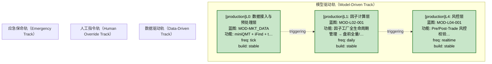

# 决策流图（decisiongraph）索引

> 生成时间: 2026-07-09T17:11:35
> 真源: `architecture_model/domain/decision_graph_model.yaml` → PostgreSQL `decision_*` 表（TRAE-061）
> 数据库: depgraph (PostgreSQL)

## 概述

决策流图（decisiongraph）是与依赖图（depgraph）、数据流图（dataflowgraph）正交的第三维度全景图。
- depgraph 表达"谁依赖谁"（模块依赖，静态）
- dataflowgraph 表达"数据从哪流到哪"（数据流向，动态）
- decisiongraph 表达"决策如何产生"（决策流，动态）
- 三图通过 `module_id` 关联：决策节点 → 实现模块（depgraph）→ 数据流作业（dataflowgraph）

## 统计

| 类型 | 数量 |
|------|------|
| Track（轨） | 4 |
| Layer（层） | 10 |
| Node（节点） | 214 |
| Edge（边） | 213 |
| 运营态 Layer（design_maturity=production） | 3 |
| 设计态 Layer（design_maturity=design） | 7 |
| 原型态 Layer（design_maturity=prototype） | 0 |
| 运营态 Node（design_maturity=production） | 0 |
| 设计态 Node（design_maturity=design） | 214 |

> **设计态 vs 运营态**：`design_maturity` 字段区分——`design`=蓝图规划（代码未写），`production`=实际代码已实现稳定运行，`prototype`=原型验证中。对标 depgraph 的设计态/运营态机制。

## Mermaid 图表

> 以下图表通过 Mermaid 代码块内嵌，可直接在 Markdown 查看器中渲染。

### 全景图（设计态 + 运营态合并，标签标注 [design]/[production]）

```mermaid
flowchart TD
    subgraph track_model_driven["模型驱动轨（Model-Driven Track）"]
        LL0["[production]L0: 数据接入与预处理层<br/>蓝图: MOD-MKT_DATA<br/>功能: miniQMT + iFind + t…<br/>freq: tick<br/>build: stable"]:::bsStable
        LL1["[production]L1: 因子计算层<br/>蓝图: MOD-L02-001<br/>功能: 因子工厂全生命周期管理 → 盘前全量/…<br/>freq: daily<br/>build: stable"]:::bsStable
        LL2A["[design]L2A: 信号层<br/>功能: 信号工厂 → 多策略投票 → 收益率条…<br/>freq: daily<br/>build: planned"]:::bsPlanned
        N1("[design]sell_decision: 卖出决策域入口 Sell Decision Entry<br/>path: decision/sell/sell_00"):::bsPlanned
        LL2A --- N1
        N2("[design]sell_decision: 止盈信号 Take-Profit Signal<br/>path: decision/sell/sell_01"):::bsPlanned
        LL2A --- N2
        N3("[design]sell_decision: 止损信号 Stop-Loss Signal<br/>path: decision/sell/sell_02"):::bsPlanned
        LL2A --- N3
        N4("[design]sell_decision: 移动止损 Trailing Stop<br/>path: decision/sell/sell_03"):::bsPlanned
        LL2A --- N4
        N5("[design]sell_decision: 主力出货信号 Main Force Distribution Signal<br/>path: decision/sell/sell_04"):::bsPlanned
        LL2A --- N5
        N6("[design]sell_decision: 量价背离卖出 Volume-Price Divergence Sell<br/>path: decision/sell/sell_05"):::bsPlanned
        LL2A --- N6
        N7("[design]sell_decision: 突破关键位卖出 Key-Level Breakdown Sell<br/>path: decision/sell/sell_06"):::bsPlanned
        LL2A --- N7
        N8("[design]sell_decision: Watch List 实时卖出 Watch List Realtime Sell<br/>path: decision/sell/sell_07"):::bsPlanned
        LL2A --- N8
        N9("[design]sell_decision: Monitor List 定期扫描 Monitor List Periodic Scan<br/>path: decision/sell/sell_08"):::bsPlanned
        LL2A --- N9
        N10("[design]sell_decision: 卖出信号融合仲裁 Sell Signal Fusion Arbiter<br/>path: decision/sell/sell_09"):::bsPlanned
        LL2A --- N10
        N11("[design]sell_decision: 买卖冲突仲裁 Buy-Sell Conflict Arbiter<br/>path: decision/sell/sell_10"):::bsPlanned
        LL2A --- N11
        N12("[design]sell_decision: 部分卖出vs全部清仓决策 Partial vs Full Sell Decision<br/>path: decision/sell/sell_11"):::bsPlanned
        LL2A --- N12
        N13("[design]sell_decision: D-S证据理论融合 D-S Evidence Theory Fusion<br/>path: decision/sell/sell_12"):::bsPlanned
        LL2A --- N13
        N14("[design]sell_decision: 做T决策协调 T-Trade Coordinator<br/>path: decision/sell/sell_13"):::bsPlanned
        LL2A --- N14
        N15("[design]sell_decision: 黑天鹅强制卖出 Black Swan Forced Sell<br/>path: decision/sell/sell_14"):::bsPlanned
        LL2A --- N15
        N16("[design]sell_decision: Gap开盘决策框架 Gap Opening Decision Framework<br/>path: decision/sell/sell_15"):::bsPlanned
        LL2A --- N16
        N17("[design]sell_decision: 强制清仓信号 Forced Liquidation Signal<br/>path: decision/sell/sell_16"):::bsPlanned
        LL2A --- N17
        N18("[design]sell_decision: 卖出降级模式 Sell Degradation Mode<br/>path: decision/sell/sell_17"):::bsPlanned
        LL2A --- N18
        N19("[design]sell_decision: 卖出决策闭环优化 Sell Decision Closed-Loop<br/>path: decision/sell/sell_18"):::bsPlanned
        LL2A --- N19
        N141("[design]signal: 市场仿真器 Market Simulator<br/>path: decision/simulation/sim_01"):::bsPlanned
        LL2A --- N141
        N142("[design]signal: 策略仿真器 Strategy Simulator<br/>path: decision/simulation/sim_02"):::bsPlanned
        LL2A --- N142
        N143("[design]signal: 风控仿真器 Risk Simulator<br/>path: decision/simulation/sim_03"):::bsPlanned
        LL2A --- N143
        N144("[design]signal: 压力测试引擎 Stress Test Engine<br/>path: decision/simulation/sim_04"):::bsPlanned
        LL2A --- N144
        N145("[design]signal: 场景生成器 Scenario Generator<br/>path: decision/simulation/sim_05"):::bsPlanned
        LL2A --- N145
        N146("[design]signal: 历史重放引擎 History Replay Engine<br/>path: decision/simulation/sim_07"):::bsPlanned
        LL2A --- N146
        N147("[design]signal: 极端事件仿真 Extreme Event Simulator<br/>path: decision/simulation/sim_10"):::bsPlanned
        LL2A --- N147
        N148("[design]signal: 依赖图数字孪生 Dependency Graph Digital Twin<br/>path: decision/simulation/sim_13"):::bsPlanned
        LL2A --- N148
        N149("[design]signal: 混沌实验自动生成 Chaos Experiment Auto-Generator<br/>path: decision/simulation/sim_15"):::bsPlanned
        LL2A --- N149
        N150("[design]signal: 回测过拟合检测器 Backtest Overfitting Detector<br/>path: decision/simulation/sim_18"):::bsPlanned
        LL2A --- N150
        N151("[design]signal: Walk-Forward分析器 Walk-Forward Analyzer<br/>path: decision/simulation/sim_19"):::bsPlanned
        LL2A --- N151
        N152("[design]signal: 参数鲁棒性测试器 Parameter Robustness Tester<br/>path: decision/simulation/sim_21"):::bsPlanned
        LL2A --- N152
        N153("[design]signal: 验证自动化流水线 Validation Automation Pipeline<br/>path: decision/simulation/sim_33"):::bsPlanned
        LL2A --- N153
        N154("[design]signal: 自动化过拟合门禁 Automated Overfitting Detector Gate<br/>path: decision/simulation/sim_56"):::bsPlanned
        LL2A --- N154
        N155("[design]signal: 3阶段决策门控 IS→WFA→OOS 3-Stage Decision Gate<br/>path: decision/simulation/sim_g1"):::bsPlanned
        LL2A --- N155
        N177("[design]signal: Synthesizer 信号合成+权重分配<br/>path: decision/signal/sg_01"):::bsPlanned
        LL2A --- N177
        N178("[design]signal: Signal Priority Router 信号优先级路由<br/>path: decision/signal/sg_02"):::bsPlanned
        LL2A --- N178
        N179("[design]signal: LLM Strategy Agent LLM策略Agent<br/>path: decision/signal/sg_03"):::bsPlanned
        LL2A --- N179
        N180("[design]signal: Signal Tail Risk Protector 信号尾部风险保护<br/>path: decision/signal/sg_04"):::bsPlanned
        LL2A --- N180
        N181("[design]signal: A-Share Plan Conformity Evaluator A股计划吻合度评估<br/>path: decision/signal/sg_05"):::bsPlanned
        LL2A --- N181
        N182("[design]signal: A-Share Emergency Opportunity Evaluator A股应急机会评估<br/>path: decision/signal/sg_06"):::bsPlanned
        LL2A --- N182
        N183("[design]signal: A-Share Capital-Force Conflict Arbiter 主力游资冲突仲裁<br/>path: decision/signal/sg_07"):::bsPlanned
        LL2A --- N183
        N184("[design]signal: Regime Special Override Priority Manager Regime特殊覆盖优先级<br/>path: decision/signal/sg_08"):::bsPlanned
        LL2A --- N184
        N185("[design]signal: Risk-Signal Interaction Sequencer 风控-信号交互时序<br/>path: decision/signal/sg_09"):::bsPlanned
        LL2A --- N185
        N186("[design]signal: 36环节决策框架实现器 36-Step Decision Framework<br/>path: decision/signal/sg_10"):::bsPlanned
        LL2A --- N186
        N187("[design]signal: 策略替换与淘汰决策器 Strategy Replacement Decision<br/>path: decision/signal/sg_11"):::bsPlanned
        LL2A --- N187
        N188("[design]signal: 信号冲突解决 Signal Conflict Resolution<br/>path: decision/signal/sg_12"):::bsPlanned
        LL2A --- N188
        N189("[design]signal: 信号融合模块 Signal Fusion Module<br/>path: decision/signal/sg_13"):::bsPlanned
        LL2A --- N189
        N190("[design]signal: 末位淘汰 IC-Based Factor Replacement<br/>path: decision/factor/fc_01"):::bsPlanned
        LL2A --- N190
        N191("[design]signal: 批量裁剪 Batch Factor Pruning<br/>path: decision/factor/fc_02"):::bsPlanned
        LL2A --- N191
        N192("[design]signal: Multi-Source Priority Router 多源优先级路由<br/>path: decision/data/dt_01"):::bsPlanned
        LL2A --- N192
        N193("[design]signal: Cross-Source Reconciler 多源对账<br/>path: decision/data/dt_02"):::bsPlanned
        LL2A --- N193
        N194("[design]signal: Multi-Timeframe Fusion 跨频率融合<br/>path: decision/data/dt_03"):::bsPlanned
        LL2A --- N194
        N200("[design]signal: Approval Workflow UI 审批流程界面<br/>path: decision/frontend/fe_12"):::bsPlanned
        LL2A --- N200
        N201("[design]signal: Notification Router 通知路由<br/>path: decision/frontend/fe_13"):::bsPlanned
        LL2A --- N201
        N202("[design]signal: Real-time Dashboard 实时仪表盘<br/>path: decision/frontend/fe_09"):::bsPlanned
        LL2A --- N202
        N203("[design]signal: 决策树可视化器 ADR Decision Tree Visualizer<br/>path: decision/frontend/fe_m76"):::bsPlanned
        LL2A --- N203
        N204("[design]signal: 4级风控决策 APPROVE/REDUCE/REJECT/FLATTEN<br/>path: decision/research/rs_01"):::bsPlanned
        LL2A --- N204
        N205("[design]signal: 3阶段决策门控 IS→WFA→OOS 3-Stage Decision Gate<br/>path: decision/research/rs_02"):::bsPlanned
        LL2A --- N205
        N206("[design]signal: Decision Audit Trail R-102 Decision Audit Trail<br/>path: decision/research/rs_03"):::bsPlanned
        LL2A --- N206
        N209("[design]signal: 服务降级管理 Service Degradation Manager<br/>path: decision/frontend/fe_14"):::bsPlanned
        LL2A --- N209
        N210("[design]signal: 跨域运维事件链追踪 Cross-Domain Event Chain<br/>path: decision/frontend/fe_15"):::bsPlanned
        LL2A --- N210
        N211("[design]signal: 策略可解释性报告器 Strategy Explainability Reporter<br/>path: decision/research/rs_04"):::bsPlanned
        LL2A --- N211
        N212("[design]signal: A股绩效审计与优化触发器 A-Share Performance Audit<br/>path: decision/research/rs_05"):::bsPlanned
        LL2A --- N212
        N213("[design]signal: 异常决策自检 Anomaly Decision Self-Check<br/>path: decision/research/rs_06"):::bsPlanned
        LL2A --- N213
        N214("[design]signal: Knowledge Feedback Loop 知识反馈循环<br/>path: decision/research/rs_07"):::bsPlanned
        LL2A --- N214
        LL2B["[design]L2B: 主力行为层<br/>功能: 六阶段识别 + 自迭代推演 + 庄家专…<br/>freq: daily<br/>build: planned"]:::bsPlanned
        LL2C["[design]L2C: 市场状态与大盘预测层<br/>功能: 3×3矩阵 + 2叠加态 + 三层大盘…<br/>freq: daily<br/>build: planned"]:::bsPlanned
        LL2D["[design]L2D: 知识图谱与因果推演层<br/>功能: 六类知识图谱 → 事件影响链分析 → …<br/>freq: daily<br/>build: planned"]:::bsPlanned
        LL3["[design]L3: 策略组合层<br/>功能: 多策略信号合成 → 资本分配 → 元策…<br/>freq: daily<br/>build: planned"]:::bsPlanned
        N20("[design]portfolio_target: 组合核心引擎 Portfolio Core Engine<br/>path: decision/pf_core/pc_01"):::bsPlanned
        LL3 --- N20
        N21("[design]portfolio_target: 半Kelly硬上限 Half-Kelly Hard Cap<br/>path: decision/pf_core/pc_02"):::bsPlanned
        LL3 --- N21
        N22("[design]portfolio_target: 风险预算 Risk Budget<br/>path: decision/pf_core/pc_03"):::bsPlanned
        LL3 --- N22
        N23("[design]portfolio_target: 再平衡决策 Rebalance Decision<br/>path: decision/pf_core/pc_04"):::bsPlanned
        LL3 --- N23
        N24("[design]portfolio_target: 仲裁优先级体系 Arbitration Priority<br/>path: decision/pf_core/pc_05"):::bsPlanned
        LL3 --- N24
        N25("[design]portfolio_target: 多策略共振融合 Strategy Convergence Fusion<br/>path: decision/pf_core/pc_06"):::bsPlanned
        LL3 --- N25
        N26("[design]portfolio_target: 因子直通裁决 Factor Bypass Arbitration<br/>path: decision/pf_core/pc_07"):::bsPlanned
        LL3 --- N26
        N27("[design]portfolio_target: 元策略路由 Meta-Strategy Router<br/>path: decision/pf_core/pc_08"):::bsPlanned
        LL3 --- N27
        N28("[design]portfolio_target: 组合优化 Portfolio Optimization<br/>path: decision/pf_core/pc_09"):::bsPlanned
        LL3 --- N28
        N29("[design]portfolio_target: 资本分配 Capital Allocation<br/>path: decision/pf_core/pc_10"):::bsPlanned
        LL3 --- N29
        N30("[design]portfolio_target: 决策编排器 Decision Orchestrator<br/>path: decision/pf_core/pc_11"):::bsPlanned
        LL3 --- N30
        N31("[design]portfolio_target: 四轨融合器 Multi-Track Fusion<br/>path: decision/pf_core/pc_12"):::bsPlanned
        LL3 --- N31
        N32("[design]portfolio_target: 策略分配 Strategy Allocation<br/>path: decision/pf_alloc/pa_01"):::bsPlanned
        LL3 --- N32
        N33("[design]portfolio_target: 风险平价 Risk Parity<br/>path: decision/pf_alloc/pa_02"):::bsPlanned
        LL3 --- N33
        N34("[design]portfolio_target: 动态权重 Dynamic Weighting<br/>path: decision/pf_alloc/pa_03"):::bsPlanned
        LL3 --- N34
        N35("[design]portfolio_target: 策略权重再平衡 Strategy Weight Rebalance<br/>path: decision/pf_alloc/pa_04"):::bsPlanned
        LL3 --- N35
        N36("[design]portfolio_target: 多策略共识 Multi-Strategy Consensus<br/>path: decision/pf_alloc/pa_05"):::bsPlanned
        LL3 --- N36
        N37("[design]portfolio_target: 元策略选择 Meta-Strategy Selection<br/>path: decision/pf_alloc/pa_06"):::bsPlanned
        LL3 --- N37
        N38("[design]portfolio_target: 仓位唯一裁决中心 C-047 Position Sole Arbiter<br/>path: decision/position/pos_01"):::bsPlanned
        LL3 --- N38
        N39("[design]portfolio_target: 持仓状态机 Position State Machine<br/>path: decision/position/pos_02"):::bsPlanned
        LL3 --- N39
        N40("[design]portfolio_target: 仓位漂移监控 Position Drift Monitor<br/>path: decision/position/pos_03"):::bsPlanned
        LL3 --- N40
        N41("[design]portfolio_target: Kelly仓位决策 Kelly Position Decision<br/>path: decision/position/pos_04"):::bsPlanned
        LL3 --- N41
        N42("[design]portfolio_target: 风险配额 Risk Quota<br/>path: decision/position/pos_05"):::bsPlanned
        LL3 --- N42
        N43("[design]portfolio_target: 11种市场状态→仓位上限 Market State Position Cap<br/>path: decision/position/pos_06"):::bsPlanned
        LL3 --- N43
        N44("[design]portfolio_target: 组合层决策 Portfolio Layer Decision<br/>path: decision/position/pos_07"):::bsPlanned
        LL3 --- N44
        N45("[design]portfolio_target: 策略层决策 Strategy Layer Decision<br/>path: decision/position/pos_08"):::bsPlanned
        LL3 --- N45
        N46("[design]portfolio_target: 标层决策 Instrument Layer Decision<br/>path: decision/position/pos_09"):::bsPlanned
        LL3 --- N46
        N47("[design]portfolio_target: 动态层决策 Dynamic Layer Decision<br/>path: decision/position/pos_10"):::bsPlanned
        LL3 --- N47
        N48("[design]portfolio_target: 再平衡触发 Rebalance Trigger<br/>path: decision/position/pos_11"):::bsPlanned
        LL3 --- N48
        N49("[design]portfolio_target: 仓位上限硬约束 Position Cap Hard Constraint<br/>path: decision/position/pos_12"):::bsPlanned
        LL3 --- N49
        N50("[design]portfolio_target: REDUCING→EXITING状态转换 REDUCING to EXITING<br/>path: decision/position/pos_13"):::bsPlanned
        LL3 --- N50
        N51("[design]portfolio_target: 风险预算→Kelly决策 Risk Budget to Kelly<br/>path: decision/position/pos_14"):::bsPlanned
        LL3 --- N51
        N52("[design]portfolio_target: 半Kelly硬上限 Half-Kelly Hard Cap<br/>path: decision/position/pos_15"):::bsPlanned
        LL3 --- N52
        N53("[design]portfolio_target: 仓位降级 Position Degradation<br/>path: decision/position/pos_16"):::bsPlanned
        LL3 --- N53
        N54("[design]portfolio_target: 持仓状态→卖出阈值 Position State to Sell Threshold<br/>path: decision/position/pos_17"):::bsPlanned
        LL3 --- N54
        N55("[design]portfolio_target: 仓位四轨决策 Position Four-Track Decision<br/>path: decision/position/pos_18"):::bsPlanned
        LL3 --- N55
        N56("[design]portfolio_target: 仓位裁决→执行 Position Arbitration to Execution<br/>path: decision/position/pos_19"):::bsPlanned
        LL3 --- N56
        N59("[design]order: 50ms SLA Fail-Closed 50ms SLA Fail-Closed<br/>path: decision/ex_core/ex_03"):::bsPlanned
        LL3 --- N59
        N60("[design]order: Saga编排式事务 Saga Orchestrated Transaction<br/>path: decision/ex_core/ex_04"):::bsPlanned
        LL3 --- N60
        N61("[design]order: 风控检查 Risk Check<br/>path: decision/ex_core/ex_05"):::bsPlanned
        LL3 --- N61
        N62("[design]order: 信号确认 Signal Confirmation<br/>path: decision/ex_core/ex_06"):::bsPlanned
        LL3 --- N62
        N63("[design]order: 下单提交 Order Submit<br/>path: decision/ex_core/ex_07"):::bsPlanned
        LL3 --- N63
        N64("[design]order: 成交确认 Fill Confirmation<br/>path: decision/ex_core/ex_08"):::bsPlanned
        LL3 --- N64
        N65("[design]order: 持仓更新 Position Update<br/>path: decision/ex_core/ex_09"):::bsPlanned
        LL3 --- N65
        N66("[design]order: 报告生成 Report Generation<br/>path: decision/ex_core/ex_10"):::bsPlanned
        LL3 --- N66
        N71("[design]order: 流动性螺旋3阶段 Liquidity Spiral 3-Phase<br/>path: decision/ex_core/ex_15"):::bsPlanned
        LL3 --- N71
        N72("[design]order: 订单路由决策 Order Routing Decision<br/>path: decision/ex_sor/ex_16"):::bsPlanned
        LL3 --- N72
        N73("[design]order: SOR路由决策延迟 SOR Routing Latency<br/>path: decision/ex_sor/ex_17"):::bsPlanned
        LL3 --- N73
        N75("[design]order: 交易通道熔断人工恢复 Trading Channel Manual Recovery<br/>path: decision/ex_sor/ex_19"):::bsPlanned
        LL3 --- N75
        N77("[design]order: Kill-Switch四级阶梯 Kill-Switch 4-Level Cascade<br/>path: decision/ex_sor/ex_21"):::bsPlanned
        LL3 --- N77
        N78("[design]order: 熔断器矩阵 Circuit Breaker Matrix<br/>path: decision/ex_sor/ex_22"):::bsPlanned
        LL3 --- N78
        N102("[design]order: 外部订单观察者 External Order Watcher<br/>path: decision/trading/trd_01"):::bsPlanned
        LL3 --- N102
        N103("[design]order: 结算引擎 Settlement Engine<br/>path: decision/trading/trd_02"):::bsPlanned
        LL3 --- N103
        N104("[design]order: 公司行动 Corporate Action<br/>path: decision/trading/trd_03"):::bsPlanned
        LL3 --- N104
        N105("[design]order: 保证金管理 Margin Manager<br/>path: decision/trading/trd_04"):::bsPlanned
        LL3 --- N105
        N106("[design]order: 多账户 Multi-Account<br/>path: decision/trading/trd_05"):::bsPlanned
        LL3 --- N106
        N107("[design]order: 微信枢纽 WeChat Hub<br/>path: decision/trading/trd_06"):::bsPlanned
        LL3 --- N107
        N108("[design]order: C-013 4级优先级 C-013 4-Level Priority<br/>path: decision/trading/trd_07"):::bsPlanned
        LL3 --- N108
        N109("[design]order: A股交易纪律四项必做 A-Share Trading 4-Do<br/>path: decision/trading/trd_08"):::bsPlanned
        LL3 --- N109
        N110("[design]order: A股交易纪律四项严禁 A-Share Trading 4-Forbidden<br/>path: decision/trading/trd_09"):::bsPlanned
        LL3 --- N110
        N111("[design]order: 监管报送 Regulatory Reporting<br/>path: decision/trading/trd_10"):::bsPlanned
        LL3 --- N111
        N112("[design]order: 盘中即时反应决策引擎 Intraday Instant Reaction Decision Engine<br/>path: decision/trading/trd_11"):::bsPlanned
        LL3 --- N112
        N113("[design]portfolio_target: Permission Guard 七层纵深防御<br/>path: decision/aut_core/ac_01"):::bsPlanned
        LL3 --- N113
        N115("[design]portfolio_target: Self-Healing Git-native自愈<br/>path: decision/aut_core/ac_03"):::bsPlanned
        LL3 --- N115
        N116("[design]portfolio_target: Budget Enforcer 七级预算<br/>path: decision/aut_core/ac_04"):::bsPlanned
        LL3 --- N116
        N117("[design]portfolio_target: Health Monitor 9子系统监控<br/>path: decision/aut_core/ac_05"):::bsPlanned
        LL3 --- N117
        N118("[design]portfolio_target: Escalation Engine 升级引擎<br/>path: decision/aut_core/ac_06"):::bsPlanned
        LL3 --- N118
        N119("[design]portfolio_target: Rollback Engine Git-native回滚<br/>path: decision/aut_core/ac_07"):::bsPlanned
        LL3 --- N119
        N120("[design]portfolio_target: Drift Detector 39检测器<br/>path: decision/aut_core/ac_08"):::bsPlanned
        LL3 --- N120
        N121("[design]portfolio_target: Auto-Fix Engine 16修复器<br/>path: decision/aut_core/ac_09"):::bsPlanned
        LL3 --- N121
        N133("[design]portfolio_target: 编排Agent Orchestrator<br/>path: decision/aut_core/ac_21"):::bsPlanned
        LL3 --- N133
        N135("[design]portfolio_target: 做TAgent T0Trader<br/>path: decision/aut_core/ac_23"):::bsPlanned
        LL3 --- N135
        N136("[design]portfolio_target: 路由Agent Router<br/>path: decision/aut_core/ac_24"):::bsPlanned
        LL3 --- N136
        LL4["[production]L4: 风控层<br/>蓝图: MOD-L04-001<br/>功能: Pre/Post-Trade 风控校验…<br/>freq: realtime<br/>build: stable"]:::bsStable
        N57("[design]compliance_check: Pre-Trade主链6项检查 Pre-Trade Main Chain 6 Checks<br/>path: decision/ex_core/ex_01"):::bsPlanned
        LL4 --- N57
        N58("[design]risk_check: Kill Switch 5层防御 Kill Switch 5-Layer Defense<br/>path: decision/ex_core/ex_02"):::bsPlanned
        LL4 --- N58
        N67("[design]risk_check: Kill Switch AI自动激活 Kill Switch AI Auto Trigger<br/>path: decision/ex_core/ex_11"):::bsPlanned
        LL4 --- N67
        N68("[design]risk_check: Kill Switch人工激活 Kill Switch Manual Trigger<br/>path: decision/ex_core/ex_12"):::bsPlanned
        LL4 --- N68
        N69("[design]risk_check: Kill Switch定时激活 Kill Switch Timer Trigger<br/>path: decision/ex_core/ex_13"):::bsPlanned
        LL4 --- N69
        N70("[design]risk_check: Kill Switch外部信号激活 Kill Switch External Signal<br/>path: decision/ex_core/ex_14"):::bsPlanned
        LL4 --- N70
        N74("[design]risk_check: 券商连接熔断+故障转移 Broker Circuit Breaker<br/>path: decision/ex_sor/ex_18"):::bsPlanned
        LL4 --- N74
        N76("[design]compliance_check: Pre-Trade合规检查流水线 Pre-Trade Compliance Pipeline<br/>path: decision/ex_sor/ex_20"):::bsPlanned
        LL4 --- N76
        N79("[design]compliance_check: 行为准入门禁 Behavioral Admission Gateway<br/>path: decision/ex_sor/ex_23"):::bsPlanned
        LL4 --- N79
        N80("[design]risk_check: 风控熔断事件 Risk Circuit Breaker Event<br/>path: decision/risk/rk_01"):::bsPlanned
        LL4 --- N80
        N81("[design]risk_check: 三层防线 Three Defense Lines<br/>path: decision/risk/rk_02"):::bsPlanned
        LL4 --- N81
        N82("[design]risk_check: 双引擎风控 Dual Engine Risk<br/>path: decision/risk/rk_03"):::bsPlanned
        LL4 --- N82
        N83("[design]risk_check: 4级风控决策门控 4-Level Risk Decision Gate<br/>path: decision/risk/rk_04"):::bsPlanned
        LL4 --- N83
        N84("[design]risk_check: 压力测试引擎 Stress Test Engine<br/>path: decision/risk/rk_05"):::bsPlanned
        LL4 --- N84
        N85("[design]risk_check: 黑天鹅模式库 Black Swan Pattern Library<br/>path: decision/risk/rk_06"):::bsPlanned
        LL4 --- N85
        N86("[design]risk_check: 流动性危机模拟 Liquidity Crisis Simulation<br/>path: decision/risk/rk_07"):::bsPlanned
        LL4 --- N86
        N87("[design]risk_check: 反向压力测试4步法 Reverse Stress Test 4-Step<br/>path: decision/risk/rk_08"):::bsPlanned
        LL4 --- N87
        N88("[design]risk_check: 二阶效应与传染模型 Second-Order Effect Model<br/>path: decision/risk/rk_09"):::bsPlanned
        LL4 --- N88
        N89("[design]risk_check: 风控否决权 Risk Veto<br/>path: decision/risk/rk_10"):::bsPlanned
        LL4 --- N89
        N90("[design]risk_check: 风控状态 Risk State<br/>path: decision/risk/rk_11"):::bsPlanned
        LL4 --- N90
        N91("[design]risk_check: 风控参数变更审批 Risk Parameter Approval<br/>path: decision/risk/rk_12"):::bsPlanned
        LL4 --- N91
        N92("[design]risk_check: 熔断恢复确认 Circuit Breaker Recovery Confirm<br/>path: decision/risk/rk_13"):::bsPlanned
        LL4 --- N92
        N93("[design]risk_check: OBSERVING软止损观察期 OBSERVING Soft Stop<br/>path: decision/risk/rk_14"):::bsPlanned
        LL4 --- N93
        N94("[design]risk_check: 风险预算 Risk Budget<br/>path: decision/risk/rk_15"):::bsPlanned
        LL4 --- N94
        N95("[design]risk_check: VaR计算 VaR Calculation<br/>path: decision/risk/rk_16"):::bsPlanned
        LL4 --- N95
        N96("[design]risk_check: 回撤监控 Drawdown Monitor<br/>path: decision/risk/rk_17"):::bsPlanned
        LL4 --- N96
        N97("[design]risk_check: 风控信号交互时序 Risk-Signal Timing<br/>path: decision/risk/rk_18"):::bsPlanned
        LL4 --- N97
        N98("[design]risk_check: 风控事件 Risk Event<br/>path: decision/risk/rk_19"):::bsPlanned
        LL4 --- N98
        N99("[design]risk_check: FLATTEN硬编码触发 FLATTEN Hardcoded Trigger<br/>path: decision/risk/rk_20"):::bsPlanned
        LL4 --- N99
        N100("[design]risk_check: 5级风险否决引擎 5-Level Risk Veto Engine<br/>path: decision/risk/rk_21"):::bsPlanned
        LL4 --- N100
        N101("[design]risk_check: Pod级止损 Pod-Level Stop Loss<br/>path: decision/risk/rk_22"):::bsPlanned
        LL4 --- N101
        N114("[design]compliance_check: Audit Trail Merkle哈希链<br/>path: decision/aut_core/ac_02"):::bsPlanned
        LL4 --- N114
        N122("[design]compliance_check: Decision Audit Trail 决策审计<br/>path: decision/aut_core/ac_10"):::bsPlanned
        LL4 --- N122
        N123("[design]compliance_check: Kill Switch直通路径 Kill Switch Direct Path<br/>path: decision/aut_perm/ap_11"):::bsPlanned
        LL4 --- N123
        N124("[design]compliance_check: 4级自治模型 Level 0-3 Autonomy Model<br/>path: decision/aut_perm/ap_12"):::bsPlanned
        LL4 --- N124
        N125("[design]compliance_check: AI自治边界三级分类<br/>path: decision/aut_perm/ap_13"):::bsPlanned
        LL4 --- N125
        N126("[design]compliance_check: Agentic Drift 5类攻击模式<br/>path: decision/aut_perm/ap_14"):::bsPlanned
        LL4 --- N126
        N127("[design]compliance_check: 行为审计7信号 S-01~S-07<br/>path: decision/aut_perm/ap_15"):::bsPlanned
        LL4 --- N127
        N128("[design]compliance_check: ARS双轨结算模型 ARS Dual-Track Settlement<br/>path: decision/aut_perm/ap_16"):::bsPlanned
        LL4 --- N128
        N129("[design]risk_check: AI自治熔断5条件 VR-009 5 Conditions<br/>path: decision/aut_perm/ap_17"):::bsPlanned
        LL4 --- N129
        N130("[design]risk_check: L0完全人工→L4降级模式 L0 to L4 Degradation<br/>path: decision/aut_perm/ap_18"):::bsPlanned
        LL4 --- N130
        N131("[design]risk_check: 4级风控决策 APPROVE/REDUCE/REJECT/FLATTEN<br/>path: decision/aut_perm/ap_19"):::bsPlanned
        LL4 --- N131
        N132("[design]compliance_check: 人类监督四层级 L0~L3 Human Oversight<br/>path: decision/aut_perm/ap_20"):::bsPlanned
        LL4 --- N132
        N134("[design]risk_check: 风控Agent RiskManager<br/>path: decision/aut_core/ac_22"):::bsPlanned
        LL4 --- N134
        N137("[design]compliance_check: A2A检查网关策略引擎 A2A Check Gateway<br/>path: decision/aut_perm/ap_21"):::bsPlanned
        LL4 --- N137
        N138("[design]compliance_check: LLM Agent路由 级联控制器 Cascade Controller<br/>path: decision/aut_perm/ap_22"):::bsPlanned
        LL4 --- N138
        N139("[design]risk_check: 应急保命轨 Emergency Track<br/>path: decision/aut_perm/ap_23"):::bsPlanned
        LL4 --- N139
        N140("[design]compliance_check: 置信度分层决策 C-031 Confidence-Layered Decision<br/>path: decision/aut_perm/ap_24"):::bsPlanned
        LL4 --- N140
        N156("[design]compliance_check: AuditLedger 审计账本<br/>path: decision/governance/gov_001"):::bsPlanned
        LL4 --- N156
        N157("[design]compliance_check: DDDRuleEnforcer DDD铁律执行器<br/>path: decision/governance/gov_002"):::bsPlanned
        LL4 --- N157
        N158("[design]compliance_check: DecisionProvenance 决策溯源链<br/>path: decision/governance/gov_003"):::bsPlanned
        LL4 --- N158
        N159("[design]compliance_check: PhaseGateManager 阶段门禁管理<br/>path: decision/governance/gov_004"):::bsPlanned
        LL4 --- N159
        N160("[design]compliance_check: ConstitutionalGuard 宪法守卫<br/>path: decision/governance/gov_005"):::bsPlanned
        LL4 --- N160
        N161("[design]compliance_check: ComplianceAuditor 合规审计器<br/>path: decision/governance/gov_006"):::bsPlanned
        LL4 --- N161
        N162("[design]compliance_check: IncidentResponse 事件响应与升级<br/>path: decision/governance/gov_007"):::bsPlanned
        LL4 --- N162
        N163("[design]compliance_check: SystemTopologyAuditor 系统拓扑审计<br/>path: decision/governance/gov_008"):::bsPlanned
        LL4 --- N163
        N164("[design]compliance_check: 决策疲劳检测 Decision Fatigue Detection<br/>path: decision/governance/gov_009"):::bsPlanned
        LL4 --- N164
        N165("[design]compliance_check: Agent辩论机制 Agent Debate<br/>path: decision/governance/gov_010"):::bsPlanned
        LL4 --- N165
        N166("[design]compliance_check: AI Compliance Validator AI合规验证<br/>path: decision/compliance/cmp_01"):::bsPlanned
        LL4 --- N166
        N167("[design]compliance_check: 决策溯源链 Decision Provenance Chain<br/>path: decision/compliance/cmp_02"):::bsPlanned
        LL4 --- N167
        N168("[design]compliance_check: TraceCompleteness TC≥0.997<br/>path: decision/compliance/cmp_03"):::bsPlanned
        LL4 --- N168
        N169("[design]compliance_check: AI合规边界 Tier 1/2/3风险分级<br/>path: decision/compliance/cmp_04"):::bsPlanned
        LL4 --- N169
        N170("[design]compliance_check: Pre-Trade合规检查三模式 Pre-Trade 3-Mode Check<br/>path: decision/compliance/cmp_05"):::bsPlanned
        LL4 --- N170
        N171("[design]compliance_check: Kill Switch <1秒响应 Kill Switch <1s Response<br/>path: decision/compliance/cmp_06"):::bsPlanned
        LL4 --- N171
        N172("[design]compliance_check: 人类监督四层级 L0~L3 Human Oversight 4-Level<br/>path: decision/compliance/cmp_07"):::bsPlanned
        LL4 --- N172
        N173("[design]compliance_check: AI决策可追溯性 AI Decision Traceability<br/>path: decision/compliance/cmp_08"):::bsPlanned
        LL4 --- N173
        N174("[design]compliance_check: AI决策可解释性门控 AI Decision Explainability Gate<br/>path: decision/compliance/cmp_09"):::bsPlanned
        LL4 --- N174
        N175("[design]compliance_check: 监管报告 Regulatory Report<br/>path: decision/compliance/cmp_10"):::bsPlanned
        LL4 --- N175
        N176("[design]compliance_check: 法域冲突解决 CrossBorderReg Navigator<br/>path: decision/compliance/cmp_11"):::bsPlanned
        LL4 --- N176
        N195("[design]compliance_check: AISGGate 九层防御 L0-L8<br/>path: decision/security/sec_001"):::bsPlanned
        LL4 --- N195
        N196("[design]compliance_check: ACLGuard Kill Switch执行<br/>path: decision/security/sec_009a"):::bsPlanned
        LL4 --- N196
        N197("[design]compliance_check: Kill Switch紧急熔断 Kill Switch Emergency<br/>path: decision/security/sec_009b"):::bsPlanned
        LL4 --- N197
        N198("[design]compliance_check: Secret Manager 密钥管理<br/>path: decision/security/sec_007"):::bsPlanned
        LL4 --- N198
        N199("[design]compliance_check: Self-Protect 自保护<br/>path: decision/security/sec_008"):::bsPlanned
        LL4 --- N199
        N207("[design]compliance_check: LLM Gateway 推理网关 LLM Gateway<br/>path: decision/security/sec_010"):::bsPlanned
        LL4 --- N207
        N208("[design]compliance_check: 推理熔断器 Inference Circuit Breaker<br/>path: decision/security/sec_011"):::bsPlanned
        LL4 --- N208
        LL5["[design]L5: 学习层<br/>功能: 7阶段学习流水线 → 模块工厂 → 知…<br/>freq: weekly<br/>build: planned"]:::bsPlanned
        LL6["[design]L6: 自评估层<br/>功能: LLM 自评估(Judge+交叉验证)…<br/>freq: weekly<br/>build: planned"]:::bsPlanned
    end
    subgraph track_data_driven["数据驱动轨（Data-Driven Track）"]
    end
    subgraph track_human_override["人工指令轨（Human Override Track）"]
    end
    subgraph track_emergency["应急保命轨（Emergency Track）"]
    end
    LL0 -.->|triggering| LL1
    LL1 -.->|triggering| LL2A
    LL2A -.->|triggering| LL2B
    LL2B -.->|triggering| LL2C
    LL2C -.->|triggering| LL2D
    LL2D -.->|triggering| LL3
    LL3 -.->|triggering| LL4
    LL4 -.->|triggering| LL5
    LL5 -.->|triggering| LL6
    N192 -->|informing| N193
    N193 -->|informing| N194
    N194 -->|informing| N190
    N190 -->|informing| N191
    N191 -->|informing| N202
    N202 -->|informing| N200
    N200 -->|informing| N201
    N201 -->|informing| N209
    N209 -->|informing| N210
    N210 -->|informing| N203
    N203 -->|informing| N204
    N204 -->|informing| N205
    N205 -->|informing| N206
    N206 -->|informing| N211
    N211 -->|informing| N212
    N212 -->|informing| N213
    N213 -->|informing| N214
    N214 -->|informing| N1
    N1 -->|informing| N2
    N2 -->|informing| N3
    N3 -->|informing| N4
    N4 -->|informing| N5
    N5 -->|informing| N6
    N6 -->|informing| N7
    N7 -->|informing| N8
    N8 -->|informing| N9
    N9 -->|informing| N10
    N10 -->|informing| N11
    N11 -->|informing| N12
    N12 -->|informing| N13
    N13 -->|informing| N14
    N14 -->|informing| N15
    N15 -->|informing| N16
    N16 -->|informing| N17
    N17 -->|informing| N18
    N18 -->|informing| N19
    N19 -->|informing| N177
    N177 -->|informing| N178
    N178 -->|informing| N179
    N179 -->|informing| N180
    N180 -->|informing| N181
    N181 -->|informing| N182
    N182 -->|informing| N183
    N183 -->|informing| N184
    N184 -->|informing| N185
    N185 -->|informing| N186
    N186 -->|informing| N187
    N187 -->|informing| N188
    N188 -->|informing| N189
    N189 -->|informing| N141
    N141 -->|informing| N142
    N142 -->|informing| N143
    N143 -->|informing| N144
    N144 -->|informing| N145
    N145 -->|informing| N146
    N146 -->|informing| N147
    N147 -->|informing| N148
    N148 -->|informing| N149
    N149 -->|informing| N150
    N150 -->|informing| N151
    N151 -->|informing| N152
    N152 -->|informing| N153
    N153 -->|informing| N154
    N154 -->|informing| N155
    N113 -->|informing| N115
    N115 -->|informing| N116
    N116 -->|informing| N117
    N117 -->|informing| N118
    N118 -->|informing| N119
    N119 -->|informing| N120
    N120 -->|informing| N121
    N121 -->|informing| N133
    N133 -->|informing| N135
    N135 -->|informing| N136
    N136 -->|informing| N59
    N59 -->|informing| N60
    N60 -->|informing| N61
    N61 -->|informing| N62
    N62 -->|informing| N63
    N63 -->|informing| N64
    N64 -->|informing| N65
    N65 -->|informing| N66
    N66 -->|informing| N71
    N71 -->|informing| N72
    N72 -->|informing| N73
    N73 -->|informing| N75
    N75 -->|informing| N77
    N77 -->|informing| N78
    N78 -->|informing| N32
    N32 -->|informing| N33
    N33 -->|informing| N34
    N34 -->|informing| N35
    N35 -->|informing| N36
    N36 -->|informing| N37
    N37 -->|informing| N20
    N20 -->|informing| N21
    N21 -->|informing| N22
    N22 -->|informing| N23
    N23 -->|informing| N24
    N24 -->|informing| N25
    N25 -->|informing| N26
    N26 -->|informing| N27
    N27 -->|informing| N28
    N28 -->|informing| N29
    N29 -->|informing| N30
    N30 -->|informing| N31
    N31 -->|informing| N38
    N38 -->|informing| N39
    N39 -->|informing| N40
    N40 -->|informing| N41
    N41 -->|informing| N42
    N42 -->|informing| N43
    N43 -->|informing| N44
    N44 -->|informing| N45
    N45 -->|informing| N46
    N46 -->|informing| N47
    N47 -->|informing| N48
    N48 -->|informing| N49
    N49 -->|informing| N50
    N50 -->|informing| N51
    N51 -->|informing| N52
    N52 -->|informing| N53
    N53 -->|informing| N54
    N54 -->|informing| N55
    N55 -->|informing| N56
    N56 -->|informing| N102
    N102 -->|informing| N103
    N103 -->|informing| N104
    N104 -->|informing| N105
    N105 -->|informing| N106
    N106 -->|informing| N107
    N107 -->|informing| N108
    N108 -->|informing| N109
    N109 -->|informing| N110
    N110 -->|informing| N111
    N111 -->|informing| N112
    N114 -->|informing| N122
    N122 -->|informing| N134
    N134 -->|informing| N123
    N123 -->|informing| N124
    N124 -->|informing| N125
    N125 -->|informing| N126
    N126 -->|informing| N127
    N127 -->|informing| N128
    N128 -->|informing| N129
    N129 -->|informing| N130
    N130 -->|informing| N131
    N131 -->|informing| N132
    N132 -->|informing| N137
    N137 -->|informing| N138
    N138 -->|informing| N139
    N139 -->|informing| N140
    N140 -->|informing| N166
    N166 -->|informing| N167
    N167 -->|informing| N168
    N168 -->|informing| N169
    N169 -->|informing| N170
    N170 -->|informing| N171
    N171 -->|informing| N172
    N172 -->|informing| N173
    N173 -->|informing| N174
    N174 -->|informing| N175
    N175 -->|informing| N176
    N176 -->|informing| N57
    N57 -->|informing| N58
    N58 -->|informing| N67
    N67 -->|informing| N68
    N68 -->|informing| N69
    N69 -->|informing| N70
    N70 -->|informing| N74
    N74 -->|informing| N76
    N76 -->|informing| N79
    N79 -->|informing| N156
    N156 -->|informing| N157
    N157 -->|informing| N158
    N158 -->|informing| N159
    N159 -->|informing| N160
    N160 -->|informing| N161
    N161 -->|informing| N162
    N162 -->|informing| N163
    N163 -->|informing| N164
    N164 -->|informing| N165
    N165 -->|informing| N80
    N80 -->|informing| N81
    N81 -->|informing| N82
    N82 -->|informing| N83
    N83 -->|informing| N84
    N84 -->|informing| N85
    N85 -->|informing| N86
    N86 -->|informing| N87
    N87 -->|informing| N88
    N88 -->|informing| N89
    N89 -->|informing| N90
    N90 -->|informing| N91
    N91 -->|informing| N92
    N92 -->|informing| N93
    N93 -->|informing| N94
    N94 -->|informing| N95
    N95 -->|informing| N96
    N96 -->|informing| N97
    N97 -->|informing| N98
    N98 -->|informing| N99
    N99 -->|informing| N100
    N100 -->|informing| N101
    N101 -->|informing| N195
    N195 -->|informing| N198
    N198 -->|informing| N199
    N199 -->|informing| N196
    N196 -->|informing| N197
    N197 -->|informing| N207
    N207 -->|informing| N208
    N155 -->|informing| N113
    N112 -->|informing| N114

    classDef bsStable fill:#c8e6c9,stroke:#2e7d32,stroke-width:2px,color:#000
    classDef bsGenerated fill:#fff9c4,stroke:#f9a825,stroke-width:2px,color:#000
    classDef bsTesting fill:#ffe0b2,stroke:#ef6c00,stroke-width:2px,color:#000
    classDef bsPlanned fill:#e1f5fe,stroke:#0277bd,stroke-width:2px,color:#000,stroke-dasharray: 5 5
    classDef bsDeprecated fill:#ffcdd2,stroke:#c62828,stroke-width:2px,color:#000,stroke-dasharray: 5 5
```

### 运营态全景图（仅 design_maturity=production 的 layer/node）

> 仅展示已实现稳定运行的决策层/节点（共 3 层，0 边）。



### 设计态全景图（仅 design_maturity=design 的 layer/node）

> 仅展示蓝图规划中尚未实现的决策层/节点（共 7 层，137 边）。

```mermaid
flowchart TD
    subgraph track_model_driven["模型驱动轨（Model-Driven Track）"]
        LL2A["[design]L2A: 信号层<br/>功能: 信号工厂 → 多策略投票 → 收益率条…<br/>freq: daily<br/>build: planned"]:::bsPlanned
        N1("[design]sell_decision: 卖出决策域入口 Sell Decision Entry<br/>path: decision/sell/sell_00"):::bsPlanned
        LL2A --- N1
        N2("[design]sell_decision: 止盈信号 Take-Profit Signal<br/>path: decision/sell/sell_01"):::bsPlanned
        LL2A --- N2
        N3("[design]sell_decision: 止损信号 Stop-Loss Signal<br/>path: decision/sell/sell_02"):::bsPlanned
        LL2A --- N3
        N4("[design]sell_decision: 移动止损 Trailing Stop<br/>path: decision/sell/sell_03"):::bsPlanned
        LL2A --- N4
        N5("[design]sell_decision: 主力出货信号 Main Force Distribution Signal<br/>path: decision/sell/sell_04"):::bsPlanned
        LL2A --- N5
        N6("[design]sell_decision: 量价背离卖出 Volume-Price Divergence Sell<br/>path: decision/sell/sell_05"):::bsPlanned
        LL2A --- N6
        N7("[design]sell_decision: 突破关键位卖出 Key-Level Breakdown Sell<br/>path: decision/sell/sell_06"):::bsPlanned
        LL2A --- N7
        N8("[design]sell_decision: Watch List 实时卖出 Watch List Realtime Sell<br/>path: decision/sell/sell_07"):::bsPlanned
        LL2A --- N8
        N9("[design]sell_decision: Monitor List 定期扫描 Monitor List Periodic Scan<br/>path: decision/sell/sell_08"):::bsPlanned
        LL2A --- N9
        N10("[design]sell_decision: 卖出信号融合仲裁 Sell Signal Fusion Arbiter<br/>path: decision/sell/sell_09"):::bsPlanned
        LL2A --- N10
        N11("[design]sell_decision: 买卖冲突仲裁 Buy-Sell Conflict Arbiter<br/>path: decision/sell/sell_10"):::bsPlanned
        LL2A --- N11
        N12("[design]sell_decision: 部分卖出vs全部清仓决策 Partial vs Full Sell Decision<br/>path: decision/sell/sell_11"):::bsPlanned
        LL2A --- N12
        N13("[design]sell_decision: D-S证据理论融合 D-S Evidence Theory Fusion<br/>path: decision/sell/sell_12"):::bsPlanned
        LL2A --- N13
        N14("[design]sell_decision: 做T决策协调 T-Trade Coordinator<br/>path: decision/sell/sell_13"):::bsPlanned
        LL2A --- N14
        N15("[design]sell_decision: 黑天鹅强制卖出 Black Swan Forced Sell<br/>path: decision/sell/sell_14"):::bsPlanned
        LL2A --- N15
        N16("[design]sell_decision: Gap开盘决策框架 Gap Opening Decision Framework<br/>path: decision/sell/sell_15"):::bsPlanned
        LL2A --- N16
        N17("[design]sell_decision: 强制清仓信号 Forced Liquidation Signal<br/>path: decision/sell/sell_16"):::bsPlanned
        LL2A --- N17
        N18("[design]sell_decision: 卖出降级模式 Sell Degradation Mode<br/>path: decision/sell/sell_17"):::bsPlanned
        LL2A --- N18
        N19("[design]sell_decision: 卖出决策闭环优化 Sell Decision Closed-Loop<br/>path: decision/sell/sell_18"):::bsPlanned
        LL2A --- N19
        N141("[design]signal: 市场仿真器 Market Simulator<br/>path: decision/simulation/sim_01"):::bsPlanned
        LL2A --- N141
        N142("[design]signal: 策略仿真器 Strategy Simulator<br/>path: decision/simulation/sim_02"):::bsPlanned
        LL2A --- N142
        N143("[design]signal: 风控仿真器 Risk Simulator<br/>path: decision/simulation/sim_03"):::bsPlanned
        LL2A --- N143
        N144("[design]signal: 压力测试引擎 Stress Test Engine<br/>path: decision/simulation/sim_04"):::bsPlanned
        LL2A --- N144
        N145("[design]signal: 场景生成器 Scenario Generator<br/>path: decision/simulation/sim_05"):::bsPlanned
        LL2A --- N145
        N146("[design]signal: 历史重放引擎 History Replay Engine<br/>path: decision/simulation/sim_07"):::bsPlanned
        LL2A --- N146
        N147("[design]signal: 极端事件仿真 Extreme Event Simulator<br/>path: decision/simulation/sim_10"):::bsPlanned
        LL2A --- N147
        N148("[design]signal: 依赖图数字孪生 Dependency Graph Digital Twin<br/>path: decision/simulation/sim_13"):::bsPlanned
        LL2A --- N148
        N149("[design]signal: 混沌实验自动生成 Chaos Experiment Auto-Generator<br/>path: decision/simulation/sim_15"):::bsPlanned
        LL2A --- N149
        N150("[design]signal: 回测过拟合检测器 Backtest Overfitting Detector<br/>path: decision/simulation/sim_18"):::bsPlanned
        LL2A --- N150
        N151("[design]signal: Walk-Forward分析器 Walk-Forward Analyzer<br/>path: decision/simulation/sim_19"):::bsPlanned
        LL2A --- N151
        N152("[design]signal: 参数鲁棒性测试器 Parameter Robustness Tester<br/>path: decision/simulation/sim_21"):::bsPlanned
        LL2A --- N152
        N153("[design]signal: 验证自动化流水线 Validation Automation Pipeline<br/>path: decision/simulation/sim_33"):::bsPlanned
        LL2A --- N153
        N154("[design]signal: 自动化过拟合门禁 Automated Overfitting Detector Gate<br/>path: decision/simulation/sim_56"):::bsPlanned
        LL2A --- N154
        N155("[design]signal: 3阶段决策门控 IS→WFA→OOS 3-Stage Decision Gate<br/>path: decision/simulation/sim_g1"):::bsPlanned
        LL2A --- N155
        N177("[design]signal: Synthesizer 信号合成+权重分配<br/>path: decision/signal/sg_01"):::bsPlanned
        LL2A --- N177
        N178("[design]signal: Signal Priority Router 信号优先级路由<br/>path: decision/signal/sg_02"):::bsPlanned
        LL2A --- N178
        N179("[design]signal: LLM Strategy Agent LLM策略Agent<br/>path: decision/signal/sg_03"):::bsPlanned
        LL2A --- N179
        N180("[design]signal: Signal Tail Risk Protector 信号尾部风险保护<br/>path: decision/signal/sg_04"):::bsPlanned
        LL2A --- N180
        N181("[design]signal: A-Share Plan Conformity Evaluator A股计划吻合度评估<br/>path: decision/signal/sg_05"):::bsPlanned
        LL2A --- N181
        N182("[design]signal: A-Share Emergency Opportunity Evaluator A股应急机会评估<br/>path: decision/signal/sg_06"):::bsPlanned
        LL2A --- N182
        N183("[design]signal: A-Share Capital-Force Conflict Arbiter 主力游资冲突仲裁<br/>path: decision/signal/sg_07"):::bsPlanned
        LL2A --- N183
        N184("[design]signal: Regime Special Override Priority Manager Regime特殊覆盖优先级<br/>path: decision/signal/sg_08"):::bsPlanned
        LL2A --- N184
        N185("[design]signal: Risk-Signal Interaction Sequencer 风控-信号交互时序<br/>path: decision/signal/sg_09"):::bsPlanned
        LL2A --- N185
        N186("[design]signal: 36环节决策框架实现器 36-Step Decision Framework<br/>path: decision/signal/sg_10"):::bsPlanned
        LL2A --- N186
        N187("[design]signal: 策略替换与淘汰决策器 Strategy Replacement Decision<br/>path: decision/signal/sg_11"):::bsPlanned
        LL2A --- N187
        N188("[design]signal: 信号冲突解决 Signal Conflict Resolution<br/>path: decision/signal/sg_12"):::bsPlanned
        LL2A --- N188
        N189("[design]signal: 信号融合模块 Signal Fusion Module<br/>path: decision/signal/sg_13"):::bsPlanned
        LL2A --- N189
        N190("[design]signal: 末位淘汰 IC-Based Factor Replacement<br/>path: decision/factor/fc_01"):::bsPlanned
        LL2A --- N190
        N191("[design]signal: 批量裁剪 Batch Factor Pruning<br/>path: decision/factor/fc_02"):::bsPlanned
        LL2A --- N191
        N192("[design]signal: Multi-Source Priority Router 多源优先级路由<br/>path: decision/data/dt_01"):::bsPlanned
        LL2A --- N192
        N193("[design]signal: Cross-Source Reconciler 多源对账<br/>path: decision/data/dt_02"):::bsPlanned
        LL2A --- N193
        N194("[design]signal: Multi-Timeframe Fusion 跨频率融合<br/>path: decision/data/dt_03"):::bsPlanned
        LL2A --- N194
        N200("[design]signal: Approval Workflow UI 审批流程界面<br/>path: decision/frontend/fe_12"):::bsPlanned
        LL2A --- N200
        N201("[design]signal: Notification Router 通知路由<br/>path: decision/frontend/fe_13"):::bsPlanned
        LL2A --- N201
        N202("[design]signal: Real-time Dashboard 实时仪表盘<br/>path: decision/frontend/fe_09"):::bsPlanned
        LL2A --- N202
        N203("[design]signal: 决策树可视化器 ADR Decision Tree Visualizer<br/>path: decision/frontend/fe_m76"):::bsPlanned
        LL2A --- N203
        N204("[design]signal: 4级风控决策 APPROVE/REDUCE/REJECT/FLATTEN<br/>path: decision/research/rs_01"):::bsPlanned
        LL2A --- N204
        N205("[design]signal: 3阶段决策门控 IS→WFA→OOS 3-Stage Decision Gate<br/>path: decision/research/rs_02"):::bsPlanned
        LL2A --- N205
        N206("[design]signal: Decision Audit Trail R-102 Decision Audit Trail<br/>path: decision/research/rs_03"):::bsPlanned
        LL2A --- N206
        N209("[design]signal: 服务降级管理 Service Degradation Manager<br/>path: decision/frontend/fe_14"):::bsPlanned
        LL2A --- N209
        N210("[design]signal: 跨域运维事件链追踪 Cross-Domain Event Chain<br/>path: decision/frontend/fe_15"):::bsPlanned
        LL2A --- N210
        N211("[design]signal: 策略可解释性报告器 Strategy Explainability Reporter<br/>path: decision/research/rs_04"):::bsPlanned
        LL2A --- N211
        N212("[design]signal: A股绩效审计与优化触发器 A-Share Performance Audit<br/>path: decision/research/rs_05"):::bsPlanned
        LL2A --- N212
        N213("[design]signal: 异常决策自检 Anomaly Decision Self-Check<br/>path: decision/research/rs_06"):::bsPlanned
        LL2A --- N213
        N214("[design]signal: Knowledge Feedback Loop 知识反馈循环<br/>path: decision/research/rs_07"):::bsPlanned
        LL2A --- N214
        LL2B["[design]L2B: 主力行为层<br/>功能: 六阶段识别 + 自迭代推演 + 庄家专…<br/>freq: daily<br/>build: planned"]:::bsPlanned
        LL2C["[design]L2C: 市场状态与大盘预测层<br/>功能: 3×3矩阵 + 2叠加态 + 三层大盘…<br/>freq: daily<br/>build: planned"]:::bsPlanned
        LL2D["[design]L2D: 知识图谱与因果推演层<br/>功能: 六类知识图谱 → 事件影响链分析 → …<br/>freq: daily<br/>build: planned"]:::bsPlanned
        LL3["[design]L3: 策略组合层<br/>功能: 多策略信号合成 → 资本分配 → 元策…<br/>freq: daily<br/>build: planned"]:::bsPlanned
        N20("[design]portfolio_target: 组合核心引擎 Portfolio Core Engine<br/>path: decision/pf_core/pc_01"):::bsPlanned
        LL3 --- N20
        N21("[design]portfolio_target: 半Kelly硬上限 Half-Kelly Hard Cap<br/>path: decision/pf_core/pc_02"):::bsPlanned
        LL3 --- N21
        N22("[design]portfolio_target: 风险预算 Risk Budget<br/>path: decision/pf_core/pc_03"):::bsPlanned
        LL3 --- N22
        N23("[design]portfolio_target: 再平衡决策 Rebalance Decision<br/>path: decision/pf_core/pc_04"):::bsPlanned
        LL3 --- N23
        N24("[design]portfolio_target: 仲裁优先级体系 Arbitration Priority<br/>path: decision/pf_core/pc_05"):::bsPlanned
        LL3 --- N24
        N25("[design]portfolio_target: 多策略共振融合 Strategy Convergence Fusion<br/>path: decision/pf_core/pc_06"):::bsPlanned
        LL3 --- N25
        N26("[design]portfolio_target: 因子直通裁决 Factor Bypass Arbitration<br/>path: decision/pf_core/pc_07"):::bsPlanned
        LL3 --- N26
        N27("[design]portfolio_target: 元策略路由 Meta-Strategy Router<br/>path: decision/pf_core/pc_08"):::bsPlanned
        LL3 --- N27
        N28("[design]portfolio_target: 组合优化 Portfolio Optimization<br/>path: decision/pf_core/pc_09"):::bsPlanned
        LL3 --- N28
        N29("[design]portfolio_target: 资本分配 Capital Allocation<br/>path: decision/pf_core/pc_10"):::bsPlanned
        LL3 --- N29
        N30("[design]portfolio_target: 决策编排器 Decision Orchestrator<br/>path: decision/pf_core/pc_11"):::bsPlanned
        LL3 --- N30
        N31("[design]portfolio_target: 四轨融合器 Multi-Track Fusion<br/>path: decision/pf_core/pc_12"):::bsPlanned
        LL3 --- N31
        N32("[design]portfolio_target: 策略分配 Strategy Allocation<br/>path: decision/pf_alloc/pa_01"):::bsPlanned
        LL3 --- N32
        N33("[design]portfolio_target: 风险平价 Risk Parity<br/>path: decision/pf_alloc/pa_02"):::bsPlanned
        LL3 --- N33
        N34("[design]portfolio_target: 动态权重 Dynamic Weighting<br/>path: decision/pf_alloc/pa_03"):::bsPlanned
        LL3 --- N34
        N35("[design]portfolio_target: 策略权重再平衡 Strategy Weight Rebalance<br/>path: decision/pf_alloc/pa_04"):::bsPlanned
        LL3 --- N35
        N36("[design]portfolio_target: 多策略共识 Multi-Strategy Consensus<br/>path: decision/pf_alloc/pa_05"):::bsPlanned
        LL3 --- N36
        N37("[design]portfolio_target: 元策略选择 Meta-Strategy Selection<br/>path: decision/pf_alloc/pa_06"):::bsPlanned
        LL3 --- N37
        N38("[design]portfolio_target: 仓位唯一裁决中心 C-047 Position Sole Arbiter<br/>path: decision/position/pos_01"):::bsPlanned
        LL3 --- N38
        N39("[design]portfolio_target: 持仓状态机 Position State Machine<br/>path: decision/position/pos_02"):::bsPlanned
        LL3 --- N39
        N40("[design]portfolio_target: 仓位漂移监控 Position Drift Monitor<br/>path: decision/position/pos_03"):::bsPlanned
        LL3 --- N40
        N41("[design]portfolio_target: Kelly仓位决策 Kelly Position Decision<br/>path: decision/position/pos_04"):::bsPlanned
        LL3 --- N41
        N42("[design]portfolio_target: 风险配额 Risk Quota<br/>path: decision/position/pos_05"):::bsPlanned
        LL3 --- N42
        N43("[design]portfolio_target: 11种市场状态→仓位上限 Market State Position Cap<br/>path: decision/position/pos_06"):::bsPlanned
        LL3 --- N43
        N44("[design]portfolio_target: 组合层决策 Portfolio Layer Decision<br/>path: decision/position/pos_07"):::bsPlanned
        LL3 --- N44
        N45("[design]portfolio_target: 策略层决策 Strategy Layer Decision<br/>path: decision/position/pos_08"):::bsPlanned
        LL3 --- N45
        N46("[design]portfolio_target: 标层决策 Instrument Layer Decision<br/>path: decision/position/pos_09"):::bsPlanned
        LL3 --- N46
        N47("[design]portfolio_target: 动态层决策 Dynamic Layer Decision<br/>path: decision/position/pos_10"):::bsPlanned
        LL3 --- N47
        N48("[design]portfolio_target: 再平衡触发 Rebalance Trigger<br/>path: decision/position/pos_11"):::bsPlanned
        LL3 --- N48
        N49("[design]portfolio_target: 仓位上限硬约束 Position Cap Hard Constraint<br/>path: decision/position/pos_12"):::bsPlanned
        LL3 --- N49
        N50("[design]portfolio_target: REDUCING→EXITING状态转换 REDUCING to EXITING<br/>path: decision/position/pos_13"):::bsPlanned
        LL3 --- N50
        N51("[design]portfolio_target: 风险预算→Kelly决策 Risk Budget to Kelly<br/>path: decision/position/pos_14"):::bsPlanned
        LL3 --- N51
        N52("[design]portfolio_target: 半Kelly硬上限 Half-Kelly Hard Cap<br/>path: decision/position/pos_15"):::bsPlanned
        LL3 --- N52
        N53("[design]portfolio_target: 仓位降级 Position Degradation<br/>path: decision/position/pos_16"):::bsPlanned
        LL3 --- N53
        N54("[design]portfolio_target: 持仓状态→卖出阈值 Position State to Sell Threshold<br/>path: decision/position/pos_17"):::bsPlanned
        LL3 --- N54
        N55("[design]portfolio_target: 仓位四轨决策 Position Four-Track Decision<br/>path: decision/position/pos_18"):::bsPlanned
        LL3 --- N55
        N56("[design]portfolio_target: 仓位裁决→执行 Position Arbitration to Execution<br/>path: decision/position/pos_19"):::bsPlanned
        LL3 --- N56
        N59("[design]order: 50ms SLA Fail-Closed 50ms SLA Fail-Closed<br/>path: decision/ex_core/ex_03"):::bsPlanned
        LL3 --- N59
        N60("[design]order: Saga编排式事务 Saga Orchestrated Transaction<br/>path: decision/ex_core/ex_04"):::bsPlanned
        LL3 --- N60
        N61("[design]order: 风控检查 Risk Check<br/>path: decision/ex_core/ex_05"):::bsPlanned
        LL3 --- N61
        N62("[design]order: 信号确认 Signal Confirmation<br/>path: decision/ex_core/ex_06"):::bsPlanned
        LL3 --- N62
        N63("[design]order: 下单提交 Order Submit<br/>path: decision/ex_core/ex_07"):::bsPlanned
        LL3 --- N63
        N64("[design]order: 成交确认 Fill Confirmation<br/>path: decision/ex_core/ex_08"):::bsPlanned
        LL3 --- N64
        N65("[design]order: 持仓更新 Position Update<br/>path: decision/ex_core/ex_09"):::bsPlanned
        LL3 --- N65
        N66("[design]order: 报告生成 Report Generation<br/>path: decision/ex_core/ex_10"):::bsPlanned
        LL3 --- N66
        N71("[design]order: 流动性螺旋3阶段 Liquidity Spiral 3-Phase<br/>path: decision/ex_core/ex_15"):::bsPlanned
        LL3 --- N71
        N72("[design]order: 订单路由决策 Order Routing Decision<br/>path: decision/ex_sor/ex_16"):::bsPlanned
        LL3 --- N72
        N73("[design]order: SOR路由决策延迟 SOR Routing Latency<br/>path: decision/ex_sor/ex_17"):::bsPlanned
        LL3 --- N73
        N75("[design]order: 交易通道熔断人工恢复 Trading Channel Manual Recovery<br/>path: decision/ex_sor/ex_19"):::bsPlanned
        LL3 --- N75
        N77("[design]order: Kill-Switch四级阶梯 Kill-Switch 4-Level Cascade<br/>path: decision/ex_sor/ex_21"):::bsPlanned
        LL3 --- N77
        N78("[design]order: 熔断器矩阵 Circuit Breaker Matrix<br/>path: decision/ex_sor/ex_22"):::bsPlanned
        LL3 --- N78
        N102("[design]order: 外部订单观察者 External Order Watcher<br/>path: decision/trading/trd_01"):::bsPlanned
        LL3 --- N102
        N103("[design]order: 结算引擎 Settlement Engine<br/>path: decision/trading/trd_02"):::bsPlanned
        LL3 --- N103
        N104("[design]order: 公司行动 Corporate Action<br/>path: decision/trading/trd_03"):::bsPlanned
        LL3 --- N104
        N105("[design]order: 保证金管理 Margin Manager<br/>path: decision/trading/trd_04"):::bsPlanned
        LL3 --- N105
        N106("[design]order: 多账户 Multi-Account<br/>path: decision/trading/trd_05"):::bsPlanned
        LL3 --- N106
        N107("[design]order: 微信枢纽 WeChat Hub<br/>path: decision/trading/trd_06"):::bsPlanned
        LL3 --- N107
        N108("[design]order: C-013 4级优先级 C-013 4-Level Priority<br/>path: decision/trading/trd_07"):::bsPlanned
        LL3 --- N108
        N109("[design]order: A股交易纪律四项必做 A-Share Trading 4-Do<br/>path: decision/trading/trd_08"):::bsPlanned
        LL3 --- N109
        N110("[design]order: A股交易纪律四项严禁 A-Share Trading 4-Forbidden<br/>path: decision/trading/trd_09"):::bsPlanned
        LL3 --- N110
        N111("[design]order: 监管报送 Regulatory Reporting<br/>path: decision/trading/trd_10"):::bsPlanned
        LL3 --- N111
        N112("[design]order: 盘中即时反应决策引擎 Intraday Instant Reaction Decision Engine<br/>path: decision/trading/trd_11"):::bsPlanned
        LL3 --- N112
        N113("[design]portfolio_target: Permission Guard 七层纵深防御<br/>path: decision/aut_core/ac_01"):::bsPlanned
        LL3 --- N113
        N115("[design]portfolio_target: Self-Healing Git-native自愈<br/>path: decision/aut_core/ac_03"):::bsPlanned
        LL3 --- N115
        N116("[design]portfolio_target: Budget Enforcer 七级预算<br/>path: decision/aut_core/ac_04"):::bsPlanned
        LL3 --- N116
        N117("[design]portfolio_target: Health Monitor 9子系统监控<br/>path: decision/aut_core/ac_05"):::bsPlanned
        LL3 --- N117
        N118("[design]portfolio_target: Escalation Engine 升级引擎<br/>path: decision/aut_core/ac_06"):::bsPlanned
        LL3 --- N118
        N119("[design]portfolio_target: Rollback Engine Git-native回滚<br/>path: decision/aut_core/ac_07"):::bsPlanned
        LL3 --- N119
        N120("[design]portfolio_target: Drift Detector 39检测器<br/>path: decision/aut_core/ac_08"):::bsPlanned
        LL3 --- N120
        N121("[design]portfolio_target: Auto-Fix Engine 16修复器<br/>path: decision/aut_core/ac_09"):::bsPlanned
        LL3 --- N121
        N133("[design]portfolio_target: 编排Agent Orchestrator<br/>path: decision/aut_core/ac_21"):::bsPlanned
        LL3 --- N133
        N135("[design]portfolio_target: 做TAgent T0Trader<br/>path: decision/aut_core/ac_23"):::bsPlanned
        LL3 --- N135
        N136("[design]portfolio_target: 路由Agent Router<br/>path: decision/aut_core/ac_24"):::bsPlanned
        LL3 --- N136
        LL5["[design]L5: 学习层<br/>功能: 7阶段学习流水线 → 模块工厂 → 知…<br/>freq: weekly<br/>build: planned"]:::bsPlanned
        LL6["[design]L6: 自评估层<br/>功能: LLM 自评估(Judge+交叉验证)…<br/>freq: weekly<br/>build: planned"]:::bsPlanned
    end
    subgraph track_data_driven["数据驱动轨（Data-Driven Track）"]
    end
    subgraph track_human_override["人工指令轨（Human Override Track）"]
    end
    subgraph track_emergency["应急保命轨（Emergency Track）"]
    end
    LL2A -.->|triggering| LL2B
    LL2B -.->|triggering| LL2C
    LL2C -.->|triggering| LL2D
    LL2D -.->|triggering| LL3
    LL3 -.->|triggering| LL5
    LL5 -.->|triggering| LL6
    N192 -->|informing| N193
    N193 -->|informing| N194
    N194 -->|informing| N190
    N190 -->|informing| N191
    N191 -->|informing| N202
    N202 -->|informing| N200
    N200 -->|informing| N201
    N201 -->|informing| N209
    N209 -->|informing| N210
    N210 -->|informing| N203
    N203 -->|informing| N204
    N204 -->|informing| N205
    N205 -->|informing| N206
    N206 -->|informing| N211
    N211 -->|informing| N212
    N212 -->|informing| N213
    N213 -->|informing| N214
    N214 -->|informing| N1
    N1 -->|informing| N2
    N2 -->|informing| N3
    N3 -->|informing| N4
    N4 -->|informing| N5
    N5 -->|informing| N6
    N6 -->|informing| N7
    N7 -->|informing| N8
    N8 -->|informing| N9
    N9 -->|informing| N10
    N10 -->|informing| N11
    N11 -->|informing| N12
    N12 -->|informing| N13
    N13 -->|informing| N14
    N14 -->|informing| N15
    N15 -->|informing| N16
    N16 -->|informing| N17
    N17 -->|informing| N18
    N18 -->|informing| N19
    N19 -->|informing| N177
    N177 -->|informing| N178
    N178 -->|informing| N179
    N179 -->|informing| N180
    N180 -->|informing| N181
    N181 -->|informing| N182
    N182 -->|informing| N183
    N183 -->|informing| N184
    N184 -->|informing| N185
    N185 -->|informing| N186
    N186 -->|informing| N187
    N187 -->|informing| N188
    N188 -->|informing| N189
    N189 -->|informing| N141
    N141 -->|informing| N142
    N142 -->|informing| N143
    N143 -->|informing| N144
    N144 -->|informing| N145
    N145 -->|informing| N146
    N146 -->|informing| N147
    N147 -->|informing| N148
    N148 -->|informing| N149
    N149 -->|informing| N150
    N150 -->|informing| N151
    N151 -->|informing| N152
    N152 -->|informing| N153
    N153 -->|informing| N154
    N154 -->|informing| N155
    N113 -->|informing| N115
    N115 -->|informing| N116
    N116 -->|informing| N117
    N117 -->|informing| N118
    N118 -->|informing| N119
    N119 -->|informing| N120
    N120 -->|informing| N121
    N121 -->|informing| N133
    N133 -->|informing| N135
    N135 -->|informing| N136
    N136 -->|informing| N59
    N59 -->|informing| N60
    N60 -->|informing| N61
    N61 -->|informing| N62
    N62 -->|informing| N63
    N63 -->|informing| N64
    N64 -->|informing| N65
    N65 -->|informing| N66
    N66 -->|informing| N71
    N71 -->|informing| N72
    N72 -->|informing| N73
    N73 -->|informing| N75
    N75 -->|informing| N77
    N77 -->|informing| N78
    N78 -->|informing| N32
    N32 -->|informing| N33
    N33 -->|informing| N34
    N34 -->|informing| N35
    N35 -->|informing| N36
    N36 -->|informing| N37
    N37 -->|informing| N20
    N20 -->|informing| N21
    N21 -->|informing| N22
    N22 -->|informing| N23
    N23 -->|informing| N24
    N24 -->|informing| N25
    N25 -->|informing| N26
    N26 -->|informing| N27
    N27 -->|informing| N28
    N28 -->|informing| N29
    N29 -->|informing| N30
    N30 -->|informing| N31
    N31 -->|informing| N38
    N38 -->|informing| N39
    N39 -->|informing| N40
    N40 -->|informing| N41
    N41 -->|informing| N42
    N42 -->|informing| N43
    N43 -->|informing| N44
    N44 -->|informing| N45
    N45 -->|informing| N46
    N46 -->|informing| N47
    N47 -->|informing| N48
    N48 -->|informing| N49
    N49 -->|informing| N50
    N50 -->|informing| N51
    N51 -->|informing| N52
    N52 -->|informing| N53
    N53 -->|informing| N54
    N54 -->|informing| N55
    N55 -->|informing| N56
    N56 -->|informing| N102
    N102 -->|informing| N103
    N103 -->|informing| N104
    N104 -->|informing| N105
    N105 -->|informing| N106
    N106 -->|informing| N107
    N107 -->|informing| N108
    N108 -->|informing| N109
    N109 -->|informing| N110
    N110 -->|informing| N111
    N111 -->|informing| N112
    N155 -->|informing| N113

    classDef bsStable fill:#c8e6c9,stroke:#2e7d32,stroke-width:2px,color:#000
    classDef bsGenerated fill:#fff9c4,stroke:#f9a825,stroke-width:2px,color:#000
    classDef bsTesting fill:#ffe0b2,stroke:#ef6c00,stroke-width:2px,color:#000
    classDef bsPlanned fill:#e1f5fe,stroke:#0277bd,stroke-width:2px,color:#000,stroke-dasharray: 5 5
    classDef bsDeprecated fill:#ffcdd2,stroke:#c62828,stroke-width:2px,color:#000,stroke-dasharray: 5 5
```

### 层级详情图（10 层卡片 + 频率/状态，标签标注 [design]/[production]）

```mermaid
flowchart LR
    LL0["[production] L0 数据接入与预处理层<br/>Data Ingestion & Preprocessing<br/>蓝图: MOD-MKT_DATA<br/>功能: miniQMT + iFind + t…<br/>频率: tick<br/>成熟度: production<br/>build: stable"]:::bsStable
    LL1["[production] L1 因子计算层<br/>Factor Calculation<br/>蓝图: MOD-L02-001<br/>功能: 因子工厂全生命周期管理 → 盘前全量/…<br/>频率: daily<br/>成熟度: production<br/>build: stable"]:::bsStable
    LL2A["[design] L2A 信号层<br/>Signal Generation<br/>功能: 信号工厂 → 多策略投票 → 收益率条…<br/>频率: daily<br/>成熟度: design<br/>build: planned"]:::bsPlanned
    LL2B["[design] L2B 主力行为层<br/>Main Force Behavior Analysis<br/>功能: 六阶段识别 + 自迭代推演 + 庄家专…<br/>频率: daily<br/>成熟度: design<br/>build: planned"]:::bsPlanned
    LL2C["[design] L2C 市场状态与大盘预测层<br/>Market State & Index Prediction<br/>功能: 3×3矩阵 + 2叠加态 + 三层大盘…<br/>频率: daily<br/>成熟度: design<br/>build: planned"]:::bsPlanned
    LL2D["[design] L2D 知识图谱与因果推演层<br/>Knowledge Graph & Causal Inference<br/>功能: 六类知识图谱 → 事件影响链分析 → …<br/>频率: daily<br/>成熟度: design<br/>build: planned"]:::bsPlanned
    LL3["[design] L3 策略组合层<br/>Strategy & Portfolio Combination<br/>功能: 多策略信号合成 → 资本分配 → 元策…<br/>频率: daily<br/>成熟度: design<br/>build: planned"]:::bsPlanned
    LL4["[production] L4 风控层<br/>Risk Control<br/>蓝图: MOD-L04-001<br/>功能: Pre/Post-Trade 风控校验…<br/>频率: realtime<br/>成熟度: production<br/>build: stable"]:::bsStable
    LL5["[design] L5 学习层<br/>Learning & Optimization<br/>功能: 7阶段学习流水线 → 模块工厂 → 知…<br/>频率: weekly<br/>成熟度: design<br/>build: planned"]:::bsPlanned
    LL6["[design] L6 自评估层<br/>Self Evaluation<br/>功能: LLM 自评估(Judge+交叉验证)…<br/>频率: weekly<br/>成熟度: design<br/>build: planned"]:::bsPlanned
    LL0 -->|triggering| LL1
    LL1 -->|triggering| LL2A
    LL2A -->|triggering| LL2B
    LL2B -->|triggering| LL2C
    LL2C -->|triggering| LL2D
    LL2D -->|triggering| LL3
    LL3 -->|triggering| LL4
    LL4 -->|triggering| LL5
    LL5 -->|triggering| LL6
    L6 -.->|feedback| L1
    L6 -.->|feedback| L5

    classDef bsStable fill:#c8e6c9,stroke:#2e7d32,stroke-width:2px,color:#000
    classDef bsGenerated fill:#fff9c4,stroke:#f9a825,stroke-width:2px,color:#000
    classDef bsTesting fill:#ffe0b2,stroke:#ef6c00,stroke-width:2px,color:#000
    classDef bsPlanned fill:#e1f5fe,stroke:#0277bd,stroke-width:2px,color:#000,stroke-dasharray: 5 5
    classDef bsDeprecated fill:#ffcdd2,stroke:#c62828,stroke-width:2px,color:#000,stroke-dasharray: 5 5
```



### 不变量图（6 节点类型 + 5 承重墙不变量）


## Track 清单（四轨）

| track_id | 名称 | 英文名 | 优先级 | 激活条件 |
|----------|------|--------|--------|----------|
| model_driven | 模型驱动轨 | Model-Driven Track | 1 | 正常运行时 |
| data_driven | 数据驱动轨 | Data-Driven Track | 2 | 模型驱动轨信号不足时补充 |
| human_override | 人工指令轨 | Human Override Track | 3 | 人工干预时 |
| emergency | 应急保命轨 | Emergency Track | 4 | 所有模型/策略/信号失效时 |

## Layer 清单（L0-L6）

| layer_id | 名称 | 英文名 | 所属轨 | 蓝图(module_id) | 蓝图名(派生) | 代码引用 | 功能简述 | 决策频率 | 成熟度 | build_status |
|----------|------|--------|--------|-----------------|--------------|----------|----------|----------|--------|--------------|
| L0 | 数据接入与预处理层 | Data Ingestion & Preprocessing | model_driven | MOD-MKT_DATA | - | - | miniQMT + iFind + tushare + 另类数据源 → 事件总线 → 分层时序存储 产出：tick_data / ohlc_bar / factor_input_data | tick | production | stable |
| L1 | 因子计算层 | Factor Calculation | model_driven | MOD-L02-001 | - | - | 因子工厂全生命周期管理 → 盘前全量/盘中增量双模计算 → 因子池 产出：factor_value（带 PIT 合规标记） | daily | production | stable |
| L2A | 信号层 | Signal Generation | model_driven | - | - | - | 信号工厂 → 多策略投票 → 收益率条件密度预测 → Transformer/Mamba时序增强 → 共形预测 产出：signal（Insight: direction/confidence/horizon） | daily | design | planned |
| L2B | 主力行为层 | Main Force Behavior Analysis | model_driven | - | - | - | 六阶段识别 + 自迭代推演 + 庄家专项 + 群体博弈模拟 产出：main_force_signal（主力行为画像） | daily | design | planned |
| L2C | 市场状态与大盘预测层 | Market State & Index Prediction | model_driven | - | - | - | 3×3矩阵 + 2叠加态 + 三层大盘预测 + T+1次日8态走势预测 + 体制转换检测(HMM/变点) 产出：market_state_prediction（大盘方向/波动率/体制判断） | daily | design | planned |
| L2D | 知识图谱与因果推演层 | Knowledge Graph & Causal Inference | model_driven | MOD-KB-001 | docs__03_modules___domain_knowledge__knowledge_base__blueprint_md | - | 六类知识图谱 → 事件影响链分析 → 因果传导推演 → GNN股票关系建模 → Causal ML 产出：causal_inference_result（因果推断结果） | daily | design | planned |
| L3 | 策略组合层 | Strategy & Portfolio Combination | model_driven | MOD-L05-001 | - | - | 多策略信号合成 → 资本分配 → 元策略路由 → 组合构建 产出：portfolio_target（PortfolioTarget: 目标仓位） | daily | design | planned |
| L4 | 风控层 | Risk Control | model_driven | MOD-L04-001 | - | - | Pre/Post-Trade 风控校验 + Kill Switch 熔断 + 止损评估 产出：risk_check（RiskDecision: approve/veto/adjust） | realtime | production | stable |
| L5 | 学习层 | Learning & Optimization | model_driven | - | - | - | 7阶段学习流水线 → 模块工厂 → 知识采集 → 反馈闭环 产出：learning_feedback（策略优化建议） | weekly | design | planned |
| L6 | 自评估层 | Self Evaluation | model_driven | - | - | - | LLM 自评估(Judge+交叉验证) + 多模态金融推理 + VeNRA零幻觉锚定 产出：self_evaluation（决策质量评估） | weekly | design | planned |

## Node 清单（运行时决策节点）

| node_id | layer | type | name | path | module_id | 代码引用 | 成熟度 | build_status |
|---------|-------|------|------|------|-----------|----------|--------|--------------|
| 1 | L2A | sell_decision | 卖出决策域入口 Sell Decision Entry | decision/sell/sell_00 | - | - | design | planned |
| 2 | L2A | sell_decision | 止盈信号 Take-Profit Signal | decision/sell/sell_01 | - | - | design | planned |
| 3 | L2A | sell_decision | 止损信号 Stop-Loss Signal | decision/sell/sell_02 | - | - | design | planned |
| 4 | L2A | sell_decision | 移动止损 Trailing Stop | decision/sell/sell_03 | - | - | design | planned |
| 5 | L2A | sell_decision | 主力出货信号 Main Force Distribution Signal | decision/sell/sell_04 | - | - | design | planned |
| 6 | L2A | sell_decision | 量价背离卖出 Volume-Price Divergence Sell | decision/sell/sell_05 | - | - | design | planned |
| 7 | L2A | sell_decision | 突破关键位卖出 Key-Level Breakdown Sell | decision/sell/sell_06 | - | - | design | planned |
| 8 | L2A | sell_decision | Watch List 实时卖出 Watch List Realtime Sell | decision/sell/sell_07 | - | - | design | planned |
| 9 | L2A | sell_decision | Monitor List 定期扫描 Monitor List Periodic Scan | decision/sell/sell_08 | - | - | design | planned |
| 10 | L2A | sell_decision | 卖出信号融合仲裁 Sell Signal Fusion Arbiter | decision/sell/sell_09 | - | - | design | planned |
| 11 | L2A | sell_decision | 买卖冲突仲裁 Buy-Sell Conflict Arbiter | decision/sell/sell_10 | - | - | design | planned |
| 12 | L2A | sell_decision | 部分卖出vs全部清仓决策 Partial vs Full Sell Decision | decision/sell/sell_11 | - | - | design | planned |
| 13 | L2A | sell_decision | D-S证据理论融合 D-S Evidence Theory Fusion | decision/sell/sell_12 | - | - | design | planned |
| 14 | L2A | sell_decision | 做T决策协调 T-Trade Coordinator | decision/sell/sell_13 | - | - | design | planned |
| 15 | L2A | sell_decision | 黑天鹅强制卖出 Black Swan Forced Sell | decision/sell/sell_14 | - | - | design | planned |
| 16 | L2A | sell_decision | Gap开盘决策框架 Gap Opening Decision Framework | decision/sell/sell_15 | - | - | design | planned |
| 17 | L2A | sell_decision | 强制清仓信号 Forced Liquidation Signal | decision/sell/sell_16 | - | - | design | planned |
| 18 | L2A | sell_decision | 卖出降级模式 Sell Degradation Mode | decision/sell/sell_17 | - | - | design | planned |
| 19 | L2A | sell_decision | 卖出决策闭环优化 Sell Decision Closed-Loop | decision/sell/sell_18 | - | - | design | planned |
| 141 | L2A | signal | 市场仿真器 Market Simulator | decision/simulation/sim_01 | - | - | design | planned |
| 142 | L2A | signal | 策略仿真器 Strategy Simulator | decision/simulation/sim_02 | - | - | design | planned |
| 143 | L2A | signal | 风控仿真器 Risk Simulator | decision/simulation/sim_03 | - | - | design | planned |
| 144 | L2A | signal | 压力测试引擎 Stress Test Engine | decision/simulation/sim_04 | - | - | design | planned |
| 145 | L2A | signal | 场景生成器 Scenario Generator | decision/simulation/sim_05 | - | - | design | planned |
| 146 | L2A | signal | 历史重放引擎 History Replay Engine | decision/simulation/sim_07 | - | - | design | planned |
| 147 | L2A | signal | 极端事件仿真 Extreme Event Simulator | decision/simulation/sim_10 | - | - | design | planned |
| 148 | L2A | signal | 依赖图数字孪生 Dependency Graph Digital Twin | decision/simulation/sim_13 | - | - | design | planned |
| 149 | L2A | signal | 混沌实验自动生成 Chaos Experiment Auto-Generator | decision/simulation/sim_15 | - | - | design | planned |
| 150 | L2A | signal | 回测过拟合检测器 Backtest Overfitting Detector | decision/simulation/sim_18 | - | - | design | planned |
| 151 | L2A | signal | Walk-Forward分析器 Walk-Forward Analyzer | decision/simulation/sim_19 | - | - | design | planned |
| 152 | L2A | signal | 参数鲁棒性测试器 Parameter Robustness Tester | decision/simulation/sim_21 | - | - | design | planned |
| 153 | L2A | signal | 验证自动化流水线 Validation Automation Pipeline | decision/simulation/sim_33 | - | - | design | planned |
| 154 | L2A | signal | 自动化过拟合门禁 Automated Overfitting Detector Gate | decision/simulation/sim_56 | - | - | design | planned |
| 155 | L2A | signal | 3阶段决策门控 IS→WFA→OOS 3-Stage Decision Gate | decision/simulation/sim_g1 | - | - | design | planned |
| 177 | L2A | signal | Synthesizer 信号合成+权重分配 | decision/signal/sg_01 | - | - | design | planned |
| 178 | L2A | signal | Signal Priority Router 信号优先级路由 | decision/signal/sg_02 | - | - | design | planned |
| 179 | L2A | signal | LLM Strategy Agent LLM策略Agent | decision/signal/sg_03 | - | - | design | planned |
| 180 | L2A | signal | Signal Tail Risk Protector 信号尾部风险保护 | decision/signal/sg_04 | - | - | design | planned |
| 181 | L2A | signal | A-Share Plan Conformity Evaluator A股计划吻合度评估 | decision/signal/sg_05 | - | - | design | planned |
| 182 | L2A | signal | A-Share Emergency Opportunity Evaluator A股应急机会评估 | decision/signal/sg_06 | - | - | design | planned |
| 183 | L2A | signal | A-Share Capital-Force Conflict Arbiter 主力游资冲突仲裁 | decision/signal/sg_07 | - | - | design | planned |
| 184 | L2A | signal | Regime Special Override Priority Manager Regime特殊覆盖优先级 | decision/signal/sg_08 | - | - | design | planned |
| 185 | L2A | signal | Risk-Signal Interaction Sequencer 风控-信号交互时序 | decision/signal/sg_09 | - | - | design | planned |
| 186 | L2A | signal | 36环节决策框架实现器 36-Step Decision Framework | decision/signal/sg_10 | - | - | design | planned |
| 187 | L2A | signal | 策略替换与淘汰决策器 Strategy Replacement Decision | decision/signal/sg_11 | - | - | design | planned |
| 188 | L2A | signal | 信号冲突解决 Signal Conflict Resolution | decision/signal/sg_12 | - | - | design | planned |
| 189 | L2A | signal | 信号融合模块 Signal Fusion Module | decision/signal/sg_13 | - | - | design | planned |
| 190 | L2A | signal | 末位淘汰 IC-Based Factor Replacement | decision/factor/fc_01 | - | - | design | planned |
| 191 | L2A | signal | 批量裁剪 Batch Factor Pruning | decision/factor/fc_02 | - | - | design | planned |
| 192 | L2A | signal | Multi-Source Priority Router 多源优先级路由 | decision/data/dt_01 | - | - | design | planned |
| 193 | L2A | signal | Cross-Source Reconciler 多源对账 | decision/data/dt_02 | - | - | design | planned |
| 194 | L2A | signal | Multi-Timeframe Fusion 跨频率融合 | decision/data/dt_03 | - | - | design | planned |
| 200 | L2A | signal | Approval Workflow UI 审批流程界面 | decision/frontend/fe_12 | - | - | design | planned |
| 201 | L2A | signal | Notification Router 通知路由 | decision/frontend/fe_13 | - | - | design | planned |
| 202 | L2A | signal | Real-time Dashboard 实时仪表盘 | decision/frontend/fe_09 | - | - | design | planned |
| 203 | L2A | signal | 决策树可视化器 ADR Decision Tree Visualizer | decision/frontend/fe_m76 | - | - | design | planned |
| 204 | L2A | signal | 4级风控决策 APPROVE/REDUCE/REJECT/FLATTEN | decision/research/rs_01 | - | - | design | planned |
| 205 | L2A | signal | 3阶段决策门控 IS→WFA→OOS 3-Stage Decision Gate | decision/research/rs_02 | - | - | design | planned |
| 206 | L2A | signal | Decision Audit Trail R-102 Decision Audit Trail | decision/research/rs_03 | - | - | design | planned |
| 209 | L2A | signal | 服务降级管理 Service Degradation Manager | decision/frontend/fe_14 | - | - | design | planned |
| 210 | L2A | signal | 跨域运维事件链追踪 Cross-Domain Event Chain | decision/frontend/fe_15 | - | - | design | planned |
| 211 | L2A | signal | 策略可解释性报告器 Strategy Explainability Reporter | decision/research/rs_04 | - | - | design | planned |
| 212 | L2A | signal | A股绩效审计与优化触发器 A-Share Performance Audit | decision/research/rs_05 | - | - | design | planned |
| 213 | L2A | signal | 异常决策自检 Anomaly Decision Self-Check | decision/research/rs_06 | - | - | design | planned |
| 214 | L2A | signal | Knowledge Feedback Loop 知识反馈循环 | decision/research/rs_07 | - | - | design | planned |
| 20 | L3 | portfolio_target | 组合核心引擎 Portfolio Core Engine | decision/pf_core/pc_01 | MOD-L05-001 | - | design | planned |
| 21 | L3 | portfolio_target | 半Kelly硬上限 Half-Kelly Hard Cap | decision/pf_core/pc_02 | MOD-L05-001 | - | design | planned |
| 22 | L3 | portfolio_target | 风险预算 Risk Budget | decision/pf_core/pc_03 | MOD-L05-001 | - | design | planned |
| 23 | L3 | portfolio_target | 再平衡决策 Rebalance Decision | decision/pf_core/pc_04 | MOD-L05-001 | - | design | planned |
| 24 | L3 | portfolio_target | 仲裁优先级体系 Arbitration Priority | decision/pf_core/pc_05 | MOD-L05-001 | - | design | planned |
| 25 | L3 | portfolio_target | 多策略共振融合 Strategy Convergence Fusion | decision/pf_core/pc_06 | MOD-L05-001 | - | design | planned |
| 26 | L3 | portfolio_target | 因子直通裁决 Factor Bypass Arbitration | decision/pf_core/pc_07 | MOD-L05-001 | - | design | planned |
| 27 | L3 | portfolio_target | 元策略路由 Meta-Strategy Router | decision/pf_core/pc_08 | MOD-L05-001 | - | design | planned |
| 28 | L3 | portfolio_target | 组合优化 Portfolio Optimization | decision/pf_core/pc_09 | MOD-L05-001 | - | design | planned |
| 29 | L3 | portfolio_target | 资本分配 Capital Allocation | decision/pf_core/pc_10 | MOD-L05-001 | - | design | planned |
| 30 | L3 | portfolio_target | 决策编排器 Decision Orchestrator | decision/pf_core/pc_11 | MOD-L05-001 | - | design | planned |
| 31 | L3 | portfolio_target | 四轨融合器 Multi-Track Fusion | decision/pf_core/pc_12 | MOD-L05-001 | - | design | planned |
| 32 | L3 | portfolio_target | 策略分配 Strategy Allocation | decision/pf_alloc/pa_01 | MOD-L05-001 | - | design | planned |
| 33 | L3 | portfolio_target | 风险平价 Risk Parity | decision/pf_alloc/pa_02 | MOD-L05-001 | - | design | planned |
| 34 | L3 | portfolio_target | 动态权重 Dynamic Weighting | decision/pf_alloc/pa_03 | MOD-L05-001 | - | design | planned |
| 35 | L3 | portfolio_target | 策略权重再平衡 Strategy Weight Rebalance | decision/pf_alloc/pa_04 | MOD-L05-001 | - | design | planned |
| 36 | L3 | portfolio_target | 多策略共识 Multi-Strategy Consensus | decision/pf_alloc/pa_05 | MOD-L05-001 | - | design | planned |
| 37 | L3 | portfolio_target | 元策略选择 Meta-Strategy Selection | decision/pf_alloc/pa_06 | MOD-L05-001 | - | design | planned |
| 38 | L3 | portfolio_target | 仓位唯一裁决中心 C-047 Position Sole Arbiter | decision/position/pos_01 | MOD-L05-001 | - | design | planned |
| 39 | L3 | portfolio_target | 持仓状态机 Position State Machine | decision/position/pos_02 | MOD-L05-001 | - | design | planned |
| 40 | L3 | portfolio_target | 仓位漂移监控 Position Drift Monitor | decision/position/pos_03 | MOD-L05-001 | - | design | planned |
| 41 | L3 | portfolio_target | Kelly仓位决策 Kelly Position Decision | decision/position/pos_04 | MOD-L05-001 | - | design | planned |
| 42 | L3 | portfolio_target | 风险配额 Risk Quota | decision/position/pos_05 | MOD-L05-001 | - | design | planned |
| 43 | L3 | portfolio_target | 11种市场状态→仓位上限 Market State Position Cap | decision/position/pos_06 | MOD-L05-001 | - | design | planned |
| 44 | L3 | portfolio_target | 组合层决策 Portfolio Layer Decision | decision/position/pos_07 | MOD-L05-001 | - | design | planned |
| 45 | L3 | portfolio_target | 策略层决策 Strategy Layer Decision | decision/position/pos_08 | MOD-L05-001 | - | design | planned |
| 46 | L3 | portfolio_target | 标层决策 Instrument Layer Decision | decision/position/pos_09 | MOD-L05-001 | - | design | planned |
| 47 | L3 | portfolio_target | 动态层决策 Dynamic Layer Decision | decision/position/pos_10 | MOD-L05-001 | - | design | planned |
| 48 | L3 | portfolio_target | 再平衡触发 Rebalance Trigger | decision/position/pos_11 | MOD-L05-001 | - | design | planned |
| 49 | L3 | portfolio_target | 仓位上限硬约束 Position Cap Hard Constraint | decision/position/pos_12 | MOD-L05-001 | - | design | planned |
| 50 | L3 | portfolio_target | REDUCING→EXITING状态转换 REDUCING to EXITING | decision/position/pos_13 | MOD-L05-001 | - | design | planned |
| 51 | L3 | portfolio_target | 风险预算→Kelly决策 Risk Budget to Kelly | decision/position/pos_14 | MOD-L05-001 | - | design | planned |
| 52 | L3 | portfolio_target | 半Kelly硬上限 Half-Kelly Hard Cap | decision/position/pos_15 | MOD-L05-001 | - | design | planned |
| 53 | L3 | portfolio_target | 仓位降级 Position Degradation | decision/position/pos_16 | MOD-L05-001 | - | design | planned |
| 54 | L3 | portfolio_target | 持仓状态→卖出阈值 Position State to Sell Threshold | decision/position/pos_17 | MOD-L05-001 | - | design | planned |
| 55 | L3 | portfolio_target | 仓位四轨决策 Position Four-Track Decision | decision/position/pos_18 | MOD-L05-001 | - | design | planned |
| 56 | L3 | portfolio_target | 仓位裁决→执行 Position Arbitration to Execution | decision/position/pos_19 | MOD-L05-001 | - | design | planned |
| 59 | L3 | order | 50ms SLA Fail-Closed 50ms SLA Fail-Closed | decision/ex_core/ex_03 | MOD-L05-001 | - | design | planned |
| 60 | L3 | order | Saga编排式事务 Saga Orchestrated Transaction | decision/ex_core/ex_04 | MOD-L05-001 | - | design | planned |
| 61 | L3 | order | 风控检查 Risk Check | decision/ex_core/ex_05 | MOD-L05-001 | - | design | planned |
| 62 | L3 | order | 信号确认 Signal Confirmation | decision/ex_core/ex_06 | MOD-L05-001 | - | design | planned |
| 63 | L3 | order | 下单提交 Order Submit | decision/ex_core/ex_07 | MOD-L05-001 | - | design | planned |
| 64 | L3 | order | 成交确认 Fill Confirmation | decision/ex_core/ex_08 | MOD-L05-001 | - | design | planned |
| 65 | L3 | order | 持仓更新 Position Update | decision/ex_core/ex_09 | MOD-L05-001 | - | design | planned |
| 66 | L3 | order | 报告生成 Report Generation | decision/ex_core/ex_10 | MOD-L05-001 | - | design | planned |
| 71 | L3 | order | 流动性螺旋3阶段 Liquidity Spiral 3-Phase | decision/ex_core/ex_15 | MOD-L05-001 | - | design | planned |
| 72 | L3 | order | 订单路由决策 Order Routing Decision | decision/ex_sor/ex_16 | MOD-L05-001 | - | design | planned |
| 73 | L3 | order | SOR路由决策延迟 SOR Routing Latency | decision/ex_sor/ex_17 | MOD-L05-001 | - | design | planned |
| 75 | L3 | order | 交易通道熔断人工恢复 Trading Channel Manual Recovery | decision/ex_sor/ex_19 | MOD-L05-001 | - | design | planned |
| 77 | L3 | order | Kill-Switch四级阶梯 Kill-Switch 4-Level Cascade | decision/ex_sor/ex_21 | MOD-L05-001 | - | design | planned |
| 78 | L3 | order | 熔断器矩阵 Circuit Breaker Matrix | decision/ex_sor/ex_22 | MOD-L05-001 | - | design | planned |
| 102 | L3 | order | 外部订单观察者 External Order Watcher | decision/trading/trd_01 | MOD-L05-001 | - | design | planned |
| 103 | L3 | order | 结算引擎 Settlement Engine | decision/trading/trd_02 | MOD-L05-001 | - | design | planned |
| 104 | L3 | order | 公司行动 Corporate Action | decision/trading/trd_03 | MOD-L05-001 | - | design | planned |
| 105 | L3 | order | 保证金管理 Margin Manager | decision/trading/trd_04 | MOD-L05-001 | - | design | planned |
| 106 | L3 | order | 多账户 Multi-Account | decision/trading/trd_05 | MOD-L05-001 | - | design | planned |
| 107 | L3 | order | 微信枢纽 WeChat Hub | decision/trading/trd_06 | MOD-L05-001 | - | design | planned |
| 108 | L3 | order | C-013 4级优先级 C-013 4-Level Priority | decision/trading/trd_07 | MOD-L05-001 | - | design | planned |
| 109 | L3 | order | A股交易纪律四项必做 A-Share Trading 4-Do | decision/trading/trd_08 | MOD-L05-001 | - | design | planned |
| 110 | L3 | order | A股交易纪律四项严禁 A-Share Trading 4-Forbidden | decision/trading/trd_09 | MOD-L05-001 | - | design | planned |
| 111 | L3 | order | 监管报送 Regulatory Reporting | decision/trading/trd_10 | MOD-L05-001 | - | design | planned |
| 112 | L3 | order | 盘中即时反应决策引擎 Intraday Instant Reaction Decision Engine | decision/trading/trd_11 | MOD-L05-001 | - | design | planned |
| 113 | L3 | portfolio_target | Permission Guard 七层纵深防御 | decision/aut_core/ac_01 | MOD-L05-001 | - | design | planned |
| 115 | L3 | portfolio_target | Self-Healing Git-native自愈 | decision/aut_core/ac_03 | MOD-L05-001 | - | design | planned |
| 116 | L3 | portfolio_target | Budget Enforcer 七级预算 | decision/aut_core/ac_04 | MOD-L05-001 | - | design | planned |
| 117 | L3 | portfolio_target | Health Monitor 9子系统监控 | decision/aut_core/ac_05 | MOD-L05-001 | - | design | planned |
| 118 | L3 | portfolio_target | Escalation Engine 升级引擎 | decision/aut_core/ac_06 | MOD-L05-001 | - | design | planned |
| 119 | L3 | portfolio_target | Rollback Engine Git-native回滚 | decision/aut_core/ac_07 | MOD-L05-001 | - | design | planned |
| 120 | L3 | portfolio_target | Drift Detector 39检测器 | decision/aut_core/ac_08 | MOD-L05-001 | - | design | planned |
| 121 | L3 | portfolio_target | Auto-Fix Engine 16修复器 | decision/aut_core/ac_09 | MOD-L05-001 | - | design | planned |
| 133 | L3 | portfolio_target | 编排Agent Orchestrator | decision/aut_core/ac_21 | MOD-L05-001 | - | design | planned |
| 135 | L3 | portfolio_target | 做TAgent T0Trader | decision/aut_core/ac_23 | MOD-L05-001 | - | design | planned |
| 136 | L3 | portfolio_target | 路由Agent Router | decision/aut_core/ac_24 | MOD-L05-001 | - | design | planned |
| 57 | L4 | compliance_check | Pre-Trade主链6项检查 Pre-Trade Main Chain 6 Checks | decision/ex_core/ex_01 | MOD-L04-001 | - | design | planned |
| 58 | L4 | risk_check | Kill Switch 5层防御 Kill Switch 5-Layer Defense | decision/ex_core/ex_02 | MOD-L04-001 | - | design | planned |
| 67 | L4 | risk_check | Kill Switch AI自动激活 Kill Switch AI Auto Trigger | decision/ex_core/ex_11 | MOD-L04-001 | - | design | planned |
| 68 | L4 | risk_check | Kill Switch人工激活 Kill Switch Manual Trigger | decision/ex_core/ex_12 | MOD-L04-001 | - | design | planned |
| 69 | L4 | risk_check | Kill Switch定时激活 Kill Switch Timer Trigger | decision/ex_core/ex_13 | MOD-L04-001 | - | design | planned |
| 70 | L4 | risk_check | Kill Switch外部信号激活 Kill Switch External Signal | decision/ex_core/ex_14 | MOD-L04-001 | - | design | planned |
| 74 | L4 | risk_check | 券商连接熔断+故障转移 Broker Circuit Breaker | decision/ex_sor/ex_18 | MOD-L04-001 | - | design | planned |
| 76 | L4 | compliance_check | Pre-Trade合规检查流水线 Pre-Trade Compliance Pipeline | decision/ex_sor/ex_20 | MOD-L04-001 | - | design | planned |
| 79 | L4 | compliance_check | 行为准入门禁 Behavioral Admission Gateway | decision/ex_sor/ex_23 | MOD-L04-001 | - | design | planned |
| 80 | L4 | risk_check | 风控熔断事件 Risk Circuit Breaker Event | decision/risk/rk_01 | MOD-L04-001 | - | design | planned |
| 81 | L4 | risk_check | 三层防线 Three Defense Lines | decision/risk/rk_02 | MOD-L04-001 | - | design | planned |
| 82 | L4 | risk_check | 双引擎风控 Dual Engine Risk | decision/risk/rk_03 | MOD-L04-001 | - | design | planned |
| 83 | L4 | risk_check | 4级风控决策门控 4-Level Risk Decision Gate | decision/risk/rk_04 | MOD-L04-001 | - | design | planned |
| 84 | L4 | risk_check | 压力测试引擎 Stress Test Engine | decision/risk/rk_05 | MOD-L04-001 | - | design | planned |
| 85 | L4 | risk_check | 黑天鹅模式库 Black Swan Pattern Library | decision/risk/rk_06 | MOD-L04-001 | - | design | planned |
| 86 | L4 | risk_check | 流动性危机模拟 Liquidity Crisis Simulation | decision/risk/rk_07 | MOD-L04-001 | - | design | planned |
| 87 | L4 | risk_check | 反向压力测试4步法 Reverse Stress Test 4-Step | decision/risk/rk_08 | MOD-L04-001 | - | design | planned |
| 88 | L4 | risk_check | 二阶效应与传染模型 Second-Order Effect Model | decision/risk/rk_09 | MOD-L04-001 | - | design | planned |
| 89 | L4 | risk_check | 风控否决权 Risk Veto | decision/risk/rk_10 | MOD-L04-001 | - | design | planned |
| 90 | L4 | risk_check | 风控状态 Risk State | decision/risk/rk_11 | MOD-L04-001 | - | design | planned |
| 91 | L4 | risk_check | 风控参数变更审批 Risk Parameter Approval | decision/risk/rk_12 | MOD-L04-001 | - | design | planned |
| 92 | L4 | risk_check | 熔断恢复确认 Circuit Breaker Recovery Confirm | decision/risk/rk_13 | MOD-L04-001 | - | design | planned |
| 93 | L4 | risk_check | OBSERVING软止损观察期 OBSERVING Soft Stop | decision/risk/rk_14 | MOD-L04-001 | - | design | planned |
| 94 | L4 | risk_check | 风险预算 Risk Budget | decision/risk/rk_15 | MOD-L04-001 | - | design | planned |
| 95 | L4 | risk_check | VaR计算 VaR Calculation | decision/risk/rk_16 | MOD-L04-001 | - | design | planned |
| 96 | L4 | risk_check | 回撤监控 Drawdown Monitor | decision/risk/rk_17 | MOD-L04-001 | - | design | planned |
| 97 | L4 | risk_check | 风控信号交互时序 Risk-Signal Timing | decision/risk/rk_18 | MOD-L04-001 | - | design | planned |
| 98 | L4 | risk_check | 风控事件 Risk Event | decision/risk/rk_19 | MOD-L04-001 | - | design | planned |
| 99 | L4 | risk_check | FLATTEN硬编码触发 FLATTEN Hardcoded Trigger | decision/risk/rk_20 | MOD-L04-001 | - | design | planned |
| 100 | L4 | risk_check | 5级风险否决引擎 5-Level Risk Veto Engine | decision/risk/rk_21 | MOD-L04-001 | - | design | planned |
| 101 | L4 | risk_check | Pod级止损 Pod-Level Stop Loss | decision/risk/rk_22 | MOD-L04-001 | - | design | planned |
| 114 | L4 | compliance_check | Audit Trail Merkle哈希链 | decision/aut_core/ac_02 | MOD-L04-001 | - | design | planned |
| 122 | L4 | compliance_check | Decision Audit Trail 决策审计 | decision/aut_core/ac_10 | MOD-L04-001 | - | design | planned |
| 123 | L4 | compliance_check | Kill Switch直通路径 Kill Switch Direct Path | decision/aut_perm/ap_11 | MOD-L04-001 | - | design | planned |
| 124 | L4 | compliance_check | 4级自治模型 Level 0-3 Autonomy Model | decision/aut_perm/ap_12 | MOD-L04-001 | - | design | planned |
| 125 | L4 | compliance_check | AI自治边界三级分类 | decision/aut_perm/ap_13 | MOD-L04-001 | - | design | planned |
| 126 | L4 | compliance_check | Agentic Drift 5类攻击模式 | decision/aut_perm/ap_14 | MOD-L04-001 | - | design | planned |
| 127 | L4 | compliance_check | 行为审计7信号 S-01~S-07 | decision/aut_perm/ap_15 | MOD-L04-001 | - | design | planned |
| 128 | L4 | compliance_check | ARS双轨结算模型 ARS Dual-Track Settlement | decision/aut_perm/ap_16 | MOD-L04-001 | - | design | planned |
| 129 | L4 | risk_check | AI自治熔断5条件 VR-009 5 Conditions | decision/aut_perm/ap_17 | MOD-L04-001 | - | design | planned |
| 130 | L4 | risk_check | L0完全人工→L4降级模式 L0 to L4 Degradation | decision/aut_perm/ap_18 | MOD-L04-001 | - | design | planned |
| 131 | L4 | risk_check | 4级风控决策 APPROVE/REDUCE/REJECT/FLATTEN | decision/aut_perm/ap_19 | MOD-L04-001 | - | design | planned |
| 132 | L4 | compliance_check | 人类监督四层级 L0~L3 Human Oversight | decision/aut_perm/ap_20 | MOD-L04-001 | - | design | planned |
| 134 | L4 | risk_check | 风控Agent RiskManager | decision/aut_core/ac_22 | MOD-L04-001 | - | design | planned |
| 137 | L4 | compliance_check | A2A检查网关策略引擎 A2A Check Gateway | decision/aut_perm/ap_21 | MOD-L04-001 | - | design | planned |
| 138 | L4 | compliance_check | LLM Agent路由 级联控制器 Cascade Controller | decision/aut_perm/ap_22 | MOD-L04-001 | - | design | planned |
| 139 | L4 | risk_check | 应急保命轨 Emergency Track | decision/aut_perm/ap_23 | MOD-L04-001 | - | design | planned |
| 140 | L4 | compliance_check | 置信度分层决策 C-031 Confidence-Layered Decision | decision/aut_perm/ap_24 | MOD-L04-001 | - | design | planned |
| 156 | L4 | compliance_check | AuditLedger 审计账本 | decision/governance/gov_001 | MOD-L04-001 | - | design | planned |
| 157 | L4 | compliance_check | DDDRuleEnforcer DDD铁律执行器 | decision/governance/gov_002 | MOD-L04-001 | - | design | planned |
| 158 | L4 | compliance_check | DecisionProvenance 决策溯源链 | decision/governance/gov_003 | MOD-L04-001 | - | design | planned |
| 159 | L4 | compliance_check | PhaseGateManager 阶段门禁管理 | decision/governance/gov_004 | MOD-L04-001 | - | design | planned |
| 160 | L4 | compliance_check | ConstitutionalGuard 宪法守卫 | decision/governance/gov_005 | MOD-L04-001 | - | design | planned |
| 161 | L4 | compliance_check | ComplianceAuditor 合规审计器 | decision/governance/gov_006 | MOD-L04-001 | - | design | planned |
| 162 | L4 | compliance_check | IncidentResponse 事件响应与升级 | decision/governance/gov_007 | MOD-L04-001 | - | design | planned |
| 163 | L4 | compliance_check | SystemTopologyAuditor 系统拓扑审计 | decision/governance/gov_008 | MOD-L04-001 | - | design | planned |
| 164 | L4 | compliance_check | 决策疲劳检测 Decision Fatigue Detection | decision/governance/gov_009 | MOD-L04-001 | - | design | planned |
| 165 | L4 | compliance_check | Agent辩论机制 Agent Debate | decision/governance/gov_010 | MOD-L04-001 | - | design | planned |
| 166 | L4 | compliance_check | AI Compliance Validator AI合规验证 | decision/compliance/cmp_01 | MOD-L04-001 | - | design | planned |
| 167 | L4 | compliance_check | 决策溯源链 Decision Provenance Chain | decision/compliance/cmp_02 | MOD-L04-001 | - | design | planned |
| 168 | L4 | compliance_check | TraceCompleteness TC≥0.997 | decision/compliance/cmp_03 | MOD-L04-001 | - | design | planned |
| 169 | L4 | compliance_check | AI合规边界 Tier 1/2/3风险分级 | decision/compliance/cmp_04 | MOD-L04-001 | - | design | planned |
| 170 | L4 | compliance_check | Pre-Trade合规检查三模式 Pre-Trade 3-Mode Check | decision/compliance/cmp_05 | MOD-L04-001 | - | design | planned |
| 171 | L4 | compliance_check | Kill Switch <1秒响应 Kill Switch <1s Response | decision/compliance/cmp_06 | MOD-L04-001 | - | design | planned |
| 172 | L4 | compliance_check | 人类监督四层级 L0~L3 Human Oversight 4-Level | decision/compliance/cmp_07 | MOD-L04-001 | - | design | planned |
| 173 | L4 | compliance_check | AI决策可追溯性 AI Decision Traceability | decision/compliance/cmp_08 | MOD-L04-001 | - | design | planned |
| 174 | L4 | compliance_check | AI决策可解释性门控 AI Decision Explainability Gate | decision/compliance/cmp_09 | MOD-L04-001 | - | design | planned |
| 175 | L4 | compliance_check | 监管报告 Regulatory Report | decision/compliance/cmp_10 | MOD-L04-001 | - | design | planned |
| 176 | L4 | compliance_check | 法域冲突解决 CrossBorderReg Navigator | decision/compliance/cmp_11 | MOD-L04-001 | - | design | planned |
| 195 | L4 | compliance_check | AISGGate 九层防御 L0-L8 | decision/security/sec_001 | MOD-L04-001 | - | design | planned |
| 196 | L4 | compliance_check | ACLGuard Kill Switch执行 | decision/security/sec_009a | MOD-L04-001 | - | design | planned |
| 197 | L4 | compliance_check | Kill Switch紧急熔断 Kill Switch Emergency | decision/security/sec_009b | MOD-L04-001 | - | design | planned |
| 198 | L4 | compliance_check | Secret Manager 密钥管理 | decision/security/sec_007 | MOD-L04-001 | - | design | planned |
| 199 | L4 | compliance_check | Self-Protect 自保护 | decision/security/sec_008 | MOD-L04-001 | - | design | planned |
| 207 | L4 | compliance_check | LLM Gateway 推理网关 LLM Gateway | decision/security/sec_010 | MOD-L04-001 | - | design | planned |
| 208 | L4 | compliance_check | 推理熔断器 Inference Circuit Breaker | decision/security/sec_011 | MOD-L04-001 | - | design | planned |

## Edge 清单（决策因果边）

| edge_id | from | to | type | condition | track |
|---------|-------|-----|------|-----------|-------|
| 1 | 192 | 193 | informing | L2A层内顺序流 | - |
| 2 | 193 | 194 | informing | L2A层内顺序流 | - |
| 3 | 194 | 190 | informing | L2A层内顺序流 | - |
| 4 | 190 | 191 | informing | L2A层内顺序流 | - |
| 5 | 191 | 202 | informing | L2A层内顺序流 | - |
| 6 | 202 | 200 | informing | L2A层内顺序流 | - |
| 7 | 200 | 201 | informing | L2A层内顺序流 | - |
| 8 | 201 | 209 | informing | L2A层内顺序流 | - |
| 9 | 209 | 210 | informing | L2A层内顺序流 | - |
| 10 | 210 | 203 | informing | L2A层内顺序流 | - |
| 11 | 203 | 204 | informing | L2A层内顺序流 | - |
| 12 | 204 | 205 | informing | L2A层内顺序流 | - |
| 13 | 205 | 206 | informing | L2A层内顺序流 | - |
| 14 | 206 | 211 | informing | L2A层内顺序流 | - |
| 15 | 211 | 212 | informing | L2A层内顺序流 | - |
| 16 | 212 | 213 | informing | L2A层内顺序流 | - |
| 17 | 213 | 214 | informing | L2A层内顺序流 | - |
| 18 | 214 | 1 | informing | L2A层内顺序流 | - |
| 19 | 1 | 2 | informing | L2A层内顺序流 | - |
| 20 | 2 | 3 | informing | L2A层内顺序流 | - |
| 21 | 3 | 4 | informing | L2A层内顺序流 | - |
| 22 | 4 | 5 | informing | L2A层内顺序流 | - |
| 23 | 5 | 6 | informing | L2A层内顺序流 | - |
| 24 | 6 | 7 | informing | L2A层内顺序流 | - |
| 25 | 7 | 8 | informing | L2A层内顺序流 | - |
| 26 | 8 | 9 | informing | L2A层内顺序流 | - |
| 27 | 9 | 10 | informing | L2A层内顺序流 | - |
| 28 | 10 | 11 | informing | L2A层内顺序流 | - |
| 29 | 11 | 12 | informing | L2A层内顺序流 | - |
| 30 | 12 | 13 | informing | L2A层内顺序流 | - |
| 31 | 13 | 14 | informing | L2A层内顺序流 | - |
| 32 | 14 | 15 | informing | L2A层内顺序流 | - |
| 33 | 15 | 16 | informing | L2A层内顺序流 | - |
| 34 | 16 | 17 | informing | L2A层内顺序流 | - |
| 35 | 17 | 18 | informing | L2A层内顺序流 | - |
| 36 | 18 | 19 | informing | L2A层内顺序流 | - |
| 37 | 19 | 177 | informing | L2A层内顺序流 | - |
| 38 | 177 | 178 | informing | L2A层内顺序流 | - |
| 39 | 178 | 179 | informing | L2A层内顺序流 | - |
| 40 | 179 | 180 | informing | L2A层内顺序流 | - |
| 41 | 180 | 181 | informing | L2A层内顺序流 | - |
| 42 | 181 | 182 | informing | L2A层内顺序流 | - |
| 43 | 182 | 183 | informing | L2A层内顺序流 | - |
| 44 | 183 | 184 | informing | L2A层内顺序流 | - |
| 45 | 184 | 185 | informing | L2A层内顺序流 | - |
| 46 | 185 | 186 | informing | L2A层内顺序流 | - |
| 47 | 186 | 187 | informing | L2A层内顺序流 | - |
| 48 | 187 | 188 | informing | L2A层内顺序流 | - |
| 49 | 188 | 189 | informing | L2A层内顺序流 | - |
| 50 | 189 | 141 | informing | L2A层内顺序流 | - |
| 51 | 141 | 142 | informing | L2A层内顺序流 | - |
| 52 | 142 | 143 | informing | L2A层内顺序流 | - |
| 53 | 143 | 144 | informing | L2A层内顺序流 | - |
| 54 | 144 | 145 | informing | L2A层内顺序流 | - |
| 55 | 145 | 146 | informing | L2A层内顺序流 | - |
| 56 | 146 | 147 | informing | L2A层内顺序流 | - |
| 57 | 147 | 148 | informing | L2A层内顺序流 | - |
| 58 | 148 | 149 | informing | L2A层内顺序流 | - |
| 59 | 149 | 150 | informing | L2A层内顺序流 | - |
| 60 | 150 | 151 | informing | L2A层内顺序流 | - |
| 61 | 151 | 152 | informing | L2A层内顺序流 | - |
| 62 | 152 | 153 | informing | L2A层内顺序流 | - |
| 63 | 153 | 154 | informing | L2A层内顺序流 | - |
| 64 | 154 | 155 | informing | L2A层内顺序流 | - |
| 65 | 113 | 115 | informing | L3层内顺序流 | - |
| 66 | 115 | 116 | informing | L3层内顺序流 | - |
| 67 | 116 | 117 | informing | L3层内顺序流 | - |
| 68 | 117 | 118 | informing | L3层内顺序流 | - |
| 69 | 118 | 119 | informing | L3层内顺序流 | - |
| 70 | 119 | 120 | informing | L3层内顺序流 | - |
| 71 | 120 | 121 | informing | L3层内顺序流 | - |
| 72 | 121 | 133 | informing | L3层内顺序流 | - |
| 73 | 133 | 135 | informing | L3层内顺序流 | - |
| 74 | 135 | 136 | informing | L3层内顺序流 | - |
| 75 | 136 | 59 | informing | L3层内顺序流 | - |
| 76 | 59 | 60 | informing | L3层内顺序流 | - |
| 77 | 60 | 61 | informing | L3层内顺序流 | - |
| 78 | 61 | 62 | informing | L3层内顺序流 | - |
| 79 | 62 | 63 | informing | L3层内顺序流 | - |
| 80 | 63 | 64 | informing | L3层内顺序流 | - |
| 81 | 64 | 65 | informing | L3层内顺序流 | - |
| 82 | 65 | 66 | informing | L3层内顺序流 | - |
| 83 | 66 | 71 | informing | L3层内顺序流 | - |
| 84 | 71 | 72 | informing | L3层内顺序流 | - |
| 85 | 72 | 73 | informing | L3层内顺序流 | - |
| 86 | 73 | 75 | informing | L3层内顺序流 | - |
| 87 | 75 | 77 | informing | L3层内顺序流 | - |
| 88 | 77 | 78 | informing | L3层内顺序流 | - |
| 89 | 78 | 32 | informing | L3层内顺序流 | - |
| 90 | 32 | 33 | informing | L3层内顺序流 | - |
| 91 | 33 | 34 | informing | L3层内顺序流 | - |
| 92 | 34 | 35 | informing | L3层内顺序流 | - |
| 93 | 35 | 36 | informing | L3层内顺序流 | - |
| 94 | 36 | 37 | informing | L3层内顺序流 | - |
| 95 | 37 | 20 | informing | L3层内顺序流 | - |
| 96 | 20 | 21 | informing | L3层内顺序流 | - |
| 97 | 21 | 22 | informing | L3层内顺序流 | - |
| 98 | 22 | 23 | informing | L3层内顺序流 | - |
| 99 | 23 | 24 | informing | L3层内顺序流 | - |
| 100 | 24 | 25 | informing | L3层内顺序流 | - |
| 101 | 25 | 26 | informing | L3层内顺序流 | - |
| 102 | 26 | 27 | informing | L3层内顺序流 | - |
| 103 | 27 | 28 | informing | L3层内顺序流 | - |
| 104 | 28 | 29 | informing | L3层内顺序流 | - |
| 105 | 29 | 30 | informing | L3层内顺序流 | - |
| 106 | 30 | 31 | informing | L3层内顺序流 | - |
| 107 | 31 | 38 | informing | L3层内顺序流 | - |
| 108 | 38 | 39 | informing | L3层内顺序流 | - |
| 109 | 39 | 40 | informing | L3层内顺序流 | - |
| 110 | 40 | 41 | informing | L3层内顺序流 | - |
| 111 | 41 | 42 | informing | L3层内顺序流 | - |
| 112 | 42 | 43 | informing | L3层内顺序流 | - |
| 113 | 43 | 44 | informing | L3层内顺序流 | - |
| 114 | 44 | 45 | informing | L3层内顺序流 | - |
| 115 | 45 | 46 | informing | L3层内顺序流 | - |
| 116 | 46 | 47 | informing | L3层内顺序流 | - |
| 117 | 47 | 48 | informing | L3层内顺序流 | - |
| 118 | 48 | 49 | informing | L3层内顺序流 | - |
| 119 | 49 | 50 | informing | L3层内顺序流 | - |
| 120 | 50 | 51 | informing | L3层内顺序流 | - |
| 121 | 51 | 52 | informing | L3层内顺序流 | - |
| 122 | 52 | 53 | informing | L3层内顺序流 | - |
| 123 | 53 | 54 | informing | L3层内顺序流 | - |
| 124 | 54 | 55 | informing | L3层内顺序流 | - |
| 125 | 55 | 56 | informing | L3层内顺序流 | - |
| 126 | 56 | 102 | informing | L3层内顺序流 | - |
| 127 | 102 | 103 | informing | L3层内顺序流 | - |
| 128 | 103 | 104 | informing | L3层内顺序流 | - |
| 129 | 104 | 105 | informing | L3层内顺序流 | - |
| 130 | 105 | 106 | informing | L3层内顺序流 | - |
| 131 | 106 | 107 | informing | L3层内顺序流 | - |
| 132 | 107 | 108 | informing | L3层内顺序流 | - |
| 133 | 108 | 109 | informing | L3层内顺序流 | - |
| 134 | 109 | 110 | informing | L3层内顺序流 | - |
| 135 | 110 | 111 | informing | L3层内顺序流 | - |
| 136 | 111 | 112 | informing | L3层内顺序流 | - |
| 137 | 114 | 122 | informing | L4层内顺序流 | - |
| 138 | 122 | 134 | informing | L4层内顺序流 | - |
| 139 | 134 | 123 | informing | L4层内顺序流 | - |
| 140 | 123 | 124 | informing | L4层内顺序流 | - |
| 141 | 124 | 125 | informing | L4层内顺序流 | - |
| 142 | 125 | 126 | informing | L4层内顺序流 | - |
| 143 | 126 | 127 | informing | L4层内顺序流 | - |
| 144 | 127 | 128 | informing | L4层内顺序流 | - |
| 145 | 128 | 129 | informing | L4层内顺序流 | - |
| 146 | 129 | 130 | informing | L4层内顺序流 | - |
| 147 | 130 | 131 | informing | L4层内顺序流 | - |
| 148 | 131 | 132 | informing | L4层内顺序流 | - |
| 149 | 132 | 137 | informing | L4层内顺序流 | - |
| 150 | 137 | 138 | informing | L4层内顺序流 | - |
| 151 | 138 | 139 | informing | L4层内顺序流 | - |
| 152 | 139 | 140 | informing | L4层内顺序流 | - |
| 153 | 140 | 166 | informing | L4层内顺序流 | - |
| 154 | 166 | 167 | informing | L4层内顺序流 | - |
| 155 | 167 | 168 | informing | L4层内顺序流 | - |
| 156 | 168 | 169 | informing | L4层内顺序流 | - |
| 157 | 169 | 170 | informing | L4层内顺序流 | - |
| 158 | 170 | 171 | informing | L4层内顺序流 | - |
| 159 | 171 | 172 | informing | L4层内顺序流 | - |
| 160 | 172 | 173 | informing | L4层内顺序流 | - |
| 161 | 173 | 174 | informing | L4层内顺序流 | - |
| 162 | 174 | 175 | informing | L4层内顺序流 | - |
| 163 | 175 | 176 | informing | L4层内顺序流 | - |
| 164 | 176 | 57 | informing | L4层内顺序流 | - |
| 165 | 57 | 58 | informing | L4层内顺序流 | - |
| 166 | 58 | 67 | informing | L4层内顺序流 | - |
| 167 | 67 | 68 | informing | L4层内顺序流 | - |
| 168 | 68 | 69 | informing | L4层内顺序流 | - |
| 169 | 69 | 70 | informing | L4层内顺序流 | - |
| 170 | 70 | 74 | informing | L4层内顺序流 | - |
| 171 | 74 | 76 | informing | L4层内顺序流 | - |
| 172 | 76 | 79 | informing | L4层内顺序流 | - |
| 173 | 79 | 156 | informing | L4层内顺序流 | - |
| 174 | 156 | 157 | informing | L4层内顺序流 | - |
| 175 | 157 | 158 | informing | L4层内顺序流 | - |
| 176 | 158 | 159 | informing | L4层内顺序流 | - |
| 177 | 159 | 160 | informing | L4层内顺序流 | - |
| 178 | 160 | 161 | informing | L4层内顺序流 | - |
| 179 | 161 | 162 | informing | L4层内顺序流 | - |
| 180 | 162 | 163 | informing | L4层内顺序流 | - |
| 181 | 163 | 164 | informing | L4层内顺序流 | - |
| 182 | 164 | 165 | informing | L4层内顺序流 | - |
| 183 | 165 | 80 | informing | L4层内顺序流 | - |
| 184 | 80 | 81 | informing | L4层内顺序流 | - |
| 185 | 81 | 82 | informing | L4层内顺序流 | - |
| 186 | 82 | 83 | informing | L4层内顺序流 | - |
| 187 | 83 | 84 | informing | L4层内顺序流 | - |
| 188 | 84 | 85 | informing | L4层内顺序流 | - |
| 189 | 85 | 86 | informing | L4层内顺序流 | - |
| 190 | 86 | 87 | informing | L4层内顺序流 | - |
| 191 | 87 | 88 | informing | L4层内顺序流 | - |
| 192 | 88 | 89 | informing | L4层内顺序流 | - |
| 193 | 89 | 90 | informing | L4层内顺序流 | - |
| 194 | 90 | 91 | informing | L4层内顺序流 | - |
| 195 | 91 | 92 | informing | L4层内顺序流 | - |
| 196 | 92 | 93 | informing | L4层内顺序流 | - |
| 197 | 93 | 94 | informing | L4层内顺序流 | - |
| 198 | 94 | 95 | informing | L4层内顺序流 | - |
| 199 | 95 | 96 | informing | L4层内顺序流 | - |
| 200 | 96 | 97 | informing | L4层内顺序流 | - |
| 201 | 97 | 98 | informing | L4层内顺序流 | - |
| 202 | 98 | 99 | informing | L4层内顺序流 | - |
| 203 | 99 | 100 | informing | L4层内顺序流 | - |
| 204 | 100 | 101 | informing | L4层内顺序流 | - |
| 205 | 101 | 195 | informing | L4层内顺序流 | - |
| 206 | 195 | 198 | informing | L4层内顺序流 | - |
| 207 | 198 | 199 | informing | L4层内顺序流 | - |
| 208 | 199 | 196 | informing | L4层内顺序流 | - |
| 209 | 196 | 197 | informing | L4层内顺序流 | - |
| 210 | 197 | 207 | informing | L4层内顺序流 | - |
| 211 | 207 | 208 | informing | L4层内顺序流 | - |
| 212 | 155 | 113 | informing | L2A→L3 层间流 | - |
| 213 | 112 | 114 | informing | L3→L4 层间流 | - |
