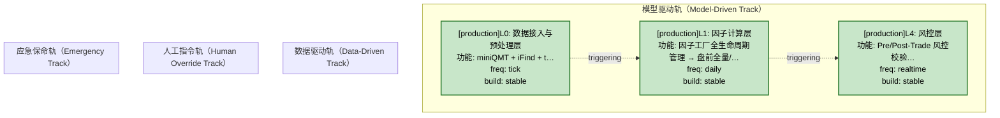

# 决策流图（decisiongraph）索引

> 生成时间: 2026-07-06T14:38:22
> 真源: `architecture_model/domain/decision_graph_model.yaml` → PostgreSQL `decision_*` 表（TRAE-061）
> 数据库: depgraph (PostgreSQL)

## 概述

决策流图（decisiongraph）是与依赖图（depgraph）、数据流图（dataflowgraph）正交的第三维度全景图。
- depgraph 表达"谁依赖谁"（模块依赖，静态）
- dataflowgraph 表达"数据从哪流到哪"（数据流向，动态）
- decisiongraph 表达"决策如何产生"（决策流，动态）
- 三图通过 `module_id` 关联：决策节点 → 实现模块（depgraph）→ 数据流作业（dataflowgraph）

## 统计

| 类型 | 数量 |
|------|------|
| Track（轨） | 4 |
| Layer（层） | 10 |
| Node（节点） | 0 |
| Edge（边） | 0 |
| 运营态 Layer（design_maturity=production） | 3 |
| 设计态 Layer（design_maturity=design） | 7 |
| 原型态 Layer（design_maturity=prototype） | 0 |
| 运营态 Node（design_maturity=production） | 0 |
| 设计态 Node（design_maturity=design） | 0 |

> **设计态 vs 运营态**：`design_maturity` 字段区分——`design`=蓝图规划（代码未写），`production`=实际代码已实现稳定运行，`prototype`=原型验证中。对标 depgraph 的设计态/运营态机制。

## Mermaid 图表

> 以下图表通过 Mermaid 代码块内嵌，可直接在 Markdown 查看器中渲染。

### 全景图（设计态 + 运营态合并，标签标注 [design]/[production]）

```mermaid
flowchart TD
    subgraph track_model_driven["模型驱动轨（Model-Driven Track）"]
        LL0["[production]L0: 数据接入与预处理层<br/>功能: miniQMT + iFind + t…<br/>freq: tick<br/>build: stable"]:::bsStable
        LL1["[production]L1: 因子计算层<br/>功能: 因子工厂全生命周期管理 → 盘前全量/…<br/>freq: daily<br/>build: stable"]:::bsStable
        LL2A["[design]L2A: 信号层<br/>功能: 信号工厂 → 多策略投票 → 收益率条…<br/>freq: daily<br/>build: planned"]:::bsPlanned
        LL2B["[design]L2B: 主力行为层<br/>功能: 六阶段识别 + 自迭代推演 + 庄家专…<br/>freq: daily<br/>build: planned"]:::bsPlanned
        LL2C["[design]L2C: 市场状态与大盘预测层<br/>功能: 3×3矩阵 + 2叠加态 + 三层大盘…<br/>freq: daily<br/>build: planned"]:::bsPlanned
        LL2D["[design]L2D: 知识图谱与因果推演层<br/>功能: 六类知识图谱 → 事件影响链分析 → …<br/>freq: daily<br/>build: planned"]:::bsPlanned
        LL3["[design]L3: 策略组合层<br/>功能: 多策略信号合成 → 资本分配 → 元策…<br/>freq: daily<br/>build: planned"]:::bsPlanned
        LL4["[production]L4: 风控层<br/>功能: Pre/Post-Trade 风控校验…<br/>freq: realtime<br/>build: stable"]:::bsStable
        LL5["[design]L5: 学习层<br/>功能: 7阶段学习流水线 → 模块工厂 → 知…<br/>freq: weekly<br/>build: planned"]:::bsPlanned
        LL6["[design]L6: 自评估层<br/>功能: LLM 自评估(Judge+交叉验证)…<br/>freq: weekly<br/>build: planned"]:::bsPlanned
    end
    subgraph track_data_driven["数据驱动轨（Data-Driven Track）"]
    end
    subgraph track_human_override["人工指令轨（Human Override Track）"]
    end
    subgraph track_emergency["应急保命轨（Emergency Track）"]
    end
    LL0 -.->|triggering| LL1
    LL1 -.->|triggering| LL2A
    LL2A -.->|triggering| LL2B
    LL2B -.->|triggering| LL2C
    LL2C -.->|triggering| LL2D
    LL2D -.->|triggering| LL3
    LL3 -.->|triggering| LL4
    LL4 -.->|triggering| LL5
    LL5 -.->|triggering| LL6

    classDef bsStable fill:#c8e6c9,stroke:#2e7d32,stroke-width:2px,color:#000
    classDef bsGenerated fill:#fff9c4,stroke:#f9a825,stroke-width:2px,color:#000
    classDef bsTesting fill:#ffe0b2,stroke:#ef6c00,stroke-width:2px,color:#000
    classDef bsPlanned fill:#e1f5fe,stroke:#0277bd,stroke-width:2px,color:#000,stroke-dasharray: 5 5
    classDef bsDeprecated fill:#ffcdd2,stroke:#c62828,stroke-width:2px,color:#000,stroke-dasharray: 5 5
```

### 运营态全景图（仅 design_maturity=production 的 layer/node）

> 仅展示已实现稳定运行的决策层/节点（共 3 层，0 边）。

### 设计态全景图（仅 design_maturity=design 的 layer/node）

> 仅展示蓝图规划中尚未实现的决策层/节点（共 7 层，0 边）。

```mermaid
flowchart TD
    subgraph track_model_driven["模型驱动轨（Model-Driven Track）"]
        LL2A["[design]L2A: 信号层<br/>功能: 信号工厂 → 多策略投票 → 收益率条…<br/>freq: daily<br/>build: planned"]:::bsPlanned
        LL2B["[design]L2B: 主力行为层<br/>功能: 六阶段识别 + 自迭代推演 + 庄家专…<br/>freq: daily<br/>build: planned"]:::bsPlanned
        LL2C["[design]L2C: 市场状态与大盘预测层<br/>功能: 3×3矩阵 + 2叠加态 + 三层大盘…<br/>freq: daily<br/>build: planned"]:::bsPlanned
        LL2D["[design]L2D: 知识图谱与因果推演层<br/>功能: 六类知识图谱 → 事件影响链分析 → …<br/>freq: daily<br/>build: planned"]:::bsPlanned
        LL3["[design]L3: 策略组合层<br/>功能: 多策略信号合成 → 资本分配 → 元策…<br/>freq: daily<br/>build: planned"]:::bsPlanned
        LL5["[design]L5: 学习层<br/>功能: 7阶段学习流水线 → 模块工厂 → 知…<br/>freq: weekly<br/>build: planned"]:::bsPlanned
        LL6["[design]L6: 自评估层<br/>功能: LLM 自评估(Judge+交叉验证)…<br/>freq: weekly<br/>build: planned"]:::bsPlanned
    end
    subgraph track_data_driven["数据驱动轨（Data-Driven Track）"]
    end
    subgraph track_human_override["人工指令轨（Human Override Track）"]
    end
    subgraph track_emergency["应急保命轨（Emergency Track）"]
    end
    LL2A -.->|triggering| LL2B
    LL2B -.->|triggering| LL2C
    LL2C -.->|triggering| LL2D
    LL2D -.->|triggering| LL3
    LL3 -.->|triggering| LL5
    LL5 -.->|triggering| LL6

    classDef bsStable fill:#c8e6c9,stroke:#2e7d32,stroke-width:2px,color:#000
    classDef bsGenerated fill:#fff9c4,stroke:#f9a825,stroke-width:2px,color:#000
    classDef bsTesting fill:#ffe0b2,stroke:#ef6c00,stroke-width:2px,color:#000
    classDef bsPlanned fill:#e1f5fe,stroke:#0277bd,stroke-width:2px,color:#000,stroke-dasharray: 5 5
    classDef bsDeprecated fill:#ffcdd2,stroke:#c62828,stroke-width:2px,color:#000,stroke-dasharray: 5 5
```

### 层级详情图（10 层卡片 + 频率/状态，标签标注 [design]/[production]）

```mermaid
flowchart LR
    LL0["[production] L0 数据接入与预处理层<br/>Data Ingestion & Preprocessing<br/>功能: miniQMT + iFind + t…<br/>频率: tick<br/>成熟度: production<br/>build: stable"]:::bsStable
    LL1["[production] L1 因子计算层<br/>Factor Calculation<br/>功能: 因子工厂全生命周期管理 → 盘前全量/…<br/>频率: daily<br/>成熟度: production<br/>build: stable"]:::bsStable
    LL2A["[design] L2A 信号层<br/>Signal Generation<br/>功能: 信号工厂 → 多策略投票 → 收益率条…<br/>频率: daily<br/>成熟度: design<br/>build: planned"]:::bsPlanned
    LL2B["[design] L2B 主力行为层<br/>Main Force Behavior Analysis<br/>功能: 六阶段识别 + 自迭代推演 + 庄家专…<br/>频率: daily<br/>成熟度: design<br/>build: planned"]:::bsPlanned
    LL2C["[design] L2C 市场状态与大盘预测层<br/>Market State & Index Prediction<br/>功能: 3×3矩阵 + 2叠加态 + 三层大盘…<br/>频率: daily<br/>成熟度: design<br/>build: planned"]:::bsPlanned
    LL2D["[design] L2D 知识图谱与因果推演层<br/>Knowledge Graph & Causal Inference<br/>功能: 六类知识图谱 → 事件影响链分析 → …<br/>频率: daily<br/>成熟度: design<br/>build: planned"]:::bsPlanned
    LL3["[design] L3 策略组合层<br/>Strategy & Portfolio Combination<br/>功能: 多策略信号合成 → 资本分配 → 元策…<br/>频率: daily<br/>成熟度: design<br/>build: planned"]:::bsPlanned
    LL4["[production] L4 风控层<br/>Risk Control<br/>功能: Pre/Post-Trade 风控校验…<br/>频率: realtime<br/>成熟度: production<br/>build: stable"]:::bsStable
    LL5["[design] L5 学习层<br/>Learning & Optimization<br/>功能: 7阶段学习流水线 → 模块工厂 → 知…<br/>频率: weekly<br/>成熟度: design<br/>build: planned"]:::bsPlanned
    LL6["[design] L6 自评估层<br/>Self Evaluation<br/>功能: LLM 自评估(Judge+交叉验证)…<br/>频率: weekly<br/>成熟度: design<br/>build: planned"]:::bsPlanned
    LL0 -->|triggering| LL1
    LL1 -->|triggering| LL2A
    LL2A -->|triggering| LL2B
    LL2B -->|triggering| LL2C
    LL2C -->|triggering| LL2D
    LL2D -->|triggering| LL3
    LL3 -->|triggering| LL4
    LL4 -->|triggering| LL5
    LL5 -->|triggering| LL6
    L6 -.->|feedback| L1
    L6 -.->|feedback| L5

    classDef bsStable fill:#c8e6c9,stroke:#2e7d32,stroke-width:2px,color:#000
    classDef bsGenerated fill:#fff9c4,stroke:#f9a825,stroke-width:2px,color:#000
    classDef bsTesting fill:#ffe0b2,stroke:#ef6c00,stroke-width:2px,color:#000
    classDef bsPlanned fill:#e1f5fe,stroke:#0277bd,stroke-width:2px,color:#000,stroke-dasharray: 5 5
    classDef bsDeprecated fill:#ffcdd2,stroke:#c62828,stroke-width:2px,color:#000,stroke-dasharray: 5 5
```

### 不变量图（6 节点类型 + 5 承重墙不变量）

## Track 清单（四轨）

| track_id | 名称 | 英文名 | 优先级 | 激活条件 |
|----------|------|--------|--------|----------|
| model_driven | 模型驱动轨 | Model-Driven Track | 1 | 正常运行时 |
| data_driven | 数据驱动轨 | Data-Driven Track | 2 | 模型驱动轨信号不足时补充 |
| human_override | 人工指令轨 | Human Override Track | 3 | 人工干预时 |
| emergency | 应急保命轨 | Emergency Track | 4 | 所有模型/策略/信号失效时 |

## Layer 清单（L0-L6）

| layer_id | 名称 | 英文名 | 所属轨 | 蓝图(module_id) | 蓝图名(派生) | 代码引用 | 功能简述 | 决策频率 | 成熟度 | build_status |
|----------|------|--------|--------|-----------------|--------------|----------|----------|----------|--------|--------------|
| L0 | 数据接入与预处理层 | Data Ingestion & Preprocessing | model_driven | - | - | - | miniQMT + iFind + tushare + 另类数据源 → 事件总线 → 分层时序存储 产出：tick_data / ohlc_bar / factor_input_data | tick | production | stable |
| L1 | 因子计算层 | Factor Calculation | model_driven | - | - | - | 因子工厂全生命周期管理 → 盘前全量/盘中增量双模计算 → 因子池 产出：factor_value（带 PIT 合规标记） | daily | production | stable |
| L2A | 信号层 | Signal Generation | model_driven | - | - | - | 信号工厂 → 多策略投票 → 收益率条件密度预测 → Transformer/Mamba时序增强 → 共形预测 产出：signal（Insight: direction/confidence/horizon） | daily | design | planned |
| L2B | 主力行为层 | Main Force Behavior Analysis | model_driven | - | - | - | 六阶段识别 + 自迭代推演 + 庄家专项 + 群体博弈模拟 产出：main_force_signal（主力行为画像） | daily | design | planned |
| L2C | 市场状态与大盘预测层 | Market State & Index Prediction | model_driven | - | - | - | 3×3矩阵 + 2叠加态 + 三层大盘预测 + T+1次日8态走势预测 + 体制转换检测(HMM/变点) 产出：market_state_prediction（大盘方向/波动率/体制判断） | daily | design | planned |
| L2D | 知识图谱与因果推演层 | Knowledge Graph & Causal Inference | model_driven | - | - | - | 六类知识图谱 → 事件影响链分析 → 因果传导推演 → GNN股票关系建模 → Causal ML 产出：causal_inference_result（因果推断结果） | daily | design | planned |
| L3 | 策略组合层 | Strategy & Portfolio Combination | model_driven | - | - | - | 多策略信号合成 → 资本分配 → 元策略路由 → 组合构建 产出：portfolio_target（PortfolioTarget: 目标仓位） | daily | design | planned |
| L4 | 风控层 | Risk Control | model_driven | - | - | - | Pre/Post-Trade 风控校验 + Kill Switch 熔断 + 止损评估 产出：risk_check（RiskDecision: approve/veto/adjust） | realtime | production | stable |
| L5 | 学习层 | Learning & Optimization | model_driven | - | - | - | 7阶段学习流水线 → 模块工厂 → 知识采集 → 反馈闭环 产出：learning_feedback（策略优化建议） | weekly | design | planned |
| L6 | 自评估层 | Self Evaluation | model_driven | - | - | - | LLM 自评估(Judge+交叉验证) + 多模态金融推理 + VeNRA零幻觉锚定 产出：self_evaluation（决策质量评估） | weekly | design | planned |
