# 买入决策流

> flow_stage: `buy_flow` | 映射层: ['L2A', 'L2B', 'L2C', 'L2D', 'L3'] | 产出契约: `buy_signal`

> **[可缩放 HTML 版 / Zoomable HTML](_zoomable_html/02_buy_flow.html)**
> — Ctrl+滚轮缩放 ｜ 双击重置 ｜ Ctrl+Shift+D 切换拖动/选择模式

## 大白话讲这个流程

买入流把候选池里的标的变成"买什么、买多少"的目标仓位。
四轨的信号在这里融合：
  - 模型驱动轨：L2A 信号 + L2B 主力行为 + L2C 大盘预测 + L2D 因果推演
  - 数据驱动轨：端到端 DL 信号补充
  - 人工指令轨：人工买入指令（优先级高）
  - 应急保命轨：降级时硬编码信号
融合后的信号进 L3 策略组合层：
  - 多策略信号合成（多个策略的信号加权/投票）
  - 元策略路由（按市场状态选策略族）
  - 资本分配（总资金分给各策略）
  - 组合构造（产出 portfolio_target：每只股票目标仓位）
portfolio_target 是买入流的终点，下一步进仓位裁决或直接进风控。


## 流程框图

```
候选池 candidate_pool
    │
    ├─→ 模型驱动轨 ──┐
    ├─→ 数据驱动轨 ──┤
    ├─→ 人工指令轨 ──┼─→ 四轨融合 → 信号合成 → 策略路由 → 资本分配 → 组合构造
    └─→ 应急保命轨 ──┘                                              │
                                                                        ▼
                                                              portfolio_target

```

## 决策流可视化（Mermaid）

> 本阶段决策节点 + 同阶段内依赖边。运营态蓝色实线，设计态橙色虚线。
> 网页版可 Ctrl+滚轮缩放查看细节。
> 图例：🟦 蓝色=运营态(production) ｜ 🟧 橙色虚线=设计态(design) ｜ 实线=运营态依赖 ｜ 虚线=非运营态依赖

```mermaid
%%{init: {'theme': 'base', 'themeVariables': {'primaryColor': '#eaeaea', 'primaryTextColor': '#333333', 'primaryBorderColor': '#666666', 'lineColor': '#666666', 'secondaryColor': '#eaeaea', 'tertiaryColor': '#eaeaea', 'fontSize': '14px'}}}%%
flowchart TD
    n177["(设计态 / design) Synthesizer 信号合成+权重分配<br/>signal | L2A | decision/signal/sg_01"]
    n178["(设计态 / design) Signal Priority Router 信号优先级路由<br/>signal | L2A | decision/signal/sg_02"]
    n179["(设计态 / design) LLM Strategy Agent LLM策略Agent<br/>signal | L2A | decision/signal/sg_03"]
    n180["(设计态 / design) Signal Tail Risk Protector 信号尾部风险保护<br/>signal | L2A | decision/signal/sg_04"]
    n181["(设计态 / design) A-Share Plan Conformity Evaluator A股计划吻合度评估<br/>signal | L2A | decision/signal/sg_05"]
    n182["(设计态 / design) A-Share Emergency Opportunity Evaluator A股应急机会评估<br/>signal | L2A | decision/signal/sg_06"]
    n183["(设计态 / design) A-Share Capital-Force Conflict Arbiter 主力游资冲突仲裁<br/>signal | L2A | decision/signal/sg_07"]
    n184["(设计态 / design) Regime Special Override Priority Manager Regime特殊覆盖优先级<br/>signal | L2A | decision/signal/sg_08"]
    n185["(设计态 / design) Risk-Signal Interaction Sequencer 风控-信号交互时序<br/>signal | L2A | decision/signal/sg_09"]
    n186["(设计态 / design) 36环节决策框架实现器 36-Step Decision Framework<br/>signal | L2A | decision/signal/sg_10"]
    n187["(设计态 / design) 策略替换与淘汰决策器 Strategy Replacement Decision<br/>signal | L2A | decision/signal/sg_11"]
    n188["(设计态 / design) 信号冲突解决 Signal Conflict Resolution<br/>signal | L2A | decision/signal/sg_12"]
    n189["(设计态 / design) 信号融合模块 Signal Fusion Module<br/>signal | L2A | decision/signal/sg_13"]
    n177 -.-> n178
    n178 -.-> n179
    n179 -.-> n180
    n180 -.-> n181
    n181 -.-> n182
    n182 -.-> n183
    n183 -.-> n184
    n184 -.-> n185
    n185 -.-> n186
    n186 -.-> n187
    n187 -.-> n188
    n188 -.-> n189
    classDef production fill:#e1f5fe,stroke:#01579b,stroke-width:2px,color:#000
    classDef design fill:#fff3e0,stroke:#e65100,stroke-width:2px,color:#000,stroke-dasharray: 5 5
    class n177,n178,n179,n180,n181,n182,n183,n184,n185,n186,n187,n188,n189 design
```



## 运营态节点（实盘主链路）

_（暂无已标定节点，待 Phase B 全量标定）_


## 指挥 AI 提示

改买入流时，先查 decisiongraph 里 flow_stage=buy_flow 的节点。
常见改动：调四轨融合权重、加策略、改资本分配规则。
注意：signal 节点不能直接连 order，必须经 portfolio_target（不变量 DEC-INV-002）。


## 子流程

### 四轨融合

四轨信号按优先级融合，人工 > 模型 > 数据，应急压制其他。

模块锚点: `MOD-L05-001`

### 信号合成

多策略信号加权/投票，产出统一信号。

模块锚点: `MOD-L05-001`

### 元策略路由

按市场状态（L2C 大盘预测）选策略族。

模块锚点: `MOD-L05-001`

### 资本分配

总资金分给各策略/标的。

模块锚点: `MOD-L05-001`

## 附录1·待施工（设计态节点）

| node_id | 决策名称 | 节点类型 | layer | module_id | path |
|---|---|---|---|---|---|
| 177 | Synthesizer 信号合成+权重分配 | signal | L2A | - | `decision/signal/sg_01` |
| 178 | Signal Priority Router 信号优先级路由 | signal | L2A | - | `decision/signal/sg_02` |
| 179 | LLM Strategy Agent LLM策略Agent | signal | L2A | - | `decision/signal/sg_03` |
| 180 | Signal Tail Risk Protector 信号尾部风险保护 | signal | L2A | - | `decision/signal/sg_04` |
| 181 | A-Share Plan Conformity Evaluator A股计划吻合度评估 | signal | L2A | - | `decision/signal/sg_05` |
| 182 | A-Share Emergency Opportunity Evaluator A股应急机会评估 | signal | L2A | - | `decision/signal/sg_06` |
| 183 | A-Share Capital-Force Conflict Arbiter 主力游资冲突仲裁 | signal | L2A | - | `decision/signal/sg_07` |
| 184 | Regime Special Override Priority Manager Regime特殊覆盖优先级 | signal | L2A | - | `decision/signal/sg_08` |
| 185 | Risk-Signal Interaction Sequencer 风控-信号交互时序 | signal | L2A | - | `decision/signal/sg_09` |
| 186 | 36环节决策框架实现器 36-Step Decision Framework | signal | L2A | - | `decision/signal/sg_10` |
| 187 | 策略替换与淘汰决策器 Strategy Replacement Decision | signal | L2A | - | `decision/signal/sg_11` |
| 188 | 信号冲突解决 Signal Conflict Resolution | signal | L2A | - | `decision/signal/sg_12` |
| 189 | 信号融合模块 Signal Fusion Module | signal | L2A | - | `decision/signal/sg_13` |


## 附录2·未来增强（候选库）

_从 candidate_module_registry.yaml 按 target_track 归类到本阶段；基础设施类候选（回测/仿真/灾备/死域）见 [总览](trading_flow_index.md) 跨阶段附录_

_（本阶段暂无候选模块）_

