# 卖出决策流

> flow_stage: `sell_flow` | 映射层: ['L2A', 'L3'] | 产出契约: `sell_signal`

> **[可缩放 HTML 版 / Zoomable HTML](http://localhost:8765/docs/02_enterprise_architecture/07_trading_decision_architecture/_zoomable_html/03_sell_flow.html)** — Ctrl+滚轮缩放 ｜ 双击重置 ｜ Ctrl+Shift+D 切换拖动/选择模式

## 大白话讲这个流程

卖出流决定"持仓里的哪只该卖、为什么卖、什么时候卖"。
卖出信号来源多，需要融合仲裁：
  ① 止损信号——跌破止损线
  ② 止盈信号——达到止盈目标
  ③ 信号反转——买入信号消失或反向
  ④ 风控触发——持仓触及风控红线
  ⑤ 主力行为——主力出货信号（L2B）
  ⑥ 大盘预警——大盘走弱需减仓（L2C）
  ⑦ 时间到期——持仓时间到上限
  ⑧ 人工卖出——人工指令
多源卖出信号融合仲裁，产出 sell_decision（卖/不卖/部分卖）。
卖出流和买入流共享信号源（共享信号注入层），但仲裁逻辑独立。


## 流程框图

```
持仓 position
    │
    ├─→ 止损信号     ──┐
    ├─→ 止盈信号     ──┤
    ├─→ 信号反转     ──┤
    ├─→ 风控触发     ──┤
    ├─→ 主力出货     ──┼─→ 卖出信号融合仲裁 → sell_decision（卖/不卖/部分卖）
    ├─→ 大盘预警     ──┤
    ├─→ 时间到期     ──┤
    └─→ 人工卖出     ──┘

```

## 决策流可视化（Mermaid）

> 本阶段决策节点 + 同阶段内依赖边。运营态蓝色实线，设计态橙色虚线。
> 网页版可 Ctrl+滚轮缩放查看细节。
> 图例：🟦 蓝色=运营态(production) ｜ 🟧 橙色虚线=设计态(design) ｜ 实线=运营态依赖 ｜ 虚线=非运营态依赖

```mermaid
%%{init: {'theme': 'base', 'themeVariables': {'primaryColor': '#eaeaea', 'primaryTextColor': '#333333', 'primaryBorderColor': '#666666', 'lineColor': '#666666', 'secondaryColor': '#eaeaea', 'tertiaryColor': '#eaeaea', 'fontSize': '14px'}}}%%
flowchart TD
    n1["(设计态 / design) 卖出决策域入口 Sell Decision Entry<br/>sell_decision | L2A | decision/sell/sell_00"]
    n2["(设计态 / design) 止盈信号 Take-Profit Signal<br/>sell_decision | L2A | decision/sell/sell_01"]
    n3["(设计态 / design) 止损信号 Stop-Loss Signal<br/>sell_decision | L2A | decision/sell/sell_02"]
    n4["(设计态 / design) 移动止损 Trailing Stop<br/>sell_decision | L2A | decision/sell/sell_03"]
    n5["(设计态 / design) 主力出货信号 Main Force Distribution Signal<br/>sell_decision | L2A | decision/sell/sell_04"]
    n6["(设计态 / design) 量价背离卖出 Volume-Price Divergence Sell<br/>sell_decision | L2A | decision/sell/sell_05"]
    n7["(设计态 / design) 突破关键位卖出 Key-Level Breakdown Sell<br/>sell_decision | L2A | decision/sell/sell_06"]
    n8["(设计态 / design) Watch List 实时卖出 Watch List Realtime Sell<br/>sell_decision | L2A | decision/sell/sell_07"]
    n9["(设计态 / design) Monitor List 定期扫描 Monitor List Periodic Scan<br/>sell_decision | L2A | decision/sell/sell_08"]
    n10["(设计态 / design) 卖出信号融合仲裁 Sell Signal Fusion Arbiter<br/>sell_decision | L2A | decision/sell/sell_09"]
    n11["(设计态 / design) 买卖冲突仲裁 Buy-Sell Conflict Arbiter<br/>sell_decision | L2A | decision/sell/sell_10"]
    n12["(设计态 / design) 部分卖出vs全部清仓决策 Partial vs Full Sell Decision<br/>sell_decision | L2A | decision/sell/sell_11"]
    n13["(设计态 / design) D-S证据理论融合 D-S Evidence Theory Fusion<br/>sell_decision | L2A | decision/sell/sell_12"]
    n14["(设计态 / design) 做T决策协调 T-Trade Coordinator<br/>sell_decision | L2A | decision/sell/sell_13"]
    n15["(设计态 / design) 黑天鹅强制卖出 Black Swan Forced Sell<br/>sell_decision | L2A | decision/sell/sell_14"]
    n16["(设计态 / design) Gap开盘决策框架 Gap Opening Decision Framework<br/>sell_decision | L2A | decision/sell/sell_15"]
    n17["(设计态 / design) 强制清仓信号 Forced Liquidation Signal<br/>sell_decision | L2A | decision/sell/sell_16"]
    n18["(设计态 / design) 卖出降级模式 Sell Degradation Mode<br/>sell_decision | L2A | decision/sell/sell_17"]
    n19["(设计态 / design) 卖出决策闭环优化 Sell Decision Closed-Loop<br/>sell_decision | L2A | decision/sell/sell_18"]
    n1 -.-> n2
    n2 -.-> n3
    n3 -.-> n4
    n4 -.-> n5
    n5 -.-> n6
    n6 -.-> n7
    n7 -.-> n8
    n8 -.-> n9
    n9 -.-> n10
    n10 -.-> n11
    n11 -.-> n12
    n12 -.-> n13
    n13 -.-> n14
    n14 -.-> n15
    n15 -.-> n16
    n16 -.-> n17
    n17 -.-> n18
    n18 -.-> n19
    classDef production fill:#e1f5fe,stroke:#01579b,stroke-width:2px,color:#000
    classDef design fill:#fff3e0,stroke:#e65100,stroke-width:2px,color:#000,stroke-dasharray: 5 5
    class n1,n2,n3,n4,n5,n6,n7,n8,n9,n10,n11,n12,n13,n14,n15,n16,n17,n18,n19 design
```



## 运营态节点（实盘主链路）

_（暂无已标定节点，待 Phase B 全量标定）_


## 指挥 AI 提示

改卖出流时，先查 decisiongraph 里 flow_stage=sell_flow 的节点（sell_decision 类型）。
常见改动：调止损/止盈阈值、加卖出触发源、改融合仲裁权重。
注意：sell_decision 节点不能直接连 order，必须经 portfolio_target（不变量 DEC-INV-002）。


## 子流程

### 止损信号

跌破止损线触发卖出。

模块锚点: `MOD-L04-001`

### 止盈信号

达到止盈目标触发卖出。

模块锚点: `MOD-L05-001`

### 信号反转

买入信号消失或反向触发卖出。

模块锚点: `MOD-L05-001`

### 卖出信号融合仲裁

多源卖出信号融合，产出 sell_decision。

模块锚点: `MOD-L05-001`

## 附录1·待施工（设计态节点）

| node_id | 决策名称 | 节点类型 | layer | module_id | path |
|---|---|---|---|---|---|
| 1 | 卖出决策域入口 Sell Decision Entry | sell_decision | L2A | - | `decision/sell/sell_00` |
| 2 | 止盈信号 Take-Profit Signal | sell_decision | L2A | - | `decision/sell/sell_01` |
| 3 | 止损信号 Stop-Loss Signal | sell_decision | L2A | - | `decision/sell/sell_02` |
| 4 | 移动止损 Trailing Stop | sell_decision | L2A | - | `decision/sell/sell_03` |
| 5 | 主力出货信号 Main Force Distribution Signal | sell_decision | L2A | - | `decision/sell/sell_04` |
| 6 | 量价背离卖出 Volume-Price Divergence Sell | sell_decision | L2A | - | `decision/sell/sell_05` |
| 7 | 突破关键位卖出 Key-Level Breakdown Sell | sell_decision | L2A | - | `decision/sell/sell_06` |
| 8 | Watch List 实时卖出 Watch List Realtime Sell | sell_decision | L2A | - | `decision/sell/sell_07` |
| 9 | Monitor List 定期扫描 Monitor List Periodic Scan | sell_decision | L2A | - | `decision/sell/sell_08` |
| 10 | 卖出信号融合仲裁 Sell Signal Fusion Arbiter | sell_decision | L2A | - | `decision/sell/sell_09` |
| 11 | 买卖冲突仲裁 Buy-Sell Conflict Arbiter | sell_decision | L2A | - | `decision/sell/sell_10` |
| 12 | 部分卖出vs全部清仓决策 Partial vs Full Sell Decision | sell_decision | L2A | - | `decision/sell/sell_11` |
| 13 | D-S证据理论融合 D-S Evidence Theory Fusion | sell_decision | L2A | - | `decision/sell/sell_12` |
| 14 | 做T决策协调 T-Trade Coordinator | sell_decision | L2A | - | `decision/sell/sell_13` |
| 15 | 黑天鹅强制卖出 Black Swan Forced Sell | sell_decision | L2A | - | `decision/sell/sell_14` |
| 16 | Gap开盘决策框架 Gap Opening Decision Framework | sell_decision | L2A | - | `decision/sell/sell_15` |
| 17 | 强制清仓信号 Forced Liquidation Signal | sell_decision | L2A | - | `decision/sell/sell_16` |
| 18 | 卖出降级模式 Sell Degradation Mode | sell_decision | L2A | - | `decision/sell/sell_17` |
| 19 | 卖出决策闭环优化 Sell Decision Closed-Loop | sell_decision | L2A | - | `decision/sell/sell_18` |


## 附录2·未来增强（候选库）

_从 candidate_module_registry.yaml 按 target_track 归类到本阶段；基础设施类候选（回测/仿真/灾备/死域）见 [总览](trading_flow_index.md) 跨阶段附录_

_（本阶段暂无候选模块）_

