# 仓位裁决

> flow_stage: `position_management` | 映射层: ['L3'] | 产出契约: `target_position`

> **[可缩放 HTML 版 / Zoomable HTML](http://localhost:8765/docs/02_enterprise_architecture/07_trading_decision_architecture/_zoomable_html/04_position_flow.html)** — Ctrl+滚轮缩放 ｜ 双击重置 ｜ Ctrl+Shift+D 切换拖动/选择模式

## 大白话讲这个流程

仓位裁决把"想买多少"变成"实际能买多少"。
portfolio_target 进来后，经过多层约束裁决：
  - 单票上限：单只股票不超过总资金的 N%
  - 行业集中度：单行业不超过 M%
  - 总仓位上限：总持仓不超过总资金的 K%
  - 资金可用性：可用资金是否够
  - 持仓冲突：和现有持仓是否冲突
裁决后产出 portfolio_target_adjusted（实际目标仓位）。
仓位裁决是实盘同构的关键——回测引擎必须串入仓位裁决，不能跳过。
D_POSITION 域当前实现率仅 10%，是实盘主链路的关键缺口。


## 流程框图

```
portfolio_target（想买多少）
    │
    ├─ 单票上限约束    ──┐
    ├─ 行业集中度约束  ──┤
    ├─ 总仓位上限约束  ──┼─→ 仓位裁决 → portfolio_target_adjusted（实际能买多少）
    ├─ 资金可用性检查  ──┤
    └─ 持仓冲突检查    ──┘

```

## 决策流可视化（Mermaid）

> 本阶段决策节点 + 同阶段内依赖边。运营态蓝色实线，设计态橙色虚线。
> 网页版可 Ctrl+滚轮缩放查看细节。
> 图例：🟦 蓝色=运营态(production) ｜ 🟧 橙色虚线=设计态(design) ｜ 实线=运营态依赖 ｜ 虚线=非运营态依赖

```mermaid
%%{init: {'theme': 'base', 'themeVariables': {'primaryColor': '#eaeaea', 'primaryTextColor': '#333333', 'primaryBorderColor': '#666666', 'lineColor': '#666666', 'secondaryColor': '#eaeaea', 'tertiaryColor': '#eaeaea', 'clusterBkg': '#eaeaea', 'clusterBorder': '#888888', 'fontSize': '14px'}}}%%
flowchart TD
    n20["(设计态 / design) 组合核心引擎 Portfolio Core Engine<br/>portfolio_target | L3 | decision/pf_core/pc_01"]
    n21["(设计态 / design) 半Kelly硬上限 Half-Kelly Hard Cap<br/>portfolio_target | L3 | decision/pf_core/pc_02"]
    n22["(设计态 / design) 风险预算 Risk Budget<br/>portfolio_target | L3 | decision/pf_core/pc_03"]
    n23["(设计态 / design) 再平衡决策 Rebalance Decision<br/>portfolio_target | L3 | decision/pf_core/pc_04"]
    n24["(设计态 / design) 仲裁优先级体系 Arbitration Priority<br/>portfolio_target | L3 | decision/pf_core/pc_05"]
    n25["(设计态 / design) 多策略共振融合 Strategy Convergence Fusion<br/>portfolio_target | L3 | decision/pf_core/pc_06"]
    n26["(设计态 / design) 因子直通裁决 Factor Bypass Arbitration<br/>portfolio_target | L3 | decision/pf_core/pc_07"]
    n27["(设计态 / design) 元策略路由 Meta-Strategy Router<br/>portfolio_target | L3 | decision/pf_core/pc_08"]
    n28["(设计态 / design) 组合优化 Portfolio Optimization<br/>portfolio_target | L3 | decision/pf_core/pc_09"]
    n29["(设计态 / design) 资本分配 Capital Allocation<br/>portfolio_target | L3 | decision/pf_core/pc_10"]
    n30["(设计态 / design) 决策编排器 Decision Orchestrator<br/>portfolio_target | L3 | decision/pf_core/pc_11"]
    n31["(设计态 / design) 四轨融合器 Multi-Track Fusion<br/>portfolio_target | L3 | decision/pf_core/pc_12"]
    n32["(设计态 / design) 策略分配 Strategy Allocation<br/>portfolio_target | L3 | decision/pf_alloc/pa_01"]
    n33["(设计态 / design) 风险平价 Risk Parity<br/>portfolio_target | L3 | decision/pf_alloc/pa_02"]
    n34["(设计态 / design) 动态权重 Dynamic Weighting<br/>portfolio_target | L3 | decision/pf_alloc/pa_03"]
    n35["(设计态 / design) 策略权重再平衡 Strategy Weight Rebalance<br/>portfolio_target | L3 | decision/pf_alloc/pa_04"]
    n36["(设计态 / design) 多策略共识 Multi-Strategy Consensus<br/>portfolio_target | L3 | decision/pf_alloc/pa_05"]
    n37["(设计态 / design) 元策略选择 Meta-Strategy Selection<br/>portfolio_target | L3 | decision/pf_alloc/pa_06"]
    n38["(设计态 / design) 仓位唯一裁决中心 C-047 Position Sole Arbiter<br/>portfolio_target | L3 | decision/position/pos_01"]
    n39["(设计态 / design) 持仓状态机 Position State Machine<br/>portfolio_target | L3 | decision/position/pos_02"]
    n40["(设计态 / design) 仓位漂移监控 Position Drift Monitor<br/>portfolio_target | L3 | decision/position/pos_03"]
    n41["(设计态 / design) Kelly仓位决策 Kelly Position Decision<br/>portfolio_target | L3 | decision/position/pos_04"]
    n42["(设计态 / design) 风险配额 Risk Quota<br/>portfolio_target | L3 | decision/position/pos_05"]
    n43["(设计态 / design) 11种市场状态→仓位上限 Market State Position Cap<br/>portfolio_target | L3 | decision/position/pos_06"]
    n44["(设计态 / design) 组合层决策 Portfolio Layer Decision<br/>portfolio_target | L3 | decision/position/pos_07"]
    n45["(设计态 / design) 策略层决策 Strategy Layer Decision<br/>portfolio_target | L3 | decision/position/pos_08"]
    n46["(设计态 / design) 标层决策 Instrument Layer Decision<br/>portfolio_target | L3 | decision/position/pos_09"]
    n47["(设计态 / design) 动态层决策 Dynamic Layer Decision<br/>portfolio_target | L3 | decision/position/pos_10"]
    n48["(设计态 / design) 再平衡触发 Rebalance Trigger<br/>portfolio_target | L3 | decision/position/pos_11"]
    n49["(设计态 / design) 仓位上限硬约束 Position Cap Hard Constraint<br/>portfolio_target | L3 | decision/position/pos_12"]
    n50["(设计态 / design) REDUCING→EXITING状态转换 REDUCING to EXITING<br/>portfolio_target | L3 | decision/position/pos_13"]
    n51["(设计态 / design) 风险预算→Kelly决策 Risk Budget to Kelly<br/>portfolio_target | L3 | decision/position/pos_14"]
    n52["(设计态 / design) 半Kelly硬上限 Half-Kelly Hard Cap<br/>portfolio_target | L3 | decision/position/pos_15"]
    n53["(设计态 / design) 仓位降级 Position Degradation<br/>portfolio_target | L3 | decision/position/pos_16"]
    n54["(设计态 / design) 持仓状态→卖出阈值 Position State to Sell Threshold<br/>portfolio_target | L3 | decision/position/pos_17"]
    n55["(设计态 / design) 仓位四轨决策 Position Four-Track Decision<br/>portfolio_target | L3 | decision/position/pos_18"]
    n56["(设计态 / design) 仓位裁决→执行 Position Arbitration to Execution<br/>portfolio_target | L3 | decision/position/pos_19"]
    n32 -.-> n33
    n33 -.-> n34
    n34 -.-> n35
    n35 -.-> n36
    n36 -.-> n37
    n37 -.-> n20
    n20 -.-> n21
    n21 -.-> n22
    n22 -.-> n23
    n23 -.-> n24
    n24 -.-> n25
    n25 -.-> n26
    n26 -.-> n27
    n27 -.-> n28
    n28 -.-> n29
    n29 -.-> n30
    n30 -.-> n31
    n31 -.-> n38
    n38 -.-> n39
    n39 -.-> n40
    n40 -.-> n41
    n41 -.-> n42
    n42 -.-> n43
    n43 -.-> n44
    n44 -.-> n45
    n45 -.-> n46
    n46 -.-> n47
    n47 -.-> n48
    n48 -.-> n49
    n49 -.-> n50
    n50 -.-> n51
    n51 -.-> n52
    n52 -.-> n53
    n53 -.-> n54
    n54 -.-> n55
    n55 -.-> n56
    classDef production fill:#e1f5fe,stroke:#01579b,stroke-width:2px,color:#000
    classDef design fill:#fff3e0,stroke:#e65100,stroke-width:2px,color:#000,stroke-dasharray: 5 5
    class n20,n21,n22,n23,n24,n25,n26,n27,n28,n29,n30,n31,n32,n33,n34,n35,n36,n37,n38,n39,n40,n41,n42,n43,n44,n45,n46,n47,n48,n49,n50,n51,n52,n53,n54,n55,n56 design
```



## 运营态节点（实盘主链路）

_（暂无已标定节点，待 Phase B 全量标定）_


## 指挥 AI 提示

改仓位裁决时，先查 decisiongraph 里 flow_stage=position_management 的节点。
常见改动：调上限阈值、加约束规则、改裁决顺序。
实盘同构：回测引擎必须调用仓位裁决，不能跳过（D_POSITION 实现率缺口）。


## 子流程

### 单票上限

单只股票不超过总资金的 N%。

模块锚点: `MOD-L04-001`

### 行业集中度

单行业不超过 M%。

模块锚点: `MOD-L04-001`

### 总仓位上限

总持仓不超过总资金的 K%。

模块锚点: `MOD-L04-001`

## 附录1·待施工（设计态节点）

| node_id | 决策名称 | 节点类型 | layer | module_id | path |
|---|---|---|---|---|---|
| 20 | 组合核心引擎 Portfolio Core Engine | portfolio_target | L3 | MOD-L05-001 | `decision/pf_core/pc_01` |
| 21 | 半Kelly硬上限 Half-Kelly Hard Cap | portfolio_target | L3 | MOD-L05-001 | `decision/pf_core/pc_02` |
| 22 | 风险预算 Risk Budget | portfolio_target | L3 | MOD-L05-001 | `decision/pf_core/pc_03` |
| 23 | 再平衡决策 Rebalance Decision | portfolio_target | L3 | MOD-L05-001 | `decision/pf_core/pc_04` |
| 24 | 仲裁优先级体系 Arbitration Priority | portfolio_target | L3 | MOD-L05-001 | `decision/pf_core/pc_05` |
| 25 | 多策略共振融合 Strategy Convergence Fusion | portfolio_target | L3 | MOD-L05-001 | `decision/pf_core/pc_06` |
| 26 | 因子直通裁决 Factor Bypass Arbitration | portfolio_target | L3 | MOD-L05-001 | `decision/pf_core/pc_07` |
| 27 | 元策略路由 Meta-Strategy Router | portfolio_target | L3 | MOD-L05-001 | `decision/pf_core/pc_08` |
| 28 | 组合优化 Portfolio Optimization | portfolio_target | L3 | MOD-L05-001 | `decision/pf_core/pc_09` |
| 29 | 资本分配 Capital Allocation | portfolio_target | L3 | MOD-L05-001 | `decision/pf_core/pc_10` |
| 30 | 决策编排器 Decision Orchestrator | portfolio_target | L3 | MOD-L05-001 | `decision/pf_core/pc_11` |
| 31 | 四轨融合器 Multi-Track Fusion | portfolio_target | L3 | MOD-L05-001 | `decision/pf_core/pc_12` |
| 32 | 策略分配 Strategy Allocation | portfolio_target | L3 | MOD-L05-001 | `decision/pf_alloc/pa_01` |
| 33 | 风险平价 Risk Parity | portfolio_target | L3 | MOD-L05-001 | `decision/pf_alloc/pa_02` |
| 34 | 动态权重 Dynamic Weighting | portfolio_target | L3 | MOD-L05-001 | `decision/pf_alloc/pa_03` |
| 35 | 策略权重再平衡 Strategy Weight Rebalance | portfolio_target | L3 | MOD-L05-001 | `decision/pf_alloc/pa_04` |
| 36 | 多策略共识 Multi-Strategy Consensus | portfolio_target | L3 | MOD-L05-001 | `decision/pf_alloc/pa_05` |
| 37 | 元策略选择 Meta-Strategy Selection | portfolio_target | L3 | MOD-L05-001 | `decision/pf_alloc/pa_06` |
| 38 | 仓位唯一裁决中心 C-047 Position Sole Arbiter | portfolio_target | L3 | MOD-L05-001 | `decision/position/pos_01` |
| 39 | 持仓状态机 Position State Machine | portfolio_target | L3 | MOD-L05-001 | `decision/position/pos_02` |
| 40 | 仓位漂移监控 Position Drift Monitor | portfolio_target | L3 | MOD-L05-001 | `decision/position/pos_03` |
| 41 | Kelly仓位决策 Kelly Position Decision | portfolio_target | L3 | MOD-L05-001 | `decision/position/pos_04` |
| 42 | 风险配额 Risk Quota | portfolio_target | L3 | MOD-L05-001 | `decision/position/pos_05` |
| 43 | 11种市场状态→仓位上限 Market State Position Cap | portfolio_target | L3 | MOD-L05-001 | `decision/position/pos_06` |
| 44 | 组合层决策 Portfolio Layer Decision | portfolio_target | L3 | MOD-L05-001 | `decision/position/pos_07` |
| 45 | 策略层决策 Strategy Layer Decision | portfolio_target | L3 | MOD-L05-001 | `decision/position/pos_08` |
| 46 | 标层决策 Instrument Layer Decision | portfolio_target | L3 | MOD-L05-001 | `decision/position/pos_09` |
| 47 | 动态层决策 Dynamic Layer Decision | portfolio_target | L3 | MOD-L05-001 | `decision/position/pos_10` |
| 48 | 再平衡触发 Rebalance Trigger | portfolio_target | L3 | MOD-L05-001 | `decision/position/pos_11` |
| 49 | 仓位上限硬约束 Position Cap Hard Constraint | portfolio_target | L3 | MOD-L05-001 | `decision/position/pos_12` |
| 50 | REDUCING→EXITING状态转换 REDUCING to EXITING | portfolio_target | L3 | MOD-L05-001 | `decision/position/pos_13` |
| 51 | 风险预算→Kelly决策 Risk Budget to Kelly | portfolio_target | L3 | MOD-L05-001 | `decision/position/pos_14` |
| 52 | 半Kelly硬上限 Half-Kelly Hard Cap | portfolio_target | L3 | MOD-L05-001 | `decision/position/pos_15` |
| 53 | 仓位降级 Position Degradation | portfolio_target | L3 | MOD-L05-001 | `decision/position/pos_16` |
| 54 | 持仓状态→卖出阈值 Position State to Sell Threshold | portfolio_target | L3 | MOD-L05-001 | `decision/position/pos_17` |
| 55 | 仓位四轨决策 Position Four-Track Decision | portfolio_target | L3 | MOD-L05-001 | `decision/position/pos_18` |
| 56 | 仓位裁决→执行 Position Arbitration to Execution | portfolio_target | L3 | MOD-L05-001 | `decision/position/pos_19` |


## 附录2·未来增强（候选库）

_从 candidate_module_registry.yaml 按 target_track 归类到本阶段；基础设施类候选（回测/仿真/灾备/死域）见 [总览](trading_flow_index.md) 跨阶段附录_

_（本阶段暂无候选模块）_

