# 执行

> flow_stage: `execution` | 映射层: ['L3', 'L4'] | 产出契约: `executed_order`

> **[可缩放 HTML 版 / Zoomable HTML](_zoomable_html/05_execution_flow.html)**
> — Ctrl+滚轮缩放 ｜ 双击重置 ｜ Ctrl+Shift+D 切换拖动/选择模式

## 大白话讲这个流程

执行把目标仓位变成真实成交。
流程：portfolio_target_adjusted → 风控审批 → 订单生成 → 智能路由 → 撮合 → 成交。
风控一票否决铁律：order 节点必须有至少一条 approving 入边来自 risk_check
（不变量 DEC-INV-001）。风控不批，订单不下。
订单生命周期状态机：
  submit → ack → partial_fill → fill → complete
           │
           └→ cancel（撤单）
智能路由（SOR）决定订单发到哪个渠道（miniqmt/akshare 等）。
四模式开关在这一层生效：backtest 模拟撮合、paper 不成交、shadow 不下单、live 真实下单。


## 流程框图

```
portfolio_target_adjusted
    │
    ▼
risk_check（风控审批，一票否决）
    │ approving
    ▼
order 生成 ──→ SOR 智能路由 ──→ 撮合引擎
                                    │
    ┌───────────────────────────────┘
    ▼
submit → ack → partial_fill → fill → complete
             │
             └→ cancel
（模式开关：backtest/paper/shadow/live 在此层切换）

```

## 决策流可视化（Mermaid）

> 本阶段决策节点 + 同阶段内依赖边。运营态蓝色实线，设计态橙色虚线。
> 网页版可 Ctrl+滚轮缩放查看细节。
> 图例：🟦 蓝色=运营态(production) ｜ 🟧 橙色虚线=设计态(design) ｜ 实线=运营态依赖 ｜ 虚线=非运营态依赖

```mermaid
%%{init: {'theme': 'base', 'themeVariables': {'primaryColor': '#eaeaea', 'primaryTextColor': '#333333', 'primaryBorderColor': '#666666', 'lineColor': '#666666', 'secondaryColor': '#eaeaea', 'tertiaryColor': '#eaeaea', 'fontSize': '14px'}}}%%
flowchart TD
    n57["(设计态 / design) Pre-Trade主链6项检查 Pre-Trade Main Chain 6 Checks<br/>compliance_check | L4 | decision/ex_core/ex_01"]
    n58["(设计态 / design) Kill Switch 5层防御 Kill Switch 5-Layer Defense<br/>risk_check | L4 | decision/ex_core/ex_02"]
    n59["(设计态 / design) 50ms SLA Fail-Closed 50ms SLA Fail-Closed<br/>order | L3 | decision/ex_core/ex_03"]
    n60["(设计态 / design) Saga编排式事务 Saga Orchestrated Transaction<br/>order | L3 | decision/ex_core/ex_04"]
    n61["(设计态 / design) 风控检查 Risk Check<br/>order | L3 | decision/ex_core/ex_05"]
    n62["(设计态 / design) 信号确认 Signal Confirmation<br/>order | L3 | decision/ex_core/ex_06"]
    n63["(设计态 / design) 下单提交 Order Submit<br/>order | L3 | decision/ex_core/ex_07"]
    n64["(设计态 / design) 成交确认 Fill Confirmation<br/>order | L3 | decision/ex_core/ex_08"]
    n65["(设计态 / design) 持仓更新 Position Update<br/>order | L3 | decision/ex_core/ex_09"]
    n66["(设计态 / design) 报告生成 Report Generation<br/>order | L3 | decision/ex_core/ex_10"]
    n67["(设计态 / design) Kill Switch AI自动激活 Kill Switch AI Auto Trigger<br/>risk_check | L4 | decision/ex_core/ex_11"]
    n68["(设计态 / design) Kill Switch人工激活 Kill Switch Manual Trigger<br/>risk_check | L4 | decision/ex_core/ex_12"]
    n69["(设计态 / design) Kill Switch定时激活 Kill Switch Timer Trigger<br/>risk_check | L4 | decision/ex_core/ex_13"]
    n70["(设计态 / design) Kill Switch外部信号激活 Kill Switch External Signal<br/>risk_check | L4 | decision/ex_core/ex_14"]
    n71["(设计态 / design) 流动性螺旋3阶段 Liquidity Spiral 3-Phase<br/>order | L3 | decision/ex_core/ex_15"]
    n72["(设计态 / design) 订单路由决策 Order Routing Decision<br/>order | L3 | decision/ex_sor/ex_16"]
    n73["(设计态 / design) SOR路由决策延迟 SOR Routing Latency<br/>order | L3 | decision/ex_sor/ex_17"]
    n74["(设计态 / design) 券商连接熔断+故障转移 Broker Circuit Breaker<br/>risk_check | L4 | decision/ex_sor/ex_18"]
    n75["(设计态 / design) 交易通道熔断人工恢复 Trading Channel Manual Recovery<br/>order | L3 | decision/ex_sor/ex_19"]
    n76["(设计态 / design) Pre-Trade合规检查流水线 Pre-Trade Compliance Pipeline<br/>compliance_check | L4 | decision/ex_sor/ex_20"]
    n77["(设计态 / design) Kill-Switch四级阶梯 Kill-Switch 4-Level Cascade<br/>order | L3 | decision/ex_sor/ex_21"]
    n78["(设计态 / design) 熔断器矩阵 Circuit Breaker Matrix<br/>order | L3 | decision/ex_sor/ex_22"]
    n79["(设计态 / design) 行为准入门禁 Behavioral Admission Gateway<br/>compliance_check | L4 | decision/ex_sor/ex_23"]
    n80["(设计态 / design) 风控熔断事件 Risk Circuit Breaker Event<br/>risk_check | L4 | decision/risk/rk_01"]
    n81["(设计态 / design) 三层防线 Three Defense Lines<br/>risk_check | L4 | decision/risk/rk_02"]
    n82["(设计态 / design) 双引擎风控 Dual Engine Risk<br/>risk_check | L4 | decision/risk/rk_03"]
    n83["(设计态 / design) 4级风控决策门控 4-Level Risk Decision Gate<br/>risk_check | L4 | decision/risk/rk_04"]
    n84["(设计态 / design) 压力测试引擎 Stress Test Engine<br/>risk_check | L4 | decision/risk/rk_05"]
    n85["(设计态 / design) 黑天鹅模式库 Black Swan Pattern Library<br/>risk_check | L4 | decision/risk/rk_06"]
    n86["(设计态 / design) 流动性危机模拟 Liquidity Crisis Simulation<br/>risk_check | L4 | decision/risk/rk_07"]
    n87["(设计态 / design) 反向压力测试4步法 Reverse Stress Test 4-Step<br/>risk_check | L4 | decision/risk/rk_08"]
    n88["(设计态 / design) 二阶效应与传染模型 Second-Order Effect Model<br/>risk_check | L4 | decision/risk/rk_09"]
    n89["(设计态 / design) 风控否决权 Risk Veto<br/>risk_check | L4 | decision/risk/rk_10"]
    n90["(设计态 / design) 风控状态 Risk State<br/>risk_check | L4 | decision/risk/rk_11"]
    n91["(设计态 / design) 风控参数变更审批 Risk Parameter Approval<br/>risk_check | L4 | decision/risk/rk_12"]
    n92["(设计态 / design) 熔断恢复确认 Circuit Breaker Recovery Confirm<br/>risk_check | L4 | decision/risk/rk_13"]
    n93["(设计态 / design) OBSERVING软止损观察期 OBSERVING Soft Stop<br/>risk_check | L4 | decision/risk/rk_14"]
    n94["(设计态 / design) 风险预算 Risk Budget<br/>risk_check | L4 | decision/risk/rk_15"]
    n95["(设计态 / design) VaR计算 VaR Calculation<br/>risk_check | L4 | decision/risk/rk_16"]
    n96["(设计态 / design) 回撤监控 Drawdown Monitor<br/>risk_check | L4 | decision/risk/rk_17"]
    n97["(设计态 / design) 风控信号交互时序 Risk-Signal Timing<br/>risk_check | L4 | decision/risk/rk_18"]
    n98["(设计态 / design) 风控事件 Risk Event<br/>risk_check | L4 | decision/risk/rk_19"]
    n99["(设计态 / design) FLATTEN硬编码触发 FLATTEN Hardcoded Trigger<br/>risk_check | L4 | decision/risk/rk_20"]
    n100["(设计态 / design) 5级风险否决引擎 5-Level Risk Veto Engine<br/>risk_check | L4 | decision/risk/rk_21"]
    n101["(设计态 / design) Pod级止损 Pod-Level Stop Loss<br/>risk_check | L4 | decision/risk/rk_22"]
    n102["(设计态 / design) 外部订单观察者 External Order Watcher<br/>order | L3 | decision/trading/trd_01"]
    n103["(设计态 / design) 结算引擎 Settlement Engine<br/>order | L3 | decision/trading/trd_02"]
    n104["(设计态 / design) 公司行动 Corporate Action<br/>order | L3 | decision/trading/trd_03"]
    n105["(设计态 / design) 保证金管理 Margin Manager<br/>order | L3 | decision/trading/trd_04"]
    n106["(设计态 / design) 多账户 Multi-Account<br/>order | L3 | decision/trading/trd_05"]
    n107["(设计态 / design) 微信枢纽 WeChat Hub<br/>order | L3 | decision/trading/trd_06"]
    n108["(设计态 / design) C-013 4级优先级 C-013 4-Level Priority<br/>order | L3 | decision/trading/trd_07"]
    n109["(设计态 / design) A股交易纪律四项必做 A-Share Trading 4-Do<br/>order | L3 | decision/trading/trd_08"]
    n110["(设计态 / design) A股交易纪律四项严禁 A-Share Trading 4-Forbidden<br/>order | L3 | decision/trading/trd_09"]
    n111["(设计态 / design) 监管报送 Regulatory Reporting<br/>order | L3 | decision/trading/trd_10"]
    n112["(设计态 / design) 盘中即时反应决策引擎 Intraday Instant Reaction Decision Engine<br/>order | L3 | decision/trading/trd_11"]
    n59 -.-> n60
    n60 -.-> n61
    n61 -.-> n62
    n62 -.-> n63
    n63 -.-> n64
    n64 -.-> n65
    n65 -.-> n66
    n66 -.-> n71
    n71 -.-> n72
    n72 -.-> n73
    n73 -.-> n75
    n75 -.-> n77
    n77 -.-> n78
    n102 -.-> n103
    n103 -.-> n104
    n104 -.-> n105
    n105 -.-> n106
    n106 -.-> n107
    n107 -.-> n108
    n108 -.-> n109
    n109 -.-> n110
    n110 -.-> n111
    n111 -.-> n112
    n57 -.-> n58
    n58 -.-> n67
    n67 -.-> n68
    n68 -.-> n69
    n69 -.-> n70
    n70 -.-> n74
    n74 -.-> n76
    n76 -.-> n79
    n80 -.-> n81
    n81 -.-> n82
    n82 -.-> n83
    n83 -.-> n84
    n84 -.-> n85
    n85 -.-> n86
    n86 -.-> n87
    n87 -.-> n88
    n88 -.-> n89
    n89 -.-> n90
    n90 -.-> n91
    n91 -.-> n92
    n92 -.-> n93
    n93 -.-> n94
    n94 -.-> n95
    n95 -.-> n96
    n96 -.-> n97
    n97 -.-> n98
    n98 -.-> n99
    n99 -.-> n100
    n100 -.-> n101
    classDef production fill:#e1f5fe,stroke:#01579b,stroke-width:2px,color:#000
    classDef design fill:#fff3e0,stroke:#e65100,stroke-width:2px,color:#000,stroke-dasharray: 5 5
    class n57,n58,n59,n60,n61,n62,n63,n64,n65,n66,n67,n68,n69,n70,n71,n72,n73,n74,n75,n76,n77,n78,n79,n80,n81,n82,n83,n84,n85,n86,n87,n88,n89,n90,n91,n92,n93,n94,n95,n96,n97,n98,n99,n100,n101,n102,n103,n104,n105,n106,n107,n108,n109,n110,n111,n112 design
```



## 运营态节点（实盘主链路）

_（暂无已标定节点，待 Phase B 全量标定）_


## 指挥 AI 提示

改执行流时，先查 decisiongraph 里 flow_stage=execution 的节点（order/risk_check 类型）。
常见改动：加风控规则、改订单生命周期、调 SOR 路由逻辑、加模式开关分支。
注意：order 节点必须有 risk_check 的 approving 入边（不变量 DEC-INV-001）。


## 子流程

### Pre-Trade 风控

下单前风控审批，一票否决。

模块锚点: `MOD-L04-001`

### 订单生成

从 portfolio_target 生成订单指令。

模块锚点: `MOD-L05-001`

### 智能路由

订单发到哪个渠道（miniqmt/akshare）。

模块锚点: `MOD-MKT_DATA`

### 订单生命周期

submit→ack→partial_fill→fill→complete/cancel 状态机。

模块锚点: `MOD-L04-001`

## 附录1·待施工（设计态节点）

| node_id | 决策名称 | 节点类型 | layer | module_id | path |
|---|---|---|---|---|---|
| 57 | Pre-Trade主链6项检查 Pre-Trade Main Chain 6 Checks | compliance_check | L4 | MOD-L04-001 | `decision/ex_core/ex_01` |
| 58 | Kill Switch 5层防御 Kill Switch 5-Layer Defense | risk_check | L4 | MOD-L04-001 | `decision/ex_core/ex_02` |
| 59 | 50ms SLA Fail-Closed 50ms SLA Fail-Closed | order | L3 | MOD-L05-001 | `decision/ex_core/ex_03` |
| 60 | Saga编排式事务 Saga Orchestrated Transaction | order | L3 | MOD-L05-001 | `decision/ex_core/ex_04` |
| 61 | 风控检查 Risk Check | order | L3 | MOD-L05-001 | `decision/ex_core/ex_05` |
| 62 | 信号确认 Signal Confirmation | order | L3 | MOD-L05-001 | `decision/ex_core/ex_06` |
| 63 | 下单提交 Order Submit | order | L3 | MOD-L05-001 | `decision/ex_core/ex_07` |
| 64 | 成交确认 Fill Confirmation | order | L3 | MOD-L05-001 | `decision/ex_core/ex_08` |
| 65 | 持仓更新 Position Update | order | L3 | MOD-L05-001 | `decision/ex_core/ex_09` |
| 66 | 报告生成 Report Generation | order | L3 | MOD-L05-001 | `decision/ex_core/ex_10` |
| 67 | Kill Switch AI自动激活 Kill Switch AI Auto Trigger | risk_check | L4 | MOD-L04-001 | `decision/ex_core/ex_11` |
| 68 | Kill Switch人工激活 Kill Switch Manual Trigger | risk_check | L4 | MOD-L04-001 | `decision/ex_core/ex_12` |
| 69 | Kill Switch定时激活 Kill Switch Timer Trigger | risk_check | L4 | MOD-L04-001 | `decision/ex_core/ex_13` |
| 70 | Kill Switch外部信号激活 Kill Switch External Signal | risk_check | L4 | MOD-L04-001 | `decision/ex_core/ex_14` |
| 71 | 流动性螺旋3阶段 Liquidity Spiral 3-Phase | order | L3 | MOD-L05-001 | `decision/ex_core/ex_15` |
| 72 | 订单路由决策 Order Routing Decision | order | L3 | MOD-L05-001 | `decision/ex_sor/ex_16` |
| 73 | SOR路由决策延迟 SOR Routing Latency | order | L3 | MOD-L05-001 | `decision/ex_sor/ex_17` |
| 74 | 券商连接熔断+故障转移 Broker Circuit Breaker | risk_check | L4 | MOD-L04-001 | `decision/ex_sor/ex_18` |
| 75 | 交易通道熔断人工恢复 Trading Channel Manual Recovery | order | L3 | MOD-L05-001 | `decision/ex_sor/ex_19` |
| 76 | Pre-Trade合规检查流水线 Pre-Trade Compliance Pipeline | compliance_check | L4 | MOD-L04-001 | `decision/ex_sor/ex_20` |
| 77 | Kill-Switch四级阶梯 Kill-Switch 4-Level Cascade | order | L3 | MOD-L05-001 | `decision/ex_sor/ex_21` |
| 78 | 熔断器矩阵 Circuit Breaker Matrix | order | L3 | MOD-L05-001 | `decision/ex_sor/ex_22` |
| 79 | 行为准入门禁 Behavioral Admission Gateway | compliance_check | L4 | MOD-L04-001 | `decision/ex_sor/ex_23` |
| 80 | 风控熔断事件 Risk Circuit Breaker Event | risk_check | L4 | MOD-L04-001 | `decision/risk/rk_01` |
| 81 | 三层防线 Three Defense Lines | risk_check | L4 | MOD-L04-001 | `decision/risk/rk_02` |
| 82 | 双引擎风控 Dual Engine Risk | risk_check | L4 | MOD-L04-001 | `decision/risk/rk_03` |
| 83 | 4级风控决策门控 4-Level Risk Decision Gate | risk_check | L4 | MOD-L04-001 | `decision/risk/rk_04` |
| 84 | 压力测试引擎 Stress Test Engine | risk_check | L4 | MOD-L04-001 | `decision/risk/rk_05` |
| 85 | 黑天鹅模式库 Black Swan Pattern Library | risk_check | L4 | MOD-L04-001 | `decision/risk/rk_06` |
| 86 | 流动性危机模拟 Liquidity Crisis Simulation | risk_check | L4 | MOD-L04-001 | `decision/risk/rk_07` |
| 87 | 反向压力测试4步法 Reverse Stress Test 4-Step | risk_check | L4 | MOD-L04-001 | `decision/risk/rk_08` |
| 88 | 二阶效应与传染模型 Second-Order Effect Model | risk_check | L4 | MOD-L04-001 | `decision/risk/rk_09` |
| 89 | 风控否决权 Risk Veto | risk_check | L4 | MOD-L04-001 | `decision/risk/rk_10` |
| 90 | 风控状态 Risk State | risk_check | L4 | MOD-L04-001 | `decision/risk/rk_11` |
| 91 | 风控参数变更审批 Risk Parameter Approval | risk_check | L4 | MOD-L04-001 | `decision/risk/rk_12` |
| 92 | 熔断恢复确认 Circuit Breaker Recovery Confirm | risk_check | L4 | MOD-L04-001 | `decision/risk/rk_13` |
| 93 | OBSERVING软止损观察期 OBSERVING Soft Stop | risk_check | L4 | MOD-L04-001 | `decision/risk/rk_14` |
| 94 | 风险预算 Risk Budget | risk_check | L4 | MOD-L04-001 | `decision/risk/rk_15` |
| 95 | VaR计算 VaR Calculation | risk_check | L4 | MOD-L04-001 | `decision/risk/rk_16` |
| 96 | 回撤监控 Drawdown Monitor | risk_check | L4 | MOD-L04-001 | `decision/risk/rk_17` |
| 97 | 风控信号交互时序 Risk-Signal Timing | risk_check | L4 | MOD-L04-001 | `decision/risk/rk_18` |
| 98 | 风控事件 Risk Event | risk_check | L4 | MOD-L04-001 | `decision/risk/rk_19` |
| 99 | FLATTEN硬编码触发 FLATTEN Hardcoded Trigger | risk_check | L4 | MOD-L04-001 | `decision/risk/rk_20` |
| 100 | 5级风险否决引擎 5-Level Risk Veto Engine | risk_check | L4 | MOD-L04-001 | `decision/risk/rk_21` |
| 101 | Pod级止损 Pod-Level Stop Loss | risk_check | L4 | MOD-L04-001 | `decision/risk/rk_22` |
| 102 | 外部订单观察者 External Order Watcher | order | L3 | MOD-L05-001 | `decision/trading/trd_01` |
| 103 | 结算引擎 Settlement Engine | order | L3 | MOD-L05-001 | `decision/trading/trd_02` |
| 104 | 公司行动 Corporate Action | order | L3 | MOD-L05-001 | `decision/trading/trd_03` |
| 105 | 保证金管理 Margin Manager | order | L3 | MOD-L05-001 | `decision/trading/trd_04` |
| 106 | 多账户 Multi-Account | order | L3 | MOD-L05-001 | `decision/trading/trd_05` |
| 107 | 微信枢纽 WeChat Hub | order | L3 | MOD-L05-001 | `decision/trading/trd_06` |
| 108 | C-013 4级优先级 C-013 4-Level Priority | order | L3 | MOD-L05-001 | `decision/trading/trd_07` |
| 109 | A股交易纪律四项必做 A-Share Trading 4-Do | order | L3 | MOD-L05-001 | `decision/trading/trd_08` |
| 110 | A股交易纪律四项严禁 A-Share Trading 4-Forbidden | order | L3 | MOD-L05-001 | `decision/trading/trd_09` |
| 111 | 监管报送 Regulatory Reporting | order | L3 | MOD-L05-001 | `decision/trading/trd_10` |
| 112 | 盘中即时反应决策引擎 Intraday Instant Reaction Decision Engine | order | L3 | MOD-L05-001 | `decision/trading/trd_11` |


## 附录2·未来增强（候选库）

_从 candidate_module_registry.yaml 按 target_track 归类到本阶段；基础设施类候选（回测/仿真/灾备/死域）见 [总览](trading_flow_index.md) 跨阶段附录_

| 候选ID | 名称 | 状态 | 优先级 | 卡在哪问 | 解决什么痛点 |
|---|---|---|---|---|---|
| CAND-RSK-014 | Black Swan Pattern Library / 黑天鹅模式库 | deferred | P1 | q2 | 实盘遭遇极端行情(如2015股灾/2020疫情底)时,现有VaR/止损无法应对尾部风险 |
| CAND-PTC-001 | Pre-Trade Checker / 盘前统一检查器 | rejected | P2 | q1 | 下单前需统一校验风控约束,避免违规下单 |
| CAND-BACL-001 | Broker ACL 三层架构重构 / 经纪商访问控制分层 | rejected | P2 | q2 | 多经纪商接入时权限管理散乱,理论上有分层重构价值 |
| CAND-EX-001 | Futu/IB Broker Adapters / 富途IB券商适配器 | deferred | P1 | q2 | 实盘需要非MiniQMT渠道(如港股/美股/期货)下单时,无对应券商适配器 |
| CAND-EX-002 | Multi-threaded Order Processing / 多线程订单处理 | deferred | P1 | q2 | 高频/批量下单时单线程订单处理成为瓶颈(并发>10) |
| CAND-INT-001 | ONNX Inference Optimization / ONNX推理优化 | deferred | P2 | q2 | PyTorch推理延迟高,实盘盘中推理成为瓶颈 |

