# 对账

> flow_stage: `reconciliation` | 映射层: ['L4'] | 产出契约: `reconciliation_report`

> **[可缩放 HTML 版 / Zoomable HTML](http://localhost:8765/docs/02_enterprise_architecture/07_trading_decision_architecture/_zoomable_html/06_reconciliation.html)** — Ctrl+滚轮缩放 ｜ 双击重置 ｜ Ctrl+Shift+D 切换拖动/选择模式

## 大白话讲这个流程

对账是成交后的核对和持久化。
流程：fill → 合规检查 → 持仓更新 → 成交记录 → 对账。
  - 合规检查：成交是否符合合规规则（T+1/涨跌停/持仓比例）
  - 持仓更新：成交后更新持仓表
  - 成交记录：记录成交明细（价格/数量/时间/渠道）
  - 对账：和券商/交易所的成交数据核对，发现差异告警
对账是实盘的最后一道防线，确保系统持仓和真实持仓一致。


## 流程框图

```
fill（成交）
    │
    ▼
合规检查（T+1/涨跌停/持仓比例）
    │
    ▼
持仓更新 ──→ 持仓表 position
    │
    ▼
成交记录 ──→ 成交明细表
    │
    ▼
对账（vs 券商/交易所）──→ 差异告警

```

## 决策流可视化（Mermaid）

> 本阶段决策节点 + 同阶段内依赖边。运营态蓝色实线，设计态橙色虚线。
> 网页版可 Ctrl+滚轮缩放查看细节。
> 图例：🟦 蓝色=运营态(production) ｜ 🟧 橙色虚线=设计态(design) ｜ 实线=运营态依赖 ｜ 虚线=非运营态依赖

```mermaid
%%{init: {'theme': 'base', 'themeVariables': {'primaryColor': '#eaeaea', 'primaryTextColor': '#333333', 'primaryBorderColor': '#666666', 'lineColor': '#666666', 'secondaryColor': '#eaeaea', 'tertiaryColor': '#eaeaea', 'clusterBkg': '#eaeaea', 'clusterBorder': '#888888', 'fontSize': '14px'}}}%%
flowchart TD
    n166["(设计态 / design) AI Compliance Validator AI合规验证<br/>compliance_check | L4 | decision/compliance/cmp_01"]
    n167["(设计态 / design) 决策溯源链 Decision Provenance Chain<br/>compliance_check | L4 | decision/compliance/cmp_02"]
    n168["(设计态 / design) TraceCompleteness TC≥0.997<br/>compliance_check | L4 | decision/compliance/cmp_03"]
    n169["(设计态 / design) AI合规边界 Tier 1/2/3风险分级<br/>compliance_check | L4 | decision/compliance/cmp_04"]
    n170["(设计态 / design) Pre-Trade合规检查三模式 Pre-Trade 3-Mode Check<br/>compliance_check | L4 | decision/compliance/cmp_05"]
    n171["(设计态 / design) Kill Switch <1秒响应 Kill Switch <1s Response<br/>compliance_check | L4 | decision/compliance/cmp_06"]
    n172["(设计态 / design) 人类监督四层级 L0~L3 Human Oversight 4-Level<br/>compliance_check | L4 | decision/compliance/cmp_07"]
    n173["(设计态 / design) AI决策可追溯性 AI Decision Traceability<br/>compliance_check | L4 | decision/compliance/cmp_08"]
    n174["(设计态 / design) AI决策可解释性门控 AI Decision Explainability Gate<br/>compliance_check | L4 | decision/compliance/cmp_09"]
    n175["(设计态 / design) 监管报告 Regulatory Report<br/>compliance_check | L4 | decision/compliance/cmp_10"]
    n176["(设计态 / design) 法域冲突解决 CrossBorderReg Navigator<br/>compliance_check | L4 | decision/compliance/cmp_11"]
    n166 -.-> n167
    n167 -.-> n168
    n168 -.-> n169
    n169 -.-> n170
    n170 -.-> n171
    n171 -.-> n172
    n172 -.-> n173
    n173 -.-> n174
    n174 -.-> n175
    n175 -.-> n176
    classDef production fill:#e1f5fe,stroke:#01579b,stroke-width:2px,color:#000
    classDef design fill:#fff3e0,stroke:#e65100,stroke-width:2px,color:#000,stroke-dasharray: 5 5
    class n166,n167,n168,n169,n170,n171,n172,n173,n174,n175,n176 design
```



## 运营态节点（实盘主链路）

_（暂无已标定节点，待 Phase B 全量标定）_


## 指挥 AI 提示

改对账流时，先查 decisiongraph 里 flow_stage=reconciliation 的节点（compliance_check 类型）。
常见改动：加合规规则、改持仓更新逻辑、加对账校验项。
注意：对账差异必须告警，不能静默吞掉。


## 子流程

### 合规检查

成交是否符合合规规则。

模块锚点: `MOD-L04-001`

### 持仓更新

成交后更新持仓表。

模块锚点: `MOD-L05-001`

### 成交记录

记录成交明细。

模块锚点: `MOD-L05-001`

### 对账核对

和券商/交易所成交数据核对。

模块锚点: `MOD-L04-001`

## 附录1·待施工（设计态节点）

| node_id | 决策名称 | 节点类型 | layer | module_id | path |
|---|---|---|---|---|---|
| 166 | AI Compliance Validator AI合规验证 | compliance_check | L4 | MOD-L04-001 | `decision/compliance/cmp_01` |
| 167 | 决策溯源链 Decision Provenance Chain | compliance_check | L4 | MOD-L04-001 | `decision/compliance/cmp_02` |
| 168 | TraceCompleteness TC≥0.997 | compliance_check | L4 | MOD-L04-001 | `decision/compliance/cmp_03` |
| 169 | AI合规边界 Tier 1/2/3风险分级 | compliance_check | L4 | MOD-L04-001 | `decision/compliance/cmp_04` |
| 170 | Pre-Trade合规检查三模式 Pre-Trade 3-Mode Check | compliance_check | L4 | MOD-L04-001 | `decision/compliance/cmp_05` |
| 171 | Kill Switch <1秒响应 Kill Switch <1s Response | compliance_check | L4 | MOD-L04-001 | `decision/compliance/cmp_06` |
| 172 | 人类监督四层级 L0~L3 Human Oversight 4-Level | compliance_check | L4 | MOD-L04-001 | `decision/compliance/cmp_07` |
| 173 | AI决策可追溯性 AI Decision Traceability | compliance_check | L4 | MOD-L04-001 | `decision/compliance/cmp_08` |
| 174 | AI决策可解释性门控 AI Decision Explainability Gate | compliance_check | L4 | MOD-L04-001 | `decision/compliance/cmp_09` |
| 175 | 监管报告 Regulatory Report | compliance_check | L4 | MOD-L04-001 | `decision/compliance/cmp_10` |
| 176 | 法域冲突解决 CrossBorderReg Navigator | compliance_check | L4 | MOD-L04-001 | `decision/compliance/cmp_11` |


## 附录2·未来增强（候选库）

_从 candidate_module_registry.yaml 按 target_track 归类到本阶段；基础设施类候选（回测/仿真/灾备/死域）见 [总览](trading_flow_index.md) 跨阶段附录_

_（本阶段暂无候选模块）_

