# 作战地图·研究孵化阶段

> **[可缩放 HTML 版 / Zoomable HTML](http://localhost:8765/docs/02_enterprise_architecture/07_trading_decision_architecture/battle_map/_zoomable_html/battle_map_01_research_incubation.html)** — Ctrl+滚轮缩放 ｜ 双击重置 ｜ Ctrl+Shift+D 切换拖动/选择模式

> battle_map §research_incubation 阶段，33 环节（32 锚点）。
> 🔑 锚点表 `battle_map_anchors` 是环节↔模块**双向对齐枢纽**（step↔module 唯一查找真源），详见各环节「锚点」小节。
> 本文档由 `generate_battle_map_diagram.py` 自动生成，禁止手编。

## 文档基本信息 / Document Overview

| 字段 | 值 | Field | Value |
|------|------|-------|-------|
| 阶段 | 研究孵化（research_incubation） | Stage | 研究孵化 |
| 环节数 | 33 | Steps | 33 |
| 锚点数（双向对齐） | 32 | Anchors (Bidirectional) | 32 |
| 流转边 | 8 | Edges | 8 |
| 状态分布 | 🟨 候选态（候选池）=25 ｜ ⬜ 缺失态（无锚点）=4 ｜ 🟧 设计态（待施工）=4 | State Distribution | 🟨 候选态（候选池）=25 ｜ ⬜ 缺失态（无锚点）=4 ｜ 🟧 设计态（待施工）=4 |

> **图例说明 / Legend**：
> - 🟦 **蓝色实线 = 运营态环节**（production，锚点模块已建）
> - 🟧 **橙色虚线 = 设计态环节**（design，锚点模块待施工）
> - 🟧**设计态子环节** = 父环节已建但此子环节待施工（特殊标记，易被忽略）
> - 🟥 **红色 = 弃用态**（deprecated）
> - ⬜ **灰色 = 缺失态**（missing，环节无锚点，BM-INV-001 违例）
> - 🟨 **黄色虚线 = 候选态**（candidate，承载模块在候选池）
> - **实线箭头 ``-->`` = 运营态流转**（两端均 production）
> - **虚线箭头 ``-.->`` = 非运营态流转**（含设计/候选/混合）

## 阶段图 / Stage Diagram

> 展示 研究孵化 阶段全部 33 个环节及流转边，颜色区分五态。

```mermaid
%%{init: {'theme': 'base', 'themeVariables': {'primaryColor': '#eaeaea', 'primaryTextColor': '#333333', 'primaryBorderColor': '#666666', 'lineColor': '#666666', 'secondaryColor': '#eaeaea', 'tertiaryColor': '#eaeaea', 'clusterBkg': 'transparent', 'clusterBorder': 'transparent', 'fontSize': '14px'}}}%%
%% 研究孵化阶段图
flowchart TD
    subgraph sg_BM_RES_08 ["知识清洗与结构化"]
        BM_RES_08["【BM-RES-08 知识清洗与结构化】<br/>—<br/>（缺失态 / missing）<br/>⚠无锚点"]
        BM_RES_08_A["【BM-RES-08-A 知识清洗流水线】<br/>—<br/>（设计态 / design）<br/>🟧设计态子环节"]
        BM_RES_08 -.->|嵌套| BM_RES_08_A
    end
    subgraph sg_BM_RES_09 ["知识分类与策略提取"]
        BM_RES_09["【BM-RES-09 知识分类与策略提取】<br/>—<br/>（缺失态 / missing）<br/>⚠无锚点"]
        BM_RES_09_A["【BM-RES-09-A 知识类型分类体系】<br/>—<br/>（设计态 / design）<br/>🟧设计态子环节"]
        BM_RES_09 -.->|嵌套| BM_RES_09_A
    end
    subgraph sg_BM_RES_01 ["研究数据与特征存储"]
        BM_RES_01["【BM-RES-01 研究数据与特征存储】<br/>研究员的数据底盘——把数据集版本化管起来、追踪血缘<br/>、打质量分；特征分在线离线两套存，保证 PIT<br/>正确不偷看未来。<br/>（候选态 / candidate）<br/>🟡候选承载<br/>【Research Data &amp; Feature Store】"]
        BM_RES_01_A["【BM-RES-01-A 数据集版本化与血缘追踪】<br/>把数据集像 Git<br/>一样管版本——每次改动留快照、记血缘，知道数据从哪<br/>来、经过什么变换、去了哪。<br/>（候选态 / candidate）<br/>🟡候选承载<br/>【Dataset Versioning &amp; Lineage】"]
        BM_RES_01_B["【BM-RES-01-B 特征存储与PIT正确性】<br/>特征分在线离线两套存，拉特征时只返回当时已知的值<br/>（PIT），绝不偷看未来——回测可信的硬底线。<br/>（候选态 / candidate）<br/>🟡候选承载<br/>【Feature Store &amp; PIT Correctness】"]
        BM_RES_01_C["【BM-RES-01-C 研究数据沙箱】<br/>给研究员一个隔离的沙箱环境，随便折腾不影响生产数<br/>据，实验完了一键清理。<br/>（候选态 / candidate）<br/>🟡候选承载<br/>【Research Data Sandbox】"]
        BM_RES_01_D["【BM-RES-01-D 研究资产版本化】<br/>因子、模型、策略这些研究资产统一打版本号，跨项目<br/>复用时知道用的是哪一版。<br/>（候选态 / candidate）<br/>🟡候选承载<br/>【Research Asset Versioning】"]
        BM_RES_01 -.->|嵌套| BM_RES_01_A
        BM_RES_01 -.->|嵌套| BM_RES_01_B
        BM_RES_01 -.->|嵌套| BM_RES_01_C
        BM_RES_01 -.->|嵌套| BM_RES_01_D
    end
    subgraph sg_BM_RES_10 ["模块映射与工厂匹配"]
        BM_RES_10["【BM-RES-10 模块映射与工厂匹配】<br/>—<br/>（缺失态 / missing）<br/>⚠无锚点"]
        BM_RES_10_A["【BM-RES-10-A 模块工厂架构】<br/>—<br/>（设计态 / design）<br/>🟧设计态子环节"]
        BM_RES_10 -.->|嵌套| BM_RES_10_A
    end
    subgraph sg_BM_RES_11 ["多模态知识采集"]
        BM_RES_11["【BM-RES-11 多模态知识采集】<br/>—<br/>（缺失态 / missing）<br/>⚠无锚点"]
        BM_RES_11_A["【BM-RES-11-A 采集源分类与调度】<br/>—<br/>（设计态 / design）<br/>🟧设计态子环节"]
        BM_RES_11 -.->|嵌套| BM_RES_11_A
    end
    subgraph sg_BM_RES_02 ["实验追踪与可复现性"]
        BM_RES_02["【BM-RES-02 实验追踪与可复现性】<br/>每次实验都把超参、数据版本、代码版本、结果全部记<br/>下来，事后能一键复现，不让'我跑出来过但复现不了'<br/>发生。<br/>（候选态 / candidate）<br/>🟡候选承载<br/>【Experiment Tracking &amp; Reproducibility】"]
        BM_RES_02_A["【BM-RES-02-A 实验记录与对比】<br/>每次实验的超参、数据版本、代码版本、结果全部记下<br/>来，多组实验横向对比看哪个好。<br/>（候选态 / candidate）<br/>🟡候选承载<br/>【Experiment Logging &amp; Comparison】"]
        BM_RES_02_B["【BM-RES-02-B 可复现性管理】<br/>锁环境、锁依赖、锁随机种子——保证别人拿你的实验配<br/>置能跑出一模一样的结果。<br/>（候选态 / candidate）<br/>🟡候选承载<br/>【Reproducibility Management】"]
        BM_RES_02_C["【BM-RES-02-C 实验异常检测】<br/>自动盯实验——loss<br/>爆了、指标异常偏移、跑得比预期慢太多，主动报警别<br/>浪费算力。<br/>（候选态 / candidate）<br/>🟡候选承载<br/>【Experiment Anomaly Detection】"]
        BM_RES_02_D["【BM-RES-02-D 复现包生成】<br/>一键打包实验的全部依赖<br/>（环境+代码+数据+配置），别人拿到包就能复现，不<br/>用再问'你环境是什么'。<br/>（候选态 / candidate）<br/>🟡候选承载<br/>【Reproducibility Pack Generation】"]
        BM_RES_02 -.->|嵌套| BM_RES_02_A
        BM_RES_02 -.->|嵌套| BM_RES_02_B
        BM_RES_02 -.->|嵌套| BM_RES_02_C
        BM_RES_02 -.->|嵌套| BM_RES_02_D
    end
    subgraph sg_BM_RES_03 ["假设管理与研究发现沉淀"]
        BM_RES_03["【BM-RES-03 假设管理与研究发现沉淀】<br/>研究不是瞎试——每个想法写成假设挂证据，验证后接受<br/>/拒绝都留痕；好的发现沉淀成知识库，不让经验流失<br/>。<br/>（候选态 / candidate）<br/>🟡候选承载<br/>【Hypothesis Management &amp; Finding Distillation】"]
        BM_RES_03_A["【BM-RES-03-A 假设生命周期管理】<br/>每个研究想法写成假设挂证据，状态从提出→验证→接受<br/>/拒绝全程留痕，不让灵感流失。<br/>（候选态 / candidate）<br/>🟡候选承载<br/>【Hypothesis Lifecycle Management】"]
        BM_RES_03_B["【BM-RES-03-B 研究发现知识库】<br/>把验证过的发现沉淀成知识库，带检索和关联，团队所<br/>有人都能查——防止重复造轮子。<br/>（候选态 / candidate）<br/>🟡候选承载<br/>【Research Finding Knowledge Base】"]
        BM_RES_03_C["【BM-RES-03-C 研究目录与搜索引擎】<br/>给所有研究资产建目录和搜索引擎，输入关键词就能找<br/>到相关的因子/模型/实验/论文。<br/>（候选态 / candidate）<br/>🟡候选承载<br/>【Research Catalog &amp; Search Engine】"]
        BM_RES_03 -.->|嵌套| BM_RES_03_A
        BM_RES_03 -.->|嵌套| BM_RES_03_B
        BM_RES_03 -.->|嵌套| BM_RES_03_C
    end
    subgraph sg_BM_RES_04 ["研究工作流编排"]
        BM_RES_04["【BM-RES-04 研究工作流编排】<br/>把研究步骤串成 DAG<br/>自动跑——数据准备→特征计算→训练→评估，依赖管好、<br/>失败重试、并行加速。<br/>（候选态 / candidate）<br/>🟡候选承载<br/>【Research Workflow Orchestration】"]
        BM_RES_04_A["【BM-RES-04-A DAG编排与任务调度】<br/>把研究步骤串成 DAG<br/>自动跑——数据准备→特征计算→训练→评估，依赖管好、<br/>失败重试、并行加速。<br/>（候选态 / candidate）<br/>🟡候选承载<br/>【DAG Orchestration &amp; Task Scheduling】"]
        BM_RES_04 -.->|嵌套| BM_RES_04_A
    end
    subgraph sg_BM_RES_05 ["Notebook与协作"]
        BM_RES_05["【BM-RES-05 Notebook与协作】<br/>研究员在 Jupyter<br/>里探索因子，一键转生产管线；团队讨论、评审、知识<br/>库都在一个地方。<br/>（候选态 / candidate）<br/>🟡候选承载<br/>【Notebook &amp; Collaboration】"]
        BM_RES_05_A["【BM-RES-05-A Notebook集成与一键转生产】<br/>研究员在 Jupyter<br/>里探索因子，探索完了一键转成生产管线，不用手动搬<br/>代码。<br/>（候选态 / candidate）<br/>🟡候选承载<br/>【Notebook Integration &amp; One-Click to<br/>Production】"]
        BM_RES_05_B["【BM-RES-05-B 研究协作中心】<br/>团队讨论、代码评审、知识库都在一个地方，谁改了什<br/>么、谁提了什么意见全留痕。<br/>（候选态 / candidate）<br/>🟡候选承载<br/>【Research Collaboration Hub】"]
        BM_RES_05_C["【BM-RES-05-C 研究信息隔离墙】<br/>在研究员和生产交易之间立一道隔离墙——敏感信息<br/>（MNPI）不能从研究侧泄漏到交易侧，合规要求。<br/>（候选态 / candidate）<br/>🟡候选承载<br/>【Research Information Barrier】"]
        BM_RES_05 -.->|嵌套| BM_RES_05_A
        BM_RES_05 -.->|嵌套| BM_RES_05_B
        BM_RES_05 -.->|嵌套| BM_RES_05_C
    end
    subgraph sg_BM_RES_06 ["LLM研究Agent与论文追踪"]
        BM_RES_06["【BM-RES-06 LLM研究Agent与论文追踪】<br/>让 LLM 当研究助手——自动读论文、跑工具、反思纠错<br/>；同时追踪最新论文别漏掉行业前沿。<br/>（候选态 / candidate）<br/>🟡候选承载<br/>【LLM Research Agent &amp; Paper Tracking】"]
        BM_RES_06_A["【BM-RES-06-A LLM研究助手】<br/>让 LLM 当研究助手——自动读论文、跑工具、反思纠错<br/>，研究员提问它就去查资料给结论。<br/>（候选态 / candidate）<br/>🟡候选承载<br/>【LLM Research Assistant】"]
        BM_RES_06_B["【BM-RES-06-B 论文追踪】<br/>自动爬取最新论文、去重、生成摘要、做引用分析——别<br/>漏掉行业前沿。<br/>（候选态 / candidate）<br/>🟡候选承载<br/>【Paper Tracking】"]
        BM_RES_06 -.->|嵌套| BM_RES_06_A
        BM_RES_06 -.->|嵌套| BM_RES_06_B
    end
    subgraph sg_BM_RES_07 ["策略迭代升级"]
        BM_RES_07["【BM-RES-07 策略迭代升级】<br/>基于归因结果调整权重、挖新因子、学错误模式，让策<br/>略自己进化——不是一锤子买卖。<br/>（候选态 / candidate）<br/>🟡候选承载<br/>【Strategy Iteration &amp; Upgrade】"]
        BM_RES_07_A["【BM-RES-07-A 策略进化与因子挖掘】<br/>基于归因结果调整权重、挖新因子、学错误模式，让策<br/>略自己进化——不是一锤子买卖。<br/>（候选态 / candidate）<br/>🟡候选承载<br/>【Strategy Evolution &amp; Factor Mining】"]
        BM_RES_07 -.->|嵌套| BM_RES_07_A
    end
    BM_RES_08 ~~~ BM_RES_09 ~~~ BM_RES_01 ~~~ BM_RES_10 ~~~ BM_RES_01_A ~~~ BM_RES_11 ~~~ BM_RES_01_B ~~~ BM_RES_01_C ~~~ BM_RES_01_D ~~~ BM_RES_02_A ~~~ BM_RES_02_B ~~~ BM_RES_02_C ~~~ BM_RES_02_D ~~~ BM_RES_03_A ~~~ BM_RES_03_B ~~~ BM_RES_03_C ~~~ BM_RES_04_A ~~~ BM_RES_05_A ~~~ BM_RES_05_B ~~~ BM_RES_05_C ~~~ BM_RES_06_A ~~~ BM_RES_06_B ~~~ BM_RES_07_A ~~~ BM_RES_08_A ~~~ BM_RES_09_A ~~~ BM_RES_10_A ~~~ BM_RES_11_A
    BM_RES_01 -.->|研究数据→实验追踪 / data_flow| BM_RES_02
    BM_RES_02 -.->|实验结果→假设验证 / data_flow| BM_RES_03
    BM_RES_03 -.->|假设→工作流编排 / trigger| BM_RES_04
    BM_RES_04 -.->|工作流→Notebook协作 / data_flow| BM_RES_05
    BM_RES_05 -.->|协作→LLM/论文追踪 / trigger| BM_RES_06
    BM_RES_06 -.->|研究发现→策略迭代 / data_flow| BM_RES_07
classDef production fill:#e1f5fe,stroke:#01579b,stroke-width:2px,color:#000
classDef design fill:#fff3e0,stroke:#e65100,stroke-width:2px,color:#000,stroke-dasharray: 5 5
classDef deprecated fill:#ffebee,stroke:#c62828,stroke-width:2px,color:#000
classDef missing fill:#eeeeee,stroke:#9e9e9e,stroke-width:2px,color:#000
classDef candidate fill:#fffde7,stroke:#f9a825,stroke-width:2px,color:#000,stroke-dasharray: 5 5
    class BM_RES_08_A,BM_RES_09_A,BM_RES_10_A,BM_RES_11_A design
    class BM_RES_08,BM_RES_09,BM_RES_10,BM_RES_11 missing
    class BM_RES_01,BM_RES_01_A,BM_RES_01_B,BM_RES_01_C,BM_RES_01_D,BM_RES_02,BM_RES_02_A,BM_RES_02_B,BM_RES_02_C,BM_RES_02_D,BM_RES_03,BM_RES_03_A,BM_RES_03_B,BM_RES_03_C,BM_RES_04,BM_RES_04_A,BM_RES_05,BM_RES_05_A,BM_RES_05_B,BM_RES_05_C,BM_RES_06,BM_RES_06_A,BM_RES_06_B,BM_RES_07,BM_RES_07_A candidate
```

## 环节详情

### BM-RES-08 知识清洗与结构化

**6 件套（结构化，DB indicators JSONB）**：

| 要素 | 内容 |
|---|---|
| ① 触发条件 | BM-RES-06 LLM研究Agent采集多模态材料后 |
| ② 消费数据/因子 | 原始研究材料（论文/研报/新闻/财报文本） |
| ③ 参数 | NLP清洗流水线、实体抽取、结构化模板、去重去噪 |
| ④ 数据流 | 原始材料→清洗→结构化→BM-RES-03假设管理沉淀 |
| ⑤ 代码映射 | 待开发（planned，D_RESEARCH/D_INTELLIGENCE域） |
| ⑥ 降级/中止 | 清洗失败→保留原始材料人工处理 |

**锚点**：⚠ 无（BM-INV-001 君子协定违例——环节无锚点=悬空决策）

**有效状态**：⬜ 缺失态（无锚点） ｜ **环节自报**：design ｜ **层**：L1 ｜ **阶段**：research_incubation

### BM-RES-09 知识分类与策略提取

**6 件套（结构化，DB indicators JSONB）**：

| 要素 | 内容 |
|---|---|
| ① 触发条件 | BM-RES-08 知识清洗完成后 |
| ② 消费数据/因子 | 结构化知识+历史策略库+BM-RES-03假设 |
| ③ 参数 | 知识类型分类体系(6类)、策略提取流程、输出契约 |
| ④ 数据流 | 结构化知识→分类→策略提取→BM-RES-07策略迭代升级 |
| ⑤ 代码映射 | 待开发（planned，D_RESEARCH/D_ML_TRAIN域） |
| ⑥ 降级/中止 | 提取失败→人工标注策略要素 |

**锚点**：⚠ 无（BM-INV-001 君子协定违例——环节无锚点=悬空决策）

**有效状态**：⬜ 缺失态（无锚点） ｜ **环节自报**：design ｜ **层**：L1 ｜ **阶段**：research_incubation

### BM-RES-01 研究数据与特征存储 / Research Data & Feature Store

> **大白话**：研究员的数据底盘——把数据集版本化管起来、追踪血缘、打质量分；特征分在线离线两套存，保证 PIT 正确不偷看未来。

**机制说明**：

研究孵化阶段的数据入口。D-RESEARCH-01 Research Data Manager 负责 Git-like 数据集版本管理+血缘追踪+质量评分+生命周期管理+元数据采集；
D-RESEARCH-02 Feature Store 提供离线训练+在线推理双套特征存储，强制 PIT（Point-in-Time）正确性避免 look-ahead bias，
含特征注册表+特征血缘。对标 Uber Michelangelo/Tecton/Feast。
是整个研究→训练→回测→仿真链路的数据基石，PIT 正确性是回测可信性的硬约束。

**6 件套（结构化，DB indicators JSONB）**：

| 要素 | 内容 |
|---|---|
| ① 触发条件 | 研究员提交实验/训练拉特征请求，或数据集变更触发版本提交 阈值: PIT正确性校验通过（P0核心约束） |
| ② 消费数据/因子 | NormalizedMarketData（来自 D-DATA-03 Storage / CTR-001） 权限/审计/遥测（来自 D-AUTONOMY / CTR-TRACE-001） |
| ③ 参数 | pit_mode=strict（范围 strict/relaxed/disabled，代码当前: —，状态: proposed） feature_store_backend=DuckDB（范围 DuckDB/Redis/PostgreSQL，代码当前: —，状态: proposed） data_versioning_mode=git-like（范围 git-like/snapshot/manual，代码当前: —，状态: proposed） |
| ④ 数据流 | 输入: 标准化市场数据（D-DATA-03） → 处理: 数据集版本化(Git-like)→血缘追踪→质量评分→特征存储(PIT AS OF JOIN)→离线/在线双套 → 输出: 训练/推理特征（PIT正确）+ 版本化数据集 + 血缘图 → 下游: BM-RES-02 实验追踪与可复现性 |
| ⑤ 代码映射 | D-RESEARCH-01/02（候选池CAND-HARVEST-0643/0193） / 20-D-RESEARCH §1 D-RESEARCH-01/02 + §12.0 R-68/R-69 |
| ⑥ 降级/中止 | Feature Store不可用 / PIT校验失败 → 回退原始数据直算（无PIT保证，仅探索用，禁止入回测） |

**指标文案（翻译真源 indicators_zh）**：

①触发：研究员提交实验/训练拉特征；②消费：D-DATA-03 Storage 标准化数据；③参数：PIT铁律(只返回当时已知值)、离线批量+在线实时双模、特征注册表、血缘追踪；④数据流：标准化数据→版本化+血缘+特征存储(PIT)→训练/推理；⑤代码：D-RESEARCH-01/02（depgraph 0模块，候选池承载）；⑥降级：特征存储不可用→回退原始数据直算(无PIT保证，仅探索用)。

**锚点（环节↔模块双向关联）**：

| 目标图 | 目标ID | 角色 | 状态快照 | 真实build_status |
|---|---|---|---|---|
| candidate | CAND-HARVEST-0643 | primary | planned | — |
| candidate | CAND-HARVEST-0193 | supplement | planned | — |

**有效状态**：🟨 候选态（候选池） ｜ **环节自报**：production ｜ **层**：L0 ｜ **阶段**：research_incubation

### BM-RES-10 模块映射与工厂匹配

**6 件套（结构化，DB indicators JSONB）**：

| 要素 | 内容 |
|---|---|
| ① 触发条件 | BM-RES-09 策略提取后/新模块需求触发 |
| ② 消费数据/因子 | 策略规格+现有模块工厂库+BM-MT-01训练基座契约 |
| ③ 参数 | 模块工厂架构、映射匹配规则、与现有工厂关系 |
| ④ 数据流 | 策略规格→工厂匹配→模块规格→BM-MT-01-B AI辅助代码生成 |
| ⑤ 代码映射 | 待开发（planned，D_RESEARCH/D_ML_TRAIN域） |
| ⑥ 降级/中止 | 匹配失败→全新建模块(走BM-MT-01-B AI代码生成) |

**锚点**：⚠ 无（BM-INV-001 君子协定违例——环节无锚点=悬空决策）

**有效状态**：⬜ 缺失态（无锚点） ｜ **环节自报**：design ｜ **层**：L1 ｜ **阶段**：research_incubation

### BM-RES-01-A 数据集版本化与血缘追踪 / Dataset Versioning & Lineage

> **大白话**：把数据集像 Git 一样管版本——每次改动留快照、记血缘，知道数据从哪来、经过什么变换、去了哪。

**机制说明**：

Git-like版本管理→数据快照→回滚→血缘追踪(来源→变换→去向)→质量评分→生命周期管理。承载模块: D-RESEARCH-01。出处: 20-D-RESEARCH §1

**6 件套（结构化，DB indicators JSONB）**：

| 要素 | 内容 |
|---|---|
| ① 触发条件 | 数据集变更/版本提交 阈值: — |
| ② 消费数据/因子 | 原始数据（来自 D-DATA-03 Storage） |
| ③ 参数 | versioning_mode=git-like（范围 git-like/snapshot，代码当前: —，状态: proposed） |
| ④ 数据流 | 输入: 原始数据 → 处理: Git-like版本管理→数据快照→回滚→血缘追踪(来源→变换→去向)→质量评分→生命周期管理 → 输出: 版本化数据集+血缘图 → 下游: BM-RES-01-B 特征存储 |
| ⑤ 代码映射 | D-RESEARCH-01 / 20-D-RESEARCH §1 |
| ⑥ 降级/中止 | 版本管理器未就绪 → 手动版本控制(无自动血缘) |

**指标文案（翻译真源 indicators_zh）**：

①触发：数据集变更/版本提交；②消费：原始数据（来自 D-DATA-03 Storage）；③参数：versioning_mode=git-like（范围 git-like/snapshot）；④数据流：原始数据→Git-like版本管理→数据快照→回滚→血缘追踪(来源→变换→去向)→质量评分→生命周期管理→版本化数据集+血缘图→BM-RES-01-B 特征存储；⑤代码：D-RESEARCH-01 / 20-D-RESEARCH §1；⑥降级：版本管理器未就绪→手动版本控制(无自动血缘)。

**锚点（环节↔模块双向关联）**：

| 目标图 | 目标ID | 角色 | 状态快照 | 真实build_status |
|---|---|---|---|---|
| candidate | CAND-HARVEST-0643 | primary | planned | — |

**有效状态**：🟨 候选态（候选池） ｜ **环节自报**：design ｜ **层**：L0 ｜ **阶段**：research_incubation

### BM-RES-11 多模态知识采集

**6 件套（结构化，DB indicators JSONB）**：

| 要素 | 内容 |
|---|---|
| ① 触发条件 | 定时采集/研究员触发/事件驱动 |
| ② 消费数据/因子 | 外部数据源(论文库/新闻/研报/财报/另类数据) |
| ③ 参数 | 采集源分类、采集调度、采集增强能力(v4.0)、输出契约 |
| ④ 数据流 | 外部源→采集→分类→调度→BM-RES-06 LLM研究Agent/论文追踪 |
| ⑤ 代码映射 | 待开发（planned，D_RESEARCH/D_INTELLIGENCE域） |
| ⑥ 降级/中止 | 采集源故障→降级缓存数据+告警 |

**锚点**：⚠ 无（BM-INV-001 君子协定违例——环节无锚点=悬空决策）

**有效状态**：⬜ 缺失态（无锚点） ｜ **环节自报**：design ｜ **层**：L1 ｜ **阶段**：research_incubation

### BM-RES-01-B 特征存储与PIT正确性 / Feature Store & PIT Correctness

> **大白话**：特征分在线离线两套存，拉特征时只返回当时已知的值（PIT），绝不偷看未来——回测可信的硬底线。

**机制说明**：

离线特征(批量→历史) + 在线特征(实时→最新) + PIT AS OF JOIN + 特征注册表 + 特征血缘。承载模块: D-RESEARCH-02。出处: 20-D-RESEARCH §1 + §12.0 R-68/R-69

**6 件套（结构化，DB indicators JSONB）**：

| 要素 | 内容 |
|---|---|
| ① 触发条件 | 训练/推理拉特征请求 阈值: PIT AS OF JOIN校验通过 |
| ② 消费数据/因子 | 版本化数据集（来自 BM-RES-01-A） |
| ③ 参数 | pit_mode=strict（范围 strict/relaxed，代码当前: —，状态: proposed） offline_backend=DuckDB（范围 DuckDB/Parquet，代码当前: —，状态: proposed） online_backend=Redis（范围 Redis/DuckDB，代码当前: —，状态: proposed） |
| ④ 数据流 | 输入: 版本化数据集 → 处理: 离线特征(批量→历史) + 在线特征(实时→最新) + PIT AS OF JOIN + 特征注册表 + 特征血缘 → 输出: PIT正确特征(训练/推理共享) → 下游: BM-RES-02 实验追踪 |
| ⑤ 代码映射 | D-RESEARCH-02 / 20-D-RESEARCH §1 + §12.0 R-68/R-69 |
| ⑥ 降级/中止 | Feature Store不可用 → 回退原始数据直算(无PIT,仅探索) |

**指标文案（翻译真源 indicators_zh）**：

①触发：训练/推理拉特征请求（阈值: PIT AS OF JOIN校验通过）；②消费：版本化数据集（来自 BM-RES-01-A）；③参数：pit_mode=strict（范围 strict/relaxed）、offline_backend=DuckDB（范围 DuckDB/Parquet）、online_backend=Redis（范围 Redis/DuckDB）；④数据流：版本化数据集→离线特征(批量→历史) + 在线特征(实时→最新) + PIT AS OF JOIN + 特征注册表 + 特征血缘→PIT正确特征(训练/推理共享)→BM-RES-02 实验追踪；⑤代码：D-RESEARCH-02 / 20-D-RESEARCH §1 + §12.0 R-68/R-69；⑥降级：Feature Store不可用→回退原始数据直算(无PIT,仅探索)。

**锚点（环节↔模块双向关联）**：

| 目标图 | 目标ID | 角色 | 状态快照 | 真实build_status |
|---|---|---|---|---|
| candidate | CAND-HARVEST-0193 | primary | planned | — |

**有效状态**：🟨 候选态（候选池） ｜ **环节自报**：design ｜ **层**：L0 ｜ **阶段**：research_incubation

### BM-RES-01-C 研究数据沙箱 / Research Data Sandbox

> **大白话**：给研究员一个隔离的沙箱环境，随便折腾不影响生产数据，实验完了一键清理。

**机制说明**：

隔离研究环境→数据隔离+代码隔离+资源隔离→沙箱生命周期管理→审计。承载模块: D-RESEARCH-12。出处: 20-D-RESEARCH §1

**6 件套（结构化，DB indicators JSONB）**：

| 要素 | 内容 |
|---|---|
| ① 触发条件 | 研究员请求隔离环境 阈值: — |
| ② 消费数据/因子 | 研究数据（来自 D-DATA-03） |
| ③ 参数 | isolation_level=container（范围 container/vm/process，代码当前: —，状态: proposed） |
| ④ 数据流 | 输入: 研究数据 → 处理: 隔离研究环境→数据隔离+代码隔离+资源隔离→沙箱生命周期管理→审计 → 输出: 隔离研究环境实例 → 下游: BM-RES-02 实验追踪 |
| ⑤ 代码映射 | D-RESEARCH-12 / 20-D-RESEARCH §1 |
| ⑥ 降级/中止 | 沙箱不可用 → 降级共享环境(无隔离,风险高) |

**指标文案（翻译真源 indicators_zh）**：

①触发：研究员请求隔离环境；②消费：研究数据（来自 D-DATA-03）；③参数：isolation_level=container（范围 container/vm/process）；④数据流：研究数据→隔离研究环境→数据隔离+代码隔离+资源隔离→沙箱生命周期管理→审计→隔离研究环境实例→BM-RES-02 实验追踪；⑤代码：D-RESEARCH-12 / 20-D-RESEARCH §1；⑥降级：沙箱不可用→降级共享环境(无隔离,风险高)。

**锚点（环节↔模块双向关联）**：

| 目标图 | 目标ID | 角色 | 状态快照 | 真实build_status |
|---|---|---|---|---|
| candidate | CAND-HARVEST-0643 | primary | planned | — |

**有效状态**：🟨 候选态（候选池） ｜ **环节自报**：design ｜ **层**：L0 ｜ **阶段**：research_incubation

### BM-RES-01-D 研究资产版本化 / Research Asset Versioning

> **大白话**：因子、模型、策略这些研究资产统一打版本号，跨项目复用时知道用的是哪一版。

**机制说明**：

版本化管理→跨项目复用→变更追踪→回滚。承载模块: D-RESEARCH-18。出处: 20-D-RESEARCH §1

**6 件套（结构化，DB indicators JSONB）**：

| 要素 | 内容 |
|---|---|
| ① 触发条件 | 因子/模型/策略变更 阈值: — |
| ② 消费数据/因子 | 研究资产(因子/模型/策略)（来自 BM-RES-02/BM-RES-06/BM-RES-07） |
| ③ 参数 | asset_versioning=git-like（范围 git-like/registry，代码当前: —，状态: proposed） |
| ④ 数据流 | 输入: 研究资产 → 处理: 版本化管理→跨项目复用→变更追踪→回滚 → 输出: 版本化研究资产库 → 下游: BM-RES-07 策略迭代 |
| ⑤ 代码映射 | D-RESEARCH-18 / 20-D-RESEARCH §1 |
| ⑥ 降级/中止 | 版本化系统不可用 → 手动版本管理(无复用) |

**指标文案（翻译真源 indicators_zh）**：

①触发：因子/模型/策略变更；②消费：研究资产(因子/模型/策略)（来自 BM-RES-02/BM-RES-06/BM-RES-07）；③参数：asset_versioning=git-like（范围 git-like/registry）；④数据流：研究资产→版本化管理→跨项目复用→变更追踪→回滚→版本化研究资产库→BM-RES-07 策略迭代；⑤代码：D-RESEARCH-18 / 20-D-RESEARCH §1；⑥降级：版本化系统不可用→手动版本管理(无复用)。

**锚点（环节↔模块双向关联）**：

| 目标图 | 目标ID | 角色 | 状态快照 | 真实build_status |
|---|---|---|---|---|
| candidate | CAND-HARVEST-0643 | primary | planned | — |

**有效状态**：🟨 候选态（候选池） ｜ **环节自报**：design ｜ **层**：L0 ｜ **阶段**：research_incubation

### BM-RES-02 实验追踪与可复现性 / Experiment Tracking & Reproducibility

> **大白话**：每次实验都把超参、数据版本、代码版本、结果全部记下来，事后能一键复现，不让"我跑出来过但复现不了"发生。

**机制说明**：

D-RESEARCH-03 Experiment Tracker 记录超参→数据版本→代码版本→结果→全链路复现；
D-RESEARCH-05 Reproducibility Manager 管环境快照+依赖锁定+种子管理+结果校验+复现报告。
与 D-ML-TRAIN MT-02 ExperimentTracker 联动（研究侧追踪 vs 训练侧晋升），共同保证"可复现"是策略上线的硬门禁。

**6 件套（结构化，DB indicators JSONB）**：

| 要素 | 内容 |
|---|---|
| ① 触发条件 | 实验启动/完成/复现请求 阈值: 超参+数据版本+代码commit+随机种子四要素完整记录 |
| ② 消费数据/因子 | 版本化数据集+特征（来自 BM-RES-01） ML模型/训练服务（来自 D-ML / E-RS-03 ModelValidated） |
| ③ 参数 | tracker_backend=MLflow（范围 MLflow/wandb/custom，代码当前: —，状态: proposed） reproducibility_level=full（范围 full/env_only/none，代码当前: —，状态: proposed） seed_management=unified（范围 unified/per_experiment/manual，代码当前: —，状态: proposed） |
| ④ 数据流 | 输入: 版本化数据+特征（BM-RES-01）+ ML训练服务 → 处理: 实验记录(超参/数据版本/代码commit/种子→完整快照)→结果对比(排行榜)→复现(给定实验ID→恢复环境→重跑)→环境快照+依赖锁定 → 输出: 实验记录+复现报告+排行榜 → 下游: BM-RES-03 假设管理与研究发现沉淀 + D-ML Model Registry |
| ⑤ 代码映射 | D-RESEARCH-03/05（候选池CAND-HARVEST-0194/0196） / 20-D-RESEARCH §1 D-RESEARCH-03/05 + §12.0 R-92 |
| ⑥ 降级/中止 | Experiment Tracker不可用 → 降级手动记录超参到YAML（无自动复现能力） |

**指标文案（翻译真源 indicators_zh）**：

①触发：实验提交/完成；②消费：BM-RES-01 数据版本+特征版本；③参数：环境快照、依赖锁定、种子管理、结果校验；④数据流：实验提交→超参+数据+代码+结果记录→复现包→BM-RES-04工作流；⑤代码：D-RESEARCH-03/05（planned）；⑥降级：复现管理器未就绪→仅记录基础元数据(无环境锁定，复现性降级)。

**锚点（环节↔模块双向关联）**：

| 目标图 | 目标ID | 角色 | 状态快照 | 真实build_status |
|---|---|---|---|---|
| candidate | CAND-HARVEST-0194 | primary | planned | — |
| candidate | CAND-HARVEST-0196 | supplement | planned | — |

**有效状态**：🟨 候选态（候选池） ｜ **环节自报**：production ｜ **层**：L0 ｜ **阶段**：research_incubation

### BM-RES-02-A 实验记录与对比 / Experiment Logging & Comparison

> **大白话**：每次实验的超参、数据版本、代码版本、结果全部记下来，多组实验横向对比看哪个好。

**机制说明**：

完整快照→结果对比→排行榜→自动关联(Model Registry)。承载模块: D-RESEARCH-03。出处: 20-D-RESEARCH §1 + §12.0 R-92

**6 件套（结构化，DB indicators JSONB）**：

| 要素 | 内容 |
|---|---|
| ① 触发条件 | 实验启动/完成 阈值: 四要素(超参/数据版本/代码commit/种子)完整 |
| ② 消费数据/因子 | 版本化数据+特征（来自 BM-RES-01） |
| ③ 参数 | tracker_backend=MLflow（范围 MLflow/wandb，代码当前: —，状态: proposed） |
| ④ 数据流 | 输入: 训练数据+超参 → 处理: 完整快照→结果对比→排行榜→自动关联(Model Registry) → 输出: 实验记录+排行榜 → 下游: BM-RES-02-B 可复现性 |
| ⑤ 代码映射 | D-RESEARCH-03 / 20-D-RESEARCH §1 + §12.0 R-92 |
| ⑥ 降级/中止 | Tracker不可用 → 手动YAML记录(无自动对比) |

**指标文案（翻译真源 indicators_zh）**：

①触发：实验启动/完成（阈值: 四要素(超参/数据版本/代码commit/种子)完整）；②消费：版本化数据+特征（来自 BM-RES-01）；③参数：tracker_backend=MLflow（范围 MLflow/wandb）；④数据流：训练数据+超参→完整快照→结果对比→排行榜→自动关联(Model Registry)→实验记录+排行榜→BM-RES-02-B 可复现性；⑤代码：D-RESEARCH-03 / 20-D-RESEARCH §1 + §12.0 R-92；⑥降级：Tracker不可用→手动YAML记录(无自动对比)。

**锚点（环节↔模块双向关联）**：

| 目标图 | 目标ID | 角色 | 状态快照 | 真实build_status |
|---|---|---|---|---|
| candidate | CAND-HARVEST-0194 | primary | planned | — |

**有效状态**：🟨 候选态（候选池） ｜ **环节自报**：design ｜ **层**：L0 ｜ **阶段**：research_incubation

### BM-RES-02-B 可复现性管理 / Reproducibility Management

> **大白话**：锁环境、锁依赖、锁随机种子——保证别人拿你的实验配置能跑出一模一样的结果。

**机制说明**：

环境快照→依赖锁定→种子管理→结果校验→复现报告。承载模块: D-RESEARCH-05。出处: 20-D-RESEARCH §1

**6 件套（结构化，DB indicators JSONB）**：

| 要素 | 内容 |
|---|---|
| ① 触发条件 | 复现请求 阈值: 环境快照+依赖锁定+种子管理就绪 |
| ② 消费数据/因子 | 实验记录（来自 BM-RES-02-A） |
| ③ 参数 | env_snapshot=container（范围 container/wasm/conda，代码当前: —，状态: proposed） |
| ④ 数据流 | 输入: 实验记录 → 处理: 环境快照→依赖锁定→种子管理→结果校验→复现报告 → 输出: 复现报告(合规审计) → 下游: BM-RES-03 假设管理 |
| ⑤ 代码映射 | D-RESEARCH-05 / 20-D-RESEARCH §1 |
| ⑥ 降级/中止 | 环境快照不可用 → 降级conda环境记录(无容器隔离) |

**指标文案（翻译真源 indicators_zh）**：

①触发：复现请求（阈值: 环境快照+依赖锁定+种子管理就绪）；②消费：实验记录（来自 BM-RES-02-A）；③参数：env_snapshot=container（范围 container/wasm/conda）；④数据流：实验记录→环境快照→依赖锁定→种子管理→结果校验→复现报告→复现报告(合规审计)→BM-RES-03 假设管理；⑤代码：D-RESEARCH-05 / 20-D-RESEARCH §1；⑥降级：环境快照不可用→降级conda环境记录(无容器隔离)。

**锚点（环节↔模块双向关联）**：

| 目标图 | 目标ID | 角色 | 状态快照 | 真实build_status |
|---|---|---|---|---|
| candidate | CAND-HARVEST-0196 | primary | planned | — |

**有效状态**：🟨 候选态（候选池） ｜ **环节自报**：design ｜ **层**：L0 ｜ **阶段**：research_incubation

### BM-RES-02-C 实验异常检测 / Experiment Anomaly Detection

> **大白话**：自动盯实验——loss 爆了、指标异常偏移、跑得比预期慢太多，主动报警别浪费算力。

**机制说明**：

异常检测→异常分类→异常响应→实验暂停→异常报告。承载模块: D-RESEARCH-13。出处: 20-D-RESEARCH §1

**6 件套（结构化，DB indicators JSONB）**：

| 要素 | 内容 |
|---|---|
| ① 触发条件 | 实验运行中异常指标超限 阈值: Isolation Forest/SPC阈值 |
| ② 消费数据/因子 | 实验运行指标（来自 BM-RES-02-A） |
| ③ 参数 | detection_method=isolation_forest（范围 isolation_forest/SPC/hybrid，代码当前: —，状态: proposed） |
| ④ 数据流 | 输入: 实验运行指标 → 处理: 异常检测→异常分类→异常响应→实验暂停→异常报告 → 输出: 异常报告(E-RS-05 ExperimentAnomaly) → 下游: BM-RES-04 工作流编排 |
| ⑤ 代码映射 | D-RESEARCH-13 / 20-D-RESEARCH §1 |
| ⑥ 降级/中止 | 异常检测不可用 → 人工巡检(无实时检测) |

**指标文案（翻译真源 indicators_zh）**：

①触发：实验运行中异常指标超限（阈值: Isolation Forest/SPC阈值）；②消费：实验运行指标（来自 BM-RES-02-A）；③参数：detection_method=isolation_forest（范围 isolation_forest/SPC/hybrid）；④数据流：实验运行指标→异常检测→异常分类→异常响应→实验暂停→异常报告→异常报告(E-RS-05 ExperimentAnomaly)→BM-RES-04 工作流编排；⑤代码：D-RESEARCH-13 / 20-D-RESEARCH §1；⑥降级：异常检测不可用→人工巡检(无实时检测)。

**锚点（环节↔模块双向关联）**：

| 目标图 | 目标ID | 角色 | 状态快照 | 真实build_status |
|---|---|---|---|---|
| candidate | CAND-HARVEST-0194 | primary | planned | — |

**有效状态**：🟨 候选态（候选池） ｜ **环节自报**：design ｜ **层**：L0 ｜ **阶段**：research_incubation

### BM-RES-02-D 复现包生成 / Reproducibility Pack Generation

> **大白话**：一键打包实验的全部依赖（环境+代码+数据+配置），别人拿到包就能复现，不用再问'你环境是什么'。

**机制说明**：

一键复现包→环境锁定+依赖锁定+代码快照+数据快照→复现验证。承载模块: D-RESEARCH-15。出处: 20-D-RESEARCH §1

**6 件套（结构化，DB indicators JSONB）**：

| 要素 | 内容 |
|---|---|
| ① 触发条件 | 实验通过需归档/合规审计 阈值: — |
| ② 消费数据/因子 | 实验记录+环境（来自 BM-RES-02-A/B） |
| ③ 参数 | pack_format=docker+conda（范围 docker/conda/wasm，代码当前: —，状态: proposed） |
| ④ 数据流 | 输入: 实验记录+环境 → 处理: 一键复现包→环境锁定+依赖锁定+代码快照+数据快照→复现验证 → 输出: 复现包(可分享/审计) → 下游: 合规审计 |
| ⑤ 代码映射 | D-RESEARCH-15 / 20-D-RESEARCH §1 |
| ⑥ 降级/中止 | 打包工具不可用 → 手动导出环境(无自动验证) |

**指标文案（翻译真源 indicators_zh）**：

①触发：实验通过需归档/合规审计；②消费：实验记录+环境（来自 BM-RES-02-A/B）；③参数：pack_format=docker+conda（范围 docker/conda/wasm）；④数据流：实验记录+环境→一键复现包→环境锁定+依赖锁定+代码快照+数据快照→复现验证→复现包(可分享/审计)→合规审计；⑤代码：D-RESEARCH-15 / 20-D-RESEARCH §1；⑥降级：打包工具不可用→手动导出环境(无自动验证)。

**锚点（环节↔模块双向关联）**：

| 目标图 | 目标ID | 角色 | 状态快照 | 真实build_status |
|---|---|---|---|---|
| candidate | CAND-HARVEST-0196 | primary | planned | — |

**有效状态**：🟨 候选态（候选池） ｜ **环节自报**：design ｜ **层**：L0 ｜ **阶段**：research_incubation

### BM-RES-03 假设管理与研究发现沉淀 / Hypothesis Management & Finding Distillation

> **大白话**：研究不是瞎试——每个想法写成假设挂证据，验证后接受/拒绝都留痕；好的发现沉淀成知识库，不让经验流失。

**机制说明**：

D-RESEARCH-08 Hypothesis Manager 管假设CRUD/证据关联/状态机(提出→验证→接受/拒绝)/优先级；
D-RESEARCH-14 Research Discovery Knowledge Base 沉淀研究发现+知识抽取+知识关联+知识检索+知识报告，
与 D-KNOWLEDGE 知识图谱联动。防止"研究员离职带走经验"和"重复造轮子"。

**6 件套（结构化，DB indicators JSONB）**：

| 要素 | 内容 |
|---|---|
| ① 触发条件 | 研究员提出假设 / 实验结果回流验证假设 阈值: 假设状态机：提出→验证→接受/拒绝（需证据关联） |
| ② 消费数据/因子 | 实验结果（来自 BM-RES-02） 因子定义+IC值（来自 D-FACTOR / RES-FACTOR-01） |
| ③ 参数 | hypothesis_state_machine=propose→verify→accept/reject（范围 standard/custom，代码当前: —，状态: proposed） evidence_threshold=p<0.05（范围 p<0.01/p<0.05/p<0.10，代码当前: —，状态: proposed） knowledge_base_backend=SQLite+ChromaDB（范围 SQLite/Neo4j/ChromaDB，代码当前: —，状态: proposed） |
| ④ 数据流 | 输入: 实验结果（BM-RES-02）+ 因子IC值 → 处理: 假设CRUD→证据关联→状态机流转→研究发现沉淀→知识抽取→知识关联→知识检索 → 输出: 已验证假设（E-RS-04 HypothesisAccepted）+ 研究发现知识库 → 下游: BM-RES-04 研究工作流编排 + D-KNOWLEDGE 知识沉淀 |
| ⑤ 代码映射 | D-RESEARCH-08/14（候选池CAND-HARVEST-0197/0852） / 20-D-RESEARCH §1 D-RESEARCH-08/14 + §12.0 R-85/R-124 |
| ⑥ 降级/中止 | 假设管理系统不可用 → 降级Markdown记录假设（无状态机/无证据关联） |

**指标文案（翻译真源 indicators_zh）**：

①触发：研究员提出假设/实验产出证据；②消费：BM-RES-02 实验结果+证据；③参数：假设状态机、证据关联、优先级排序；④数据流：假设→实验证据→状态判定→接受/拒绝→知识库沉淀→D-KNOWLEDGE；⑤代码：D-RESEARCH-08/14（planned）；⑥降级：知识库未就绪→假设仅本地记录(无跨项目复用)。

**锚点（环节↔模块双向关联）**：

| 目标图 | 目标ID | 角色 | 状态快照 | 真实build_status |
|---|---|---|---|---|
| candidate | CAND-HARVEST-0197 | primary | planned | — |
| candidate | CAND-HARVEST-0852 | supplement | planned | — |

**有效状态**：🟨 候选态（候选池） ｜ **环节自报**：production ｜ **层**：L0 ｜ **阶段**：research_incubation

### BM-RES-03-A 假设生命周期管理 / Hypothesis Lifecycle Management

> **大白话**：每个研究想法写成假设挂证据，状态从提出→验证→接受/拒绝全程留痕，不让灵感流失。

**机制说明**：

假设CRUD→证据关联→状态机(提出→验证→接受/拒绝)→优先级排序。承载模块: D-RESEARCH-08。出处: 20-D-RESEARCH §1 + §12.0 R-85

**6 件套（结构化，DB indicators JSONB）**：

| 要素 | 内容 |
|---|---|
| ① 触发条件 | 研究员提出假设 / 实验结果回流 阈值: 假设状态机流转 |
| ② 消费数据/因子 | 实验结果（来自 BM-RES-02） |
| ③ 参数 | state_machine=propose→verify→accept/reject（范围 standard/custom，代码当前: —，状态: proposed） |
| ④ 数据流 | 输入: 实验结果 → 处理: 假设CRUD→证据关联→状态机(提出→验证→接受/拒绝)→优先级排序 → 输出: 已验证假设(E-RS-04 HypothesisAccepted) → 下游: BM-RES-04 工作流编排 |
| ⑤ 代码映射 | D-RESEARCH-08 / 20-D-RESEARCH §1 + §12.0 R-85 |
| ⑥ 降级/中止 | 假设管理不可用 → Markdown记录(无状态机) |

**指标文案（翻译真源 indicators_zh）**：

①触发：研究员提出假设 / 实验结果回流（阈值: 假设状态机流转）；②消费：实验结果（来自 BM-RES-02）；③参数：state_machine=propose→verify→accept/reject（范围 standard/custom）；④数据流：实验结果→假设CRUD→证据关联→状态机(提出→验证→接受/拒绝)→优先级排序→已验证假设(E-RS-04 HypothesisAccepted)→BM-RES-04 工作流编排；⑤代码：D-RESEARCH-08 / 20-D-RESEARCH §1 + §12.0 R-85；⑥降级：假设管理不可用→Markdown记录(无状态机)。

**锚点（环节↔模块双向关联）**：

| 目标图 | 目标ID | 角色 | 状态快照 | 真实build_status |
|---|---|---|---|---|
| candidate | CAND-HARVEST-0197 | primary | planned | — |

**有效状态**：🟨 候选态（候选池） ｜ **环节自报**：design ｜ **层**：L0 ｜ **阶段**：research_incubation

### BM-RES-03-B 研究发现知识库 / Research Finding Knowledge Base

> **大白话**：把验证过的发现沉淀成知识库，带检索和关联，团队所有人都能查——防止重复造轮子。

**机制说明**：

研究发现沉淀→知识抽取→知识关联→知识检索→知识报告。承载模块: D-RESEARCH-14。出处: 20-D-RESEARCH §1 + §12.0 R-124

**6 件套（结构化，DB indicators JSONB）**：

| 要素 | 内容 |
|---|---|
| ① 触发条件 | 假设被接受/研究发现产出 阈值: — |
| ② 消费数据/因子 | 已验证假设（来自 BM-RES-03-A） |
| ③ 参数 | kb_backend=SQLite+ChromaDB（范围 SQLite/Neo4j/ChromaDB，代码当前: —，状态: proposed） |
| ④ 数据流 | 输入: 已验证假设+研究发现 → 处理: 研究发现沉淀→知识抽取→知识关联→知识检索→知识报告 → 输出: 结构化知识库(→D-KNOWLEDGE) → 下游: D-KNOWLEDGE 知识沉淀 |
| ⑤ 代码映射 | D-RESEARCH-14 / 20-D-RESEARCH §1 + §12.0 R-124 |
| ⑥ 降级/中止 | 知识库不可用 → Markdown文档(无检索) |

**指标文案（翻译真源 indicators_zh）**：

①触发：假设被接受/研究发现产出；②消费：已验证假设（来自 BM-RES-03-A）；③参数：kb_backend=SQLite+ChromaDB（范围 SQLite/Neo4j/ChromaDB）；④数据流：已验证假设+研究发现→研究发现沉淀→知识抽取→知识关联→知识检索→知识报告→结构化知识库(→D-KNOWLEDGE)→D-KNOWLEDGE 知识沉淀；⑤代码：D-RESEARCH-14 / 20-D-RESEARCH §1 + §12.0 R-124；⑥降级：知识库不可用→Markdown文档(无检索)。

**锚点（环节↔模块双向关联）**：

| 目标图 | 目标ID | 角色 | 状态快照 | 真实build_status |
|---|---|---|---|---|
| candidate | CAND-HARVEST-0852 | primary | planned | — |

**有效状态**：🟨 候选态（候选池） ｜ **环节自报**：design ｜ **层**：L0 ｜ **阶段**：research_incubation

### BM-RES-03-C 研究目录与搜索引擎 / Research Catalog & Search Engine

> **大白话**：给所有研究资产建目录和搜索引擎，输入关键词就能找到相关的因子/模型/实验/论文。

**机制说明**：

搜索引擎→标签系统→引用图谱→推荐器→访问控制。承载模块: D-RESEARCH-06。出处: 20-D-RESEARCH §1

**6 件套（结构化，DB indicators JSONB）**：

| 要素 | 内容 |
|---|---|
| ① 触发条件 | 研究员搜索研究资产 阈值: — |
| ② 消费数据/因子 | 研究资产元数据（来自 BM-RES-01-D/BM-RES-03-B） |
| ③ 参数 | search_engine=semantic（范围 keyword/semantic/hybrid，代码当前: —，状态: proposed） |
| ④ 数据流 | 输入: 研究资产元数据 → 处理: 搜索引擎→标签系统→引用图谱→推荐器→访问控制 → 输出: 研究目录(可搜索/可引用) → 下游: BM-RES-05 协作 |
| ⑤ 代码映射 | D-RESEARCH-06 / 20-D-RESEARCH §1 |
| ⑥ 降级/中止 | 搜索引擎不可用 → 文件系统目录(无语义搜索) |

**指标文案（翻译真源 indicators_zh）**：

①触发：研究员搜索研究资产；②消费：研究资产元数据（来自 BM-RES-01-D/BM-RES-03-B）；③参数：search_engine=semantic（范围 keyword/semantic/hybrid）；④数据流：研究资产元数据→搜索引擎→标签系统→引用图谱→推荐器→访问控制→研究目录(可搜索/可引用)→BM-RES-05 协作；⑤代码：D-RESEARCH-06 / 20-D-RESEARCH §1；⑥降级：搜索引擎不可用→文件系统目录(无语义搜索)。

**锚点（环节↔模块双向关联）**：

| 目标图 | 目标ID | 角色 | 状态快照 | 真实build_status |
|---|---|---|---|---|
| candidate | CAND-HARVEST-0197 | primary | planned | — |

**有效状态**：🟨 候选态（候选池） ｜ **环节自报**：design ｜ **层**：L0 ｜ **阶段**：research_incubation

### BM-RES-04 研究工作流编排 / Research Workflow Orchestration

> **大白话**：把研究步骤串成 DAG 自动跑——数据准备→特征计算→训练→评估，依赖管好、失败重试、并行加速。

**机制说明**：

D-RESEARCH-09 Research Workflow Engine 提供 DAG编排器+任务调度+依赖管理+重试+并行+通知；
D-RESEARCH-15 Reproducibility Pack Generator 一键生成复现包(环境锁定+依赖锁定+代码快照+数据快照+复现验证)。
是研究孵化的"流水线"，把零散的 Notebook 探索转化为可重复执行的生产级管线。

**6 件套（结构化，DB indicators JSONB）**：

| 要素 | 内容 |
|---|---|
| ① 触发条件 | 假设被接受，触发研究工作流 / 定时调度DAG 阈值: DAG依赖解析成功 + 任务调度就绪 |
| ② 消费数据/因子 | 已验证假设（来自 BM-RES-03） 数据/特征/模型服务（来自 BM-RES-01/BM-RES-02/D-ML） |
| ③ 参数 | dag_engine=Prefect（范围 Airflow/Prefect/custom，代码当前: —，状态: proposed） retry_strategy=exponential_backoff（范围 fixed/exponential/none，代码当前: —，状态: proposed） max_parallelism=4（范围 1-16，代码当前: —，状态: proposed） |
| ④ 数据流 | 输入: 已验证假设（BM-RES-03）+ 数据/特征/模型 → 处理: DAG编排器(任务图定义)→任务调度(依赖解析→执行)→依赖管理(上游/下游)→重试策略+并行执行+通知 → 输出: 研究工作流执行结果（E-RS-01 FactorResearched / E-RS-03 ModelValidated） → 下游: BM-RES-05 Notebook与协作 + D-FACTOR 因子入池 |
| ⑤ 代码映射 | D-RESEARCH-09（候选池CAND-HARVEST-0849/0853） / 20-D-RESEARCH §1 D-RESEARCH-09 + §12.0 R-89 |
| ⑥ 降级/中止 | Workflow Engine不可用 → 降级手动串行执行脚本（无DAG/无重试/无并行） |

**指标文案（翻译真源 indicators_zh）**：

①触发：研究员提交工作流/定时调度；②消费：BM-RES-01/02/03 数据+实验+假设；③参数：DAG编排、依赖管理、重试策略、并行度；④数据流：工作流DAG→任务调度→依赖解析→并行执行→结果聚合→复现包；⑤代码：D-RESEARCH-09/15（planned）；⑥降级：工作流引擎未就绪→手动串行执行(无并行无重试)。

**锚点（环节↔模块双向关联）**：

| 目标图 | 目标ID | 角色 | 状态快照 | 真实build_status |
|---|---|---|---|---|
| candidate | CAND-HARVEST-0849 | primary | planned | — |
| candidate | CAND-HARVEST-0853 | supplement | planned | — |

**有效状态**：🟨 候选态（候选池） ｜ **环节自报**：production ｜ **层**：L0 ｜ **阶段**：research_incubation

### BM-RES-04-A DAG编排与任务调度 / DAG Orchestration & Task Scheduling

> **大白话**：把研究步骤串成 DAG 自动跑——数据准备→特征计算→训练→评估，依赖管好、失败重试、并行加速。

**机制说明**：

DAG编排器→任务调度(依赖解析→执行)→重试+并行+通知。承载模块: D-RESEARCH-09。出处: 20-D-RESEARCH §1 + §12.0 R-89

**6 件套（结构化，DB indicators JSONB）**：

| 要素 | 内容 |
|---|---|
| ① 触发条件 | 假设被接受触发工作流 / 定时调度 阈值: DAG依赖解析成功 |
| ② 消费数据/因子 | 已验证假设（来自 BM-RES-03） |
| ③ 参数 | dag_engine=Prefect（范围 Airflow/Prefect/custom，代码当前: —，状态: proposed） retry_strategy=exponential_backoff（范围 fixed/exponential，代码当前: —，状态: proposed） max_parallelism=4（范围 1-16，代码当前: —，状态: proposed） |
| ④ 数据流 | 输入: 已验证假设+数据/特征/模型 → 处理: DAG编排器→任务调度(依赖解析→执行)→重试+并行+通知 → 输出: 工作流执行结果(E-RS-01/R-03) → 下游: BM-RES-05 Notebook协作 |
| ⑤ 代码映射 | D-RESEARCH-09 / 20-D-RESEARCH §1 + §12.0 R-89 |
| ⑥ 降级/中止 | Workflow Engine不可用 → 手动串行脚本(无DAG/无重试) |

**指标文案（翻译真源 indicators_zh）**：

①触发：假设被接受触发工作流 / 定时调度（阈值: DAG依赖解析成功）；②消费：已验证假设（来自 BM-RES-03）；③参数：dag_engine=Prefect（范围 Airflow/Prefect/custom）、retry_strategy=exponential_backoff（范围 fixed/exponential）、max_parallelism=4（范围 1-16）；④数据流：已验证假设+数据/特征/模型→DAG编排器→任务调度(依赖解析→执行)→重试+并行+通知→工作流执行结果(E-RS-01/R-03)→BM-RES-05 Notebook协作；⑤代码：D-RESEARCH-09 / 20-D-RESEARCH §1 + §12.0 R-89；⑥降级：Workflow Engine不可用→手动串行脚本(无DAG/无重试)。

**锚点（环节↔模块双向关联）**：

| 目标图 | 目标ID | 角色 | 状态快照 | 真实build_status |
|---|---|---|---|---|
| candidate | CAND-HARVEST-0849 | primary | planned | — |

**有效状态**：🟨 候选态（候选池） ｜ **环节自报**：design ｜ **层**：L0 ｜ **阶段**：research_incubation

### BM-RES-05 Notebook与协作 / Notebook & Collaboration

> **大白话**：研究员在 Jupyter 里探索因子，一键转生产管线；团队讨论、评审、知识库都在一个地方。

**机制说明**：

D-RESEARCH-04 Notebook Integration 提供 Jupyter→因子探索→可视化→一键转生产管线；
D-RESEARCH-10 Research Collaboration Hub 提供讨论区+评审系统+知识库+权限管理+活动流。
是研究员的日常入口，降低"探索→生产"的转化摩擦。

**6 件套（结构化，DB indicators JSONB）**：

| 要素 | 内容 |
|---|---|
| ① 触发条件 | 研究员打开Notebook探索 / 团队评审请求 阈值: Notebook环境就绪 + 协作权限校验通过 |
| ② 消费数据/因子 | 工作流编排结果（来自 BM-RES-04） 版本化数据+特征（来自 BM-RES-01） |
| ③ 参数 | notebook_backend=JupyterLab（范围 JupyterLab/VSCode/custom，代码当前: —，状态: proposed） param_execution=papermill（范围 papermill/manual/none，代码当前: —，状态: proposed） collaboration_mode=async（范围 realtime/async/hybrid，代码当前: —，状态: proposed） |
| ④ 数据流 | 输入: 工作流结果（BM-RES-04）+ 版本化数据 → 处理: Jupyter因子探索+可视化→papermill参数化执行→一键转生产(→Python模块)→协作讨论+评审+知识库 → 输出: Notebook输出→实验追踪（BM-RES-02）+ 生产管线代码 → 下游: BM-RES-06 LLM研究Agent + D-FACTOR Pipeline |
| ⑤ 代码映射 | D-RESEARCH-04/10（候选池CAND-HARVEST-0195/0850） / 20-D-RESEARCH §1 D-RESEARCH-04/10 |
| ⑥ 降级/中止 | Notebook服务不可用 → 降级纯Python脚本开发（无交互探索/无一键转生产） |

**指标文案（翻译真源 indicators_zh）**：

①触发：研究员打开Notebook/提交评审；②消费：BM-RES-01 数据+特征；③参数：Notebook→管线转换、评审流程、权限管理；④数据流：Notebook探索→因子原型→评审→一键转管线→BM-RES-04工作流；⑤代码：D-RESEARCH-04/10（planned）；⑥降级：Notebook集成未就绪→纯脚本开发(无一键转管线)。

**锚点（环节↔模块双向关联）**：

| 目标图 | 目标ID | 角色 | 状态快照 | 真实build_status |
|---|---|---|---|---|
| candidate | CAND-HARVEST-0195 | primary | planned | — |
| candidate | CAND-HARVEST-0850 | supplement | planned | — |

**有效状态**：🟨 候选态（候选池） ｜ **环节自报**：production ｜ **层**：L0 ｜ **阶段**：research_incubation

### BM-RES-05-A Notebook集成与一键转生产 / Notebook Integration & One-Click to Production

> **大白话**：研究员在 Jupyter 里探索因子，探索完了一键转成生产管线，不用手动搬代码。

**机制说明**：

Jupyter因子探索+可视化→papermill参数化执行→一键转生产(→Python模块)→结果持久化。承载模块: D-RESEARCH-04。出处: 20-D-RESEARCH §1

**6 件套（结构化，DB indicators JSONB）**：

| 要素 | 内容 |
|---|---|
| ① 触发条件 | 研究员打开Notebook 阈值: 环境就绪 |
| ② 消费数据/因子 | 工作流结果+版本化数据（来自 BM-RES-04/BM-RES-01） |
| ③ 参数 | notebook_backend=JupyterLab（范围 JupyterLab/VSCode，代码当前: —，状态: proposed） param_execution=papermill（范围 papermill/manual，代码当前: —，状态: proposed） |
| ④ 数据流 | 输入: 数据+特征 → 处理: Jupyter因子探索+可视化→papermill参数化执行→一键转生产(→Python模块)→结果持久化 → 输出: 生产管线代码+Notebook输出 → 下游: D-FACTOR Pipeline + BM-RES-02 实验追踪 |
| ⑤ 代码映射 | D-RESEARCH-04 / 20-D-RESEARCH §1 |
| ⑥ 降级/中止 | Notebook服务不可用 → 纯Python脚本(无交互探索) |

**指标文案（翻译真源 indicators_zh）**：

①触发：研究员打开Notebook（阈值: 环境就绪）；②消费：工作流结果+版本化数据（来自 BM-RES-04/BM-RES-01）；③参数：notebook_backend=JupyterLab（范围 JupyterLab/VSCode）、param_execution=papermill（范围 papermill/manual）；④数据流：数据+特征→Jupyter因子探索+可视化→papermill参数化执行→一键转生产(→Python模块)→结果持久化→生产管线代码+Notebook输出→D-FACTOR Pipeline + BM-RES-02 实验追踪；⑤代码：D-RESEARCH-04 / 20-D-RESEARCH §1；⑥降级：Notebook服务不可用→纯Python脚本(无交互探索)。

**锚点（环节↔模块双向关联）**：

| 目标图 | 目标ID | 角色 | 状态快照 | 真实build_status |
|---|---|---|---|---|
| candidate | CAND-HARVEST-0195 | primary | planned | — |

**有效状态**：🟨 候选态（候选池） ｜ **环节自报**：design ｜ **层**：L0 ｜ **阶段**：research_incubation

### BM-RES-05-B 研究协作中心 / Research Collaboration Hub

> **大白话**：团队讨论、代码评审、知识库都在一个地方，谁改了什么、谁提了什么意见全留痕。

**机制说明**：

讨论区→评审系统→知识库→权限管理→活动流。承载模块: D-RESEARCH-10。出处: 20-D-RESEARCH §1

**6 件套（结构化，DB indicators JSONB）**：

| 要素 | 内容 |
|---|---|
| ① 触发条件 | 团队评审请求 / 讨论发起 阈值: 权限校验通过 |
| ② 消费数据/因子 | 研究目录+Notebook输出（来自 BM-RES-03-C/BM-RES-05-A） |
| ③ 参数 | collaboration_mode=async（范围 realtime/async/hybrid，代码当前: —，状态: proposed） |
| ④ 数据流 | 输入: 研究产出 → 处理: 讨论区→评审系统→知识库→权限管理→活动流 → 输出: 评审结果+协作记录 → 下游: BM-RES-06 LLM研究Agent |
| ⑤ 代码映射 | D-RESEARCH-10 / 20-D-RESEARCH §1 |
| ⑥ 降级/中止 | 协作平台不可用 → 邮件/即时通讯(无结构化评审) |

**指标文案（翻译真源 indicators_zh）**：

①触发：团队评审请求 / 讨论发起（阈值: 权限校验通过）；②消费：研究目录+Notebook输出（来自 BM-RES-03-C/BM-RES-05-A）；③参数：collaboration_mode=async（范围 realtime/async/hybrid）；④数据流：研究产出→讨论区→评审系统→知识库→权限管理→活动流→评审结果+协作记录→BM-RES-06 LLM研究Agent；⑤代码：D-RESEARCH-10 / 20-D-RESEARCH §1；⑥降级：协作平台不可用→邮件/即时通讯(无结构化评审)。

**锚点（环节↔模块双向关联）**：

| 目标图 | 目标ID | 角色 | 状态快照 | 真实build_status |
|---|---|---|---|---|
| candidate | CAND-HARVEST-0850 | primary | planned | — |

**有效状态**：🟨 候选态（候选池） ｜ **环节自报**：design ｜ **层**：L0 ｜ **阶段**：research_incubation

### BM-RES-05-C 研究信息隔离墙 / Research Information Barrier

> **大白话**：在研究员和生产交易之间立一道隔离墙——敏感信息（MNPI）不能从研究侧泄漏到交易侧，合规要求。

**机制说明**：

信息隔离→跨墙审批→信息访问控制→隔离审计→合规报告。承载模块: D-RESEARCH-16。出处: 20-D-RESEARCH §1

**6 件套（结构化，DB indicators JSONB）**：

| 要素 | 内容 |
|---|---|
| ① 触发条件 | 跨域信息访问请求 阈值: MNPI合规检查 |
| ② 消费数据/因子 | 研究信息+交易信息（来自 D-RESEARCH/D-TRADING） |
| ③ 参数 | barrier_mode=chinese_wall（范围 chinese_wall/mnpi/hybrid，代码当前: —，状态: proposed） |
| ④ 数据流 | 输入: 跨域信息访问请求 → 处理: 信息隔离→跨墙审批→信息访问控制→隔离审计→合规报告 → 输出: 合规审批记录 → 下游: 合规审计 |
| ⑤ 代码映射 | D-RESEARCH-16 / 20-D-RESEARCH §1 |
| ⑥ 降级/中止 | 隔离墙系统不可用 → 手动审批(无自动隔离) |

**指标文案（翻译真源 indicators_zh）**：

①触发：跨域信息访问请求（阈值: MNPI合规检查）；②消费：研究信息+交易信息（来自 D-RESEARCH/D-TRADING）；③参数：barrier_mode=chinese_wall（范围 chinese_wall/mnpi/hybrid）；④数据流：跨域信息访问请求→信息隔离→跨墙审批→信息访问控制→隔离审计→合规报告→合规审批记录→合规审计；⑤代码：D-RESEARCH-16 / 20-D-RESEARCH §1；⑥降级：隔离墙系统不可用→手动审批(无自动隔离)。

**锚点（环节↔模块双向关联）**：

| 目标图 | 目标ID | 角色 | 状态快照 | 真实build_status |
|---|---|---|---|---|
| candidate | CAND-HARVEST-0195 | primary | planned | — |

**有效状态**：🟨 候选态（候选池） ｜ **环节自报**：design ｜ **层**：L0 ｜ **阶段**：research_incubation

### BM-RES-06 LLM研究Agent与论文追踪 / LLM Research Agent & Paper Tracking

> **大白话**：让 LLM 当研究助手——自动读论文、跑工具、反思纠错；同时追踪最新论文别漏掉行业前沿。

**机制说明**：

D-RESEARCH-11 LLM Research Agent 提供规划器/工具调用/反思循环/记忆管理/多Agent协作；
D-RESEARCH-07 Paper Tracker 提供论文爬取器+去重+摘要生成+引用分析+趋势检测。
是研究孵化的"AI 加速器"，对标 GitHub Copilot for quant research。

**6 件套（结构化，DB indicators JSONB）**：

| 要素 | 内容 |
|---|---|
| ① 触发条件 | 研究员请求LLM辅助 / 新论文发布触发爬取 阈值: LLM Agent就绪（规划器/工具调用/反思循环）+ 论文源可达 |
| ② 消费数据/因子 | 协作产出（来自 BM-RES-05） 知识图谱查询（来自 D-KNOWLEDGE / RES-KNW-01） |
| ③ 参数 | llm_model=qwen3:8b（范围 qwen3:8b/glm-5.1/deepseek-v3，代码当前: —，状态: proposed） agent_autonomy_level=Level2（范围 Level1/Level2/Level3，代码当前: —，状态: proposed） paper_sources=arXiv+SSRN（范围 arXiv/SSRN/学术数据库，代码当前: —，状态: proposed） |
| ④ 数据流 | 输入: 协作产出（BM-RES-05）+ 知识图谱 → 处理: LLM Agent(规划器→工具调用→反思循环→记忆管理)→论文爬取+去重+摘要+引用分析+趋势检测 → 输出: 新因子提案+策略代码草稿+知识更新+论文追踪报告 → 下游: BM-RES-07 策略迭代升级 + D-FACTOR/D-KNOWLEDGE |
| ⑤ 代码映射 | D-RESEARCH-07/11（候选池CAND-HARVEST-0198/0848） / 20-D-RESEARCH §1 D-RESEARCH-07/11 + Agent架构(A7) §1.2 |
| ⑥ 降级/中止 | LLM服务不可用 → 降级人工论文阅读+手动假设生成（无自动工具调用/无反思循环） |

**指标文案（翻译真源 indicators_zh）**：

①触发：研究员提问/定时论文爬取；②消费：BM-RES-03 知识库+外部论文源；③参数：LLM规划器、工具调用、反思循环、论文去重/摘要；④数据流：提问/论文→LLM规划→工具调用→反思→结论→知识库；⑤代码：D-RESEARCH-07/11（planned）；⑥降级：LLM Agent未就绪→纯人工读论文+探索(效率低)。

**锚点（环节↔模块双向关联）**：

| 目标图 | 目标ID | 角色 | 状态快照 | 真实build_status |
|---|---|---|---|---|
| candidate | CAND-HARVEST-0198 | primary | planned | — |
| candidate | CAND-HARVEST-0848 | supplement | planned | — |

**有效状态**：🟨 候选态（候选池） ｜ **环节自报**：production ｜ **层**：L0 ｜ **阶段**：research_incubation

### BM-RES-06-A LLM研究助手 / LLM Research Assistant

> **大白话**：让 LLM 当研究助手——自动读论文、跑工具、反思纠错，研究员提问它就去查资料给结论。

**机制说明**：

规划器→工具调用→反思循环→记忆管理→多Agent协作。承载模块: D-RESEARCH-11。出处: 20-D-RESEARCH §1 + A7 §1.2

**6 件套（结构化，DB indicators JSONB）**：

| 要素 | 内容 |
|---|---|
| ① 触发条件 | 研究员请求LLM辅助 阈值: LLM Agent就绪 |
| ② 消费数据/因子 | 知识图谱+协作产出（来自 D-KNOWLEDGE/BM-RES-05） |
| ③ 参数 | llm_model=qwen3:8b（范围 qwen3:8b/glm-5.1/deepseek，代码当前: —，状态: proposed） autonomy_level=Level2（范围 Level1/Level2/Level3，代码当前: —，状态: proposed） |
| ④ 数据流 | 输入: 知识图谱+协作产出 → 处理: 规划器→工具调用→反思循环→记忆管理→多Agent协作 → 输出: 新因子提案+策略代码草稿+知识更新 → 下游: BM-RES-07 策略迭代 |
| ⑤ 代码映射 | D-RESEARCH-11 / 20-D-RESEARCH §1 + A7 §1.2 |
| ⑥ 降级/中止 | LLM服务不可用 → 人工假设生成(无自动工具调用) |

**指标文案（翻译真源 indicators_zh）**：

①触发：研究员请求LLM辅助（阈值: LLM Agent就绪）；②消费：知识图谱+协作产出（来自 D-KNOWLEDGE/BM-RES-05）；③参数：llm_model=qwen3:8b（范围 qwen3:8b/glm-5.1/deepseek）、autonomy_level=Level2（范围 Level1/Level2/Level3）；④数据流：知识图谱+协作产出→规划器→工具调用→反思循环→记忆管理→多Agent协作→新因子提案+策略代码草稿+知识更新→BM-RES-07 策略迭代；⑤代码：D-RESEARCH-11 / 20-D-RESEARCH §1 + A7 §1.2；⑥降级：LLM服务不可用→人工假设生成(无自动工具调用)。

**锚点（环节↔模块双向关联）**：

| 目标图 | 目标ID | 角色 | 状态快照 | 真实build_status |
|---|---|---|---|---|
| candidate | CAND-HARVEST-0198 | primary | planned | — |

**有效状态**：🟨 候选态（候选池） ｜ **环节自报**：design ｜ **层**：L0 ｜ **阶段**：research_incubation

### BM-RES-06-B 论文追踪 / Paper Tracking

> **大白话**：自动爬取最新论文、去重、生成摘要、做引用分析——别漏掉行业前沿。

**机制说明**：

爬取器→去重(标题/DOI)→摘要生成→引用分析→趋势检测。承载模块: D-RESEARCH-07。出处: 20-D-RESEARCH §1

**6 件套（结构化，DB indicators JSONB）**：

| 要素 | 内容 |
|---|---|
| ① 触发条件 | 新论文发布 / 定时爬取 阈值: 论文源可达 |
| ② 消费数据/因子 | 学术数据库（来自 arXiv/SSRN） |
| ③ 参数 | paper_sources=arXiv+SSRN（范围 arXiv/SSRN/学术数据库，代码当前: —，状态: proposed） |
| ④ 数据流 | 输入: 学术数据库 → 处理: 爬取器→去重(标题/DOI)→摘要生成→引用分析→趋势检测 → 输出: 论文追踪报告+趋势信号 → 下游: BM-RES-06-A LLM研究助手 |
| ⑤ 代码映射 | D-RESEARCH-07 / 20-D-RESEARCH §1 |
| ⑥ 降级/中止 | 爬取器不可用 → 人工阅读(无自动追踪) |

**指标文案（翻译真源 indicators_zh）**：

①触发：新论文发布 / 定时爬取（阈值: 论文源可达）；②消费：学术数据库（来自 arXiv/SSRN）；③参数：paper_sources=arXiv+SSRN（范围 arXiv/SSRN/学术数据库）；④数据流：学术数据库→爬取器→去重(标题/DOI)→摘要生成→引用分析→趋势检测→论文追踪报告+趋势信号→BM-RES-06-A LLM研究助手；⑤代码：D-RESEARCH-07 / 20-D-RESEARCH §1；⑥降级：爬取器不可用→人工阅读(无自动追踪)。

**锚点（环节↔模块双向关联）**：

| 目标图 | 目标ID | 角色 | 状态快照 | 真实build_status |
|---|---|---|---|---|
| candidate | CAND-HARVEST-0848 | primary | planned | — |

**有效状态**：🟨 候选态（候选池） ｜ **环节自报**：design ｜ **层**：L0 ｜ **阶段**：research_incubation

### BM-RES-07 策略迭代升级 / Strategy Iteration & Upgrade

> **大白话**：基于归因结果调整权重、挖新因子、学错误模式，让策略自己进化——不是一锤子买卖。

**机制说明**：

D-RESEARCH-17 Strategy Iteration Upgrader 基于归因结果的权重调整+新因子挖掘+策略迭代升级+错误模式学习+系统进化方向建议；
D-RESEARCH-18 研究资产版本化与复用管理器 管研究资产(因子/模型/策略)的版本化管理与跨项目复用。
是研究孵化的"闭环出口"，把盘后归因反馈回研究侧形成进化循环。与 BM-REC 反馈循环环节联动。

**6 件套（结构化，DB indicators JSONB）**：

| 要素 | 内容 |
|---|---|
| ① 触发条件 | 归因结果回流 / 漂移检测触发策略升级 阈值: 归因报告就绪 + 漂移信号确认 |
| ② 消费数据/因子 | 研究发现+LLM产出（来自 BM-RES-06） 归因报告+回测结果（来自 D-REPORTING / E-RS-02 BacktestCompleted） |
| ③ 参数 | iteration_mode=weight_adjust+factor_mining（范围 weight_only/factor_only/full，代码当前: —，状态: proposed） error_learning=enabled（范围 enabled/disabled，代码当前: —，状态: proposed） upgrade_approval=required（范围 required/auto，代码当前: —，状态: proposed） |
| ④ 数据流 | 输入: 研究发现（BM-RES-06）+ 归因报告+回测结果 → 处理: 归因结果→权重调整→新因子挖掘→策略迭代升级→错误模式学习→系统进化方向建议 → 输出: 策略升级方案（需审批）+ 进化建议 + 迭代审计记录 → 下游: D-FACTOR 因子入池 + D-ML 模型重训 + D-AUTONOMY 审计 |
| ⑤ 代码映射 | D-RESEARCH-17（候选池CAND-HARVEST-0199/0646） / 20-D-RESEARCH §1 D-RESEARCH-17 + §12.0 R-97 |
| ⑥ 降级/中止 | 归因报告缺失 / 漂移检测失效 → 降级人工经验调参（无数据驱动/无错误模式学习） |

**指标文案（翻译真源 indicators_zh）**：

①触发：盘后归因产出(BM-REC-05)/策略衰减告警；②消费：归因报告+错误模式+衰减信号；③参数：权重调整规则、新因子挖掘、错误模式学习、资产版本化；④数据流：归因→权重调整+新因子+错误学习→迭代策略→BM-MT-01训练；⑤代码：D-RESEARCH-17/18（planned）；⑥降级：迭代器未就绪→人工定期review调整(无自动进化)。

**锚点（环节↔模块双向关联）**：

| 目标图 | 目标ID | 角色 | 状态快照 | 真实build_status |
|---|---|---|---|---|
| candidate | CAND-HARVEST-0199 | primary | planned | — |
| candidate | CAND-HARVEST-0646 | supplement | planned | — |

**有效状态**：🟨 候选态（候选池） ｜ **环节自报**：production ｜ **层**：L0 ｜ **阶段**：research_incubation

### BM-RES-07-A 策略进化与因子挖掘 / Strategy Evolution & Factor Mining

> **大白话**：基于归因结果调整权重、挖新因子、学错误模式，让策略自己进化——不是一锤子买卖。

**机制说明**：

权重调整→新因子挖掘→策略迭代升级→错误模式学习→系统进化方向建议。承载模块: D-RESEARCH-17。出处: 20-D-RESEARCH §1 + §12.0 R-97

**6 件套（结构化，DB indicators JSONB）**：

| 要素 | 内容 |
|---|---|
| ① 触发条件 | 归因结果回流 / 漂移检测触发 阈值: 归因报告就绪 |
| ② 消费数据/因子 | 研究发现+归因报告（来自 BM-RES-06/D-REPORTING） |
| ③ 参数 | iteration_mode=weight_adjust+factor_mining（范围 weight_only/factor_only/full，代码当前: —，状态: proposed） error_learning=enabled（范围 enabled/disabled，代码当前: —，状态: proposed） upgrade_approval=required（范围 required/auto，代码当前: —，状态: proposed） |
| ④ 数据流 | 输入: 研究发现+归因报告 → 处理: 权重调整→新因子挖掘→策略迭代升级→错误模式学习→系统进化方向建议 → 输出: 策略升级方案(需审批)+迭代审计 → 下游: D-FACTOR+D-ML+D-AUTONOMY |
| ⑤ 代码映射 | D-RESEARCH-17 / 20-D-RESEARCH §1 + §12.0 R-97 |
| ⑥ 降级/中止 | 归因报告缺失 → 人工经验调参(无数据驱动) |

**指标文案（翻译真源 indicators_zh）**：

①触发：归因结果回流 / 漂移检测触发（阈值: 归因报告就绪）；②消费：研究发现+归因报告（来自 BM-RES-06/D-REPORTING）；③参数：iteration_mode=weight_adjust+factor_mining（范围 weight_only/factor_only/full）、error_learning=enabled（范围 enabled/disabled）、upgrade_approval=required（范围 required/auto）；④数据流：研究发现+归因报告→权重调整→新因子挖掘→策略迭代升级→错误模式学习→系统进化方向建议→策略升级方案(需审批)+迭代审计→D-FACTOR+D-ML+D-AUTONOMY；⑤代码：D-RESEARCH-17 / 20-D-RESEARCH §1 + §12.0 R-97；⑥降级：归因报告缺失→人工经验调参(无数据驱动)。

**锚点（环节↔模块双向关联）**：

| 目标图 | 目标ID | 角色 | 状态快照 | 真实build_status |
|---|---|---|---|---|
| candidate | CAND-HARVEST-0199 | primary | planned | — |

**有效状态**：🟨 候选态（候选池） ｜ **环节自报**：design ｜ **层**：L0 ｜ **阶段**：research_incubation

### BM-RES-08-A 知识清洗流水线

**6 件套（结构化，DB indicators JSONB）**：

| 要素 | 内容 |
|---|---|
| ① 触发条件 | BM-RES-11多模态采集产出原始知识后，需清洗流水线去噪/去重/结构化 |
| ② 消费数据/因子 | 原始多模态知识(文本/表格/图像/PDF) + 采集元数据(来源/时间/置信度) |
| ③ 参数 | 清洗流水线：格式归一化 + 去重(哈希+语义相似度) + 去噪(低质量过滤) + 实体抽取 + 关系抽取 + 结构化输出(知识三元组) |
| ④ 数据流 | 原始知识→清洗→结构化三元组→输出契约(知识图谱节点/边)→下游BM-RES-09知识分类 |
| ⑤ 代码映射 | 待开发（planned，D_RESEARCH/D_INTELLIGENCE域） |
| ⑥ 降级/中止 | 清洗子步骤失效→保留原始知识+标记未清洗，由下游人工兜底 |

**锚点**：⚠ 无（BM-INV-001 君子协定违例——环节无锚点=悬空决策）

**有效状态**：🟧 设计态（待施工） ｜ **环节自报**：design ｜ **层**：S1 ｜ **阶段**：research_incubation

### BM-RES-09-A 知识类型分类体系

**6 件套（结构化，DB indicators JSONB）**：

| 要素 | 内容 |
|---|---|
| ① 触发条件 | 清洗后的结构化知识需按类型分类以驱动后续策略提取 |
| ② 消费数据/因子 | 结构化知识三元组(来自RES-08-A) |
| ③ 参数 | 知识分类体系：事实型/规则型/模式型/案例型/方法论型5类 + 分类置信度 + 跨类型关联 |
| ④ 数据流 | 知识三元组→分类→类型化知识库→下游BM-RES-09策略提取 |
| ⑤ 代码映射 | 待开发（planned，D_RESEARCH/D_ML_TRAIN域） |
| ⑥ 降级/中止 | 分类失效→默认归入事实型(最安全)，人工复核 |

**锚点**：⚠ 无（BM-INV-001 君子协定违例——环节无锚点=悬空决策）

**有效状态**：🟧 设计态（待施工） ｜ **环节自报**：design ｜ **层**：S2 ｜ **阶段**：research_incubation

### BM-RES-10-A 模块工厂架构

**6 件套（结构化，DB indicators JSONB）**：

| 要素 | 内容 |
|---|---|
| ① 触发条件 | 策略提取产出新策略需求后，模块工厂将需求映射到可执行模块并接入系统 |
| ② 消费数据/因子 | 策略需求(来自RES-09策略提取) + 现有模块清单(depgraph) + 模块模板库 |
| ③ 参数 | 模块工厂架构：需求解析 + 模块匹配(模板/已有模块复用/新建) + 接口契约生成 + 自动化接入测试 + 与现有工厂的关系(复用MT-01-B AI辅助代码生成) |
| ④ 数据流 | 策略需求→模块匹配→接入测试→新模块上线(depgraph登记)→下游MT-*训练 |
| ⑤ 代码映射 | 待开发（planned，D_ML_TRAIN/D_INTEGRATION域） |
| ⑥ 降级/中止 | 工厂匹配失效→人工介入选择模块，记录未自动化的需求 |

**锚点**：⚠ 无（BM-INV-001 君子协定违例——环节无锚点=悬空决策）

**有效状态**：🟧 设计态（待施工） ｜ **环节自报**：design ｜ **层**：S3 ｜ **阶段**：research_incubation

### BM-RES-11-A 采集源分类与调度

**6 件套（结构化，DB indicators JSONB）**：

| 要素 | 内容 |
|---|---|
| ① 触发条件 | 研究知识采集需按源类型分类并按调度策略拉取，避免QPS超限/数据缺失 |
| ② 消费数据/因子 | 多源接入配置(研报/新闻/公告/财报/社交媒体/另类数据) + QPS配额 |
| ③ 参数 | 采集源分类6类(研报/新闻/公告/财报/社交/另类) + 调度策略(优先级+QPS分配+重试+增量) + v4.0采集增强(智能去重/相关性预筛) + 输出契约(原始知识+元数据) |
| ④ 数据流 | 源配置→调度拉取→原始多模态知识+元数据→下游BM-RES-08-A清洗 |
| ⑤ 代码映射 | 待开发（planned，D_RESEARCH/D_INTELLIGENCE域，C-022/C-044 iFind QPS协同） |
| ⑥ 降级/中止 | 主源失效→自动切换备用源(akshare/tushare)；调度超限→降级QPS+延后非优先源 |

**锚点**：⚠ 无（BM-INV-001 君子协定违例——环节无锚点=悬空决策）

**有效状态**：🟧 设计态（待施工） ｜ **环节自报**：design ｜ **层**：S0 ｜ **阶段**：research_incubation

[← 返回总指挥图](battle_map_panorama.md)