# 作战地图·研究孵化阶段

> **[可缩放 HTML 版 / Zoomable HTML](http://localhost:8765/docs/02_enterprise_architecture/07_trading_decision_architecture/battle_map/_zoomable_html/battle_map_01_research_incubation.html)** — Ctrl+滚轮缩放 ｜ 双击重置 ｜ Ctrl+Shift+D 切换拖动/选择模式

> battle_map §research_incubation 阶段，7 环节。
> 本文档由 `generate_battle_map_diagram.py` 自动生成，禁止手编。

## 文档基本信息 / Document Overview

| 字段 | 值 | Field | Value |
|------|------|-------|-------|
| 阶段 | 研究孵化（research_incubation） | Stage | 研究孵化 |
| 环节数 | 7 | Steps | 7 |
| 流转边 | 8 | Edges | 8 |
| 状态分布 | 🟨 候选态（候选池）=7 | State Distribution | 🟨 候选态（候选池）=7 |

> **图例说明 / Legend**：
> - 🟦 **蓝色实线 = 运营态环节**（production，锚点模块已建）
> - 🟧 **橙色虚线 = 设计态环节**（design，锚点模块待施工）
> - 🟥 **红色 = 弃用态**（deprecated）
> - ⬜ **灰色 = 缺失态**（missing，环节无锚点，BM-INV-001 违例）
> - 🟨 **黄色虚线 = 候选态**（candidate，承载模块在候选池）
> - **实线箭头 ``-->`` = 运营态流转**（两端均 production）
> - **虚线箭头 ``-.->`` = 非运营态流转**（含设计/候选/混合）

## 阶段图 / Stage Diagram

> 展示 研究孵化 阶段全部 7 个环节及流转边，颜色区分五态。

```mermaid
%%{init: {'theme': 'base', 'themeVariables': {'primaryColor': '#eaeaea', 'primaryTextColor': '#333333', 'primaryBorderColor': '#666666', 'lineColor': '#666666', 'secondaryColor': '#eaeaea', 'tertiaryColor': '#eaeaea', 'clusterBkg': 'transparent', 'clusterBorder': 'transparent', 'fontSize': '14px'}}}%%
%% 研究孵化阶段图
flowchart TD
    BM_RES_01["【BM-RES-01 研究数据与特征存储】<br/>—<br/>研究孵化阶段 / research_incubation<br/>（候选态 / candidate）<br/>🟡候选承载"]
    BM_RES_02["【BM-RES-02 实验追踪与可复现性】<br/>—<br/>研究孵化阶段 / research_incubation<br/>（候选态 / candidate）<br/>🟡候选承载"]
    BM_RES_03["【BM-RES-03 假设管理与研究发现沉淀】<br/>—<br/>研究孵化阶段 / research_incubation<br/>（候选态 / candidate）<br/>🟡候选承载"]
    BM_RES_04["【BM-RES-04 研究工作流编排】<br/>—<br/>研究孵化阶段 / research_incubation<br/>（候选态 / candidate）<br/>🟡候选承载"]
    BM_RES_05["【BM-RES-05 Notebook与协作】<br/>—<br/>研究孵化阶段 / research_incubation<br/>（候选态 / candidate）<br/>🟡候选承载"]
    BM_RES_06["【BM-RES-06 LLM研究Agent与论文追踪】<br/>—<br/>研究孵化阶段 / research_incubation<br/>（候选态 / candidate）<br/>🟡候选承载"]
    BM_RES_07["【BM-RES-07 策略迭代升级】<br/>—<br/>研究孵化阶段 / research_incubation<br/>（候选态 / candidate）<br/>🟡候选承载"]
    BM_RES_01 -.->|研究数据→实验追踪 / data_flow| BM_RES_02
    BM_RES_02 -.->|实验结果→假设验证 / data_flow| BM_RES_03
    BM_RES_03 -.->|假设→工作流编排 / trigger| BM_RES_04
    BM_RES_04 -.->|工作流→Notebook协作 / data_flow| BM_RES_05
    BM_RES_05 -.->|协作→LLM/论文追踪 / trigger| BM_RES_06
    BM_RES_06 -.->|研究发现→策略迭代 / data_flow| BM_RES_07
classDef production fill:#e1f5fe,stroke:#01579b,stroke-width:2px,color:#000
classDef design fill:#fff3e0,stroke:#e65100,stroke-width:2px,color:#000,stroke-dasharray: 5 5
classDef deprecated fill:#ffebee,stroke:#c62828,stroke-width:2px,color:#000
classDef missing fill:#eeeeee,stroke:#9e9e9e,stroke-width:2px,color:#000
classDef candidate fill:#fffde7,stroke:#f9a825,stroke-width:2px,color:#000,stroke-dasharray: 5 5
    class BM_RES_01,BM_RES_02,BM_RES_03,BM_RES_04,BM_RES_05,BM_RES_06,BM_RES_07 candidate
```

## 环节详情

### BM-RES-01 研究数据与特征存储

**6 件套（结构化，DB indicators JSONB）**：

| 要素 | 内容 |
|---|---|
| ① 触发条件 | — |
| ② 消费数据/因子 | — |
| ③ 参数 | — |
| ④ 数据流 | 输入: — → 处理: — → 输出: — → 下游: — |
| ⑤ 代码映射 | — / — |
| ⑥ 降级/中止 | — |

**锚点（环节↔模块双向关联）**：

| 目标图 | 目标ID | 角色 | 状态快照 | 真实build_status |
|---|---|---|---|---|
| candidate | CAND-HARVEST-0643 | primary | planned | — |
| candidate | CAND-HARVEST-0193 | supplement | planned | — |

**有效状态**：🟨 候选态（候选池） ｜ **环节自报**：production ｜ **层**：L0 ｜ **阶段**：research_incubation

### BM-RES-02 实验追踪与可复现性

**6 件套（结构化，DB indicators JSONB）**：

| 要素 | 内容 |
|---|---|
| ① 触发条件 | — |
| ② 消费数据/因子 | — |
| ③ 参数 | — |
| ④ 数据流 | 输入: — → 处理: — → 输出: — → 下游: — |
| ⑤ 代码映射 | — / — |
| ⑥ 降级/中止 | — |

**锚点（环节↔模块双向关联）**：

| 目标图 | 目标ID | 角色 | 状态快照 | 真实build_status |
|---|---|---|---|---|
| candidate | CAND-HARVEST-0194 | primary | planned | — |
| candidate | CAND-HARVEST-0196 | supplement | planned | — |

**有效状态**：🟨 候选态（候选池） ｜ **环节自报**：production ｜ **层**：L0 ｜ **阶段**：research_incubation

### BM-RES-03 假设管理与研究发现沉淀

**6 件套（结构化，DB indicators JSONB）**：

| 要素 | 内容 |
|---|---|
| ① 触发条件 | — |
| ② 消费数据/因子 | — |
| ③ 参数 | — |
| ④ 数据流 | 输入: — → 处理: — → 输出: — → 下游: — |
| ⑤ 代码映射 | — / — |
| ⑥ 降级/中止 | — |

**锚点（环节↔模块双向关联）**：

| 目标图 | 目标ID | 角色 | 状态快照 | 真实build_status |
|---|---|---|---|---|
| candidate | CAND-HARVEST-0197 | primary | planned | — |
| candidate | CAND-HARVEST-0852 | supplement | planned | — |

**有效状态**：🟨 候选态（候选池） ｜ **环节自报**：production ｜ **层**：L0 ｜ **阶段**：research_incubation

### BM-RES-04 研究工作流编排

**6 件套（结构化，DB indicators JSONB）**：

| 要素 | 内容 |
|---|---|
| ① 触发条件 | — |
| ② 消费数据/因子 | — |
| ③ 参数 | — |
| ④ 数据流 | 输入: — → 处理: — → 输出: — → 下游: — |
| ⑤ 代码映射 | — / — |
| ⑥ 降级/中止 | — |

**锚点（环节↔模块双向关联）**：

| 目标图 | 目标ID | 角色 | 状态快照 | 真实build_status |
|---|---|---|---|---|
| candidate | CAND-HARVEST-0849 | primary | planned | — |
| candidate | CAND-HARVEST-0853 | supplement | planned | — |

**有效状态**：🟨 候选态（候选池） ｜ **环节自报**：production ｜ **层**：L0 ｜ **阶段**：research_incubation

### BM-RES-05 Notebook与协作

**6 件套（结构化，DB indicators JSONB）**：

| 要素 | 内容 |
|---|---|
| ① 触发条件 | — |
| ② 消费数据/因子 | — |
| ③ 参数 | — |
| ④ 数据流 | 输入: — → 处理: — → 输出: — → 下游: — |
| ⑤ 代码映射 | — / — |
| ⑥ 降级/中止 | — |

**锚点（环节↔模块双向关联）**：

| 目标图 | 目标ID | 角色 | 状态快照 | 真实build_status |
|---|---|---|---|---|
| candidate | CAND-HARVEST-0195 | primary | planned | — |
| candidate | CAND-HARVEST-0850 | supplement | planned | — |

**有效状态**：🟨 候选态（候选池） ｜ **环节自报**：production ｜ **层**：L0 ｜ **阶段**：research_incubation

### BM-RES-06 LLM研究Agent与论文追踪

**6 件套（结构化，DB indicators JSONB）**：

| 要素 | 内容 |
|---|---|
| ① 触发条件 | — |
| ② 消费数据/因子 | — |
| ③ 参数 | — |
| ④ 数据流 | 输入: — → 处理: — → 输出: — → 下游: — |
| ⑤ 代码映射 | — / — |
| ⑥ 降级/中止 | — |

**锚点（环节↔模块双向关联）**：

| 目标图 | 目标ID | 角色 | 状态快照 | 真实build_status |
|---|---|---|---|---|
| candidate | CAND-HARVEST-0198 | primary | planned | — |
| candidate | CAND-HARVEST-0848 | supplement | planned | — |

**有效状态**：🟨 候选态（候选池） ｜ **环节自报**：production ｜ **层**：L0 ｜ **阶段**：research_incubation

### BM-RES-07 策略迭代升级

**6 件套（结构化，DB indicators JSONB）**：

| 要素 | 内容 |
|---|---|
| ① 触发条件 | — |
| ② 消费数据/因子 | — |
| ③ 参数 | — |
| ④ 数据流 | 输入: — → 处理: — → 输出: — → 下游: — |
| ⑤ 代码映射 | — / — |
| ⑥ 降级/中止 | — |

**锚点（环节↔模块双向关联）**：

| 目标图 | 目标ID | 角色 | 状态快照 | 真实build_status |
|---|---|---|---|---|
| candidate | CAND-HARVEST-0199 | primary | planned | — |
| candidate | CAND-HARVEST-0646 | supplement | planned | — |

**有效状态**：🟨 候选态（候选池） ｜ **环节自报**：production ｜ **层**：L0 ｜ **阶段**：research_incubation

[← 返回总指挥图](battle_map_panorama.md)