# 作战地图·研究孵化阶段

> **[可缩放 HTML 版 / Zoomable HTML](http://localhost:8765/docs/02_enterprise_architecture/07_trading_decision_architecture/battle_map/_zoomable_html/battle_map_01_research_incubation.html)** — Ctrl+滚轮缩放 ｜ 双击重置 ｜ Ctrl+Shift+D 切换拖动/选择模式

> battle_map §research_incubation 阶段，7 环节。
> 本文档由 `generate_battle_map_diagram.py` 自动生成，禁止手编。

## 文档基本信息 / Document Overview

| 字段 | 值 | Field | Value |
|------|------|-------|-------|
| 阶段 | 研究孵化（research_incubation） | Stage | 研究孵化 |
| 环节数 | 7 | Steps | 7 |
| 流转边 | 8 | Edges | 8 |
| 状态分布 | 🟨 候选态（候选池）=7 | State Distribution | 🟨 候选态（候选池）=7 |

> **图例说明 / Legend**：
> - 🟦 **蓝色实线 = 运营态环节**（production，锚点模块已建）
> - 🟧 **橙色虚线 = 设计态环节**（design，锚点模块待施工）
> - 🟥 **红色 = 弃用态**（deprecated）
> - ⬜ **灰色 = 缺失态**（missing，环节无锚点，BM-INV-001 违例）
> - 🟨 **黄色虚线 = 候选态**（candidate，承载模块在候选池）
> - **实线箭头 ``-->`` = 运营态流转**（两端均 production）
> - **虚线箭头 ``-.->`` = 非运营态流转**（含设计/候选/混合）

## 阶段图 / Stage Diagram

> 展示 研究孵化 阶段全部 7 个环节及流转边，颜色区分五态。

```mermaid
%%{init: {'theme': 'base', 'themeVariables': {'primaryColor': '#eaeaea', 'primaryTextColor': '#333333', 'primaryBorderColor': '#666666', 'lineColor': '#666666', 'secondaryColor': '#eaeaea', 'tertiaryColor': '#eaeaea', 'clusterBkg': 'transparent', 'clusterBorder': 'transparent', 'fontSize': '14px'}}}%%
%% 研究孵化阶段图
flowchart TD
    BM_RES_01["【BM-RES-01 研究数据与特征存储】<br/>研究员的数据底盘——把数据集版本化管起来、追踪血缘<br/>、打质量分；特征分在线离线两套存，保证 PIT<br/>正确不偷看未来。<br/>（候选态 / candidate）<br/>🟡候选承载<br/>【Research Data &amp; Feature Store】"]
    BM_RES_02["【BM-RES-02 实验追踪与可复现性】<br/>每次实验都把超参、数据版本、代码版本、结果全部记<br/>下来，事后能一键复现，不让'我跑出来过但复现不了'<br/>发生。<br/>（候选态 / candidate）<br/>🟡候选承载<br/>【Experiment Tracking &amp; Reproducibility】"]
    BM_RES_03["【BM-RES-03 假设管理与研究发现沉淀】<br/>研究不是瞎试——每个想法写成假设挂证据，验证后接受<br/>/拒绝都留痕；好的发现沉淀成知识库，不让经验流失<br/>。<br/>（候选态 / candidate）<br/>🟡候选承载<br/>【Hypothesis Management &amp; Finding Distillation】"]
    BM_RES_04["【BM-RES-04 研究工作流编排】<br/>把研究步骤串成 DAG<br/>自动跑——数据准备→特征计算→训练→评估，依赖管好、<br/>失败重试、并行加速。<br/>（候选态 / candidate）<br/>🟡候选承载<br/>【Research Workflow Orchestration】"]
    BM_RES_05["【BM-RES-05 Notebook与协作】<br/>研究员在 Jupyter<br/>里探索因子，一键转生产管线；团队讨论、评审、知识<br/>库都在一个地方。<br/>（候选态 / candidate）<br/>🟡候选承载<br/>【Notebook &amp; Collaboration】"]
    BM_RES_06["【BM-RES-06 LLM研究Agent与论文追踪】<br/>让 LLM 当研究助手——自动读论文、跑工具、反思纠错<br/>；同时追踪最新论文别漏掉行业前沿。<br/>（候选态 / candidate）<br/>🟡候选承载<br/>【LLM Research Agent &amp; Paper Tracking】"]
    BM_RES_07["【BM-RES-07 策略迭代升级】<br/>基于归因结果调整权重、挖新因子、学错误模式，让策<br/>略自己进化——不是一锤子买卖。<br/>（候选态 / candidate）<br/>🟡候选承载<br/>【Strategy Iteration &amp; Upgrade】"]
    BM_RES_01 -.->|研究数据→实验追踪 / data_flow| BM_RES_02
    BM_RES_02 -.->|实验结果→假设验证 / data_flow| BM_RES_03
    BM_RES_03 -.->|假设→工作流编排 / trigger| BM_RES_04
    BM_RES_04 -.->|工作流→Notebook协作 / data_flow| BM_RES_05
    BM_RES_05 -.->|协作→LLM/论文追踪 / trigger| BM_RES_06
    BM_RES_06 -.->|研究发现→策略迭代 / data_flow| BM_RES_07
classDef production fill:#e1f5fe,stroke:#01579b,stroke-width:2px,color:#000
classDef design fill:#fff3e0,stroke:#e65100,stroke-width:2px,color:#000,stroke-dasharray: 5 5
classDef deprecated fill:#ffebee,stroke:#c62828,stroke-width:2px,color:#000
classDef missing fill:#eeeeee,stroke:#9e9e9e,stroke-width:2px,color:#000
classDef candidate fill:#fffde7,stroke:#f9a825,stroke-width:2px,color:#000,stroke-dasharray: 5 5
    class BM_RES_01,BM_RES_02,BM_RES_03,BM_RES_04,BM_RES_05,BM_RES_06,BM_RES_07 candidate
```

## 环节详情

### BM-RES-01 研究数据与特征存储 / Research Data & Feature Store

> **大白话**：研究员的数据底盘——把数据集版本化管起来、追踪血缘、打质量分；特征分在线离线两套存，保证 PIT 正确不偷看未来。

**机制说明**：

研究孵化阶段的数据入口。D-RESEARCH-01 Research Data Manager 负责 Git-like 数据集版本管理+血缘追踪+质量评分+生命周期管理+元数据采集；
D-RESEARCH-02 Feature Store 提供离线训练+在线推理双套特征存储，强制 PIT（Point-in-Time）正确性避免 look-ahead bias，
含特征注册表+特征血缘。对标 Uber Michelangelo/Tecton/Feast。
是整个研究→训练→回测→仿真链路的数据基石，PIT 正确性是回测可信性的硬约束。

**6 件套（结构化，DB indicators JSONB）**：

| 要素 | 内容 |
|---|---|
| ① 触发条件 | — |
| ② 消费数据/因子 | — |
| ③ 参数 | — |
| ④ 数据流 | 输入: — → 处理: — → 输出: — → 下游: — |
| ⑤ 代码映射 | — / — |
| ⑥ 降级/中止 | — |

**指标文案（翻译真源 indicators_zh）**：

①触发：研究员提交实验/训练拉特征；②消费：D-DATA-03 Storage 标准化数据；③参数：PIT铁律(只返回当时已知值)、离线批量+在线实时双模、特征注册表、血缘追踪；④数据流：标准化数据→版本化+血缘+特征存储(PIT)→训练/推理；⑤代码：D-RESEARCH-01/02（depgraph 0模块，候选池承载）；⑥降级：特征存储不可用→回退原始数据直算(无PIT保证，仅探索用)。

**锚点（环节↔模块双向关联）**：

| 目标图 | 目标ID | 角色 | 状态快照 | 真实build_status |
|---|---|---|---|---|
| candidate | CAND-HARVEST-0643 | primary | planned | — |
| candidate | CAND-HARVEST-0193 | supplement | planned | — |

**有效状态**：🟨 候选态（候选池） ｜ **环节自报**：production ｜ **层**：L0 ｜ **阶段**：research_incubation

### BM-RES-02 实验追踪与可复现性 / Experiment Tracking & Reproducibility

> **大白话**：每次实验都把超参、数据版本、代码版本、结果全部记下来，事后能一键复现，不让"我跑出来过但复现不了"发生。

**机制说明**：

D-RESEARCH-03 Experiment Tracker 记录超参→数据版本→代码版本→结果→全链路复现；
D-RESEARCH-05 Reproducibility Manager 管环境快照+依赖锁定+种子管理+结果校验+复现报告。
与 D-ML-TRAIN MT-02 ExperimentTracker 联动（研究侧追踪 vs 训练侧晋升），共同保证"可复现"是策略上线的硬门禁。

**6 件套（结构化，DB indicators JSONB）**：

| 要素 | 内容 |
|---|---|
| ① 触发条件 | — |
| ② 消费数据/因子 | — |
| ③ 参数 | — |
| ④ 数据流 | 输入: — → 处理: — → 输出: — → 下游: — |
| ⑤ 代码映射 | — / — |
| ⑥ 降级/中止 | — |

**指标文案（翻译真源 indicators_zh）**：

①触发：实验提交/完成；②消费：BM-RES-01 数据版本+特征版本；③参数：环境快照、依赖锁定、种子管理、结果校验；④数据流：实验提交→超参+数据+代码+结果记录→复现包→BM-RES-04工作流；⑤代码：D-RESEARCH-03/05（planned）；⑥降级：复现管理器未就绪→仅记录基础元数据(无环境锁定，复现性降级)。

**锚点（环节↔模块双向关联）**：

| 目标图 | 目标ID | 角色 | 状态快照 | 真实build_status |
|---|---|---|---|---|
| candidate | CAND-HARVEST-0194 | primary | planned | — |
| candidate | CAND-HARVEST-0196 | supplement | planned | — |

**有效状态**：🟨 候选态（候选池） ｜ **环节自报**：production ｜ **层**：L0 ｜ **阶段**：research_incubation

### BM-RES-03 假设管理与研究发现沉淀 / Hypothesis Management & Finding Distillation

> **大白话**：研究不是瞎试——每个想法写成假设挂证据，验证后接受/拒绝都留痕；好的发现沉淀成知识库，不让经验流失。

**机制说明**：

D-RESEARCH-08 Hypothesis Manager 管假设CRUD/证据关联/状态机(提出→验证→接受/拒绝)/优先级；
D-RESEARCH-14 Research Discovery Knowledge Base 沉淀研究发现+知识抽取+知识关联+知识检索+知识报告，
与 D-KNOWLEDGE 知识图谱联动。防止"研究员离职带走经验"和"重复造轮子"。

**6 件套（结构化，DB indicators JSONB）**：

| 要素 | 内容 |
|---|---|
| ① 触发条件 | — |
| ② 消费数据/因子 | — |
| ③ 参数 | — |
| ④ 数据流 | 输入: — → 处理: — → 输出: — → 下游: — |
| ⑤ 代码映射 | — / — |
| ⑥ 降级/中止 | — |

**指标文案（翻译真源 indicators_zh）**：

①触发：研究员提出假设/实验产出证据；②消费：BM-RES-02 实验结果+证据；③参数：假设状态机、证据关联、优先级排序；④数据流：假设→实验证据→状态判定→接受/拒绝→知识库沉淀→D-KNOWLEDGE；⑤代码：D-RESEARCH-08/14（planned）；⑥降级：知识库未就绪→假设仅本地记录(无跨项目复用)。

**锚点（环节↔模块双向关联）**：

| 目标图 | 目标ID | 角色 | 状态快照 | 真实build_status |
|---|---|---|---|---|
| candidate | CAND-HARVEST-0197 | primary | planned | — |
| candidate | CAND-HARVEST-0852 | supplement | planned | — |

**有效状态**：🟨 候选态（候选池） ｜ **环节自报**：production ｜ **层**：L0 ｜ **阶段**：research_incubation

### BM-RES-04 研究工作流编排 / Research Workflow Orchestration

> **大白话**：把研究步骤串成 DAG 自动跑——数据准备→特征计算→训练→评估，依赖管好、失败重试、并行加速。

**机制说明**：

D-RESEARCH-09 Research Workflow Engine 提供 DAG编排器+任务调度+依赖管理+重试+并行+通知；
D-RESEARCH-15 Reproducibility Pack Generator 一键生成复现包(环境锁定+依赖锁定+代码快照+数据快照+复现验证)。
是研究孵化的"流水线"，把零散的 Notebook 探索转化为可重复执行的生产级管线。

**6 件套（结构化，DB indicators JSONB）**：

| 要素 | 内容 |
|---|---|
| ① 触发条件 | — |
| ② 消费数据/因子 | — |
| ③ 参数 | — |
| ④ 数据流 | 输入: — → 处理: — → 输出: — → 下游: — |
| ⑤ 代码映射 | — / — |
| ⑥ 降级/中止 | — |

**指标文案（翻译真源 indicators_zh）**：

①触发：研究员提交工作流/定时调度；②消费：BM-RES-01/02/03 数据+实验+假设；③参数：DAG编排、依赖管理、重试策略、并行度；④数据流：工作流DAG→任务调度→依赖解析→并行执行→结果聚合→复现包；⑤代码：D-RESEARCH-09/15（planned）；⑥降级：工作流引擎未就绪→手动串行执行(无并行无重试)。

**锚点（环节↔模块双向关联）**：

| 目标图 | 目标ID | 角色 | 状态快照 | 真实build_status |
|---|---|---|---|---|
| candidate | CAND-HARVEST-0849 | primary | planned | — |
| candidate | CAND-HARVEST-0853 | supplement | planned | — |

**有效状态**：🟨 候选态（候选池） ｜ **环节自报**：production ｜ **层**：L0 ｜ **阶段**：research_incubation

### BM-RES-05 Notebook与协作 / Notebook & Collaboration

> **大白话**：研究员在 Jupyter 里探索因子，一键转生产管线；团队讨论、评审、知识库都在一个地方。

**机制说明**：

D-RESEARCH-04 Notebook Integration 提供 Jupyter→因子探索→可视化→一键转生产管线；
D-RESEARCH-10 Research Collaboration Hub 提供讨论区+评审系统+知识库+权限管理+活动流。
是研究员的日常入口，降低"探索→生产"的转化摩擦。

**6 件套（结构化，DB indicators JSONB）**：

| 要素 | 内容 |
|---|---|
| ① 触发条件 | — |
| ② 消费数据/因子 | — |
| ③ 参数 | — |
| ④ 数据流 | 输入: — → 处理: — → 输出: — → 下游: — |
| ⑤ 代码映射 | — / — |
| ⑥ 降级/中止 | — |

**指标文案（翻译真源 indicators_zh）**：

①触发：研究员打开Notebook/提交评审；②消费：BM-RES-01 数据+特征；③参数：Notebook→管线转换、评审流程、权限管理；④数据流：Notebook探索→因子原型→评审→一键转管线→BM-RES-04工作流；⑤代码：D-RESEARCH-04/10（planned）；⑥降级：Notebook集成未就绪→纯脚本开发(无一键转管线)。

**锚点（环节↔模块双向关联）**：

| 目标图 | 目标ID | 角色 | 状态快照 | 真实build_status |
|---|---|---|---|---|
| candidate | CAND-HARVEST-0195 | primary | planned | — |
| candidate | CAND-HARVEST-0850 | supplement | planned | — |

**有效状态**：🟨 候选态（候选池） ｜ **环节自报**：production ｜ **层**：L0 ｜ **阶段**：research_incubation

### BM-RES-06 LLM研究Agent与论文追踪 / LLM Research Agent & Paper Tracking

> **大白话**：让 LLM 当研究助手——自动读论文、跑工具、反思纠错；同时追踪最新论文别漏掉行业前沿。

**机制说明**：

D-RESEARCH-11 LLM Research Agent 提供规划器/工具调用/反思循环/记忆管理/多Agent协作；
D-RESEARCH-07 Paper Tracker 提供论文爬取器+去重+摘要生成+引用分析+趋势检测。
是研究孵化的"AI 加速器"，对标 GitHub Copilot for quant research。

**6 件套（结构化，DB indicators JSONB）**：

| 要素 | 内容 |
|---|---|
| ① 触发条件 | — |
| ② 消费数据/因子 | — |
| ③ 参数 | — |
| ④ 数据流 | 输入: — → 处理: — → 输出: — → 下游: — |
| ⑤ 代码映射 | — / — |
| ⑥ 降级/中止 | — |

**指标文案（翻译真源 indicators_zh）**：

①触发：研究员提问/定时论文爬取；②消费：BM-RES-03 知识库+外部论文源；③参数：LLM规划器、工具调用、反思循环、论文去重/摘要；④数据流：提问/论文→LLM规划→工具调用→反思→结论→知识库；⑤代码：D-RESEARCH-07/11（planned）；⑥降级：LLM Agent未就绪→纯人工读论文+探索(效率低)。

**锚点（环节↔模块双向关联）**：

| 目标图 | 目标ID | 角色 | 状态快照 | 真实build_status |
|---|---|---|---|---|
| candidate | CAND-HARVEST-0198 | primary | planned | — |
| candidate | CAND-HARVEST-0848 | supplement | planned | — |

**有效状态**：🟨 候选态（候选池） ｜ **环节自报**：production ｜ **层**：L0 ｜ **阶段**：research_incubation

### BM-RES-07 策略迭代升级 / Strategy Iteration & Upgrade

> **大白话**：基于归因结果调整权重、挖新因子、学错误模式，让策略自己进化——不是一锤子买卖。

**机制说明**：

D-RESEARCH-17 Strategy Iteration Upgrader 基于归因结果的权重调整+新因子挖掘+策略迭代升级+错误模式学习+系统进化方向建议；
D-RESEARCH-18 研究资产版本化与复用管理器 管研究资产(因子/模型/策略)的版本化管理与跨项目复用。
是研究孵化的"闭环出口"，把盘后归因反馈回研究侧形成进化循环。与 BM-REC 反馈循环环节联动。

**6 件套（结构化，DB indicators JSONB）**：

| 要素 | 内容 |
|---|---|
| ① 触发条件 | — |
| ② 消费数据/因子 | — |
| ③ 参数 | — |
| ④ 数据流 | 输入: — → 处理: — → 输出: — → 下游: — |
| ⑤ 代码映射 | — / — |
| ⑥ 降级/中止 | — |

**指标文案（翻译真源 indicators_zh）**：

①触发：盘后归因产出(BM-REC-05)/策略衰减告警；②消费：归因报告+错误模式+衰减信号；③参数：权重调整规则、新因子挖掘、错误模式学习、资产版本化；④数据流：归因→权重调整+新因子+错误学习→迭代策略→BM-MT-01训练；⑤代码：D-RESEARCH-17/18（planned）；⑥降级：迭代器未就绪→人工定期review调整(无自动进化)。

**锚点（环节↔模块双向关联）**：

| 目标图 | 目标ID | 角色 | 状态快照 | 真实build_status |
|---|---|---|---|---|
| candidate | CAND-HARVEST-0199 | primary | planned | — |
| candidate | CAND-HARVEST-0646 | supplement | planned | — |

**有效状态**：🟨 候选态（候选池） ｜ **环节自报**：production ｜ **层**：L0 ｜ **阶段**：research_incubation

[← 返回总指挥图](battle_map_panorama.md)