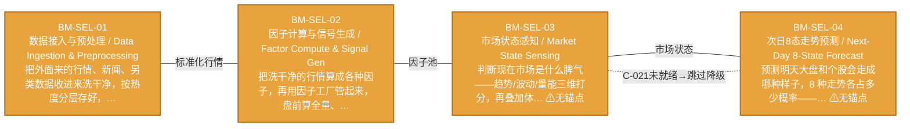

# 作战地图·选股阶段

> battle_map §stock_selection 阶段，4 环节。

## 阶段图

## 环节详情

### BM-SEL-01 数据接入与预处理 / Data Ingestion & Preprocessing

> **大白话**：把外面来的行情、新闻、另类数据收进来洗干净，按热度分层存好，供后面所有环节使用。

**机制说明**：

L0 层入口。每个 miniQMT Tick（3秒）触发，把 miniQMT/iFind/tushare 行情+新闻+另类数据经事件总线写入分层时序存储（Redis 热+ClickHouse 温+Parquet 冷）。是整个数据流主动脉的起点。

**6 件套（结构化，DB indicators JSONB）**：

| 要素 | 内容 |
|---|---|
| ① 触发条件 | 每个 miniQMT Tick（3秒）+ 盘前定时 阈值: Tick 频率 3s |
| ② 消费数据/因子 | miniQMT/iFind/tushare 行情+新闻（来自 外部数据源） 另类数据（社交情绪/供应链）（来自 外部另类数据源） |
| ③ 参数 | tick_frequency=3s（范围 1-10s，代码当前: 3s，状态: implemented） storage_tiering=Redis热+ClickHouse温+Parquet冷（范围 -，代码当前: 待实现，状态: proposed） |
| ④ 数据流 | 输入: 外部数据源 → 处理: 事件总线+分层时序存储 → 输出: 标准化行情/因子原料 → 下游: BM-SEL-02 因子计算 |
| ⑤ 代码映射 | C-001 / 草图§2 L0 层 |
| ⑥ 降级/中止 | 数据源断流 → 仅执行卖出指令（应急保命轨） |

**指标文案（翻译真源 indicators_zh）**：

①触发：每 3 秒 Tick + 盘前定时；②消费：外部行情/新闻/另类数据；③参数：tick_frequency=3s、分层存储策略；④数据流：外部源→事件总线→分层存储→BM-SEL-02；⑤代码：C-001 L0 层；⑥降级：数据源断流→仅执行卖出指令。

**锚点（环节↔模块双向关联）**：

| 目标图 | 目标ID | 角色 | 状态快照 |
|---|---|---|---|
| depgraph | MOD-MKT-003 | primary | planned |
| depgraph | MOD-INF-002 | supplement | production |

**状态**：design ｜ **层**：L0 ｜ **阶段**：stock_selection

### BM-SEL-02 因子计算与信号生成 / Factor Compute & Signal Gen

> **大白话**：把洗干净的行情算成各种因子，再用因子工厂管起来，盘前算全量、盘中补增量。

**机制说明**：

L1 层。因子工厂全生命周期管理，盘前全量+盘中增量双模计算，产出因子池（设计容量≥150，运行≤64）。叠加分布特征工程（滞后项/交互项/签名方法）喂密度预测模型。

**6 件套（结构化，DB indicators JSONB）**：

| 要素 | 内容 |
|---|---|
| ① 触发条件 | 盘前全量 + 盘中增量（双模） 阈值: 因子池 ≤64（≤60活跃+≤4休眠） |
| ② 消费数据/因子 | 标准化行情（来自 BM-SEL-01） 因子工厂全生命周期管理（来自 C-027 因子工厂） |
| ③ 参数 | factor_pool_max=64（范围 32-128，代码当前: 待实现，状态: proposed） compute_mode=盘前全量+盘中增量（范围 -，代码当前: 待实现，状态: proposed） |
| ④ 数据流 | 输入: 标准化行情 → 处理: 因子计算+分布特征工程 → 输出: 因子池+信号原料 → 下游: BM-SEL-03 市场状态 / BM-SELL-01 突破成败 |
| ⑤ 代码映射 | C-009/C-027 / 草图§3 L1 层 |
| ⑥ 降级/中止 | 因子层全部失效 → 降级硬编码均线规则（应急保命轨） |

**指标文案（翻译真源 indicators_zh）**：

①触发：盘前全量+盘中增量；②消费：BM-SEL-01 标准化行情 + C-027 因子工厂；③参数：factor_pool_max=64、双模计算；④数据流：行情→因子计算→因子池→BM-SEL-03/BM-SELL-01；⑤代码：C-009/C-027 L1 层；⑥降级：因子层全失效→硬编码均线规则。

**锚点（环节↔模块双向关联）**：

| 目标图 | 目标ID | 角色 | 状态快照 |
|---|---|---|---|
| depgraph | MOD-L02-001 | primary | production |

**状态**：design ｜ **层**：L1 ｜ **阶段**：stock_selection

### BM-SEL-03 市场状态感知 / Market State Sensing

> **大白话**：判断现在市场是什么脾气——趋势/波动/量能三维打分，再叠加体制转换检测。

**机制说明**：

L2-C 层。3×3×3 立方体（量能=第3维度）+ 日历修饰器（交割日/财报季）+ 体制转换检测（HMM/变点）+ Survival 止盈止损时间预测。是 P1 增强环节，激活时嵌入 C-009 和 C-005 之间。

**6 件套（结构化，DB indicators JSONB）**：

| 要素 | 内容 |
|---|---|
| ① 触发条件 | 盘前 + 盘中周期触发 阈值: 3×3×3 立方体（量能=第3维度） |
| ② 消费数据/因子 | 因子池（来自 BM-SEL-02） 量能/日历修饰（来自 L2-C） |
| ③ 参数 | matrix_dims=3×3×3（范围 3×3→3×3×3，代码当前: Phase1-2: 3×3，状态: testing） regime_detection=HMM/变点（范围 -，代码当前: 待实现，状态: proposed） |
| ④ 数据流 | 输入: 因子池 → 处理: 3×3矩阵+体制转换检测 → 输出: 市场状态标签+Survival时间预测 → 下游: BM-SEL-04 次日预测 / BM-BUY-02 四轨融合 |
| ⑤ 代码映射 | C-021 / 草图§6 L2-C 层 |
| ⑥ 降级/中止 | C-021 未就绪 → 主动脉跳过本环节（8节点7跳降级模式） |

**指标文案（翻译真源 indicators_zh）**：

①触发：盘前+盘中周期；②消费：BM-SEL-02 因子池 + 量能/日历；③参数：matrix_dims=3×3×3（Phase1-2 跑 3×3）、regime=HMM；④数据流：因子池→3×3矩阵+体制检测→市场状态+Survival→BM-SEL-04/BM-BUY-02；⑤代码：C-021 L2-C；⑥降级：C-021 未就绪→主动脉跳过（8节点7跳降级）。

**锚点**：⚠ 无（BM-INV-001 君子协定违例——环节无锚点=悬空决策）

**状态**：design ｜ **层**：L2C ｜ **阶段**：stock_selection

### BM-SEL-04 次日8态走势预测 / Next-Day 8-State Forecast

> **大白话**：预测明天大盘和个股会走成哪种样子，8 种走势各占多少概率——A股T+1制度下这是核心决策依据。

**机制说明**：

L2-C 层。T+1 次日 8 态走势预测（大盘+个股双预测体系）。Phase 1-2 先跑稳 3 态→5 态，Phase 4 后从密度预测 PDF 积分派生 8 态概率，统计一致性更强。

**6 件套（结构化，DB indicators JSONB）**：

| 要素 | 内容 |
|---|---|
| ① 触发条件 | 盘前 T+1 预测（A股T+1制度） 阈值: 8态概率 P1~P8 |
| ② 消费数据/因子 | 市场状态（来自 BM-SEL-03） 条件PDF（密度预测）（来自 L2-A 密度预测） |
| ③ 参数 | state_count=8（范围 3→5→8（分阶段），代码当前: Phase1-2: 3态，状态: testing） pdf_integration=Phase4 从PDF积分派生（范围 -，代码当前: 待实现，状态: proposed） |
| ④ 数据流 | 输入: 市场状态+条件PDF → 处理: 8态预测（大盘+个股双预测） → 输出: T+1 8态概率分布 → 下游: BM-BUY-01 多情景对策 |
| ⑤ 代码映射 | C-014 / 草图§6.2 |
| ⑥ 降级/中止 | C-014 未就绪 → 降级二值涨/跌预测 |

**指标文案（翻译真源 indicators_zh）**：

①触发：盘前 T+1 预测；②消费：BM-SEL-03 市场状态 + 密度预测条件PDF；③参数：state_count=8（分阶段 3→5→8）、PDF 积分派生；④数据流：市场状态+PDF→8态预测→T+1概率分布→BM-BUY-01；⑤代码：C-014 §6.2；⑥降级：C-014 未就绪→二值涨/跌预测。

**锚点**：⚠ 无（BM-INV-001 君子协定违例——环节无锚点=悬空决策）

**状态**：design ｜ **层**：L2C ｜ **阶段**：stock_selection

[← 返回总指挥图](battle_map_panorama.md)