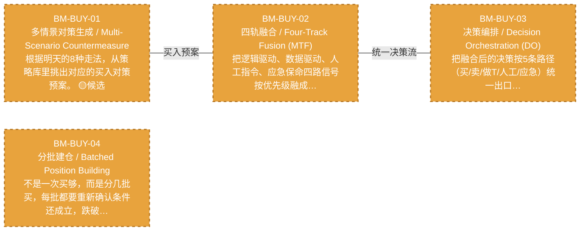

# 作战地图·买入阶段

> battle_map §buy_flow 阶段，4 环节。

## 阶段图

## 环节详情

### BM-BUY-01 多情景对策生成 / Multi-Scenario Countermeasure

> **大白话**：根据明天的8种走法，从策略库里挑出对应的买入对策预案。

**机制说明**：

L3 层。C-005 多情景对策，基于次日 8 态预测匹配 7 种价格运动情景，结合 C-006 策略工厂策略库生成买入预案。是四轨融合器逻辑驱动轨的输入。

**6 件套（结构化，DB indicators JSONB）**：

| 要素 | 内容 |
|---|---|
| ① 触发条件 | 次日8态预测就绪 阈值: 7种价格运动情景 |
| ② 消费数据/因子 | 8态预测（来自 BM-SEL-04） 策略工厂策略库（来自 C-006 策略工厂） |
| ③ 参数 | scenario_count=7（范围 5-10，代码当前: 待实现，状态: proposed） |
| ④ 数据流 | 输入: 8态+策略库 → 处理: 多情景对策匹配 → 输出: 买入预案 → 下游: BM-BUY-02 四轨融合 |
| ⑤ 代码映射 | C-005 / 草图§8 L3 层 |
| ⑥ 降级/中止 | C-005 失效 → 降级固定策略查表 |

**指标文案（翻译真源 indicators_zh）**：

①触发：8态预测就绪；②消费：BM-SEL-04 8态 + C-006 策略库；③参数：scenario_count=7；④数据流：8态+策略库→多情景对策→买入预案→BM-BUY-02；⑤代码：C-005 L3 层；⑥降级：C-005 失效→固定策略查表。

**锚点（环节↔模块双向关联）**：

| 目标图 | 目标ID | 角色 | 状态快照 | 真实build_status |
|---|---|---|---|---|
| depgraph | MOD-PF-002 | primary | planned | planned |
| depgraph | MOD-L05-001 | supplement | stable | generated |
| candidate | CAND-HARVEST-0015 | supplement | candidate | — |

**有效状态**：🟧 设计态（待施工） ｜ **环节自报**：design ｜ **层**：L3 ｜ **阶段**：buy_flow

### BM-BUY-02 四轨融合 / Four-Track Fusion (MTF)

> **大白话**：把逻辑驱动、数据驱动、人工指令、应急保命四路信号按优先级融成一条决策流——应急永远最优先。

**机制说明**：

L3 层 v8.0。四轨融合器(MTF)嵌入 C-005 和决策编排器之间，将逻辑驱动轨+数据驱动轨(AI Discovery)+人工指令轨+应急保命轨四路信号融合为统一决策流，优先级 应急>人工>自动。

**6 件套（结构化，DB indicators JSONB）**：

| 要素 | 内容 |
|---|---|
| ① 触发条件 | 四路信号就绪（逻辑/数据/人工/应急） 阈值: 优先级 应急>人工>自动 |
| ② 消费数据/因子 | 逻辑驱动轨（买入预案）（来自 BM-BUY-01） 数据驱动轨（AI Discovery）（来自 轨道2） 人工指令轨（来自 轨道3） 应急保命轨（来自 轨道4） |
| ③ 参数 | priority_order=应急>人工>自动（范围 -，代码当前: 待实现，状态: proposed） |
| ④ 数据流 | 输入: 四路信号 → 处理: 四轨融合器(MTF)优先级仲裁 → 输出: 统一决策流 → 下游: BM-BUY-03 决策编排 |
| ⑤ 代码映射 | MTF(v8.0) / 草图§1.8 主动脉 |
| ⑥ 降级/中止 | MTF 不可用 → 降级逻辑轨单线决策 |

**指标文案（翻译真源 indicators_zh）**：

①触发：四路信号就绪；②消费：BM-BUY-01 逻辑轨 + 轨道2/3/4；③参数：priority_order=应急>人工>自动；④数据流：四路信号→MTF优先级仲裁→统一决策流→BM-BUY-03；⑤代码：MTF(v8.0) §1.8；⑥降级：MTF 不可用→逻辑轨单线决策。

**锚点（环节↔模块双向关联）**：

| 目标图 | 目标ID | 角色 | 状态快照 | 真实build_status |
|---|---|---|---|---|
| depgraph | MOD-PF-006 | primary | planned | planned |

**有效状态**：🟧 设计态（待施工） ｜ **环节自报**：design ｜ **层**：L3 ｜ **阶段**：buy_flow

### BM-BUY-03 决策编排 / Decision Orchestration (DO)

> **大白话**：把融合后的决策按5条路径（买/卖/做T/人工/应急）统一出口编排，处理冲突、去重、排时序。

**机制说明**：

L3 层 v8.0。决策编排器(DO)嵌入四轨融合器和 C-047 之间，作为 5 条决策路径的统一出口，执行优先级仲裁+冲突消解+去重+时序编排。

**6 件套（结构化，DB indicators JSONB）**：

| 要素 | 内容 |
|---|---|
| ① 触发条件 | 统一决策流就绪 阈值: 5条决策路径（买/卖/做T/人工/应急） |
| ② 消费数据/因子 | 统一决策流（来自 BM-BUY-02） |
| ③ 参数 | path_count=5（范围 -，代码当前: 待实现，状态: proposed） |
| ④ 数据流 | 输入: 统一决策流 → 处理: 决策编排器(DO)优先级仲裁+冲突消解+去重+时序编排 → 输出: 编排后决策 → 下游: BM-POS-01 仓位裁决 |
| ⑤ 代码映射 | DO(v8.0) / 草图§1.8 主动脉 |
| ⑥ 降级/中止 | DO 不可用 → 降级直通仓位裁决 |

**指标文案（翻译真源 indicators_zh）**：

①触发：统一决策流就绪；②消费：BM-BUY-02 统一决策流；③参数：path_count=5；④数据流：统一决策流→DO 仲裁/消解/去重/时序→编排后决策→BM-POS-01；⑤代码：DO(v8.0) §1.8；⑥降级：DO 不可用→直通仓位裁决。

**锚点（环节↔模块双向关联）**：

| 目标图 | 目标ID | 角色 | 状态快照 | 真实build_status |
|---|---|---|---|---|
| depgraph | MOD-PF-007 | primary | planned | planned |

**有效状态**：🟧 设计态（待施工） ｜ **环节自报**：design ｜ **层**：L3 ｜ **阶段**：buy_flow

### BM-BUY-04 分批建仓 / Batched Position Building

> **大白话**：不是一次买够，而是分几批买，每批都要重新确认条件还成立，跌破关键位置就停手。

**机制说明**：

分批建仓环节把单次买入拆成 N 批，每批买入前重新校验触发条件（满足 M/N 阈值）。
目的是降低择时风险——避免一次性在错误时点满仓。每批之间留间隔（默认 1 交易日），
让市场给出二次确认。任一批次触发降级条件（如跌破前低）则暂停后续批次并进入止损评估。

**6 件套（结构化，DB indicators JSONB）**：

| 要素 | 内容 |
|---|---|
| ① 触发条件 | 满足2/3（调整周期到位/二次回落/缩量） 阈值: 2/3 |
| ② 消费数据/因子 | §6.6 调整周期进度（来自 BM-SEL-03） §6.7 生命周期阶段（来自 BM-SEL-03） §6.1.3 轮动序列（来自 BM-SEL-03） 量比（来自 BM-SEL-02） |
| ③ 参数 | batch_count=2（范围 2-4，代码当前: 待实现，状态: proposed） batch_interval=1交易日（范围 1-3，代码当前: 待实现，状态: proposed） satisfy_threshold=2/3（范围 1/3-3/3，代码当前: 待实现，状态: proposed） |
| ④ 数据流 | 输入: 进度+阶段+轮动 → 处理: 分批条件判定 → 输出: L3.5 分批仓位方案 → 下游: BM-POS-01 仓位裁决 |
| ⑤ 代码映射 | MOD-待定 / 草图§1.3 v4.1 |
| ⑥ 降级/中止 | 跌破前低 → 暂停后续批次→触发止损评估 |

**指标文案（翻译真源 indicators_zh）**：

①触发：满足 2/3（调整周期到位 / 二次回落 / 缩量）才放行下一批；
②消费：§6.6 建仓进度、§6.7 阶段判定、§6.1.3 轮动序列、量比；
③参数：分批数=2（可配 2-4）、间隔=1 交易日、满足阈值=2/3；
④数据流：进度+阶段+轮动→条件判定→L3.5 仓位决策→L4 执行；
⑤代码映射：MOD-xxx / src/zephyr/.../xxx.py；
⑥降级：跌破前低→暂停后续批次→止损评估。

**锚点（环节↔模块双向关联）**：

| 目标图 | 目标ID | 角色 | 状态快照 | 真实build_status |
|---|---|---|---|---|
| depgraph | MOD-PA-006 | primary | planned | planned |

**有效状态**：🟧 设计态（待施工） ｜ **环节自报**：design ｜ **层**：L3 ｜ **阶段**：buy_flow

[← 返回总指挥图](battle_map_panorama.md)