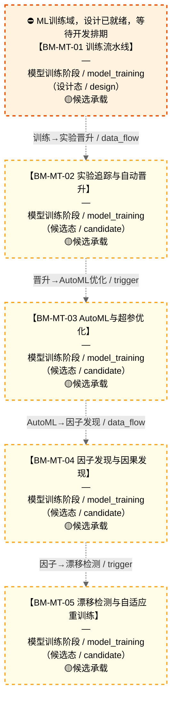

# 作战地图·模型训练阶段

> **[可缩放 HTML 版 / Zoomable HTML](http://localhost:8765/docs/02_enterprise_architecture/07_trading_decision_architecture/battle_map/_zoomable_html/battle_map_02_model_training.html)** — Ctrl+滚轮缩放 ｜ 双击重置 ｜ Ctrl+Shift+D 切换拖动/选择模式

> battle_map §model_training 阶段，5 环节。
> 本文档由 `generate_battle_map_diagram.py` 自动生成，禁止手编。

## 文档基本信息 / Document Overview

| 字段 | 值 | Field | Value |
|------|------|-------|-------|
| 阶段 | 模型训练（model_training） | Stage | 模型训练 |
| 环节数 | 5 | Steps | 5 |
| 流转边 | 6 | Edges | 6 |
| 状态分布 | 🟨 候选态（候选池）=4 ｜ 🟧 设计态（待施工）=1 | State Distribution | 🟨 候选态（候选池）=4 ｜ 🟧 设计态（待施工）=1 |

> **图例说明 / Legend**：
> - 🟦 **蓝色实线 = 运营态环节**（production，锚点模块已建）
> - 🟧 **橙色虚线 = 设计态环节**（design，锚点模块待施工）
> - 🟥 **红色 = 弃用态**（deprecated）
> - ⬜ **灰色 = 缺失态**（missing，环节无锚点，BM-INV-001 违例）
> - 🟨 **黄色虚线 = 候选态**（candidate，承载模块在候选池）
> - **实线箭头 ``-->`` = 运营态流转**（两端均 production）
> - **虚线箭头 ``-.->`` = 非运营态流转**（含设计/候选/混合）

## 阶段图 / Stage Diagram

> 展示 模型训练 阶段全部 5 个环节及流转边，颜色区分五态。

## 环节详情

### BM-MT-01 训练流水线

**6 件套（结构化，DB indicators JSONB）**：

| 要素 | 内容 |
|---|---|
| ① 触发条件 | — |
| ② 消费数据/因子 | — |
| ③ 参数 | — |
| ④ 数据流 | 输入: — → 处理: — → 输出: — → 下游: — |
| ⑤ 代码映射 | — / — |
| ⑥ 降级/中止 | — |

**锚点（环节↔模块双向关联）**：

| 目标图 | 目标ID | 角色 | 状态快照 | 真实build_status |
|---|---|---|---|---|
| depgraph | MOD-ML-001 | primary | planned | planned |
| candidate | CAND-HARVEST-0728 | supplement | planned | — |

**有效状态**：🟧 设计态（待施工） ｜ **环节自报**：production ｜ **层**：L11 ｜ **阶段**：model_training

### BM-MT-02 实验追踪与自动晋升

**6 件套（结构化，DB indicators JSONB）**：

| 要素 | 内容 |
|---|---|
| ① 触发条件 | — |
| ② 消费数据/因子 | — |
| ③ 参数 | — |
| ④ 数据流 | 输入: — → 处理: — → 输出: — → 下游: — |
| ⑤ 代码映射 | — / — |
| ⑥ 降级/中止 | — |

**锚点（环节↔模块双向关联）**：

| 目标图 | 目标ID | 角色 | 状态快照 | 真实build_status |
|---|---|---|---|---|
| candidate | CAND-HARVEST-0729 | primary | planned | — |

**有效状态**：🟨 候选态（候选池） ｜ **环节自报**：production ｜ **层**：L11 ｜ **阶段**：model_training

### BM-MT-03 AutoML与超参优化

**6 件套（结构化，DB indicators JSONB）**：

| 要素 | 内容 |
|---|---|
| ① 触发条件 | — |
| ② 消费数据/因子 | — |
| ③ 参数 | — |
| ④ 数据流 | 输入: — → 处理: — → 输出: — → 下游: — |
| ⑤ 代码映射 | — / — |
| ⑥ 降级/中止 | — |

**锚点（环节↔模块双向关联）**：

| 目标图 | 目标ID | 角色 | 状态快照 | 真实build_status |
|---|---|---|---|---|
| candidate | CAND-HARVEST-0730 | primary | planned | — |

**有效状态**：🟨 候选态（候选池） ｜ **环节自报**：production ｜ **层**：L11 ｜ **阶段**：model_training

### BM-MT-04 因子发现与因果发现

**6 件套（结构化，DB indicators JSONB）**：

| 要素 | 内容 |
|---|---|
| ① 触发条件 | — |
| ② 消费数据/因子 | — |
| ③ 参数 | — |
| ④ 数据流 | 输入: — → 处理: — → 输出: — → 下游: — |
| ⑤ 代码映射 | — / — |
| ⑥ 降级/中止 | — |

**锚点（环节↔模块双向关联）**：

| 目标图 | 目标ID | 角色 | 状态快照 | 真实build_status |
|---|---|---|---|---|
| candidate | CAND-HARVEST-0731 | primary | planned | — |

**有效状态**：🟨 候选态（候选池） ｜ **环节自报**：production ｜ **层**：L11 ｜ **阶段**：model_training

### BM-MT-05 漂移检测与自适应重训练

**6 件套（结构化，DB indicators JSONB）**：

| 要素 | 内容 |
|---|---|
| ① 触发条件 | — |
| ② 消费数据/因子 | — |
| ③ 参数 | — |
| ④ 数据流 | 输入: — → 处理: — → 输出: — → 下游: — |
| ⑤ 代码映射 | — / — |
| ⑥ 降级/中止 | — |

**锚点（环节↔模块双向关联）**：

| 目标图 | 目标ID | 角色 | 状态快照 | 真实build_status |
|---|---|---|---|---|
| candidate | CAND-HARVEST-0732 | primary | planned | — |

**有效状态**：🟨 候选态（候选池） ｜ **环节自报**：production ｜ **层**：L11 ｜ **阶段**：model_training

[← 返回总指挥图](battle_map_panorama.md)