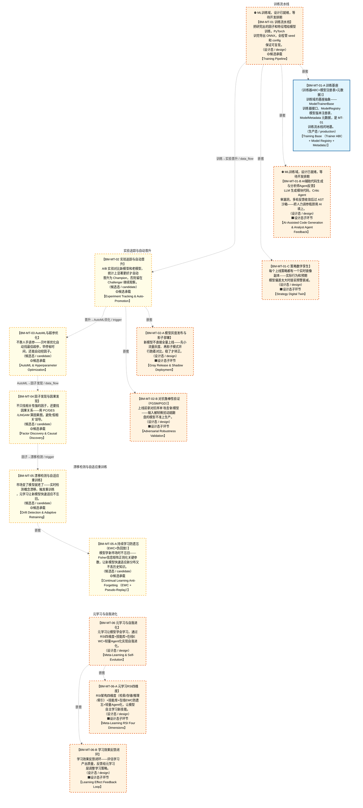

# 作战地图·模型训练阶段

> **[可缩放 HTML 版 / Zoomable HTML](http://localhost:8765/docs/02_enterprise_architecture/07_trading_decision_architecture/battle_map/_zoomable_html/battle_map_02_model_training.html)** — Ctrl+滚轮缩放 ｜ 双击重置 ｜ Ctrl+Shift+D 切换拖动/选择模式

> battle_map §model_training 阶段，14 环节（16 锚点）。
> 🔑 锚点表 `battle_map_anchors` 是环节↔模块**双向对齐枢纽**（step↔module 唯一查找真源），详见各环节「锚点」小节。
> 本文档由 `generate_battle_map_diagram.py` 自动生成，禁止手编。

## 文档基本信息 / Document Overview

| 字段 | 值 | Field | Value |
|------|------|-------|-------|
| 阶段 | 模型训练（model_training） | Stage | 模型训练 |
| 环节数 | 14 | Steps | 14 |
| 锚点数（双向对齐） | 16 | Anchors (Bidirectional) | 16 |
| 流转边 | 6 | Edges | 6 |
| 状态分布 | 🟧 设计态（待施工）=8 ｜ 🟨 候选态（候选池）=5 ｜ 🟦 运营态（已建）=1 | State Distribution | 🟧 设计态（待施工）=8 ｜ 🟨 候选态（候选池）=5 ｜ 🟦 运营态（已建）=1 |

> **图例说明 / Legend**：
> - 🟦 **蓝色实线 = 运营态环节**（production，锚点模块已建）
> - 🟧 **橙色虚线 = 设计态环节**（design，锚点模块待施工）
> - 🟧**设计态子环节** = 父环节已建但此子环节待施工（特殊标记，易被忽略）
> - 🟥 **红色 = 弃用态**（deprecated）
> - ⬜ **灰色 = 缺失态**（missing，环节无锚点，BM-INV-001 违例）
> - 🟨 **黄色虚线 = 候选态**（candidate，承载模块在候选池）
> - **实线箭头 ``-->`` = 运营态流转**（两端均 production）
> - **虚线箭头 ``-.->`` = 非运营态流转**（含设计/候选/混合）

## 阶段图 / Stage Diagram

> 展示 模型训练 阶段全部 14 个环节及流转边，颜色区分五态。

## 环节详情

### BM-MT-01 训练流水线 / Training Pipeline

> **大白话**：把研究出的因子和特征喂给模型训练，PyTorch 训完导出 ONNX，全程管 seed 和 config 保证可复现。

**机制说明**：

MT-01 TrainingPipeline 负责模型训练+验证+可复现性（PyTorch→ONNX导出、seed管理、config快照、
进化式代码生成 S4 DSL+AST沙箱、分析师Agent反馈循环）。是 D-ML-TRAIN 域的核心入口，
盘后 20:00-23:59 模型重训练的核心承载。产出 ModelTrained 事件喂 D-ML-SERVE 推理域。
C-029 ML模型工厂扩展能力（§29）：模型注册与实验管理（§29.3 MLflow Model Registry 版本/指标/部署状态/退化追踪）+
时序数据增强（§29.19 TimeGAN/条件扩散/时间扭曲扩充训练样本）+ Transformer时序模型（§29.7 PatchTST/Informer 密度预测时序特征提取）+
🆕v8.2 Kronos-mini/base TSFM（§29.39裁定13，零样本预测基线/特征提取器，挂载见 BM-SEL-13）。

**6 件套（结构化，DB indicators JSONB）**：

| 要素 | 内容 |
|---|---|
| ① 触发条件 | 盘后定时/研究员手动/漂移触发(BM-MT-05) |
| ② 消费数据/因子 | BM-RES-01 特征存储(PIT)+BM-RES-02 实验追踪 |
| ③ 参数 | PyTorch→ONNX、seed管理、config快照、S4 DSL代码生成、AST沙箱 |
| ④ 数据流 | 特征(PIT)→训练→验证→ONNX模型→BM-MT-02晋升→D-ML-SERVE |
| ⑤ 代码映射 | MT-01 TrainingPipeline（stable, 已有ABC） |
| ⑥ 降级/中止 | 训练失败→回退上一版模型+告警(不阻塞推理) |

**指标文案（翻译真源 indicators_zh）**：

①触发：盘后定时/研究员手动/漂移触发(BM-MT-05)；②消费：BM-RES-01 特征存储(PIT)+BM-RES-02 实验追踪；③参数：PyTorch→ONNX、seed管理、config快照、S4 DSL代码生成、AST沙箱、硬件门禁=RTX3090/RTX4090 24GB（Kronos-mini/base <1GB显存可跑；Chronos/MOMENT/Moirai 等 large TSFM 需云端API或GPU≥40GB，🔒门禁）；④数据流：特征(PIT)→训练→验证→ONNX模型→BM-MT-02晋升→D-ML-SERVE；GPU显存调度预算：盘中33%-42%(8-10GB/24GB)、盘后33%-50%、盘前因子全量≥40%、CUDA计算核心盘前/回测≥60%、任何时段<90%硬上限（低于下限=闲置检测线不阻断）、模型推理延迟<100ms；⑤代码：MT-01 TrainingPipeline（stable, 已有ABC）；⑥降级：训练失败→回退上一版模型+告警(不阻塞推理)。

**锚点（环节↔模块双向关联）**：

| 目标图 | 目标ID | 角色 | 状态快照 | 真实build_status |
|---|---|---|---|---|
| depgraph | MOD-ML-001 | primary | planned | planned |
| candidate | CAND-HARVEST-0728 | supplement | planned | — |
| depgraph | MOD-ML-003 | primary | planned | planned |

**有效状态**：🟧 设计态（待施工） ｜ **环节自报**：production ｜ **层**：L11 ｜ **阶段**：model_training

### BM-MT-01-A 训练基座（训练器ABC+模型注册表+元数据） / Training Base (Trainer ABC + Model Registry + Metadata)

> **大白话**：训练域的基座抽象——ModelTrainerBase 训练器接口、ModelRegistry 模型版本注册表、ModelMetadata 元数据，是 MT-01 训练流水线的地基。

**机制说明**：

MOD-L11-001 提供 D_ML_TRAIN 域核心抽象基座：ModelTrainerBase（train/validate/save_model ABC）、ModelRegistry（register/get/clear + lineage 管理）、ModelMetadata（model_id/version/framework/features/metrics）。是 MOD-ML-001 TrainingPipeline 的构建基础，已有生产代码。

**6 件套（结构化，DB indicators JSONB）**：

| 要素 | 内容 |
|---|---|
| ① 触发条件 | MT-01 训练流水线启动时加载基座 |
| ② 消费数据/因子 | 训练数据+因子特征 |
| ③ 参数 | model_id=—（范围 —，代码当前: —，状态: proposed） framework=—（范围 —，代码当前: —，状态: proposed） features=—（范围 —，代码当前: —，状态: proposed） target=—（范围 —，代码当前: —，状态: proposed） seed管理=—（范围 —，代码当前: —，状态: proposed） 模型版本号=—（范围 —，代码当前: —，状态: proposed） |
| ④ 数据流 | 输入: 训练数据+因子特征 → 处理: ModelTrainerBase.train()/validate() → 输出: ModelMetadata+训练指标 → 下游: ModelRegistry.register()→MOD-MT-02 |
| ⑤ 代码映射 | MOD-L11-001 / src/zephyr/ml_train/trainer_base.py |
| ⑥ 降级/中止 | 基座缺失 → 无法训练（硬依赖） |

**指标文案（翻译真源 indicators_zh）**：

①触发：MT-01 训练流水线启动时加载；②消费：训练数据+因子特征；③参数：model_id/framework/features/target、seed管理、模型版本号；④数据流：训练数据→ModelTrainerBase.train()→ModelMetadata→ModelRegistry.register()→MOD-ML-001流水线；⑤代码：MOD-L11-001 trainer_base.py（production, 已有ABC+ModelRegistry）；⑥降级：基座缺失→无法训练（硬依赖）。

**锚点（环节↔模块双向关联）**：

| 目标图 | 目标ID | 角色 | 状态快照 | 真实build_status |
|---|---|---|---|---|
| depgraph | MOD-L11-001 | primary | production | generated |

**有效状态**：🟦 运营态（已建） ｜ **环节自报**：production ｜ **层**：L11 ｜ **阶段**：model_training

### BM-MT-01-B AI辅助代码生成与分析师Agent反馈 / AI-Assisted Code Generation & Analyst Agent Feedback

> **大白话**：LLM 生成模块代码，Critic Agent 审漏洞，多轮反馈收敛后过 AST 沙箱——把人力调参瓶颈用 AI 填上。

**机制说明**：

MOD-ML-002 ai_operator 对应设计文档§9.2：Generator(GLM-5.1)生成代码→Critic(DeepSeek V4 Pro)审查→反馈循环→Judge(Claude)综合评估→AST沙箱三层安全→人工审核。含因子DSL约束（6类算子）、三重语义一致性、进化式代码生成、轨迹级进化。是 MT-01 的智能代码生成侧。🆕v8.0 可建设项（ML模型工厂）：自反Agent（Reflexion 自我推理反思→策略自我修正）+ 分层Agent指挥链（战略→战术→执行Agent，军事指挥链模式）+ 涌现行为检测器（多Agent交互非预期涌现→自动告警+人工介入）——Agent架构主体不挂作战地图（铁律5），此处仅作训练侧能力注记。

**6 件套（结构化，DB indicators JSONB）**：

| 要素 | 内容 |
|---|---|
| ① 触发条件 | BM-MT-01 训练前/研究员配置新模块需求 |
| ② 消费数据/因子 | ModuleRequirementSpec+交易流水线架构文档 |
| ③ 参数 | Generator/Critic/Judge模型=—（范围 —，代码当前: —，状态: proposed） AST沙箱白名单+复杂度+语义三层=—（范围 —，代码当前: —，状态: proposed） DSL 6类算子=—（范围 —，代码当前: —，状态: proposed） 进化轮数上限5=—（范围 —，代码当前: —，状态: proposed） |
| ④ 数据流 | 输入: ModuleRequirementSpec → 处理: LLM生成→Critic审查→反馈收敛→AST沙箱 → 输出: 模块代码+测试+配置 → 下游: 人工审核→注册Module Registry |
| ⑤ 代码映射 | MOD-ML-002 / src/zephyr/ml_train/ai_operator/ |
| ⑥ 降级/中止 | AI生成未就绪 → 人工编写代码（效率低） |

**指标文案（翻译真源 indicators_zh）**：

①触发：BM-MT-01 训练前/研究员配置新模块需求；②消费：ModuleRequirementSpec+交易流水线架构文档；③参数：Generator/Critic/Judge模型、AST沙箱白名单+复杂度+语义三层、DSL 6类算子、进化轮数上限5；④数据流：需求→LLM生成→Critic审查→反馈收敛→AST沙箱→人工审核→注册Module Registry；⑤代码：MOD-ML-002 ai_operator（planned）；⑥降级：AI生成未就绪→人工编写代码（效率低）。

**锚点（环节↔模块双向关联）**：

| 目标图 | 目标ID | 角色 | 状态快照 | 真实build_status |
|---|---|---|---|---|
| depgraph | MOD-ML-002 | primary | planned | planned |

**有效状态**：🟧 设计态（待施工） ｜ **环节自报**：production ｜ **层**：L11 ｜ **阶段**：model_training

### BM-MT-01-C 策略数字孪生 / Strategy Digital Twin

> **大白话**：每个上线策略都有一个实时镜像副本——实际行为和预期模型偏差太大时提前预警衰减。

**机制说明**：

BM-MT-01 训练流水线的子环节（depth=1），🆕v8.0 可建设项#15（ML模型工厂）。每策略实时镜像副本→策略健康评估+衰减预警。
与 BM-SIM-05 依赖图数字孪生正交：本环节镜像策略行为，非系统依赖图。

**6 件套（结构化，DB indicators JSONB）**：

| 要素 | 内容 |
|---|---|
| ① 触发条件 | 策略上线后持续运行 |
| ② 消费数据/因子 | 线上策略实时交易行为 + 预期模型行为 |
| ③ 参数 | 每策略实时镜像副本→策略健康评估+衰减预警；v8.0新增（与BM-SIM-05依赖图数字孪生正交：本环节镜像策略行为，非依赖图） |
| ④ 数据流 | 策略实时行为→数字孪生镜像→健康评分/衰减预警→BM-MT-05漂移检测/BM-REC-03反馈 |
| ⑤ 代码映射 | MOD-ML-006 src/zephyr/ml_train/strategy_digital_twin.py（planned） |
| ⑥ 降级/中止 | 孪生偏差超阈→告警+触发策略复核 |

**指标文案（翻译真源 indicators_zh）**：

①触发：策略上线后持续运行；②消费：线上策略实时交易行为+预期模型行为；③参数：镜像偏差阈值、健康评分、衰减预警(proposed)；④数据流：策略实时行为→数字孪生镜像→健康评分/衰减预警→BM-MT-05/BM-REC-03；⑤代码：MOD-ML-006 策略数字孪生(planned)；⑥降级：孪生偏差超阈→告警+触发策略复核。

**锚点（环节↔模块双向关联）**：

| 目标图 | 目标ID | 角色 | 状态快照 | 真实build_status |
|---|---|---|---|---|
| depgraph | MOD-ML-006 | primary | planned | planned |

**有效状态**：🟧 设计态（待施工） ｜ **环节自报**：design ｜ **层**：C-029 ｜ **阶段**：model_training

### BM-MT-02 实验追踪与自动晋升 / Experiment Tracking & Auto-Promotion

> **大白话**：A/B 实验对比新模型和老模型，统计上显著更好才自动晋升为 Champion，否则留在 Challenger 继续观察。

**机制说明**：

MT-02 ExperimentTracker 提供 A/B实验+Champion-Challenger+统计验证+自动晋升（wandb集成、实验血缘追踪、
DSR/CPCV v2/White's Reality/Probabilistic BT）。是模型上线的"裁判"，防止过拟合模型混入生产。
与 D-ML-SERVE INV-011 影子验证联动——晋升前必须影子验证通过。🆕v3.5 策略冷启动协议（⑦上线审批→⑧实盘监控之间的过渡机制：观察期+渐进建仓，新策略仓位上限=正常×30%，风控驱动与市场无关，可与分批建仓叠加）。

**6 件套（结构化，DB indicators JSONB）**：

| 要素 | 内容 |
|---|---|
| ① 触发条件 | BM-MT-01 训练完成 |
| ② 消费数据/因子 | 新模型+现役Champion模型+回测指标 |
| ③ 参数 | A/B实验、Champion-Challenger、DSR/CPCV v2/White's Reality/Probabilistic BT、统计显著性阈值 |
| ④ 数据流 | 新模型→A/B对比→统计验证→晋升/留观→D-ML-SERVE影子验证 |
| ⑤ 代码映射 | MT-02 ExperimentTracker（stable, 已有） |
| ⑥ 降级/中止 | 统计验证未就绪→人工review决定晋升(无自动门禁) |

**指标文案（翻译真源 indicators_zh）**：

①触发：BM-MT-01 训练完成；②消费：新模型+现役Champion模型+回测指标；③参数：A/B实验、Champion-Challenger、DSR/CPCV v2/White's Reality/Probabilistic BT、统计显著性阈值、4级决策门控动作枚举=APPROVE/REDUCE/REJECT/FLATTEN（学习系统S5）、PurgeGap验证、TrialResult契约；④数据流：新模型→A/B对比→统计验证→晋升/留观→D-ML-SERVE影子验证；⑤代码：MT-02 ExperimentTracker（stable, 已有）；⑥降级：统计验证未就绪→人工review决定晋升(无自动门禁)。

**锚点（环节↔模块双向关联）**：

| 目标图 | 目标ID | 角色 | 状态快照 | 真实build_status |
|---|---|---|---|---|
| candidate | CAND-HARVEST-0729 | primary | planned | — |

**有效状态**：🟨 候选态（候选池） ｜ **环节自报**：production ｜ **层**：L11 ｜ **阶段**：model_training

### BM-MT-02-A 模型灰度发布与影子部署 / Gray Release & Shadow Deployment

> **大白话**：新模型不直接全量上线——先小流量灰度、再影子模式并行跑着对比，稳了才转正。

**机制说明**：

BM-MT-02 实验追踪与自动晋升的子环节（depth=1），🆕v8.0（ML模型工厂）。灰度发布（小流量验证）+
影子部署（影子模式并行预测不改决策，与线上模型对比）。与 D-ML-SERVE INV-011 影子验证联动。

**6 件套（结构化，DB indicators JSONB）**：

| 要素 | 内容 |
|---|---|
| ① 触发条件 | 新模型通过独立验证后申请上线 |
| ② 消费数据/因子 | BM-MT-02 实验追踪晋升候选模型 + 线上实时行情 |
| ③ 参数 | 灰度发布（小流量验证）+ 影子部署（影子模式并行预测不改决策，对比线上模型）；v8.0新增 |
| ④ 数据流 | 候选模型→灰度小流量/影子并行→效果对比→全量晋升或回滚 |
| ⑤ 代码映射 | MOD-ML-004 src/zephyr/ml_train/gray_release_shadow_deployer.py（planned） |
| ⑥ 降级/中止 | 灰度指标不达标→自动回滚上一稳定版本 |

**指标文案（翻译真源 indicators_zh）**：

①触发：新模型通过独立验证后申请上线；②消费：晋升候选模型+线上实时行情；③参数：灰度流量比例、影子并行对比、自动回滚(proposed)；④数据流：候选模型→灰度/影子→效果对比→全量晋升或回滚；⑤代码：MOD-ML-004 灰度发布与影子部署器(planned)；⑥降级：灰度指标不达标→自动回滚上一稳定版本。

**锚点（环节↔模块双向关联）**：

| 目标图 | 目标ID | 角色 | 状态快照 | 真实build_status |
|---|---|---|---|---|
| depgraph | MOD-ML-004 | primary | planned | planned |

**有效状态**：🟧 设计态（待施工） ｜ **环节自报**：design ｜ **层**：C-029 ｜ **阶段**：model_training

### BM-MT-02-B 对抗鲁棒性验证（FGSM/PGD） / Adversarial Robustness Validation

> **大白话**：上线前拿对抗样本"攻击"新模型——输入被轻微扰动就翻盘的模型不准上生产。

**机制说明**：

BM-MT-02 实验追踪与自动晋升的子环节（depth=1），🆕v8.0 ML模型对抗鲁棒性：输入空间对抗检测+FGSM/PGD对抗训练增强。
对抗扰动测试作为晋升门禁的必检项。

**6 件套（结构化，DB indicators JSONB）**：

| 要素 | 内容 |
|---|---|
| ① 触发条件 | 模型上线前独立验证环节 |
| ② 消费数据/因子 | 候选模型 + 对抗样本生成器 |
| ③ 参数 | 输入空间对抗检测 + FGSM/PGD对抗训练增强；v8.0新增 |
| ④ 数据流 | 候选模型→FGSM/PGD对抗扰动测试→鲁棒性评分→晋升门禁输入 |
| ⑤ 代码映射 | MOD-ML-005 src/zephyr/ml_train/adversarial_robustness_validator.py（planned） |
| ⑥ 降级/中止 | 鲁棒性不达标→阻断晋升，回炉对抗训练 |

**指标文案（翻译真源 indicators_zh）**：

①触发：模型上线前独立验证环节；②消费：候选模型+对抗样本生成器；③参数：FGSM/PGD扰动半径、鲁棒性评分阈值(proposed)；④数据流：候选模型→对抗扰动测试→鲁棒性评分→晋升门禁；⑤代码：MOD-ML-005 对抗鲁棒性验证器(planned)；⑥降级：鲁棒性不达标→阻断晋升，回炉对抗训练。

**锚点（环节↔模块双向关联）**：

| 目标图 | 目标ID | 角色 | 状态快照 | 真实build_status |
|---|---|---|---|---|
| depgraph | MOD-ML-005 | primary | planned | planned |

**有效状态**：🟧 设计态（待施工） ｜ **环节自报**：design ｜ **层**：C-029 ｜ **阶段**：model_training

### BM-MT-03 AutoML与超参优化 / AutoML & Hyperparameter Optimization

> **大白话**：不靠人手调参——贝叶斯优化自动找最佳超参，早停省时间，还能自动挖因子。

**机制说明**：

MT-03 AutoMLEngine 提供自动模型选择+超参优化+因子挖掘（Optuna贝叶斯优化、早停、Qlib因子挖掘、
辩论式因子精炼 FactorMAD、质量-多样性优化 QuantEvolve）。是研究孵化的"加速器"，
把人力调参的瓶颈用算力填上。

**6 件套（结构化，DB indicators JSONB）**：

| 要素 | 内容 |
|---|---|
| ① 触发条件 | BM-MT-01 训练前/研究员配置 |
| ② 消费数据/因子 | BM-RES-01 特征+搜索空间定义 |
| ③ 参数 | Optuna贝叶斯优化、早停、Qlib因子挖掘、FactorMAD辩论精炼、QuantEvolve质量-多样性 |
| ④ 数据流 | 搜索空间→贝叶斯优化→试验→早停→最佳超参→BM-MT-01训练 |
| ⑤ 代码映射 | MT-03 AutoMLEngine（planned） |
| ⑥ 降级/中止 | AutoML未就绪→人工网格搜索(效率低) |

**指标文案（翻译真源 indicators_zh）**：

①触发：BM-MT-01 训练前/研究员配置；②消费：BM-RES-01 特征+搜索空间定义；③参数：Optuna贝叶斯优化、早停、Qlib因子挖掘、FactorMAD辩论精炼、QuantEvolve质量-多样性；④数据流：搜索空间→贝叶斯优化→试验→早停→最佳超参→BM-MT-01训练；⑤代码：MT-03 AutoMLEngine（planned）；⑥降级：AutoML未就绪→人工网格搜索(效率低)。

**锚点（环节↔模块双向关联）**：

| 目标图 | 目标ID | 角色 | 状态快照 | 真实build_status |
|---|---|---|---|---|
| candidate | CAND-HARVEST-0730 | primary | planned | — |

**有效状态**：🟨 候选态（候选池） ｜ **环节自报**：production ｜ **层**：L11 ｜ **阶段**：model_training

### BM-MT-04 因子发现与因果发现 / Factor Discovery & Causal Discovery

> **大白话**：不只找相关性强的因子，还要找因果关系——用 PC/GES/LiNGAM 算因果图，避免"假相关"误导。

**机制说明**：

MT-04 FeatureDiscovery 提供因子发现+因果发现+特征工程（因果发现引擎：PC算法(骨架)→LiNGAM(方向)→时滞因果图→LLM语义校验，v5.0扩展TimePC/Neural Granger/CausalNLP/Causal KG；GES、AutoML因子挖掘、特征交叉、辩论式因子精炼、三重语义一致性）。产出 NewFactorDiscovered 事件喂 D-FACTOR 因子域入池。
是"因子工厂"的智能上游，区别于纯统计因子挖掘。

**6 件套（结构化，DB indicators JSONB）**：

| 要素 | 内容 |
|---|---|
| ① 触发条件 | BM-MT-01 训练中/研究员触发 |
| ② 消费数据/因子 | BM-RES-01 特征+BM-RES-03 假设 |
| ③ 参数 | PC/GES/LiNGAM因果发现、特征交叉、FactorMAD辩论精炼、三重语义一致性 |
| ④ 数据流 | 特征→因果发现→新因子→语义一致性校验→D-FACTOR入池 |
| ⑤ 代码映射 | MT-04 FeatureDiscovery（planned） |
| ⑥ 降级/中止 | 因果发现未就绪→纯统计因子挖掘(无因果保证) |

**指标文案（翻译真源 indicators_zh）**：

①触发：BM-MT-01 训练中/研究员触发；②消费：BM-RES-01 特征+BM-RES-03 假设；③参数：PC/GES/LiNGAM因果发现、特征交叉、FactorMAD辩论精炼、三重语义一致性；④数据流：特征→因果发现→新因子→语义一致性校验→D-FACTOR入池；⑤代码：MT-04 FeatureDiscovery（planned）；⑥降级：因果发现未就绪→纯统计因子挖掘(无因果保证)。

**锚点（环节↔模块双向关联）**：

| 目标图 | 目标ID | 角色 | 状态快照 | 真实build_status |
|---|---|---|---|---|
| candidate | CAND-HARVEST-0731 | primary | planned | — |

**有效状态**：🟨 候选态（候选池） ｜ **环节自报**：production ｜ **层**：L11 ｜ **阶段**：model_training

### BM-MT-05 漂移检测与自适应重训练 / Drift Detection & Adaptive Retraining

> **大白话**：市场变了模型就老了——实时检测概念漂移，触发重训练，元学习让新模型快速适应不忘旧。

**机制说明**：

MT-05 DriftAdapter 提供概念漂移检测+自适应重训练+元学习（DDM/EDDM/ADWIN检测、MAML快速适应、
在线EWC防遗忘=🆕持续学习抗遗忘（EWC+伪回放，v9.0注记/v6.0新增）、技能库 Voyager、元反思、AutoSkill）。是模型"保鲜"的关键，
防止"上线时好用，三个月后失效"。🆕漂移检测三闭环（§29.5）：事前特征漂移PSI→事中在线适应（EWMA/Stage2缩放）→事后C-007离线重训。

**6 件套（结构化，DB indicators JSONB）**：

| 要素 | 内容 |
|---|---|
| ① 触发条件 | 盘中漂移检测信号/定时 |
| ② 消费数据/因子 | 实时预测误差+特征分布 |
| ③ 参数 | DDM/EDDM/ADWIN检测阈值、MAML快速适应、在线EWC防遗忘、Voyager技能库 |
| ④ 数据流 | 预测误差→漂移检测→重训练触发→MAML适应→EWC防遗忘→BM-MT-01训练 |
| ⑤ 代码映射 | MT-05 DriftAdapter（planned） |
| ⑥ 降级/中止 | 漂移检测未就绪→定时重训练(无自适应) |

**指标文案（翻译真源 indicators_zh）**：

①触发：盘中漂移检测信号/定时；②消费：实时预测误差+特征分布；③参数：DDM/EDDM/ADWIN检测阈值、MAML快速适应、在线EWC防遗忘、Voyager技能库；④数据流：预测误差→漂移检测→重训练触发→MAML适应→EWC防遗忘→BM-MT-01训练；⑤代码：MT-05 DriftAdapter（planned）；⑥降级：漂移检测未就绪→定时重训练(无自适应)。

**锚点（环节↔模块双向关联）**：

| 目标图 | 目标ID | 角色 | 状态快照 | 真实build_status |
|---|---|---|---|---|
| candidate | CAND-HARVEST-0732 | primary | planned | — |

**有效状态**：🟨 候选态（候选池） ｜ **环节自报**：production ｜ **层**：L11 ｜ **阶段**：model_training

### BM-MT-05-A 持续学习防遗忘（EWC+伪回放） / Continual Learning Anti-Forgetting (EWC + Pseudo-Replay)

> **大白话**：模型学新市场时不忘旧——Fisher信息矩阵正则化关键参数，让新模型快速适应新分布又不丢历史知识。

**机制说明**：

CAND-HARVEST-0922 对应设计文档§10.1 维度7：在线EWC防遗忘（ProAdapt 2026）+伪回放。Fisher信息矩阵计算每个参数对历史任务的重要性，更新时对重要参数施加正则化约束，保留历史知识+适应新知识。是 MT-05 DriftAdapter 的防遗忘子能力，EWC正则化强度由Meta-Harness动态调整。

**6 件套（结构化，DB indicators JSONB）**：

| 要素 | 内容 |
|---|---|
| ① 触发条件 | BM-MT-05 漂移检测触发重训练时 |
| ② 消费数据/因子 | 历史任务参数Fisher信息+新训练数据 |
| ③ 参数 | EWC正则化强度=—（范围 —，代码当前: —，状态: proposed） Fisher信息计算方法=—（范围 —，代码当前: —，状态: proposed） 伪回放样本数=—（范围 —，代码当前: —，状态: proposed） |
| ④ 数据流 | 输入: 重训练请求+历史Fisher信息 → 处理: Fisher信息计算→重要参数正则化 → 输出: 适应新分布且不遗忘旧的模型 → 下游: BM-MT-01训练 |
| ⑤ 代码映射 | CAND-HARVEST-0922 / candidate_module_registry.yaml §CAND-HARVEST-0922 |
| ⑥ 降级/中止 | EWC未就绪 → 全量重训练（有灾难性遗忘风险） |

**指标文案（翻译真源 indicators_zh）**：

①触发：BM-MT-05 漂移检测触发重训练时；②消费：历史任务参数Fisher信息+新训练数据；③参数：EWC正则化强度、Fisher信息计算方法、伪回放样本数；④数据流：重训练→Fisher信息计算→重要参数正则化→新模型适应新分布且不遗忘旧→BM-MT-01训练；⑤代码：CAND-HARVEST-0922 Continual Learning Anti-Forgetting（candidate, 待评估）；⑥降级：EWC未就绪→全量重训练（有灾难性遗忘风险）。

**锚点（环节↔模块双向关联）**：

| 目标图 | 目标ID | 角色 | 状态快照 | 真实build_status |
|---|---|---|---|---|
| candidate | CAND-HARVEST-0922 | primary | planned | — |

**有效状态**：🟨 候选态（候选池） ｜ **环节自报**：production ｜ **层**：L11 ｜ **阶段**：model_training

### BM-MT-06 元学习与自我进化 / Meta-Learning & Self-Evolution

> **大白话**：元学习让模型学会学习，通过RSI四维度+技能库+在线EWC+轻量Agent化实现自我进化。

**机制说明**：

S6元学习与自我进化层。RSI架构四维度(检索/存储/推理/索引)+技能库(可复用技能)+在线EWC(防遗忘)+轻量Agent化(自主探索)。让模型学会学习。

**6 件套（结构化，DB indicators JSONB）**：

| 要素 | 内容 |
|---|---|
| ① 触发条件 | BM-MT-04 因子发现产出新策略 / BM-MT-05 漂移重训触发后，需跨任务积累经验加速学习 |
| ② 消费数据/因子 | 历史训练轨迹 + 策略表现 + BM-MT-02 实验追踪数据 + 技能库 |
| ③ 参数 | RSI架构4维度(技能/记忆/推理/迁移) + 技能库 + 在线EWC(Elastic Weight Consolidation) + 轻量Agent化 + 学习效果反馈闭环 |
| ④ 数据流 | 训练轨迹→技能抽象→技能库积累→新任务迁移加速→反馈闭环优化元学习策略 |
| ⑤ 代码映射 | 待开发（planned，D_ML_TRAIN 域） |
| ⑥ 降级/中止 | 元学习失效→回退 BM-MT-01 标准训练流水线（按任务独立训练） |

**指标文案（翻译真源 indicators_zh）**：

①触发：BM-MT-04 因子发现产出新策略 / BM-MT-05 漂移重训触发后，需跨任务积累经验加速学习；②消费：历史训练轨迹 + 策略表现 + BM-MT-02 实验追踪数据 + 技能库；③参数：RSI架构4维度(技能/记忆/推理/迁移) + 技能库 + 在线EWC(Elastic Weight Consolidation) + 轻量Agent化 + 学习效果反馈闭环；④数据流：训练轨迹→技能抽象→技能库积累→新任务迁移加速→反馈闭环优化元学习策略；⑤代码映射：待开发（planned，D_ML_TRAIN 域）；⑥降级：元学习失效→回退 BM-MT-01 标准训练流水线（按任务独立训练）。

**锚点（环节↔模块双向关联）**：

| 目标图 | 目标ID | 角色 | 状态快照 | 真实build_status |
|---|---|---|---|---|
| depgraph | MOD-ML-007 | primary | planned | planned |

**有效状态**：🟧 设计态（待施工） ｜ **环节自报**：design ｜ **层**：L11 ｜ **阶段**：model_training

### BM-MT-06-A 元学习RSI四维度 / Meta-Learning RSI Four Dimensions

> **大白话**：RSI架构四维度（检索/存储/推理/索引）+技能库+在线EWC防遗忘+轻量Agent化，让模型自主学习新技能。

**机制说明**：

RSI四维度：①检索(从记忆库检索相关知识)②存储(新知识写入记忆库)③推理(基于检索结果推理)④索引(记忆库索引优化)。配合技能库+在线EWC防遗忘+轻量Agent化自主探索新策略。

**6 件套（结构化，DB indicators JSONB）**：

| 要素 | 内容 |
|---|---|
| ① 触发条件 | BM-MT-04因子发现/BM-MT-05漂移重训触发后，需跨任务积累经验加速学习 |
| ② 消费数据/因子 | 历史训练轨迹 + 技能库 + BM-MT-02实验追踪数据 |
| ③ 参数 | RSI架构4维度：技能(Skill)抽象/记忆(Memory)积累/推理(Reasoning)迁移/迁移(Transfer)加速 + 技能库 + 在线EWC(Elastic Weight Consolidation)防遗忘 + 轻量Agent化 |
| ④ 数据流 | 训练轨迹→技能抽象→技能库→新任务迁移加速→反馈闭环优化元学习策略 |
| ⑤ 代码映射 | 待开发（planned，D_ML_TRAIN域） |
| ⑥ 降级/中止 | 元学习失效→回退BM-MT-01标准训练(按任务独立训练) |

**指标文案（翻译真源 indicators_zh）**：

①触发：BM-MT-04因子发现/BM-MT-05漂移重训触发后，需跨任务积累经验加速学习；②消费：历史训练轨迹 + 技能库 + BM-MT-02实验追踪数据；③参数：RSI架构4维度：技能(Skill)抽象/记忆(Memory)积累/推理(Reasoning)迁移/迁移(Transfer)加速 + 技能库 + 在线EWC(Elastic Weight Consolidation)防遗忘 + 轻量Agent化；④数据流：训练轨迹→技能抽象→技能库→新任务迁移加速→反馈闭环优化元学习策略；⑤代码映射：待开发（planned，D_ML_TRAIN域）；⑥降级：元学习失效→回退BM-MT-01标准训练(按任务独立训练)。

**锚点（环节↔模块双向关联）**：

| 目标图 | 目标ID | 角色 | 状态快照 | 真实build_status |
|---|---|---|---|---|
| depgraph | MOD-ML-008 | primary | planned | planned |

**有效状态**：🟧 设计态（待施工） ｜ **环节自报**：design ｜ **层**：L11 ｜ **阶段**：model_training

### BM-MT-06-B 学习效果反馈闭环 / Learning Effect Feedback Loop

> **大白话**：学习效果反馈闭环——评估学习产出质量，反馈给元学习层调整学习策略。

**机制说明**：

学习效果反馈闭环。评估元学习产出质量(策略改进度/知识有效性/技能复用率)→反馈给元学习层→调整学习策略(探索/利用平衡/学习率)。形成学习→评估→调整→再学习的闭环。

**6 件套（结构化，DB indicators JSONB）**：

| 要素 | 内容 |
|---|---|
| ① 触发条件 | 元学习产出迁移策略后，需反馈闭环评估学习效果以持续优化元学习策略 |
| ② 消费数据/因子 | 迁移后任务表现 + 对比基线(无迁移训练) + BM-REC-03闭环反馈 |
| ③ 参数 | 效果评估指标(迁移加速比/最终表现提升/负迁移检测) + 反馈路由(优化RSI四维度权重) + 闭环频率 |
| ④ 数据流 | 迁移任务表现→效果评估→反馈→RSI权重调整→下一轮元学习 |
| ⑤ 代码映射 | 待开发（planned，D_ML_TRAIN域） |
| ⑥ 降级/中止 | 反馈闭环失效→固定RSI权重，不动态调整 |

**指标文案（翻译真源 indicators_zh）**：

①触发：元学习产出迁移策略后，需反馈闭环评估学习效果以持续优化元学习策略；②消费：迁移后任务表现 + 对比基线(无迁移训练) + BM-REC-03闭环反馈；③参数：效果评估指标(迁移加速比/最终表现提升/负迁移检测) + 反馈路由(优化RSI四维度权重) + 闭环频率；④数据流：迁移任务表现→效果评估→反馈→RSI权重调整→下一轮元学习；⑤代码映射：待开发（planned，D_ML_TRAIN域）；⑥降级：反馈闭环失效→固定RSI权重，不动态调整。

**锚点（环节↔模块双向关联）**：

| 目标图 | 目标ID | 角色 | 状态快照 | 真实build_status |
|---|---|---|---|---|
| depgraph | MOD-ML-009 | primary | planned | planned |

**有效状态**：🟧 设计态（待施工） ｜ **环节自报**：design ｜ **层**：L11 ｜ **阶段**：model_training

[← 返回总指挥图](battle_map_panorama.md)