# 作战地图·模型训练阶段

> **[可缩放 HTML 版 / Zoomable HTML](http://localhost:8765/docs/02_enterprise_architecture/07_trading_decision_architecture/battle_map/_zoomable_html/battle_map_02_model_training.html)** — Ctrl+滚轮缩放 ｜ 双击重置 ｜ Ctrl+Shift+D 切换拖动/选择模式

> battle_map §model_training 阶段，5 环节。
> 本文档由 `generate_battle_map_diagram.py` 自动生成，禁止手编。

## 文档基本信息 / Document Overview

| 字段 | 值 | Field | Value |
|------|------|-------|-------|
| 阶段 | 模型训练（model_training） | Stage | 模型训练 |
| 环节数 | 5 | Steps | 5 |
| 流转边 | 6 | Edges | 6 |
| 状态分布 | 🟨 候选态（候选池）=4 ｜ 🟧 设计态（待施工）=1 | State Distribution | 🟨 候选态（候选池）=4 ｜ 🟧 设计态（待施工）=1 |

> **图例说明 / Legend**：
> - 🟦 **蓝色实线 = 运营态环节**（production，锚点模块已建）
> - 🟧 **橙色虚线 = 设计态环节**（design，锚点模块待施工）
> - 🟥 **红色 = 弃用态**（deprecated）
> - ⬜ **灰色 = 缺失态**（missing，环节无锚点，BM-INV-001 违例）
> - 🟨 **黄色虚线 = 候选态**（candidate，承载模块在候选池）
> - **实线箭头 ``-->`` = 运营态流转**（两端均 production）
> - **虚线箭头 ``-.->`` = 非运营态流转**（含设计/候选/混合）

## 阶段图 / Stage Diagram

> 展示 模型训练 阶段全部 5 个环节及流转边，颜色区分五态。

```mermaid
%%{init: {'theme': 'base', 'themeVariables': {'primaryColor': '#eaeaea', 'primaryTextColor': '#333333', 'primaryBorderColor': '#666666', 'lineColor': '#666666', 'secondaryColor': '#eaeaea', 'tertiaryColor': '#eaeaea', 'clusterBkg': 'transparent', 'clusterBorder': 'transparent', 'fontSize': '14px'}}}%%
%% 模型训练阶段图
flowchart TD
    BM_MT_01["⛔ ML训练域，设计已就绪，等待开发排期<br/>【BM-MT-01 训练流水线】<br/>把研究出的因子和特征喂给模型训练，PyTorch<br/>训完导出 ONNX，全程管 seed 和 config<br/>保证可复现。<br/>（设计态 / design）<br/>🟡候选承载<br/>【Training Pipeline】"]
    BM_MT_02["【BM-MT-02 实验追踪与自动晋升】<br/>A/B 实验对比新模型和老模型，统计上显著更好才自动<br/>晋升为 Champion，否则留在 Challenger 继续观察。<br/>（候选态 / candidate）<br/>🟡候选承载<br/>【Experiment Tracking &amp; Auto-Promotion】"]
    BM_MT_03["【BM-MT-03 AutoML与超参优化】<br/>不靠人手调参——贝叶斯优化自动找最佳超参，早停省时<br/>间，还能自动挖因子。<br/>（候选态 / candidate）<br/>🟡候选承载<br/>【AutoML &amp; Hyperparameter Optimization】"]
    BM_MT_04["【BM-MT-04 因子发现与因果发现】<br/>不只找相关性强的因子，还要找因果关系——用 PC/GES<br/>/LiNGAM 算因果图，避免'假相关'误导。<br/>（候选态 / candidate）<br/>🟡候选承载<br/>【Factor Discovery &amp; Causal Discovery】"]
    BM_MT_05["【BM-MT-05 漂移检测与自适应重训练】<br/>市场变了模型就老了——实时检测概念漂移，触发重训练<br/>，元学习让新模型快速适应不忘旧。<br/>（候选态 / candidate）<br/>🟡候选承载<br/>【Drift Detection &amp; Adaptive Retraining】"]
    BM_MT_01 -.->|训练→实验晋升 / data_flow| BM_MT_02
    BM_MT_02 -.->|晋升→AutoML优化 / trigger| BM_MT_03
    BM_MT_03 -.->|AutoML→因子发现 / data_flow| BM_MT_04
    BM_MT_04 -.->|因子→漂移检测 / trigger| BM_MT_05
classDef production fill:#e1f5fe,stroke:#01579b,stroke-width:2px,color:#000
classDef design fill:#fff3e0,stroke:#e65100,stroke-width:2px,color:#000,stroke-dasharray: 5 5
classDef deprecated fill:#ffebee,stroke:#c62828,stroke-width:2px,color:#000
classDef missing fill:#eeeeee,stroke:#9e9e9e,stroke-width:2px,color:#000
classDef candidate fill:#fffde7,stroke:#f9a825,stroke-width:2px,color:#000,stroke-dasharray: 5 5
    class BM_MT_01 design
    class BM_MT_02,BM_MT_03,BM_MT_04,BM_MT_05 candidate
```

## 环节详情

### BM-MT-01 训练流水线 / Training Pipeline

> **大白话**：把研究出的因子和特征喂给模型训练，PyTorch 训完导出 ONNX，全程管 seed 和 config 保证可复现。

**机制说明**：

MT-01 TrainingPipeline 负责模型训练+验证+可复现性（PyTorch→ONNX导出、seed管理、config快照、
进化式代码生成 S4 DSL+AST沙箱、分析师Agent反馈循环）。是 D-ML-TRAIN 域的核心入口，
盘后 20:00-23:59 模型重训练的核心承载。产出 ModelTrained 事件喂 D-ML-SERVE 推理域。

**6 件套（结构化，DB indicators JSONB）**：

| 要素 | 内容 |
|---|---|
| ① 触发条件 | — |
| ② 消费数据/因子 | — |
| ③ 参数 | — |
| ④ 数据流 | 输入: — → 处理: — → 输出: — → 下游: — |
| ⑤ 代码映射 | — / — |
| ⑥ 降级/中止 | — |

**指标文案（翻译真源 indicators_zh）**：

①触发：盘后定时/研究员手动/漂移触发(BM-MT-05)；②消费：BM-RES-01 特征存储(PIT)+BM-RES-02 实验追踪；③参数：PyTorch→ONNX、seed管理、config快照、S4 DSL代码生成、AST沙箱；④数据流：特征(PIT)→训练→验证→ONNX模型→BM-MT-02晋升→D-ML-SERVE；⑤代码：MT-01 TrainingPipeline（stable, 已有ABC）；⑥降级：训练失败→回退上一版模型+告警(不阻塞推理)。

**锚点（环节↔模块双向关联）**：

| 目标图 | 目标ID | 角色 | 状态快照 | 真实build_status |
|---|---|---|---|---|
| depgraph | MOD-ML-001 | primary | planned | planned |
| candidate | CAND-HARVEST-0728 | supplement | planned | — |

**有效状态**：🟧 设计态（待施工） ｜ **环节自报**：production ｜ **层**：L11 ｜ **阶段**：model_training

### BM-MT-02 实验追踪与自动晋升 / Experiment Tracking & Auto-Promotion

> **大白话**：A/B 实验对比新模型和老模型，统计上显著更好才自动晋升为 Champion，否则留在 Challenger 继续观察。

**机制说明**：

MT-02 ExperimentTracker 提供 A/B实验+Champion-Challenger+统计验证+自动晋升（wandb集成、实验血缘追踪、
DSR/CPCV v2/White's Reality/Probabilistic BT）。是模型上线的"裁判"，防止过拟合模型混入生产。
与 D-ML-SERVE INV-011 影子验证联动——晋升前必须影子验证通过。

**6 件套（结构化，DB indicators JSONB）**：

| 要素 | 内容 |
|---|---|
| ① 触发条件 | — |
| ② 消费数据/因子 | — |
| ③ 参数 | — |
| ④ 数据流 | 输入: — → 处理: — → 输出: — → 下游: — |
| ⑤ 代码映射 | — / — |
| ⑥ 降级/中止 | — |

**指标文案（翻译真源 indicators_zh）**：

①触发：BM-MT-01 训练完成；②消费：新模型+现役Champion模型+回测指标；③参数：A/B实验、Champion-Challenger、DSR/CPCV v2/White's Reality/Probabilistic BT、统计显著性阈值；④数据流：新模型→A/B对比→统计验证→晋升/留观→D-ML-SERVE影子验证；⑤代码：MT-02 ExperimentTracker（stable, 已有）；⑥降级：统计验证未就绪→人工review决定晋升(无自动门禁)。

**锚点（环节↔模块双向关联）**：

| 目标图 | 目标ID | 角色 | 状态快照 | 真实build_status |
|---|---|---|---|---|
| candidate | CAND-HARVEST-0729 | primary | planned | — |

**有效状态**：🟨 候选态（候选池） ｜ **环节自报**：production ｜ **层**：L11 ｜ **阶段**：model_training

### BM-MT-03 AutoML与超参优化 / AutoML & Hyperparameter Optimization

> **大白话**：不靠人手调参——贝叶斯优化自动找最佳超参，早停省时间，还能自动挖因子。

**机制说明**：

MT-03 AutoMLEngine 提供自动模型选择+超参优化+因子挖掘（Optuna贝叶斯优化、早停、Qlib因子挖掘、
辩论式因子精炼 FactorMAD、质量-多样性优化 QuantEvolve）。是研究孵化的"加速器"，
把人力调参的瓶颈用算力填上。

**6 件套（结构化，DB indicators JSONB）**：

| 要素 | 内容 |
|---|---|
| ① 触发条件 | — |
| ② 消费数据/因子 | — |
| ③ 参数 | — |
| ④ 数据流 | 输入: — → 处理: — → 输出: — → 下游: — |
| ⑤ 代码映射 | — / — |
| ⑥ 降级/中止 | — |

**指标文案（翻译真源 indicators_zh）**：

①触发：BM-MT-01 训练前/研究员配置；②消费：BM-RES-01 特征+搜索空间定义；③参数：Optuna贝叶斯优化、早停、Qlib因子挖掘、FactorMAD辩论精炼、QuantEvolve质量-多样性；④数据流：搜索空间→贝叶斯优化→试验→早停→最佳超参→BM-MT-01训练；⑤代码：MT-03 AutoMLEngine（planned）；⑥降级：AutoML未就绪→人工网格搜索(效率低)。

**锚点（环节↔模块双向关联）**：

| 目标图 | 目标ID | 角色 | 状态快照 | 真实build_status |
|---|---|---|---|---|
| candidate | CAND-HARVEST-0730 | primary | planned | — |

**有效状态**：🟨 候选态（候选池） ｜ **环节自报**：production ｜ **层**：L11 ｜ **阶段**：model_training

### BM-MT-04 因子发现与因果发现 / Factor Discovery & Causal Discovery

> **大白话**：不只找相关性强的因子，还要找因果关系——用 PC/GES/LiNGAM 算因果图，避免"假相关"误导。

**机制说明**：

MT-04 FeatureDiscovery 提供因子发现+因果发现+特征工程（PC/GES/LiNGAM因果发现、AutoML因子挖掘、
特征交叉、辩论式因子精炼、三重语义一致性）。产出 NewFactorDiscovered 事件喂 D-FACTOR 因子域入池。
是"因子工厂"的智能上游，区别于纯统计因子挖掘。

**6 件套（结构化，DB indicators JSONB）**：

| 要素 | 内容 |
|---|---|
| ① 触发条件 | — |
| ② 消费数据/因子 | — |
| ③ 参数 | — |
| ④ 数据流 | 输入: — → 处理: — → 输出: — → 下游: — |
| ⑤ 代码映射 | — / — |
| ⑥ 降级/中止 | — |

**指标文案（翻译真源 indicators_zh）**：

①触发：BM-MT-01 训练中/研究员触发；②消费：BM-RES-01 特征+BM-RES-03 假设；③参数：PC/GES/LiNGAM因果发现、特征交叉、FactorMAD辩论精炼、三重语义一致性；④数据流：特征→因果发现→新因子→语义一致性校验→D-FACTOR入池；⑤代码：MT-04 FeatureDiscovery（planned）；⑥降级：因果发现未就绪→纯统计因子挖掘(无因果保证)。

**锚点（环节↔模块双向关联）**：

| 目标图 | 目标ID | 角色 | 状态快照 | 真实build_status |
|---|---|---|---|---|
| candidate | CAND-HARVEST-0731 | primary | planned | — |

**有效状态**：🟨 候选态（候选池） ｜ **环节自报**：production ｜ **层**：L11 ｜ **阶段**：model_training

### BM-MT-05 漂移检测与自适应重训练 / Drift Detection & Adaptive Retraining

> **大白话**：市场变了模型就老了——实时检测概念漂移，触发重训练，元学习让新模型快速适应不忘旧。

**机制说明**：

MT-05 DriftAdapter 提供概念漂移检测+自适应重训练+元学习（DDM/EDDM/ADWIN检测、MAML快速适应、
在线EWC防遗忘、技能库 Voyager、元反思、AutoSkill）。是模型"保鲜"的关键，
防止"上线时好用，三个月后失效"。

**6 件套（结构化，DB indicators JSONB）**：

| 要素 | 内容 |
|---|---|
| ① 触发条件 | — |
| ② 消费数据/因子 | — |
| ③ 参数 | — |
| ④ 数据流 | 输入: — → 处理: — → 输出: — → 下游: — |
| ⑤ 代码映射 | — / — |
| ⑥ 降级/中止 | — |

**指标文案（翻译真源 indicators_zh）**：

①触发：盘中漂移检测信号/定时；②消费：实时预测误差+特征分布；③参数：DDM/EDDM/ADWIN检测阈值、MAML快速适应、在线EWC防遗忘、Voyager技能库；④数据流：预测误差→漂移检测→重训练触发→MAML适应→EWC防遗忘→BM-MT-01训练；⑤代码：MT-05 DriftAdapter（planned）；⑥降级：漂移检测未就绪→定时重训练(无自适应)。

**锚点（环节↔模块双向关联）**：

| 目标图 | 目标ID | 角色 | 状态快照 | 真实build_status |
|---|---|---|---|---|
| candidate | CAND-HARVEST-0732 | primary | planned | — |

**有效状态**：🟨 候选态（候选池） ｜ **环节自报**：production ｜ **层**：L11 ｜ **阶段**：model_training

[← 返回总指挥图](battle_map_panorama.md)