# 作战地图·回测验证阶段

> **[可缩放 HTML 版 / Zoomable HTML](http://localhost:8765/docs/02_enterprise_architecture/07_trading_decision_architecture/battle_map/_zoomable_html/battle_map_03_backtest_validation.html)** — Ctrl+滚轮缩放 ｜ 双击重置 ｜ Ctrl+Shift+D 切换拖动/选择模式

> battle_map §backtest_validation 阶段，48 环节。
> 本文档由 `generate_battle_map_diagram.py` 自动生成，禁止手编。

## 文档基本信息 / Document Overview

| 字段 | 值 | Field | Value |
|------|------|-------|-------|
| 阶段 | 回测验证（backtest_validation） | Stage | 回测验证 |
| 环节数 | 48 | Steps | 48 |
| 流转边 | 8 | Edges | 8 |
| 状态分布 | 🟦 运营态（已建）=48 | State Distribution | 🟦 运营态（已建）=48 |

> **图例说明 / Legend**：
> - 🟦 **蓝色实线 = 运营态环节**（production，锚点模块已建）
> - 🟧 **橙色虚线 = 设计态环节**（design，锚点模块待施工）
> - 🟧**设计态子环节** = 父环节已建但此子环节待施工（特殊标记，易被忽略）
> - 🟥 **红色 = 弃用态**（deprecated）
> - ⬜ **灰色 = 缺失态**（missing，环节无锚点，BM-INV-001 违例）
> - 🟨 **黄色虚线 = 候选态**（candidate，承载模块在候选池）
> - **实线箭头 ``-->`` = 运营态流转**（两端均 production）
> - **虚线箭头 ``-.->`` = 非运营态流转**（含设计/候选/混合）

## 阶段图 / Stage Diagram

> 展示 回测验证 阶段全部 48 个环节及流转边，颜色区分五态。

```mermaid
%%{init: {'theme': 'base', 'themeVariables': {'primaryColor': '#eaeaea', 'primaryTextColor': '#333333', 'primaryBorderColor': '#666666', 'lineColor': '#666666', 'secondaryColor': '#eaeaea', 'tertiaryColor': '#eaeaea', 'clusterBkg': 'transparent', 'clusterBorder': 'transparent', 'fontSize': '14px'}}}%%
%% 回测验证阶段图
flowchart TD
    subgraph sg_BM_BT_01 ["回测引擎与撮合"]
        BM_BT_01["【BM-BT-01 回测引擎与撮合】<br/>把策略放到历史数据上跑一遍看表现——向量化回测快但<br/>粗，事件驱动慢但细，两种模式都支持。<br/>（生产态 / production）<br/>【Backtest Engine &amp; Matching】"]
        BM_BT_01_A["【BM-BT-01-A 引擎基座与契约】<br/>回测引擎的'地基'——定义抽象基类和结果契约，所有回<br/>测模式都得遵守这套规矩。<br/>（生产态 / production）<br/>【Engine Base &amp; Contract】"]
        BM_BT_01_B["【BM-BT-01-B 向量化回测引擎】<br/>快速回测模式——用矩阵运算批量算，适合大批量因子IC<br/>/IR筛选，速度快但忽略细节。<br/>（生产态 / production）<br/>【Vectorized Backtest Engine】"]
        BM_BT_01_C["【BM-BT-01-C 撮合引擎】<br/>模拟交易所撮合——市价单/限价单/滑点<br/>/Tick级5档深度撮合，让回测更接近真实成交。<br/>（生产态 / production）<br/>【Matching Engine】"]
        BM_BT_01_D["【BM-BT-01-D A股交易约束】<br/>A股回测的'规矩'——T+1交易、万三佣金、5元最低、1bp<br/>滑点，让回测符合A股实际。<br/>（生产态 / production）<br/>【A-Share Trading Constraints】"]
        BM_BT_01_E["【BM-BT-01-E 自动回测调度器】<br/>回测的'自动排队机'——批量参数网格回测+队列管理+结<br/>果聚合，不用手动一个个跑。<br/>（生产态 / production）<br/>【Auto Backtest Scheduler】"]
        BM_BT_01_F["【BM-BT-01-F 回测加速架构】<br/>回测的'加速器'——用并行计算+向量化+缓存复用让大批<br/>量参数网格回测跑得更快。<br/>（生产态 / production）<br/>【Backtest Acceleration Architecture】"]
        BM_BT_01 -.->|嵌套| BM_BT_01_A
        BM_BT_01 -.->|嵌套| BM_BT_01_B
        BM_BT_01 -.->|嵌套| BM_BT_01_C
        BM_BT_01 -.->|嵌套| BM_BT_01_D
        BM_BT_01 -.->|嵌套| BM_BT_01_E
        BM_BT_01 -.->|嵌套| BM_BT_01_F
    end
    subgraph sg_BM_BT_02 ["持仓组合与数据接入"]
        BM_BT_02["【BM-BT-02 持仓组合与数据接入】<br/>回测里的'钱包和数据库'——管持仓现金净值曲线，把<br/>miniQMT Tick 和 ClickHouse 日线都接进来。<br/>（生产态 / production）<br/>【Portfolio &amp; Data Handler】"]
        BM_BT_02_A["【BM-BT-02-A 持仓组合管理】<br/>回测里的'钱包'——管持仓、现金、净值曲线，记录每笔<br/>交易对组合的影响。<br/>（生产态 / production）<br/>【Portfolio Management】"]
        BM_BT_02_B["【BM-BT-02-B 多源数据接入】<br/>回测的'数据库接口'——把 miniQMT Tick 数据和<br/>ClickHouse 日线数据都接进来，统一供给回测引擎。<br/>（生产态 / production）<br/>【Multi-Source Data Handler】"]
        BM_BT_02_C["【BM-BT-02-C 回测缓存管理器】<br/>回测结果的'复用器'——缓存回测结果避免重复计算，相<br/>同参数直接取缓存。<br/>（生产态 / production）<br/>【Backtest Cache Manager】"]
        BM_BT_02_D["【BM-BT-02-D 回测数据质量检查器】<br/>回测前的'数据体检'——检测数据缺失和异常，脏数据先<br/>洗再跑回测。<br/>（生产态 / production）<br/>【Backtest Data Quality Checker】"]
        BM_BT_02_E["【BM-BT-02-E 幸存者偏差防护】<br/>回测的'防作弊器'——把退市股票也纳入回测，避免只看<br/>活下来的股票导致收益虚高。<br/>（生产态 / production）<br/>【Survivorship Bias Protection】"]
        BM_BT_02 -.->|嵌套| BM_BT_02_A
        BM_BT_02 -.->|嵌套| BM_BT_02_B
        BM_BT_02 -.->|嵌套| BM_BT_02_C
        BM_BT_02 -.->|嵌套| BM_BT_02_D
        BM_BT_02 -.->|嵌套| BM_BT_02_E
    end
    subgraph sg_BM_BT_03 ["绩效指标与Tick回放"]
        BM_BT_03["【BM-BT-03 绩效指标与Tick回放】<br/>算 Sharpe/Sortino/最大回撤/IC/IR<br/>/胜率这些硬指标；还能把历史 Tick<br/>逐笔回放做秒级策略验证。<br/>（生产态 / production）<br/>【Metrics &amp; Tick Replay】"]
        BM_BT_03_A["【BM-BT-03-A 绩效指标计算】<br/>算回测表现——年化收益、夏普、最大回撤、胜率等指标<br/>，看策略赚不赚钱、稳不稳。<br/>（生产态 / production）<br/>【Performance Metrics】"]
        BM_BT_03_B["【BM-BT-03-B Tick回放引擎】<br/>把历史 Tick<br/>数据逐笔回放——模拟真实的逐笔行情，让事件驱动回测<br/>更逼真。<br/>（生产态 / production）<br/>【Tick Replay Engine】"]
        BM_BT_03_C["【BM-BT-03-C 事件驱动回测】<br/>逐笔事件回测——每个 Tick/订单<br/>/成交都按时间顺序处理，精度高但速度慢，适合精细<br/>验证。<br/>（生产态 / production）<br/>【Event-Driven Backtest】"]
        BM_BT_03_D["【BM-BT-03-D 指标NaN处理器】<br/>算指标时的'清洁工'——智能填充和清洗NaN值，防止指<br/>标计算崩溃。<br/>（生产态 / production）<br/>【Metrics NaN Processor】"]
        BM_BT_03_E["【BM-BT-03-E 密度预测模型回测验证】<br/>把密度预测模型放到回测里验——看概率预测准不准，不<br/>是只看点预测。<br/>（生产态 / production）<br/>【Density Prediction Model Backtest Validation】"]
        BM_BT_03 -.->|嵌套| BM_BT_03_A
        BM_BT_03 -.->|嵌套| BM_BT_03_B
        BM_BT_03 -.->|嵌套| BM_BT_03_C
        BM_BT_03 -.->|嵌套| BM_BT_03_D
        BM_BT_03 -.->|嵌套| BM_BT_03_E
    end
    subgraph sg_BM_BT_04 ["PIT铁律管理"]
        BM_BT_04["【BM-BT-04 PIT铁律管理】<br/>回测绝不能偷看未来——PIT 铁律管 AS OF JOIN 和<br/>Embargo 期，保证当时只能用当时已知的数据。<br/>（生产态 / production）<br/>【Point-in-Time Integrity】"]
        BM_BT_04_A["【BM-BT-04-A PIT三公理与AS OF JOIN】<br/>回测的'时间铁律'——只用当时能知道的数据，不能用未<br/>来数据，AS OF JOIN 保证数据对齐到正确时间点。<br/>（生产态 / production）<br/>【PIT Axioms &amp; AS OF JOIN】"]
        BM_BT_04_B["【BM-BT-04-B Embargo期管理】<br/>训练-测试之间的'隔离期'——防止训练集末尾数据泄漏<br/>到测试集开头，保证样本外验证干净。<br/>（生产态 / production）<br/>【Embargo Period Management】"]
        BM_BT_04_C["【BM-BT-04-C Purged K-Fold交叉验证】<br/>交叉验证的'隔离版'——训练测试之间砍掉重叠期，防止<br/>数据泄漏导致虚高。<br/>（生产态 / production）<br/>【Purged K-Fold Cross Validation】"]
        BM_BT_04 -.->|嵌套| BM_BT_04_A
        BM_BT_04 -.->|嵌套| BM_BT_04_B
        BM_BT_04 -.->|嵌套| BM_BT_04_C
    end
    subgraph sg_BM_BT_05 ["过拟合检测"]
        BM_BT_05["【BM-BT-05 过拟合检测】<br/>回测好不等于真能赚——三维度三层检测过拟合，防止'<br/>历史完美未来崩盘'。<br/>（生产态 / production）<br/>【Overfitting Detection】"]
        BM_BT_05_A["【BM-BT-05-A 样本内外对比检测】<br/>看策略是不是'背题'——样本内表现好但样本外差就是过<br/>拟合，对比两者差异自动报警。<br/>（生产态 / production）<br/>【In-Sample/Out-Sample Detection】"]
        BM_BT_05_B["【BM-BT-05-B 参数敏感性检测】<br/>稍微改改参数就天差地别→过拟合信号——检测策略对参<br/>数的敏感度，太敏感就是不稳健。<br/>（生产态 / production）<br/>【Parameter Sensitivity Detection】"]
        BM_BT_05_C["【BM-BT-05-C 多重比较校正】<br/>试了100个策略总有几个好看→假阳性——用Bonferroni等<br/>校正方法抵消多重测试带来的运气成分。<br/>（生产态 / production）<br/>【Multiple Comparison Correction】"]
        BM_BT_05_D["【BM-BT-05-D 策略衰减监控】<br/>策略的'健康手环'——持续监控策略表现衰减，发现策略<br/>失效及时告警。<br/>（生产态 / production）<br/>【Strategy Decay Monitor】"]
        BM_BT_05_E["【BM-BT-05-E 参数优化分析器】<br/>参数调优的'分析师'——分析参数优化结果的显著性和过<br/>拟合风险，找出真正好的参数。<br/>（生产态 / production）<br/>【Parameter Optimization Analyzer】"]
        BM_BT_05_F["【BM-BT-05-F Permutation Test置换检验】<br/>策略的'打假器'——把收益序列打乱重排，看策略收益是<br/>不是真有信号还是纯运气。<br/>（生产态 / production）<br/>【Permutation Test】"]
        BM_BT_05_G["【BM-BT-05-G Deflated Sharpe Ratio】<br/>夏普比率的'去水器'——考虑试验次数后调整夏普比率，<br/>试得越多越要打折。<br/>（生产态 / production）<br/>【Deflated Sharpe Ratio】"]
        BM_BT_05_H["【BM-BT-05-H 回测-实盘偏差监控】<br/>回测和实盘的'对账员'——持续监控回测预期和实盘实际<br/>的偏差，偏差大就报警。<br/>（生产态 / production）<br/>【Backtest-Live Bias Monitor】"]
        BM_BT_05_I["【BM-BT-05-I 组合级过拟合检测】<br/>不光看单个策略——从组合层面检测整体过拟合，防止单<br/>策略过拟合被分散掩盖。<br/>（生产态 / production）<br/>【Portfolio-Level Overfitting Detection】"]
        BM_BT_05_J["【BM-BT-05-J p-hacking追踪】<br/>数据挖掘的'审计员'——追踪试验次数和参数调整，防止<br/>反复试到好看的结果（p-hacking）。<br/>（生产态 / production）<br/>【P-hacking Tracker】"]
        BM_BT_05 -.->|嵌套| BM_BT_05_A
        BM_BT_05 -.->|嵌套| BM_BT_05_B
        BM_BT_05 -.->|嵌套| BM_BT_05_C
        BM_BT_05 -.->|嵌套| BM_BT_05_D
        BM_BT_05 -.->|嵌套| BM_BT_05_E
        BM_BT_05 -.->|嵌套| BM_BT_05_F
        BM_BT_05 -.->|嵌套| BM_BT_05_G
        BM_BT_05 -.->|嵌套| BM_BT_05_H
        BM_BT_05 -.->|嵌套| BM_BT_05_I
        BM_BT_05 -.->|嵌套| BM_BT_05_J
    end
    subgraph sg_BM_BT_06 ["Walk-Forward优化"]
        BM_BT_06["【BM-BT-06 Walk-Forward优化】<br/>滚动窗口跑样本外验证——不是一次回测定终身，而是多<br/>段验证看策略稳不稳。<br/>（生产态 / production）<br/>🟡候选承载<br/>【Walk-Forward Optimization】"]
        BM_BT_06_A["【BM-BT-06-A 滚动窗口回测】<br/>用滚动窗口一段段测——训练一段预测一段，再往前滚，<br/>模拟策略在不同市场环境下的持续表现。<br/>（生产态 / production）<br/>【Rolling Window Backtest】"]
        BM_BT_06_B["【BM-BT-06-B 样本外验证与参数稳定性】<br/>看参数在不同窗口稳不稳——参数稳定性区域达标才放行<br/>，否则说明策略不可靠。<br/>（生产态 / production）<br/>【OOS Validation &amp; Parameter Stability】"]
        BM_BT_06_C["【BM-BT-06-C 自适应Walk-Forward】<br/>Walk-Forward的'智能版'——窗口大小和参数自动适应市<br/>场状态，不是死固定。<br/>（生产态 / production）<br/>【Adaptive Walk-Forward】"]
        BM_BT_06 -.->|嵌套| BM_BT_06_A
        BM_BT_06 -.->|嵌套| BM_BT_06_B
        BM_BT_06 -.->|嵌套| BM_BT_06_C
    end
    subgraph sg_BM_BT_07 ["决策门控与上线"]
        BM_BT_07["【BM-BT-07 决策门控与上线】<br/>策略上线三道门——IS→WFA→OOS<br/>不可跳级，参数稳定性区域达标才放行，结果持久化供<br/>审计。<br/>（生产态 / production）<br/>【Decision Gate &amp; Go-Live】"]
        BM_BT_07_A["【BM-BT-07-A 三阶段决策门控】<br/>策略上线三道门——IS→WFA→OOS<br/>不可跳级，每阶段都过了才放行，防止半成品上线。<br/>（生产态 / production）<br/>【Three-Stage Decision Gate】"]
        BM_BT_07_B["【BM-BT-07-B 回测结果Sink】<br/>把回测结果导成可视化数据——净值曲线、持仓变化、绩<br/>效图表，方便人看。<br/>（生产态 / production）<br/>【Backtest Result Sink】"]
        BM_BT_07_C["【BM-BT-07-C 结果持久化】<br/>把回测结果存到数据库——BacktestRunArtifact<br/>持久化，留好审计凭证，可追溯每次回测。<br/>（生产态 / production）<br/>【Result Persistence】"]
        BM_BT_07_D["【BM-BT-07-D decisiongraph适配】<br/>把回测结果适配到决策图——BacktestResult→decisiong<br/>raph L5决策节点，让回测结论进入决策流。<br/>（生产态 / production）<br/>【Decisiongraph Adapter】"]
        BM_BT_07_E["【BM-BT-07-E 回测报告生成】<br/>回测的'自动报告员'——把回测结果自动生成PDF<br/>/HTML报告，不用手动截图。<br/>（生产态 / production）<br/>【Backtest Report Generator】"]
        BM_BT_07_F["【BM-BT-07-F 回测异常诊断】<br/>回测出错的'医生'——回测失败时自动诊断错误原因，给<br/>出修复建议。<br/>（生产态 / production）<br/>【Backtest Anomaly Diagnoser】"]
        BM_BT_07_G["【BM-BT-07-G 回测结果对比】<br/>多次回测的'裁判'——对比多次回测结果差异，看参数调<br/>整或策略改动的影响。<br/>（生产态 / production）<br/>【Backtest Result Comparator】"]
        BM_BT_07_H["【BM-BT-07-H 回测结果部署】<br/>策略上线的'最后一公里'——把通过验证的回测策略一键<br/>部署到实盘。<br/>（生产态 / production）<br/>【Backtest Result Deployer】"]
        BM_BT_07_I["【BM-BT-07-I 分层验证门控V1-V6】<br/>策略上线的'六道关'——V1到V6逐层验证，每层过了才进<br/>下一层，层层递进不能跳。<br/>（生产态 / production）<br/>【Layered Validation Gate V1-V6】"]
        BM_BT_07 -.->|嵌套| BM_BT_07_A
        BM_BT_07 -.->|嵌套| BM_BT_07_B
        BM_BT_07 -.->|嵌套| BM_BT_07_C
        BM_BT_07 -.->|嵌套| BM_BT_07_D
        BM_BT_07 -.->|嵌套| BM_BT_07_E
        BM_BT_07 -.->|嵌套| BM_BT_07_F
        BM_BT_07 -.->|嵌套| BM_BT_07_G
        BM_BT_07 -.->|嵌套| BM_BT_07_H
        BM_BT_07 -.->|嵌套| BM_BT_07_I
    end
    BM_BT_01 ~~~ BM_BT_01_A ~~~ BM_BT_01_B ~~~ BM_BT_01_C ~~~ BM_BT_01_D ~~~ BM_BT_01_E ~~~ BM_BT_01_F ~~~ BM_BT_02_A ~~~ BM_BT_02_B ~~~ BM_BT_02_C ~~~ BM_BT_02_D ~~~ BM_BT_02_E ~~~ BM_BT_03_A ~~~ BM_BT_03_B ~~~ BM_BT_03_C ~~~ BM_BT_03_D ~~~ BM_BT_03_E ~~~ BM_BT_04_A ~~~ BM_BT_04_B ~~~ BM_BT_04_C ~~~ BM_BT_05_A ~~~ BM_BT_05_B ~~~ BM_BT_05_C ~~~ BM_BT_05_D ~~~ BM_BT_05_E ~~~ BM_BT_05_F ~~~ BM_BT_05_G ~~~ BM_BT_05_H ~~~ BM_BT_05_I ~~~ BM_BT_05_J ~~~ BM_BT_06_A ~~~ BM_BT_06_B ~~~ BM_BT_06_C ~~~ BM_BT_07_A ~~~ BM_BT_07_B ~~~ BM_BT_07_C ~~~ BM_BT_07_D ~~~ BM_BT_07_E ~~~ BM_BT_07_F ~~~ BM_BT_07_G ~~~ BM_BT_07_H ~~~ BM_BT_07_I
    BM_BT_01 -->|引擎→持仓数据 / data_flow| BM_BT_02
    BM_BT_02 -->|持仓→绩效指标 / data_flow| BM_BT_03
    BM_BT_03 -->|指标→PIT校验 / trigger| BM_BT_04
    BM_BT_04 -->|PIT→过拟合检测 / data_flow| BM_BT_05
    BM_BT_05 -->|过拟合→WFO / data_flow| BM_BT_06
    BM_BT_06 -->|WFO→决策门控 / data_flow| BM_BT_07
classDef production fill:#e1f5fe,stroke:#01579b,stroke-width:2px,color:#000
classDef design fill:#fff3e0,stroke:#e65100,stroke-width:2px,color:#000,stroke-dasharray: 5 5
classDef deprecated fill:#ffebee,stroke:#c62828,stroke-width:2px,color:#000
classDef missing fill:#eeeeee,stroke:#9e9e9e,stroke-width:2px,color:#000
classDef candidate fill:#fffde7,stroke:#f9a825,stroke-width:2px,color:#000,stroke-dasharray: 5 5
    class BM_BT_01,BM_BT_02,BM_BT_03,BM_BT_04,BM_BT_05,BM_BT_06,BM_BT_07,BM_BT_01_A,BM_BT_01_B,BM_BT_01_C,BM_BT_01_D,BM_BT_01_E,BM_BT_01_F,BM_BT_02_A,BM_BT_02_B,BM_BT_02_C,BM_BT_02_D,BM_BT_02_E,BM_BT_03_A,BM_BT_03_B,BM_BT_03_C,BM_BT_03_D,BM_BT_03_E,BM_BT_04_A,BM_BT_04_B,BM_BT_04_C,BM_BT_05_A,BM_BT_05_B,BM_BT_05_C,BM_BT_05_D,BM_BT_05_E,BM_BT_05_F,BM_BT_05_G,BM_BT_05_H,BM_BT_05_I,BM_BT_05_J,BM_BT_06_A,BM_BT_06_B,BM_BT_06_C,BM_BT_07_A,BM_BT_07_B,BM_BT_07_C,BM_BT_07_D,BM_BT_07_E,BM_BT_07_F,BM_BT_07_G,BM_BT_07_H,BM_BT_07_I production
```

## 环节详情

### BM-BT-01 回测引擎与撮合 / Backtest Engine & Matching

> **大白话**：把策略放到历史数据上跑一遍看表现——向量化回测快但粗，事件驱动慢但细，两种模式都支持。

**机制说明**：

BT-01 core/engine_base.py 定义 BacktestEngineBase ABC + BacktestResult契约(CTR-P1-016) + FactorDiscovery；
BT-02 implementations/vectorized_engine.py 是 DefaultBacktestEngine 向量化回测（快速IC/IR筛选）；
BT-03 core/matching_engine.py 是撮合引擎（市价/限价/滑点/Tick级5档撮合）；
BT-04 core/matching_logic.py 是 A股约束（T+1/万三/5元/1bp滑点）。
是回测验证的核心引擎，决定回测结果可信度。

**6 件套（结构化，DB indicators JSONB）**：

| 要素 | 内容 |
|---|---|
| ① 触发条件 | — |
| ② 消费数据/因子 | — |
| ③ 参数 | — |
| ④ 数据流 | 输入: — → 处理: — → 输出: — → 下游: — |
| ⑤ 代码映射 | — / — |
| ⑥ 降级/中止 | — |

**指标文案（翻译真源 indicators_zh）**：

①触发：研究员提交策略/自动调度(BM-BT-07)；②消费：BM-RES-01 特征(PIT)+策略代码；③参数：向量化vs事件驱动、市价/限价/滑点/Tick级5档撮合、A股T+1/万三/5元/1bp滑点；④数据流：策略+历史数据→撮合引擎→成交记录→BacktestResult→BM-BT-02；⑤代码：BT-01~BT-04（stable, production）；⑥降级：事件驱动引擎未就绪→仅向量化回测(精度低)。

**锚点（环节↔模块双向关联）**：

| 目标图 | 目标ID | 角色 | 状态快照 | 真实build_status |
|---|---|---|---|---|
| depgraph | MOD-BT-001 | primary | stable | generated |

**有效状态**：🟦 运营态（已建） ｜ **环节自报**：production ｜ **层**：L5 ｜ **阶段**：backtest_validation

### BM-BT-02 持仓组合与数据接入 / Portfolio & Data Handler

> **大白话**：回测里的"钱包和数据库"——管持仓现金净值曲线，把 miniQMT Tick 和 ClickHouse 日线都接进来。

**机制说明**：

BT-05 core/portfolio.py 管持仓/现金/PnL/净值曲线；
BT-06 core/data_handler.py 接多源数据（D_DATA MiniQMT Provider Tick+5档 + ClickHouse 日线批量）。
是回测引擎的"数据底盘"，决定回测能跑多真实。

**6 件套（结构化，DB indicators JSONB）**：

| 要素 | 内容 |
|---|---|
| ① 触发条件 | — |
| ② 消费数据/因子 | — |
| ③ 参数 | — |
| ④ 数据流 | 输入: — → 处理: — → 输出: — → 下游: — |
| ⑤ 代码映射 | — / — |
| ⑥ 降级/中止 | — |

**指标文案（翻译真源 indicators_zh）**：

①触发：BM-BT-01 引擎启动；②消费：D-DATA MiniQMT Provider + ClickHouse c1_market；③参数：持仓/现金/PnL/净值曲线计算、多源数据切换；④数据流：多源数据→data_handler→portfolio→BacktestResult；⑤代码：BT-05/06（stable, production）；⑥降级：Tick数据缺失→降级日线回测(精度低)。

**锚点（环节↔模块双向关联）**：

| 目标图 | 目标ID | 角色 | 状态快照 | 真实build_status |
|---|---|---|---|---|
| depgraph | MOD-BT-001 | primary | stable | generated |

**有效状态**：🟦 运营态（已建） ｜ **环节自报**：production ｜ **层**：L5 ｜ **阶段**：backtest_validation

### BM-BT-03 绩效指标与Tick回放 / Metrics & Tick Replay

> **大白话**：算 Sharpe/Sortino/最大回撤/IC/IR/胜率这些硬指标；还能把历史 Tick 逐笔回放做秒级策略验证。

**机制说明**：

BT-07 core/metrics.py 算 Sharpe/Sortino/MaxDD/IC/IR/胜率；
BT-08 core/tick_replay.py 是 Tick回放引擎（秒级做T，30秒/5秒级）；
BT-09 implementations/event_driven_engine.py 是事件驱动回测（Tick级，与 tick_replay 协同）。
是回测"出分"环节，决定策略评估的全面性。

**6 件套（结构化，DB indicators JSONB）**：

| 要素 | 内容 |
|---|---|
| ① 触发条件 | — |
| ② 消费数据/因子 | — |
| ③ 参数 | — |
| ④ 数据流 | 输入: — → 处理: — → 输出: — → 下游: — |
| ⑤ 代码映射 | — / — |
| ⑥ 降级/中止 | — |

**指标文案（翻译真源 indicators_zh）**：

①触发：BM-BT-01 回测完成；②消费：BacktestResult 净值曲线+成交记录；③参数：Sharpe/Sortino/MaxDD/IC/IR/胜率、Tick回放秒级/30秒/5秒；④数据流：BacktestResult→metrics计算+Tick回放→绩效报告→BM-BT-05过拟合检测；⑤代码：BT-07/08/09（stable, production）；⑥降级：Tick回放未就绪→仅日线指标(无秒级验证)。

**锚点（环节↔模块双向关联）**：

| 目标图 | 目标ID | 角色 | 状态快照 | 真实build_status |
|---|---|---|---|---|
| depgraph | MOD-BT-001 | primary | stable | generated |

**有效状态**：🟦 运营态（已建） ｜ **环节自报**：production ｜ **层**：L5 ｜ **阶段**：backtest_validation

### BM-BT-04 PIT铁律管理 / Point-in-Time Integrity

> **大白话**：回测绝不能偷看未来——PIT 铁律管 AS OF JOIN 和 Embargo 期，保证当时只能用当时已知的数据。

**机制说明**：

BT-10 core/pit_manager.py 是 PIT铁律管理器（三公理+AS OF JOIN+Embargo期）。
是回测可信性的"守门员"，与 BM-RES-01 Feature Store 的 PIT 正确性形成双保险。
违反 PIT = 回测结果无效，是硬约束。

**6 件套（结构化，DB indicators JSONB）**：

| 要素 | 内容 |
|---|---|
| ① 触发条件 | — |
| ② 消费数据/因子 | — |
| ③ 参数 | — |
| ④ 数据流 | 输入: — → 处理: — → 输出: — → 下游: — |
| ⑤ 代码映射 | — / — |
| ⑥ 降级/中止 | — |

**指标文案（翻译真源 indicators_zh）**：

①触发：BM-BT-01 数据接入时；②消费：BM-RES-01 特征存储(PIT)；③参数：PIT三公理、AS OF JOIN、Embargo期；④数据流：特征请求→PIT校验→AS OF JOIN→当时已知值→回测引擎；⑤代码：BT-10 pit_manager（stable, production）；⑥降级：PIT管理器未就绪→回测不可信(硬阻断,禁止上线)。

**锚点（环节↔模块双向关联）**：

| 目标图 | 目标ID | 角色 | 状态快照 | 真实build_status |
|---|---|---|---|---|
| depgraph | MOD-BT-001 | primary | generated | generated |

**有效状态**：🟦 运营态（已建） ｜ **环节自报**：production ｜ **层**：L5 ｜ **阶段**：backtest_validation

### BM-BT-05 过拟合检测 / Overfitting Detection

> **大白话**：回测好不等于真能赚——三维度三层检测过拟合，防止"历史完美未来崩盘"。

**机制说明**：

BT-11 core/overfitting_detector.py 提供过拟合检测（三维度+三层：SIM-18/38/56）。
三维度=样本内vs样本外/参数敏感性/多重比较；三层=统计层/经济层/稳健层。
是策略上线的"防伪门"，过拟合检测不过=禁止晋升。

**6 件套（结构化，DB indicators JSONB）**：

| 要素 | 内容 |
|---|---|
| ① 触发条件 | — |
| ② 消费数据/因子 | — |
| ③ 参数 | — |
| ④ 数据流 | 输入: — → 处理: — → 输出: — → 下游: — |
| ⑤ 代码映射 | — / — |
| ⑥ 降级/中止 | — |

**指标文案（翻译真源 indicators_zh）**：

①触发：BM-BT-03 绩效产出后；②消费：BacktestResult+样本内外对比；③参数：三维度(样本内外/参数敏感性/多重比较)+三层(统计/经济/稳健)；④数据流：BacktestResult→过拟合检测→OverfittingDetected事件→BM-BT-07决策门控；⑤代码：BT-11 overfitting_detector（stable, production）；⑥降级：过拟合检测未就绪→人工review(无自动门禁,风险高)。

**锚点（环节↔模块双向关联）**：

| 目标图 | 目标ID | 角色 | 状态快照 | 真实build_status |
|---|---|---|---|---|
| depgraph | MOD-BT-001 | primary | generated | generated |

**有效状态**：🟦 运营态（已建） ｜ **环节自报**：production ｜ **层**：L5 ｜ **阶段**：backtest_validation

### BM-BT-06 Walk-Forward优化 / Walk-Forward Optimization

> **大白话**：滚动窗口跑样本外验证——不是一次回测定终身，而是多段验证看策略稳不稳。

**机制说明**：

BT-12 core/walk_forward.py 提供 Walk-Forward优化（滚动窗口+样本外验证）。
与 D-SIMULATION SIM-19 Walk-Forward Analyzer 联动（回测侧执行 vs 仿真侧分析）。
产出参数稳定性区域，喂 BM-BT-07 决策门控。

**6 件套（结构化，DB indicators JSONB）**：

| 要素 | 内容 |
|---|---|
| ① 触发条件 | — |
| ② 消费数据/因子 | — |
| ③ 参数 | — |
| ④ 数据流 | 输入: — → 处理: — → 输出: — → 下游: — |
| ⑤ 代码映射 | — / — |
| ⑥ 降级/中止 | — |

**指标文案（翻译真源 indicators_zh）**：

①触发：BM-BT-05 过拟合检测后；②消费：BacktestResult+参数空间；③参数：滚动窗口大小、样本外验证、参数稳定性区域；④数据流：参数空间→滚动窗口回测→样本外验证→参数稳定性区域→BM-BT-07；⑤代码：BT-12 walk_forward（stable, production）；⑥降级：WFO未就绪→单次回测(无稳健性验证)。

**锚点（环节↔模块双向关联）**：

| 目标图 | 目标ID | 角色 | 状态快照 | 真实build_status |
|---|---|---|---|---|
| depgraph | MOD-BT-001 | primary | generated | generated |
| candidate | CAND-WFO-001 | supplement | deferred | — |

**有效状态**：🟦 运营态（已建） ｜ **环节自报**：production ｜ **层**：L5 ｜ **阶段**：backtest_validation

### BM-BT-07 决策门控与上线 / Decision Gate & Go-Live

> **大白话**：策略上线三道门——IS→WFA→OOS 不可跳级，参数稳定性区域达标才放行，结果持久化供审计。

**机制说明**：

BT-16 core/decision_gate.py 提供3阶段决策门控（IS→WFA→OOS不可跳级+参数稳定性区域）；
BT-13 io/backtest_result_sink.py 把 BacktestResult→可视化数据(BacktestSinkData)；
BT-14 io/result_repository.py 持久化 BacktestRunArtifact(CTR-P1-017)；
BT-15 io/decisiongraph_adapter.py 把 BacktestResult→decisiongraph L5决策节点适配。
是回测验证的"出口门禁"，决定策略能否进入仿真/实盘。

**6 件套（结构化，DB indicators JSONB）**：

| 要素 | 内容 |
|---|---|
| ① 触发条件 | — |
| ② 消费数据/因子 | — |
| ③ 参数 | — |
| ④ 数据流 | 输入: — → 处理: — → 输出: — → 下游: — |
| ⑤ 代码映射 | — / — |
| ⑥ 降级/中止 | — |

**指标文案（翻译真源 indicators_zh）**：

①触发：BM-BT-05/06 检测通过；②消费：过拟合检测+WFO结果+参数稳定性；③参数：IS→WFA→OOS三阶段不可跳级、参数稳定性区域、BacktestRunArtifact持久化；④数据流：检测结果→决策门控→BacktestPassed事件→BM-SIM-01仿真/D-ML-SERVE影子验证；⑤代码：BT-13/14/15/16（stable, production）；⑥降级：决策门控未就绪→人工审批(无自动门禁,风险高)。

**锚点（环节↔模块双向关联）**：

| 目标图 | 目标ID | 角色 | 状态快照 | 真实build_status |
|---|---|---|---|---|
| depgraph | MOD-BT-001 | primary | generated | generated |

**有效状态**：🟦 运营态（已建） ｜ **环节自报**：production ｜ **层**：L5 ｜ **阶段**：backtest_validation

### BM-BT-01-A 引擎基座与契约 / Engine Base & Contract

> **大白话**：回测引擎的"地基"——定义抽象基类和结果契约，所有回测模式都得遵守这套规矩。

**机制说明**：

BM-BT-01 回测引擎与撮合的子环节（depth=1）。BT-01 core/engine_base.py 定义 BacktestEngineBase ABC + BacktestResult 契约(CTR-P1-016) + FactorDiscovery 接口。
所有回测引擎（向量化/事件驱动）都继承此基类，保证结果格式一致。

**6 件套（结构化，DB indicators JSONB）**：

| 要素 | 内容 |
|---|---|
| ① 触发条件 | — |
| ② 消费数据/因子 | — |
| ③ 参数 | — |
| ④ 数据流 | 输入: — → 处理: — → 输出: — → 下游: — |
| ⑤ 代码映射 | — / — |
| ⑥ 降级/中止 | — |

**指标文案（翻译真源 indicators_zh）**：

①触发：BM-BT-01 引擎初始化；②消费：策略代码+配置；③参数：BacktestEngineBase ABC、BacktestResult契约(CTR-P1-016)；④数据流：策略+配置→engine_base初始化→BacktestEngineBase实例→子引擎；⑤代码：BT-01 core/engine_base.py（stable, production）；⑥降级：引擎基座未就绪→回测不可启动(硬阻断)。

**锚点（环节↔模块双向关联）**：

| 目标图 | 目标ID | 角色 | 状态快照 | 真实build_status |
|---|---|---|---|---|
| depgraph | MOD-BT-001 | primary | stable | generated |

**有效状态**：🟦 运营态（已建） ｜ **环节自报**：production ｜ **层**：L5 ｜ **阶段**：backtest_validation

### BM-BT-01-B 向量化回测引擎 / Vectorized Backtest Engine

> **大白话**：快速回测模式——用矩阵运算批量算，适合大批量因子IC/IR筛选，速度快但忽略细节。

**机制说明**：

BM-BT-01 子环节（depth=1）。BT-02 implementations/vectorized_engine.py 是 DefaultBacktestEngine 向量化回测实现，用 pandas/numpy 矩阵运算批量处理信号→持仓→收益。
适合快速 IC/IR 筛选和大规模因子测试，不模拟逐笔撮合。

**6 件套（结构化，DB indicators JSONB）**：

| 要素 | 内容 |
|---|---|
| ① 触发条件 | — |
| ② 消费数据/因子 | — |
| ③ 参数 | — |
| ④ 数据流 | 输入: — → 处理: — → 输出: — → 下游: — |
| ⑤ 代码映射 | — / — |
| ⑥ 降级/中止 | — |

**指标文案（翻译真源 indicators_zh）**：

①触发：策略提交+向量化模式选择；②消费：BM-RES-01 特征(PIT)+策略信号；③参数：向量化模式、批量计算；④数据流：信号矩阵→向量化持仓→收益矩阵→BacktestResult；⑤代码：BT-02 implementations/vectorized_engine.py（stable, production）；⑥降级：向量化引擎不可用→无快速筛选(仅事件驱动,慢10x)。

**锚点（环节↔模块双向关联）**：

| 目标图 | 目标ID | 角色 | 状态快照 | 真实build_status |
|---|---|---|---|---|
| depgraph | MOD-BT-001 | primary | stable | generated |

**有效状态**：🟦 运营态（已建） ｜ **环节自报**：production ｜ **层**：L5 ｜ **阶段**：backtest_validation

### BM-BT-01-C 撮合引擎 / Matching Engine

> **大白话**：模拟交易所撮合——市价单/限价单/滑点/Tick级5档深度撮合，让回测更接近真实成交。

**机制说明**：

BM-BT-01 子环节（depth=1）。BT-03 core/matching_engine.py 提供撮合引擎，支持市价/限价/滑点模型/Tick级5档深度撮合。
是事件驱动回测的核心组件，决定成交价格的真实度。

**6 件套（结构化，DB indicators JSONB）**：

| 要素 | 内容 |
|---|---|
| ① 触发条件 | — |
| ② 消费数据/因子 | — |
| ③ 参数 | — |
| ④ 数据流 | 输入: — → 处理: — → 输出: — → 下游: — |
| ⑤ 代码映射 | — / — |
| ⑥ 降级/中止 | — |

**指标文案（翻译真源 indicators_zh）**：

①触发：事件驱动回测中订单提交；②消费：Tick数据+订单簿深度；③参数：市价/限价/滑点模型/Tick级5档撮合；④数据流：订单→撮合引擎→成交记录→BacktestResult；⑤代码：BT-03 core/matching_engine.py（stable, production）；⑥降级：撮合引擎不可用→用简单收盘价成交(精度低)。

**锚点（环节↔模块双向关联）**：

| 目标图 | 目标ID | 角色 | 状态快照 | 真实build_status |
|---|---|---|---|---|
| depgraph | MOD-BT-001 | primary | stable | generated |

**有效状态**：🟦 运营态（已建） ｜ **环节自报**：production ｜ **层**：L5 ｜ **阶段**：backtest_validation

### BM-BT-01-D A股交易约束 / A-Share Trading Constraints

> **大白话**：A股回测的"规矩"——T+1交易、万三佣金、5元最低、1bp滑点，让回测符合A股实际。

**机制说明**：

BM-BT-01 子环节（depth=1）。BT-04 core/matching_logic.py 实现 A股交易约束：T+1交收、佣金万三、最低5元、滑点1bp。
确保回测结果符合 A 股实际交易成本和规则。

**6 件套（结构化，DB indicators JSONB）**：

| 要素 | 内容 |
|---|---|
| ① 触发条件 | — |
| ② 消费数据/因子 | — |
| ③ 参数 | — |
| ④ 数据流 | 输入: — → 处理: — → 输出: — → 下游: — |
| ⑤ 代码映射 | — / — |
| ⑥ 降级/中止 | — |

**指标文案（翻译真源 indicators_zh）**：

①触发：撮合引擎执行时自动应用；②消费：交易规则配置；③参数：T+1、佣金万三、最低5元、滑点1bp；④数据流：成交信号→约束应用→实际成交价+费用→BacktestResult；⑤代码：BT-04 core/matching_logic.py（stable, production）；⑥降级：约束模块不可用→无A股约束(回测失真)。

**锚点（环节↔模块双向关联）**：

| 目标图 | 目标ID | 角色 | 状态快照 | 真实build_status |
|---|---|---|---|---|
| depgraph | MOD-BT-001 | primary | stable | generated |

**有效状态**：🟦 运营态（已建） ｜ **环节自报**：production ｜ **层**：L5 ｜ **阶段**：backtest_validation

### BM-BT-01-E 自动回测调度器 / Auto Backtest Scheduler

> **大白话**：回测的"自动排队机"——批量参数网格回测+队列管理+结果聚合，不用手动一个个跑。

**机制说明**：

BM-BT-01 子环节（depth=1, design）。BT-17 services/scheduler.py（planned, 源自SIM-26）提供自动回测调度器：批量+参数网格+队列管理+回测结果聚合+性能监控。
v2.0 备忘模块，按需开发。

**6 件套（结构化，DB indicators JSONB）**：

| 要素 | 内容 |
|---|---|
| ① 触发条件 | — |
| ② 消费数据/因子 | — |
| ③ 参数 | — |
| ④ 数据流 | 输入: — → 处理: — → 输出: — → 下游: — |
| ⑤ 代码映射 | — / — |
| ⑥ 降级/中止 | — |

**指标文案（翻译真源 indicators_zh）**：

①触发：批量回测请求/定时调度；②消费：策略参数网格+回测配置；③参数：批量大小、参数网格、队列策略；④数据流：参数网格→调度器→批量回测→结果聚合；⑤代码：BT-17 services/scheduler.py（planned）；⑥降级：调度器未就绪→手动逐个回测(效率低)。

**锚点（环节↔模块双向关联）**：

| 目标图 | 目标ID | 角色 | 状态快照 | 真实build_status |
|---|---|---|---|---|
| depgraph | MOD-BT-001 | primary | planned | generated |

**有效状态**：🟦 运营态（已建） ｜ **环节自报**：design ｜ **层**：L5 ｜ **阶段**：backtest_validation

### BM-BT-01-F 回测加速架构 / Backtest Acceleration Architecture

> **大白话**：回测的"加速器"——用并行计算+向量化+缓存复用让大批量参数网格回测跑得更快。

**机制说明**：

BM-BT-01 子环节（depth=1, design）。回测加速架构：并行回测调度+向量化引擎复用+结果缓存命中优化+内存映射数据加载，支撑万级参数网格批量回测。
v2.0 备忘模块，按需开发。

**6 件套（结构化，DB indicators JSONB）**：

| 要素 | 内容 |
|---|---|
| ① 触发条件 | — |
| ② 消费数据/因子 | — |
| ③ 参数 | — |
| ④ 数据流 | 输入: — → 处理: — → 输出: — → 下游: — |
| ⑤ 代码映射 | — / — |
| ⑥ 降级/中止 | — |

**指标文案（翻译真源 indicators_zh）**：

①触发：大批量参数网格回测请求；②消费：策略参数网格+历史数据缓存；③参数：并行度、缓存策略、数据预加载；④数据流：参数网格→并行调度→向量化回测→缓存命中检查→结果聚合；⑤代码：BT-01~BT-20 加速层（planned）；⑥降级：加速层未就绪→串行回测(慢但正确)。

**锚点（环节↔模块双向关联）**：

| 目标图 | 目标ID | 角色 | 状态快照 | 真实build_status |
|---|---|---|---|---|
| depgraph | MOD-BT-001 | primary | planned | generated |

**有效状态**：🟦 运营态（已建） ｜ **环节自报**：design ｜ **层**：L5 ｜ **阶段**：backtest_validation

### BM-BT-02-A 持仓组合管理 / Portfolio Management

> **大白话**：回测里的"钱包"——管持仓、现金、净值曲线，记录每笔交易对组合的影响。

**机制说明**：

BM-BT-02 持仓组合与数据接入的子环节（depth=1）。BT-05 core/portfolio.py 管理回测中的持仓/现金/净值曲线。
记录每笔交易对组合的影响，输出净值曲线供绩效分析。

**6 件套（结构化，DB indicators JSONB）**：

| 要素 | 内容 |
|---|---|
| ① 触发条件 | — |
| ② 消费数据/因子 | — |
| ③ 参数 | — |
| ④ 数据流 | 输入: — → 处理: — → 输出: — → 下游: — |
| ⑤ 代码映射 | — / — |
| ⑥ 降级/中止 | — |

**指标文案（翻译真源 indicators_zh）**：

①触发：回测引擎每次成交；②消费：成交记录+初始资金；③参数：初始资金、持仓更新逻辑；④数据流：成交→持仓更新→净值曲线→BacktestResult；⑤代码：BT-05 core/portfolio.py（stable, production）；⑥降级：组合管理不可用→无法记录持仓(回测中断)。

**锚点（环节↔模块双向关联）**：

| 目标图 | 目标ID | 角色 | 状态快照 | 真实build_status |
|---|---|---|---|---|
| depgraph | MOD-BT-001 | primary | stable | generated |

**有效状态**：🟦 运营态（已建） ｜ **环节自报**：production ｜ **层**：L5 ｜ **阶段**：backtest_validation

### BM-BT-02-B 多源数据接入 / Multi-Source Data Handler

> **大白话**：回测的"数据库接口"——把 miniQMT Tick 数据和 ClickHouse 日线数据都接进来，统一供给回测引擎。

**机制说明**：

BM-BT-02 子环节（depth=1）。BT-06 core/data_handler.py 提供多源数据接入，支持 miniQMT Tick 数据和 ClickHouse 日线数据。
统一数据接口供向量化/事件驱动引擎消费。

**6 件套（结构化，DB indicators JSONB）**：

| 要素 | 内容 |
|---|---|
| ① 触发条件 | — |
| ② 消费数据/因子 | — |
| ③ 参数 | — |
| ④ 数据流 | 输入: — → 处理: — → 输出: — → 下游: — |
| ⑤ 代码映射 | — / — |
| ⑥ 降级/中止 | — |

**指标文案（翻译真源 indicators_zh）**：

①触发：回测引擎请求数据；②消费：miniQMT Tick + ClickHouse 日线；③参数：数据源选择、PIT对齐；④数据流：数据源→data_handler→回测引擎→BacktestResult；⑤代码：BT-06 core/data_handler.py（stable, production）；⑥降级：数据源不可用→降级到单一数据源(覆盖度降低)。

**锚点（环节↔模块双向关联）**：

| 目标图 | 目标ID | 角色 | 状态快照 | 真实build_status |
|---|---|---|---|---|
| depgraph | MOD-BT-001 | primary | stable | generated |

**有效状态**：🟦 运营态（已建） ｜ **环节自报**：production ｜ **层**：L5 ｜ **阶段**：backtest_validation

### BM-BT-02-C 回测缓存管理器 / Backtest Cache Manager

> **大白话**：回测结果的"复用器"——缓存回测结果避免重复计算，相同参数直接取缓存。

**机制说明**：

BM-BT-02 子环节（depth=1, design, P2）。BT-20 services/cache_manager.py（planned, 源自SIM-49）提供回测缓存管理器：结果缓存与复用。
v2.0 备忘模块，P2优先级，按需开发。

**6 件套（结构化，DB indicators JSONB）**：

| 要素 | 内容 |
|---|---|
| ① 触发条件 | — |
| ② 消费数据/因子 | — |
| ③ 参数 | — |
| ④ 数据流 | 输入: — → 处理: — → 输出: — → 下游: — |
| ⑤ 代码映射 | — / — |
| ⑥ 降级/中止 | — |

**指标文案（翻译真源 indicators_zh）**：

①触发：回测请求时检查缓存；②消费：回测参数+历史结果；③参数：缓存策略、过期时间；④数据流：回测请求→缓存检查→命中/未命中→结果；⑤代码：BT-20 services/cache_manager.py（planned, P2）；⑥降级：缓存不可用→每次重新计算(慢但正确)。

**锚点（环节↔模块双向关联）**：

| 目标图 | 目标ID | 角色 | 状态快照 | 真实build_status |
|---|---|---|---|---|
| depgraph | MOD-BT-001 | primary | planned | generated |

**有效状态**：🟦 运营态（已建） ｜ **环节自报**：design ｜ **层**：L5 ｜ **阶段**：backtest_validation

### BM-BT-02-D 回测数据质量检查器 / Backtest Data Quality Checker

> **大白话**：回测前的"数据体检"——检测数据缺失和异常，脏数据先洗再跑回测。

**机制说明**：

BM-BT-02 子环节（depth=1, design）。BT-22 services/data_quality_checker.py（planned, 源自SIM-51）提供回测数据质量检查器：缺失检测+异常检测。
v2.0 备忘模块，按需开发。

**6 件套（结构化，DB indicators JSONB）**：

| 要素 | 内容 |
|---|---|
| ① 触发条件 | — |
| ② 消费数据/因子 | — |
| ③ 参数 | — |
| ④ 数据流 | 输入: — → 处理: — → 输出: — → 下游: — |
| ⑤ 代码映射 | — / — |
| ⑥ 降级/中止 | — |

**指标文案（翻译真源 indicators_zh）**：

①触发：回测数据加载后自动检查；②消费：原始市场数据；③参数：缺失阈值、异常检测规则；④数据流：原始数据→质量检查→清洗后数据→回测引擎；⑤代码：BT-22 services/data_quality_checker.py（planned）；⑥降级：检查器不可用→跳过检查(数据质量风险)。

**锚点（环节↔模块双向关联）**：

| 目标图 | 目标ID | 角色 | 状态快照 | 真实build_status |
|---|---|---|---|---|
| depgraph | MOD-BT-001 | primary | planned | generated |

**有效状态**：🟦 运营态（已建） ｜ **环节自报**：design ｜ **层**：L5 ｜ **阶段**：backtest_validation

### BM-BT-02-E 幸存者偏差防护 / Survivorship Bias Protection

> **大白话**：回测的"防作弊器"——把退市股票也纳入回测，避免只看活下来的股票导致收益虚高。

**机制说明**：

BM-BT-02 子环节（depth=1, design）。幸存者偏差防护：退市股票数据保留+PIT全样本回测+历史成分股还原，防止只用当前指数成分股回测导致收益虚高。
v2.0 备忘模块，按需开发。

**6 件套（结构化，DB indicators JSONB）**：

| 要素 | 内容 |
|---|---|
| ① 触发条件 | — |
| ② 消费数据/因子 | — |
| ③ 参数 | — |
| ④ 数据流 | 输入: — → 处理: — → 输出: — → 下游: — |
| ⑤ 代码映射 | — / — |
| ⑥ 降级/中止 | — |

**指标文案（翻译真源 indicators_zh）**：

①触发：回测数据加载时；②消费：历史成分股数据+退市股票数据；③参数：成分股还原时点、退市数据处理；④数据流：当前成分股→历史还原→全样本(含退市)→回测引擎；⑤代码：BT-06 data_handler 扩展（planned）；⑥降级：退市数据缺失→仅用存活股票(收益虚高风险)。

**锚点（环节↔模块双向关联）**：

| 目标图 | 目标ID | 角色 | 状态快照 | 真实build_status |
|---|---|---|---|---|
| depgraph | MOD-BT-001 | primary | planned | generated |

**有效状态**：🟦 运营态（已建） ｜ **环节自报**：design ｜ **层**：L5 ｜ **阶段**：backtest_validation

### BM-BT-03-A 绩效指标计算 / Performance Metrics

> **大白话**：算回测表现——年化收益、夏普、最大回撤、胜率等指标，看策略赚不赚钱、稳不稳。

**机制说明**：

BM-BT-03 绩效指标与Tick回放的子环节（depth=1）。BT-07 core/metrics.py 计算回测绩效指标：年化收益、夏普、最大回撤、胜率、盈亏比等。
是回测结果评估的核心输出。

**6 件套（结构化，DB indicators JSONB）**：

| 要素 | 内容 |
|---|---|
| ① 触发条件 | — |
| ② 消费数据/因子 | — |
| ③ 参数 | — |
| ④ 数据流 | 输入: — → 处理: — → 输出: — → 下游: — |
| ⑤ 代码映射 | — / — |
| ⑥ 降级/中止 | — |

**指标文案（翻译真源 indicators_zh）**：

①触发：回测完成后自动计算；②消费：净值曲线+成交记录；③参数：指标集合(年化/夏普/回撤/胜率)；④数据流：净值曲线→metrics计算→绩效指标→BacktestResult；⑤代码：BT-07 core/metrics.py（generated）；⑥降级：指标计算不可用→仅输出原始净值(无绩效评估)。

**锚点（环节↔模块双向关联）**：

| 目标图 | 目标ID | 角色 | 状态快照 | 真实build_status |
|---|---|---|---|---|
| depgraph | MOD-BT-001 | primary | generated | generated |

**有效状态**：🟦 运营态（已建） ｜ **环节自报**：production ｜ **层**：L5 ｜ **阶段**：backtest_validation

### BM-BT-03-B Tick回放引擎 / Tick Replay Engine

> **大白话**：把历史 Tick 数据逐笔回放——模拟真实的逐笔行情，让事件驱动回测更逼真。

**机制说明**：

BM-BT-03 子环节（depth=1）。BT-08 core/tick_replay.py 提供 Tick 数据回放引擎，逐笔回放历史行情。
供事件驱动回测引擎消费，模拟真实逐笔成交环境。

**6 件套（结构化，DB indicators JSONB）**：

| 要素 | 内容 |
|---|---|
| ① 触发条件 | — |
| ② 消费数据/因子 | — |
| ③ 参数 | — |
| ④ 数据流 | 输入: — → 处理: — → 输出: — → 下游: — |
| ⑤ 代码映射 | — / — |
| ⑥ 降级/中止 | — |

**指标文案（翻译真源 indicators_zh）**：

①触发：事件驱动回测启动；②消费：miniQMT Tick 历史数据；③参数：回放速度、Tick过滤；④数据流：Tick历史→tick_replay→事件驱动引擎→BacktestResult；⑤代码：BT-08 core/tick_replay.py（stable, production）；⑥降级：Tick回放不可用→用日线数据(精度降低)。

**锚点（环节↔模块双向关联）**：

| 目标图 | 目标ID | 角色 | 状态快照 | 真实build_status |
|---|---|---|---|---|
| depgraph | MOD-BT-001 | primary | stable | generated |

**有效状态**：🟦 运营态（已建） ｜ **环节自报**：production ｜ **层**：L5 ｜ **阶段**：backtest_validation

### BM-BT-03-C 事件驱动回测 / Event-Driven Backtest

> **大白话**：逐笔事件回测——每个 Tick/订单/成交都按时间顺序处理，精度高但速度慢，适合精细验证。

**机制说明**：

BM-BT-03 子环节（depth=1）。BT-09 implementations/event_driven_engine.py 是事件驱动回测引擎，按时间顺序逐笔处理事件（Tick/信号/订单/成交）。
精度高但速度慢，适合最终精细验证。

**6 件套（结构化，DB indicators JSONB）**：

| 要素 | 内容 |
|---|---|
| ① 触发条件 | — |
| ② 消费数据/因子 | — |
| ③ 参数 | — |
| ④ 数据流 | 输入: — → 处理: — → 输出: — → 下游: — |
| ⑤ 代码映射 | — / — |
| ⑥ 降级/中止 | — |

**指标文案（翻译真源 indicators_zh）**：

①触发：策略提交+事件驱动模式选择；②消费：Tick回放数据+策略信号；③参数：事件驱动模式、撮合精度；④数据流：Tick事件→策略信号→订单→撮合→成交→BacktestResult；⑤代码：BT-09 implementations/event_driven_engine.py（stable, production）；⑥降级：事件驱动引擎不可用→仅向量化回测(精度低)。

**锚点（环节↔模块双向关联）**：

| 目标图 | 目标ID | 角色 | 状态快照 | 真实build_status |
|---|---|---|---|---|
| depgraph | MOD-BT-001 | primary | stable | generated |

**有效状态**：🟦 运营态（已建） ｜ **环节自报**：production ｜ **层**：L5 ｜ **阶段**：backtest_validation

### BM-BT-03-D 指标NaN处理器 / Metrics NaN Processor

> **大白话**：算指标时的"清洁工"——智能填充和清洗NaN值，防止指标计算崩溃。

**机制说明**：

BM-BT-03 子环节（depth=1, design）。BT-26 services/nan_processor.py（planned, 源自SIM-55）提供指标计算NaN处理器：智能填充+清洗。
v2.0 备忘模块，按需开发。

**6 件套（结构化，DB indicators JSONB）**：

| 要素 | 内容 |
|---|---|
| ① 触发条件 | — |
| ② 消费数据/因子 | — |
| ③ 参数 | — |
| ④ 数据流 | 输入: — → 处理: — → 输出: — → 下游: — |
| ⑤ 代码映射 | — / — |
| ⑥ 降级/中止 | — |

**指标文案（翻译真源 indicators_zh）**：

①触发：指标计算遇到NaN时；②消费：原始指标计算结果；③参数：NaN填充策略（前值/均值/插值）；④数据流：指标计算→NaN检测→填充/清洗→清洁指标；⑤代码：BT-26 services/nan_processor.py（planned）；⑥降级：处理器不可用→跳过NaN(指标可能异常)。

**锚点（环节↔模块双向关联）**：

| 目标图 | 目标ID | 角色 | 状态快照 | 真实build_status |
|---|---|---|---|---|
| depgraph | MOD-BT-001 | primary | planned | generated |

**有效状态**：🟦 运营态（已建） ｜ **环节自报**：design ｜ **层**：L5 ｜ **阶段**：backtest_validation

### BM-BT-03-E 密度预测模型回测验证 / Density Prediction Model Backtest Validation

> **大白话**：把密度预测模型放到回测里验——看概率预测准不准，不是只看点预测。

**机制说明**：

BM-BT-03 子环节（depth=1, design）。密度预测模型回测验证：概率预测评估+CRPS/校准度+密度回测框架，评估模型不只看点预测准不准，还看概率分布对不对。
v2.0 备忘模块，按需开发。

**6 件套（结构化，DB indicators JSONB）**：

| 要素 | 内容 |
|---|---|
| ① 触发条件 | — |
| ② 消费数据/因子 | — |
| ③ 参数 | — |
| ④ 数据流 | 输入: — → 处理: — → 输出: — → 下游: — |
| ⑤ 代码映射 | — / — |
| ⑥ 降级/中止 | — |

**指标文案（翻译真源 indicators_zh）**：

①触发：密度预测模型训练完成后；②消费：模型概率预测+真实收益分布；③参数：CRPS阈值、校准度指标；④数据流：模型预测分布→密度回测→CRPS/校准度→评估报告；⑤代码：BT-07 metrics 扩展（planned）；⑥降级：密度回测未就绪→仅点预测回测(概率评估缺失)。

**锚点（环节↔模块双向关联）**：

| 目标图 | 目标ID | 角色 | 状态快照 | 真实build_status |
|---|---|---|---|---|
| depgraph | MOD-BT-001 | primary | planned | generated |

**有效状态**：🟦 运营态（已建） ｜ **环节自报**：design ｜ **层**：L5 ｜ **阶段**：backtest_validation

### BM-BT-04-A PIT三公理与AS OF JOIN / PIT Axioms & AS OF JOIN

> **大白话**：回测的"时间铁律"——只用当时能知道的数据，不能用未来数据，AS OF JOIN 保证数据对齐到正确时间点。

**机制说明**：

BM-BT-04 PIT铁律管理的子环节（depth=1）。BT-10 core/pit_manager.py 实现 PIT（Point-in-Time）三公理：①不可用未来数据 ②AS OF JOIN 对齐 ③不可前视。
是回测结果可信度的根本保障。

**6 件套（结构化，DB indicators JSONB）**：

| 要素 | 内容 |
|---|---|
| ① 触发条件 | — |
| ② 消费数据/因子 | — |
| ③ 参数 | — |
| ④ 数据流 | 输入: — → 处理: — → 输出: — → 下游: — |
| ⑤ 代码映射 | — / — |
| ⑥ 降级/中止 | — |

**指标文案（翻译真源 indicators_zh）**：

①触发：回测数据加载时自动应用；②消费：特征数据+时间戳；③参数：PIT三公理、AS OF JOIN策略；④数据流：原始数据→pit_manager→PIT对齐数据→回测引擎；⑤代码：BT-10 core/pit_manager.py（generated）；⑥降级：PIT管理不可用→前视偏差风险(回测结果不可信)。

**锚点（环节↔模块双向关联）**：

| 目标图 | 目标ID | 角色 | 状态快照 | 真实build_status |
|---|---|---|---|---|
| depgraph | MOD-BT-001 | primary | generated | generated |

**有效状态**：🟦 运营态（已建） ｜ **环节自报**：production ｜ **层**：L5 ｜ **阶段**：backtest_validation

### BM-BT-04-B Embargo期管理 / Embargo Period Management

> **大白话**：训练-测试之间的"隔离期"——防止训练集末尾数据泄漏到测试集开头，保证样本外验证干净。

**机制说明**：

BM-BT-04 子环节（depth=1）。BT-10 core/pit_manager.py 同时管理 Embargo 隔离期，在训练集和测试集之间设置缓冲期。
防止训练集末尾数据泄漏到测试集开头。

**6 件套（结构化，DB indicators JSONB）**：

| 要素 | 内容 |
|---|---|
| ① 触发条件 | — |
| ② 消费数据/因子 | — |
| ③ 参数 | — |
| ④ 数据流 | 输入: — → 处理: — → 输出: — → 下游: — |
| ⑤ 代码映射 | — / — |
| ⑥ 降级/中止 | — |

**指标文案（翻译真源 indicators_zh）**：

①触发：Walk-Forward/WFO 样本分割时；②消费：样本分割配置；③参数：Embargo期长度；④数据流：样本分割→Embargo应用→隔离后样本→回测验证；⑤代码：BT-10 core/pit_manager.py（generated）；⑥降级：Embargo管理不可用→无隔离期(数据泄漏风险)。

**锚点（环节↔模块双向关联）**：

| 目标图 | 目标ID | 角色 | 状态快照 | 真实build_status |
|---|---|---|---|---|
| depgraph | MOD-BT-001 | primary | generated | generated |

**有效状态**：🟦 运营态（已建） ｜ **环节自报**：production ｜ **层**：L5 ｜ **阶段**：backtest_validation

### BM-BT-04-C Purged K-Fold交叉验证 / Purged K-Fold Cross Validation

> **大白话**：交叉验证的"隔离版"——训练测试之间砍掉重叠期，防止数据泄漏导致虚高。

**机制说明**：

BM-BT-04 子环节（depth=1, design）。Purged K-Fold交叉验证：训练测试折叠间清除重叠期+Embargo隔离，防止时序数据在K-Fold折叠间泄漏，比普通K-Fold更适合金融时序数据。
v2.0 备忘模块，按需开发。

**6 件套（结构化，DB indicators JSONB）**：

| 要素 | 内容 |
|---|---|
| ① 触发条件 | — |
| ② 消费数据/因子 | — |
| ③ 参数 | — |
| ④ 数据流 | 输入: — → 处理: — → 输出: — → 下游: — |
| ⑤ 代码映射 | — / — |
| ⑥ 降级/中止 | — |

**指标文案（翻译真源 indicators_zh）**：

①触发：模型交叉验证阶段；②消费：PIT特征+标签序列；③参数：K折叠数、Purge窗口、Embargo期；④数据流：时序数据→Purged K-Fold分割→训练/验证折叠→评估；⑤代码：BT-04 PIT管理扩展（planned）；⑥降级：Purged K-Fold未就绪→普通K-Fold(泄漏风险)。

**锚点（环节↔模块双向关联）**：

| 目标图 | 目标ID | 角色 | 状态快照 | 真实build_status |
|---|---|---|---|---|
| depgraph | MOD-BT-001 | primary | planned | generated |

**有效状态**：🟦 运营态（已建） ｜ **环节自报**：design ｜ **层**：L5 ｜ **阶段**：backtest_validation

### BM-BT-05-A 样本内外对比检测 / In-Sample/Out-Sample Detection

> **大白话**：看策略是不是"背题"——样本内表现好但样本外差就是过拟合，对比两者差异自动报警。

**机制说明**：

BM-BT-05 过拟合检测的子环节（depth=1）。BT-11 core/overfitting_detector.py 提供样本内外对比检测，比较 IS 和 OOS 表现差异。
差异过大→过拟合告警。

**6 件套（结构化，DB indicators JSONB）**：

| 要素 | 内容 |
|---|---|
| ① 触发条件 | — |
| ② 消费数据/因子 | — |
| ③ 参数 | — |
| ④ 数据流 | 输入: — → 处理: — → 输出: — → 下游: — |
| ⑤ 代码映射 | — / — |
| ⑥ 降级/中止 | — |

**指标文案（翻译真源 indicators_zh）**：

①触发：回测完成后自动检测；②消费：IS绩效+OOS绩效；③参数：过拟合阈值(IS vs OOS差异)；④数据流：IS/OOS绩效→对比检测→过拟合告警→决策门控；⑤代码：BT-11 core/overfitting_detector.py（generated）；⑥降级：检测器不可用→人工判断(漏检风险)。

**锚点（环节↔模块双向关联）**：

| 目标图 | 目标ID | 角色 | 状态快照 | 真实build_status |
|---|---|---|---|---|
| depgraph | MOD-BT-001 | primary | generated | generated |

**有效状态**：🟦 运营态（已建） ｜ **环节自报**：production ｜ **层**：L5 ｜ **阶段**：backtest_validation

### BM-BT-05-B 参数敏感性检测 / Parameter Sensitivity Detection

> **大白话**：稍微改改参数就天差地别→过拟合信号——检测策略对参数的敏感度，太敏感就是不稳健。

**机制说明**：

BM-BT-05 子环节（depth=1）。BT-11 core/overfitting_detector.py 提供参数敏感性检测，扫描参数邻域的表现波动。
波动过大→参数过拟合告警。

**6 件套（结构化，DB indicators JSONB）**：

| 要素 | 内容 |
|---|---|
| ① 触发条件 | — |
| ② 消费数据/因子 | — |
| ③ 参数 | — |
| ④ 数据流 | 输入: — → 处理: — → 输出: — → 下游: — |
| ⑤ 代码映射 | — / — |
| ⑥ 降级/中止 | — |

**指标文案（翻译真源 indicators_zh）**：

①触发：过拟合检测流程中自动执行；②消费：参数空间+回测结果；③参数：参数扫描范围、敏感度阈值；④数据流：参数扫描→多组回测→敏感度计算→告警→决策门控；⑤代码：BT-11 core/overfitting_detector.py（generated）；⑥降级：检测器不可用→无参数敏感性分析(过拟合漏检)。

**锚点（环节↔模块双向关联）**：

| 目标图 | 目标ID | 角色 | 状态快照 | 真实build_status |
|---|---|---|---|---|
| depgraph | MOD-BT-001 | primary | generated | generated |

**有效状态**：🟦 运营态（已建） ｜ **环节自报**：production ｜ **层**：L5 ｜ **阶段**：backtest_validation

### BM-BT-05-C 多重比较校正 / Multiple Comparison Correction

> **大白话**：试了100个策略总有几个好看→假阳性——用Bonferroni等校正方法抵消多重测试带来的运气成分。

**机制说明**：

BM-BT-05 子环节（depth=1）。BT-11 core/overfitting_detector.py 提供多重比较校正（Bonferroni/Holm等），抵消多次测试带来的假阳性。
防止"试够了总有好看的"运气型过拟合。

**6 件套（结构化，DB indicators JSONB）**：

| 要素 | 内容 |
|---|---|
| ① 触发条件 | — |
| ② 消费数据/因子 | — |
| ③ 参数 | — |
| ④ 数据流 | 输入: — → 处理: — → 输出: — → 下游: — |
| ⑤ 代码映射 | — / — |
| ⑥ 降级/中止 | — |

**指标文案（翻译真源 indicators_zh）**：

①触发：批量回测后自动校正；②消费：多策略回测结果；③参数：校正方法(Bonferroni/Holm)、显著性水平；④数据流：多策略绩效→多重比较校正→校正后p值→决策门控；⑤代码：BT-11 core/overfitting_detector.py（generated）；⑥降级：校正不可用→未校正p值(假阳性风险)。

**锚点（环节↔模块双向关联）**：

| 目标图 | 目标ID | 角色 | 状态快照 | 真实build_status |
|---|---|---|---|---|
| depgraph | MOD-BT-001 | primary | generated | generated |

**有效状态**：🟦 运营态（已建） ｜ **环节自报**：production ｜ **层**：L5 ｜ **阶段**：backtest_validation

### BM-BT-05-D 策略衰减监控 / Strategy Decay Monitor

> **大白话**：策略的"健康手环"——持续监控策略表现衰减，发现策略失效及时告警。

**机制说明**：

BM-BT-05 子环节（depth=1, design）。BT-18 services/decay_monitor.py（planned, 源自SIM-27）提供策略衰减监控告警器。
v2.0 备忘模块，按需开发。

**6 件套（结构化，DB indicators JSONB）**：

| 要素 | 内容 |
|---|---|
| ① 触发条件 | — |
| ② 消费数据/因子 | — |
| ③ 参数 | — |
| ④ 数据流 | 输入: — → 处理: — → 输出: — → 下游: — |
| ⑤ 代码映射 | — / — |
| ⑥ 降级/中止 | — |

**指标文案（翻译真源 indicators_zh）**：

①触发：策略上线后持续监控；②消费：实盘/回测绩效时序；③参数：衰减检测阈值、监控频率；④数据流：绩效时序→衰减检测→告警→策略退役流程；⑤代码：BT-18 services/decay_monitor.py（planned）；⑥降级：监控不可用→人工定期检查(漏检风险)。

**锚点（环节↔模块双向关联）**：

| 目标图 | 目标ID | 角色 | 状态快照 | 真实build_status |
|---|---|---|---|---|
| depgraph | MOD-BT-001 | primary | planned | generated |

**有效状态**：🟦 运营态（已建） ｜ **环节自报**：design ｜ **层**：L5 ｜ **阶段**：backtest_validation

### BM-BT-05-E 参数优化分析器 / Parameter Optimization Analyzer

> **大白话**：参数调优的"分析师"——分析参数优化结果的显著性和过拟合风险，找出真正好的参数。

**机制说明**：

BM-BT-05 子环节（depth=1, design）。BT-21 services/param_analyzer.py（planned, 源自SIM-50）提供参数优化结果分析器：显著性检验+过拟合评估。
v2.0 备忘模块，按需开发。

**6 件套（结构化，DB indicators JSONB）**：

| 要素 | 内容 |
|---|---|
| ① 触发条件 | — |
| ② 消费数据/因子 | — |
| ③ 参数 | — |
| ④ 数据流 | 输入: — → 处理: — → 输出: — → 下游: — |
| ⑤ 代码映射 | — / — |
| ⑥ 降级/中止 | — |

**指标文案（翻译真源 indicators_zh）**：

①触发：参数优化完成后；②消费：参数网格回测结果；③参数：显著性水平、过拟合阈值；④数据流：参数网格结果→显著性检验→过拟合评估→最优参数；⑤代码：BT-21 services/param_analyzer.py（planned）；⑥降级：分析器不可用→人工选择参数(过拟合风险)。

**锚点（环节↔模块双向关联）**：

| 目标图 | 目标ID | 角色 | 状态快照 | 真实build_status |
|---|---|---|---|---|
| depgraph | MOD-BT-001 | primary | planned | generated |

**有效状态**：🟦 运营态（已建） ｜ **环节自报**：design ｜ **层**：L5 ｜ **阶段**：backtest_validation

### BM-BT-05-F Permutation Test置换检验 / Permutation Test

> **大白话**：策略的"打假器"——把收益序列打乱重排，看策略收益是不是真有信号还是纯运气。

**机制说明**：

BM-BT-05 子环节（depth=1, design）。Permutation Test置换检验：收益序列打乱重排+显著性检验，通过对比真实收益与置换分布判断策略是否真有预测能力，而非纯靠运气。
v2.0 备忘模块，按需开发。

**6 件套（结构化，DB indicators JSONB）**：

| 要素 | 内容 |
|---|---|
| ① 触发条件 | — |
| ② 消费数据/因子 | — |
| ③ 参数 | — |
| ④ 数据流 | 输入: — → 处理: — → 输出: — → 下游: — |
| ⑤ 代码映射 | — / — |
| ⑥ 降级/中止 | — |

**指标文案（翻译真源 indicators_zh）**：

①触发：策略过拟合检测阶段；②消费：策略收益序列；③参数：置换次数、显著性水平；④数据流：真实收益→置换重排→经验分布→p值→显著性判定；⑤代码：BT-07 metrics 扩展（planned）；⑥降级：置换检验未就绪→仅样本内外对比(假阳性风险)。

**锚点（环节↔模块双向关联）**：

| 目标图 | 目标ID | 角色 | 状态快照 | 真实build_status |
|---|---|---|---|---|
| depgraph | MOD-BT-001 | primary | planned | generated |

**有效状态**：🟦 运营态（已建） ｜ **环节自报**：design ｜ **层**：L5 ｜ **阶段**：backtest_validation

### BM-BT-05-G Deflated Sharpe Ratio / Deflated Sharpe Ratio

> **大白话**：夏普比率的"去水器"——考虑试验次数后调整夏普比率，试得越多越要打折。

**机制说明**：

BM-BT-05 子环节（depth=1, design）。Deflated Sharpe Ratio：多重试验校正后的夏普比率，考虑尝试的策略数量对夏普比率的影响，试得越多越要打折，防止"试100个总有几个好看"的假阳性。
v2.0 备忘模块，按需开发。

**6 件套（结构化，DB indicators JSONB）**：

| 要素 | 内容 |
|---|---|
| ① 触发条件 | — |
| ② 消费数据/因子 | — |
| ③ 参数 | — |
| ④ 数据流 | 输入: — → 处理: — → 输出: — → 下游: — |
| ⑤ 代码映射 | — / — |
| ⑥ 降级/中止 | — |

**指标文案（翻译真源 indicators_zh）**：

①触发：策略评估阶段；②消费：策略夏普比率+试验次数；③参数：试验次数、相关性结构；④数据流：原始夏普→试验次数校正→Deflated Sharpe→显著性判定；⑤代码：BT-07 metrics 扩展（planned）；⑥降级：DSR未就绪→仅原始夏普(多重比较假阳性风险)。

**锚点（环节↔模块双向关联）**：

| 目标图 | 目标ID | 角色 | 状态快照 | 真实build_status |
|---|---|---|---|---|
| depgraph | MOD-BT-001 | primary | planned | generated |

**有效状态**：🟦 运营态（已建） ｜ **环节自报**：design ｜ **层**：L5 ｜ **阶段**：backtest_validation

### BM-BT-05-H 回测-实盘偏差监控 / Backtest-Live Bias Monitor

> **大白话**：回测和实盘的"对账员"——持续监控回测预期和实盘实际的偏差，偏差大就报警。

**机制说明**：

BM-BT-05 子环节（depth=1, design）。回测-实盘偏差监控：回测预期vs实盘实际收益/风险偏差持续监控+告警，发现策略上线后表现与回测预期背离时及时告警，防止"回测美好实盘崩盘"。
v2.0 备忘模块，按需开发。

**6 件套（结构化，DB indicators JSONB）**：

| 要素 | 内容 |
|---|---|
| ① 触发条件 | — |
| ② 消费数据/因子 | — |
| ③ 参数 | — |
| ④ 数据流 | 输入: — → 处理: — → 输出: — → 下游: — |
| ⑤ 代码映射 | — / — |
| ⑥ 降级/中止 | — |

**指标文案（翻译真源 indicators_zh）**：

①触发：策略上线后持续监控；②消费：回测预期绩效+实盘实际绩效；③参数：偏差阈值、监控频率；④数据流：回测预期+实盘实际→偏差计算→阈值判定→告警；⑤代码：BT-18 decay_monitor 扩展（planned）；⑥降级：监控未就绪→人工对账(漏检风险)。

**锚点（环节↔模块双向关联）**：

| 目标图 | 目标ID | 角色 | 状态快照 | 真实build_status |
|---|---|---|---|---|
| depgraph | MOD-BT-001 | primary | planned | generated |

**有效状态**：🟦 运营态（已建） ｜ **环节自报**：design ｜ **层**：L5 ｜ **阶段**：backtest_validation

### BM-BT-05-I 组合级过拟合检测 / Portfolio-Level Overfitting Detection

> **大白话**：不光看单个策略——从组合层面检测整体过拟合，防止单策略过拟合被分散掩盖。

**机制说明**：

BM-BT-05 子环节（depth=1, design）。组合级过拟合检测：从组合层面而非单策略层面检测过拟合+相关性结构稳定性检验，防止单策略过拟合被组合分散效应掩盖。
v2.0 备忘模块，按需开发。

**6 件套（结构化，DB indicators JSONB）**：

| 要素 | 内容 |
|---|---|
| ① 触发条件 | — |
| ② 消费数据/因子 | — |
| ③ 参数 | — |
| ④ 数据流 | 输入: — → 处理: — → 输出: — → 下游: — |
| ⑤ 代码映射 | — / — |
| ⑥ 降级/中止 | — |

**指标文案（翻译真源 indicators_zh）**：

①触发：组合策略评估阶段；②消费：组合收益+单策略收益+相关性矩阵；③参数：组合过拟合阈值、相关性稳定性窗口；④数据流：组合+单策略收益→组合级检验→相关性稳定性→过拟合判定；⑤代码：BT-07 metrics 扩展（planned）；⑥降级：组合级检测未就绪→仅单策略检测(组合过拟合漏检)。

**锚点（环节↔模块双向关联）**：

| 目标图 | 目标ID | 角色 | 状态快照 | 真实build_status |
|---|---|---|---|---|
| depgraph | MOD-BT-001 | primary | planned | generated |

**有效状态**：🟦 运营态（已建） ｜ **环节自报**：design ｜ **层**：L5 ｜ **阶段**：backtest_validation

### BM-BT-05-J p-hacking追踪 / P-hacking Tracker

> **大白话**：数据挖掘的"审计员"——追踪试验次数和参数调整，防止反复试到好看的结果（p-hacking）。

**机制说明**：

BM-BT-05 子环节（depth=1, design）。p-hacking追踪：试验次数追踪+参数调整审计+选择性报告检测，记录每次参数调整和试验，防止反复试到好看结果后只报告好的（p-hacking）。
v2.0 备忘模块，按需开发。

**6 件套（结构化，DB indicators JSONB）**：

| 要素 | 内容 |
|---|---|
| ① 触发条件 | — |
| ② 消费数据/因子 | — |
| ③ 参数 | — |
| ④ 数据流 | 输入: — → 处理: — → 输出: — → 下游: — |
| ⑤ 代码映射 | — / — |
| ⑥ 降级/中止 | — |

**指标文案（翻译真源 indicators_zh）**：

①触发：策略研发全过程；②消费：试验日志+参数调整记录；③参数：试验追踪粒度、报告阈值；④数据流：试验/参数调整→日志记录→p-hacking检测→审计报告；⑤代码：BT-21 param_analyzer 扩展（planned）；⑥降级：追踪未就绪→无审计(选择性报告风险)。

**锚点（环节↔模块双向关联）**：

| 目标图 | 目标ID | 角色 | 状态快照 | 真实build_status |
|---|---|---|---|---|
| depgraph | MOD-BT-001 | primary | planned | generated |

**有效状态**：🟦 运营态（已建） ｜ **环节自报**：design ｜ **层**：L5 ｜ **阶段**：backtest_validation

### BM-BT-06-A 滚动窗口回测 / Rolling Window Backtest

> **大白话**：用滚动窗口一段段测——训练一段预测一段，再往前滚，模拟策略在不同市场环境下的持续表现。

**机制说明**：

BM-BT-06 Walk-Forward优化的子环节（depth=1）。BT-12 core/walk_forward.py 提供滚动窗口回测，训练-预测-滚动循环。
模拟策略在不同市场环境下的持续表现。

**6 件套（结构化，DB indicators JSONB）**：

| 要素 | 内容 |
|---|---|
| ① 触发条件 | — |
| ② 消费数据/因子 | — |
| ③ 参数 | — |
| ④ 数据流 | 输入: — → 处理: — → 输出: — → 下游: — |
| ⑤ 代码映射 | — / — |
| ⑥ 降级/中止 | — |

**指标文案（翻译真源 indicators_zh）**：

①触发：WFO流程启动；②消费：历史数据+窗口配置；③参数：训练窗长度、测试窗长度、滚动步长；④数据流：数据→窗口分割→训练→预测→滚动→汇总绩效；⑤代码：BT-12 core/walk_forward.py（generated）；⑥降级：WFO不可用→单段回测(无滚动验证)。

**锚点（环节↔模块双向关联）**：

| 目标图 | 目标ID | 角色 | 状态快照 | 真实build_status |
|---|---|---|---|---|
| depgraph | MOD-BT-001 | primary | generated | generated |

**有效状态**：🟦 运营态（已建） ｜ **环节自报**：production ｜ **层**：L5 ｜ **阶段**：backtest_validation

### BM-BT-06-B 样本外验证与参数稳定性 / OOS Validation & Parameter Stability

> **大白话**：看参数在不同窗口稳不稳——参数稳定性区域达标才放行，否则说明策略不可靠。

**机制说明**：

BM-BT-06 子环节（depth=1）。BT-12 core/walk_forward.py 提供样本外验证和参数稳定性区域分析。
参数稳定→策略可靠；参数不稳定→过拟合风险。

**6 件套（结构化，DB indicators JSONB）**：

| 要素 | 内容 |
|---|---|
| ① 触发条件 | — |
| ② 消费数据/因子 | — |
| ③ 参数 | — |
| ④ 数据流 | 输入: — → 处理: — → 输出: — → 下游: — |
| ⑤ 代码映射 | — / — |
| ⑥ 降级/中止 | — |

**指标文案（翻译真源 indicators_zh）**：

①触发：WFO 各窗口完成后；②消费：各窗口OOS绩效+参数；③参数：稳定性区域阈值、OOS通过标准；④数据流：各窗口OOS绩效→稳定性分析→稳定性区域→决策门控；⑤代码：BT-12 core/walk_forward.py（generated）；⑥降级：稳定性分析不可用→无参数稳定性保障(策略可靠性存疑)。

**锚点（环节↔模块双向关联）**：

| 目标图 | 目标ID | 角色 | 状态快照 | 真实build_status |
|---|---|---|---|---|
| depgraph | MOD-BT-001 | primary | generated | generated |

**有效状态**：🟦 运营态（已建） ｜ **环节自报**：production ｜ **层**：L5 ｜ **阶段**：backtest_validation

### BM-BT-06-C 自适应Walk-Forward / Adaptive Walk-Forward

> **大白话**：Walk-Forward的"智能版"——窗口大小和参数自动适应市场状态，不是死固定。

**机制说明**：

BM-BT-06 子环节（depth=1, design）。自适应Walk-Forward：窗口大小+参数自动适应市场状态（牛/熊/震荡），比固定窗口Walk-Forward更能适应市场风格切换。
v2.0 备忘模块，按需开发。

**6 件套（结构化，DB indicators JSONB）**：

| 要素 | 内容 |
|---|---|
| ① 触发条件 | — |
| ② 消费数据/因子 | — |
| ③ 参数 | — |
| ④ 数据流 | 输入: — → 处理: — → 输出: — → 下游: — |
| ⑤ 代码映射 | — / — |
| ⑥ 降级/中止 | — |

**指标文案（翻译真源 indicators_zh）**：

①触发：Walk-Forward优化阶段；②消费：市场状态识别+策略参数；③参数：自适应窗口规则、市场状态分类；④数据流：市场状态→窗口自适应→Walk-Forward回测→参数稳定性；⑤代码：BT-01~BT-09 扩展（planned）；⑥降级：自适应未就绪→固定窗口WFO(市场切换适应差)。

**锚点（环节↔模块双向关联）**：

| 目标图 | 目标ID | 角色 | 状态快照 | 真实build_status |
|---|---|---|---|---|
| depgraph | MOD-BT-001 | primary | planned | generated |

**有效状态**：🟦 运营态（已建） ｜ **环节自报**：design ｜ **层**：L5 ｜ **阶段**：backtest_validation

### BM-BT-07-A 三阶段决策门控 / Three-Stage Decision Gate

> **大白话**：策略上线三道门——IS→WFA→OOS 不可跳级，每阶段都过了才放行，防止半成品上线。

**机制说明**：

BM-BT-07 决策门控与上线的子环节（depth=1）。BT-16 core/decision_gate.py 提供3阶段决策门控：IS→WFA→OOS 不可跳级 + 参数稳定性区域达标。
是策略上线的最后一道门禁。

**6 件套（结构化，DB indicators JSONB）**：

| 要素 | 内容 |
|---|---|
| ① 触发条件 | — |
| ② 消费数据/因子 | — |
| ③ 参数 | — |
| ④ 数据流 | 输入: — → 处理: — → 输出: — → 下游: — |
| ⑤ 代码映射 | — / — |
| ⑥ 降级/中止 | — |

**指标文案（翻译真源 indicators_zh）**：

①触发：BM-BT-05/06 检测通过；②消费：过拟合检测结果+WFO结果+参数稳定性；③参数：IS→WFA→OOS三阶段不可跳级、参数稳定性区域；④数据流：检测结果→三阶段门控→BacktestPassed事件→BM-SIM-01仿真；⑤代码：BT-16 core/decision_gate.py（generated）；⑥降级：决策门控未就绪→人工审批(无自动门禁,风险高)。

**锚点（环节↔模块双向关联）**：

| 目标图 | 目标ID | 角色 | 状态快照 | 真实build_status |
|---|---|---|---|---|
| depgraph | MOD-BT-001 | primary | generated | generated |

**有效状态**：🟦 运营态（已建） ｜ **环节自报**：production ｜ **层**：L5 ｜ **阶段**：backtest_validation

### BM-BT-07-B 回测结果Sink / Backtest Result Sink

> **大白话**：把回测结果导成可视化数据——净值曲线、持仓变化、绩效图表，方便人看。

**机制说明**：

BM-BT-07 子环节（depth=1）。BT-13 io/backtest_result_sink.py 把 BacktestResult 转换为可视化数据(BacktestSinkData)。
供前端/报告系统消费。

**6 件套（结构化，DB indicators JSONB）**：

| 要素 | 内容 |
|---|---|
| ① 触发条件 | — |
| ② 消费数据/因子 | — |
| ③ 参数 | — |
| ④ 数据流 | 输入: — → 处理: — → 输出: — → 下游: — |
| ⑤ 代码映射 | — / — |
| ⑥ 降级/中止 | — |

**指标文案（翻译真源 indicators_zh）**：

①触发：回测完成+决策门控通过；②消费：BacktestResult；③参数：可视化数据格式；④数据流：BacktestResult→result_sink→BacktestSinkData→前端/报告；⑤代码：BT-13 io/backtest_result_sink.py（generated）；⑥降级：Sink不可用→原始结果(无可视化)。

**锚点（环节↔模块双向关联）**：

| 目标图 | 目标ID | 角色 | 状态快照 | 真实build_status |
|---|---|---|---|---|
| depgraph | MOD-BT-001 | primary | generated | generated |

**有效状态**：🟦 运营态（已建） ｜ **环节自报**：production ｜ **层**：L5 ｜ **阶段**：backtest_validation

### BM-BT-07-C 结果持久化 / Result Persistence

> **大白话**：把回测结果存到数据库——BacktestRunArtifact 持久化，留好审计凭证，可追溯每次回测。

**机制说明**：

BM-BT-07 子环节（depth=1）。BT-14 io/result_repository.py 持久化 BacktestRunArtifact(CTR-P1-017)。
留好审计凭证，可追溯每次回测的完整结果。

**6 件套（结构化，DB indicators JSONB）**：

| 要素 | 内容 |
|---|---|
| ① 触发条件 | — |
| ② 消费数据/因子 | — |
| ③ 参数 | — |
| ④ 数据流 | 输入: — → 处理: — → 输出: — → 下游: — |
| ⑤ 代码映射 | — / — |
| ⑥ 降级/中止 | — |

**指标文案（翻译真源 indicators_zh）**：

①触发：回测完成+决策门控通过；②消费：BacktestResult+BacktestSinkData；③参数：BacktestRunArtifact(CTR-P1-017)、持久化策略；④数据流：BacktestResult→result_repository→BacktestRunArtifact→DB；⑤代码：BT-14 io/result_repository.py（generated）；⑥降级：持久化不可用→结果仅内存(重启丢失)。

**锚点（环节↔模块双向关联）**：

| 目标图 | 目标ID | 角色 | 状态快照 | 真实build_status |
|---|---|---|---|---|
| depgraph | MOD-BT-001 | primary | generated | generated |

**有效状态**：🟦 运营态（已建） ｜ **环节自报**：production ｜ **层**：L5 ｜ **阶段**：backtest_validation

### BM-BT-07-D decisiongraph适配 / Decisiongraph Adapter

> **大白话**：把回测结果适配到决策图——BacktestResult→decisiongraph L5决策节点，让回测结论进入决策流。

**机制说明**：

BM-BT-07 子环节（depth=1）。BT-15 io/decisiongraph_adapter.py 把 BacktestResult 适配为 decisiongraph L5 决策节点。
让回测结论进入决策流程，影响后续仿真/实盘决策。

**6 件套（结构化，DB indicators JSONB）**：

| 要素 | 内容 |
|---|---|
| ① 触发条件 | — |
| ② 消费数据/因子 | — |
| ③ 参数 | — |
| ④ 数据流 | 输入: — → 处理: — → 输出: — → 下游: — |
| ⑤ 代码映射 | — / — |
| ⑥ 降级/中止 | — |

**指标文案（翻译真源 indicators_zh）**：

①触发：回测完成+决策门控通过；②消费：BacktestResult；③参数：decisiongraph L5节点格式；④数据流：BacktestResult→decisiongraph_adapter→L5决策节点→decisiongraph；⑤代码：BT-15 io/decisiongraph_adapter.py（stable, production）；⑥降级：适配器不可用→回测结论不进入决策流(人工衔接)。

**锚点（环节↔模块双向关联）**：

| 目标图 | 目标ID | 角色 | 状态快照 | 真实build_status |
|---|---|---|---|---|
| depgraph | MOD-BT-001 | primary | stable | generated |

**有效状态**：🟦 运营态（已建） ｜ **环节自报**：production ｜ **层**：L5 ｜ **阶段**：backtest_validation

### BM-BT-07-E 回测报告生成 / Backtest Report Generator

> **大白话**：回测的"自动报告员"——把回测结果自动生成PDF/HTML报告，不用手动截图。

**机制说明**：

BM-BT-07 子环节（depth=1, design, P2）。BT-19 services/report_generator.py（planned, 源自SIM-48）提供回测报告自动生成：PDF/HTML。
v2.0 备忘模块，P2优先级，按需开发。

**6 件套（结构化，DB indicators JSONB）**：

| 要素 | 内容 |
|---|---|
| ① 触发条件 | — |
| ② 消费数据/因子 | — |
| ③ 参数 | — |
| ④ 数据流 | 输入: — → 处理: — → 输出: — → 下游: — |
| ⑤ 代码映射 | — / — |
| ⑥ 降级/中止 | — |

**指标文案（翻译真源 indicators_zh）**：

①触发：回测完成+决策门控通过；②消费：BacktestResult+BacktestSinkData；③参数：报告格式(PDF/HTML)、模板；④数据流：BacktestResult→报告生成→PDF/HTML报告；⑤代码：BT-19 services/report_generator.py（planned, P2）；⑥降级：生成器不可用→手动导出数据(无格式化报告)。

**锚点（环节↔模块双向关联）**：

| 目标图 | 目标ID | 角色 | 状态快照 | 真实build_status |
|---|---|---|---|---|
| depgraph | MOD-BT-001 | primary | planned | generated |

**有效状态**：🟦 运营态（已建） ｜ **环节自报**：design ｜ **层**：L5 ｜ **阶段**：backtest_validation

### BM-BT-07-F 回测异常诊断 / Backtest Anomaly Diagnoser

> **大白话**：回测出错的"医生"——回测失败时自动诊断错误原因，给出修复建议。

**机制说明**：

BM-BT-07 子环节（depth=1, design, P2）。BT-23 services/anomaly_diagnoser.py（planned, 源自SIM-52）提供回测异常诊断：错误诊断+修复建议。
v2.0 备忘模块，P2优先级，按需开发。

**6 件套（结构化，DB indicators JSONB）**：

| 要素 | 内容 |
|---|---|
| ① 触发条件 | — |
| ② 消费数据/因子 | — |
| ③ 参数 | — |
| ④ 数据流 | 输入: — → 处理: — → 输出: — → 下游: — |
| ⑤ 代码映射 | — / — |
| ⑥ 降级/中止 | — |

**指标文案（翻译真源 indicators_zh）**：

①触发：回测异常/失败时；②消费：错误日志+回测上下文；③参数：诊断规则、修复建议库；④数据流：错误日志→异常诊断→修复建议→用户；⑤代码：BT-23 services/anomaly_diagnoser.py（planned, P2）；⑥降级：诊断器不可用→人工排查(效率低)。

**锚点（环节↔模块双向关联）**：

| 目标图 | 目标ID | 角色 | 状态快照 | 真实build_status |
|---|---|---|---|---|
| depgraph | MOD-BT-001 | primary | planned | generated |

**有效状态**：🟦 运营态（已建） ｜ **环节自报**：design ｜ **层**：L5 ｜ **阶段**：backtest_validation

### BM-BT-07-G 回测结果对比 / Backtest Result Comparator

> **大白话**：多次回测的"裁判"——对比多次回测结果差异，看参数调整或策略改动的影响。

**机制说明**：

BM-BT-07 子环节（depth=1, design, P2）。BT-24 services/result_comparator.py（planned, 源自SIM-53）提供回测结果对比：多次回测差异分析。
v2.0 备忘模块，P2优先级，按需开发。

**6 件套（结构化，DB indicators JSONB）**：

| 要素 | 内容 |
|---|---|
| ① 触发条件 | — |
| ② 消费数据/因子 | — |
| ③ 参数 | — |
| ④ 数据流 | 输入: — → 处理: — → 输出: — → 下游: — |
| ⑤ 代码映射 | — / — |
| ⑥ 降级/中止 | — |

**指标文案（翻译真源 indicators_zh）**：

①触发：多次回测完成后；②消费：多组BacktestResult；③参数：对比维度、差异阈值；④数据流：多组结果→差异分析→对比报告；⑤代码：BT-24 services/result_comparator.py（planned, P2）；⑥降级：对比器不可用→人工对比(耗时)。

**锚点（环节↔模块双向关联）**：

| 目标图 | 目标ID | 角色 | 状态快照 | 真实build_status |
|---|---|---|---|---|
| depgraph | MOD-BT-001 | primary | planned | generated |

**有效状态**：🟦 运营态（已建） ｜ **环节自报**：design ｜ **层**：L5 ｜ **阶段**：backtest_validation

### BM-BT-07-H 回测结果部署 / Backtest Result Deployer

> **大白话**：策略上线的"最后一公里"——把通过验证的回测策略一键部署到实盘。

**机制说明**：

BM-BT-07 子环节（depth=1, design）。BT-25 services/result_deployer.py（planned, 源自SIM-54）提供回测结果一键部署：策略部署到实盘。
v2.0 备忘模块，按需开发。

**6 件套（结构化，DB indicators JSONB）**：

| 要素 | 内容 |
|---|---|
| ① 触发条件 | — |
| ② 消费数据/因子 | — |
| ③ 参数 | — |
| ④ 数据流 | 输入: — → 处理: — → 输出: — → 下游: — |
| ⑤ 代码映射 | — / — |
| ⑥ 降级/中止 | — |

**指标文案（翻译真源 indicators_zh）**：

①触发：决策门控通过+用户确认；②消费：BacktestRunArtifact+策略代码；③参数：部署目标、配置；④数据流：验证通过策略→部署器→实盘环境；⑤代码：BT-25 services/result_deployer.py（planned）；⑥降级：部署器不可用→手动部署(操作风险)。

**锚点（环节↔模块双向关联）**：

| 目标图 | 目标ID | 角色 | 状态快照 | 真实build_status |
|---|---|---|---|---|
| depgraph | MOD-BT-001 | primary | planned | generated |

**有效状态**：🟦 运营态（已建） ｜ **环节自报**：design ｜ **层**：L5 ｜ **阶段**：backtest_validation

### BM-BT-07-I 分层验证门控V1-V6 / Layered Validation Gate V1-V6

> **大白话**：策略上线的"六道关"——V1到V6逐层验证，每层过了才进下一层，层层递进不能跳。

**机制说明**：

BM-BT-07 子环节（depth=1, design）。分层验证门控V1-V6：从基础统计检验到实盘小仓位验证的六层递进门控，每层通过才进下一层，层层递进不可跳级，比三阶段门控更精细。
v2.0 备忘模块，按需开发。

**6 件套（结构化，DB indicators JSONB）**：

| 要素 | 内容 |
|---|---|
| ① 触发条件 | — |
| ② 消费数据/因子 | — |
| ③ 参数 | — |
| ④ 数据流 | 输入: — → 处理: — → 输出: — → 下游: — |
| ⑤ 代码映射 | — / — |
| ⑥ 降级/中止 | — |

**指标文案（翻译真源 indicators_zh）**：

①触发：策略逐层验证阶段；②消费：各层验证指标+策略绩效；③参数：V1-V6各层阈值；④数据流：策略→V1基础检验→V2样本外→V3稳健性→V4压力测试→V5模拟盘→V6小仓位实盘→上线；⑤代码：BT-07 门控扩展（planned）；⑥降级：分层门控未就绪→三阶段门控(粒度粗)。

**锚点（环节↔模块双向关联）**：

| 目标图 | 目标ID | 角色 | 状态快照 | 真实build_status |
|---|---|---|---|---|
| depgraph | MOD-BT-001 | primary | planned | generated |

**有效状态**：🟦 运营态（已建） ｜ **环节自报**：design ｜ **层**：L5 ｜ **阶段**：backtest_validation

[← 返回总指挥图](battle_map_panorama.md)