# 作战地图·回测验证阶段

> **[可缩放 HTML 版 / Zoomable HTML](http://localhost:8765/docs/02_enterprise_architecture/07_trading_decision_architecture/battle_map/_zoomable_html/battle_map_03_backtest_validation.html)** — Ctrl+滚轮缩放 ｜ 双击重置 ｜ Ctrl+Shift+D 切换拖动/选择模式

> battle_map §backtest_validation 阶段，7 环节。
> 本文档由 `generate_battle_map_diagram.py` 自动生成，禁止手编。

## 文档基本信息 / Document Overview

| 字段 | 值 | Field | Value |
|------|------|-------|-------|
| 阶段 | 回测验证（backtest_validation） | Stage | 回测验证 |
| 环节数 | 7 | Steps | 7 |
| 流转边 | 8 | Edges | 8 |
| 状态分布 | 🟦 运营态（已建）=7 | State Distribution | 🟦 运营态（已建）=7 |

> **图例说明 / Legend**：
> - 🟦 **蓝色实线 = 运营态环节**（production，锚点模块已建）
> - 🟧 **橙色虚线 = 设计态环节**（design，锚点模块待施工）
> - 🟥 **红色 = 弃用态**（deprecated）
> - ⬜ **灰色 = 缺失态**（missing，环节无锚点，BM-INV-001 违例）
> - 🟨 **黄色虚线 = 候选态**（candidate，承载模块在候选池）
> - **实线箭头 ``-->`` = 运营态流转**（两端均 production）
> - **虚线箭头 ``-.->`` = 非运营态流转**（含设计/候选/混合）

## 阶段图 / Stage Diagram

> 展示 回测验证 阶段全部 7 个环节及流转边，颜色区分五态。

```mermaid
%%{init: {'theme': 'base', 'themeVariables': {'primaryColor': '#eaeaea', 'primaryTextColor': '#333333', 'primaryBorderColor': '#666666', 'lineColor': '#666666', 'secondaryColor': '#eaeaea', 'tertiaryColor': '#eaeaea', 'clusterBkg': 'transparent', 'clusterBorder': 'transparent', 'fontSize': '14px'}}}%%
%% 回测验证阶段图
flowchart TD
    BM_BT_01["【BM-BT-01 回测引擎与撮合】<br/>把策略放到历史数据上跑一遍看表现——向量化回测快但<br/>粗，事件驱动慢但细，两种模式都支持。<br/>回测验证阶段 / backtest_validation<br/>（生产态 / production）<br/>【Backtest Engine &amp; Matching】"]
    BM_BT_02["【BM-BT-02 持仓组合与数据接入】<br/>回测里的'钱包和数据库'——管持仓现金净值曲线，把<br/>miniQMT Tick 和 ClickHouse 日线都接进来。<br/>回测验证阶段 / backtest_validation<br/>（生产态 / production）<br/>【Portfolio &amp; Data Handler】"]
    BM_BT_03["【BM-BT-03 绩效指标与Tick回放】<br/>算 Sharpe/Sortino/最大回撤/IC/IR<br/>/胜率这些硬指标；还能把历史 Tick<br/>逐笔回放做秒级策略验证。<br/>回测验证阶段 / backtest_validation<br/>（生产态 / production）<br/>【Metrics &amp; Tick Replay】"]
    BM_BT_04["【BM-BT-04 PIT铁律管理】<br/>回测绝不能偷看未来——PIT 铁律管 AS OF JOIN 和<br/>Embargo 期，保证当时只能用当时已知的数据。<br/>回测验证阶段 / backtest_validation<br/>（生产态 / production）<br/>【Point-in-Time Integrity】"]
    BM_BT_05["【BM-BT-05 过拟合检测】<br/>回测好不等于真能赚——三维度三层检测过拟合，防止'<br/>历史完美未来崩盘'。<br/>回测验证阶段 / backtest_validation<br/>（生产态 / production）<br/>【Overfitting Detection】"]
    BM_BT_06["【BM-BT-06 Walk-Forward优化】<br/>滚动窗口跑样本外验证——不是一次回测定终身，而是多<br/>段验证看策略稳不稳。<br/>回测验证阶段 / backtest_validation<br/>（生产态 / production）<br/>🟡候选承载<br/>【Walk-Forward Optimization】"]
    BM_BT_07["【BM-BT-07 决策门控与上线】<br/>策略上线三道门——IS→WFA→OOS<br/>不可跳级，参数稳定性区域达标才放行，结果持久化供<br/>审计。<br/>回测验证阶段 / backtest_validation<br/>（生产态 / production）<br/>【Decision Gate &amp; Go-Live】"]
    BM_BT_01 -->|引擎→持仓数据 / data_flow| BM_BT_02
    BM_BT_02 -->|持仓→绩效指标 / data_flow| BM_BT_03
    BM_BT_03 -->|指标→PIT校验 / trigger| BM_BT_04
    BM_BT_04 -->|PIT→过拟合检测 / data_flow| BM_BT_05
    BM_BT_05 -->|过拟合→WFO / data_flow| BM_BT_06
    BM_BT_06 -->|WFO→决策门控 / data_flow| BM_BT_07
classDef production fill:#e1f5fe,stroke:#01579b,stroke-width:2px,color:#000
classDef design fill:#fff3e0,stroke:#e65100,stroke-width:2px,color:#000,stroke-dasharray: 5 5
classDef deprecated fill:#ffebee,stroke:#c62828,stroke-width:2px,color:#000
classDef missing fill:#eeeeee,stroke:#9e9e9e,stroke-width:2px,color:#000
classDef candidate fill:#fffde7,stroke:#f9a825,stroke-width:2px,color:#000,stroke-dasharray: 5 5
    class BM_BT_01,BM_BT_02,BM_BT_03,BM_BT_04,BM_BT_05,BM_BT_06,BM_BT_07 production
```

## 环节详情

### BM-BT-01 回测引擎与撮合 / Backtest Engine & Matching

> **大白话**：把策略放到历史数据上跑一遍看表现——向量化回测快但粗，事件驱动慢但细，两种模式都支持。

**机制说明**：

BT-01 core/engine_base.py 定义 BacktestEngineBase ABC + BacktestResult契约(CTR-P1-016) + FactorDiscovery；
BT-02 implementations/vectorized_engine.py 是 DefaultBacktestEngine 向量化回测（快速IC/IR筛选）；
BT-03 core/matching_engine.py 是撮合引擎（市价/限价/滑点/Tick级5档撮合）；
BT-04 core/matching_logic.py 是 A股约束（T+1/万三/5元/1bp滑点）。
是回测验证的核心引擎，决定回测结果可信度。

**6 件套（结构化，DB indicators JSONB）**：

| 要素 | 内容 |
|---|---|
| ① 触发条件 | — |
| ② 消费数据/因子 | — |
| ③ 参数 | — |
| ④ 数据流 | 输入: — → 处理: — → 输出: — → 下游: — |
| ⑤ 代码映射 | — / — |
| ⑥ 降级/中止 | — |

**指标文案（翻译真源 indicators_zh）**：

①触发：研究员提交策略/自动调度(BM-BT-07)；②消费：BM-RES-01 特征(PIT)+策略代码；③参数：向量化vs事件驱动、市价/限价/滑点/Tick级5档撮合、A股T+1/万三/5元/1bp滑点；④数据流：策略+历史数据→撮合引擎→成交记录→BacktestResult→BM-BT-02；⑤代码：BT-01~BT-04（stable, production）；⑥降级：事件驱动引擎未就绪→仅向量化回测(精度低)。

**锚点（环节↔模块双向关联）**：

| 目标图 | 目标ID | 角色 | 状态快照 | 真实build_status |
|---|---|---|---|---|
| depgraph | MOD-BT-001 | primary | stable | generated |

**有效状态**：🟦 运营态（已建） ｜ **环节自报**：production ｜ **层**：L5 ｜ **阶段**：backtest_validation

### BM-BT-02 持仓组合与数据接入 / Portfolio & Data Handler

> **大白话**：回测里的"钱包和数据库"——管持仓现金净值曲线，把 miniQMT Tick 和 ClickHouse 日线都接进来。

**机制说明**：

BT-05 core/portfolio.py 管持仓/现金/PnL/净值曲线；
BT-06 core/data_handler.py 接多源数据（D_DATA MiniQMT Provider Tick+5档 + ClickHouse 日线批量）。
是回测引擎的"数据底盘"，决定回测能跑多真实。

**6 件套（结构化，DB indicators JSONB）**：

| 要素 | 内容 |
|---|---|
| ① 触发条件 | — |
| ② 消费数据/因子 | — |
| ③ 参数 | — |
| ④ 数据流 | 输入: — → 处理: — → 输出: — → 下游: — |
| ⑤ 代码映射 | — / — |
| ⑥ 降级/中止 | — |

**指标文案（翻译真源 indicators_zh）**：

①触发：BM-BT-01 引擎启动；②消费：D-DATA MiniQMT Provider + ClickHouse c1_market；③参数：持仓/现金/PnL/净值曲线计算、多源数据切换；④数据流：多源数据→data_handler→portfolio→BacktestResult；⑤代码：BT-05/06（stable, production）；⑥降级：Tick数据缺失→降级日线回测(精度低)。

**锚点（环节↔模块双向关联）**：

| 目标图 | 目标ID | 角色 | 状态快照 | 真实build_status |
|---|---|---|---|---|
| depgraph | MOD-BT-001 | primary | stable | generated |

**有效状态**：🟦 运营态（已建） ｜ **环节自报**：production ｜ **层**：L5 ｜ **阶段**：backtest_validation

### BM-BT-03 绩效指标与Tick回放 / Metrics & Tick Replay

> **大白话**：算 Sharpe/Sortino/最大回撤/IC/IR/胜率这些硬指标；还能把历史 Tick 逐笔回放做秒级策略验证。

**机制说明**：

BT-07 core/metrics.py 算 Sharpe/Sortino/MaxDD/IC/IR/胜率；
BT-08 core/tick_replay.py 是 Tick回放引擎（秒级做T，30秒/5秒级）；
BT-09 implementations/event_driven_engine.py 是事件驱动回测（Tick级，与 tick_replay 协同）。
是回测"出分"环节，决定策略评估的全面性。

**6 件套（结构化，DB indicators JSONB）**：

| 要素 | 内容 |
|---|---|
| ① 触发条件 | — |
| ② 消费数据/因子 | — |
| ③ 参数 | — |
| ④ 数据流 | 输入: — → 处理: — → 输出: — → 下游: — |
| ⑤ 代码映射 | — / — |
| ⑥ 降级/中止 | — |

**指标文案（翻译真源 indicators_zh）**：

①触发：BM-BT-01 回测完成；②消费：BacktestResult 净值曲线+成交记录；③参数：Sharpe/Sortino/MaxDD/IC/IR/胜率、Tick回放秒级/30秒/5秒；④数据流：BacktestResult→metrics计算+Tick回放→绩效报告→BM-BT-05过拟合检测；⑤代码：BT-07/08/09（stable, production）；⑥降级：Tick回放未就绪→仅日线指标(无秒级验证)。

**锚点（环节↔模块双向关联）**：

| 目标图 | 目标ID | 角色 | 状态快照 | 真实build_status |
|---|---|---|---|---|
| depgraph | MOD-BT-001 | primary | stable | generated |

**有效状态**：🟦 运营态（已建） ｜ **环节自报**：production ｜ **层**：L5 ｜ **阶段**：backtest_validation

### BM-BT-04 PIT铁律管理 / Point-in-Time Integrity

> **大白话**：回测绝不能偷看未来——PIT 铁律管 AS OF JOIN 和 Embargo 期，保证当时只能用当时已知的数据。

**机制说明**：

BT-10 core/pit_manager.py 是 PIT铁律管理器（三公理+AS OF JOIN+Embargo期）。
是回测可信性的"守门员"，与 BM-RES-01 Feature Store 的 PIT 正确性形成双保险。
违反 PIT = 回测结果无效，是硬约束。

**6 件套（结构化，DB indicators JSONB）**：

| 要素 | 内容 |
|---|---|
| ① 触发条件 | — |
| ② 消费数据/因子 | — |
| ③ 参数 | — |
| ④ 数据流 | 输入: — → 处理: — → 输出: — → 下游: — |
| ⑤ 代码映射 | — / — |
| ⑥ 降级/中止 | — |

**指标文案（翻译真源 indicators_zh）**：

①触发：BM-BT-01 数据接入时；②消费：BM-RES-01 特征存储(PIT)；③参数：PIT三公理、AS OF JOIN、Embargo期；④数据流：特征请求→PIT校验→AS OF JOIN→当时已知值→回测引擎；⑤代码：BT-10 pit_manager（stable, production）；⑥降级：PIT管理器未就绪→回测不可信(硬阻断,禁止上线)。

**锚点（环节↔模块双向关联）**：

| 目标图 | 目标ID | 角色 | 状态快照 | 真实build_status |
|---|---|---|---|---|
| depgraph | MOD-BT-001 | primary | generated | generated |

**有效状态**：🟦 运营态（已建） ｜ **环节自报**：production ｜ **层**：L5 ｜ **阶段**：backtest_validation

### BM-BT-05 过拟合检测 / Overfitting Detection

> **大白话**：回测好不等于真能赚——三维度三层检测过拟合，防止"历史完美未来崩盘"。

**机制说明**：

BT-11 core/overfitting_detector.py 提供过拟合检测（三维度+三层：SIM-18/38/56）。
三维度=样本内vs样本外/参数敏感性/多重比较；三层=统计层/经济层/稳健层。
是策略上线的"防伪门"，过拟合检测不过=禁止晋升。

**6 件套（结构化，DB indicators JSONB）**：

| 要素 | 内容 |
|---|---|
| ① 触发条件 | — |
| ② 消费数据/因子 | — |
| ③ 参数 | — |
| ④ 数据流 | 输入: — → 处理: — → 输出: — → 下游: — |
| ⑤ 代码映射 | — / — |
| ⑥ 降级/中止 | — |

**指标文案（翻译真源 indicators_zh）**：

①触发：BM-BT-03 绩效产出后；②消费：BacktestResult+样本内外对比；③参数：三维度(样本内外/参数敏感性/多重比较)+三层(统计/经济/稳健)；④数据流：BacktestResult→过拟合检测→OverfittingDetected事件→BM-BT-07决策门控；⑤代码：BT-11 overfitting_detector（stable, production）；⑥降级：过拟合检测未就绪→人工review(无自动门禁,风险高)。

**锚点（环节↔模块双向关联）**：

| 目标图 | 目标ID | 角色 | 状态快照 | 真实build_status |
|---|---|---|---|---|
| depgraph | MOD-BT-001 | primary | generated | generated |

**有效状态**：🟦 运营态（已建） ｜ **环节自报**：production ｜ **层**：L5 ｜ **阶段**：backtest_validation

### BM-BT-06 Walk-Forward优化 / Walk-Forward Optimization

> **大白话**：滚动窗口跑样本外验证——不是一次回测定终身，而是多段验证看策略稳不稳。

**机制说明**：

BT-12 core/walk_forward.py 提供 Walk-Forward优化（滚动窗口+样本外验证）。
与 D-SIMULATION SIM-19 Walk-Forward Analyzer 联动（回测侧执行 vs 仿真侧分析）。
产出参数稳定性区域，喂 BM-BT-07 决策门控。

**6 件套（结构化，DB indicators JSONB）**：

| 要素 | 内容 |
|---|---|
| ① 触发条件 | — |
| ② 消费数据/因子 | — |
| ③ 参数 | — |
| ④ 数据流 | 输入: — → 处理: — → 输出: — → 下游: — |
| ⑤ 代码映射 | — / — |
| ⑥ 降级/中止 | — |

**指标文案（翻译真源 indicators_zh）**：

①触发：BM-BT-05 过拟合检测后；②消费：BacktestResult+参数空间；③参数：滚动窗口大小、样本外验证、参数稳定性区域；④数据流：参数空间→滚动窗口回测→样本外验证→参数稳定性区域→BM-BT-07；⑤代码：BT-12 walk_forward（stable, production）；⑥降级：WFO未就绪→单次回测(无稳健性验证)。

**锚点（环节↔模块双向关联）**：

| 目标图 | 目标ID | 角色 | 状态快照 | 真实build_status |
|---|---|---|---|---|
| depgraph | MOD-BT-001 | primary | generated | generated |
| candidate | CAND-WFO-001 | supplement | deferred | — |

**有效状态**：🟦 运营态（已建） ｜ **环节自报**：production ｜ **层**：L5 ｜ **阶段**：backtest_validation

### BM-BT-07 决策门控与上线 / Decision Gate & Go-Live

> **大白话**：策略上线三道门——IS→WFA→OOS 不可跳级，参数稳定性区域达标才放行，结果持久化供审计。

**机制说明**：

BT-16 core/decision_gate.py 提供3阶段决策门控（IS→WFA→OOS不可跳级+参数稳定性区域）；
BT-13 io/backtest_result_sink.py 把 BacktestResult→可视化数据(BacktestSinkData)；
BT-14 io/result_repository.py 持久化 BacktestRunArtifact(CTR-P1-017)；
BT-15 io/decisiongraph_adapter.py 把 BacktestResult→decisiongraph L5决策节点适配。
是回测验证的"出口门禁"，决定策略能否进入仿真/实盘。

**6 件套（结构化，DB indicators JSONB）**：

| 要素 | 内容 |
|---|---|
| ① 触发条件 | — |
| ② 消费数据/因子 | — |
| ③ 参数 | — |
| ④ 数据流 | 输入: — → 处理: — → 输出: — → 下游: — |
| ⑤ 代码映射 | — / — |
| ⑥ 降级/中止 | — |

**指标文案（翻译真源 indicators_zh）**：

①触发：BM-BT-05/06 检测通过；②消费：过拟合检测+WFO结果+参数稳定性；③参数：IS→WFA→OOS三阶段不可跳级、参数稳定性区域、BacktestRunArtifact持久化；④数据流：检测结果→决策门控→BacktestPassed事件→BM-SIM-01仿真/D-ML-SERVE影子验证；⑤代码：BT-13/14/15/16（stable, production）；⑥降级：决策门控未就绪→人工审批(无自动门禁,风险高)。

**锚点（环节↔模块双向关联）**：

| 目标图 | 目标ID | 角色 | 状态快照 | 真实build_status |
|---|---|---|---|---|
| depgraph | MOD-BT-001 | primary | generated | generated |

**有效状态**：🟦 运营态（已建） ｜ **环节自报**：production ｜ **层**：L5 ｜ **阶段**：backtest_validation

[← 返回总指挥图](battle_map_panorama.md)