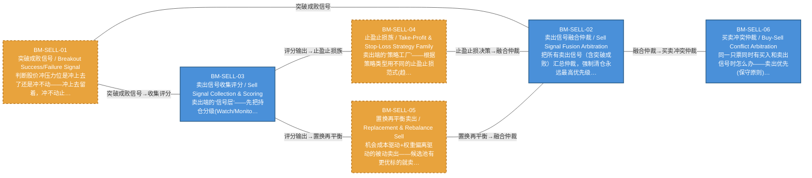

# 作战地图·卖出阶段

> battle_map §sell_flow 阶段，6 环节。

## 阶段图

## 环节详情

### BM-SELL-01 突破成败信号 / Breakout Success/Failure Signal

> **大白话**：判断股价冲压力位是冲上去了还是冲不动——冲上去留着，冲不动止损，连冲3次不行强制清仓。

**机制说明**：

L2-A 层 v4.1。突破成败信号模型：压力位来自 L1 因子层，突破成功（N日站稳+放量）→持有/加仓，突破失败（回落>阈值）→止损，第 K≥3 次挑战失败→强制清仓。

**6 件套（结构化，DB indicators JSONB）**：

| 要素 | 内容 |
|---|---|
| ① 触发条件 | 触及压力位后判定 阈值: N日站稳=成功；回落>阈值=失败；K≥3次失败=强制离场 |
| ② 消费数据/因子 | 压力位（前高/均线/斐波那契）（来自 BM-SEL-02 L1因子层） 挑战次数（来自 L2-A） |
| ③ 参数 | stand_days=N日（范围 3-10，代码当前: 待实现，状态: proposed） fail_pullback_threshold=阈值（范围 -，代码当前: 待实现，状态: proposed） force_exit_attempts=3（范围 2-5，代码当前: 待实现，状态: proposed） |
| ④ 数据流 | 输入: 压力位+挑战次数 → 处理: 突破成败判定 → 输出: 持有/止损/强制清仓信号 → 下游: BM-SELL-02 卖出融合仲裁 |
| ⑤ 代码映射 | MOD-待定 / 草图§1.4 v4.1 |
| ⑥ 降级/中止 | 突破成败判定未就绪 → 降级§8.2 支撑位破位→立即清仓 |

**指标文案（翻译真源 indicators_zh）**：

①触发：触及压力位后判定；②消费：BM-SEL-02 压力位因子 + 挑战次数；③参数：stand_days=N日、fail_pullback_threshold、force_exit_attempts=3；④数据流：压力位+挑战次数→突破成败判定→持有/止损/清仓信号→BM-SELL-02；⑤代码：§1.4 v4.1；⑥降级：判定未就绪→§8.2 支撑位破位立即清仓。

**锚点（环节↔模块双向关联）**：

| 目标图 | 目标ID | 角色 | 状态快照 | 真实build_status |
|---|---|---|---|---|
| depgraph | MOD-SELL-003 | primary | planned | planned |

**有效状态**：🟧 设计态（待施工） ｜ **环节自报**：design ｜ **层**：L2A ｜ **阶段**：sell_flow

### BM-SELL-02 卖出信号融合仲裁 / Sell Signal Fusion Arbitration

> **大白话**：把所有卖出信号（含突破成败）汇总仲裁，强制清仓永远最高优先级，谁的信号最狠听谁的。

**机制说明**：

L3 层。卖出信号融合仲裁：7 类卖出信号+突破成败信号汇总，最高优先级（强制清仓）取胜。卖出决策引擎是复合能力（§20.16），不单独分配 C 编号。

**6 件套（结构化，DB indicators JSONB）**：

| 要素 | 内容 |
|---|---|
| ① 触发条件 | 7类卖出信号+突破成败汇总 阈值: 最高优先级=强制清仓 |
| ② 消费数据/因子 | 突破成败信号（来自 BM-SELL-01） 7类卖出信号（来自 卖出策略工厂） |
| ③ 参数 | signal_count=7+1（范围 -，代码当前: 待实现，状态: proposed） |
| ④ 数据流 | 输入: 多源卖出信号 → 处理: 融合仲裁（最高优先级取胜） → 输出: 卖出决策 → 下游: BM-POS-01 仓位裁决 |
| ⑤ 代码映射 | MOD-待定（D-SELL-DECISION） / 草图§1.4 / 依赖图D-SELL-DECISION |
| ⑥ 降级/中止 | 融合仲裁未就绪 → 降级各卖出信号独立触发（不经融合） |

**指标文案（翻译真源 indicators_zh）**：

①触发：7类卖出信号+突破成败汇总；②消费：BM-SELL-01 突破成败 + 卖出策略工厂7类信号；③参数：signal_count=7+1；④数据流：多源卖出信号→融合仲裁→卖出决策→BM-POS-01；⑤代码：D-SELL-DECISION；⑥降级：融合未就绪→各信号独立触发。

**锚点（环节↔模块双向关联）**：

| 目标图 | 目标ID | 角色 | 状态快照 | 真实build_status |
|---|---|---|---|---|
| depgraph | MOD-SELL-007 | primary | planned | stable |
| depgraph | MOD-SELL-001 | supplement | planned | stable |
| depgraph | MOD-SELL-002 | supplement | planned | planned |

**有效状态**：🟦 运营态（已建） ｜ **环节自报**：design ｜ **层**：L3 ｜ **阶段**：sell_flow

### BM-SELL-03 卖出信号收集评分 / Sell Signal Collection & Scoring

> **大白话**：卖出端的"信号层"——先把持仓分级(Watch/Monitor/Hold)，再收集7类卖出信号，多时间框架共振加权，产出卖出信号评分和紧迫度。

**机制说明**：

§1.4 第零层持仓分级 + 第一层卖出信号层 + v6.0多时间框架共振。
第零层持仓分级(Position Triage)：不是所有持仓都需同等监控。🔴Watch List(亏损接近止损/主力异常/突破关键位/量价背离)→实时卖出信号生成+融合仲裁(秒级)；🟡Monitor List(正常持仓)→定期扫描(5分钟级)；🟢Hold List(深度盈利+远离止损+长期持有)→仅重大事件触发。分级维度：风险敞口/盈亏状态/信号活跃度/流动性/持仓状态机阶段。动态升降：Monitor→Watch(亏损扩大5%)/Watch→Monitor(风险解除)。
第一层7类卖出信号：基本面恶化/技术面顶部形态/量价背离/主力出货/相对强弱/机会成本置换/时间止损。v4.1突破成败信号(已在BM-SELL-01)。v8.2拥挤度卖出信号。
v6.0多时间框架共振：每个卖出信号标注时间框架(日线/60min/15min/5min)，三级嵌套(日线定方向→60min定日内趋势→15min定交易级信号)，共振检测(多时间框架同方向→权重×1.5)，冲突消解(小周期与大周期冲突→大周期为准)。
L2-B/C/D显式注入：L2-B吸筹期降权/出货期加权；L2-C熊市阈值降低/牛市提高；L2-C v8.0日历约束(交割日/财报前/节前)；L2-D黑天鹅→绕过融合仲裁直接强制卖出。

**6 件套（结构化，DB indicators JSONB）**：

| 要素 | 内容 |
|---|---|
| ① 触发条件 | 持仓分级触发(Watch秒级/Monitor 5分钟级/Hold事件驱动) 阈值: Watch List扫描=秒级 |
| ② 消费数据/因子 | 持仓列表(成本/盈亏/天数/状态)（来自 BM-POS-01） 7类卖出信号源（来自 L2-A/L2-B/L2-C/L2-D） L2-B主力阶段（来自 BM-SEL-05） L2-C市场状态+日历约束（来自 BM-SEL-03） L2-D黑天鹅事件（来自 BM-SEL-11） |
| ③ 参数 | Watch List扫描频率=秒级（范围 -，代码当前: 待实现，状态: proposed） Monitor List扫描频率=5分钟（范围 -，代码当前: 待实现，状态: proposed） 共振权重倍数=×1.5（范围 -，代码当前: 待实现，状态: proposed） 时间框架层级=日线→60min→15min（范围 -，代码当前: 待实现，状态: proposed） 熊市卖出阈值降低=—（范围 -，代码当前: 待实现，状态: proposed） |
| ④ 数据流 | 输入: 持仓+7类信号源 → 处理: 分级+收集+多时间框架共振+市场状态条件化权重 → 输出: 卖出信号评分+紧迫度 → 下游: BM-SELL-02 融合仲裁 / BM-SELL-04 止盈止损族 |
| ⑤ 代码映射 | MOD-SELL-001 / 草图§1.4 第一层（MOD-SELL-001收集器+MOD-SELL-002评分器） |
| ⑥ 降级/中止 | 评分器未就绪 → 各卖出信号独立触发不经过融合（保守原则） |

**指标文案（翻译真源 indicators_zh）**：

①触发：持仓分级触发(Watch秒级/Monitor 5分钟级/Hold事件驱动)；②消费：持仓列表(BM-POS-01)+7类卖出信号源(L2A/B/C/D)+主力阶段(BM-SEL-05)+市场状态+日历(BM-SEL-03)+黑天鹅事件(BM-SEL-11)；③参数：Watch秒级/Monitor 5分钟、共振权重×1.5、日线→60min→15min三级(proposed)；④数据流：持仓+信号源→分级+收集+共振+状态条件化权重→评分+紧迫度→融合仲裁/止盈止损族；⑤代码：MOD-SELL-001 收集器(stable)+MOD-SELL-002 评分器(planned)；⑥降级：评分器未就绪→各卖出信号独立触发不经过融合(保守原则)。

**锚点（环节↔模块双向关联）**：

| 目标图 | 目标ID | 角色 | 状态快照 | 真实build_status |
|---|---|---|---|---|
| depgraph | MOD-SELL-001 | primary | stable | stable |
| depgraph | MOD-SELL-002 | supplement | planned | planned |

**有效状态**：🟦 运营态（已建） ｜ **环节自报**：design ｜ **层**：L2A ｜ **阶段**：sell_flow

### BM-SELL-04 止盈止损族 / Take-Profit & Stop-Loss Strategy Family

> **大白话**：卖出端的"策略工厂"——根据策略类型用不同的止盈止损范式(趋势宽止损/均值回归中止损/套利无止损/高频紧止损/Carry宽止损)，叠加猎杀防护和期权定价评估。

**机制说明**：

§1.4 第二层卖出策略工厂(C-006卖出子集) + v6.0策略类型→止损范式映射 + 止损猎杀防护 + 止损期权定价评估。
止盈策略族：固定止盈/移动止盈/分批止盈/时间加权止盈。
v6.0策略类型→止损范式映射层(Strategy-Specific Stop Framework)：趋势跟踪→宽止损(否则必被震出)+移动止损为主；均值回归→中等止损(不盈利=论点错误)+固定止损为主；统计套利→无传统止损(用组合对冲+仓位管理替代)；高频→极紧止损(论点失效立即退出)；Carry→极宽止损或无止损(接受小亏大赚)。
止损策略族：固定止损/波动率止损(ATR)/密度感知止损/移动止损。逻辑止损族：基本面/技术面/事件/主力出货止损。
v6.0止损猎杀防护(Stop-Hunting Protection)：止损位偏移1-2%防猎杀；软止损模式(到达止损位→不立即执行→进入OBSERVING观察期→收盘价<止损位→执行/收回→解除)。
v6.0止损期权定价评估(Stop-Loss as Embedded Option)：设止损=卖出隐含看跌期权→止损越紧隐含期权费越高→成本过高则换退出方式(时间止损/手动观察退出)。
v4.1突破成败策略族：压力位突破失败→止损卖出；第K次挑战失败(K≥3)→强制离场。
v6.0分批退出模式(Scaling Out)：等分退出(1/3-1/3-1/3)/倒金字塔(50%-30%-20%)/混合退出/风险驱动退出/逆向中止(第一批卖出后反弹超X%→暂停剩余批次)。
密度感知动态止盈止损：止盈位=条件PDF的75%分位数(正偏时更高/负偏时更保守)；止损位=条件PDF的5%分位数(厚尾时止损更宽/薄尾时更紧)。

**6 件套（结构化，DB indicators JSONB）**：

| 要素 | 内容 |
|---|---|
| ① 触发条件 | 评分输出>阈值 / 突破成败信号触发 阈值: — |
| ② 消费数据/因子 | 卖出信号评分（来自 BM-SELL-03） 策略类型（来自 L3策略工厂） ATR波动率（来自 BM-SEL-02） 密度PDF分位数（来自 BM-SEL-13） 压力位/支撑位（来自 BM-SEL-02） 突破成败信号（来自 BM-SELL-01） |
| ③ 参数 | 止盈位=PDF 75%分位数（范围 -，代码当前: 待实现，状态: proposed） 止损位=PDF 5%分位数（范围 -，代码当前: 待实现，状态: proposed） 止损偏移=1-2%防猎杀（范围 -，代码当前: 待实现，状态: proposed） 趋势策略止损=宽止损+移动（范围 -，代码当前: 待实现，状态: proposed） 均值回归止损=中等+固定（范围 -，代码当前: 待实现，状态: proposed） 高频止损=极紧（范围 -，代码当前: 待实现，状态: proposed） Carry止损=极宽或无（范围 -，代码当前: 待实现，状态: proposed） |
| ④ 数据流 | 输入: 评分+策略类型+波动率 → 处理: 止盈策略族+止损策略族+逻辑止损族+猎杀防护+期权定价评估 → 输出: 止盈/止损决策(部分/全部清仓) → 下游: BM-SELL-02 融合仲裁 / BM-SELL-05 置换再平衡 |
| ⑤ 代码映射 | MOD-SELL-004 / 草图§1.4 第二层（MOD-SELL-004止盈+MOD-SELL-005止损） |
| ⑥ 降级/中止 | 策略类型→止损范式映射未就绪 → 退化为固定止损范式 |

**指标文案（翻译真源 indicators_zh）**：

①触发：评分输出>阈值/突破成败信号触发；②消费：卖出评分(BM-SELL-03)+策略类型(L3)+ATR波动率(BM-SEL-02)+密度PDF分位数(BM-SEL-13)+压力位/支撑位(BM-SEL-02)+突破成败信号(BM-SELL-01)；③参数：止盈位PDF 75%分位数、止损位PDF 5%分位数、止损偏移1-2%、趋势宽/均值回归中/高频紧/Carry宽(proposed)；④数据流：评分+策略类型+波动率→止盈族+止损族+逻辑止损+猎杀防护+期权定价→止盈/止损决策→融合仲裁/置换再平衡；⑤代码：MOD-SELL-004 止盈(planned)+MOD-SELL-005 止损(planned)；⑥降级：策略类型→止损范式映射未就绪→退化为固定止损范式。

**锚点（环节↔模块双向关联）**：

| 目标图 | 目标ID | 角色 | 状态快照 | 真实build_status |
|---|---|---|---|---|
| depgraph | MOD-SELL-004 | primary | planned | planned |
| depgraph | MOD-SELL-005 | supplement | planned | planned |

**有效状态**：🟧 设计态（待施工） ｜ **环节自报**：design ｜ **层**：L3 ｜ **阶段**：sell_flow

### BM-SELL-05 置换再平衡卖出 / Replacement & Rebalance Sell

> **大白话**：机会成本驱动+权重偏离驱动的被动卖出——候选池有更优标的就卖A买B，权重偏离超阈值或周五强制再平衡就调整，用倒金字塔分批退出。

**机制说明**：

§1.4 第二层置换策略族 + 组合再平衡驱动卖出 + v6.0分批退出模式。
置换策略族：机会成本驱动的卖出(卖A买B)——候选池有更优标的→置换卖出当前持仓中相对弱势的标的。
组合再平衡驱动卖出：权重偏离>阈值→被动卖出。§20.13约束13.3-13.4：组合总仓位漂移>±2%触发再平衡评估；单标的漂移>±3%触发标的级再平衡评估。再平衡执行前必须计算预期收益改善vs交易成本(佣金+滑点+冲击成本)，只有预期收益改善>2×交易成本时才执行。市场状态为⑦阴跌/⑧加速下跌/⑨恐慌崩盘时成本系数×1.5。
v6.0分批退出模式(Scaling Out Architecture)：等分退出(1/3-1/3-1/3)/倒金字塔退出(50%-30%-20%)/混合退出(止盈第一批+移动止损第二批)/风险驱动退出(按MRC减仓)/逆向中止条件(第一批卖出后价格反弹超X%→暂停剩余批次→重新评估)。批次间隔：至少1个交易日/紧迫度>0.8时可缩短至盘中。
再平衡频率(§20.3)：日频信号驱动+周频强制再平衡(每周五收盘后)。

**6 件套（结构化，DB indicators JSONB）**：

| 要素 | 内容 |
|---|---|
| ① 触发条件 | 候选池有更优标的 / 权重偏离>阈值 / 周五强制再平衡 阈值: — |
| ② 消费数据/因子 | 候选池(更优标的)（来自 BM-SEL-21） 当前持仓权重（来自 BM-POS-01） 目标权重（来自 BM-POS-02） 交易成本（来自 BM-EXE-03/C-046） |
| ③ 参数 | 组合漂移阈值=±2%（范围 -，代码当前: 待实现，状态: proposed） 单标的漂移阈值=±3%（范围 -，代码当前: 待实现，状态: proposed） 再平衡收益改善=>2×交易成本（范围 -，代码当前: 待实现，状态: proposed） 倒金字塔减仓=20%-30%-50%（范围 -，代码当前: 待实现，状态: proposed） 批次间隔=1交易日（范围 -，代码当前: 待实现，状态: proposed） 阴跌/加速下跌/恐慌崩盘成本系数=×1.5（范围 -，代码当前: 待实现，状态: proposed） |
| ④ 数据流 | 输入: 候选池+持仓权重 → 处理: 机会成本驱动置换+权重偏离再平衡+倒金字塔分批退出 → 输出: 置换/再平衡卖出清单 → 下游: BM-SELL-02 融合仲裁 → BM-POS-01 仓位调整 |
| ⑤ 代码映射 | MOD-SELL-006 / 草图§1.4 第二层（MOD-SELL-006置换+MOD-POS-004再平衡引擎） |
| ⑥ 降级/中止 | 再平衡引擎未就绪 → 仅机会成本驱动置换，跳过权重偏离再平衡 |

**指标文案（翻译真源 indicators_zh）**：

①触发：候选池有更优标的/权重偏离>阈值/周五强制再平衡；②消费：候选池(BM-SEL-21)+当前持仓权重(BM-POS-01)+目标权重(BM-POS-02)+交易成本(BM-EXE-03)；③参数：组合漂移±2%、单标的±3%、再平衡收益改善>2×成本、倒金字塔20-30-50%、批次间隔1交易日、阴跌/加速下跌/恐慌崩盘成本×1.5(proposed)；④数据流：候选池+持仓权重→机会成本置换+权重偏离再平衡+倒金字塔分批→卖出清单→融合仲裁→仓位调整；⑤代码：MOD-SELL-006 置换(planned)+MOD-POS-004 再平衡引擎(planned)；⑥降级：再平衡引擎未就绪→仅机会成本驱动置换，跳过权重偏离再平衡。

**锚点（环节↔模块双向关联）**：

| 目标图 | 目标ID | 角色 | 状态快照 | 真实build_status |
|---|---|---|---|---|
| depgraph | MOD-SELL-006 | primary | planned | planned |
| depgraph | MOD-POS-004 | supplement | planned | planned |

**有效状态**：🟧 设计态（待施工） ｜ **环节自报**：design ｜ **层**：L3 ｜ **阶段**：sell_flow

### BM-SELL-06 买卖冲突仲裁 / Buy-Sell Conflict Arbitration

> **大白话**：同一只票同时有买入和卖出信号时怎么办——卖出优先(保守原则)；做T信号遇到风控减仓/庄家出货怎么办——直接丢弃；外部指令遇到风控拦截怎么办——风控优先。

**机制说明**：

§1.4 第四层卖出信号融合与仲裁 + §16能力冲突矩阵(权威定义)。
卖出vs买入冲突仲裁：同标的有买入+卖出信号→卖出优先(保守原则)。
部分卖出vs全部清仓决策树：根据卖出紧迫度评分(紧急清仓vs从容退出)+信号强度决定。
卖出紧迫度评分：紧急清仓(黑天鹅/风控熔断)vs从容退出(机会成本/再平衡)。
§16冲突矩阵权威定义的交互规则(与§9.3重叠条目以§16为准)：
  C-004风控拦截 vs C-013外部指令→风控>用户指令，建仓被拦截→通知用户(C-004优先)；
  C-004风控拦截 vs C-031置信度→风控不可被AI否决，人类也不可撤销已执行风控动作(C-004优先)；
  C-012做T vs C-004风控→标的在风控减仓名单→做T信号直接丢弃(C-004优先)；
  C-012做T vs C-035庄家→庄家出货/弃庄阶段→做T信号自动丢弃(C-035优先)；
  流动性不足 vs C-012做T→标的流动性评分低于阈值→做T信号丢弃(流动性优先)；
  C-032资金曲线异常 vs C-004熔断→连续亏损→C-015告警→触发C-031降级(C-032→C-031)；
  相关性体制切换 vs C-004 VaR→相关性趋同→VaR置信度上调+仓位上限降低；
  体制转换预警 vs C-005多情景对策→HMM/CUSUM检测到体制转换→预案自动切换为保守型；
  密度预测尾部风险 vs C-004风控→前瞻性95%CVaR>阈值→触发风控减仓(即使历史模拟VaR未超限)；
  密度预测校准失败 vs C-004风控→尾部校准不通过→前瞻性VaR/CVaR降级为历史模拟+流动性溢价；
  密度预测偏度 vs C-031置信度→PDF偏度与信号方向相反→置信度下调15%→可能降级执行模式。

**6 件套（结构化，DB indicators JSONB）**：

| 要素 | 内容 |
|---|---|
| ① 触发条件 | 同标的同时有买入+卖出信号 / C-012做T vs 风控/庄家 / C-013 vs 风控 阈值: — |
| ② 消费数据/因子 | 买入信号（来自 BM-BUY-04） 卖出信号（来自 BM-SELL-03/04/05） C-012做T信号（来自 BM-BUY-05） C-004风控状态（来自 BM-EXE-01） C-035庄家阶段（来自 BM-SEL-05） C-013外部指令（来自 BM-BUY-06） |
| ③ 参数 | 买卖冲突=卖出优先(保守原则)（范围 -，代码当前: 待实现，状态: proposed） C-012 vs C-004=风控优先（范围 -，代码当前: 待实现，状态: proposed） C-012 vs C-035出货弃庄=做T信号丢弃（范围 -，代码当前: 待实现，状态: proposed） C-013 vs C-004=风控优先（范围 -，代码当前: 待实现，状态: proposed） 流动性不足 vs C-012=做T信号丢弃（范围 -，代码当前: 待实现，状态: proposed） |
| ④ 数据流 | 输入: 买卖信号+做T+外部指令+风控+庄家 → 处理: 冲突检测+优先级仲裁(§16冲突矩阵权威定义) → 输出: 统一决策指令 → 下游: BM-POS-01 仓位裁决 → BM-EXE-01 风控 → BM-EXE-02 执行 |
| ⑤ 代码映射 | MOD-SELL-008 / 草图§1.4 第四层 + §16冲突矩阵 |
| ⑥ 降级/中止 | 仲裁器未就绪 → 按硬规则(卖出优先/风控优先)兜底 |

**指标文案（翻译真源 indicators_zh）**：

①触发：同标的同时有买入+卖出信号/C-012做T vs 风控庄家/C-013 vs 风控；②消费：买入信号(BM-BUY-04)+卖出信号(BM-SELL-03/04/05)+做T信号(BM-BUY-05)+风控状态(BM-EXE-01)+庄家阶段(BM-SEL-05)+外部指令(BM-BUY-06)；③参数：买卖冲突→卖出优先、C-012 vs C-004→风控优先、C-012 vs C-035出货弃庄→做T丢弃、C-013 vs C-004→风控优先、流动性不足 vs C-012→做T丢弃(proposed)；④数据流：买卖信号+做T+外部指令+风控+庄家→冲突检测+优先级仲裁(§16权威)→统一决策→仓位裁决→风控→执行；⑤代码：MOD-SELL-008 buy_sell_conflict_arbitrator(stable)；⑥降级：仲裁器未就绪→按硬规则(卖出优先/风控优先)兜底。

**锚点（环节↔模块双向关联）**：

| 目标图 | 目标ID | 角色 | 状态快照 | 真实build_status |
|---|---|---|---|---|
| depgraph | MOD-SELL-008 | primary | stable | stable |

**有效状态**：🟦 运营态（已建） ｜ **环节自报**：design ｜ **层**：L3.5 ｜ **阶段**：sell_flow

[← 返回总指挥图](battle_map_panorama.md)