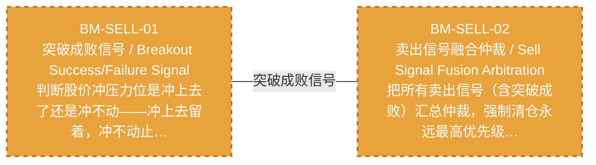

# 作战地图·卖出阶段

> battle_map §sell_flow 阶段，2 环节。

## 阶段图

## 环节详情

### BM-SELL-01 突破成败信号 / Breakout Success/Failure Signal

> **大白话**：判断股价冲压力位是冲上去了还是冲不动——冲上去留着，冲不动止损，连冲3次不行强制清仓。

**机制说明**：

L2-A 层 v4.1。突破成败信号模型：压力位来自 L1 因子层，突破成功（N日站稳+放量）→持有/加仓，突破失败（回落>阈值）→止损，第 K≥3 次挑战失败→强制清仓。

**6 件套（结构化，DB indicators JSONB）**：

| 要素 | 内容 |
|---|---|
| ① 触发条件 | 触及压力位后判定 阈值: N日站稳=成功；回落>阈值=失败；K≥3次失败=强制离场 |
| ② 消费数据/因子 | 压力位（前高/均线/斐波那契）（来自 BM-SEL-02 L1因子层） 挑战次数（来自 L2-A） |
| ③ 参数 | stand_days=N日（范围 3-10，代码当前: 待实现，状态: proposed） fail_pullback_threshold=阈值（范围 -，代码当前: 待实现，状态: proposed） force_exit_attempts=3（范围 2-5，代码当前: 待实现，状态: proposed） |
| ④ 数据流 | 输入: 压力位+挑战次数 → 处理: 突破成败判定 → 输出: 持有/止损/强制清仓信号 → 下游: BM-SELL-02 卖出融合仲裁 |
| ⑤ 代码映射 | MOD-待定 / 草图§1.4 v4.1 |
| ⑥ 降级/中止 | 突破成败判定未就绪 → 降级§8.2 支撑位破位→立即清仓 |

**指标文案（翻译真源 indicators_zh）**：

①触发：触及压力位后判定；②消费：BM-SEL-02 压力位因子 + 挑战次数；③参数：stand_days=N日、fail_pullback_threshold、force_exit_attempts=3；④数据流：压力位+挑战次数→突破成败判定→持有/止损/清仓信号→BM-SELL-02；⑤代码：§1.4 v4.1；⑥降级：判定未就绪→§8.2 支撑位破位立即清仓。

**锚点（环节↔模块双向关联）**：

| 目标图 | 目标ID | 角色 | 状态快照 | 真实build_status |
|---|---|---|---|---|
| depgraph | MOD-SELL-003 | primary | planned | planned |

**有效状态**：🟧 设计态（待施工） ｜ **环节自报**：design ｜ **层**：L2A ｜ **阶段**：sell_flow

### BM-SELL-02 卖出信号融合仲裁 / Sell Signal Fusion Arbitration

> **大白话**：把所有卖出信号（含突破成败）汇总仲裁，强制清仓永远最高优先级，谁的信号最狠听谁的。

**机制说明**：

L3 层。卖出信号融合仲裁：7 类卖出信号+突破成败信号汇总，最高优先级（强制清仓）取胜。卖出决策引擎是复合能力（§20.16），不单独分配 C 编号。

**6 件套（结构化，DB indicators JSONB）**：

| 要素 | 内容 |
|---|---|
| ① 触发条件 | 7类卖出信号+突破成败汇总 阈值: 最高优先级=强制清仓 |
| ② 消费数据/因子 | 突破成败信号（来自 BM-SELL-01） 7类卖出信号（来自 卖出策略工厂） |
| ③ 参数 | signal_count=7+1（范围 -，代码当前: 待实现，状态: proposed） |
| ④ 数据流 | 输入: 多源卖出信号 → 处理: 融合仲裁（最高优先级取胜） → 输出: 卖出决策 → 下游: BM-POS-01 仓位裁决 |
| ⑤ 代码映射 | MOD-待定（D-SELL-DECISION） / 草图§1.4 / 依赖图D-SELL-DECISION |
| ⑥ 降级/中止 | 融合仲裁未就绪 → 降级各卖出信号独立触发（不经融合） |

**指标文案（翻译真源 indicators_zh）**：

①触发：7类卖出信号+突破成败汇总；②消费：BM-SELL-01 突破成败 + 卖出策略工厂7类信号；③参数：signal_count=7+1；④数据流：多源卖出信号→融合仲裁→卖出决策→BM-POS-01；⑤代码：D-SELL-DECISION；⑥降级：融合未就绪→各信号独立触发。

**锚点（环节↔模块双向关联）**：

| 目标图 | 目标ID | 角色 | 状态快照 | 真实build_status |
|---|---|---|---|---|
| depgraph | MOD-SELL-007 | primary | planned | planned |
| depgraph | MOD-SELL-001 | supplement | planned | planned |
| depgraph | MOD-SELL-002 | supplement | planned | planned |

**有效状态**：🟧 设计态（待施工） ｜ **环节自报**：design ｜ **层**：L3 ｜ **阶段**：sell_flow

[← 返回总指挥图](battle_map_panorama.md)