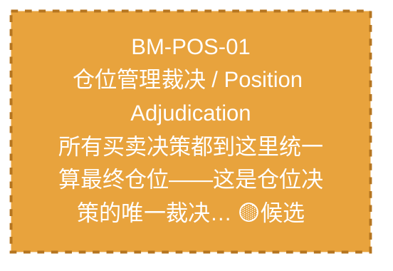

# 作战地图·仓位阶段

> battle_map §position_management 阶段，1 环节。

## 阶段图

## 环节详情

### BM-POS-01 仓位管理裁决 / Position Adjudication

> **大白话**：所有买卖决策都到这里统一算最终仓位——这是仓位决策的唯一裁决中心，谁都别想绕过。

**机制说明**：

L3.5 层。C-047（P0，v4.0 新增）仓位管理唯一裁决中心，嵌入决策编排器和 C-004 之间。所有仓位决策（含分批仓位方案）经 C-047 裁决后才进入风控审批和执行。

**6 件套（结构化，DB indicators JSONB）**：

| 要素 | 内容 |
|---|---|
| ① 触发条件 | 编排后决策（买/卖）就绪 阈值: 仓位决策唯一裁决中心 |
| ② 消费数据/因子 | 编排后决策（来自 BM-BUY-03） 卖出决策（来自 BM-SELL-02） 分批仓位方案（来自 BM-BUY-04） |
| ③ 参数 | position_cap=目标仓位（范围 -，代码当前: 待实现，状态: proposed） |
| ④ 数据流 | 输入: 买/卖决策+分批方案 → 处理: C-047 仓位唯一裁决 → 输出: 最终仓位指令 → 下游: BM-EXE-01 风控审批 |
| ⑤ 代码映射 | C-047 / 草图§1.8 主动脉（v4.0新增 P0） |
| ⑥ 降级/中止 | C-047 不可用 → 降级固定比例仓位查表 |

**指标文案（翻译真源 indicators_zh）**：

①触发：编排后决策（买/卖）就绪；②消费：BM-BUY-03 编排决策 + BM-SELL-02 卖出决策 + BM-BUY-04 分批方案；③参数：position_cap=目标仓位；④数据流：买/卖决策+分批方案→C-047唯一裁决→最终仓位指令→BM-EXE-01；⑤代码：C-047 §1.8（v4.0 P0）；⑥降级：C-047 不可用→固定比例仓位查表。

**锚点（环节↔模块双向关联）**：

| 目标图 | 目标ID | 角色 | 状态快照 | 真实build_status |
|---|---|---|---|---|
| depgraph | MOD-POS-001 | primary | planned | planned |
| candidate | CAND-HARVEST-0019 | supplement | candidate | — |

**有效状态**：🟧 设计态（待施工） ｜ **环节自报**：design ｜ **层**：L3.5 ｜ **阶段**：position_management

[← 返回总指挥图](battle_map_panorama.md)