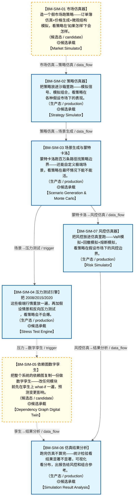

# 作战地图·仿真验证阶段

> **[可缩放 HTML 版 / Zoomable HTML](http://localhost:8765/docs/02_enterprise_architecture/07_trading_decision_architecture/battle_map/_zoomable_html/battle_map_04_simulation_validation.html)** — Ctrl+滚轮缩放 ｜ 双击重置 ｜ Ctrl+Shift+D 切换拖动/选择模式

> battle_map §simulation_validation 阶段，7 环节（18 锚点）。
> 🔑 锚点表 `battle_map_anchors` 是环节↔模块**双向对齐枢纽**（step↔module 唯一查找真源），详见各环节「锚点」小节。
> 本文档由 `generate_battle_map_diagram.py` 自动生成，禁止手编。

## 文档基本信息 / Document Overview

| 字段 | 值 | Field | Value |
|------|------|-------|-------|
| 阶段 | 仿真验证（simulation_validation） | Stage | 仿真验证 |
| 环节数 | 7 | Steps | 7 |
| 锚点数（双向对齐） | 18 | Anchors (Bidirectional) | 18 |
| 流转边 | 9 | Edges | 9 |
| 状态分布 | 🟦 运营态（已建）=5 ｜ 🟨 候选态（候选池）=2 | State Distribution | 🟦 运营态（已建）=5 ｜ 🟨 候选态（候选池）=2 |

> **图例说明 / Legend**：
> - 🟦 **蓝色实线 = 运营态环节**（production，锚点模块已建）
> - 🟧 **橙色虚线 = 设计态环节**（design，锚点模块待施工）
> - 🟧**设计态子环节** = 父环节已建但此子环节待施工（特殊标记，易被忽略）
> - 🟥 **红色 = 弃用态**（deprecated）
> - ⬜ **灰色 = 缺失态**（missing，环节无锚点，BM-INV-001 违例）
> - 🟨 **黄色虚线 = 候选态**（candidate，承载模块在候选池）
> - **实线箭头 ``-->`` = 运营态流转**（两端均 production）
> - **虚线箭头 ``-.->`` = 非运营态流转**（含设计/候选/混合）

## 阶段图 / Stage Diagram

> 展示 仿真验证 阶段全部 7 个环节及流转边，颜色区分五态。

## 环节详情

### BM-SIM-01 市场仿真器 / Market Simulator

> **大白话**：造一个假市场跑策略——订单簿仿真+价格生成+微观结构模拟，看策略在"如果怎样"下会怎样。

**机制说明**：

D-SIMULATION-01 Market Simulator 提供市场仿真器+订单簿仿真+价格生成+微观结构模拟（P0）；
D-SIMULATION-07 History Replay Engine 提供历史重放引擎+逐Tick回放+时间压缩。
与 D-BACKTEST 的区别：回测=过去怎样(真实历史)，仿真=如果怎样(假设场景)。
是仿真验证的核心入口，P0 模块。

**6 件套（结构化，DB indicators JSONB）**：

| 要素 | 内容 |
|---|---|
| ① 触发条件 | — |
| ② 消费数据/因子 | — |
| ③ 参数 | — |
| ④ 数据流 | 输入: — → 处理: — → 输出: — → 下游: — |
| ⑤ 代码映射 | — / — |
| ⑥ 降级/中止 | — |

**指标文案（翻译真源 indicators_zh）**：

①触发：BM-BT-07 回测通过/研究员配置；②消费：BM-BT-01 回测引擎+策略代码；③参数：订单簿仿真、价格生成、微观结构模拟、逐Tick回放、时间压缩；④数据流：策略+仿真市场→撮合仿真→仿真成交→仿真结果→BM-SIM-06分析；⑤代码：D-SIMULATION-01/07（planned）；⑥降级：市场仿真器未就绪→仅历史回测(无what-if能力)。

**锚点（环节↔模块双向关联）**：

| 目标图 | 目标ID | 角色 | 状态快照 | 真实build_status |
|---|---|---|---|---|
| candidate | CAND-HARVEST-0143 | primary | planned | — |
| candidate | CAND-HARVEST-0148 | supplement | planned | — |
| candidate | CAND-HARVEST-0791 | supplement | planned | — |
| candidate | CAND-HARVEST-0793 | supplement | planned | — |

**有效状态**：🟨 候选态（候选池） ｜ **环节自报**：production ｜ **层**：L13 ｜ **阶段**：simulation_validation

### BM-SIM-02 策略仿真器 / Strategy Simulator

> **大白话**：把策略放进沙箱里跑——模拟信号、模拟组合，看策略在各种假设市场下的表现。

**机制说明**：

D-SIMULATION-02 Strategy Simulator 提供策略仿真器+策略沙箱+信号模拟+组合模拟（P0）。
与 BM-SIM-01 市场仿真器配合——市场仿真器造环境，策略仿真器跑策略。
是"策略压力测试"的核心承载。

**6 件套（结构化，DB indicators JSONB）**：

| 要素 | 内容 |
|---|---|
| ① 触发条件 | — |
| ② 消费数据/因子 | — |
| ③ 参数 | — |
| ④ 数据流 | 输入: — → 处理: — → 输出: — → 下游: — |
| ⑤ 代码映射 | — / — |
| ⑥ 降级/中止 | — |

**指标文案（翻译真源 indicators_zh）**：

①触发：BM-SIM-01 市场仿真就绪；②消费：策略代码+BM-SIM-01 仿真市场；③参数：策略沙箱、信号模拟、组合模拟；④数据流：策略+仿真市场→策略沙箱→信号模拟+组合模拟→仿真PnL→BM-SIM-06；⑤代码：D-SIMULATION-02（planned）；⑥降级：策略仿真器未就绪→仅回测(无沙箱隔离)。

**锚点（环节↔模块双向关联）**：

| 目标图 | 目标ID | 角色 | 状态快照 | 真实build_status |
|---|---|---|---|---|
| depgraph | MOD-SIM-002 | primary | stable | stable |
| candidate | CAND-HARVEST-0144 | supplement | planned | — |

**有效状态**：🟦 运营态（已建） ｜ **环节自报**：production ｜ **层**：L13 ｜ **阶段**：simulation_validation

### BM-SIM-03 场景生成与蒙特卡洛 / Scenario Generation & Monte Carlo

> **大白话**：蒙特卡洛跑百万条路径找策略边界——还能自定义极端场景，看策略在最坏情况下能不能活。

**机制说明**：

D-SIMULATION-05 Scenario Generator 提供场景生成器+蒙特卡洛+历史场景+自定义场景；
D-SIMULATION-06 Monte Carlo Engine 提供蒙特卡洛模拟+GPU加速+百万路径。
是"如果怎样"的批量版本，产出策略在各种场景下的表现分布。

**6 件套（结构化，DB indicators JSONB）**：

| 要素 | 内容 |
|---|---|
| ① 触发条件 | — |
| ② 消费数据/因子 | — |
| ③ 参数 | — |
| ④ 数据流 | 输入: — → 处理: — → 输出: — → 下游: — |
| ⑤ 代码映射 | — / — |
| ⑥ 降级/中止 | — |

**指标文案（翻译真源 indicators_zh）**：

①触发：BM-SIM-02 策略仿真后/研究员配置；②消费：BM-SIM-02 仿真结果+场景定义；③参数：蒙特卡洛路径数、GPU加速、历史场景库、自定义场景；④数据流：场景定义→蒙特卡洛百万路径→仿真结果分布→BM-SIM-06分析；⑤代码：D-SIMULATION-05/06（planned）；⑥降级：蒙特卡洛未就绪→少量场景手动跑(无统计意义)。

**锚点（环节↔模块双向关联）**：

| 目标图 | 目标ID | 角色 | 状态快照 | 真实build_status |
|---|---|---|---|---|
| depgraph | MOD-SIM-005 | primary | stable | stable |
| candidate | CAND-HARVEST-0147 | supplement | planned | — |

**有效状态**：🟦 运营态（已建） ｜ **环节自报**：production ｜ **层**：L13 ｜ **阶段**：simulation_validation

### BM-SIM-07 风控仿真器 / Risk Simulator

> **大白话**：把风控放进仿真里跑——VaR模拟+回撤模拟+熔断模拟，看策略在假设市场下的风控边界。

**机制说明**：

D-SIMULATION-03 Risk Simulator 提供风控仿真器+VaR模拟+回撤模拟+熔断模拟（P1）。
与 D-RISK 联动——仿真侧造假设场景跑风控，风控侧落地参数。
已建成 MOD-SIM-003 risk_simulator.py（stable），是仿真验证阶段的风控能力承载。

**6 件套（结构化，DB indicators JSONB）**：

| 要素 | 内容 |
|---|---|
| ① 触发条件 | — |
| ② 消费数据/因子 | — |
| ③ 参数 | — |
| ④ 数据流 | 输入: — → 处理: — → 输出: — → 下游: — |
| ⑤ 代码映射 | — / — |
| ⑥ 降级/中止 | — |

**指标文案（翻译真源 indicators_zh）**：

①触发：BM-SIM-03 蒙特卡洛完成/风控参数调整；②消费：BM-SIM-01 仿真市场+BM-SIM-03 蒙特卡洛路径；③参数：VaR模拟、回撤模拟、熔断模拟；④数据流：仿真市场+MC路径→风控仿真→VaR/回撤/熔断评估→BM-SIM-06分析+D-RISK风控参数；⑤代码：MOD-SIM-003 risk_simulator.py（stable）；⑥降级：风控仿真器未就绪→仅历史VaR(无蒙特卡洛VaR)。

**锚点（环节↔模块双向关联）**：

| 目标图 | 目标ID | 角色 | 状态快照 | 真实build_status |
|---|---|---|---|---|
| depgraph | MOD-SIM-003 | primary | stable | generated |

**有效状态**：🟦 运营态（已建） ｜ **环节自报**：production ｜ **层**：L13 ｜ **阶段**：simulation_validation

### BM-SIM-04 压力测试引擎 / Stress Test Engine

> **大白话**：把 2008/2015/2020 这些极端行情重放一遍，再加假设情景和反向压力测试，看策略会不会爆。

**机制说明**：

D-SIMULATION-04 Stress Test Engine 提供压力测试引擎+极端场景+历史重放（testing, 部分在D-RISK-05）；
D-SIMULATION-10 Extreme Event Simulator 提供极端事件仿真+黑天鹅+闪崩+熔断（P2）。
与 D-RISK RK-12 Stress Test Engine 联动——仿真侧造场景，风控侧评估影响。

**6 件套（结构化，DB indicators JSONB）**：

| 要素 | 内容 |
|---|---|
| ① 触发条件 | — |
| ② 消费数据/因子 | — |
| ③ 参数 | — |
| ④ 数据流 | 输入: — → 处理: — → 输出: — → 下游: — |
| ⑤ 代码映射 | — / — |
| ⑥ 降级/中止 | — |

**指标文案（翻译真源 indicators_zh）**：

①触发：BM-SIM-03 场景生成后/定时压力测试；②消费：BM-SIM-03 极端场景+历史极端事件库；③参数：历史情景(2008/2015/2020)、假设情景、反向压力测试、敏感性分析、传染效应；④数据流：极端场景→压力测试→策略表现→BM-SIM-06分析+D-RISK风控参数调整；⑤代码：D-SIMULATION-04（testing）+D-SIMULATION-10（planned）；⑥降级：极端事件仿真器未就绪→仅历史重放(无黑天鹅模拟)。

**锚点（环节↔模块双向关联）**：

| 目标图 | 目标ID | 角色 | 状态快照 | 真实build_status |
|---|---|---|---|---|
| depgraph | MOD-RK-12 | primary | stable | stable |
| candidate | CAND-HARVEST-0792 | supplement | planned | — |

**有效状态**：🟦 运营态（已建） ｜ **环节自报**：production ｜ **层**：L13 ｜ **阶段**：simulation_validation

### BM-SIM-05 依赖图数字孪生 / Dependency Graph Digital Twin

> **大白话**：把整个系统的依赖图复制一份做数字孪生——改任何模块前先在孪生上 what-if 一遍，预测变更影响。

**机制说明**：

D-SIMULATION-13 Dependency Graph Digital Twin 提供依赖图数字孪生+what-if仿真+批量/流式/实时三种模式+依赖拓扑实时映射（P2）；
D-SIMULATION-14 Real-time DT Synchronizer 提供实时数字孪生同步器+依赖图实时同步+预测仿真+变更预演（P2）。
是"架构变更"的仿真验证，防止"改一个模块炸一片"。

**6 件套（结构化，DB indicators JSONB）**：

| 要素 | 内容 |
|---|---|
| ① 触发条件 | — |
| ② 消费数据/因子 | — |
| ③ 参数 | — |
| ④ 数据流 | 输入: — → 处理: — → 输出: — → 下游: — |
| ⑤ 代码映射 | — / — |
| ⑥ 降级/中止 | — |

**指标文案（翻译真源 indicators_zh）**：

①触发：架构变更前/混沌实验；②消费：depgraph 依赖图+模块状态；③参数：what-if仿真、批量/流式/实时三模式、依赖拓扑实时映射、变更预演；④数据流：depgraph→数字孪生→what-if仿真→变更影响预测→ADR决策；⑤代码：D-SIMULATION-13/14（planned）；⑥降级：数字孪生未就绪→人工评估变更影响(精度低)。

**锚点（环节↔模块双向关联）**：

| 目标图 | 目标ID | 角色 | 状态快照 | 真实build_status |
|---|---|---|---|---|
| candidate | CAND-HARVEST-0795 | primary | planned | — |
| candidate | CAND-HARVEST-0796 | supplement | planned | — |
| candidate | CAND-HARVEST-0797 | supplement | planned | — |
| candidate | CAND-HARVEST-0798 | supplement | planned | — |
| candidate | CAND-HARVEST-0799 | supplement | planned | — |

**有效状态**：🟨 候选态（候选池） ｜ **环节自报**：production ｜ **层**：L13 ｜ **阶段**：simulation_validation

### BM-SIM-06 仿真结果分析 / Simulation Result Analysis

> **大白话**：跑完仿真不算完——统计检验看结果显著不显著，可视化看分布，出报告给风控和组合参考。

**机制说明**：

D-SIMULATION-12 Simulation Result Analyzer 提供仿真结果分析+统计检验+可视化。
汇总 BM-SIM-01~05 的仿真产出，产出 SimulationResult 事件喂 D-RISK 和 D-PF-CORE。
是仿真验证的"出口"，决定仿真结论能否影响实盘决策。

**6 件套（结构化，DB indicators JSONB）**：

| 要素 | 内容 |
|---|---|
| ① 触发条件 | — |
| ② 消费数据/因子 | — |
| ③ 参数 | — |
| ④ 数据流 | 输入: — → 处理: — → 输出: — → 下游: — |
| ⑤ 代码映射 | — / — |
| ⑥ 降级/中止 | — |

**指标文案（翻译真源 indicators_zh）**：

①触发：BM-SIM-01~05 仿真完成；②消费：仿真成交+PnL+场景结果；③参数：统计检验、可视化、报告生成；④数据流：仿真结果→统计检验+可视化→SimulationResult事件→D-RISK风控参数+D-PF-CORE组合参考；⑤代码：D-SIMULATION-12（planned）；⑥降级：结果分析器未就绪→原始仿真数据(无统计检验,人工分析)。

**锚点（环节↔模块双向关联）**：

| 目标图 | 目标ID | 角色 | 状态快照 | 真实build_status |
|---|---|---|---|---|
| depgraph | MOD-SIM-012 | primary | stable | stable |
| candidate | CAND-HARVEST-0794 | supplement | planned | — |

**有效状态**：🟦 运营态（已建） ｜ **环节自报**：production ｜ **层**：L13 ｜ **阶段**：simulation_validation

[← 返回总指挥图](battle_map_panorama.md)