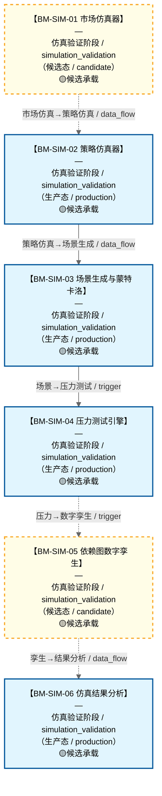

# 作战地图·仿真验证阶段

> **[可缩放 HTML 版 / Zoomable HTML](http://localhost:8765/docs/02_enterprise_architecture/07_trading_decision_architecture/battle_map/_zoomable_html/battle_map_04_simulation_validation.html)** — Ctrl+滚轮缩放 ｜ 双击重置 ｜ Ctrl+Shift+D 切换拖动/选择模式

> battle_map §simulation_validation 阶段，6 环节。
> 本文档由 `generate_battle_map_diagram.py` 自动生成，禁止手编。

## 文档基本信息 / Document Overview

| 字段 | 值 | Field | Value |
|------|------|-------|-------|
| 阶段 | 仿真验证（simulation_validation） | Stage | 仿真验证 |
| 环节数 | 6 | Steps | 6 |
| 流转边 | 7 | Edges | 7 |
| 状态分布 | 🟦 运营态（已建）=4 ｜ 🟨 候选态（候选池）=2 | State Distribution | 🟦 运营态（已建）=4 ｜ 🟨 候选态（候选池）=2 |

> **图例说明 / Legend**：
> - 🟦 **蓝色实线 = 运营态环节**（production，锚点模块已建）
> - 🟧 **橙色虚线 = 设计态环节**（design，锚点模块待施工）
> - 🟥 **红色 = 弃用态**（deprecated）
> - ⬜ **灰色 = 缺失态**（missing，环节无锚点，BM-INV-001 违例）
> - 🟨 **黄色虚线 = 候选态**（candidate，承载模块在候选池）
> - **实线箭头 ``-->`` = 运营态流转**（两端均 production）
> - **虚线箭头 ``-.->`` = 非运营态流转**（含设计/候选/混合）

## 阶段图 / Stage Diagram

> 展示 仿真验证 阶段全部 6 个环节及流转边，颜色区分五态。

## 环节详情

### BM-SIM-01 市场仿真器

**6 件套（结构化，DB indicators JSONB）**：

| 要素 | 内容 |
|---|---|
| ① 触发条件 | — |
| ② 消费数据/因子 | — |
| ③ 参数 | — |
| ④ 数据流 | 输入: — → 处理: — → 输出: — → 下游: — |
| ⑤ 代码映射 | — / — |
| ⑥ 降级/中止 | — |

**锚点（环节↔模块双向关联）**：

| 目标图 | 目标ID | 角色 | 状态快照 | 真实build_status |
|---|---|---|---|---|
| candidate | CAND-HARVEST-0143 | primary | planned | — |
| candidate | CAND-HARVEST-0148 | supplement | planned | — |

**有效状态**：🟨 候选态（候选池） ｜ **环节自报**：production ｜ **层**：L13 ｜ **阶段**：simulation_validation

### BM-SIM-02 策略仿真器

**6 件套（结构化，DB indicators JSONB）**：

| 要素 | 内容 |
|---|---|
| ① 触发条件 | — |
| ② 消费数据/因子 | — |
| ③ 参数 | — |
| ④ 数据流 | 输入: — → 处理: — → 输出: — → 下游: — |
| ⑤ 代码映射 | — / — |
| ⑥ 降级/中止 | — |

**锚点（环节↔模块双向关联）**：

| 目标图 | 目标ID | 角色 | 状态快照 | 真实build_status |
|---|---|---|---|---|
| depgraph | MOD-SIM-002 | primary | stable | stable |
| candidate | CAND-HARVEST-0144 | supplement | planned | — |

**有效状态**：🟦 运营态（已建） ｜ **环节自报**：production ｜ **层**：L13 ｜ **阶段**：simulation_validation

### BM-SIM-03 场景生成与蒙特卡洛

**6 件套（结构化，DB indicators JSONB）**：

| 要素 | 内容 |
|---|---|
| ① 触发条件 | — |
| ② 消费数据/因子 | — |
| ③ 参数 | — |
| ④ 数据流 | 输入: — → 处理: — → 输出: — → 下游: — |
| ⑤ 代码映射 | — / — |
| ⑥ 降级/中止 | — |

**锚点（环节↔模块双向关联）**：

| 目标图 | 目标ID | 角色 | 状态快照 | 真实build_status |
|---|---|---|---|---|
| depgraph | MOD-SIM-005 | primary | stable | stable |
| candidate | CAND-HARVEST-0147 | supplement | planned | — |

**有效状态**：🟦 运营态（已建） ｜ **环节自报**：production ｜ **层**：L13 ｜ **阶段**：simulation_validation

### BM-SIM-04 压力测试引擎

**6 件套（结构化，DB indicators JSONB）**：

| 要素 | 内容 |
|---|---|
| ① 触发条件 | — |
| ② 消费数据/因子 | — |
| ③ 参数 | — |
| ④ 数据流 | 输入: — → 处理: — → 输出: — → 下游: — |
| ⑤ 代码映射 | — / — |
| ⑥ 降级/中止 | — |

**锚点（环节↔模块双向关联）**：

| 目标图 | 目标ID | 角色 | 状态快照 | 真实build_status |
|---|---|---|---|---|
| depgraph | MOD-RK-12 | primary | stable | stable |
| candidate | CAND-HARVEST-0792 | supplement | planned | — |

**有效状态**：🟦 运营态（已建） ｜ **环节自报**：production ｜ **层**：L13 ｜ **阶段**：simulation_validation

### BM-SIM-05 依赖图数字孪生

**6 件套（结构化，DB indicators JSONB）**：

| 要素 | 内容 |
|---|---|
| ① 触发条件 | — |
| ② 消费数据/因子 | — |
| ③ 参数 | — |
| ④ 数据流 | 输入: — → 处理: — → 输出: — → 下游: — |
| ⑤ 代码映射 | — / — |
| ⑥ 降级/中止 | — |

**锚点（环节↔模块双向关联）**：

| 目标图 | 目标ID | 角色 | 状态快照 | 真实build_status |
|---|---|---|---|---|
| candidate | CAND-HARVEST-0795 | primary | planned | — |
| candidate | CAND-HARVEST-0796 | supplement | planned | — |

**有效状态**：🟨 候选态（候选池） ｜ **环节自报**：production ｜ **层**：L13 ｜ **阶段**：simulation_validation

### BM-SIM-06 仿真结果分析

**6 件套（结构化，DB indicators JSONB）**：

| 要素 | 内容 |
|---|---|
| ① 触发条件 | — |
| ② 消费数据/因子 | — |
| ③ 参数 | — |
| ④ 数据流 | 输入: — → 处理: — → 输出: — → 下游: — |
| ⑤ 代码映射 | — / — |
| ⑥ 降级/中止 | — |

**锚点（环节↔模块双向关联）**：

| 目标图 | 目标ID | 角色 | 状态快照 | 真实build_status |
|---|---|---|---|---|
| depgraph | MOD-SIM-012 | primary | stable | stable |
| candidate | CAND-HARVEST-0794 | supplement | planned | — |

**有效状态**：🟦 运营态（已建） ｜ **环节自报**：production ｜ **层**：L13 ｜ **阶段**：simulation_validation

[← 返回总指挥图](battle_map_panorama.md)